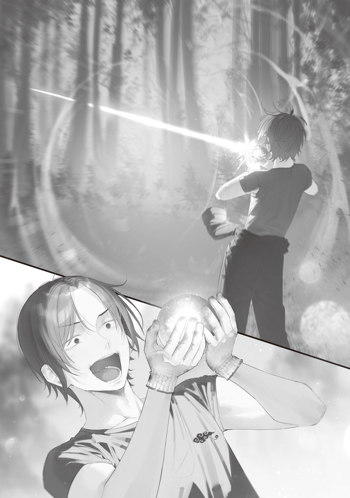

The good thing about online auctions was that I could make money without seeing anyone face-to-face.

They were a godsend for someone like me who liked being alone.

I'd bounced between all kinds of jobs since entering the workforce, but I couldn't stand seeing people or talking to them. The stress made me sick, so I shut myself away in a rented house in Okutama and started making a living through online auctions.

With a small vegetable patch, a well, delivery services (doorstep drop-off), and online auctions, I could go all year without seeing anyone face-to-face.

At first, I made money by relisting repaired items.

The one thing I'd always been supremely confident in was working with my hands, and sure enough, I managed to fix every piece of junk I bought thinking I could repair it.

I bought broken antique clocks, old mechanical dolls, rusted safes with missing keys, and the like for cheap, repaired and repainted them, then relisted them. That earned me just enough to get by.

But competitors were everywhere, and someone doing the same thing often bought an item I had my eye on before I could. Besides, affordable items weren't listed consistently.

Making money by relying on other people's listings wasn't stable.

So I decided to become a producer myself.

Instead of buying broken goods, repairing them, and relisting them, I'd make original products from scratch and put those up for sale.

I made all sorts of things, like marquetry puzzle boxes, snow globes, artificial flowers, and models, but the things that sold most steadily and for the highest prices were replica weapons from popular anime.

Anime often featured magic swords and mysterious wands, and the official rights holders released that kind of merchandise.

But they looked cheap and obviously toy-like, came in limited runs with only a few for sale, cost too much, or took months to arrive after you ordered them.

So every week I checked the popular anime airing that season and picked out weapons that looked like something I could make and sell. If I was quick, I made a replica and put it up for sale the same week the weapon appeared in the anime.

They didn't sell much at first, but the anime's popularity helped, and before long they started selling at the buy-it-now price. Becoming known as a reliable seller helped a lot too.

Reproducing complex transformation mechanisms, making my own perfume inspired by the characters who used the weapons and scenting the items with it, and even caring about how the paint color came out, the feel of the materials, and durability all paid off. Products I billed as "seriously realistic" were insanely popular.

My pockets filled up. I was able to buy a full set of crafting equipment, more than cover material costs, and even save money. I no longer had to do something as pathetic as sneaking into junkyards to gather materials. I could afford to buy materials online or buy a piece of mountainside land and cut down the trees myself.

Auctioning anime goods was the perfect job. It let me profit from my hobby, and I didn't have to meet anyone.

Of course, there were problems too.

For example, I had no answer at all to comments asking, "Do you have permission from the anime's official rights holders to sell these?" I was so scared of being sued by them that buying the full range of official merchandise and displaying it on my household shrine became a habit. I tried to overlap with their product lineup as little as possible, but I was still selling without permission.

Reselling was a problem too. Shameless bastards would immediately buy items I'd listed and resell them at high prices. It pissed me off, but I was also a shameless bastard selling goods without permission from the official rights holders. It pissed me off that I couldn't come down hard on them.

Of course, I considered getting official permission or approaching them about a merchandise sales partnership. But I was a certified social misfit, by my own admission and everyone else's. Just imagining the effort and social interaction involved in dealing with the official rights holders made my stomach hurt and left me feeling like I might throw up.

This was a job I did so I could live without meeting or talking to people. Meeting and talking to people for the job would have been completely backwards.

Even with those problems, I was living a mostly fulfilling life deep in the mountains when I found a meteorite in my backyard one day.

The meteorite lying in a small crater was still a little warm, which suggested it had come from last night's meteor shower.

Overjoyed, I picked up the meteorite and immediately took it home.

Making fantasy weapons had started out as work to make money, but as my skills improved, it became more fun and turned into my life's work. A magic weapon forged from a meteorite... Nothing could have been more packed with fantasy and romance.

I could make it a wand. I could make it a sword. Would making it a gun be trying too hard to be weird?

When I examined the meteorite closely, I found a clear, gemlike crystal at the center of an outer shell made from a mixture of metal and rock.

If I carefully carved it out, a giant rough gemstone the size of a clenched fist would appear.

Some weapons in anime used gemstones (often called magic stones or spirit gems in the story), so I had some gemstone knowledge too.

But even when I compared it against gemstone guidebooks, I couldn't find a matching gem.

I brought out a polarizing plate and a spectroscope to appraise it, but I still couldn't pin down what it was. Worse, the appraisal revealed that its hardness was abnormal.

The gem dug out of the meteorite was harder than diamond.

It had the mythical Mohs hardness of 11. It was harder than any substance on Earth should have been.

Could that even be possible? Just as I was about to look it up online, I noticed another abnormality.

My computer didn't work. No matter how many times I pressed the power button, the screen stayed completely black. It didn't do a thing. My smartphone was silent too.

The sun had set and it was getting dark, so I tried to turn on the lights, but they didn't come on. The electricity was out too.

I was more suspicious than anxious.

The power was out...?

Had some disaster happened down at the foot of the mountain? There hadn't been any typhoon-like wind or rain, and I hadn't felt any earthquake tremors. It was spring, so this wasn't even the season for power shortages.

It was a little strange, but well, it wasn't anything to panic about.

Disaster recovery was fast in Japan. At the earliest, the power would be back tomorrow. At the absolute latest, it would take a few weeks.

Because I lived alone as a shut-in deep in the mountains, I kept a huge food stockpile. My first-aid kit was fully stocked too. It hurt not being able to use online auctions, but I wasn't so short on money that missing a few weeks of listings would leave me broke.

I tried to keep investigating the gem by the light of my emergency flashlight, but it wouldn't turn on either.

Well, it was a flashlight that came with the rental house and looked older than me. The batteries had probably died from self-discharge. I should've bought spares.

With no other choice, I used a match to light an aromatherapy candle I'd planned to put up for sale and got some light that way.

Having no electricity or internet was inconvenient, but I just had to tough it out for a few days.

I'd take my time investigating this amazing gem from space while I waited for the utilities to come back.

---

Over seven days, I examined and processed the gem from the meteorite.

This gem, which I named "Okutameteorite" after Okutama, where I found it, had a Mohs hardness of 11. Its refractive index was 1.55, its specific gravity was 7.7, and it weighed 2,300 g. Its color was dark bluish gray.

In other words, it was a black, fist-sized gem harder than diamond, glittering like quartz, and about as heavy as iron.

I carved this Okutameteorite into a sphere, taking extreme care, and polished it.

A mineral could be very hard and difficult to scratch but still have low strength and break easily. It resisted scratches, but not impacts like a whack from a hammer.

So first, I carved the rough stone into a sphere with a chisel and carving knife.

Then I crushed the flakes, ground them up, and sifted out a fine powder.

Finally, I used the powder as an abrasive to polish it. That completed the beautiful, glossy sphere.

There were all kinds of ways to cut gems, but given the rough stone's shape and properties, I decided a sphere was best.

I was entranced as I stared at the beautiful finished gem.

Quite apart from its romantic, mysterious history as a giant gem carved out of a meteorite, it had a strange appeal that seemed to draw me in. For some reason, I never got tired of looking at it, no matter how long I stared.

I'd handled all kinds of gemstones in my line of work. But I'd never encountered one that moved me this much.

I felt like I understood why famous gemstones had inspired bloody conspiracies throughout history...

After taking a breather and spending a good few hours zoning out while I admired the gem from every angle, I suddenly remembered my current situation.

I'd gotten lost in polishing it, but come to think of it, the power was still out after seven days.

For that matter, the water supply had been out for a few days too, and now I was relying on the old well in my backyard.

I had plenty of rice and instant food stocked up. I could harvest vegetables in the backyard. If I gathered firewood in the mountains, I could light the dust-covered fireplace even if the gas was out.

So I was totally fine for at least another month.

Still, I was starting to wonder.

If the power still hadn't been restored after seven days, a massive disaster must have happened.

I wanted to believe restoration was at least making progress around the city center, but it would probably take a little longer to reach mountainous Okutama—a backwater despite being part of Tokyo.

I wondered what had happened and what was going on out there. A localized earthquake? A tornado? It couldn't be terrorism or a missile strike, could it?

I wanted to know what was going on. I did, but leaving the house to find out felt like a pain.

To buy a newspaper, I'd have to endure the terrifying experience of meeting a store clerk and paying at the register, and going into town to stop someone and ask what was happening would take more courage than bungee jumping.

I didn't want to meet anyone, and I didn't want to talk to anyone. That was the whole reason I lived quietly in a detached house deep in the mountains.

Well, I was worried and uneasy, but there was probably no need to take it that seriously.

The electricity and internet had only been out for seven days.

Japan might have been disaster-prone, but expecting them to completely restore everything out in a remote place deep in the mountains in seven days was asking way too much.

There was no need to panic or make a fuss. I could just take it easy and wait.

Japan's government was pretty competent, all things considered. If I was a good boy and waited quietly, they would definitely give me my old life back. It wasn't like I was living in dire straits anyway.

I'd take my time making and decorating hobby weapons packed with fantasy and romance using this beautiful gem, Okutameteorite, while I waited for the utilities to come back.

---

Another seven days passed. I stood there holding Okutameteorite up in both hands, dumbfounded by the crack in my wall.

I could've sworn some kind of beam had just shot out of Okutameteorite and slammed into the wall...?

It had started with my investigation into Okutameteorite's properties.

The power and internet were still down, so I couldn't look into whether any similar gemstones existed. I was doing my own research with whatever I had around the house.

It wasn't like I was investigating it for any particular purpose. Pretending to be a researcher was fun, even as an amateur. Besides, I was bored because the internet, a shut-in's go-to time-killer, was off-limits.

As part of my investigation, I was looking into Okutameteorite's natural frequency.

A natural frequency was exactly what it sounded like: the frequency unique to an object.

It was closely related to the phenomenon known as resonance. For example, playing a sound at a wineglass's natural frequency could shatter the glass with sound alone, without anyone touching it.

Even short of that, sometimes when music was blasting, dishes, tables, or windowpanes started buzzing. That was resonance too, caused when the natural frequency of the dishes or table happened to line up perfectly with the wavelength of the sound.

Using whatever tools I had on hand, I ran experiments and calculations until I pinned down Okutameteorite's natural frequency.

I was being pretty childlike, even if I did say so myself. I sang a note that matched Okutameteorite's natural frequency, touched it, and got all excited. "Oh, it's buzzing! It's buzzing! This is awesome!"

Okutameteorite had been vibrating along with my voice, but the resonance suddenly intensified. Just as I thought I should stop before it cracked, it fired something like a white beam into the wall of my house.

The impact sent a crack through the wall, and dust pattered down.

I stared hard at the Okutameteorite I had been holding up in both hands.

Did you just fire a beam?

I had planned to attach Okutameteorite to the tip of a magic wand and play at being a mage.

For that, I'd carved a piece of wood from a Japanese pagoda tree, famous for its power to ward off evil, and carefully engraved it with an original magic pattern of my own. I'd also tinkered with the joint between the gem and handle, the protective resin, and the metal wire. I'd finished all the parts over the past seven days, so I was playing with resonance before putting it together.

Of course, it was all make-believe. I was making the magic wand look convincingly real, but there was no way it could actually cast magic. It was only a cosplay prop, something that added a touch of immersion to the fiction of magic.

At least, that was what it should have been.

I went out into the backyard and nervously sang at Okutameteorite's natural frequency.

Then something like a white beam came out again, shot between the trees in the mountains, and vanished in the distance.

Huh!?

For real!?

Magic just came out!?

Th-That's awesome!

I went nuts, running around and firing magic over and over while striking cool poses.

Once I'd assembled the parts and finished a traditional old-style magic wand, with the gem set atop a wooden wand handle and reinforced with metal, my excitement went through the roof.

Firing magic beams while reenacting those lines from anime and poses from manga, imitating all those cool mages, was way too much fun. I felt like I'd gone back to being a kid.

But fun didn't last forever.

As I kept firing magic, I gradually got tired.

It wasn't normal tiredness. An unpleasant sensation kept growing: my body felt floaty, like I was in a pool—no, like I was in zero gravity, like the floating feeling in an elevator—and I started feeling sick.

I thought I'd tired myself out from getting too excited, but then I reconsidered. Could it be something like running out of magic power?

It was a common trope that magic consumed magic power.

If you swung a sword around, you used physical strength. If you used your brain, you got mentally tired.

Using magic probably consumed some kind of resource too... something I might as well call magic power.

I must've been tired from using magic power.

Now things were getting interesting!

No, it had been plenty interesting already, but fantasy that had fallen from space was bound to get me excited.

That settled it. This magic wand, Okutameteorite, would become my family treasure! I'd never sell it. No matter how hard things got, I wouldn't part with it.

...Oh yeah, speaking of having trouble getting by.

I suddenly remembered my current situation and calmed down.

Fourteen days had passed since the electricity and internet went out.

The water had been out for ages, and the gas had gone out the other day. That meant all the infrastructure had stopped.

Luckily, I still had plenty of food, could draw water from the old well, and could make a fire whenever I needed one by gathering firewood from the mountains.

But even this deep in the mountains, far from the city center, could restoration really take this long?

How long did recovery from the Great East Japan Earthquake[^1] and the Noto Peninsula Earthquake[^2] take again?

Hmm. Something didn't add up.

What if the restoration work had actually finished ages ago, but my house alone had been forgotten because of some mistake?

...No, no. There was no reason for them to freeze me out like that[^3].

Sure, my social skills were shot, but I paid my taxes properly. There was no way the country would single me out and ignore me.

It made me uneasy, but going to the government office to complain directly sounded like a pain too.

If the only way my life could get better was by talking to people, I'd choose the inconvenient life, hands down. Don't underestimate me.

Well, I still didn't need to panic. Maybe tomorrow, everything would snap back on like nothing had happened.

It wasn't like I'd been left alone for a whole year. It had only been fourteen days. If the disaster covered a wide area, it made sense that a remote place deep in the mountains with barely any residents would be left until later.

I had to stay calm.

I'd take my time investigating this strange magic stone while I waited for the utilities to come back.

---

Another seven days passed.

The infrastructure was still out.

I didn't want to go outside or talk to anyone, but I wanted information about the outside world.

I remembered that a radio—the dream item that could grant such a selfish wish—was sleeping in my junk box. By sheer chance, I'd found the key to learning what was causing the disaster.

The radio buried in the pile of junk I'd won cheaply at auction was, naturally, broken and didn't work.

I took it apart to repair it, and that was when I found something strange inside.

A milky-white crystal, like quartz, covered the radio's capacitor.

Thinking that was strange, I tried to remove the crystal with tweezers. Then I noticed something even stranger.

The milky-white crystal wasn't stuck to the capacitor's surface. It clung there as though it had grown straight through the capacitor from inside. Threads of crystal had spread through it like roots, ravaging the capacitor's insides and completely destroying it.

How could it possibly break like this?

I thought it over, and then a hypothesis hit me.

I took other junk apart and examined their power units. I also took out and dismantled the batteries from my flashlight. I dismantled my computer and refrigerator too.

Sure enough, my prediction was right.

Every electrical appliance I examined had been destroyed inside by crystals growing out of its power supply and live components.

I couldn't believe this was some weird phenomenon happening only inside my house.

I worked up the courage to leave the house and headed for the public phone at a general store a ten-minute walk away.

Relieved that the general store had its shutters down, I secretly dismantled the public phone while keeping an eye out for anyone watching. Sure enough, its electrical system had been wrecked by crystals too.

Everything else was the same.

The streetlights, vending machines, even the abandoned mini truck—everything! Their electrical systems had been invaded and destroyed by crystals.

A chill ran down my spine, as if horror had suddenly invaded the peaceful everyday life I'd been living.

This phenomenon probably wasn't limited to Okutama. If it had only happened in Okutama, rescue teams would have come a long time ago.

Since that hadn't happened, it meant this was happening on a much larger scale, and enough chaos had broken out that rescue was impossible.

All of Japan?

Maybe the whole world?

Humanity was weak when its electrical devices were destroyed.

Infrastructure down. Communications down. Coordination cut off.

At hospitals, diagnostic equipment and computers for managing medical records would have stopped. If refrigerators storing medicine and blood for transfusions had stopped, treatment would barely be possible.

If traffic lights stopped, traffic would be paralyzed. Cars couldn't move in the first place.

If agricultural tractors and sprinklers stopped, food production would suffer devastating damage, and if boats stopped, fishing would stop too.

Airplanes must have crashed. Nuclear power plants might have exploded.

If electricity was lost, everything was lost.

Raindrops began pattering against my cheeks as I stood there stunned.

The steadily intensifying rain drove me under the eaves of the general store.

The rain pounded down. I couldn't hear anything else.

Only then did I notice that all the houses scattered through the mountain valley were deserted.

The residents had evacuated somewhere long ago.

Dark storm clouds filled the sky, and before long, hail started to fall.

No...

...This wasn't hail.

I was speechless when I saw a small milky-white crystal roll to my feet, splashing mud.

Lightning was large-scale static electricity inside clouds.

Static electricity.

Electricity.

This crystal grew by eating electricity.

The rain clouds in this changed world no longer sent down lightning.

Instead, they had started dropping crystals.

If crystals had spread not only across the earth where humanity flourished, but even into the sky, then this phenomenon had to have spread across the entire world.

It was all over.

While I'd been shut away without a care in the world, human civilization had collapsed.

## Translator Notes

[^1]: The Great East Japan Earthquake was the 2011 earthquake and tsunami disaster in northeastern Japan.

[^2]: The Noto Peninsula Earthquake was a major earthquake that struck Ishikawa Prefecture in 2024.

[^3]: **Mura hachibu** (村八分): A traditional form of village ostracism that excluded a household from nearly all community life.
