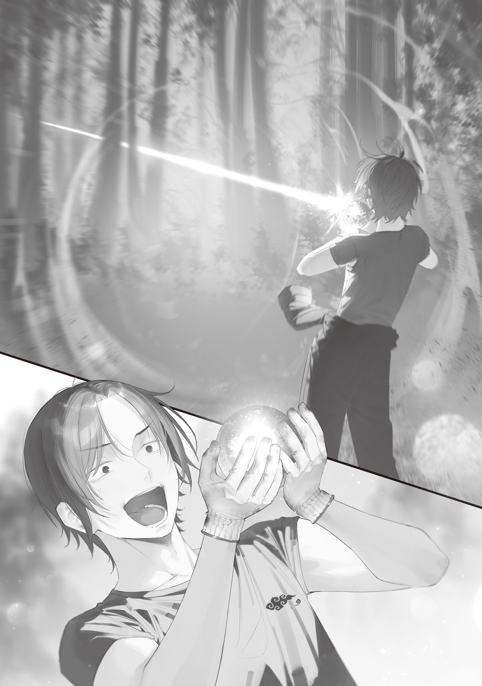

The good thing about online auctions was that I could make money without ever seeing anyone face-to-face.

For someone like me, who liked being alone, that was a godsend.

I'd bounced between all kinds of jobs after I started working, but I couldn't stand facing people or talking to them. The stress made me sick, so I shut myself away in a rented house in Okutama and started making a living off online auctions.

With a small vegetable patch, a well, delivery services (doorstep drop-off), and online auctions, I could go all year without seeing anyone face-to-face.

At first, I made money relisting things I'd repaired.

If there was one thing I'd always had total confidence in, it was my skill with my hands, and just as I'd figured, every piece of junk I bought expecting to fix, I fixed.

I'd buy broken antique clocks, old mechanical dolls, rusted safes with lost keys, and the like for cheap, fix them up, repaint them, and relist them, which earned me just barely enough to live on.

But there's competition everywhere, and someone doing the same thing would often snap up an item I'd had my eye on before I could. Besides, affordable items didn't show up on any reliable schedule.

Relying on other people's listings for income just wasn't stable.

So I decided to become a producer myself.

Instead of buying broken goods, fixing them, and relisting them, I'd make original products from scratch and sell those.

I made all sorts of things—marquetry puzzle boxes, snow globes, artificial flowers, models—but what sold most reliably, and for the best prices, was replica weapons from popular anime.

Anime were always featuring magic swords and mysterious wands, and the official rights holders would put out merchandise of them.

But that merch often looked cheap and obviously toy-like, came in limited runs with only a handful available, cost too much, or took months to arrive after you ordered it.

So every week I checked that season's popular anime and picked out any weapon that looked like something I could make and sell. If I was quick, I'd have a replica made and up for sale the same week the weapon showed up on screen.

At first they didn't sell much, but the anime's popularity carried them, and soon they were going at the buy-it-now price. It also helped a lot that I'd built a name as a reliable seller.

I reproduced complex transformation mechanisms, made my own perfume inspired by the character who wielded each weapon and scented the item with it, and obsessed over paint color, the texture of the materials, even durability. All that effort paid off, and products I billed as "seriously realistic" were a massive hit.

With the money rolling in, I bought a full set of crafting tools, covered my material costs with plenty to spare, and even started saving. No more stooping to sneak into junkyards for materials. Now I could afford to order them online, or even buy a patch of mountainside and cut down the trees myself.

Auctioning anime goods was the perfect job: it turned my hobby into profit, and I never had to meet anyone.

Of course, there were problems too.

For example, I had no comeback at all for comments like "Do you have permission from the anime's official rights holders to sell these?" I was so scared of getting sued that I'd made a habit of buying one of every piece of official merch and displaying it all on my household shrine. I tried to avoid overlapping with their product lineup as much as I could, but I was still selling without permission.

Resellers were a problem too. Some shameless bastards would snap up whatever I listed and flip it at a markup. It pissed me off, but I was a shameless bastard myself, selling goods without the rights holders' permission. Not being able to come down hard on them was infuriating.

Of course, I'd thought about getting official permission, or approaching them about a merchandising partnership. But I was a certified social misfit, by my own admission and everyone else's. Just imagining the effort and back-and-forth of dealing with the rights holders made my stomach hurt and left me ready to throw up.

I did this job so I could live without meeting or talking to people. Meeting and talking to people for the sake of the job would have defeated the whole point.

So there I was, problems and all, living a mostly fulfilling life deep in the mountains, when one day I found a meteorite in my backyard.

It was lying in a small crater and still a little warm, which told me it had probably come from last night's meteor shower.

Overjoyed, I picked it up and took it straight home.

Making fantasy weapons had started out as a way to earn money, but the better I got, the more fun it became, until it turned into my life's work. A magic weapon forged from a meteorite... It didn't get any more romantic than that.

I can make it a wand, or I can make it a sword. Would a gun be too gimmicky?

When I examined the meteorite closely, I found that its outer shell, a mix of metal and rock, held a clear, gemlike crystal at its center.

If I carved it out carefully, I'd have a huge rough gemstone the size of my fist.

Some anime weapons used gemstones (often called magic stones or spirit gems in the story), so I knew a thing or two about gems myself.

But when I checked it against my gemstone guidebooks, nothing matched.

I brought out a polarizing filter and a spectroscope to appraise it, but I still couldn't pin down what it was. Worse, the appraisal showed its hardness was off the charts.

The gem dug out of the meteorite was harder than diamond.

It had a mythical Mohs hardness of 11, past the limit for anything that existed on Earth.

Was that even possible? I went to look it up online, and that was when I noticed something else was wrong.

My computer wouldn't start—no matter how many times I pressed the power button, the screen stayed pitch-black. Not a peep. My smartphone was dead silent too.

The sun had gone down and it was getting dark, so I went to turn on the lights, but they wouldn't come on. The power was out too.

It struck me as more fishy than worrying.

The power's out...?

Did some disaster hit down at the foot of the mountain? There hasn't been any typhoon wind or rain, though, and I didn't feel an earthquake. And it's spring, so it isn't even the season for power shortages.

It was a little strange, but, well, it was nothing to panic about.

Japan recovers from disasters fast, so the power would probably be back as soon as tomorrow, or in a few weeks at the very latest.

Living alone as a shut-in deep in the mountains, I kept plenty of food stockpiled, and my first-aid kit was ready to go. Losing online auctions hurt, but I wasn't so hard up that a few weeks without listings would leave me broke.

I tried to keep examining the gem by the light of my emergency flashlight, but that wouldn't turn on either.

Well, it had come with the rental house and looked older than I was. The batteries had probably just drained on their own. I should've bought spares.

With no other choice, I struck a match and lit an aromatherapy candle I'd been planning to sell, just to have some light.

No electricity or internet is inconvenient, but I only have to tough it out for a few days.

I'll take my time investigating this amazing gem from space while I wait for the utilities to come back.

---

I spent seven days examining the meteorite gem and working it.

I named it "Okutameteorite," after Okutama, where I'd found it. Mohs hardness 11, refractive index 1.55, specific gravity 7.7, weight 2,300 g, color dark bluish gray.

In other words, it was a black, fist-sized gem that was harder than diamond, sparkled like quartz, and weighed about as much as iron.

Taking extreme care, I carved Okutameteorite into a sphere and polished it.

Very hard minerals don't scratch easily, but they aren't strong, and they break easily. They can take scratching, but not an impact like a whack from a hammer.

So first, I carved the rough stone into a sphere with a chisel and carving knives.

Then I crushed the chips I'd carved off, ground them down, and sifted them into a fine powder.

Finally, I used that powder as an abrasive to polish the sphere, and I had a beautiful, glossy gemstone ball.

There were all kinds of ways to cut gems, but given the rough stone's shape and properties, I decided a sphere was best.

I stared at the beautiful finished gem, totally entranced.

Its romantic, mysterious backstory as a giant gem carved out of a meteorite was one thing, but just looking at it, I felt a strange pull, as if it were drawing me in. For some reason, I never got tired of it, no matter how long I looked.

I'd handled all kinds of gemstones in my line of work, but I'd never come across one that moved me like this.

I felt like I finally understood why famous gems had inspired bloody conspiracies all through history...

I took a breather and spent a good few hours zoning out, admiring the gem from every angle, before it suddenly came back to me where things stood.

I'd been so wrapped up in the polishing that it hadn't registered, but come to think of it, the power was still out after seven days.

For that matter, the water had been out for a few days too, and now I was reduced to drawing from the old well in the backyard.

I had plenty of rice and instant food stocked up, and I could pick vegetables in the backyard. If I gathered firewood in the mountains, I could light the dusty fireplace even if the gas went out.

So I'd be totally fine for at least another month.

Still, it was starting to bug me.

If the power still isn't back after seven days, it must have been a massive disaster.

I'd like to believe things are at least coming back in central Tokyo, but it'll probably be a while longer before the repair crews reach Okutama—technically part of Tokyo, but out in the sticks.

I wonder what happened and what's going on out there. A localized earthquake? A tornado? It can't have been terrorism or a missile strike, can it?

I wanted to know how things stood—I really did—but leaving the house to find out was such a pain.

Buying a newspaper would mean the terrifying ordeal of facing a clerk at the register, and going into town to stop someone and ask what had happened would take more nerve than bungee jumping.

I didn't want to meet anyone, and I didn't want to talk to anyone. That was the whole reason I lived quietly in a house by myself deep in the mountains.

Well, I'm worried and a little uneasy, but it's probably nothing to get too serious about.

The electricity and internet have only been out for seven days.

Japan may be a disaster-prone country, but expecting a full recovery all the way out in the remote mountains in just seven days is asking way too much.

There's no need to panic or make a fuss when I can just sit back and wait.

Say what you want, but Japan's government is competent. If I'm a good boy and wait quietly, they'll definitely get my life back to how it was. It's not like I'm in dire straits or anything.

I'll take my time using this beautiful gem, Okutameteorite, to make and decorate a hobby weapon full of fantasy and romance while I wait for the utilities to come back.

---

Seven more days passed, and there I stood, holding Okutameteorite up in both hands and staring dumbfounded at the crack in my wall.

I could swear some kind of beam just shot out of Okutameteorite and slammed into the wall...?

It had all started with my investigation into Okutameteorite's properties.

The power was still out and the internet still down, so I couldn't look up whether any similar gems existed. Instead, I was doing my own research with whatever I had around the house.

Not that I was investigating it for any particular reason. Playing researcher was just fun, amateur as I was. Besides, with the internet—a shut-in's go-to time-killer—cut off, I was bored.

As part of that, I was trying to find Okutameteorite's natural frequency.

A natural frequency is exactly what it sounds like: the frequency unique to an object.

It's closely tied to the phenomenon known as resonance. For example, if you blast a wineglass with a sound at its natural frequency, you can shatter it with sound alone, without ever touching it.

Even short of that, you might feel dishes, tables, or windowpanes buzz while you're playing music at full volume. That's resonance too, caused when the natural frequency of the dishes or table happens to line up perfectly with the wavelength of the music.

Using whatever tools I had on hand, I ran experiments, did the math, checked my results, and pinned down Okutameteorite's natural frequency.

I'll admit I was being pretty childish about it. I sang a note that matched Okutameteorite's natural frequency, touched the stone, and got all excited: "Ooh, it's buzzing, it's buzzing! This is awesome!"

But then Okutameteorite, which had been vibrating along with my voice, suddenly started resonating harder. I was just thinking I'd better stop before it cracked when it fired something like a white beam and hit the wall of my house.

The impact sent a crack running through the wall, and dust came pattering down.

I stared hard at the Okutameteorite I was still holding up in both hands.

Did you just fire a beam?

I'd been planning to mount Okutameteorite on the tip of a magic wand and play at being a mage.

To that end, I'd carved the shaft from Japanese pagoda tree wood, famous for warding off evil, and carefully engraved it with original magic patterns of my own design. I'd also fiddled endlessly with the joint between the gem and the handle, the protective resin, and the metal wire. All the parts had come together over the past seven days, so before assembling it, I'd been playing around with resonance.

Of course, it was all make-believe. I'd made the wand look convincingly real, but there was no way it could actually cast magic. It was nothing more than a <ruby>cosplay<rt>costume</rt></ruby> prop, something to make the fiction of magic a little more immersive and fun.

Or at least, it was supposed to be.

I went out into the backyard and nervously sang at Okutameteorite's natural frequency.

Again, something like a white beam shot out, tore through the trees on the mountainside, and vanished into the distance.

Huh!?

For real!?

I just did magic!?

Th-That's awesome!

I went wild, bouncing around and firing off magic again and again, striking cool poses the whole time.

And once I'd assembled the parts into a classic old-style magic wand, the gem crowning a wooden handle and the whole thing reinforced with metal, my excitement shot through the roof.

Firing magic beams while copying all the cool mages—those lines from anime, those poses from manga—was way too much fun, like being a kid again.

But the fun couldn't last forever.

After firing off magic nonstop for a while, I started getting tired.

It wasn't the normal kind of tired. An uncomfortable floating feeling kept building, like being in a pool—no, more like zero gravity, or that lift you feel in an elevator—and I started to feel sick.

At first I figured I'd just worn myself out getting too excited, but then I wondered. Was this something like running out of magic power?

It's a common trope that magic consumes magic power.

Swing a sword around and you use up stamina. Use your brain and you get mentally worn out.

Using magic probably burns some kind of resource too... something you might as well call magic power.

I must be tired right now because I've been spending magic power.

Now things are getting interesting!

Okay, it's been plenty interesting already, but fantasy that fell from space? Of course I'm pumped.

That settles it. This magic wand, Okutameteorite, is going to be my family heirloom! I'll never sell it, and I don't care how hard up I get—I'm not letting it go.

...Oh, right. Speaking of being hard up.

It suddenly came back to me what kind of situation I was in, and I sobered up.

Fourteen days had passed since the electricity and internet went out.

The water had been out for ages, and the gas had gone out the other day. In other words, all the infrastructure was down.

Luckily, I still had plenty of food, I could draw water from the old well, and as long as I gathered firewood in the mountains, I had no trouble making fires.

But even this deep in the mountains, far from the city, could restoration really take this long?

How long did it take to recover from the Great East Japan Earthquake[^1] and the Noto Peninsula Earthquake[^2] again?

Hmm. Something doesn't add up.

What if the restoration work actually finished ages ago, and they just forgot my house by some mistake?

...No, no. I've done nothing to deserve getting frozen out like that[^3].

Sure, my social skills are shot, but I pay my taxes like I'm supposed to. There's no way the country would single me out and ignore me. It couldn't be.

It made me uneasy, but going down to the town office to complain in person sounded like a pain too.

If the only way to make my life better is talking to people, I'll take the inconvenient life, hands down. Don't underestimate me.

Well, there's no need to panic yet—for all I know, everything will just snap back on tomorrow like nothing ever happened.

It's not like I've been abandoned for a whole year. It's only been fourteen days. If the disaster zone is big, then of course a remote spot deep in the mountains with barely any residents gets pushed to the back of the line.

Just stay calm.

I'll take my time investigating this strange magic stone while I wait for the utilities to come back.

---

Another seven days passed.

The infrastructure was still down.

I didn't want to go outside or talk to anyone, but I did want news from the outside world.

Then I remembered that a dream device able to grant such a selfish wish—a radio—was sitting forgotten in my junk box. Without meaning to, I'd just gotten my hands on the key to figuring out what was causing the disaster.

The radio had been buried in a pile of junk I'd won cheap at auction, so naturally, it was broken and wouldn't turn on.

I took it apart to fix it, and that was when I found something strange.

A milky-white crystal, like quartz, was coating the radio's capacitor.

Weird, I thought, and went to pick the crystal off with tweezers, only to notice something even weirder.

The crystal wasn't stuck to the capacitor's surface. It was fused on, as if it had grown there by bursting out from the inside. Threads of crystal had spread through the capacitor like roots, ravaging it and wrecking it completely.

How does something even break like this?

Puzzled, I thought it over, and a hypothesis came to me.

I opened up other pieces of junk and checked their power units, then pulled the batteries out of my flashlight and broke them open. I took apart my computer and refrigerator too.

And it turned out my hunch was right.

In every electrical appliance I examined, crystals had grown out of the power supply and current-carrying parts and wrecked it from the inside.

There's no way this freaky phenomenon only happened inside my house.

I worked up the nerve to go out and walked to the public phone at the general store ten minutes away.

To my relief, the store's shutters were down. Glancing around to make sure no one was watching, I quietly took the public phone apart. Sure enough, crystals had gotten to its electrical system too.

Same with everything else.

The streetlights, the vending machines, even an abandoned mini truck—every single one! Crystals had eaten into their electrical systems and destroyed them.

A chill ran down my spine, as if the peaceful everyday life I'd been living had suddenly turned into a horror story.

This probably isn't limited to Okutama, because if it were only happening here, rescue teams would have shown up long ago.

And since they haven't, this must be happening on a much bigger scale, with chaos so bad that rescue isn't even possible.

All of Japan?

Maybe the whole world?

Humanity is weak once its electrical devices are destroyed.

Infrastructure down. Communications down. Coordination cut off.

In hospitals, the diagnostic equipment and the computers holding medical records would have gone down. And if the refrigerators storing medicine and blood for transfusions went down too, they could barely treat anyone.

With the traffic lights out, traffic would grind to a halt. Not that cars could even run in the first place.

If farm tractors and sprinklers stopped, food production would be devastated, and if boats stopped, so would fishing.

Planes would have crashed, and nuclear plants might have exploded.

Lose electricity, and you lose everything.

As I stood there, stunned, raindrops began pattering against my cheeks.

The rain kept getting heavier, driving me under the eaves of the general store.

It was pounding down so hard I couldn't hear anything else.

Only then did I notice that every house scattered through the valley was deserted.

The people living there had evacuated somewhere long ago.

Black storm clouds blanketed the sky, and before long, hail started to fall.

No...

...This isn't hail.

A small milky-white crystal came rolling to my feet, kicking up mud, and I was left speechless.

Lightning is just static electricity on a massive scale, inside a cloud.

Static electricity.

Electricity.

This crystal grows by eating electricity.

In this changed world, rain clouds don't send down lightning anymore.

They drop crystals instead.

If crystals have spread not just across the land where humanity thrives but into the sky itself, then this has to be happening all over the world.

It's all over.

While I'd been shut away without a care in the world, human civilization had collapsed.

## Translator Notes

[^1]: The Great East Japan Earthquake was the 2011 earthquake and tsunami disaster in northeastern Japan.

[^2]: The Noto Peninsula Earthquake was a major earthquake that struck Ishikawa Prefecture in 2024.

[^3]: **Mura hachibu** (村八分): A traditional form of village ostracism that excluded a household from nearly all community life.
