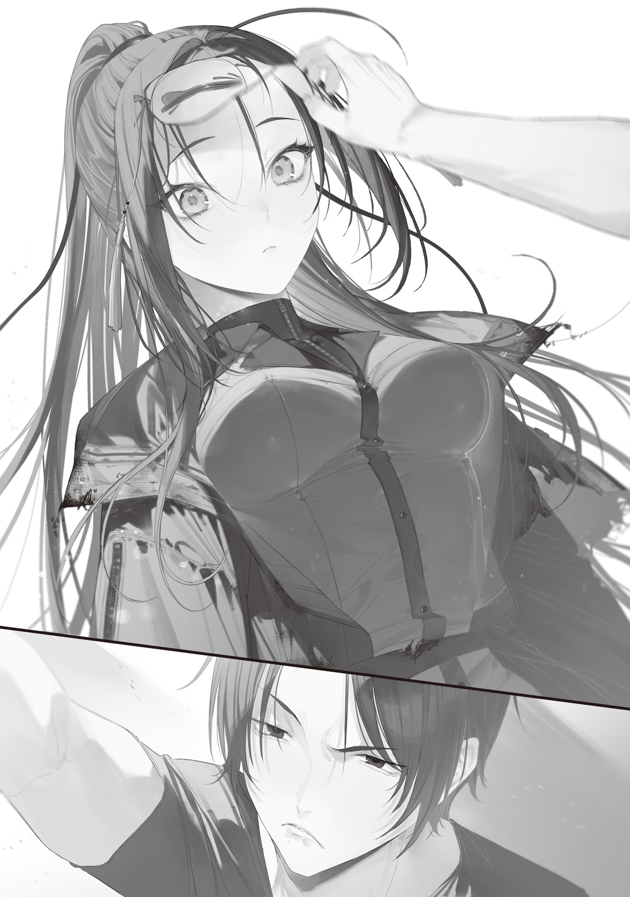

The way I saw it, new technology had always spread with a glaring gap between regions, no matter the era. And that wasn't the paranoia of some socially awkward country bumpkin talking. It was a fact.

Phone service, for example, started in city centers, and supposedly it took more than ten years for phone lines to reach private homes in the middle of nowhere.

Home delivery started in the cities before anywhere else too. Remote islands and backwoods got it later, and some places were left outside the service area forever.

Bullet trains, buses, movie theaters, anime broadcasts—they were all city first, and the countryside was always behind the cities.

Even when the cities were buzzing over some new technology, it took a while before the people out in the countryside actually felt the benefits.

Powerful connections changed all that, though. There were heartwarming stories about a local prodigy who moved to Tokyo, made it big, and then brought phone service or built a hospital back in his rural hometown.

My connection with the stoat professor turned out to be one of those exceptions.

My house sat alone deep in the mountains, the kind of place that should've been left behind in technology, culture, information—everything. But I was trading letters with a stoat who lived at ground zero of technological innovation, so the latest news from the city came pouring in.

Thanks to the invention of the fertility-magic bypass incantation, the food situation around Tokyo was rapidly improving. It now looked like the predicted famine hell could be avoided, and the huge number of people who'd been working to grow even one more cup of rice or one more handful of barley were free to do other things.

That breathing room was exactly what made it possible to found Tokyo Magic University as a fortress of learning.

I'd gotten an offer too: a research position at the university under the name "magic-wand processing studies." I turned it down flat.

Normally, forming a research team would speed things up. But I wasn't like ordinary people—not by a long shot. I could already see how it would go: the second I tried to pull together with everyone and work hard, I'd lose the ability to work hard at all. That was how it had always gone, at school and at work, my whole life.

I made magic wands alone. That was the most efficient way, and more than anything, it was fun.

While agriculture, forestry, and fisheries were booming thanks to the fertility-magic bypass incantation, I went against the grain and got really into Gremlin appraisal. Doing the same thing as everyone else would never put me ahead of them.

Gremlins were the foundation of magic processing technology. Exploring processing methods mattered, but it couldn't hurt to sharpen my eye for the raw material too.

Gremlins were gemlike crystals that came in all shapes, sizes, and colors, so this seemed like a good time to train my eye. Any craftsman who couldn't judge the materials he worked with was third-rate, plain and simple.

When I asked the Blue Witch if she had any Gremlin samples, she showed up the next day with a carry case stuffed full of them.

I set the carry case on the workshop table and opened it, and Gremlins of every color, packed in tight, came spilling out with a clatter.

"Whoa...! I mean, yeah, I did say bring as many as you could carry, but isn't this a lot?"

"They build up when you hunt monsters. I still have about five times this much at home."

"That many?"

As the Blue Witch idly rolled a beautiful ultramarine Gremlin between her fingertips, she explained that Gremlins circulated as something worth more than money but less than actual goods.

Civilization had collapsed, and the old currency—Japanese yen—had turned into scrap paper. These days, even a stack of bills couldn't buy you a single rice ball. The economy ran mostly on barter and rations, a creaking echo of the one from before the collapse, and Gremlins sometimes played a supporting role in it.

The bigger the Gremlin, the stronger its magic-amplification effect. Large Gremlins were several ranks below magic stones, but they were recognized as having some practical value.

Now that I'd shown the world what spherical polishing could do, and the fertility-magic bypass incantation was rapidly increasing the number of people who could use magic, Gremlins were going up in value. Apparently, you could sometimes even trade them for food these days.

I listened to the Blue Witch while I sorted the Gremlins by color and size and lined them up on the worktable.

They ranged from the size of a grain of rice to the size of a ping-pong ball, and they came in every color: red, blue, yellow, green, purple.

Hmm?

"No transparent Gremlins?"

"No... wait, yes. Ghost-type monsters have transparent Gremlins. But they get color once the monster dies."

"Why?"

"No idea. The Gremlin's composition does... something, probably?"

The Blue Witch was trying to squeeze out some kind of theory, but what came out had nothing in it.

Hmm. I really don't get it.

With gemstones, color came from the elements they contained. Gems held all sorts of elements—copper, aluminum, silicon—which was why they came in so many shades.

But Gremlins were magic crystals that grew by eating electricity. They had properties that didn't match any element on Earth. I didn't know where their colors came from.

"Do Gremlins have their own attributes? Maybe their colors depend on those attributes... This one sure looks ice-aligned."

I held a blue Gremlin the size of my pinky nail up to the light, and its icy sparkle was a treat for the eyes.

I was getting excited about all the mysterious possibilities hidden in Gremlins, but the Blue Witch threw cold water on it right away.

"Color and performance are unrelated. This red one doesn't especially amplify fire magic, and this green one doesn't do anything special for fertility magic either."

"Aw, boring. What about rarity, then? Like, the darker the color, the rarer it is?"

"None of that either. Monsters of the same species carry Gremlins of the same color, so if you hunt a pack of them, you can end up with a bunch of one color all at once, but..."

Just sorting through the huge pile and quizzing the Blue Witch as I went sharpened my eye a little. Until then, I'd only ever looked closely at fewer than ten Gremlin colors. Going through a jumble of well over five hundred broadened my horizons. Comparing them side by side made the differences stand out, and I started to see them.

The Blue Witch had said color had nothing to do with Gremlin performance, but as I dug deeper, I found that strictly speaking, that was a lie.

Or rather, a misunderstanding.

Sure, whether a Gremlin was blue or green had no effect on its performance.

But uneven coloration made the amplification ratio drop slightly.

Gremlins with fine debris trapped inside also had a slightly lower amplification ratio than ones without impurities.

Even among Gremlins of exactly the same size and spherical shape, there was about a 5% gap in amplification ratio between "no uneven coloration and no impurities" and "uneven coloration and impurities."

So there's a performance difference after all!

Granted, it was a tiny one, the kind you'd never notice without lining up a huge number of Gremlins, controlling the conditions, and comparing them.

I measured the amplification ratio by casting freezing magic on water and checking the temperature change with a thermometer, so a more rigorous method might turn up a different number. But that was the best precision I could get out of any method I could think of, so for now, I'd call it 5%.

Just 5%. But 5% is 5%.

A Wand Maker who laughs at 5% will cry over 5%. I just made that proverb up.

As a Wand Maker on the cutting edge, I was going to obsess over every last 5%.

With the Blue Witch helping out with the experiments, my Gremlin-appraisal know-how piled up fast.

She looked pretty fed up with the grind of checking hundreds of Gremlins one at a time and logging the data. But whenever I shoved a graph of the results or some newly discovered fact in her face, she was openly impressed.

"Amazing. Do new facts really just keep tumbling out like this?"

"If you ask me, the real mystery is why nobody found facts this basic before now."

I didn't think I was doing anything all that hard.

Sure, 80% of the population had died in the Gremlin Disaster, but some smart researchers had to have survived. I'd figured the kind of verification experiments I could come up with would've been done to death ages ago, but apparently not.

When I asked her about it, puzzled, the Blue Witch explained matter-of-factly.

"The big one is that, until very recently, people had bigger things to worry about. Research for tomorrow took a back seat to food for today. Children, old people, idiots, geniuses—everyone went out in groups to gather the food left in devastated areas. When they weren't doing that, they plowed fields, pulled weeds, and caught fish."

"Ah..."

Now that she put it that way, I'd been there myself.

Getting enough food and fuel had given me plenty of trouble too. I'd only been able to put real effort into making magic wands after I met the Blue Witch and started getting her support. Before that, wand work was just something I tinkered with here and there to unwind, my little daily comfort.

"Then there's the difference in research direction. Some researchers, like Kei-chan, focus on studying incantations. Some study monsters' weaknesses. All kinds. A lot of them are also trying to get electronic devices working again."

"Ahh, gotcha. Yeah, that makes sense. Bring back electricity and you bring back civilization."

I was totally convinced. Messing around with baffling magic crystals would never get the collapsed civilization back on its feet as fast as reviving all those insanely convenient electronics that had died.

No wonder so much effort went into bringing electronics back.

"But the electricity research hasn't produced any results. Kei-chan's magic linguistics and your wands are getting clear results, so lately people have been moving over to those. Maybe from here on out, it'll be the age of magic research?"

"Not the age of violence?"

When I cracked that joke at the humanoid superweapon who'd wiped out a giant kaiju in one blow, the Blue Witch pouted.

"It's not like I use violence because I like it. I'd much rather be chatting with you like this. I only use my power to protect and save people important to me... though I've failed to protect them again and again."

"O-Okay."

That got gloomy all of a sudden, huh? This woman keeps flashing little glimpses of darkness at me. I can't believe she's the same person who was so giddy with a stoat on her shoulder.

Gremlin quality appraisal wasn't a skill you picked up overnight. I spent the next week building up my know-how, with help from the Blue Witch, who dutifully kept going along with my verification experiments.

For example, Gremlins came in all kinds of colors, and their transparency varied just as much.

Some Gremlins were as clear as colored glass. Others were opaque, colored all the way through like marble, so you couldn't see inside.

With highly transparent Gremlins, you could spot uneven coloration and impurities just by looking.

The problem was the opaque ones, since you couldn't see inside.

If they had impurities in them, you'd never know. Even if the surface had no uneven coloration, you might crack one open and find the inside full of it.

Magic-excitation acoustic appraisal was the method I developed to assess opaque Gremlins like that, whose quality was hard to judge from the outside.

Basically, you could tell a Gremlin's quality by tapping it and listening to the sound.

First off, Gremlins and magic stones reacted to incantations. They reacted to magic power, of course, but to sound as well.

The higher the amplification ratio, the sharper that reaction to sound got—in other words, the higher the sound absorption. The Gremlin took in the sound of a recited spell and held it, as if swallowing it whole.

This sound absorption wasn't always active, though. Normally, Gremlins didn't absorb sound in any special way. According to the Blue Witch, they only took a "listening posture" when magic excitation occurred, such as when an incantation was recited nearby.

Cyanos's core was a huge magic stone with a high amplification ratio to begin with, and its seven-layer structure had sent that ratio soaring. Even when I tapped the core with my fingernail, it made no sound at all. The sound was perfectly absorbed, proof of its extraordinary amplification ratio.

By contrast, tapping an unprocessed, rice-grain-sized Gremlin made the sound slightly louder because its amplification ratio was negative.

I tapped and tapped and tapped away with my fingernail at thousands of Gremlins with different amplification ratios, learning their sounds by ear and honing my feel for them, until I could appraise Gremlin quality accurately.

To cap off a week of Gremlin-appraisal research, I decided to test myself.

I set a dodecahedral fractal I'd made just for appraisal on the worktable, recited the fertility-magic bypass incantation, and put it on activation standby.

The blinking fractal was in a magic-excitation state, so any Gremlin near it would take a "listening posture" and enter a sound-absorption state.

Then all I had to do was put on a blindfold.

I got the Blue Witch to help by setting Gremlins of different shapes, colors, and sizes in front of me one after another. Still blindfolded, I tapped each one with my fingernail and called out its amplification ratio.

"1.1×. 1.24×. Another 1.24×. 0.9—no, 0.91×. Exactly 1×. 1.21×. 1.22×. 1.08×. 0.59×. Hmm...? 1.1×, but is this the same as the first one?"

"Cree... Amazing. Every answer's right."

"Were you about to call me creepy?"

When I took off my blindfold, the Blue Witch hurriedly shook her head.

"I wasn't, I wasn't. Still, how can you tell them apart that accurately? I can barely tell 1.5× from 2×."

"Because you're relying on your ears. They feel slightly different when you tap them too. Sound's just vibration in the end, so the trick to precise appraisal is feeling that vibration with your fingertips. Combine the sound and feel, then judge the whole thing."

I'd given her a perfectly easy tip to follow, but the Blue Witch was left speechless.

"...You're dexterity incarnate. You're further from human than a witch is."

"If anything, you're way too human for a witch."

She was nothing like the stereotypical wrinkled witch who stirred a suspicious cauldron and cackled. She sulked, got hurt, and kept a treasured photo of her little sister tucked close to her chest. Whatever people called her, at heart she was human.

"Anyway, Gremlin quality appraisal's looking good. We are most pleased. Training complete! You're taking the Gremlins home, right? Want help carrying them?"

The pile of Gremlins she'd hauled all the way from Ome to Okutama just so I could train my eye came to six carry cases in total. That was a lot for one person to lug around.

When I offered to help carry them, the Blue Witch shook her head.

"They're no use to me even if I keep them. Ori can have them."

"Huh. You're giving them to me? All of them? I'm not giving them back, okay?"

"Fine by me. They're just rocks I don't care about."

The Blue Witch said it without a hint of attachment. Talk about bighearted. More like big-bellied—give it up for the 200 cm waist!

Then again, if she does care about something, she'll probably keep it on her at all times, even if it's just a rock. Well, whatever her reasons, if she's giving them to me, I'll gladly take them. Nothing's cheaper than free.

I'm a genius Wand Maker, but without materials to work with, I'm just some guy. If the Blue Witch is going to handle not just promotion and negotiations but sourcing materials too, that's a huge help.

I won't have to trek to power plants looking for large Gremlins while cowering at every sign of a monster anymore.

"Seriously, this helps. Want me to make you something in return? You went along with the experiments too, so it can double as thanks for that."

"Don't go casually making more nuclear weapons. One is plenty."

She lightly tapped Cyanos against her shoulder as she said it. But that's not what I mean—Cyanos is merchandise, right? I'm talking about a thank-you here, not promo material.

"Not a wand. Maybe a Gremlin accessory, like a necklace or earrings. This blue one might suit you if I set it in a ring."

I took the Blue Witch's hand and held the Gremlin up to her finger to picture the gift, and she blurted out something strange in a baffled voice.

"...Uh, are you maybe hitting on me?"

"Huh?"

What's with this witch? Where'd that creepy idea come from all of a sudden?

"I told you it's a thank-you, damn it. Got Gremlins stuffed in your ears? Just how pretty do you think you are? Assuming every man wants to hit on you is pretty damn conceited."

"N-No, I wasn't going that far..."

The Blue Witch flinched and denied it, but that was exactly what she was saying.

If just asking, "How about an accessory?" counts as hitting on someone, then every clerk at an accessory shop is one hell of a pickup artist.

That's ridiculous, right? Right?

"Well, you've got a stupidly pretty face, the kind guys probably hit on nonstop, so it's not like you're full of yourself, but... Huh? Wait, you're actually not full of yourself, are you?"

I realized it even as the words came out. Isn't it only natural for a beautiful woman to talk like her beauty's a given? I talk like my insane dexterity's a given too.

I nudged the Blue Witch's mask aside a little and peeked underneath through narrowed eyes. A peerlessly beautiful girl stared back, dumbfounded. I slid the mask right back into place. Yep, that settled it.

With a face that good, no wonder she assumed every man wanted to hit on her. She wasn't full of herself after all—it was a fair self-assessment.

"Uh, I wasn't trying to hit on you. But that painfully cringey misunderstanding pissed me off, so no thank-you gift."

"O-Oh. What is with you? Is acting weird all you can do?"

The Blue Witch was thoroughly baffled, and a little put off.

Why are you the one put off? I'm the one who should be totally creeped out.

I'd never offer her accessories again. No way was I putting up with another creepy misunderstanding like that.

Things had gotten weird, but the fact remained that the Blue Witch had given me a mountain of magic-wand materials. I could judge their quality now too, so my work was probably going to go even smoother from here on.

As a first-rate craftsman, I wanted to handpick first-rate materials and keep making first-rate magic wands.
