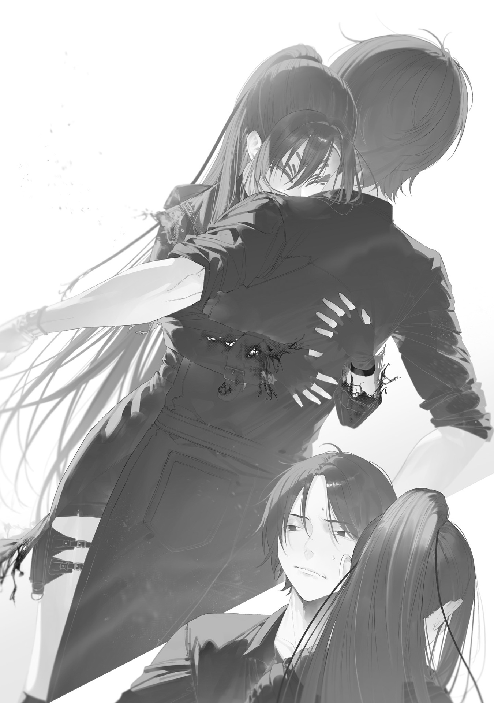
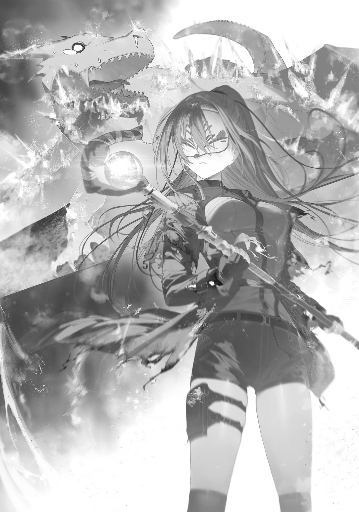

『As autumn deepens and the weather turns chilly, how have you been, Ori-san?

In Bunkyo Ward, modest Halloween decorations have started appearing.

Last year, we had no time for that, but this year I made a jack-o'-lantern from one of the pumpkins we harvested and put it on display at the university.

I enclosed a test batch of the pumpkin cookies I plan to give the students on Halloween. I would be happy to hear what you think of them.

Now then.

Regarding the matter you asked about in your last letter, in short, it is likely due to magic civilization's unique view of life and death.

Magic language draws very fine distinctions between life and death.

For example, Great Glacier magic uses “You[ゼィ]” when addressing the living. When addressing the dead, “you” is “You[クケッフッ].”

Such distinctions affect the conditions for activating magic.

Zombie Witch-san's dead-subordination magic works on someone who is brain-dead even if their heart is still beating. Iruma Mage's puppetry magic reportedly loses its effect on creatures whose hearts have stopped.

There is also the concept of “magical death,” with a word that describes never being able to use magic again as “death.”

Magical death can be rephrased as “irreversible death” or “great death,” and it seems to be treated as more serious than brain death or cardiac arrest. Judging from those differences in wording, I suspect that magic civilization might have regarded brain death and cardiac arrest as reversible deaths.

In other words, I think resurrection magic might exist, and we simply do not know its incantation.

I have gone off on a tangent, haven't I?

For those reasons, even the same magic could have different effects when used on a living creature and when fired at a corpse.

Magic that specifically targets living opponents treats a corpse as an unsuitable target, so it cannot take full effect.

Did that answer your question? If anything else is unclear, please feel free to ask. I find your perspective interesting, Ori-san, and stimulating as well.

One more thing: regarding the delivery of magic wands for Tokyo Magic University students, I am currently discussing the matter with Foresight-san and Ao-san. Please wait just a little longer. I expect to enclose a formal purchase order with my next letter.

Lastly, I hear you will be harvesting your rice paddy soon! It must have been very difficult tending it all by yourself.

I hope this autumn brings you a bountiful harvest.

Ohinata Kei』

---

I tossed the letter I'd finished reading into the letter case and wolfed down the pumpkin cookies wrapped in oil paper.

Hmm, so-so! They didn't seem to contain any butter or sugar, so they weren't nearly sweet enough. 50 points.

But for cookies baked while food rationing was still in effect? 120 points. Mmm, tasty.

Professor Ohinata included sweets with every letter, so it kind of felt like she was taming me with food.

Well, I sometimes sent her Gremlin accessories I'd made by carving Gremlins in return. Kid or not, I honestly appreciated getting critiques from a woman's perspective.

The capabilities of magic wands inevitably put limits on their distribution, but pretty little accessories didn't have that problem. I wanted to hone my skills with her feedback and sell some here and there as a side business alongside my work as a Wand Maker.

After stuffing myself with cookies to take the edge off my hunger, I put on my straw hat, hung a hand towel around my neck, stuck Hendensho through my belt, put my water bottle in my back pocket, slung my sickle over my shoulder, and headed out to harvest.

It had drizzled the day before yesterday, so I couldn't harvest then, but yesterday and today had both been sunny. The wet rice plants had probably dried out.

Clear autumn skies. At last, it was harvest time.

Standing on the ridge of the drained rice paddy, I readied Hendensho and cast fertility magic.

"The season of crystals comes around[グリスタ・ヒアーズイ]. You[ゼイ], from a world different from the world reflected in your eyes[ダダニダオプトラエオオオ・プトラエ], may the blessing of one who is not eaten be upon us[ヒテイヒテイカパジヤウエウエント]."

A soft, sparkling wave rolled out of the wand and spread in a fan.

The rice heads showered with sparkles suddenly swelled a size larger, and the stalks that could no longer support them snapped one after another. The rice fell over as if a strong wind had flattened it.

Mm, good. Harvesting had just gotten harder, but the yield was more than double. Seriously broken magic.

I cast fertility magic over the whole 2-are (200 m²) rice paddy in four rounds, then got straight to harvesting. By my calculations, that would get me four koku of rice, enough to feed four adults for a year.

I'd grown two koku worth of rice, expecting losses from animal damage, disease, and poor growth (there was no way a beginner like me could suddenly take care of a huge rice paddy, so I kept the planting to a reasonable amount). Even accounting for how much those damn birds had eaten because the harvest was two days late, I was more than satisfied with the result.

Praise be, praise be. I had to build a shrine to Ohinata Daimyojin-sama[^1], god of farming.

Singing a rice song I'd learned in a rice-growing game, I happily cut the rice and hung it on wooden drying racks. So what if my hands and back hurt? Every bit of hard work meant more food. Nothing could make me happier.

Fertility magic was broken magic that made the edible part of a crop swell or split after just one use, increasing the yield by more than double.

But it couldn't increase the harvest without limit. There was no point using it more than once.

For example, with rice, if you used fertility magic before it flowered, the stems got crazy thick and the leaves got big.

I didn't know the exact mechanism, but apparently some balance got thrown off. Even after it flowered and set fruit, the stems and leaves kept growing while the all-important grains got none of the nutrients, leaving them empty.

This rule applied to every crop where flowers set into an edible fruit, including tomatoes and eggplants as well as rice. To avoid screwups like that, it was best to use the magic right before harvest.

For crops with edible roots, like sweet potatoes, daikon radishes, potatoes, and turnips, you had to pull them out of the ground before using the magic.

If you used fertility magic while they were still buried in the soil, the edible parts would trap soil inside when they swelled. Also, I didn't know why, but if you used the magic and tried to harvest and store them right away, they rotted extremely easily.

So you had to pull them up, use the magic to swell them, rebury them, wait three to four days for them to settle, and then harvest them again.

Fruit trees and leafy vegetables had their own tricks for using fertility magic properly too.

You also had to watch out for the slight mismatch between what we considered crops and what fertility magic considered crops. Fertility magic didn't work on mushrooms, but it worked on some shellfish.

A manual covering these basic cautions had been based on what the Foresight Mage heard when he learned magic from the Flower Mage. But apparently, finer points that the manual didn't cover and even the Flower Witch hadn't known kept coming up one after another.

It looked like it would take a while before humanity could use fertility magic reliably. New technology really did take time to spread.

A combine would've finished the rice harvest in no time, but doing it by hand took a while. Once I'd cut about half, I took a break, sat on the paddy ridge, and poured cold-brewed sencha from my water bottle into a cup.

“Freeze[ヴアアラー].”

I drank the green tea I'd chilled ice-cold with magic and let out a satisfied breath.

Civilization had declined since the Gremlin Disaster, but being able to use freezing magic anytime, anywhere was more convenient than before the disaster. It was fun to use too.

Overhead were white clouds, a clear blue sky, and a bird circling slowly.

Man, it was peaceful.

............

Peace... ful...?

As I leisurely sipped my tea, I squinted up at the sky.

The bird flying through the sky had stopped circling and started descending to the ground.

But the scale was wrong.

The speck had looked no bigger than a black dot, but as it plunged closer, it grew and grew until its silhouette came into focus.

It wasn't a bird.

It was a vivid crimson dragon, red as fire.

!!!!!

I rolled off the paddy ridge, clapped one hand over my mouth to smother a scream, and crawled under the bundles of rice on the drying racks to hide.

Bad, bad, bad.

A monster. A dragon.

It was nothing like mutated raccoon dogs or rabbits.

It was a ridiculously strong monster humans couldn't beat, the kind the Blue Witch had warned me about: “If you run into one, hide and pray.”

As I held my breath, cold sweat pouring down my face, a light tremor shook the ground as it landed nearby.

No, it was close. Really close. Didn't it land really close? Was it okay to keep hiding? Should I make a full-speed run for it and hope for the best?

When I nervously peeked through the weeds growing on the paddy ridge, the dragon was standing in front of my house, of all places.

N-Noooo! This was the worst!

Seeing it beside my house made the dragon's size clear. It stood about 7 m tall, a little lower than the roof of a two-story house. Its total length, tail included, was even longer. It was a solidly built Western-style dragon with a pair of wings, and the sharp, blade-like tip of its tail flashed in the sunlight. A big gem like compressed fire was embedded in its chest.

The wind carried the smell of something scorched, and it put me on edge. Hey, it wasn't going to start a forest fire, right?

The dragon pressed its reptile face against the wall of my house and sniffed at it for a while. Then it suddenly slammed its tail down and blew off one corner of the house.

Aah!? Y-You bastard! What the hell are you doing to my house!?

I nearly shouted, but managed to hold it in.

Calm down. Think positive. If it played with the house, wrecked it, left satisfied, and went home, that was fine. Better the house than my life.

I held my breath and watched.

The dragon seemed interested in my house. With its tail swinging happily, it shoved its massive head into the collapsed corner and rummaged around.

Then it let out a happy cry and pulled out the large junk box where I stored the Gremlins I'd collected.

It deftly used its forelegs to stuff the box into a kangaroo-like pouch on its belly, stuck its head in again, and this time grabbed a Medusa statue I'd made after an old anime character (with rubies set in its eyes) and stole it.

I shook with anger.

Y-You bastard! Thief! Robber! Looter!

Dragons loved treasure. It was a standard trait for dragons in fantasy.

True to type, this dragon apparently loved shiny things. It diligently ransacked my house and stole one work after another that I had collected and made.

I-I couldn't let this slide. No way. I wanted to go punch it right now.

But if I ran out now, it would kill me. I had no choice but to hold back and wait for the storm to pass.

As I clenched my teeth and endured, the dragon let out an especially loud happy cry. It clamped my ultimate treasure, Okutameteorite, in its jaws and shook its tail wildly.

Huh?

You... what?

Hey.

No. That was too far.

I'd hit my limit.

I jumped to my feet, readied Hendensho, and shouted.

“Draaaagon! Look over here! I'll fucking kill you! Freezing Javelin[ドウ・ヴアアラー]!”

I chanted the strongest attack spell I could use, and a thick spear of ice shot out just as the incantation described. The spell could easily punch through a car door, but when the dragon turned around, the spear struck it between the eyes with a soft smack and fell to the ground.

The puzzled dragon brought its snout close to the ice spear at its feet, and its breath melted it into water.

Oh, crap.

I'd known that would happen, but it had done absolutely nothing. Less than a mosquito bite.

Its face practically said, “Did you just do something?”

Damn it! Fine, screw it. I'd get close, shove the wand into its mouth, and fire at point-blank range this time! If I attacked inside its body, where it had no scales, it might at least hurt a little. I'd use that opening to take back Okutameteorite, then run away and hide.

Okay! That was the plan. I didn't care what else it stole, but I wouldn't hand over Okutameteorite. It was my treasure!

“Uooooooh!”

“What are you doing in a place like this? Shouldn't a wizard be at the university for class right now?”

“Ooh... huh?”

I was rushing at the dragon with Hendensho ready and prepared to die, but when it spoke to me in a puzzled tone, I skidded to a stop.

I-It talked? Even though it was a monster. Monsters weren't supposed to talk!

The vicious-looking dragon had fierce golden eyes, but it continued in a young woman's voice that didn't suit its appearance.

“If you're lost, I'll give you a ride. But give me that wand for it. It's pretty.”

“...Ah. Are you the Dragon Witch, by any chance?”

“That's right. I'm the Dragon Witch. I'll give you a ride, but wait. I have to pack up all the treasure.”

As she said that, the Dragon Witch tried to pack Okutameteorite into her kangaroo pouch.

No, wait, wait, wait.

I clung to the dragon's foreleg and hung from it to stop her.

I'd thought she was a monster, but she was a witch. She was the Dragon Witch the Blue Witch had told me about.

Apparently, lately she had been airlifting people who had learned the fertility-magic bypass incantation—magic learners commonly called “wizards”—to destinations all over the country.

Whatever the case, if she was a witch, I could reason with her. I explained what was going on.

“Wait. This isn't an empty house. It's my house. And that thing you've got is mine too, so give it back.”

“Huh? Sounds fake. There aren't any witches or mages in Okutama. Nobody could possibly live here.”

“So what? I live here whether you believe me or not. Look, see that rice paddy? That's mine. Does it look abandoned and untended? No, right? I live here and take care of it. Got it? Then give it back. Give it back! It's mine!”

“You're so annoying. This is mine. A big, round, shiny magic stone like this is wasted on you.”

I jumped to take back Okutameteorite from the Dragon Witch, but she flicked me with the tip of her claw and sent me flying.

The impact felt like a full-power open-handed slap from a sumo wrestler. My breath caught, and I started coughing. S-So strong.

But I couldn't back down.

Witch or whatever, what she was doing was robbery.

I was a Wand Maker. If she wanted a magic wand, I'd make and sell her one. But no way was I letting her rob me like this.

“No. Not that. Anything but Okutameteorite. If you want a wand, I'll make one you like! Give that back. Give it back! Hey!”

“Keep pestering me and I'll burn you... Hm? Did you just say you'd make one of these?”
As I clung to the dragon's leg and kept pressing, it pointed a foreclaw at the tip of Okutameteorite sticking out of its belly pouch and questioned me.

I nodded.

“Yeah. I'll design it to your specifications. I'm still practicing, but I can make accessories too! I'll make you anything, so give that back!”

“You really made this?”

“Yeah!”

“What's your name?”

“Ori Kenshi. Just give it back already. Okay? Just—just give it back for now. If you give it back, I'll answer as many questions as you want.”

Ignoring my pleading, the dragon craned its neck all the way over to look at the nameplate on my house.

Of course, the nameplate said “Ori.”

The Dragon Witch blinked.

“It really was your house. So you really made this?”

“That's what I've been saying. The misunderstanding's cleared up, right? So give it back. What you're doing is theft.”

“Hmm... Fine. I've decided. You're going to make treasure in my nest.”

“Huh?”

Having reached her own conclusion at her own pace, the Dragon Witch grabbed me in a foreleg and took off into the sky with a rumble through the ground.

With just one flap of her wings, she shot forward, and the ground rapidly fell away.

Roller coasters had nothing on this. All the blood drained from my body.

Aaaaaah! Why was this happening!? I was just harvesting rice!

“H-Help me!”

“Hey, don't struggle.”

My scream vanished unanswered into the mountains of Okutama.

“Noooo! Kidnapper!”

“You'll bite your tongue if you talk. Be quiet.”

“Eeeeee... eeh...!”

The intense wind pressure, terror, and unbelievable height soon left me unable even to scream. Passing out would've been easier, but no such luck.

I was terrified of how far the dragon would carry me off, but the forced sightseeing flight ended surprisingly soon.

It felt like a few minutes. Maybe it had actually been even shorter.

The Dragon Witch landed on the side of a breached dam. A huge horizontal hole had been dug there, and the cave-like space was her nest.

Shards of glass, Gremlins, old coins, 100-yen and 500-yen coins, silver accessories, and jewelry cases carpeted the ground. It looked awful to sleep on. Well, with a dragon's body and scales, a bumpy bed probably didn't matter.

There was also a faint floral smell, like perfume or shampoo. No animal stink.

Thrown into the nest along with the loot she had stolen, I flopped down before I could even complain.

My legs had completely given out, and my whole body wouldn't stop shaking. No safety line. No time to prepare. That trip through the open sky had taken years off my life. Right now, I could probably laugh my way through a bungee jump.

The Dragon Witch emptied her belly pouch, added more shiny things to the nest, and squealed while shoving her head into the little mountain of treasure. So innocent. Damn beast.

As I struggled to crawl quietly away on my useless legs, her tail blocked my escape route.

“No escaping. Let's see, they should be around here... Found them. Here, handcuffs. Chain your leg to that statue.”

“Tch!”

She tossed me a grimy pair of handcuffs with one foreleg, and I reluctantly chained my leg to the statue.

When I shook my leg to show her it was chained to the statue, the Dragon Witch curled up like an absurdly huge cat and settled in the center of the nest. Then she spoke without a care in the world.

“Ori. I'm appointing you my treasure custodian. You'll polish my treasure nice and shiny and make me lots of new treasure. In exchange, I'll feed you all the meat you can eat. I'll protect you from monsters too.”

“That's a better offer than I expected. But no thank you. I don't wanna be treated like a slave.”

“Want me to fucking kill you?”

When I refused her order, the Dragon Witch bared her fangs and glared at me with vicious eyes.

Scary. But to her, I was a valuable treasure maker. She probably wouldn't squish me with a pop just because I'd annoyed her a little. I should stand my ground.

Even if my opponent was a dragon, I could act tough if it wasn't human.

“Quit with the cutesy sentence endings. Nobody wants a dragon talking like that.”

“Shut up. I know talking like this when I'm around thirty is rough. I started talking like this after I mutated. It's not my fault.”

“Really?”

“You don't know? Witches changing their bodies or tastes when they mutate is a common thing. The Eyeball Witch lives on eyeballs now. She's only got one eye herself, so she's seriously gross.”

“Scary.”

It was seriously creepy to picture. Like an evil witch from an old story.

Well, she really was a witch. I almost forgot because the Blue Witch I knew best looked like an ordinary woman in a mask.

Wait, yeah.

The Blue Witch.

“You sure you want to do this? My witch friend will come flying over here.”

I said that confidently so she wouldn't notice my doubts about whether the Blue Witch would really come save me once she sensed something was wrong.

The Dragon Witch snorted.

“Eyeball Witch? Flame Witch? Hachioji Witch? None of them is a match for me.”

“Blue Witch too?”

When I brought up the Blue Witch's name to the Dragon Witch, who showed no sign of avoiding conflict with other witches, the dragon's huge body twitched. She asked in a quiet, nervous voice.

“...Are you an Ome resident?”

“No.”

“Then don't scare me like that! That woman would never leave Ome and come all the way to Higashiyamato. She stayed shut in even when the giant kaiju attacked.”

“No, she pops over to neighboring cities now and then. She comes to Okutama a lot too. If this is Higashiyamato, Ome's close, right?”

“What do you know about the Blue Witch? If you're not an Ome resident, she won't come help you. She's a woman with a frozen heart.”

My only bargaining chip got laughed off, and my confidence wavered.

Maybe she was right.

If Professor Ohinata were kidnapped, the Blue Witch seemed like she'd freeze all of Tokyo to save her. But me? I was only her business partner for selling magic wands. The Blue Witch had no obligation to save me.

She had wanted to keep my identity hidden and stop my technology from getting out... Hmm. Would she save me even if it meant becoming enemies with another witch?

“No matter what you say, I'm not letting you go, so give up. If you can process magic stones, start by processing one. Cut it all shiny and sparkly!”

“You don't mean processing it to increase spell power?”

“What's that? Magic stones are pretty. They're the most beautiful gems in the world. I want you to make their beauty stand out. A whole lot!”

Aha. This woman seriously had nothing but treasure on the brain. For someone who claimed to be around thirty, she seemed to have a pretty primitive brain.

She had said her sentence endings changed when she became a witch, so maybe her brain mutated and made her dumber too.

Breathing hard, her greedy eyes gleaming, the Dragon Witch lumbered to her feet and nudged me with a clawtip.

“Turn around for a bit. I'm taking human form for now.”

“You're transforming? I'm kind of interested in that. Can I watch?”

“Huh? What a damn pervert. Go read a dirty magazine.”

“Ah, you're getting naked. Sorry, I'll turn around.”

I turned around, squeezed my eyes shut tight, and firmly covered them with both hands. After a rustling noise behind me, I heard an incantation.

“Though this body is not human[カーマイカパジヤエンイエンシユオア・ウー], at least let my body be human-like[×××・×ダガド・ミエ・カーマイ].”

Something popped like a balloon, and wind rushed past me. After a short pause, I heard another incantation.

“If it flies through the sky[××××・××] and breathes fire[ニーテツテツタテ], even a lizard is a dragon[ナグ・ナズグ・エンイエンシユオア].”

There was another balloon-pop sound. Then she said, “That's enough. Look over here,” so I stopped covering my eyes and turned around.

For a moment, the Dragon Witch looked no different from before the back-to-back transformations. But when I looked closer, the huge gemstone like compressed fire that had been embedded in her chest was gone.

The witch was holding that gemstone between her clawtips and showing it to me.

The Dragon Witch said proudly.

“This is my magic stone, Meteoflame. Turn it into a necklace that looks good around my neck.”

“I'd heard the Dragon Witch's magic stone was Blood Moon, which she'd swiped from the dead Bloodsucking Mage.”

“That's a false accusation. This is Meteoflame. I found it in Minato Ward and put it under my protection.”

Talk about putting a spin on things. She'd definitely looted it during the chaos.

Minato Ward was the area the late Bloodsucking Mage had governed.

It was easy to picture her ransacking the Bloodsucking Mage's home after he was gone, just like she'd ransacked mine, and stealing the magic stone. Or maybe she'd pried it off the Bloodsucking Mage's corpse.

She was one hell of a thief, but putting that aside, the red magic stone in front of me was seriously interesting.

It was huge.

It was bigger than Cyanos's magic stone. Bigger than fist-sized Okutameteorite. It was as big as a small melon.

There were quite a lot of inclusions inside it, but reflected light made its insides flicker like living flames.

Interesting!

Its shape was closer to an oval or a rectangular prism than a sphere.

Hmm. If I made this into a necklace, would a baguette cut or an emerald cut suit it?

The standard practice was to cut a gemstone so its inclusions[インクルージヨン] were hidden or hard to see. With this magic stone, though, showing them off would probably make it more beautiful.

With something this big, the stone setting would need some extra thought too. A design that suited a small gem would probably look mismatched at this size. I'd need to draw several blueprints, make full-size wooden models, and...

As I held the red magic stone and thought it over, I noticed the Dragon Witch staring hard at me and snapped out of it.

“Ahem. Uh, I'll take this processing job. My tools are at home, so let me go back. If you do, I won't sue you.”

“Your workshop is here. I'll have your tools brought over tomorrow, so think about the design today. I'm going to sleep now. Be good and don't run away.

For now, eat some canned food or whatever you find around here. You're free to look at the treasure as long as you don't damage or dirty it. If you touch the grave at the very back of the nest, I'll kill you. The toilet and bath are down that side passage. You can use them whenever I'm not using them.”

“A dragon-sized bath...? Are you heating up a pool or something?”

“It's a human-sized cauldron bath. I only take human form when I bathe too. Saves body soap and shampoo. Oh, the shampoo in the pink bottle is mine, so use the green guest bottle.”

I got some really domestic-sounding instructions.

The Dragon Witch closed her eyes, rested her chin on her forelegs, and started snoring. It was only just past noon. Must be nice.

I watched the Dragon Witch for a while, but when a sleep bubble started inflating from her nose, I knew she wasn't pretending to sleep.

All right.

Time to escape!

It sounded interesting to freely process the gold, silver, and treasure stored in this nest, but being chained up and forced to work like a slave was just plain unpleasant.

The problem with escaping was the handcuffs.

The statue handcuffed to my leg was pretty heavy. I could just about carry it, but I couldn't escape while staggering around with a statue in my arms.

But I had a special skill.

I borrowed a hairpin from the wig of a mannequin in a fancy dress half-buried in the treasure pile and picked the handcuffs open in no time.

Hmph, idiot!

You underestimated my dexterity. I had the dexterity to conquer the world.

Handcuffs were useless, you moron!

Savoring my victory, I kept my footsteps quiet and tried to sneak out of the nest.

But a tail suddenly stuck out and blocked my way.

I nervously looked over. The dragon had its eyes cracked open, showing sharp fangs and growling softly.

Cold sweat ran down my face.

I backed up to where I had been and put the handcuffs back on my leg.

When I shook the handcuffs to show her, the dragon closed her eyes and started snoring again.

This was hopeless. Was it wild instinct? No way I was getting out.

Help me, Blue Witch!

Hurry up and come!

---

Evening came, the sun set, night passed, and morning came.

Even after a whole day, the Blue Witch hadn't come.

Instead, a slightly plump middle-aged man in a suit arrived with the sunrise.
“All right, I'm going to work. Zaizen, explain things to the newcomer over there.”

“Certainly, Dragon Witch-sama. Have a good day.”

After the slightly plump man gave her a deep bow, the Dragon Witch let out a huge yawn and flew off into the sky.

Right, she'd said her job was transporting university-graduate wizards all over Japan. Maybe she had a quota today too.

Even the self-centered Dragon Witch apparently had enough social skills to take on work from the Tokyo Witches' Council.

After I made sure the Dragon Witch had vanished into the distance, I firmly made eye contact with the ground and loudly begged the slightly plump man.

“U-Um, excuse me. Actually, I was kidnapped and brought here. Could you... maybe let me go?”

“Ah, that would be a little difficult. My name is Zaizen Kintaro. I handle something like the administrative work in Dragon Witch-sama's territory.”

“So if you defy her and let me escape, she'll kill you after all?”

“No. Her sense of ethics is a little... questionable, but she will not kill you if you do not incur her wrath. There are safer districts, but this one is not so bad either. Um...?”

“?”

“Forgive me, but may I have your name?”

“Ah, Ori.”

“Ori-san, you have had a terrible time, but as they say, home is where you make it.”

With that, the slightly plump man explained all sorts of things to the poor captive.

The slightly plump man... Zaizen-san had apparently been kidnapped by the Dragon Witch before too. She had brought him here for the stupid reason that “his name sounds lucky,” and like me, he had been chained up in the nest. But after he had obediently behaved for about one month, she let him go.

Was I going to stay chained up for one month if nobody came to save me? Give me a break.

“Dragon Witch-sama governs a region spanning the three cities of Musashimurayama, Higashiyamato, and Higashimurayama. Dragons are very powerful monsters, you see. Weak monsters do not approach territory steeped in Dragon Witch-sama's scent. Any weak monsters that appear inside the cities flee as well. Dragon Witch-sama also hunts powerful monsters that appear despite the scent.”

“Huh.”

She actually did a decent job maintaining public safety? Even though she'd kidnapped me.

“She does not mediate disputes or crimes between people, leaving them to self-government, so less damage from monsters does not mean the area is peaceful.

But our district's biggest advantage is definitely meat. Compared to other districts, our food rations include a great deal of it. Ori-san, you rarely get to eat meat either, do you?”

“Y-Yeah. The only time I get good meat is when I bag a deer. So does that mean livestock farming has survived around here...?”

Securing feed and caring for livestock had to be a huge hassle too.

“No. Dragon Witch-sama brings us whales.”

“Whales.”

Oh, I got it. That was big. Literally.

Whales were enormous sea creatures. One alone could provide meat for hundreds or even thousands of people.

It was on a different scale from trapping rabbits one by one or wandering the mountains for hours to bring down a single deer. That was big-game hunting only a huge magical life-form like a dragon could pull off.

“We have organized a Whale Butchering Team. Besides the meat, we take the oil and bones and use them as resources. They are popular goods at barter markets.”

“Whoa...”

“We assign people who move here work according to their skills. If you live in this area, we ask that everyone do some kind of work, regardless of age or gender. Do you have any special skills, Ori-san?”

I almost answered honestly, but closed my mouth just in time.

The dragon already knew about my processing skills. But Zaizen-san didn't yet.

It felt a little late to worry about that, but the Blue Witch had repeatedly told me not to show off dangerous technology to outsiders. Better to keep it secret.

I left out as much as I could without creating any contradictions when Zaizen-san spoke with the dragon.

“I'm a gem craftsman.”

“Ah... That explains why she took a liking to you. My condolences. In that case, shall I introduce you to the Recovery Team later? It will likely be the team you see most often from now on.”

“Um, what's the Recovery Team?”

“The Recovery Team retrieves precious metals and gems from ruins. If they have room in their loads, they also retrieve medicine and such.

Dragon Witch-sama takes them to devastated urban areas where no witches or mages are present, and they spread out to do recovery work. Dragon Witch-sama keeps watch while they work, so the risk of monster attacks is low, but accidents such as falls and collapses do happen, and that does not mean monsters never come. It is a team that does dangerous work.

But their rations increase accordingly, they get to live in better homes, and they can rest whenever they are not deployed.”

“Huh. That dragon acts like that, but she actually offers decent employee benefits.”

“I set them up. Ori-san, if anything comes up, please speak to me first. Dragon Witch-sama is... a little difficult.”

Zaizen-san trailed off.

Hmm. They called it territory governed by the Dragon Witch, but this guy was the one actually running its domestic affairs.

Witches and mages had originally been ordinary people too. Not all of them could've been former politicians or company managers who knew how to bring people together.

I doubted the Dragon Witch had thought that far ahead, but a system where a powerful witch sat at the top and left domestic affairs to someone good at them seemed pretty solid.

On the other hand, a territory where a meathead witch with no political sense insisted on running domestic affairs herself sounded awful.

Just as Zaizen-san had said, the Dragon Witch's territory seemed “not so bad.”

Even so.

This wasn't my utopia.

This place reeked of people. From the nest, I could see them wandering around the residential neighborhood like normal. Nope.

I wanted to go back to Okutama. To my paradise, without another soul as far as I could see.

“Um, this is hard to say, but still, I was kidnapped, and I want to go back home. I'll escape on my own, so could you maybe pretend you didn't see...?”

I tried asking a second time, but he apologized like he felt bad.

“I'm sorry, but as I said before, it would be difficult.

Dragon Witch-sama has an incredible sense of smell. Even if I let you escape, I think she would catch you right away. She can smell prey from quite far away, and apparently she can even tell the smell of treasure.”

“Ah.”

That made sense.

She had sniffed out Okutameteorite with that treasure sense when she passed over Okutama. If she could smell it from high in the sky while it was inside my house, there was no avoiding her.

A selfish personality with dragon specs was seriously nasty.

No, maybe getting dragon specs made her selfish? Either way, same difference.

“Now, now. You will get used to it as you live here. For now, I will tell the Food Team to bring you something. Get some proper sleep, eat some delicious meat, calm down, and then take your time thinking about what to do going forward.”

Zaizen-san promised to arrange for food and gem-working tools to be brought over, then left, saying he had other work to do.

Damn it. He didn't seem like a bad person, and he didn't seem all that loyal to the Dragon Witch, but he also didn't seem to owe me enough to help me.

Even if I escaped while the dragon was away, I couldn't get away if she tracked me down by scent like a police dog. I didn't know the geography around here, and Ome was far away. There was no way I could make it to the Blue Witch's home before the Dragon Witch noticed my escape and caught me.

Ughhh. Was I going to be worked to the bone here for the rest of my life?

Judging by Zaizen-san, who'd once been in the same situation as me, I probably wouldn't be treated horribly. But wasn't that Stockholm syndrome? The thing where a victim started trusting their kidnapper. Hell no.

She was a goddamn robber-kidnapper-jailer dragon! Don't forget it. Don't forgive her.

Now that my chances of escaping on my own were gone, my only hope was that the Blue Witch would come save me.

There was nothing I could do myself, so I lay there half-hidden in a jagged pile of treasure, spacing out. About one hour after Zaizen-san left, a food cart rolled in.

A grade-school-aged girl pushed a shopping cart loaded with a huge cooler and stopped in front of me. She started comparing a note with me, so I quickly looked away. Don't look at me.

“Um, are you Ori-san? Zaizen-san told me to deliver three days' worth of food.”

“Y-Yeah...”

“One lunchbox is one meal. That makes nine meals for three days. Is this all right?”

“Th-Thanks...”

I mumbled as quietly as I could to avoid drawing attention, but that only caught the Food Team girl's attention instead.

“Um, are you all right? Are you feeling sick or something?”

For some crazy reason, the girl reached out and put her hand on my forehead as I lay limp against the treasure pile, speaking in a listless voice.

The sheer terror made a scream burst from my mouth on its own.

“Aah!”

“Aah!?”

Idiot! Didn't your mom teach you that the only times you can touch strangers are when you hand over change at a convenience store and when you show a lost kid the way!? Was she out of her mind!?

Just having a person right in front of me made me lose my appetite, and the attempted physical contact instantly maxed out my stress gauge.

“D-D-D-Don't touch me! J-Just go over there! Get lost, don't talk to me! Shoo!”

“!? ...I've been told that before.”

Huh? Were there other socially awkward people like me? The world was doomed!

“Get lost! Thanks for delivering the food, that really helped! Now shut up and go somewhere!”

“O-Okay. I'll go somewhere. But just one thing I've wanted to say for a long time...!”

Listen when people talk. I said shut up and go somewhere.

Damn brat. You only came here to deliver food, so why were you trying to have a pointless conversation outside the job? Leave the food and go somewhere already!

“U-Um! Thank you for teaching me—teaching me how to live without stealing...!”

The girl bowed while saying something I couldn't make sense of. Instead of just three days' worth of food, she dropped the whole huge cooler in front of me with a thud, then left while repeatedly looking back and bowing.

Once she had disappeared completely, I started breathing again and took a moment to recover.

Terrifying. What was with that kid? She spouted nonsense like some crazy person. She said three days' worth, but left a mountain of food that looked like about ten days' worth.

Had civilization collapsed before she could get lessons in Japanese or math? Poor thing...

Feeling sorry for the girl, who should've been right in the middle of compulsory education but was working in the Food Team alongside adults, I opened a lunchbox right away. No matter what happened, I still got hungry.

The lunchbox held what looked like grilled whale meat and vegetables covered in insect bites. The colors weren't exactly appetizing, but it tasted okay. More than anything, the food was fresh, and there was plenty of it.

The food situation in the Dragon Witch's territory really did seem good.

That they could afford to give this much to a prisoner who'd tried to escape said a lot about their food-production system. I could barely manage to feed myself────

“...Huh? ...Ah...”

At that point, I realized who the fidgety Food Team girl was.

Back then, supplies in Okutama had already run out.

The Blue Witch was refusing to let people settle in neighboring Ome.

It wouldn't be strange if she had drifted all the way here and settled down in the Dragon Witch's territory. It wasn't close to Okutama, but given time, it was still close enough for a kid to walk.

Oh, right. She had stopped living by thieving and was working in the Food Team. Was the extra food meant as thanks? Pretty admirable for a kid.

Whatever the case, I was glad she was alive.

It would have been better if she hadn't shown up in front of me.

From now on, I really wanted her to eat until she was full and live happily wherever I didn't know about. Don't show your face to me again.

After that unexpected, unwanted reunion, I spent the rest of the morning fiddling with the red magic stone and waiting for the Blue Witch, but she didn't come.

She didn't visit Okutama every day, so it wouldn't be strange if she took a while to notice I'd been kidnapped. But as the one waiting, I couldn't stop worrying.

Please, seriously. Come, Blue Witch. I had never prayed to someone this much.

But my prayers went unanswered. The one who came around noon was not the Blue Witch but that damn dragon.

In a great mood, the Dragon Witch pulled an ATM out of her belly pouch, dumped its contents into the nest, threw the empty box outside, and casually spoke to me.

“How's it going? Is the necklace done already?”

“You idiot, you think I can finish it that fast? I'm waiting for Zaizen-san to bring the tools.”

“I can't wait. When it's done, I'll show it off at the Tokyo Witches' Council. Everyone will definitely be jealous. Gahahahaha!”

The Dragon Witch roared with idiotic laughter, but she noticed something strange at the same time I did.

It was autumn. The weather was chilly, and in the mountains there were days when frost fell.

But it was strange for frost pillars to rise from the ground at midday.

Frost pillars had turned the roads in the housing area white and were spreading toward the dragon's nest as if announcing that something was coming.

Even on a reptilian face covered in red scales, I could clearly see the dragon turn pale.

Meanwhile, I was overjoyed.

Yeeeeessss!

She was here!

The Blue Witch was here!!!!!

The Blue Witch had turned the ground white and brought an early winter. She came running at incredible speed.

I spotted her beyond the houses, and the next moment she charged in like a black bullet. She slammed to a stop in front of me. A moment later, the wind caught up, and frost pillars shattered by the pressure scattered like diamond dust.

With sparkling diamond dust in the sunlight behind her, Blue Witch looked unreal. Her familiar ragged black clothes, mask, and Cyanos all looked ridiculously cool.

M-My heart was pounding. What was this feeling...!?

I did my best to calmly diagnose the bug in my head. So this was why couples got together so easily under the suspension-bridge effect. Then the Blue Witch suddenly wrapped both arms around me and squeezed me tight. In a trembling voice, she said,

“You're alive...!”
Her voice overflowed with joy, but she sounded like a lost child about to cry.

Normally, being held this close and restrained would have scared me out of my mind, but the arms hugging me were shaking so helplessly that pity beat out fear.

I got it.

Of course. She had been scared.

I knew the Blue Witch had once lost everyone under her protection when that piece of trash, the Iruma Mage, kidnapped them all. My kidnapping must've hit her trauma dead-on and badly shaken her.

She wasn't a hero who had come to save a princess.

This was a mother rushing over because she was worried about her kidnapped child. Mom!

As we shared our emotional reunion hug, the oblivious dragon visibly tried to back away.

“I-I'll give him back. I'm sorry. I didn't know he was your man.”

“Huh?”

The Blue Witch had been patting me all over anxiously, but her tender concern vanished. She glared at the dragon, her voice dropping into a deep, threatening growl.

The air abruptly turned heavy and cold, enough that I almost imagined I heard a boom.

Even knowing the killing intent wasn't aimed at me, my teeth chattered. I couldn't tell anymore whether I was cold or scared.

If it was this bad for me, the Dragon Witch, who was directly facing that killing intent, tucked her tail tight.

“Eek! I-I wouldn't have stolen him if I'd known he was your man! This was an unlucky accident! A misunderstanding!”

“Don't say disgusting things. He's my friend.”

“Huh? The Blue Witch has a friend?”

“Huh? I was your friend?”

“............”

Hit with two completely sincere questions, the Blue Witch put a hand to her head like she was holding back a headache.

What was with that reaction? Friend? That was news to me.

Did she get my permission before saying that? Was she my mom or my friend? Make up your mind!

“Dragon Witch. There is no room for leniency with you. This incident alone deserves ten thousand deaths, but you have a mountain of other crimes—”

“No, wait, don't move on. You can't just drop that. Friend? We're friends? You and me? But... no, wait... huh? I don't hate the sound of that. Not that I like it either. So are we friends? Since when? When did we become friends? Were we already friends yesterday? What about the day before? Anyway, aren't friendships supposed to happen with both people agreeing? If someone calls me a friend and I think, well, okay, does that make us friends? The whole ‘friend fee’ thing is an urban legend, right? Right? This isn't that, is it?”

“Socially awkward. Quiet. We'll talk about that later.”

She sounded seriously annoyed, so I obediently zipped my mouth.

Fair enough. I wanted the Blue Witch's opinion on the claim that friendship between men and women couldn't exist, but it probably wasn't the time to ask.

The Blue Witch leveled Cyanos at her hip and delivered an absolute-zero declaration.

“Dragon Witch, I'm executing you. As a courtesy to a fellow member of the Tokyo Witches' Council, I'll kill you instantly if you don't resist.”

“...!!!”

It wasn't a threat. I knew at once from her voice that she seriously meant to kill her.

Despite her huge body, the Dragon Witch moved fast. She snatched up Okutameteorite and the red magic stone[Meteoflame], one in each hand, and took off with a rumble through the ground.

That bitch was trying to run!

The wind pressure from her takeoff alone knocked me over, but the Blue Witch didn't budge.

She aimed Cyanos at the dragon receding at rocket speed and chanted an incantation.

“The pure white breathed by that monster blankets the world[マムギ×××・×××ヴアアラープトラエケーヤアブ・ト], and a season was added[マタ・ギツタガイダ].”

A huge white vortex suddenly appeared in the sky above the dragon, right where Cyanos pointed. It spun violently, swallowed the dragon, and drove her to the ground.

The howling white torrent slammed the dragon into the ground. She struggled to take off, but her wings froze despite her resistance.

I hurriedly hid behind the Blue Witch to escape the freezing gale. It looked like she was controlling the magic and narrowing its range, but even the spillover was brutal.

By the time the dragon's nest was covered in white frost and the whole area had turned into a silver world, the Dragon Witch was completely spent, shivering like a carp on a cutting board.

Heh. Serves her right. Sensei, please finish her off like that!

“Ghk! Even the volcano could not bear that starlight[×××××キアキヤロヲウオリ],”

“Freezing Javelin[ドウ・ヴアアラー].”

A rapid shot of ice-spear magic punched clean through the Dragon Witch's jaw as she tried to recite an incantation and put up a last struggle, shutting her up.

Amazing. It was the same spell I used, but the power was in a whole different league. Even accounting for Cyanos's amplification, she was insanely strong.

“Uegh... S-Stop. I give up...”

The Dragon Witch's jaw rattled so badly she could barely talk. The Blue Witch snorted at her surrender.

During the fight—or rather, punishment—a crowd had started gathering from the residential neighborhood.

No, not rubberneckers. Was this an emergency security response? Everyone had crossbows or metal bats and wore leather vests reinforced with metal plates. Some farmers were mixed in too, armed with hoes and plows.

“Hey, what happened? What's going on? What kind of monster is it?”

“Nah, doesn't look like a monster attack.”

“Huh, a witch? Is that the Blue Witch!?”

“Dragon Witch-sama is frozen!?”

“This is bad, this is bad...”

“We're screwed. It's over. Team A, go back and get the women and children out.”

Even after seeing the disaster-like violence of inhuman magic, the crowd stayed on guard but stood firm.

Man, people who survived the Gremlin Disaster really had different guts. It was probably only the gutsiest fighters who had rushed over, but even so, they had some damn nerve.

Before the crowd that had rushed over only to end up helplessly watching from afar, the half-frozen Dragon Witch begged pathetically for her life.

“I-If you let me go, I'll give you half the treasure. So save me.”

“...Hah.”

“Half isn't enough? A quarter's fine too.”

Why did it go down? Don't start wanting to keep your treasure now!

Maybe the Blue Witch was fed up with that awful begging too. Without saying another word, she readied Cyanos. The Dragon Witch still refused to give up and tried to stagger away, dragging her half-frozen body.

When the Blue Witch drew in a breath to recite an execution incantation, the slightly plump man pushed through the crowd, his belly bouncing as he rushed between the two witches.

It was Zaizen-san.

Hey, Zaizen-san. That's dangerous!

The Blue Witch clicked her tongue irritably without lowering Cyanos from the Dragon Witch.

“You're in the way. Move.”

“You are Blue Witch-sama, correct? It is a pleasure to meet you. My name is Zaizen. I handle something like the administrative work in Dragon Witch-sama's territory.”

“Yeah... Sorry for the trouble. I'll tell the Eyeball Witch about the aftermath. Eventually, this place will probably be folded into another witch's territory. Don't worry about what happens after this one dies.”

The Blue Witch softened her tone a little, but Zaizen-san spread his chubby hands and blocked her way even more firmly.

“I do not know Blue Witch-sama's circumstances, but might I ask you to spare her? I am not worried about losing a guardian.

Dragon Witch-sama is rather... difficult. But whatever else may be said, she feeds us. She protects us. Many lives have been saved.

We owe her. Please, could you at least spare her life?”

The Blue Witch thought for a moment after hearing Zaizen-san's plea, then looked at the crowd.

The crowd whispered together for a bit, but they all nodded. The Food Team girl was among them too.

They didn't nod right away, but the fact they eventually did said a lot about the Dragon Witch's usual behavior.

U-Umm. Even a goddamn robber-kidnapper-jailer dragon had people who respected her, huh? Thinking about the Food Team girl, she apparently took in refugees who drifted in from other areas too. I could see why people liked her.

No, even factoring that in, I thought it would be better to kill her here. If they let her live, she'd just get up to no good again.

I was on team kill her, but the Blue Witch was the executioner. As an idiot who had gotten kidnapped so easily and needed her to come rescue me, I couldn't tell her what to decide.

The Dragon Witch's fate was entirely up to the Blue Witch.

The Dragon Witch got cocky now that she had people on her side. As the Blue Witch thought it over, the Dragon Witch said with a beaming face,

“That's right! Good job, Zaizen! Say more! Killing me would be a loss for the world!”

“Dragon Witch-sama. I am terribly sorry, but please rest[だまつてろ].[^2]”

“...Hah. Fine. I'll spare her life, but this one needs to learn her lesson the hard way. I'll rip off one of her legs.”

“Ah, by all means. That much is fine.”

When the Blue Witch rolled up her sleeves, Zaizen-san readily stepped aside.

The crowd relaxed in obvious relief and started chattering.

Having lost her allies, the dragon screamed as the executioner came closer one step at a time.

“Zaaizeeeen! You betrayed me!? Stay back! No, you're coming—wait, ah, stop, noooo! Dragon slayer!”

I watched the Blue Witch use self-enhancement magic to rip off the dragon's leg by brute force, bit by bit, while the dragon screamed and sobbed with none of her dignity left.

Heh, served her right. But it was a little gross. No wonder the Blue Witch was feared when she could do this splatter stuff so calmly.

I'd make sure never to make her mad...

---

After that.

I rode in a cart back to Okutama, pulled by the Blue Witch, along with the Gremlins, Okutameteorite, artworks, and the red magic stone Meteoflame that the Dragon Witch had taken by force.

The Blue Witch was fast, and watching the scenery whip past from the cart was pretty fun. It felt like we were going about 50 km/h.

She could go faster with self-enhancement magic, but self-enhancement magic from the Bloodsucking Mage consumed blood as well as magic power. Apparently, even a witch would collapse from anemia if she overused it, so she couldn't rely on it too often.

Nice. Even with the risk, I was jealous. I wanted to get instantly ripped too.

“Ori, I'm checking one more time. They didn't abuse you, right? You got food too, right?”

The Blue Witch looked back worriedly as she ran, pulling the cart. I waved a hand casually.

“Don't worry, Mom. I'm fine.”

“Don't joke around. Seriously, how worried do you think I was?”

“I mean, the kidnapping and imprisonment sucked, but the treatment itself wasn't bad. They gave me proper meals with meat and vegetables, not canned food or cup noodles.”

“If that's true, good...”

I gave a wry smile to the Blue Witch, who still couldn't stop worrying. If anything, I felt like I'd eaten more luxuriously than usual. You didn't get many chances to eat whale meat even if you wanted to.

Thinking about it, the food situation had gotten way better lately. For over one month now, I hadn't touched canned food, cup noodles, hardtack, or other food relics produced before the disaster.

Without scavenging supplies through rubble and ruins, we could now produce new food and keep ourselves fed.

The spread of fertility magic really was incredible. The era of looting and eating through the old world's leftovers was over.

Even in my insanely tiny social circle, I knew someone who had stopped looting and started working in production. That had to mean looting as a job was becoming outdated across society as a whole.

Something brushed my cheek, and I looked up. Gremlins were falling from the cloudy sky with the light rain, sparkling like fine snow.

I held up a framed painting from the cart as an umbrella against the rain of crystals—crystal rain—and enjoyed the beautiful, unreal sight of spirits of light falling from the sky.

I would never forget it.

When civilization had collapsed and I was caught in crystal rain for the first time, the falling Gremlins had looked like symbols of the end of humanity's age and despair.

But now it was different. All I saw was a beautiful rain blessing the earth with magic crystals.

“The world's changing, huh. I thought humanity was over, but reconstruction is moving along better than I expected. It looks like things might get back to normal pretty soon.”

“You think so? We have only solved one problem. You're too optimistic, Ori.”

The Blue Witch gave a pessimistic reply, glanced back, and pointed her thumb at the eastern sky.

“You see that reddish-black cloud in the distance? It is not a raincloud. Under it is hell. A witch went out of control before and turned the land beneath it into a world where people cannot live. They say it will swallow all of Tokyo in thirty years, but no way to stop it has been found.”

“Huh?”

When I looked where she pointed, I could indeed see a hellish, ominous, supernatural reddish-black cloud. Rain clouds dropped beautiful crystals, but the air was stagnant only under the reddish-black cloud.

It looked seriously bad. The story was that without fertility magic, there would be hunger hell in two years, but did that mean there would be the real deal hell in thirty years?

“We also do not know much about what has become of land outside the capital region. The Dragon Witch is gathering information around the country while transporting wizards who have learned fertility magic, but she is the Dragon Witch. I cannot trust her if she says, ‘Everything's fine!’ It would not be strange if some unbelievable danger that would finish off battered humanity were sleeping somewhere in Japan.”

“True...?”

When she put it that seriously, I started thinking maybe she was right.

In fact, Tokyo alone had nearly been destroyed twice: by the giant kaiju landing and the Iruma coup (which I only knew as a rumor). Three times if I counted the food crisis. Four if I counted the Gremlin Disaster that started it all. Way too many world-ending crises kept casually coming at us. I wanted them to cut it out already.

If this many crises were happening just around Tokyo, there had to be more across Japan and the whole world. Who knew what horrifying things were happening in faraway places where communication was cut off?

“Well, it'll work out somehow.”

The brutal era of looting and echoes was over.

Surely from now on, an exciting era of reconstruction and magic would begin.

No matter what crisis humanity faced, it would stubbornly survive and rise again.

I believed that.

## Translator Notes

[^1]: **Daimyojin** (大明神): An exalted Shinto deity title; Ori uses it here to jokingly deify Professor Ohinata.
[^2]: **Furigana mismatch — 「お休み下さい[だまつてろ]」:** The written text politely says “Please rest,” while the supplied reading says “Shut up.”
