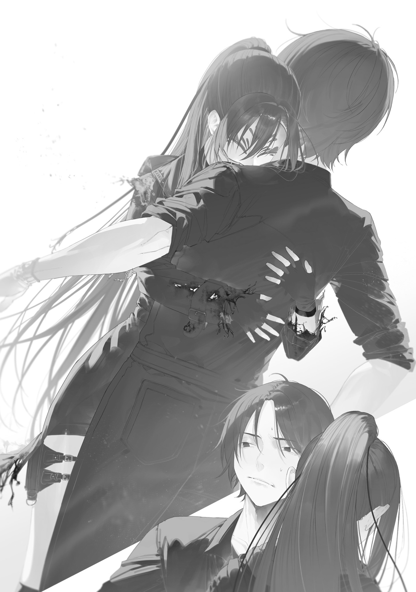
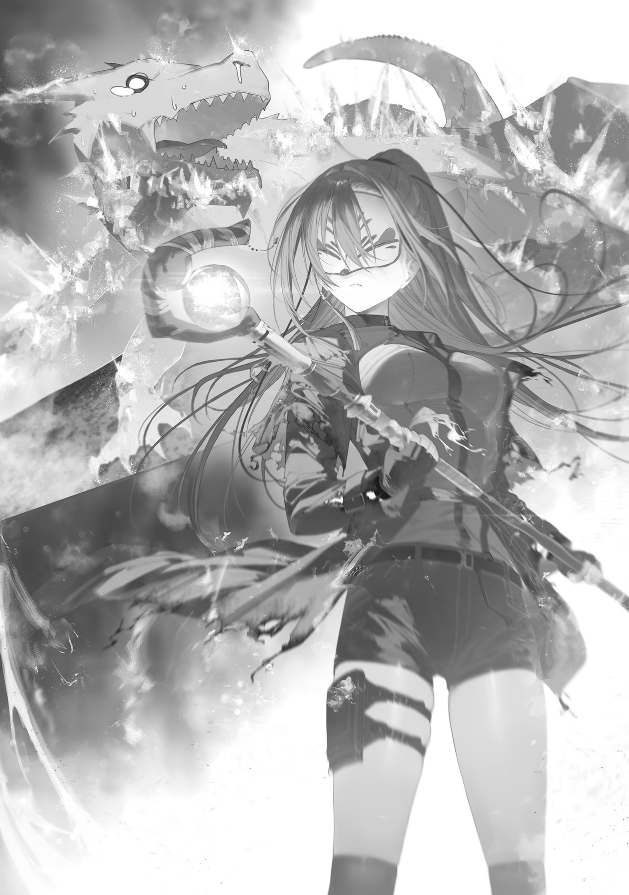

『As autumn deepens and the weather turns chilly, how have you been, Ori-san?

Here in Bunkyo Ward, a few modest Halloween decorations have started to appear.

Last year we had no time for such things, but this year I carved a jack-o'-lantern from one of our harvested pumpkins, and it is now on display at the university.

I have enclosed a test batch of the pumpkin cookies I plan to hand out to the students on Halloween. I would love to hear what you think of the taste.

Now then.

As for the question in your last letter, to give you the conclusion first: the cause is most likely the magic civilization's distinctive view of life and death.

Magic language draws very fine distinctions between life and death.

For example, the “you” in the Great Glacier magic incantation is “<ruby>Zei<rt>You</rt></ruby>,” which is used to address the living. To address the dead as “you,” the word is “<ruby>Kukeffu<rt>You</rt></ruby>.”

Such distinctions affect the conditions for activating magic.

Zombie Witch-san's dead-control magic works on the brain-dead even while their hearts are still beating. The Iruma Mage's puppetry magic, on the other hand, reportedly stopped working on any creature whose heart had stopped.

There is also a concept of “magical death,” with a word that calls the state of never again being able to use magic a “death.”

Magical death can also be expressed as “irreversible death” or “great death,” and it seems to be treated as graver than brain death or cardiac arrest. Judging from these differences in wording, I suspect that to the magic civilization, brain death and cardiac arrest may have been reversible deaths.

In other words, I wonder whether resurrection magic exists, and we simply do not know the incantation for it.

But I have wandered off topic, haven't I?

For these reasons, the same spell can sometimes have different effects on a living creature than when it is fired at a corpse.

If a spell that specifically attacks the living is fired at a corpse, the corpse counts as an unsuitable target, and the spell does not take full effect.

Does that answer your question? If anything else is unclear, please do not hesitate to ask. Your perspective is interesting, Ori-san, and it gives me good food for thought as well.

One more thing: regarding the delivery of magic wands for Tokyo Magic University students, I am currently discussing the matter with Foresight-san and Ao-san. Please wait just a little longer. I expect to enclose a formal purchase order with my next letter.

Lastly, I hear your rice paddy is ready to harvest! Tending it all by yourself must have been very hard work.

I hope this autumn brings you a bountiful harvest.

Ohinata Kei』

---

I tossed the finished letter into my letter case and wolfed down the pumpkin cookies from their oil-paper wrapping.

Hmm, so-so! Doesn't look like there's any butter or sugar in them, so they're nowhere near sweet enough. 50 points.

But for cookies baked while food is still rationed? 120 points. Mmm, tasty.

Professor Ohinata sent sweets with every letter, so it kind of felt like she was taming me with food.

Then again, I sometimes sent her accessories I'd carved out of Gremlins in return. Kid or not, getting critiques from a woman's point of view was honestly a big help.

Magic wands were powerful enough that their distribution inevitably had to be restricted, but accessories that were just pretty didn't have that problem. I wanted to hone my skills with her feedback and sell a few here and there as a side business to my work as a Wand Maker.

Once the cookies had taken the edge off my hunger, I put on my straw hat, hung a hand towel around my neck, stuck Hendensho through my belt, stuffed my water bottle in my back pocket, shouldered my sickle, and headed out to harvest.

A drizzle the day before yesterday had kept me from harvesting, but yesterday and today had both been sunny, so the wet rice had probably dried out by now.

Clear autumn skies. At last, it was harvest time.

Standing on the ridge of the drained rice paddy, I readied Hendensho and cast fertility magic.

“<ruby>Gurisuta Hia-zui<rt>The season of crystals comes around</rt></ruby>. <ruby>Zei<rt>You</rt></ruby>, <ruby>Dadanidao Putoraeooo Putorae<rt>from a world different from the world reflected in your eyes</rt></ruby>, <ruby>Hitei Hitei Kapaja Ueuento<rt>may the blessing of one who is not eaten be upon us</rt></ruby>!”

A soft, sparkling wave rolled out of the wand and fanned out over the field.

Showered in sparkles, the rice heads swelled a whole size larger. One after another, the stalks buckled under the extra weight and snapped, and the rice keeled over as if a strong wind had flattened it.

Mm, good. Harvesting just got harder, but the yield is more than double. Seriously broken magic.

I cast fertility magic over the whole 2-are (200 m²) paddy in four rounds, then got straight to harvesting. By my calculations, that would get me four koku of rice, enough to feed four adults for a year.

I'd planted two koku's worth, expecting losses to animals, disease, and poor growth (there was no way a beginner like me could handle a huge paddy right off the bat, so I kept the planting modest). Those damn birds had eaten a good chunk of it while the harvest ran two days late, but even after subtracting that, I was more than satisfied with the result.

Praise be, praise be. I have to build a shrine to Ohinata Daimyojin-sama[^1], god of farming.

I cheerfully cut the rice and hung it on wooden drying racks, singing a rice song I'd learned from a rice-farming game. So what if my hands and back hurt? Every bit of hard work meant more food. Nothing could make me happier.

Fertility magic was broken. A single casting made the edible part of a crop swell or split, more than doubling the yield.

But it couldn't boost the harvest without limit. Casting it twice or more did nothing, for one.

With rice, for example, casting fertility magic before it flowered made the stems crazy thick and the leaves huge.

I didn't know the exact mechanism, but some kind of balance apparently got thrown off. Even after the rice flowered and set grain, only the stems and leaves kept growing, and the all-important grains got none of the nutrients and came out empty.

The same rule applied to tomatoes, eggplants, and every other crop whose edible part came from flowers setting fruit. To avoid screwups like that, it was best to cast the magic right before harvest.

Crops with edible roots, like sweet potatoes, daikon radishes, potatoes, and turnips, had to be pulled out of the ground first.

Cast fertility magic on them while they were still buried, and the edible parts would swallow up soil as they swelled. And for some reason I didn't understand either, if you cast the magic and then harvested and stored them straight away, they rotted incredibly fast.

So you had to pull them up, cast the magic to swell them, rebury them, and give them three or four days to settle before harvesting them again.

Fruit trees, leafy vegetables, and so on each had their own tricks for casting fertility magic properly too.

You also had to watch out for the slight mismatch between what we considered crops and what fertility magic considered crops. It didn't work on mushrooms, for instance, but it did work on some shellfish.

There was a manual covering these basic cautions, based on what the Foresight Mage had been told when he learned the magic from the Flower Witch. But finer points the manual didn't cover, ones even the Flower Witch hadn't known, were apparently turning up all the time.

It would be a while before humanity could use fertility magic reliably. New technology always took time to spread.

A combine would've finished the rice harvest in no time, but by hand it took a while. Once I'd cut about half, I took a break, sat down on the paddy ridge, and poured some cold-brewed sencha from my water bottle into a cup.

“<ruby>Vaa-ra<rt>Freeze</rt></ruby>.”

I drank the green tea, chilled ice-cold by magic, and let out a contented sigh.

Civilization had gone downhill since the Gremlin Disaster, but being able to use freezing magic anytime, anywhere was a real upgrade on life before it. It was fun to use, too.

I looked up at white clouds, a clear blue sky that went on forever, and a bird slowly circling.

Man, it's peaceful.

............

Peace... ful...?

I'd been lazily sipping my tea, but now I squinted up at the sky.

The bird had stopped circling and was starting to come down.

But the scale was wrong.

What had looked like a tiny black dot grew bigger and bigger as it swooped closer, until its silhouette came into focus.

It wasn't a bird.

It was a dragon, a vivid crimson like fire.

!!!!!

I rolled off the paddy ridge, clapped one hand over my mouth to smother a scream, and crawled under the bundles of rice on the drying racks to hide.

Bad, bad, bad.

A monster. A dragon.

This was nothing like the mutant raccoon dogs and rabbits.

This was one of those ridiculously strong monsters humans couldn't beat, the kind the Blue Witch had warned me about: “If you run into one, hide and pray.”

I held my breath, cold sweat pouring down my face, and heard it land somewhere nearby with a light tremor.

No, it's close. Really close. Didn't it land really close? Is it okay to keep hiding? Should I make a full-speed run for it and hope for the best?

I nervously peeked out through the weeds on the paddy ridge. The dragon was standing in front of my house, of all places.

N-Noooo! This is the worst!

Next to my house, the dragon's size was easy to judge. It stood about 7 m tall, a little lower than the roof of a two-story house, and was even longer from nose to tail tip. It was a solidly built Western-style dragon with a pair of wings, and the razor-sharp, blade-like tip of its tail glinted in the sunlight. Embedded in its chest was a big gem that looked like compressed fire.

The wind carried a scorched smell that put me on edge. Hey, it's not going to start a forest fire, is it?

The dragon pressed its reptilian face against the wall of my house and sniffed around for a while. Then, out of nowhere, it slammed its tail down and blew one corner of the house clean off.

Aah!? Y-You bastard! What the hell are you doing to my house!?

I nearly shouted it out loud but managed to hold it in.

Calm down. Think positive. If it plays with the house, wrecks it, leaves satisfied, and goes home, that's fine. Better the house than my life.

I held my breath and watched.

The dragon seemed interested in my house. Tail wagging happily, it shoved its massive head into the collapsed corner and rummaged around.

Then, with a happy cry, it hauled out the big junk box where I kept the Gremlins I'd collected, gripping it in its jaws.

It deftly used its forelegs to stuff the box into a kangaroo-like pouch on its belly, then stuck its head back in and made off with a Medusa statue I'd modeled on an old anime character (rubies set in the eyes).

I shook with anger.

Y-You bastard! Thief! Robber! Looter!

Dragons love treasure. It's a fantasy staple.

Sure enough, this one seemed to have a thing for shiny objects too. It busily ransacked my house, making off with one piece after another that I'd collected or made.

I-I can't let this slide. No way. I want to go punch it right now.

But if I run out now, it'll kill me. I have no choice but to hold back and wait for the storm to pass.

As I gritted my teeth and endured it, the dragon let out an especially loud cry of delight. It had found my greatest treasure, Okutameteorite, and now it held the stone in its jaws, wagging its tail wildly.

Huh?

You... what?

Hey.

No. That's too far.

I've hit my limit.

I jumped to my feet, readied Hendensho, and shouted.

“Draaaagon! Look over here! I'll fucking kill you! <ruby>Do Vaa-ra<rt>Freezing Javelin</rt></ruby>!”

I chanted the strongest attack spell I had, and a thick spear of ice shot out, just as the incantation promised. That spell could easily punch through a car door, but when the dragon turned around, the spear just bonked it between the eyes and dropped to the ground.

The dragon blinked, puzzled, and brought its snout down to the ice spear at its feet. One breath, and the spear melted into water.

Oh, crap.

I knew it wouldn't work, but it's doing absolutely nothing. Less than a mosquito bite.

The look on its face says it all: “Did you just do something?”

Damn it! Fine, screw it. This time I'll get in close, shove the wand into its mouth, and fire point-blank! Hit it on the inside, where it has no scales, and it's bound to hurt a little. I'll use that opening to grab back Okutameteorite, if nothing else, then run and hide.

Okay! That's the plan. I don't care what else it steals, but I won't hand over Okutameteorite. It's my treasure!

“Uooooooh!”

“What are you doing in a place like this? Shouldn't a wizard be at the university for class right now?”

“Ooh... huh?”

I'd charged the dragon with Hendensho leveled, ready to die, but I skidded to a stop when it spoke to me, sounding puzzled.

I-It talked? But it's a monster. Monsters don't talk, do they?

The dragon's golden eyes looked fierce and vicious, but it went on in a young woman's voice that didn't fit its looks at all.

“If you're lost, I'll give you a ride. But give me that wand for it. It's pretty.”

“...Ah. Are you the Dragon Witch, by any chance?”

“That's right. I'm the Dragon Witch. I'll give you a ride, but wait. I have to pack up all the treasure.”

With that, the Dragon Witch started stuffing Okutameteorite into the kangaroo pouch on her belly.

No, wait, wait, wait.

I grabbed the dragon's foreleg and hung off it to stop her.

I'd been sure she was a monster, but she was a witch: the Dragon Witch the Blue Witch had told me about.

Lately, she'd apparently been flying people who had learned the fertility-magic bypass incantation—magic learners commonly called “wizards”—out to places all over the country.

Anyway, if she was a witch, I could talk to her. I explained the situation.

“Wait. This isn't an empty house. It's my house. And that thing you've got is mine too, so give it back.”

“Huh? Sounds fake. There aren't any witches or mages in Okutama. Nobody could possibly live here.”

“Too bad. I live here, and that's that. Look, see that rice paddy over there? That's mine. Does it look abandoned and untended? No, right? I live here and take care of it. Got it? Then give it back. Give it back! It's mine!”

“You're so annoying. This is mine. A big, round, shiny magic stone like this is wasted on you.”

I jumped for the Okutameteorite in the Dragon Witch's grip, but she swatted me away with a clawtip and sent me flying.

It was like taking a full-power open-hand slap from a sumo wrestler. The wind was knocked out of me, and I doubled over coughing. S-So strong.

But I couldn't back down.

Witch or whatever, what she was doing was robbery.

I was a Wand Maker. If she wanted a magic wand, I'd make one and sell it even to her. But I wasn't going to just stand there and get robbed like this.

“No. Not that. Anything but Okutameteorite. If you want a wand, I'll make one you like! Give that back. Give it back! Hey!”

“Keep pestering me and I'll burn you... Hm? Did you just say you'd make one of these?”

I was still clinging to the dragon's leg, refusing to give up, when she pointed a foreclaw at the tip of Okutameteorite poking out of her belly pouch and asked me that.

I nodded.

“Yeah. I'll design it to your specifications. I'm still practicing, but I can make accessories too! I'll make you anything, so give that back!”

“You really made this?”

“Yeah!”

“What's your name?”

“Ori Kenshi. Just give it back already. Okay? Just—just give it back for now. If you give it back, I'll answer as many questions as you want.”

The dragon ignored my pleading and swung her long neck all the way around to look at the nameplate on my house.

Of course, the nameplate said “Ori.”

The Dragon Witch blinked.

“It really was your house. So you really made this?”

“That's what I've been saying. The misunderstanding's cleared up, right? So give it back. What you're doing is theft.”

“Hmm... Fine. I've decided. You're going to make treasure in my nest.”

“Huh?”

The Dragon Witch, having settled things entirely on her own, grabbed me in one foreleg and launched into the sky with a thud that shook the ground.

A single flap of her wings, and we shot forward as the ground dropped away beneath us.

Roller coasters had nothing on this. The blood drained from my whole body.

Aaaaaah! Why is this happening!? I'm just harvesting rice!

“H-Help me!”

“Hey, don't struggle.”

My scream faded uselessly into the mountains of Okutama.

“Noooo! Kidnapper!”

“You'll bite your tongue if you talk. Be quiet.”

“Eeeeee... eeh...!”

Between the fierce wind, the terror, and the insane altitude, I soon couldn't even scream. Passing out would've been a mercy, but no such luck.

I was scared stiff wondering how far the dragon was going to carry me off, but the forced sightseeing flight ended surprisingly soon.

It felt like a few minutes or so. It might actually have been even shorter.

The Dragon Witch landed on the side of a breached dam. A huge tunnel had been dug into it, and that cave-like hollow was her nest.

The floor was carpeted with glass shards, Gremlins, old coins, 100-yen and 500-yen coins, silver accessories, and jewelry cases. It looked like hell to sleep on. Then again, with a dragon's body and scales, a bumpy bed probably didn't matter.

There was also a faint floral smell, like perfume or shampoo, and no animal stink at all.

She tossed me into the nest along with the rest of her loot, and before I could even complain, I flopped down flat.

My legs had completely given out, and my whole body wouldn't stop shaking. No safety line, no time to brace myself, just a trip through the open sky that had taken years off my life. Right now, I could probably do a bungee jump laughing.

The Dragon Witch emptied her belly pouch to add more sparkle to the nest, then shoved her head into her little mountain of treasure, squealing with glee. Not a care in the world. Damn beast.

When I tried to crawl quietly away on my wobbly legs, her tail blocked my escape route.

“No escaping. Let's see, they should be around here... Found them. Here, handcuffs. Chain your leg to that statue.”

“Tch!”

She tossed me a grimy pair of handcuffs with one foreleg, and I reluctantly chained my leg to the statue.

I shook the chained leg to show her. The Dragon Witch curled up like an absurdly huge cat, settled into the center of the nest, and started talking, totally relaxed.

“Ori. I'm appointing you my treasure custodian. You'll polish my treasure nice and shiny and make me lots of new treasure. In exchange, I'll feed you all the meat you can eat. I'll protect you from monsters too.”

“That's a better offer than I expected. But no thank you. I don't wanna be treated like a slave.”

“Want me to fucking kill you?”

The moment I refused her order, the Dragon Witch bared her fangs and glared at me with murder in her eyes.

Scary. But to her, I'm a valuable treasure maker. She's not going to squish me flat just because I've annoyed her a little. Time to stand my ground.

Dragon or not, as long as it isn't human, I can act tough.

“Quit with the cutesy sentence endings. Nobody wants a dragon talking like that.”

“Shut up. I know talking like this is rough when you're pushing thirty. It just started after I mutated. I can't help it.”

“Really?”

“You don't know? Getting a different body or different tastes when you mutate is a classic witch thing. The Eyeball Witch eats eyeballs as her staple food now. And she's only got one eye herself. Seriously gross.”

“Scary.”

Picturing it is seriously creepy. She sounds like the evil witch from some old fairy tale.

Well, they really are witches. It's easy to forget, since the witch I know best, the Blue Witch, just seems like an ordinary woman in a mask.

Wait, that's right.

The Blue Witch.

“You sure you want to do this? A witch friend of mine is gonna come flying over here.”

I said it boldly, careful not to let on that, deep down, I wasn't so sure the Blue Witch would sense something was wrong and actually come to save me.

The Dragon Witch snorted.

“Eyeball Witch? Flame Witch? Hachioji Witch? None of them stand a chance against me.”

“Blue Witch too?”

The Dragon Witch hadn't seemed the least bit worried about fighting other witches, but when I brought up the Blue Witch, her huge body flinched. She lowered her voice and asked nervously.

“...Are you an Ome resident?”

“No.”

“Then don't scare me like that! There's no way that woman would leave Ome and come all the way to Higashiyamato. She stayed holed up even when the giant kaiju attacked.”

“Nah, she pops over to the neighboring cities all the time. She comes out to Okutama a lot too. If this is Higashiyamato, Ome's right nearby, isn't it?”

“What would you know about the Blue Witch? If you're not an Ome resident, she won't come to help you. That woman's heart is frozen solid.”

She'd laughed off the one bargaining chip I had, and my confidence drained away.

Maybe she's right.

If Professor Ohinata got kidnapped, the Blue Witch would probably freeze all of Tokyo solid to get her back. But this is me we're talking about. I'm just her business partner in magic wand sales. She has no obligation to save me.

She does want to keep me hidden so my technology won't leak... Hmm. But would she really come for me if it meant making an enemy of another witch?

“No matter what you say, I'm not letting you go, so give up. If you can process magic stones, you'll start with one of those. Cut it all shiny and sparkly!”

“Not processing to boost spell power?”

“What's that? Magic stones are pretty. They're the best gems in the world. I want you to really bring out their beauty. Big time!”

Aha. This woman seriously has nothing but treasure on the brain. For a self-proclaimed woman pushing thirty, she's got a pretty primitive brain.

She did say her sentence endings changed when she became a witch. Maybe her brain mutated and knocked a few IQ points off too, huh?

Huffing eagerly, her eyes glittering with greed, the Dragon Witch lumbered to her feet and poked me with a clawtip.

“Turn around for a sec. I'm switching to human form for a bit.”

“You're transforming? I'm kind of interested in that. Can I watch?”

“Huh? What a total pervert. Go read a dirty magazine.”

“Ah, so you get naked. Sorry, turning around now.”

I turned around, squeezed my eyes shut, and covered them firmly with both hands. Something rustled behind me, and then I heard an incantation.

“<ruby>Kamai Kapaja Enien Shiyuoa U<rt>Though this body is not human</rt></ruby>, <ruby>××× × Dagado Mie Kamai<rt>at least let my body be human-like</rt></ruby>.”

Something popped like a bursting balloon, and a gust of wind blew past. After a short pause came another incantation.

“<ruby>×××× ××<rt>If it flies through the sky</rt></ruby> and <ruby>Ni-tetsutetsutate<rt>breathes fire</rt></ruby>, <ruby>Nagu Nazugu Enien Shiyuoa<rt>even a lizard is a dragon</rt></ruby>.”

Another balloon pop. Then she said, “That's enough. Look over here,” so I uncovered my eyes and turned around.

For a moment, the Dragon Witch looked exactly the same as before her two transformations. But when I looked closer, the huge gemstone like compressed fire was no longer embedded in her chest.

She was holding it up in front of me, pinched between her clawtips.

“This is my magic stone, Meteoflame,” the Dragon Witch said proudly. “Turn it into a necklace that looks good around my neck.”

“Last I heard, the Dragon Witch's magic stone was Blood Moon, swiped from the dead Bloodsucking Mage.”

“That's slander. This is Meteoflame. I found it lying around in Minato Ward and took it into protective custody.”

Talk about spin. She totally looted it in the chaos.

Minato Ward was the area the late Bloodsucking Mage had governed.

I could easily picture her ransacking his home once he was gone, the same way she'd ransacked mine, and making off with the magic stone. Or maybe she'd pried it off the Bloodsucking Mage's corpse.

She was one hell of a thief, but that aside, the red magic stone in front of me was seriously intriguing.

It was huge.

It was bigger than Cyanos's magic stone, bigger even than Okutameteorite, which was the size of a fist. It was as big as a small melon.

It had quite a lot of inclusions, but they caught the light and flickered inside it like living flames.

Interesting!

Its shape was closer to an oval or a rectangular prism than a sphere.

Hmm. If I'm turning this into a necklace, baguette cut or emerald cut?

Normally you cut a gemstone so its inclusions are hidden or hard to see, but with this magic stone, showing them off will probably look better.

At this size, the setting will need a little ingenuity too. A design that would suit a smaller gem is going to look mismatched on something this big. I'll need to draw several blueprints, make full-size wooden models, and...

I'd taken the red magic stone and gotten lost in thought, but then I noticed the Dragon Witch staring hard at me and snapped out of it.

“Ahem. Uh, I'll take this processing job. My tools are at home, so let me go back. Do that, and I won't press charges.”

“Your workshop is here. I'll have your tools brought over tomorrow or so, so work on the design today. I'm going to sleep now. Be a good boy and don't run away.

For today, just eat some canned food or whatever's lying around. You can look at the treasure all you want, as long as you don't damage or dirty it. If you touch the grave at the very back of the nest, I'll kill you. The toilet and bath are down that side passage. You can use them whenever I'm not using them.”

“A dragon-sized bath, huh... What, do you heat up a pool or something?”

“It's a human-sized cauldron bath. I only take human form for baths too. Saves on body soap and shampoo. Oh, the shampoo in the pink bottle is mine, so you use the green bottle for guests.”

Those were some seriously domestic house rules.

The Dragon Witch closed her eyes, rested her chin on her forelegs, and soon dozed off. It was only just past noon. Must be nice.

I kept an eye on her for a while, but when a sleep bubble started swelling from her nose, I was sure she wasn't faking.

All right.

Time to escape!

Working freely with all the gold, silver, and treasure stockpiled in this nest sounded like fun, but being chained up and forced to work like a slave was just plain unpleasant.

The problem was the handcuffs.

The statue I was cuffed to was pretty heavy. I could just about carry it, but staggering along with a statue in my arms, I'd never get away.

But I had a special skill.

Half-buried in the treasure pile was a mannequin in a gorgeous dress. I borrowed a hairpin from its wig and had the handcuffs open in no time.

Hmph, idiot!

You underestimated my dexterity. I'm a man whose dexterity could conquer the world!

Handcuffs are useless, you moron!

Basking in my victory, I tiptoed toward the mouth of the nest.

But a tail suddenly shot out and blocked my way.

I looked over nervously. The dragon had her eyes cracked open and was baring her sharp fangs, growling softly.

Cold sweat ran down my face.

I walked backward to where I'd been and cuffed my leg again.

When I rattled the handcuffs to show her, the dragon closed her eyes and went back to sleep.

This is hopeless. Is it wild instinct? No way I'm getting out.

Help me, Blue Witch!

Come quick!

---

Evening came, the sun set, night passed, and morning came.

A whole day went by, and the Blue Witch never came.

What showed up with the sunrise instead was a pudgy middle-aged man in a suit.

“All right, I'm off to work. Zaizen, explain everything to the new guy over there.”

“Certainly, Dragon Witch-sama. Have a good day.”

The pudgy man bowed low, and the Dragon Witch let out an enormous yawn and took off into the sky.

Right, the story was that she flew university-graduate wizards all over Japan for work. She probably had a quota to hit today too.

The Dragon Witch acted like the world revolved around her, but apparently she had enough social skills to take jobs from the Tokyo Witches' Council.

Once I was sure she'd vanished into the far-off sky, I looked the ground firmly in the eye and begged the pudgy man at the top of my voice.

“U-Um, excuse me. The thing is, I got kidnapped and brought here. Any chance you could... let me go?”

“Ah, that would be a little difficult. My name is Zaizen Kintaro. I handle something like the administrative work in Dragon Witch-sama's territory.”

“So she'd kill you if you crossed her and let me go?”

“No? Her sense of ethics is a little... questionable, but she will not kill you unless you truly enrage her. There are districts with better public order, but this one is not so bad either. Um...?”

“?”

“Forgive me, but may I have your name?”

“Ah, Ori.”

“Ori-san, you have had a terrible time, but as they say, home is where you make it.”

With that, the pudgy man filled the poor captive in on all sorts of things.

The pudgy man—Zaizen-san—had apparently been kidnapped by the Dragon Witch once himself. She'd brought him here for the idiotic reason that “his name sounds lucky” and chained him up in the nest just like me, but after about a month of good behavior, she'd let him go.

So if nobody comes to save me, I'm stuck chained up here for a month? Give me a break.

“Dragon Witch-sama governs the whole area spanning three cities: Musashimurayama, Higashiyamato, and Higashimurayama. Dragons are very powerful monsters, you see. Weak monsters will not come near territory steeped in Dragon Witch-sama's scent, and weak monsters that spawn inside the cities flee as well. As for the powerful ones that show up in spite of the scent, she hunts those down for us.”

“Huh.”

So she actually keeps the peace properly? Even though she kidnapped me.

“She does not step in to settle disputes or crimes between people; she leaves those to self-government. So fewer monster attacks does not mean the area is peaceful.

But our district's biggest advantage is, of course, the meat. Compared with other districts, our food rations contain a great deal of it. I imagine you rarely get to eat meat either, Ori-san?”

“Y-Yeah. The only time I get good meat is when I bag a deer. So wait, does that mean livestock farming is still going around here...?”

Getting feed and looking after livestock has to be a ton of work, though.

“No. Dragon Witch-sama brings us whales.”

“Whales.”

Oh, I get it. That's big. Literally.

Whales are enormous sea creatures. A single one can feed hundreds, even thousands of people.

That's a whole different scale from trapping rabbits one at a time or tramping around the mountains for hours to bag a single deer. It's big-game hunting only a giant magical life-form like a dragon could pull off.

“We have organized a Whale Butchering Team. Besides the meat, they harvest the oil and bone and put them to use as resources. Those are popular items at the barter market.”

“Whoa...”

“We assign newcomers work according to their skills. Everyone who lives in this area is asked to do some kind of work, regardless of age or gender. Do you have any special skills, Ori-san?”

I almost answered honestly, but shut my mouth just in time.

The dragon already knew about my processing skills. Zaizen-san didn't, though.

It felt a little late for that, but the Blue Witch had nagged me over and over not to flaunt dangerous technology in front of outsiders, so keeping it secret was the safe bet.

I hid the truth, but only as far as I could without contradicting anything the dragon might tell Zaizen-san.

“I'm a gem craftsman.”

“Ah... No wonder she took a liking to you, then. My condolences. In that case, shall I introduce you to the Recovery Team later? They will likely be the team you see most from now on.”

“Um, what's the Recovery Team?”

“The Recovery Team is the team that retrieves precious metals and gems from the ruins. When they have room in their packs, they bring back medical supplies and such as well.

Dragon Witch-sama takes them to devastated urban areas with no witches or mages, where they split up to do the salvage work. She keeps watch over them while they work, so the risk of monster attacks is low, but accidents like falls and collapses do happen, and it is not as if monsters never come. It is dangerous work.

Still, their rations are larger to make up for it, they get to live in nicer homes, and they are off duty whenever they are not deployed.”

“Huh. For a dragon who acts like that, she sure has decent employee benefits.”

“I set them up. Ori-san, if anything comes up, please speak to me first. Dragon Witch-sama is... a little difficult.”

Zaizen-san didn't spell it out.

Hmm. So they call it the Dragon Witch's territory, but this guy is the one who actually runs things.

Witches and mages had all been ordinary people once. They couldn't all have been former politicians or company executives, people who knew how to bring others together.

I doubted the Dragon Witch had thought it through that far, but a setup where a witch with real firepower reigned at the top and left domestic affairs to someone who was good at them seemed pretty solid.

Flip that around, and a district where some meathead witch with no political sense insisted on running domestic affairs too sounded like a nightmare.

Just like Zaizen-san said, the Dragon Witch's territory seemed “not so bad.”

Even so.

This isn't my utopia.

I mean, this place reeks of people. From the nest I can see them wandering around the neighborhood like it's nothing. Nope.

I want to go back to Okutama. My paradise, without a single soul as far as the eye can see.

“Um, this is kind of hard to say, but, well, I was kidnapped, you know, and I want to go back home. I'll escape on my own, so if you could maybe look the other way...”

That made twice I'd asked, but he only apologized, looking genuinely sorry.

“I am sorry, but as I said earlier, that would be difficult.

Dragon Witch-sama has an incredible sense of smell. Even if I did let you go, I think she would catch you right away. She can smell prey from a long way off, and apparently she can even smell treasure.”

“Ah.”

Right. That explained it.

So that treasure nose of hers sniffed out Okutameteorite when she flew over Okutama. If she can smell it from way up in the sky even with it inside my house, there's no dodging her.

A selfish personality loaded with dragon specs is seriously bad news.

Or wait, did getting dragon specs make her selfish? Same difference either way.

“Now, now. You will get used to it once you have lived here a while. For now, I will have the Food Team bring you something. Get some proper sleep, eat some good meat, settle down, and then take your time thinking about what comes next.”

Zaizen-san promised to arrange for food and gem-working tools to be brought over, then left, saying he had other work to do.

Damn it. He doesn't seem like a bad guy, or all that loyal to the Dragon Witch, but he doesn't seem to owe me enough to help me out either.

Even if I make a run for it while the dragon's away, I won't get far if she tracks me by scent like a police dog. I don't know the area at all, and Ome is a long way off. Reaching the Blue Witch's place before the Dragon Witch notices I've escaped and catches me is a pipe dream.

Ughhh. Am I going to be worked to the bone here for the rest of my life?

Going by Zaizen-san, who was once in the same boat as me, I probably won't be treated horribly. But isn't that Stockholm syndrome? The thing where the victim starts trusting their kidnapper. Hell no.

She's a goddamn robber-kidnapper-jailer dragon! Don't forget it. Don't forgive her.

With my chances of escaping on my own gone, my only hope was the Blue Witch coming to save me.

There was nothing I could do about it myself, so I lay half-hidden in the lumpy pile of treasure, zoning out. About an hour after Zaizen-san left, a food cart showed up.

A girl of about grade-school age pushed over a shopping cart piled with a huge cooler and stopped in front of me. When she started looking back and forth between a note and me, I quickly looked away. Don't look at me.

“Um, are you Ori-san? Zaizen-san told me to deliver three days' worth of food.”

“Y-Yeah...”

“One lunchbox is one meal. That makes nine meals for three days. Is this all right?”

“Th-Thanks...”

I mumbled as quietly as I could so I wouldn't draw any attention, but that seemed to catch the Food Team girl's interest instead.

“Um, are you all right? Are you feeling sick or something?”

What was she thinking? I was slumped limp against the treasure pile, answering in a lifeless voice, and she went and put her hand on my forehead.

I was so terrified that a scream burst out of me on its own.

“Gaaah!”

“Eeek!?”

Idiot! Didn't your mom teach you that the only times you get to touch other people are when you're handing over change at a convenience store or showing a lost kid the way!? Is she out of her mind!?

Just having someone right under my nose was enough to kill my appetite, and now she was trying physical contact. My stress gauge shot straight past the max.

“D-D-D-Don't touch me! J-Just go over there! Get lost, don't talk to me! Shoo!”

“!? ...I've been told that before.”

Huh!? There are other socially awkward people like me out there? The world's going to hell!

“Get lost! Thanks for delivering the food, that really helped! Now shut up and go away!”

“O-Okay. I'll go away. But there's just one thing I've been wanting to say this whole time...!”

Listen when people talk. I said shut up and go away.

Damn brat. You only came to drop off food, so why are you trying to make pointless small talk that isn't part of the job? Just leave the food and go away already!

“U-Um! Thank you for teaching me—teaching me how to live without stealing...!”

The girl bowed, still babbling something I couldn't make heads or tails of. Then, instead of three days' worth of food, she plunked the entire giant cooler down in front of me and left, turning back to bow again and again.

I'd nearly stopped breathing. Once she was completely out of sight, I got my lungs going again and let out a long sigh.

Scary. What's with that kid? Spouting nonsense like that—is she crazy? And she said three days' worth, but she dumped off a pile of food that looks more like ten.

Did she miss out on Japanese and math class because civilization collapsed? Poor thing...

She should've been right in the middle of compulsory education, but here she was, working on the Food Team alongside adults. Pitying her lot in life, I cracked open a lunchbox right away. No matter what happens, you still get hungry.

The lunchbox was packed with what looked like grilled whale meat and vegetables riddled with bug holes. It was hardly an appetizing spread, but it tasted all right. Best of all, it was fresh, and there was plenty of it.

The food situation in the Dragon Witch's territory really did seem good.

If they could spare this much for a prisoner who'd tried to escape, their food production had to be seriously well set up. That was impressive. I could barely manage to feed myself────

“...Huh? ...Ah...”

That was when it hit me who the jittery Food Team girl was.

Back then, Okutama had already been picked clean of supplies.

The Blue Witch was refusing to let anyone settle in neighboring Ome.

It wouldn't be strange if the girl had drifted from place to place and ended up settling in the Dragon Witch's territory. It wasn't exactly close to Okutama, but with enough time, even a kid could walk it.

I see. So she quit living off stealing and works on the Food Team now. Is the extra food supposed to be her thanks? Pretty admirable, for a brat.

Anyway, I'm glad she's alive.

Would've been even better if she hadn't shown up in front of me, though.

From now on, I'd really like her to eat her fill and live happily on her own, somewhere I don't know about. Don't ever show your face to me again.

After that unexpected, unwanted reunion, I fiddled with the red magic stone and waited for the Blue Witch all morning, but she didn't come.

She didn't visit Okutama every day, so it wouldn't be strange if she was slow to notice I'd been kidnapped. But for the one stuck waiting, it was nerve-racking as hell.

Please, seriously. Come get me, Blue Witch. I've never prayed to anyone this hard.

But my prayers went unanswered. Around noon, it wasn't the Blue Witch who showed up but that beast of a dragon.

She was in a great mood. She pulled an ATM out of her belly pouch, dumped its contents into the nest, tossed the empty box outside, and started chatting with me like we were pals.

“How's it going? Is the necklace done yet?”

“Like I could finish it that fast, idiot. I'm waiting on Zaizen-san to bring the tools.”

“I can't wait. When it's done, I'll show it off at the Tokyo Witches' Council. Everyone's going to be so jealous. Gahahahaha!”

The Dragon Witch roared with idiotic laughter, but she noticed something was off at the same moment I did.

It was autumn, a chilly time of year, and up in the mountains there were days when frost formed.

But frost pillars shooting up out of the ground at midday weren't normal.

They had turned the neighborhood streets white and were spreading toward the dragon's nest, as if announcing that something was on its way.

The dragon had a reptile's face covered in red scales, but I could still clearly see the color drain out of it.

Meanwhile, I was overjoyed.

Yeeeeessss!

She's here!

The Blue Witch is here!!!!!

The Blue Witch came running at a ferocious speed, painting the ground white and bringing winter early.

One moment I spotted her beyond the houses; the next, she was charging in like a black bullet and slamming to a halt right in front of me. A beat later, the wind caught up, and the frost pillars it smashed swirled into the air like diamond dust.

With the diamond dust glittering in the sunlight at her back, the Blue Witch looked like something out of a fantasy. Her ragged black clothes, her mask, Cyanos—I'd seen them all a hundred times, but somehow they looked ridiculously cool.

M-My heart's pounding. What is this feeling...!?

So this is why the suspension-bridge effect makes couples hook up so easily. I was doing my best to calmly analyze the bug in my own psychology when the Blue Witch abruptly wrapped both arms around me and squeezed me tight.

“You're alive...!” she said, her voice shaking.

It was a voice brimming with joy, yet she sounded like a lost child about to cry.

Normally, being held this close and pinned in place would have scared me out of my mind, but the arms around me were trembling so helplessly that pity beat out fear.

I get it.

Yeah, of course. You must've been scared.

I knew the Blue Witch had once lost everyone under her protection when that piece of trash, the Iruma Mage, kidnapped them all. My kidnapping must have hit her trauma dead-on and thrown her into a panic.

She hadn't come as a hero to save a princess.

This is a mother rushing to the rescue because she's worried sick about her kidnapped kid. Mom!

While we were in the middle of our emotional reunion hug, the dragon, who couldn't read the room at all, spoke up, obviously ready to bolt.

“I-I'll give him back. Sorry. I didn't know he was your man.”

“Hah?”

The Blue Witch had been anxiously patting me all over, but all her tenderness vanished in an instant. She glared at the dragon, her voice dropping to a low, menacing growl.

The air turned heavy and cold so suddenly that I could've sworn I heard it drop with a thud.

Even knowing the killing intent wasn't aimed at me, my teeth wouldn't stop chattering. I couldn't tell anymore whether I was cold or scared.

If I was this rattled, the Dragon Witch, who was taking that killing intent head-on, had it far worse. Her tail shriveled up tight.

“Eek! I-If I'd known he was your man, I never would've taken him! This was an unlucky accident! A misunderstanding!”

“Don't say disgusting things. He's my friend.”

“Huh? The Blue Witch has a friend?”

“Huh? I was your friend?”

“............”

Hit with the same honest question twice, the Blue Witch put a hand to her head as if fighting off a headache.

What's with that reaction? Friends? First I've heard of it.

Did you clear that with me before you said it? Make up your mind—are you my mom or my friend!?

“Dragon Witch. There are no extenuating circumstances for you. This incident alone deserves death ten thousand times over, but you have a mountain of other crimes—”

“No, wait, don't move on. You can't just drop that. Friend? We're friends? You and me? But... no, wait... huh? I don't hate the sound of that. Not that I like it either. So are we friends? Since when? When did we become friends? Were we already friends yesterday? What about the day before? Anyway, aren't friendships supposed to happen with both people agreeing? If someone calls me a friend and I think, well, okay, does that make us friends? The whole ‘friend fee’ thing is an urban legend, right? Right? This isn't that, is it?”

“Socially awkward. Quiet. We'll talk about that later.”

She sounded genuinely annoyed, so I obediently zipped my lips.

Fair enough. I'd love to hear the Blue Witch's take on the idea that men and women can't be just friends, but now doesn't seem like the time to ask.

The Blue Witch leveled Cyanos at her hip and pronounced sentence in a voice as cold as absolute zero.

“Dragon Witch, I'm executing you. As a courtesy between members of the Tokyo Witches' Council, I'll make it instant if you don't resist.”

“...!!!”

It wasn't a threat or anything like one. One listen, and I knew she seriously meant to kill.

Moving fast for something so huge, the Dragon Witch snatched up Okutameteorite and the <ruby>Meteoflame<rt>red magic stone</rt></ruby>, one in each hand, and took off with a ground-shaking rumble.

That bitch is making a run for it!

The wind from her takeoff alone knocked me flat, but the Blue Witch didn't so much as sway.

She pointed Cyanos at the dragon, who was shooting away as fast as a rocket, and chanted an incantation.

“<ruby>Mamugi××× ×××Vaa-ra Putorae Ke-yabu To<rt>The pure white breathed by that monster blankets the world</rt></ruby>, and <ruby>Mata Gitsutagaida<rt>a season was added</rt></ruby>.”

A huge white vortex suddenly appeared in the sky above the dragon, right where Cyanos pointed. Spinning violently, it swallowed the dragon and came crashing down to earth.

The howling white torrent slammed her into the ground. She thrashed and struggled to get airborne again, but it was no use; her wings were freezing over in the cold.

I hurriedly ducked behind the Blue Witch to shelter from the freezing gale. It looked like she was controlling the spell and keeping its range tight, but even the spillover was insane.

By the time the dragon's nest was coated in white frost and the whole area had turned into a silver world, the Dragon Witch was completely worn out, shivering like a carp on the cutting board.

Heh. Serves her right. Go ahead and finish her off, Sensei!

“Ghk! <ruby>××××× Kiakiyaro Wouori<rt>Even the volcano could not bear that starlight</rt></ruby>,”

“<ruby>Do Vaa-ra<rt>Freezing Javelin</rt></ruby>.”

The Dragon Witch was trying to cast some last-ditch spell, but a rapid-fire shot of ice-spear magic punched clean through her jaw and shut her up.

Whoa. It's the same spell I use, but the power's on a whole other level. Even taking Cyanos's amplification into account, she's insanely strong.

“Uegh... S-Stop. I give up...”

Her jaw had been rattled so badly she was slurring her words. The Blue Witch just snorted at her white flag.

Over the course of the fight—or rather, the punishment—a crowd had come trooping out of the residential neighborhood.

No, maybe not rubberneckers. Was this an emergency security response? Every one of them carried a crossbow or a metal bat and wore a leather vest reinforced with metal plates. There were farmers mixed in too, armed with hoes and spades.

“Hey, what happened? What's going on? What kind of monster is it?”

“Nah, doesn't look like a monster attack.”

“Huh, a witch? Is that the Blue Witch!?”

“Dragon Witch-sama is frozen!?”

“This is bad, this is bad...”

“We're screwed. It's over. Team A, go back and get the women and children out.”

The crowd had to have seen that disaster-grade display of inhuman magical violence, but while they were wary, they held their ground without flinching.

Man, the people who survived the Gremlin Disaster are made of tougher stuff. Probably only the fighters with real guts came running, but still, they've got some damn nerve.

They had rushed over only to find there was nothing they could do but watch from a distance. In front of them all, the half-frozen Dragon Witch begged pathetically for her life.

“I-If you let me go, I'll give you half the treasure. So save me.”

“...Hah.”

“Half isn't enough? A quarter's fine too.”

Why'd it go down? Don't get stingy with your treasure now!

Maybe the Blue Witch was fed up with that awful begging too, because she didn't even bother answering. She just raised Cyanos. The Dragon Witch still wouldn't give up and tried to stagger away, dragging her half-frozen body.

Just as the Blue Witch drew breath to recite the execution spell, a pudgy man shoved his way out of the crowd and came thudding in between the two witches, belly jiggling.

It was Zaizen-san.

Hey, Zaizen-san, that's not a safe place to stand!

Keeping Cyanos trained on the Dragon Witch, the Blue Witch clicked her tongue in irritation.

“You're in the way. Move.”

“You must be Blue Witch-sama. It is an honor to meet you. My name is Zaizen. I handle something like the administrative work in Dragon Witch-sama's territory.”

“Yeah... Sorry for the trouble. I'll talk to the Eyeball Witch about cleaning up afterward. This area will probably get folded into another witch's territory eventually. Don't worry about what happens after this one's dead.”

The Blue Witch's tone softened a little, but Zaizen-san spread his plump hands and planted himself even more firmly in her way.

“I do not know your circumstances, Blue Witch-sama, but won't you please let her go? It is not that I am worried about losing our protector.

Dragon Witch-sama is rather... difficult, I admit. But for all that, she is the one who feeds us. She protects us. Many lives have been saved because of her.

We owe her. Please, won't you at least spare her life?”

After hearing Zaizen-san's plea, the Blue Witch thought for a moment, then turned to the crowd.

The crowd murmured among themselves for a bit, but every one of them nodded. The Food Team girl was in there too.

They hadn't nodded right away, but they did in the end, and that said a lot about how the Dragon Witch usually behaved.

U-Ummm. So even a goddamn robber-kidnapper-jailer dragon has people who look up to her, huh? Going by the Food Team girl, she seems to take in refugees who drift over from other areas too. I can sort of see why people like her.

Nah, even taking all that into account, I still think it'd be better to kill her here and now. Let her live, and she'll just pull more garbage stunts.

I was on team kill-her, but the executioner was the Blue Witch. As the idiot who'd gotten kidnapped so easily and needed her to come rescue him, I was in no position to butt into her decision.

The Dragon Witch's fate hinged entirely on how the Blue Witch felt.

Now that she had people on her side, the Dragon Witch got cocky. She beamed at the Blue Witch, who was still thinking it over.

“That's right! Nice one, Zaizen! Tell her more! Killing me would be a loss for the whole world!”

“Dragon Witch-sama. I am terribly sorry, but <ruby>Shut up<rt>Please rest</rt></ruby>.[^2]”

“...Hah. Fine. I'll spare her life, but this one needs to learn her lesson the hard way. I'll rip off one of her legs.”

“Ah, by all means. That much is fine.”

When the Blue Witch rolled up her sleeves, Zaizen-san stepped aside without a fuss.

The crowd relaxed too, with a whole “Well, that's a relief” vibe, and started chattering away.

Abandoned by her allies, the dragon shrieked as her executioner closed in one step at a time.

“Zaaaizeeeeeen! You betrayed me!? Stay back! Stay b— Wait, ah, sto— Noooooo! Dragon slayer!”

The dragon bawled and wailed without a shred of dignity, and I sat back and watched the Blue Witch, powered up with self-enhancement magic, tear her leg off by brute force, snap by snap.

Heh, serves her right. It's a little gross, though. The Blue Witch can do this splatter stuff without batting an eye—no wonder people are scared of her.

I'll make sure I never, ever make her mad...

---

After that.

The Blue Witch loaded me into a cart with the Gremlins, Okutameteorite, artworks, and the red magic stone Meteoflame that the Dragon Witch had taken by force, and pulled us all back to Okutama.

She was fast, and watching the scenery whip past from the cart was pretty fun. We had to be going about 50 km/h.

She could go even faster with self-enhancement magic, but the version that came from the Bloodsucking Mage burned blood as well as magic power. Overuse it, and even a witch would collapse from anemia, so apparently she couldn't lean on it much.

Must be nice. Risk or no risk, I'm jealous. I want to get ripped instantly too.

“Ori, I'll ask one more time. They didn't mistreat you? They fed you?”

She kept glancing back worriedly as she ran with the cart, so I gave her a casual wave.

“Don't worry, Mom. I'm fine.”

“Don't joke around. Honestly, do you have any idea how worried I was?”

“I mean, the kidnapping and imprisonment were garbage, but the treatment itself wasn't bad. They gave me real meals with meat and vegetables, not canned stuff or cup noodles.”

“If that's true, then fine...”

She still couldn't stop worrying, and I smiled wryly. If anything, I felt like I'd eaten better than usual. Whale meat isn't something you get to eat very often, even when you want to.

Come to think of it, the food situation had gotten way better lately. For over a month now, I hadn't touched canned food, cup noodles, hardtack, or any of the other food relics left over from the old era.

We didn't have to dig through rubble and ruins for supplies anymore. We could produce new food and keep ourselves fed.

The spread of fertility magic really had been a huge deal. The age of looting, of eating our way through the old era's leftovers, was over.

Even in my ridiculously tiny social circle, there was someone who'd quit looting and started producing things. It was safe to say looting as a trade was going obsolete across society as a whole.

Something touched my cheek. When I looked up, Gremlins were falling from the overcast sky along with a light drizzle, glittering like fine powder snow.

I held up a framed painting from the cart as an umbrella against the rain of crystals—the crystal rain—and took in the beautiful, dreamlike sight, like spirits of light drifting down from the sky.

I'll never forget it.

The first time I got caught in crystal rain after civilization collapsed, the falling Gremlins had looked like a symbol of despair and the end of humanity's era.

But things were different now. It looked like nothing but a beautiful, blessed rain, bringing magic crystals down to the earth.

“The world sure has changed, huh. I thought humanity was done for, but reconstruction's going better than I expected. Feels like things could be back to normal pretty soon.”

“You think so? All we've done is solve one problem. You're too optimistic, Ori.”

The Blue Witch sounded gloomy as she glanced back over her shoulder and jerked a thumb at the eastern sky.

“See that reddish-black cloud in the distance? The one that isn't a rain cloud? Under it is hell. A while back, a witch went berserk and turned it into a world where people can't live. They say it will swallow all of Tokyo in thirty years, but no one has found a way to stop it.”

“Huh?”

I looked where she was pointing, and sure enough, there was an ominous, supernatural reddish-black cloud straight out of hell. The rain clouds were dropping beautiful crystals, but under the reddish-black cloud alone, the air hung stagnant.

That looks seriously bad. The story was that without fertility magic, we'd be in starvation hell in two years, but in thirty years there'll be an honest-to-god hell?

“We also barely know what has become of the land outside the capital region. The Dragon Witch gathers information from around the country while she transports wizards who've learned fertility magic, but she's the Dragon Witch. If she tells me, ‘Everything's fine!’ I can't trust it. It wouldn't be strange if some terrible danger were sleeping somewhere in Japan, the kind that could finish off what's left of battered humanity.”

“True...?”

When she said it that seriously, I started thinking maybe she was right.

After all, Tokyo alone had nearly been wiped out twice already: once when the giant kaiju came ashore, and once in the Iruma coup (which I only knew about from rumors). Three times, if I counted the food crisis. Four, if I counted the Gremlin Disaster that started it all. The world keeps casually almost ending way too often. Give it a rest already.

If this many crises have hit just the area around Tokyo, there must be even more across Japan, across the whole world. Who knows what horrifying things are happening out in the faraway places we've lost contact with?

“Well, it'll work out somehow.”

The grueling age of looting and echoes is over.

From here on, surely, an exciting age of reconstruction and magic will begin.

No matter what crisis it faces, humanity will stubbornly survive and bloom once again.

I believe that.

## Translator Notes

[^1]: **Daimyojin** (大明神): An exalted Shinto deity title; Ori uses it here to jokingly deify Professor Ohinata.
[^2]: The ruby's baseline says “Shut up,” while its upper gloss preserves the politely written “Please rest.”
