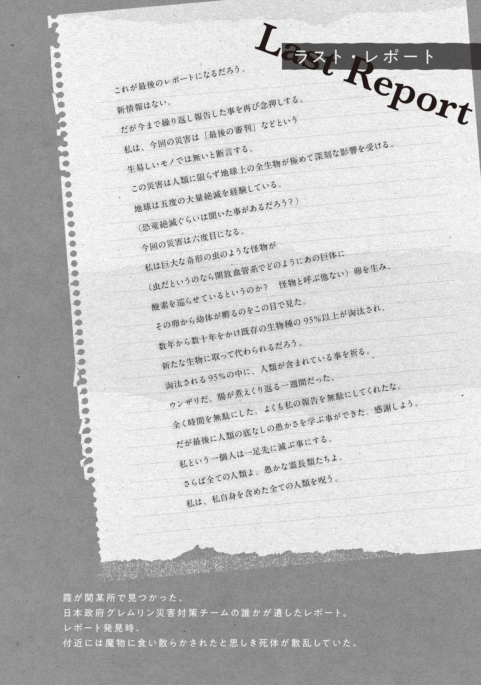
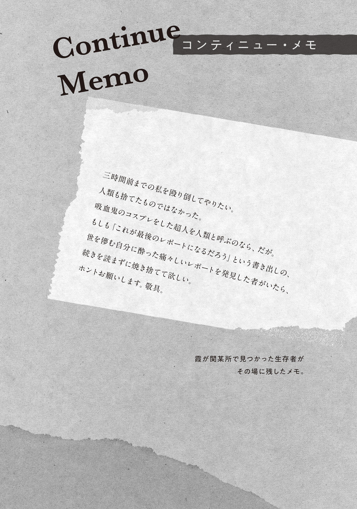
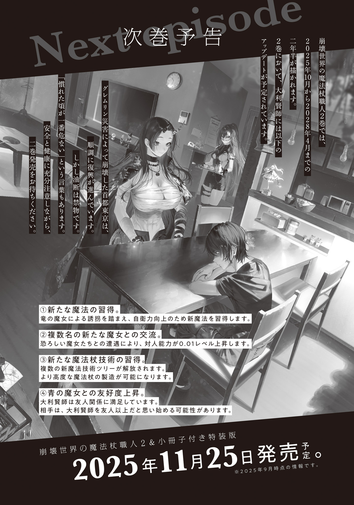
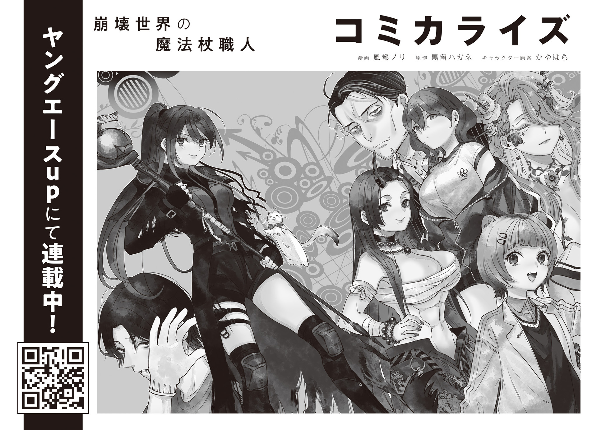

The autumn sky was high and clear. Ohinata Kei had come to visit the Blue Witch's home in Ome.

It was called a witch's home, but there was nothing storybook-like or spooky about it. Barbed wire ran all around the fence of the two-story house, and a dry moat had been dug so deep that if Ohinata fell in, she would never get back out. When she stood at its edge and carefully looked down, she met the eyes of a monster carcass half-buried in the dirt and hurriedly looked away.

Tokyo had overcome a coup, defeated a giant kaiju, launched measures to address the food crisis, and begun recovering from the Gremlin Disaster. Even so, the aftermath of the disaster still hung heavily in the air. Many homes had been fortified to one degree or another against monsters and mobs.

Ohinata pulled the cord at the front door and rang the bell. The Blue Witch appeared right away. When she saw Ohinata bow in greeting, she broke into a blooming smile and let her inside.

"Hello, Ao-san."

"Welcome, Kei-chan! Come in, come in."

"Excuse me. This is a pumpkin pie I baked. Please have some, if you'd like."

"Huh!? For me? You didn't have to go to all that trouble, but thank you. Kei-chan, you're such a good girl."

The Blue Witch gave her a light hug as she took the gift, and Ohinata hugged her back.

The Blue Witch had suffered one hardship after another beginning with the Gremlin Disaster, losing every member of her family and all her friends.

Ohinata knew the Blue Witch saw her own younger sister, who had died of illness, in Ohinata.

If spending time with her could heal even a little of the hurt in her heart, Ohinata was glad.

She thought of the Blue Witch as an older friend, but as an only child, she would be lying if she said she had never imagined having a kind, beautiful older sister.

The Blue Witch led her into the living room. In high spirits, she personally made Ohinata tea, and the two ate slices of pumpkin pie together. After they had chatted for a while and Ohinata's stomach was full, she brought up the first of her two reasons for coming.

"By the way, Ao-san. I have something I'd like to discuss."

"Something you want to discuss? Sure. Tell me anything."

Ohinata felt bad about taking advantage of the Blue Witch's kindness when she was being so supportive, but she had to say it. The Foresight Mage had asked her to make this proposal, but Ohinata thought it was important too.

"Um, it's about food."

"Yeah."

"Preserved food has a shelf life of about five years. Right now, preserved food has a high value as an asset, but as fertility magic spreads, its value will fall."

"That's true. It can rot or grow mold."

"Exactly. Ao-san, you have a lot of preserved food, right? Enough that you could not finish it alone even in a hundred years. If things stay like this, I think a lot of it will go bad before you can finish it."

"Mm. I think so too."

"If Ao-san is willing, the Tokyo Witches' Council can take the preserved food you cannot finish. There is one condition: depending on how much preserved food is taken, ownership of farmland of an appropriate size will be guaranteed. What do you think?"

In other words, would she trade food that would sit unused and rot for the status of a landowner?

They were spreading fertility-magic bypass incantations as fast as they could, but food was still rationed. They could use all the preserved food they could get for Tokyo's rations.

When Ohinata made the proposal, the Blue Witch tilted her head.

"Did the Foresight Mage tell you to say that?"

"...I was the one who agreed with this proposal."

She was right, but Ohinata answered carefully.

Her history of repeated betrayals and losses had made the Blue Witch suspicious. Even toward the Foresight Mage, whom everyone relied on and respected, she did not try to hide her caution.

To Ohinata, she had always been a kind and helpful older sister from the day they first met. But the Blue Witch was very cold to anyone outside her inner circle. Like ice.

But the Blue Witch nodded without hesitation.

"I see. Fine. I can have it ready to hand over in two days. Should I bring it to Bunkyo Ward?"

"I-Is that really okay?"

"It's Kei-chan's request."

The deal had gone through so easily that Ohinata blinked. It was three times smoother than she had expected, and three times sweeter.

Even knowing that the Blue Witch spoiled only her absolutely rotten, seeing her let go of an enormous food asset so easily made Ohinata worry.

"Is it really okay? Shouldn't you take time to think it over, or something?"

"It's fine. You can just take it without asking if you want."

The Blue Witch said it casually, then offered Ohinata an expensive tin of biscuits as she drank her tea.

She was being spoiled. Seriously spoiled.

Her father had spoiled her plenty too, but the Blue Witch was just as bad.

"Then, um, I'll let the higher-ups know. And then... one more thing. This one isn't anything major, but I have another, separate concern."

"Tell me anything. I'll solve it all for you."

The Blue Witch's confident smile looked so gallant, cool, and beautiful that Ohinata could almost see sparkles around her. Ohinata could understand perfectly why the Flame Witch and Hachioji Witch constantly proclaimed themselves huge fans.

Ohinata noticed that the smiling Blue Witch was looking toward her backside. Her face turned red, and she let her tail droop. She had been wagging it back and forth without realizing it.

"Awu. S-Sorry. My tail won't do what I tell it. Ahem. Anyway, my other concern is a personal relationship problem."

"Ori? Should I tell him to quit being pen pals already and come see you in person?"

"Ah, that's okay. Ori-san can go at his own pace with that. It's not that. Actually, there's been a strange person around me lately. I've noticed him staring at me from the shadows more than once or twice. When I try to talk to him, he runs away. The security guards are protecting me, but it's a little worrying."

"A stalker."

"Put harshly, yes..."

"Got it. I'll take care of him."

The Blue Witch immediately stood, Cyanos in hand. She gave Ohinata a warm, reassuring smile, but needles of frost rose from the floor and the tea on the table froze solid.

"Whoa!? W-W-W-Wait, please. Um, k-kill—d-die—no, that's not it. Um, I-I don't want you to solve this by force...!"

Ohinata clung to the Blue Witch as she tried to head out, stopping her, then explained the situation in detail.

The stalker who had begun lingering around her some time ago always hid his face, so she did not know who he was. Even when Ohinata's guards tried to catch him, he ran too fast to be caught.

If she asked the Foresight Mage, he would certainly be able to capture him. But Ohinata did not want to bring another headache to the backbone of Tokyo, who was always buried under piles of work and whose heavy bags under his eyes never went away.

That was why she had decided to rely on the Blue Witch. Witches possessed senses, power, speed, and magic beyond human limits. Someone who was only a little fast on his feet would be easy for her to corner and catch.

"What will you do after you catch him?"

"Talk to him. He hasn't harassed me or even tried to speak to me. He hasn't actually harmed me. So I want to ask why he's hanging around me, and if there's anything I can do, I'd like to do it."

"For a stalker...?"

"If we talk and he turns out to be the kind of creep I can't handle, then I'll make sure he receives punishment according to the law, okay?"

The two went back and forth for a while over what to do with the stalker. In the end, the Blue Witch gave in to Ohinata, who wanted a peaceful solution.

Ohinata took the Blue Witch back to Tokyo Magic University. There were no magic-linguistics lectures on Sunday, but she had something to do in her laboratory. Having been steeped in linguistics as naturally as breathing since childhood under her father's guidance, research in magic linguistics was closer to everyday life than work for Ohinata.

The Blue Witch was invited into the cluttered laboratory, where technical books and files were piled up beyond the bookshelves and blocked half the window. She sneezed at the musty smell of old paper.

"I heard the research into fertility-magic bypass incantations was over. What are you working on now?"

"I am researching the fire-magic core spell now. It is not an incantation containing an unpronounceable sound, but if we can modify the incantation and lower its magic-power cost, it will be easier to use. The research includes whether it is even possible to lower the cost by modifying an incantation."

"Fire magic. I feel like the fire-magic core spell is too weak to use for hunting monsters."

As she spoke, the Blue Witch moved closer to the window, looked all around outside without letting down her guard, then pulled the blinds shut.

"It is more for everyday life than for making a weapon to hunt monsters. Winter is coming, so demand for heating fuel will rise, and it is needed for metalworking too.

"You know how crystal rain started falling instead of thunderstorms, and roofs are easier to damage now?"

Crystal rain was like hail that did not melt even when the temperature rose. Greenhouses and the like were crushed in no time, and the roofs of homes were wrecked. Once a roof broke, it leaked, and the house quickly became unusable.

"We need strong metal roofs that can withstand the Gremlin rain that breaks roof tiles. But production is not keeping up at all. We are short on labor too, but fuel shortages are the bottleneck. If we can lower the cost of fire magic, heating, metalworking, cooking, and baths will all become easier. That is why I am researching it as a priority."

"I see. Is it possible the stalker is some kind of industrial spy?"

"Hmm... I hardly ever see him on campus. There are security guards at the gate, and if he climbed over the wall to get in, he would stand out. It does not seem like he is after my research results or anything."

"Then his target is Kei-chan herself. That's even creepier. He should die."

Ohinata gave a wry smile at the Blue Witch's blunt disgust.

The Gremlin Disaster had driven people who once lived peacefully into a corner and taken away their breathing room. It had forcibly drawn out the abnormal sides of people who could have stayed normal in a peaceful world.

Since that day, many people had started talking more roughly. Many had embraced strange ideologies or developed one-sided views.

Sometimes, though, a hidden weirdo had simply come out into the open—like the Wand Maker in Okutama.

After conducting a dozen or so magic experiments with the dodecahedral fractal wand Aleister, Ohinata collected and analyzed the data, working hard to build a new theory. The Blue Witch watched so quietly that Ohinata almost forgot she was in the room. But every time a sound came from the hall outside, she accurately tracked its source with her eyes through the wall.

Before long, the sun began to set, and the sky turned crimson. Ohinata, who had been focused on research the whole time, rolled her neck and gave a big stretch. Her eyes were bleary, and her tail went limp.

"Good work, Kei-chan."

"Ah. Thank you."

She pressed the steamed towel held out from beside her against her face and let its warmth soothe her. While it covered her eyes, she felt someone very lightly tickle her tail and ears, but she pretended not to notice.

Unlike Ori, the Blue Witch seemed to think touching too much was rude and always held herself back.

She enjoyed that irresistible fluff herself when she groomed it now and then, and she did not mind who touched it... as long as they did not touch her in a lewd way.

After taking a break, they left the university and headed home. Walking beside Ohinata, the Blue Witch spoke thoughtfully.

"While Kei-chan was researching, I did some thinking too. If the stalking has been going on for days, there is a good chance the culprit lives nearby. Can you think of anyone who recently moved into the neighborhood, or someone around you who has started acting strange?"

"Hmm... Surely not Ori-san...?"

"We can rule Ori out. He's always acted strange. Anyone else?"

As she walked, Ohinata folded her arms and searched her memory.

Things that had happened around the time she had begun feeling someone watching her. Changes in her surroundings. Of course, these were turbulent times, so something happened every day, but if she had to name something?

After sorting through what had happened around her, Ohinata realized one thing.

"Come to think of it, he only follows me when I am in my stoat form."

"A furry!? Now the Ori theory is looking real again. No, if it were Ori, he would ask you to your face to let him pet you or something... So he wasn't a creep—he was a pervert."

The Blue Witch had gone beyond disgust and was now completely creeped out. After talking it over with Ohinata, she proposed setting a trap for the stalker.

In her stoat form, Ohinata was a helpless little animal. A stalker who targeted her when she was helpless was the last thing she wanted.

After making their arrangements, Ohinata cast a spell and transformed into a stoat, handing her clothes and wand to the Blue Witch.

Alone, Ohinata toddled along the damaged road at dusk and realized that the prey had fallen into the trap in record time. Less than three minutes after she began moving alone, she spotted a suspicious man behind a nearby leaning utility pole. He was breathing hard and staring at her intently.

She shuddered, caught her breath, and stopped.

From a stoat's perspective, humans looked huge. Everything looked big and overwhelming, and knowing that this was a man watching and pursuing her made every hair on her body stand on end. His long shadow in the sunset and the expression hidden by the backlight filled her with instinctive fear, as though she had encountered a humanoid monster.

"Freezing Javelin[ドウ・ヴアアラー]!"

But the terrifying stalker screamed when an ice spear suddenly flew in and grazed his ear. It pierced through the utility pole, smashed the wall behind it, punched a hole in the house beyond that wall, and only then stopped.

After seeing a witch's powerful attack—the kind no one should fire at a human—the stalker wet himself and his legs gave out.

Ohinata backed away a little too. Even with the same incantation, a witch's magic had power on a completely different level from a human's. All the more so with the Blue Witch using Cyanos, which abnormally amplified the power of magic.

"E-Eeeeeek...!"

"Scum! Stay down. Make one suspicious move and I'll kill you."

The Blue Witch, who had been lying in wait on the roof, leaped lightly down to the road. She stepped on the stalker's back, pressed Cyanos to the back of his head, and warned him.

Trembling all over, the stalker nodded. Up close, he was just an ordinary human.

His hair was a mess, and he was gaunt, with sunken cheeks and eyes. But his clothes were clean, and his eyes were lowered as if he had resigned himself.

Seeing that his mental state at least seemed normal, Ohinata scampered right in front of him. She brought herself level with his eyes and asked him,

"Um. You're the person who has been lingering around me for a while, right? You're scaring me, so please stop."

"I-I'm sorry..."

"Why are you doing this? Are you a... furry-san?"

She thought there were no bad people who liked animals. But when she herself became an animal and got followed around, it was definitely scary.

Hoping that if they could talk and reconcile, they could find a solution they both accepted, she asked him. The stalker hesitated several times before answering in a pained voice.

"B-Because you looked like Fu-chan..."

"Fu-chan?"

When Ohinata tilted her head to one side, the Blue Witch and the stalker groaned at the same time.

"An assault of cuteness! Y-You really do look just like Fu-chan.

"Fu-chan was my pet ferret. Fu-chan the ferret. Fu-chan went to heaven in the Gremlin Disaster. When I saw you, I thought Fu-chan had come back!

"I-I'm sorry. I know this is wrong. I know you're different. You're a stoat. Fu-chan is gone now.

"But, but, you looked like Fu-chan. You looked just like Fu-chan...!"

Remembering something, the stalker began to sob uncontrollably. His nose ran, and his tears left dark stains on the asphalt. He did not look like he was acting. He had to be sincere.

"Pet loss..."

The Blue Witch still had the stalker pinned beneath her foot, but she murmured with a little sympathy and pulled Cyanos away.

The Gremlin Disaster had taken the lives of a full 80% of the population in Tokyo alone.

But humans were not the only lives lost. Many people had lost pets they loved like family and were left with deep wounds in their hearts.

Ohinata had lost a pet Java sparrow long ago and cried her eyes out, so she could understand the stalker's feelings a little.

"Please accept my condolences. I'm very sorry about Fu-chan-san. But I am not Fu-chan-san. From now on, could you please not do suspicious things near me?"

"Nnngh...!"

The stalker, his face a mess of tears and snot, nodded in genuine anguish. Seeing how terribly sad he looked made Ohinata's heart ache.

But she could not possibly become Fu-chan's replacement just because she felt sorry for him. It might seem cruel, but he had to overcome his grief himself.

When Ohinata nodded, the Blue Witch took her foot off the stalker's back. She picked up Ohinata, who was getting sentimental, placed her on her shoulder, and started to leave.

But the stalker called out after them in a pleading voice.

"Wait! Could you teach me that magic?"

"Huh?"

When they turned around, the stalker was prostrating himself with all his might.

He bowed low, as though he might grind his forehead against the asphalt, and begged.

"Please! Teach me the magic that lets me turn into a stoat!"

Ohinata looked to the Blue Witch in confusion and found the same expression on her face.

"...I don't mind, but it is stoat-transformation magic, not ferret transformation. Strictly speaking, it is not even a stoat. Stoats cannot speak human words like this, after all. It is a different creature that looks exactly like a stoat. Also, it is not magic you can cast on someone else. You can only transform yourself. It uses a lot of magic power too. You need around 100× the magic power of an ordinary person just to activate it.

"What's more, the magic's effect is unstable. Even if you do transform, all the fur on your tail may fall out, or you may be blind or deaf. The chance of transforming into a normal stoat is low."

Ohinata listed the problems, but the stalker looked straight at her with eyes as though he had seen a light of hope in the whirlpool of his grief. He nodded firmly.

"It's okay. I think if I become a stoat, I might be able to get closer to Fu-chan."

"I-Is that so? The incantation is difficult to pronounce, and learning it will not be easy."

"I have absolute pitch. It's okay. I can remember any sound after hearing it once!"

Overwhelmed by his enthusiasm, Ohinata taught the stalker the incantation for stoat-transformation magic.

Magic language had a very different sound system from Earth's languages. And it had no effect unless pronounced accurately. Even correct pronunciation was useless without enough magic power.

Ohinata expected teaching him to be a 99.9% waste of time, but her first shock came when the stalker immediately repeated the incantation after hearing it once, without the slightest mistake.

"Cross the underside[イエーヴ・ササ], spit out the divination tortoise[ニムテツトツタナ][^1], and even a cornered rat becomes a white beast[ヤオグ・ヤヨグ・エンイエンシユオア]."

Then Ohinata got her second surprise.

The moment the stalker recited the spell, he transformed into a stoat with a pop like a bursting balloon and a puff of white smoke.

He had enough magic power.

The stoat wriggled out from the clothes lying in the road, his round eyes sparkling, and stared at his own two hands in disbelief.

Then the stalker, now a stoat, began shouting excitedly.

"Waaaaah! It's Fu-chan! It's Fu-chan! These are Fu-chan's little paws! Fu-chan's fluffy tail! Woooooo! Sniff sniff, it smells like Fu-chan! Gwaaaaaah!"

"Eek..."

"Whoa..."

Bursting with energy. The two were completely creeped out by the sight of the stalker gleefully chasing his own tail.

Ohinata wanted the magic she researched to heal someone's wounds and help them.

The stalker's heart had been saved by Ohinata's magic. She should have been happy about it.

But watching a stoat transformed from an adult man chase his own tail in circles, scream his obsession—including words unfit for broadcast—and explode with emotion somehow did not sit right with her.

"N-Not cute. So he was a pervert with 100× an ordinary person's magic power..."

Even Ohinata, who usually tried not to say bad things about people, had to nod at the Blue Witch's spot-on words.

An ogre with an iron club. A pervert with magic.

She felt like she had done something outrageous, but if he was happy and did not cause trouble for anyone else, it was a good thing. Surely. Probably. Most likely.

Ohinata felt suddenly exhausted. After teaching the stalker the incantation for returning to human form, she climbed onto the Blue Witch's shoulder and went home.

Ohinata was a girl who had already been through many terrible experiences at the tender age of twelve.

But this Sunday was unbelievable in all kinds of ways—one she would never forget.

## Afterword

When you grow up, you come to understand things you could not as a child.

...Or so adults say. But when you grow up, you stop understanding things you did as a child.

When I was a child, I could not understand adults saying, "I don't understand how children feel." Adults used to be children too, but they don't understand how children feel? Why? Those were their own feelings back then. Why don't they understand? Did they forget? Is their memory garbage? That was what I thought.

So I grew up determined, "I will ABSOLUTELY never forget how I feel right now (as a child)!"

I still remember how I felt when I wanted my mother to buy me sweets at the supermarket and she would not. I was convinced she would not buy them because she did not properly understand my feelings. If my feelings got across, if she understood how strongly I wanted them, she would definitely buy them. So I lay down on the store floor, flailed my whole body around, and screamed, "Buy them! Buy them!" at the top of my lungs. I was bawling my eyes out.

I remember that feeling well, so when I see a child bawling and throwing a selfish tantrum, I end up smiling. I know exactly how that feels. I really do. I am sorry to parents having a hard time with their children, but I am on the side of children who throw selfish tantrums and go wild. Emotionally, at least.

And yet, even though I have lived with my old feelings carved into my heart so I would not forget them, I have forgotten some things.

Until around six years ago, I took joy in stealing readers' time through novels.

Say I spent 10 hours writing a novel. Then 11 readers each spent one hour reading it. I used 10 hours, and I stole a total of 11 hours from my readers. That left me with a profit of one hour. That made me happy!

Unfortunately, I have forgotten that feeling.

I no longer understand how I felt then. I understand the logic, but the feeling that used to rise from the bottom of my heart is gone. Sad.

Then again, I have gained some new feelings too.

Like the joy of publishing a book, then going on social media and reading readers' posts saying they have finished it. Heh heh.

Feelings I have lost, feelings I still have, feelings I have discovered anew—there are all kinds.

As I seek out new joys, I want to cherish the hollowed-out remains of old feelings—the fragments of what my past self felt—and live without losing them.

## Addendum

This series actually has an official X account. It shares a steady stream of information in an appropriate way on behalf of the author, who tends to stay quiet for fear of letting some unreleased detail slip.

You can get all the latest news as fast as possible: when a new volume is coming out, what its cover art looks like, events related to this series, and plenty more.

If you are interested, please follow it.

Even if you are not interested, please follow it as an act of mercy.

Don't worry! Following only takes a moment. It won't hurt. Just for a second—it'll be over soon! Everyone else is following it too! Right? There is no particular rumor that following will make you lose weight, put you in the starting lineup for your club, raise your test scores, increase your salary, make you popular, or help you fall asleep better. But you have nothing to lose.

Well then, see you in the afterword of Volume 2.

One day in August 2025 — Kurodome Hagane[^2]

## Translator Notes

[^1]: The ambiguous character `蔡` can mean a divination tortoise, a weed, or the ancient state of Cai. Context does not establish the intended sense; “divination tortoise” is one possible dictionary sense used provisionally here while preserving the separate magic-language reading.

[^2]: **Reiwa 7:** The seventh year of Japan's Reiwa era, corresponding to 2025.
