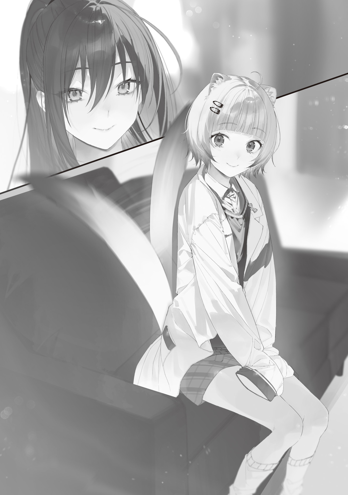
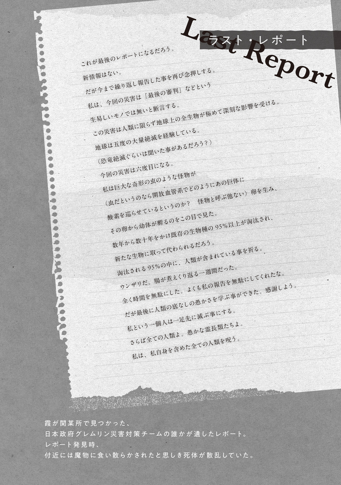
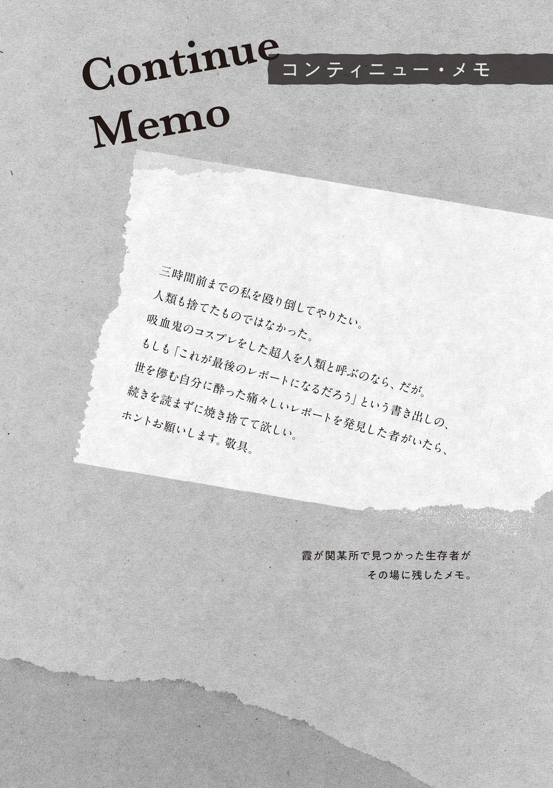
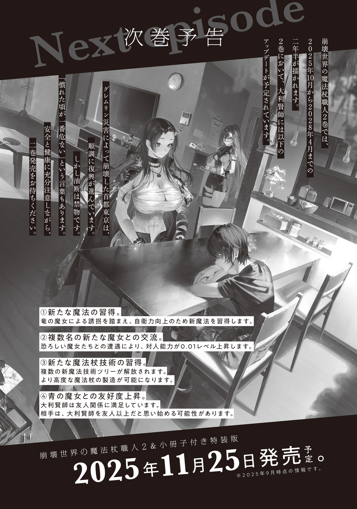
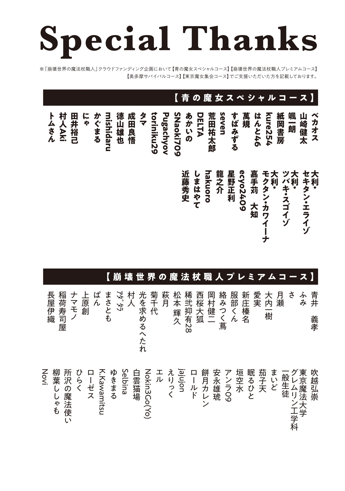
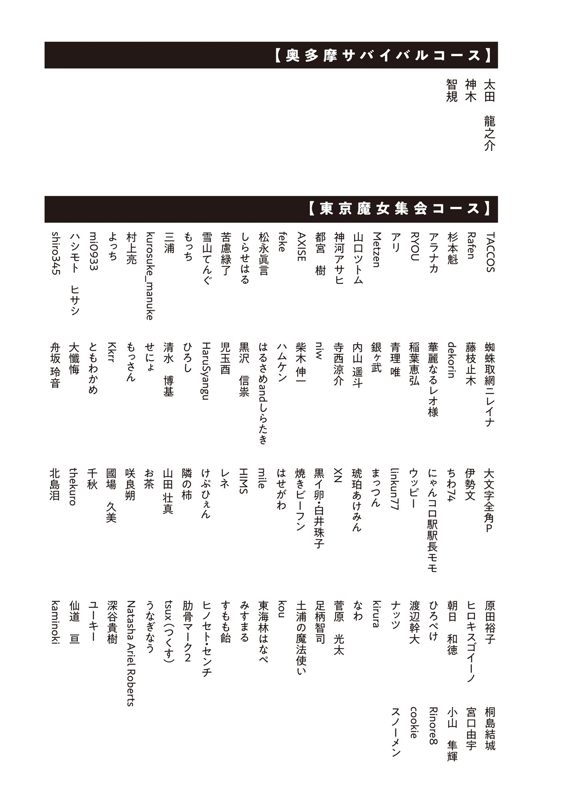
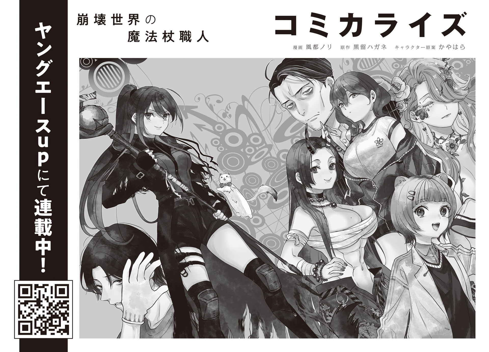

It was autumn, when the skies are high and the horses grow fat, and Ohinata Kei had come to visit the Blue Witch's house in Ome.

It may have been a witch's house, but there was nothing fairy-tale or spooky about it. Barbed wire ran all along the fence around the two-story house, and outside it was a dry moat so deep that someone Ohinata's height who fell in would never climb back out. When she stood at the edge and peeked down, she locked eyes with a monster carcass half-buried in the dirt and quickly looked away.

Tokyo had come through a coup, taken down a giant kaiju, and rolled out measures against the food crisis, and its people were starting to recover from the Gremlin Disaster. Even so, the disaster's aftermath still hung heavy in the air, and plenty of houses had been fortified to some degree against monsters and rioters.

When Ohinata pulled the cord by the front door to ring the bell, the Blue Witch appeared right away. Ohinata bowed in greeting, and the Blue Witch broke into a radiant smile and let her in.

"Hello, Ao-san."

"Welcome, Kei-chan! Come in, come in."

"Thanks for having me. I baked you a pumpkin pie. Please have some, if you'd like."

"Huh!? For me? You didn't have to go to all that trouble, but thank you. You really are such a good girl, Kei-chan."

The Blue Witch gave her a light hug as she took the gift, and Ohinata hugged her back.

Starting with the Gremlin Disaster, the Blue Witch had suffered one hardship after another, and she had lost every member of her family and every one of her friends.

Ohinata knew that when the Blue Witch looked at her, she saw the younger sister she had lost to illness.

If spending time with her eased the Blue Witch's heartache even a little, that made Ohinata happy.

She thought of the Blue Witch as an older friend, but she would be lying if she said that, as an only child, she had never daydreamed about having a kind, beautiful big sister.

In the living room, the Blue Witch cheerfully made the tea herself and cut the pumpkin pie, and the two of them ate it together. Once they had chatted a while and filled their stomachs, Ohinata brought up the first of the two things she had come to talk about.

"By the way, Ao-san, there's something I'd like to talk over with you."

"Talk over? Sure. Tell me anything."

The Blue Witch was so warm and encouraging that Ohinata felt a little guilty, like she was taking advantage of her kindness. Still, she couldn't very well keep quiet. Foresight had asked her to float this idea, but Ohinata thought it mattered too.

"Um, it's about food."

"Yeah."

"Preserved food only keeps for about five years. Right now it's a valuable asset, but as fertility magic spreads, it'll be worth less and less."

"True. It'll rot or go moldy, too."

"Exactly. You have a lot of preserved food, don't you, Ao-san? More than you could eat by yourself in a hundred years. At this rate, I think a lot of it is going to go bad before you can eat it."

"Mm. I think so too."

"If you're willing, Ao-san, the Witches' Council can take the preserved food you can't eat off your hands. There's one condition attached: in return, you'd be guaranteed ownership of farmland sized to match how much food they take. What do you think?"

In short, would she trade food that would otherwise sit in storage and rot for a landowner's standing?

The fertility-magic bypass incantation was being spread at top speed, but food was still rationed, and there was no such thing as too much preserved food to hand out to the people of Tokyo.

The Blue Witch tilted her head at the proposal.

"Did Foresight tell you to say that?"

"...I'm the one who agreed to this proposal."

The Blue Witch had guessed right, but Ohinata chose her words carefully.

After being betrayed and losing people again and again, the Blue Witch had become a deeply suspicious witch. She made no effort to hide her wariness even toward the Foresight Mage, whom everyone relied on and respected.

To Ohinata, she had been a kind, caring big sister from the day they met, but to anyone outside her inner circle, the Blue Witch was very cold. Like ice.

Yet she just nodded, without a moment's hesitation.

"Okay. Sure. I can have it ready to hand over in two days. Should I bring it to Bunkyo Ward?"

"I-Is that really okay?"

"You're the one asking, Kei-chan."

The deal went through so easily that Ohinata blinked. It was three times smoother than she had expected, and three times sweeter.

Ohinata knew the Blue Witch spoiled her rotten, and only her, but watching her give up an enormous stockpile of food so easily still made Ohinata worry.

"Are you really sure? Don't you want some time to think it over?"

"I'm sure. You can just go take it yourself, if you want."

The Blue Witch said it breezily, sipping her tea as she offered Ohinata a tin of fancy biscuits.

She was being spoiled. Seriously spoiled.

Her father had been plenty soft on her too, but the Blue Witch was right up there with him.

"Then, um, I'll pass that along to the higher-ups. And... there's one more thing. It's nothing big, but there's something else I wanted to ask you about."

"Tell me anything. I'll solve it all for you."

Smiling reassuringly, the Blue Witch looked so dashing and cool and beautiful that she practically sparkled. No wonder the Flame Witch and the Hachioji Witch never stopped telling everyone they were her biggest fans.

Then Ohinata noticed that the Blue Witch's smiling gaze had drifted to somewhere around her rear. Blushing, she let her tail droop; she had been swishing it back and forth without realizing.

"Awu. S-Sorry. My tail doesn't listen to me. Ahem. So, the other thing I wanted to ask about is a personal problem I'm having with someone."

"Is it Ori? Want me to tell him to knock off the letter-writing already and show his face?"

"Oh, no, that's fine. Ori-san can take that at his own pace. It's not about him. Actually, there's been a strange person hanging around me lately. More than once or twice, I've caught him watching me from the shadows. Whenever I try to talk to him, he runs away. The guards do protect me, but it's a little unnerving."

"A stalker."

"If you want to put it bluntly, yes..."

"Got it. I'll deal with him."

The Blue Witch was on her feet at once, Cyanos in hand. Even as she gave Ohinata a warm, reassuring smile, needles of frost sprouted from the floor and the tea on the table froze solid.

"Whoa!? W-W-W-Wait, please. Um, k-kill—d-die—no, that's not it. Um, I'm not asking you to solve this by force...!"

Ohinata clung to the Blue Witch to keep her from charging off, then explained the situation in more detail.

The stalker had started hanging around her a while back. He always kept his face hidden, so no one knew who he was, and whenever her bodyguards tried to catch him, he was too quick for them.

The Foresight Mage could have caught him for sure, but Ohinata didn't want to hand a new headache to the pillar holding Tokyo up, a man so buried in work that the dark circles under his eyes never went away.

So she had decided to turn to the Blue Witch instead. Witches had senses, strength, speed, and magic far beyond any human's. Someone who was just a little quick on his feet would be easy for her to corner and catch.

"And once he's caught, then what?"

"I'll talk to him. He hasn't harassed me or tried to speak to me or anything. He hasn't actually done me any harm. So I want to ask him why he's hanging around me, and if there's anything I can do for him, I'd like to help."

"For a stalker...?"

"If we talk and he turns out to be the kind of creep I can't deal with, I'll make sure he's properly punished under the law, okay?"

The two of them went back and forth for a while over what to do with the stalker, but in the end, the Blue Witch gave in to Ohinata's wish for a peaceful solution.

Ohinata brought the Blue Witch back with her to Tokyo Magic University. It was Sunday, so there were no magic-linguistics lectures, but she had work to do in her lab. Her father had brought her up on linguistics, and she had been soaking it in as naturally as breathing since she was little, so for her, magic-linguistics research felt less like work and more like everyday life.

The lab was a mess, with technical books and files overflowing the shelves and stacked high enough to block half the window. When Ohinata showed her in, the musty smell of old paper made the Blue Witch sneeze.

"I heard you finished your research on the fertility-magic bypass incantation. What are you working on now?"

"Right now, I'm researching the fire-magic core spell. Its incantation doesn't have any unpronounceable sounds in it, but if we can modify it to lower its magic-power cost, it'll be easier to use. Part of the research is finding out whether you can even cut an incantation's cost by modifying it in the first place."

"Fire magic, huh. I feel like the fire-magic core spell is too weak to be much use against monsters."

As she talked, the Blue Witch went over to the window, scanned the whole area outside with a wary eye, and then closed the blinds.

"It's less about making a weapon against monsters and more about everyday life. Winter's coming, so we'll need more fuel for heating, and metalworking needs it too.

"You know how we get crystal rain now instead of thunderstorms, and roofs get damaged a lot more easily?"

Crystal rain was basically hail that didn't melt even when it warmed up. Greenhouses and the like had been crushed in no time, and roofs everywhere had been battered to pieces. A broken roof leaked, and a leaky house didn't last long.

"We need strong metal roofs that can hold up against Gremlin rain, since it breaks roof tiles. But production can't keep up at all. We're short on hands too, but the real bottleneck is fuel. If we can cut the cost of fire magic, heating, metalworking, cooking, and baths will all get easier. That's why I'm making it a priority."

"Makes sense. Any chance the stalker's some kind of industrial spy?"

"Hmm... I don't really see him on campus. Hardly ever. There are guards at the gate, and anyone climbing over the wall would stand out. I don't think he's after my research or anything like that."

"Then it's you he's after, Kei-chan. That's even creepier. He should just die."

Ohinata gave a wry smile at the Blue Witch's blunt disgust.

The Gremlin Disaster had backed people who used to live peaceful lives into a corner and stripped them of any breathing room. It had dragged out the not-so-normal parts of people who would have stayed perfectly normal in a peaceful world.

Since that day, a lot of people had gotten foul-mouthed, and a lot had latched on to strange ideas or developed lopsided views.

Then again, in some cases, like the Wand Maker in Okutama, a weirdo who had been hiding all along had simply come out into the open.

Ohinata ran a dozen-odd magic experiments with her dodecahedral fractal wand Aleister, then compiled and analyzed the data and got to work building a new theory. The Blue Witch watched over her so quietly that Ohinata nearly forgot she was in the room, though whenever something made a noise in the hallway, her eyes followed the source precisely, right through the wall.

Eventually the sun sank low and the sky turned red. Ohinata, who had been absorbed in her research the entire time, rolled her neck and gave a big stretch. Her eyes were bleary, and her tail had gone limp.

"Good work, Kei-chan."

"Ah. Thank you."

A steamed towel was quietly held out from beside her, and she pressed it to her face, letting the toasty warmth soak in. While it covered her eyes, she felt her tail and ears being ever so gently tickled, but she pretended not to notice.

Unlike Ori, the Blue Witch apparently thought too much touching was rude, so she always held back.

Ohinata enjoyed her own irresistible fluff now and then while grooming it, so she didn't really mind anyone touching it... as long as they weren't being pervy about it.

After a short rest, they left the university. On the way home, the Blue Witch spoke up thoughtfully as she walked beside Ohinata.

"I was thinking too while you were doing your research, Kei-chan. If this has been going on for days, there's a good chance whoever it is lives nearby. Has anyone moved into your neighborhood recently? Or has anyone around you started acting strange?"

"Hmm... It couldn't be Ori-san... could it?"

"You can rule Ori out. He was acting strange long before this. Anyone else?"

As she walked, Ohinata folded her arms and searched her memory.

What had happened around the time she started feeling eyes on her? What had changed around her? These were turbulent times, of course, and something happened every day, but if she had to pick one thing...?

As she went back over everything in her head, one fact came to her.

"Come to think of it, he only follows me when I'm a stoat."

"A furry!? Now the Ori theory's actually back on the table. No, if it were Ori, he'd just tell you to your face to let him pet you or something... So he's not a creep, he's a pervert."

Now thoroughly weirded out rather than merely disgusted, the Blue Witch talked it over with Ohinata and suggested they set a trap for the stalker.

As a stoat, Ohinata was a small, helpless animal, and a stalker who went after her exactly when she was helpless was the last thing she wanted around.

Once they had worked out the plan, Ohinata cast the spell, turned into a stoat, and left her clothes and wand with the Blue Witch.

As she pattered alone down the broken road in the evening light, Ohinata realized the prey had taken the bait at record speed. She had been on her own for less than three minutes when she spotted a suspicious man in the shadow of a nearby leaning utility pole, breathing hard and staring at her, unblinking.

A chill ran through her, and she caught her breath and froze.

Seen from a stoat's eye level, humans were huge. Everything looked big enough to overwhelm her, and knowing that this particular man had been following and watching her made every hair on her body stand on end. With his shadow stretched long by the setting sun and his face lost in the backlight, he stirred a deep, instinctive fear in her, as if she had run into a monster in human shape.

"<ruby>Do Vaa-ra<rt>Freezing Javelin</rt></ruby>!"

But that terrifying stalker screamed as an ice spear came flying out of nowhere and grazed his ear. The spear punched through the utility pole, smashed the wall behind it, and blew a hole in the house on the other side before it finally stopped.

Faced with a witch's attack, one far too strong to ever fire at a person, the stalker wet himself and his legs gave out.

Even Ohinata shrank back a little. A witch's magic was on a whole different level from a human's, even with the same incantation, and all the more so with Cyanos, which amplified magic to absurd degrees.

"E-Eeeeeek...!"

"Scum! Stay down. Make one suspicious move and I'll kill you."

The Blue Witch had been lying flat on a rooftop. She dropped lightly down to the road, planted a foot on the stalker's back, and pressed Cyanos to the back of his head as she gave the warning.

The stalker nodded, shaking all over. Up close, he turned out to be just an ordinary person.

His hair was a mess, and he was haggard and hollow-cheeked, his eyes sunken. But his clothes were clean, and he kept his gaze lowered like he had given up.

Judging that he was at least in his right mind, Ohinata scampered right up to his face, got level with his eyes, and asked him,

"Um. You're the one who's been hanging around me for a while now, right? It's scary, so I'd like you to stop."

"I-I'm sorry..."

"Why are you doing this? Are you a... furry-san?"

Ohinata believed nobody who loved animals could be a bad person. But being the animal someone was following around turned out to be plenty scary.

If they could talk it out and make peace, she wanted to find some middle ground they could both accept. When she asked, the stalker faltered a few times before answering, sounding pained.

"B-Because you looked like Fu-chan..."

"Fu-chan?"

Ohinata cocked her head, and the Blue Witch and the stalker both let out a strangled groan at the same moment.

"That's assault by cuteness! Y-You really do look just like Fu-chan.

"Fu-chan was my pet ferret. Fu-chan the ferret. Fu-chan went to heaven in the Gremlin Disaster. When I saw you, I thought Fu-chan had come back!

"I-I'm sorry. I know this is wrong. I know you're different. You're a stoat. Fu-chan is gone now.

"But, but, you looked like Fu-chan. You looked just like Fu-chan...!"

The stalker remembered something and broke down sobbing his heart out. With his nose running and his tears leaving dark spots on the asphalt, he didn't look like he was acting in the slightest. He had to mean every word.

"Pet loss..."

The Blue Witch kept the stalker pinned under her foot, but she murmured it with a little sympathy and drew Cyanos back.

In Tokyo alone, the Gremlin Disaster had taken the lives of a full eighty percent of the population.

But human lives weren't the only ones lost. Plenty of people had lost pets they loved like family and been left with deep wounds in their hearts.

Ohinata had once cried her eyes out when her pet Java sparrow died, so she understood a little of how the stalker felt.

"Please accept my condolences. I'm very sorry about Fu-chan-san. But I'm not Fu-chan-san. From now on, could you please not do anything suspicious around me?"

"Nnngh...!"

His face a mess of tears and snot, the stalker nodded as if it hurt him to his core. Seeing him look so miserable made Ohinata's heart ache.

Still, she couldn't exactly stand in for Fu-chan just because she felt sorry for him. It might sound cruel, but he would have to get over his grief on his own.

At Ohinata's nod, the Blue Witch took her foot off the stalker's back, scooped up Ohinata, who was feeling a little choked up, set her on her shoulder, and turned to go.

But the stalker called after them, pleading.

"Wait! Could you teach me that magic?"

"Huh?"

When they turned around, the stalker was prostrate on the ground, bowing with everything he had.

He pressed his head so low it looked like he might grate his forehead off on the asphalt, and begged.

"Please! Teach me that magic for turning into a stoat!"

Baffled, Ohinata looked at the Blue Witch, who wore the exact same expression.

"...I don't mind, but it's stoat-transformation magic, not ferret transformation, you know? Strictly speaking, it's not even a stoat. Stoats can't talk like people, the way I'm doing now. It's a different creature that just looks exactly like a stoat. Also, you can't cast it on someone else. It only transforms the caster. It uses a lot of magic power, too. It won't activate unless you have around 100 times an ordinary person's magic power.

"On top of that, the effect is unstable. A lot of the time, even if you do transform, all the fur on your tail falls out, or you can't see, or you can't hear. The odds of turning into a normal stoat are low."

She laid out every problem, but the stalker looked straight at her with the eyes of a man who had spotted a ray of hope in a whirlpool of grief, and nodded firmly.

"That's fine. I think if I become a stoat, I might be able to get closer to Fu-chan."

"I-Is that right? The incantation's hard to pronounce, though, and it's tough to memorize."

"I have absolute pitch. I'll be fine. I can memorize any sound after hearing it once!"

Swept along by his enthusiasm, Ohinata taught the stalker the incantation for stoat-transformation magic.

Magic language had a sound system very different from any language on Earth, yet it did nothing unless you pronounced it exactly right. And even with the pronunciation right, it was useless without enough magic power.

Ohinata had taught him fully expecting it to be 99.9% wasted effort, so her first shock came when the stalker immediately repeated the incantation back without the slightest error after hearing it just once.

"<ruby>Ie-vu Sasa<rt>Cross the underside</rt></ruby>, <ruby>Nimutetsutotsutana<rt>spit out the divination tortoise</rt></ruby>[^1], and <ruby>Yaogu Yayogu Enien Shiyuoa<rt>even a cornered rat becomes a white beast</rt></ruby>."

Then Ohinata got her second surprise.

The moment the stalker recited the spell, he transformed into a stoat with a pop like a bursting balloon and a puff of white smoke.

He had enough magic power.

A stoat wriggled out of the clothes lying in the road, round eyes sparkling, and stared at his own two hands as if he couldn't believe them.

Then the stoat-ified stalker started yelling in excitement.

"Waaaaah! It's Fu-chan! It's Fu-chan! These are Fu-chan's little paws! Fu-chan's fluffy tail! Woooooo! Sniff sniff, it smells like Fu-chan! Gwaaaaaah!"

"Eek..."

"Whoa..."

Bursting with energy. As the stalker gleefully started chasing his own tail, the two of them recoiled in horror.

Ohinata had wanted the magic she researched to heal people's wounds and help them.

And her magic really had saved the stalker's heart. That was something to be happy about.

But watching a grown man turned stoat spin in circles after his own tail, shrieking his obsessive love—words you couldn't say on TV included—in a full-blown frenzy of excitement somehow didn't sit right with her.

"N-Not cute. So he was a pervert with 100 times an ordinary person's magic power..."

Ohinata normally tried not to badmouth anyone, but the Blue Witch was spot-on, and even she had to nod.

An ogre with an iron club. A pervert with magic.

She had a feeling she had done something outrageous, but if he was happy and didn't cause trouble for anyone else, that was a good thing. Surely. Probably. Most likely.

Suddenly exhausted, Ohinata taught the stalker the incantation for turning back into a human, then rode home on the Blue Witch's shoulder.

At just twelve years old, Ohinata had already been through plenty of terrible things.

But this particular Sunday was unbelievable in all sorts of ways, and it was going to stick in her memory whether she liked it or not.

## Afterword

When you grow up, you come to understand things you couldn't as a child.

...Or so adults say. But when you grow up, you also stop understanding things you understood as a child.

When I was a child, I couldn't understand why adults said, "I don't understand how children feel." They used to be children too, so how could they not understand? Why? Those were their own feelings once. Why don't they get it? Did they forget? Is their memory garbage? That's what I thought.

So I grew up vowing, "I will ABSOLUTELY never forget how I feel right now (as a child)!" And then I became an adult.

I still remember how I felt when I wanted my mother to buy me sweets at the supermarket and she wouldn't. I was sure she wasn't buying them because my feelings weren't getting through to her. If they got through, if she understood how badly I wanted them, she would definitely buy them. So I lay down on the store floor, thrashed around with my whole body, and screamed, "Buy them! Buy them!" at the top of my lungs, bawling my eyes out.

Because I remember that feeling so well, when I see a child bawling and throwing a tantrum, I end up smiling. I know how you feel. I know it very well. Apologies to all the parents with their hands full, but I'm on the side of kids who demand what they want and tear the place apart. In spirit, anyway.

And yet, even though I've gone through life with my old feelings carved into my heart so I wouldn't forget them, there are some things I've forgotten.

Until about six years ago, I got a real thrill out of stealing readers' time with my novels.

Say I spend ten hours writing a novel, and eleven readers each spend an hour reading it. That means I've used up ten hours and taken a total of eleven hours from my readers. That leaves me with a net profit of one hour. How great is that!

Unfortunately, I've forgotten that feeling.

I no longer understand how I felt back then. I get the logic, but the emotion that used to well up from deep inside is gone. Sad.

On the other hand, I've gained some new feelings too.

Like the joy of publishing a book and reading readers' posts on social media saying they've finished it. Heh heh.

Feelings I've lost, feelings I still have, feelings I've newly discovered—there are all kinds.

I want to keep finding new joys while taking good care of the hollow husks of old feelings, the fragments of what my younger self felt, and live my life without losing them.

## Addendum

This series actually has an official X account. The author tends to keep quiet for fear of letting slip something that hasn't been announced yet, so the account steps in and puts out plenty of information the proper way.

It's the fastest way to get all kinds of news: when the next volume comes out, what its cover looks like, events related to the series, and more.

If you're interested, please give it a follow.

Even if you're not interested, please follow it as an act of mercy.

It's okay! Following only takes a second, and it won't hurt. Just a little bit, and it'll be over before you know it! Everyone else is doing it! Right? There's no rumor in particular that following will make you lose weight, put you in the starting lineup for your club, raise your test scores, get you a raise, make you popular, or help you fall asleep better. But you've got nothing to lose.

Well then, see you again in the afterword of Volume 2.

One day in August 2025 — Kurodome Hagane[^2]

## Translator Notes

[^1]: The ambiguous character 蔡 can mean a divination tortoise, a weed, or the ancient state of Cai. Context does not establish the intended sense; “divination tortoise” is one possible dictionary sense used provisionally here while preserving the separate magic-language reading.

[^2]: **Reiwa 7:** The seventh year of Japan's Reiwa era, corresponding to 2025.
