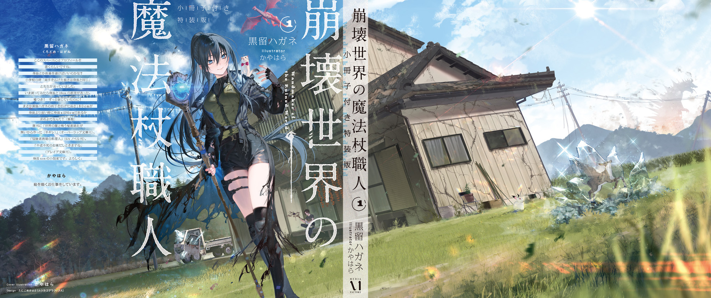

Spring into summer always brought a lot of rain, and today was another downpour.

I leaned against my window frame, staring absently at the thick, low-hanging rain clouds and listening to the hard clatter of magical crystals falling out of the sky onto the roof.

The Gremlin Disaster had changed the world drastically, and the weather was one of the changes that really stood out.

Namely, crystal rain.

Crystal rain had taken the place of thunderstorms. It was a whole new kind of weather, a rain of Gremlin crystals, and a real nuisance, since it dropped Gremlins right out of the sky. The electricity that should have built up inside cumulonimbus clouds and struck the ground as lightning turned into Gremlins instead and came pelting down on the land.

When it came down hard, it punched through umbrellas and wrecked roof tiles until the roof leaked. The property damage added up more than you'd think.

Farms took a beating too. The crystals shredded crop leaves and nicked fruit that was nearly ready to pick. And when a field's soil got loaded with pebbles (or rather, tiny pebble-like Gremlins), they stunted root growth and made for poor tuber crops.

Since crystal rain came with heavy rain, it set off debris flows as well. Huge amounts of rainwater swept up huge amounts of Gremlins and turned into destructive muddy torrents that sent rivers over their banks and wrecked buildings. All of that clogged the drains, too.

Crystal rain hit urban areas hardest, and apparently it was one of the Witches' Council's many headaches.

Flip that around, though, and out in rural Okutama, the damage had never struck me as all that bad. That was because we had monsters that gathered Gremlins, and they cleared away the flood of tiny ones the crystal rain scattered everywhere, all on their own.

I called them scale squirrels, since they looked like squirrels wearing helmets made of scales. At night they swarmed out in packs and scurried all over, then headed back to the mountains with their cheek pouches stuffed full of Gremlins. Thanks to them, hardly any Gremlins were left lying around on Okutama's roads and fields.

But even scale squirrels could only haul away so many.

If crystal rain kept falling long enough for the crystals to really pile up, some got left behind. Then I had to break out a broom and a sieve and clear the Gremlins out of the field myself.

Scale squirrels couldn't dive underwater either, so Gremlins that settled on riverbeds were beyond their reach. The grains were small and light enough that the current would carry them downstream if you left them alone, but the bed of the Tama River still glittered as if someone had sunk jewels there. Farther downstream, Gremlins had apparently started mixing with the sand and building up. That was probably doing a number on the ecosystem.

Scale squirrels tended to avoid anything medium-sized or bigger, so they were supposedly a rare sight in cities full of people. With no cleanup crew in town, people had to sink a lot of labor into Gremlin collection, picking them up by hand. Then again, I'd heard that those uniform, milky-white Gremlins, small as they were, came in such huge quantities that they were being used in all kinds of experiments.

Gremlins were a product of magic. There had to be plenty of uses nobody had found yet.

If someone figured out a good way to use them, crystal rain could literally become a blessing from heaven.

But for now, it's just crappy weather that means more fieldwork and more roof repairs for me. I mean, it is pretty, watching Gremlins come sparkling down out of the sky like this.

Pretty roses have thorns, and pretty weather has its downsides. Even as I watched the beautiful magical weather, thinking about the big job waiting for me once the rain let up got me down.

