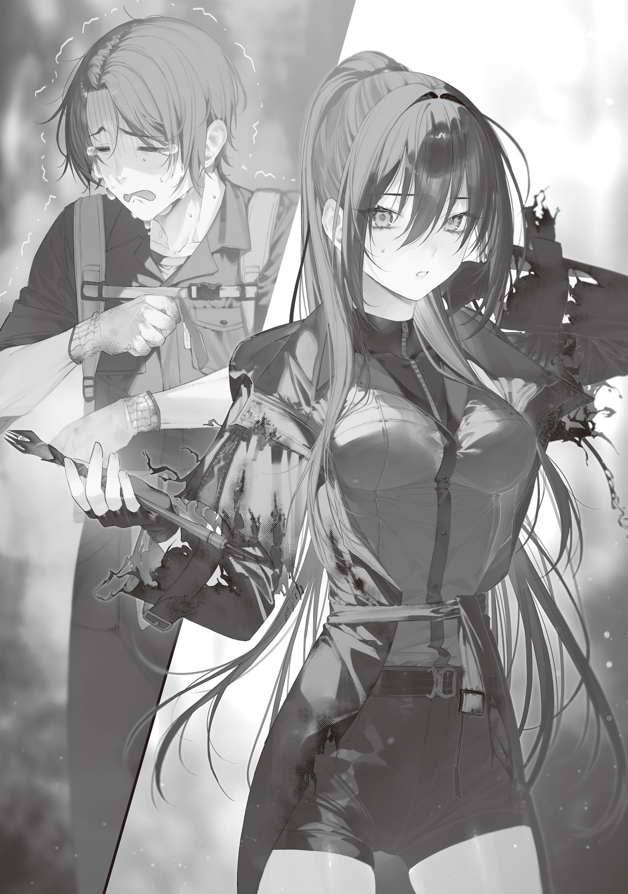

Since I couldn't use a car, I plodded along beside the railroad tracks for three hours, coming all the way from Okutama to neighboring Ome.

There were lots of houses along the way too, but there was no sign of people. It was quiet.

I thought about looting those houses. But something seemed off, so I gave up on it.

The houses were half-destroyed or totally destroyed, like a kaiju had gone wild.

It wasn't like they'd collapsed in an earthquake. It didn't look like there'd been a fire, either.

Parts of the houses had been gouged out and blown away, like they'd been swept aside by a giant arm or pierced by a beam. Some houses had blue tarps over them, but rain and wind had gotten in through the collapsed sections of most of them, and they were starting to rot. It was a horrible mess.

They looked seriously dangerous. Even if public safety had collapsed and rioters had run wild, things wouldn't end up like that.

Maybe a real kaiju showed up. Magic is real. Kaiju are possible too.

There are deer and raccoon dogs that use magic, so if there are bears or lions that use magic, they can probably blow houses away without much trouble.

Too scary.

A wise man stayed away from danger.

I picked Ome as my supply-looting spot because it was the city next to Okutama, and the buildings were relatively intact.

There were burned houses, houses with roofs blown off, houses with broken windows, and so on, but I couldn't see any signs that a kaiju had gone on a rampage. The houses were all in pretty good shape.

Whatever terrifying thing had destroyed those houses apparently hadn't come this far.

The lack of people was a plus too. It was the perfect place to loot.

Holding the magic wand Hendensho in one hand and staying alert, I snuck into a house with a broken window and looted food. The house was empty, but I avoided the room that had a powerful rotten smell and dried-up bloodstains in front of its door.

Sure enough, something bad seemed to have happened in town. Thank god I'd holed up deep in the mountains.

There wasn't much food inside, but I still got a fair amount of unopened canned food, seasonings, and dried noodles. Finding volumes of a manga I'd kind of wanted to keep reading lined up on the bookshelf was a big score too. I shoved everything together into my hiking backpack and got to work looting the next house.

The front door of the house next door was open, and a note for the family saying, "We're evacuating to the General Medical Center," was stuck there. The date written alongside it was from last year.

An added note saying, "Be more careful of monsters than people," bothered me. Do monsters mean those magic-using animals? I have magic too, and I can manage monsters like rabbits or mice, but... are lions or rhinos that escaped from the zoo wandering around after all?

The evacuees from Okutama should have come to Ome, but there was no sign of people at all, and I didn't know what was going on. Once I'd looted what I could, I'd hurry home.

There was no food at all in the second house, but I found strawberry and edamame seeds in the storage room that I could grow in planters. I didn't have either in my home garden. This is huge.

There wasn't anything else in particular. The only thing was an aquarium where all the water had evaporated, leaving dried-up goldfish lying on the gravel. It made me feel weirdly sad. The end of the world sure is depressing.

I crept along, thrilled that my hiking backpack was starting to get heavy, and eagerly headed for the third house. Then someone suddenly called down to me. My heart stopped.

"Wait! You there, who gave you permission to be in this area?"

When I nervously looked up, there was a girl standing on the roof of a house diagonally across from me.

She was probably around high-school age. Her long black hair was tied back and swayed in the wind, and her black clothes were so tattered that I couldn't tell what their original design had been. They fluttered creepily.

She had cool, refined features, like she belonged on the cover of a fashion magazine. I even felt like I'd seen her face in one before. Though all real-life beautiful girls looked about the same to me, so that was questionable.

It would've been easier if people had different hair colors like in anime, but this girl was the same as everyone else. Black or brown hair, all of them. Seriously unhelpful.

This unhelpful beautiful girl wore a stern expression. Rather than a beautiful model, she looked like a soldier on a battlefield, cold and constantly on guard.

"Can't you answer?"

When I stayed silent, the girl held up a palm-sized blue gem to the sun.

The air immediately became cold and heavy, and icy air began to swirl like a warning that something terrifying was about to happen.

Gah!? She's got a magic stone!

I surrender! I surrender! I don't want a magic shootout! I'll die!

When I frantically threw down my wand and raised both hands in surrender, the girl jumped from the roof of the house without taking her eyes off me.

Her light, effortless landing hinted at inhuman physical abilities.

W-Who even are you? Humans were already scary enough, but her pushy attitude and the physical ability I'd just seen made her three times scarier.

I looked away from the girl and down at the ground. She was too scary to look at directly.

"Who gave you permission to be in this area? Where are you from?"

Standing in front of me, the girl asked again.

Her voice was so full of hostility that I could practically hear a second audio track saying, "Answer, or I'll kill you."

I shrank back and answered honestly.

"U-Um, I'm unaffiliated."

"You live alone?"

"Y-Yes."

"Where do you live?"

"Okutama."

"If you're from Okutama, there was a warning sign on the way here that said, 'Unauthorized Intruders Will Be Killed Beyond This Point.'"

"Huh? No, um, I was walking along the railroad tracks looking down the whole time, so... I didn't see the sign... I guess... Ha, hahaha..."

"..."

I gave an awkward little laugh in a strained voice and was met with silence. I nervously raised my face and glanced at the girl. She seemed dumbfounded.

"Well, from the look of you, that's probably true. What a useless guy."

As she said that, the girl noticed Hendensho-kun, which I'd thrown down at my feet. She picked it up and started examining it.

"What's this?"

"A wand. A magic one."

"A Gremlin? But this is... processed...?"

The girl ran a finger along the wand, held its electric crystal up to the sun, and examined it with interest.

"U-Um..."

"Wait."

I was about to say, How about I give you that wand and you let me go? But the girl cut me off, so I shut up.

Okay, I'll wait. I'm smarter than a dog, so I knew how to "wait." Woof.

I stayed quiet like she said so I wouldn't get on her bad side. Then the girl held up Hendensho and chanted an incantation.

"Freezing Javelin[^1]!"

When she said strange words with a weird, unfamiliar intonation, an ice spear as big around as an armful shot out of Hendensho-kun and buried itself in the wall of a house, shaking the whole building.

"Huh?"

M-Magic!? That's awesome! It looks like higher-level magic than the white beams I always use!

How'd you do that!? What you just said was an incantation, right!?

I was so surprised that I forgot my fear for a moment. I got curious all at once, but the girl was even more surprised.

"Huh? ...Hey, what's going on!? That power makes no sense! There's no way a Gremlin this size could produce that much power. Where did you get this wand!?"

"Eek! U-Um, I made it."

"Huh?"

"I made it."

The girl closed in on me, and I felt like I was going to cry.

I was taller than her, and she actually had a slender build, but being cornered by her felt like being cornered by a huge, muscular man. Once she got close, I caught the smell of gunsmoke on her, and my spine went cold.

She's definitely a dangerous personnnnnn! Let me go! Let me go home already! This is why I hate meeting people!

When I couldn't take the fear anymore and started crying, the girl jolted.

She softened her expression and awkwardly shoved Hendensho back at me.

"Sorry. It doesn't look like you came in with some kind of scheme. But tell me the details. You entered my area without permission. You're going to come with me whether you like it or not."

Her voice was quiet, but her tone didn't allow any argument.

I couldn't resist, so I nodded while sniffling.

Looking utterly fed up, the girl took my hand and started hauling me off somewhere.

Damn it. What's with that fed-up face!? It's not like I like crying!

It's because I'm scared! Can't help it!

The place the girl led me to by the hand seemed to be her base. The fence around the house was reinforced with barbed wire, and there was a dry moat and sandbags. It was like a little fortress.

The house was spotless, and bundles of dried herbs hanging from the living-room ceiling gave off a nice smell that made me relax. But the oil and gunpowder smell from ammunition cases on the worktable in the corner ruined all of it.

The girl sat me down in a chair, made tea in the kitchen, and brought it over.

The girl plopped down across the table from me, took a sip of tea, gestured for me to have some too, and introduced herself.

"You might know this already, but I'm the Witch of Ome, more recently shortened to Blue Witch. I govern this whole area. What about you?"

"I'm Ori Kenshi."

"Hmm? That's an unusual surname. How do you write it?"

When I explained, the Blue Witch nodded.

"I see. You said you live in Okutama, Ori. What's it like around there?"

"What do you mean?"

"Monsters? Who governs it?"

"By monsters, do you mean animals with gems on their bodies?"

When I asked, the Blue Witch tilted her head.

"Yeah, well, there are those too. Things like dragons, things like ghosts."

"Huh? No, I've never seen anything like that."

"Huh. So whoever governs it wipes them out right away? Who kills the monsters?"

"Nobody. There are a few animals with gems that use magic in Okutama, but there aren't any things like dragons. I don't think anyone is killing monsters either..."

People had been gone from Okutama for a long time.

Most of them had already left Okutama by the time I crept out of my hole, and since the looter girl who'd stuck around fairly late disappeared, I really hadn't seen a single person. There was no way someone was hunting monsters where I couldn't see them.

"Huh. Okutama is that peaceful? Hmm, are monsters stronger the more densely populated an area is...?"

"Um, I don't really get what you're talking about. This is all stuff I've never heard before."

I timidly raised my hand and spoke up quietly. The Blue Witch leaned back in her chair, crossed her arms, and looked at me with interest.

"I see. If you've lived alone in a peaceful place, it makes sense you wouldn't know anything."

"I'm not so ignorant that I don't know anything, but it'd be nice if you could teach me enough to follow the conversation, sort of... Ah, no! If that's no good, then never mind, never mind!"

"Don't be so scared. Just because I'm a witch doesn't mean I boil people in a pot and eat them. Though there are witches who do. Anyway."

Don't casually drop scary information like that.

You're pretending to reassure me just to scare me, aren't you?

I tried to show I wasn't scared by elegantly bringing the tea to my mouth, but my hands shook so much that I spilled about half of it down my chest.

"If possible, it'd help if you could teach me all kinds of things in general, like you would a child who doesn't know anything."

"You and that tea... Well, fine. Let's see, where should I start? Do you know about Gremlins?"

"The crystals that grow by eating electricity?"

"That's right. They're named after the prankster fairies in British folklore that make machines and computers malfunction."

It looked like the Blue Witch was going to give me the lecture I wanted. I listened closely.

Yeah. I'd wanted information like this the whole time. It would've been better if she'd written it all down for me instead of giving me an in-person lecture, though.

"Last year, on April 4, the Shantak Meteor Shower made magic stones rain down on Earth. A magic stone is what I'm holding here. Magic stones scatter things like invisible spores, and the spores that landed on electrical devices immediately grew into Gremlins. They shut down electrical devices all over the world. Think of magic stones as the original seeds, and Gremlins as their degraded children."

"I see."

So they're like invasive alien species.

Like bluegill released into a lake that quickly ate up the native fish and multiplied everywhere.

I'd thought Okutameteorite was the stuff of dreams, but it turned out to be seriously bad news.

"Gremlins grow by absorbing electricity, but that doesn't only apply to machines. You know electric eels, right? Most electric eels kept in aquariums were killed by Gremlins that grew inside them and ate their way through their bodies, but some adapted successfully. They gained the power of magic and became monsters. Other animals, whether because of their constitution or whatever, started using magic by circulating Gremlins through their bodies, or mutated into monsters far removed from their original forms. Taken together, they're all monsters."

"Teacher. I saw some wrecked houses on the way here to Ome."

When I raised my hand and said that, the Blue Witch nodded.

"Monsters probably did that. It's not like they're evil creatures, but a lot of them are huge. They break things just by moving, and if they're hungry, they eat people too. On top of that, they use magic. For a while after the Gremlin Disaster paralyzed the administration, the police and Self-Defense Forces did their best, but once monsters started increasing, it was over. The shelters in Ome were wiped out too."

"Ah..."

That's a chilling story.

Really, it was good that I'd holed up at home. If I'd evacuated, I would've been done for. It worked out in the end.

But hearing all this, it feels like humanity is definitely headed for extinction.

With electricity shut down, firearms factories can't operate, so they'll run out of ammunition soon, right? Aren't we done for?

But one thing still bothered me.

"With how dangerous monsters are, you were standing right out in the open on a roof, Blue Witch-san. Don't you need to hide?"

"I'm a witch, after all."

"...Um. You mean you can use magic and you're strong?"

Since I still didn't get it, I asked to make sure, and the Blue Witch shook her empty teacup as she explained some more.

"I had a static-prone constitution. I was born able to store electricity easily. So when Gremlins started spreading, it was awful. It felt like needles were running through every blood vessel in my body. I spent three days and three nights wandering the line between life and death. Apparently a lot of people with the same static-prone constitution couldn't endure it and died.

"Even so, I survived. Women who survived even after Gremlins invaded their bodies were called witches. Female monsters. That's why we're witches."

Men were mages. The collective term for both men and women was Transcendents, the Blue Witch added as she poured herself another cup of tea.

Man, she'd had it rough. Thank god I didn't have a static-prone constitution.

"It's like that in Tokyo, and I think it probably is in other places too, but witches or mages usually lead and govern urban areas with supplies. Only Transcendents can stand against monsters. There aren't many monsters you can kill with a metal bat or a crossbow.

"I governed Ome for a while too and protected the people around here from monsters. My father, mother, younger sister, and childhood friend helped me. It wasn't a bad life. Being praised for killing monsters that attacked innocent people suited me better than being praised by classmates for appearing in modeling magazines."

The Blue Witch narrowed her eyes at the memory and sighed.

A sudden disaster threw the world into chaos, but a beautiful high-school girl awakened superpowers and saved everyone!

Awesome. I feel like I've seen that kind of plot in anime before. How hype is that?

"But there aren't any signs of people in Ome now."

When I asked because it seemed strange, the Blue Witch's face turned ice-cold in an instant.

What? Did I step on a landmine? Scary, scary!

"They're all dead. I killed some of them. I live in Ome alone now. I hunt every monster that shows up in this area. I kill trespassers. I've told the witches in the surrounding areas that if they find a surviving resident of Ome who wants a safe place to live, they should send them here."

"I-I see?"

That "who gave you permission to be here, blah blah" thing she'd said when we met probably meant something like, "Which witch referred you?"

Ignorance was scary. The Blue Witch was intimidating and dangerous, but at least she could be reasoned with. If I'd wandered into the territory of one of those man-eating witches she briefly mentioned without knowing it, I'd be lunch by now.

I was glad I'd gotten to learn these basics.

To sum up the basics the Blue Witch taught me:

Electricity stopped working all over the world, and civilization collapsed.

Monsters ran rampant, public safety collapsed, and corpses piled up everywhere.

Now witches and mages who awakened special powers kept the peace in their own territories.

That's how it is. I mostly get it.

As I nodded in understanding, the Blue Witch tapped a finger against the magic wand Hendensho-kun lying on the table, leaned forward, and spoke.

"You understand the general situation now, right? Now it's my turn to ask. Tell me about this out-of-place artifact."

"An out-of-place artifact? I mean, what am I supposed to tell you...?"

Confused, I looked at the magic wand Hendensho.

I hadn't used any bizarre technology that would make it an out-of-place artifact. There wasn't any crazy secret manufacturing method. I'd just carved it into shape and made it double-layered.

"You know magic stones like this work better the closer they are to a sphere, right?"

"Yeah."

"Um, this wand is called Hendensho, and it uses electric crystals I gathered at Okutama Substation—ah, Gremlins, I mean. It uses Gremlins. First, I carve the Gremlins into spheres, then crush the thin flakes I carve off and use them as abrasive..."

"Wait."

I'd barely started explaining like she told me to, but the Blue Witch immediately stopped me.

"Do machine tools still work in Okutama?"

"You mean electric machine tools? If so, no, they don't."

"Then how did you process it?"

"How? With carving knives and chisels."

When I mimed using a carving knife, the Blue Witch shook her head.

"That can't be right. I heard the surviving technicians were gathering at the Eyeball Witch's place to research them, but Gremlins are too hard, and I don't really understand it, but apparently their properties make them difficult to carve. I've heard even precision machinery would have trouble. In fact, nobody has succeeded in processing Gremlins. There must be some secret method you discovered and are hiding, Ori. Tell me."

Huh?

I mean, what am I supposed to say to that?

There isn't any secret method.

"I'm dexterous."

When I answered honestly, the Blue Witch irritably tapped the table with her fingertips.

"Can something as simple as being dexterous explain this, idiot! If being dexterous was enough to process Gremlins, I would've polished this magic stone into a sphere ages ago. Look at the Gremlin in this wand. What is this? Huh? You weren't satisfied with just making it spherical—there's a sphere inside the sphere! It makes no sense. There can't be anyone who can pull off a feat like this. Tell me honestly. What did you use? Laser machining? Huh?"

She closed in on me, but there really was no secret method. I'd just carved it normally.

But even if I honestly said, "I'm dexterous," she'd decide I was lying.

The Blue Witch had apparently been through some serious hell. If I kept arguing with her like this, she might think I was a liar and kill me.

I decided to demonstrate it right there.

"Um, then could you lend me that magic stone of yours, Blue Witch-san? I'll carve it into a sphere right here and show you. I brought a knife, at least."

"Don't be ridiculous. How much blood do you think has been spilled for this one magic stone? By the time I killed the Iruma Mage and took it, at least 800 people had died over it. You think I could just lend it out?"

"Ah, then never mind..."

That thing had one hell of a history. Scary.

"Then do you have a Gremlin? I'll process that right here and show you. I can do a small one too, but a bigger one would be easier to see."

"You're insisting you can process it with just one knife. Fine. If you're that insistent, show me."

The Blue Witch obviously didn't believe me. She said she'd go get a Gremlin and rose from her seat, but halfway there she turned back and gave me a cold glance.

"Don't run. I'll be right back. And don't touch anything."

I nodded furiously over and over.

I wished she'd stop threatening me every single time. It was scary.

Sure, to you I might be a suspicious person who wandered into your territory. But to me, you're like the yakuza. We could have a conversation, but I had no idea if that meant I'd make it out alive.

I sat stiffly in the chair like she told me to for a while, but the Blue Witch just kept moving things around upstairs with clatters and didn't come back. At one point, I heard the unmistakable crash of a pile of plastic bottles and empty cans collapsing and burying her, followed by a curse. I relaxed, figuring it would still take a while.

Once I calmed down and looked around the room, I noticed all kinds of little things. A few potted plants I didn't know the names of. A cactus. Last year's calendar. A goldfish bowl with Japanese rice fish in it, colorful pebbles spread across the bottom, and water plants floating on top. Rabbit and bear dolls hugged heart-shaped cushions beside a toy house. Overall, it felt kind of girly.

As long as I made sure not to look at the bloody gunsmithing kit on the worktable, it just looked like a living room where an ordinary woman lived.

I felt restless and vaguely wanted to run away.

This was kind of uncomfortable.

Come to think of it, the last time I'd set foot in someone else's home was when I was in elementary school and brought handouts to a classmate who had caught a cold. It was the first time in my life I'd been inside a woman's home.

Anime protagonists got all excited when they went to the heroine's house, but that took some serious nerve. I was already so uncomfortable that I wanted to get out of here.

While I planned an escape route for emergencies and scanned for the back door, I spotted a music box on a shelf by the window. It was one of those rotating music boxes where the doll on top spun when it played a tune.

Wait, huh!?

Is that the second-season, limited-edition, made-to-order music box—the Ai-chan Model—from Magical Girl Logical☆Einstein!?

S-Seriously!? I've never seen one before! It's one of those ultra-rare music boxes—only 50 exist in the whole world!

It isn't a knockoff, is it?

I rushed over and looked at it up close. Since it was a made-to-order item that sold out immediately, its amazing quality showed in every little detail.

Oh, ohhhh. The lace on the skirt is this fine! This is hand-sewn, isn't it? Real craftsmanship! Could the Humanity Diamond on her chest actually be a real diamond? You don't use something like that on little girls' merchandise! This is totally merch for grown-up fans!

I tried to wind the music box so I could hear it, but the key wouldn't turn. When I put some strength into it, I felt it catch in a way that told me something inside was broken.

Seriously? It's broken?

It made me want to click my tongue.

What is the Blue Witch even doing? This is a rare, expensive masterpiece that set a new record for the highest-priced piece of official made-to-order anime merch. If it's broken, she should get it repaired. Does she know what this is worth? Idiot!

Good grief. Guess it was time for me to lend a hand.

I borrowed some tools from the gun-maintenance toolbox on the worktable and quickly took the music box apart without scratching it. Inside, it looked like it had been dropped or hit hard, knocking the gears out of place.

Good. This much would be easy to fix.

It looked like it had taken a hit strong enough to warp the music-box frame, but the structure was designed with enough play that the parts had just come loose instead of breaking. Hmm. This kind of approach was useful. I'd copy it too.

Impressed, I fixed it, put it back together, and wound the key.

Then a passage from the anime's theme song began playing in a beautiful tone.

Ooh, nice. It made me want to watch the anime again.

But now that electricity was gone, even the Blu-rays I'd bought were just Frisbees. Damn Gremlins.

After enjoying the music box for a while with my chin propped on my hand, I heard a sound behind me.

I instantly remembered the situation I was in and went pale.

The Blue Witch had said, "Don't touch anything."

And I'd gone and touched it anyway.

This is bad.

She's going to kill me!

Covered in cold sweat, I turned around slowly so I wouldn't provoke a wild beast.

I opened my eyes just a sliver and checked her expression. Contrary to what I expected, the Blue Witch wasn't angry.

Instead, a single tear ran down her cheek while her eyes stayed closed.

Huh? What? What kind of emotion is that?

The Blue Witch was listening intently to the music box. Whatever she felt about the opening song of this little girls' anime was way too heavy.

D-Do you like this song that much? I like it too, but she has me beat.

Eventually, the music box wound down, and the song stopped. The Blue Witch turned away and wiped her tears, then thanked me, her expression and voice gentle in a way they hadn't been before.

"Thank you, Ori. I thought I'd never hear it again."

"Ah, okay. You liked this song that much?"

"It's my little sister's music box. We used to listen to it together."

"I see? You have refined taste. I'd like to talk to your little sister sometime."

And if possible, I wanted her to give me the music box. I'd give her about half my other merch.

When I hid my ulterior motive and buttered her up, the Blue Witch answered briefly, looking deeply sad.

"My little sister died. From an illness."

"Ah."

A-Awkward.

It was a keepsake... Sorry for messing with it without permission...

"You... Ori, you're a good guy. Sorry I treated you badly."

As I fidgeted, the Blue Witch dropped the cold attitude she'd had until then, bowed gently, and apologized.

Talk about a complete turnaround. Fixing the music box must have meant a lot to her.

That's right. Actually, I was a good guy.

Glad we'd cleared up that misunderstanding.

"I'd really like to repay you for fixing the music box."

"Huh? No, it's fine..."

"Right. Are you having trouble with supplies? Living alone deep in the mountains must be hard. Ori, you can move to Ome. You'll be welcome."

"No way."

The Blue Witch said she wanted to thank me, then proposed an outrageous penalty, so I firmly shook my head.

I'm enjoying the glorious solo life. Why would I move somewhere where there are other people?

Living alone deep in the mountains is hard, but living alone deep in the mountains itself is an advantage that wipes out every other disadvantage and then some. I'm absolutely not moving.

I went into full refusal mode, but the Blue Witch kept going, full of unnecessary concern.

"Maybe it wasn't a big deal to you, Ori, but it was very important to me. It won't sit right with me unless I repay you. Is there anything I can do for you? Anything."

"...Anything?"

When I repeated it, the Blue Witch was about to nod, then suddenly realized something and hurriedly added:

"N-No lewd stuff!"

"Could you not talk to me? Please don't come near me. I don't even want to look at your face."

"!?"

Since she'd said anything was fine, I honestly told her my greatest desire. The Blue Witch went blank with shock and dropped the little chunk of Gremlin in her hand onto the floor.

I tilted my head at her weird overreaction, then realized after a beat that I'd given her completely the wrong idea.

"No! It's not that Blue Witch-san is creepy or that I hate you or anything! Just hearing a voice or seeing a face makes me feel like throwing up, that's all. Ah, no, that makes it sound wrong too!? No, no, no!"

Despairing at how bad my communication skills were, I spent nearly an hour trying before I finally cleared up the misunderstanding.

I thought I probably cleared it up.

The Blue Witch apparently had never met a social misfit like me before, and it took a lot of work to make her understand that I didn't hate her—I was just bad with people in general.

I don't dislike her or anything. But I'd be happy if she kept the right distance, sort of.

"..."

Once the Blue Witch understood my annoying nature, she pulled a clothes storage bin out of the closet. She took a bunch of weird outfits out of a compression bag marked "Club Activities," chose a white mask that covered her eyes, and put it on. It was definitely drama club stuff.

Then she went to the corner of the room and, without saying anything, gestured to ask if this was okay.

"I feel a lot better."

When I said that, the Blue Witch seemed relieved.

Sorry for making her do something so annoying. But thanks to her, I can finally breathe deeply again.

Once her skin was covered and her human outline blurred, it didn't matter how beautiful she was underneath.

It's reassuring, like there isn't a human in front of me. I'm not scared anymore.

I'd gotten seriously sidetracked, but it was time to get back to the point.

The Blue Witch doubted my Gremlin-processing skill, so first I had to demonstrate it.

I picked up the little chunk of Gremlin she'd dropped and had her check its unprocessed state first.

"Watch closely."

When I blasted it with my stupidly loud voice at its natural frequency, a weak little beam trickled out of the Gremlin on my fingertip like it had wet itself.

The Blue Witch covered her ears against the noise.

"You saw that, right? That's this Gremlin's current magic power. Now I'll process it into a sphere and show you how much its power goes up."

"...?"

"My mouth? What's wrong with my mouth? Oh, that screaming-beaver kind of voice just now? The only incantation—or whatever it is—I know is this one. Sorry it's loud."

"..."

The Blue Witch looked like she had something to say, but she didn't go out of her way to ask.

No questions? Great. I got right to processing it.

With nothing to hold it in place, shaving down a Gremlin the size of a grain of rice as it rolled around on the table with the tip of my knife seriously wore on my nerves. I should've at least brought tweezers.

But being dexterous is my only good point.

Even with inadequate tools. After a few minutes, I ended up with something I was really proud of.

"Done. I haven't polished it, but I think its power went up a fair bit. Here I go."

When I blasted it with my voice at its natural frequency again, a thin beam shot out quickly from the Gremlin on my fingertip, like a spider spitting thread.

I couldn't see the Blue Witch's expression behind her mask, but her surprise came through clearly enough.

"Like that. Do you believe me now?"

The Blue Witch stayed silent for a while, then wrote something on a sheet of drawing paper with a pen and held it up gravely.

Her letters were cute and round, the kind of girly handwriting that didn't match her cool appearance. The gap was making my brain glitch.

> Ori, you should keep yourself hidden. If people learn about this feat, witches and mages all over Japan will come after you.

"That much...?"

I'd just shown off some processing I normally did to kill time and keep my hands busy, but she was taking it dead seriously. That scared me.

Isn't she being a little dramatic? Sure, I call myself the world's greatest Wand Maker, but presidents and billionaires aside, would anybody really come after a craftsperson?

When I looked doubtful, the Blue Witch flipped to a new page and wrote some more.

> Ori, you're like the only person in a world with just bows and arrows who can make a machine gun. Understand what that means.

"Oh crap."

It only really started sinking in once she gave me a concrete example.

This is something that could change the world. Way too dangerous. If people find out who I am and what I can do, getting kidnapped and locked up will be a sure thing!

...But having the power to change the world is exciting, isn't it?

Honestly, I wanted to make tons of overtechnology magic wands that only I could make, sell tons of them, and show off.

The electricity can stay off for all I care, so couldn't just online auctions come back? I want to grin as I watch the bids for my magic wands climb higher and higher!

But it's an impossible wish. Online auctions are gone and will never come back.

I can't make it in a regressed business world where I have to use my own legs and mouth to sell products.

Just hearing the words "sales pitch" gives me goosebumps.

Am I really stuck living quietly and keeping my head down, like the Blue Witch said?

That's too sad. Isn't there any way to stay hidden, never meet anyone, and still make my work—the finest of the age—known to the world?

> Thanks for your help today. I'll take you to Okutama. If you run into any trouble, I'll help.

The Blue Witch showed me the drawing paper again. The line ~~Want to stay for lunch?~~ had been crossed out twice. She'd really taken a liking to me. Even though she'd tried to kill me when we first met.

Looking outside, the sun had already passed its highest point. If I took three hours to get home now, it'd be dusk. It really was a good time to go home.

It had been a supply-recovery trip full of unexpected problems, but the haul had been big.

More than anything, though, I was mentally exhausted. She seemed to be giving a lot of thought to this delicate little animal that was extremely bad with interpersonal stress, so it was time to take my leave.

"Can I come to Ome sometimes to recover supplies?"

When I asked permission, the Blue Witch nodded without a word.

All right. As long as I've got that promise, everything is okay.

I'll make sure not to run into her from now on, and she'll probably do the same. We probably won't ever meet again.

It helps that she taught me all kinds of things today.

It feels like there isn't much point in exchanging information when my conclusion after learning it is that living more or less as I did before is best. Still, I'm at least free from the anxiety of having no idea what is going on around me.

I can see a way to solve my food problem, and now that I know I can't hope for electricity to be restored, improving my living conditions any further will probably be really hard.

I know what things are like now, and I can kind of see where I'm headed too.

Surely, every day from here on out will be the same, forever and ever.

To keep dangerous people from noticing me, I'll leave all the great magic wands I've made sitting in storage, keep my head down every day, grow old, and eventually quietly die.

Dying alone is more than welcome.

But I can't help regretting that I'll never be able to show my work to the world.

Ah, man! So life doesn't let everything work out, huh?

Well, I guess I can be satisfied that my dream of dying alone is looking more realistic.

...

No.

Wait a second?

I had my hiking backpack on, Hendensho in hand, and was ready to head home when something suddenly occurred to me.

I froze like I'd been turned to stone and focused on the idea that had hit me. The Blue Witch looked puzzled.

Right.

The Blue Witch.

She was dutifully going along with my full-blown social-misfit refusal to communicate.

Maybe she thinks fixing the music box was a huge favor, but it looks like she might agree to a few unreasonable requests.

It's free to ask, isn't it?

I stood there frozen for several whole minutes, worrying whether a rude request would upset her, whether it was too pushy to ask on the day we met, and what I'd do if she turned me down and got angry.

But in the end, I decided to at least say it.

The Blue Witch had quietly and patiently waited without saying anything while I suddenly froze up and stopped moving.

Even if she did owe me one, there weren't many people this kind to someone with such bad social skills.

Actually, I'd never met one. Even my own parents got furious and broke off contact when I said, "I want to live without meeting anyone, so I'll make a living from online auctions."

Anyway, I figured if there was anyone I could make this proposal to, it was her.

"I have a request."

When I said that, the Blue Witch tilted her head a little and prompted me to continue.

I asked, not expecting much.

"Could you handle sales for my magic wands?"

Truth was, even during my online-auction days, I hadn't been completely free of dealing with people.

When I bought things, delivery companies came to the front of my house and left them there. When I sold things, companies similarly collected the packages I'd left in front of my house.

I never met anyone face-to-face, but my online-auction business worked with help from all kinds of companies.

I'll have the Blue Witch do the job those companies did.

I'll stay shut in and make magic wands.

The Blue Witch will collect the finished works, keep their source hidden, advertise them, negotiate with customers, sell them, and bring the proceeds—supplies—to me.

That way, I can stay shut in at home and obsess over my hobby!!!

The flaw in this genius idea was that the Blue Witch had no reason to take on such an insanely tedious errand. But on the condition that I make her own magic wand for free, she gladly agreed.

That's a perfect deal for me too.

When famous people use your products, it's seriously great advertising!

The Blue Witch is presumably famous: she governs the city of Ome alone and apparently has connections with other witches. If I make her a wand, every time she does something impressive, the wand's reputation will rise too. Just carrying it around will have an advertising effect.

I don't want my face or name to get around, but I want the greatness of my wands to spread farther and farther.

For that, I'm going to make a top-of-the-line magic wand worthy of the Blue Witch.

---

After the Blue Witch entrusted the magic stone to me, I got to work processing it as soon as I got home.

With Hendensho, which I'd made by carving a marble-sized Gremlin, the most I'd managed was a double-layered structure.

The double-layered structure itself had been an experimental attempt, and it was so small that it seemed likely to break if I tried to make it triple-layered.

But the blue magic stone I'd received this time was palm-sized. It was smaller than my Okutameteorite, but still plenty big.

The rough stone was pretty misshapen too, but it was mostly a sphere, so there wouldn't be much loss while carving it down.

With this, I can go six layers... no, all the way to seven!

By candlelight, I kept working day and night.

When I noticed my hands shaking and my vision getting blurry, I realized I hadn't eaten for 24 hours. I reluctantly went outside, thinking I might catch some fish, only to find a paper bag full of food and firewood in front of the door.

Huh!? Fairy-san!? No, it was definitely the Blue Witch's doing, though.

The food bag held canned corned beef, fresh lettuce in a Tupperware container, and salted rice balls. Considering the times, that was the best nutritional balance possible. Rice had to be precious too. I appreciated it.

If the Blue Witch supported me like this, I could focus on my work too.

Getting all the time I spent gathering food every day back was huge.

For three days and three nights, I spent almost all my time besides eating and sleeping processing the magic stone.

Sometimes I felt Fairy-san's gaze from outside the window, but once I got into an extreme state of concentration, it quickly stopped bothering me.

Around the time I started the fifth layer, it became hard to work with the tools I had. Half giving up and thinking it might be impossible, I asked the Blue Witch by letter to get me some tools. A day later, the tools I'd ordered were sitting in front of my door.

Seriously helpful. She could deliver anything. It was like a delivery service had come back just for me.

In the end, all the processing and assembly, including the wand handle, the joint, and the protective materials, were done seven days later. I massaged my rock-hard shoulders, wrapped the completed wand in a simple layer of paper, and left it at the front door. The job was finally done.

Man, that was a big job. At first, I'd estimated it would take two weeks and told her by putting an estimate sheet in the empty Tupperware container when I left it outside to return it. But getting better at the work and developing a new method had cut the work time way down.

Yep, yep. I made a good piece, and I learned a lot too.

The Blue Witch's custom wand, made by processing the blue magic stone, was a masterpiece that brought together all the techniques I'd developed so far.

It looked like an ordinary wooden wand, but it was made from tough wood, so it was stronger than it looked. Used normally, it wouldn't break easily.

I put a lot into the design too. I inlaid silver to highlight shallow, Celtic-inspired patterns carved into the wood, and engraved the Greek word "Cyanos," the coolest foreign word for "blue" I found, as its name.

Every bit of the design and decoration was arranged to bring out the beautiful blue gem at the end of the handle. I even mixed blue dye into the bonding material so the whole thing would match.

No Wand Maker besides me can make a better magic wand. How do you like that?

The Blue Wand Cyanos, which I'd left at the front door with a delivery specification sheet, was gone by the next morning.

I really hoped the Blue Witch would use Cyanos and do great things with it.

Though I'd be happy if she put it on display just to admire it too.

## Translator Notes

[^1]: The source writes “Freezing Javelin” but gives the spoken incantation as `ドウ・ヴアアラー`.
