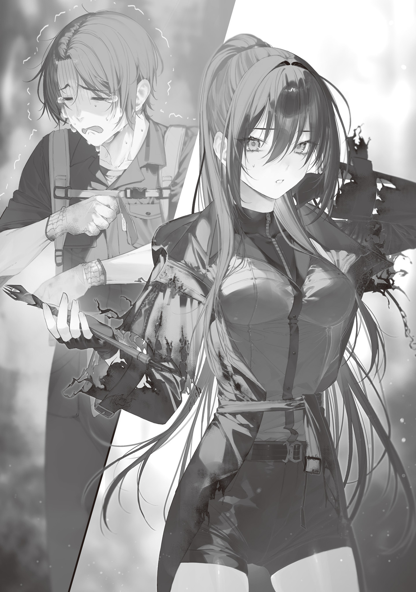
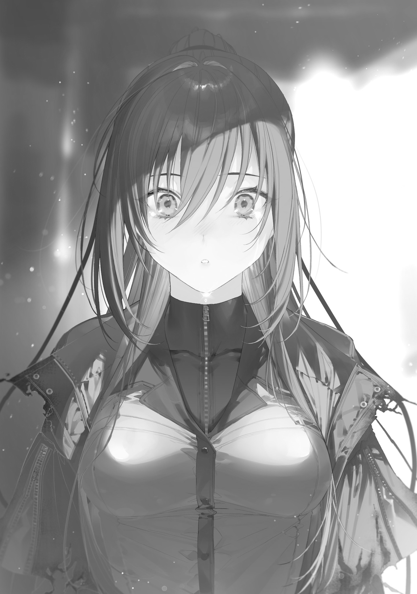

With no car, I plodded along the railroad tracks for three hours, all the way from Okutama to neighboring Ome.

There were plenty of houses along the way, but no sign of people. Everything was quiet.

I thought about looting them, but something seemed off, so I gave up on the idea.

The houses were half wrecked or flattened outright, like a kaiju had run wild through them.

It wasn't earthquake damage, and it didn't look like fire, either.

Chunks of them had been gouged out and blown away, as if a giant arm had swept through them or a beam had punched straight through. A few had blue tarps over them, but on most, wind and rain had gotten in through the broken sections and started rotting them. It was an awful sight.

One look told me they were bad news. Even if law and order had collapsed and rioters had gone nuts, they couldn't have done that.

Maybe a real kaiju showed up. Magic turned out to be real, so why not kaiju?

I mean, there were deer and raccoon dogs using magic. A bear or lion that uses magic could probably blow a house away, no problem.

Too scary.

A wise man keeps away from danger.

I'd picked Ome as my looting spot because it was the next city over from Okutama and its buildings were relatively intact.

Some houses had burned, some had lost their roofs, some had broken windows, but I didn't see any sign of a kaiju rampage. On the whole, they were in pretty good shape.

Whatever terrifying thing had wrecked those other houses apparently hadn't come this far.

The lack of people was another plus. It was the perfect place to loot.

With my magic wand Hendensho in one hand, I snuck warily into a house with a broken window and looted it for food. Nobody was home, but one room reeked of something rotting and had dried blood in front of its door, so I stayed out of that one.

Sure enough, it looked like something bad had happened in town. Thank god I'd holed up deep in the mountains.

There wasn't much food, but I still came away with a decent haul of unopened canned goods, seasonings, and dried noodles. The bookshelf also had volumes of a manga I'd been low-key wanting to keep reading, which was a big score. I shoved it all into my hiking backpack and moved on to the house next door.

Its front door was open, with a note to the family stuck to it: "We're evacuating to the General Medical Center." The date on it was from last year.

A line added underneath bothered me, though: "Be more careful of monsters than people." Do monsters mean those magic-using animals? I've got magic too, so I can handle rabbit or mouse monsters, but... maybe there really are lions or rhinos from the zoo wandering around.

The evacuees from Okutama should have come to Ome, but there was no sign of anyone, and I couldn't get a read on the situation. I'd grab what I could and head straight home.

The second house had no food at all, but in the storage room I found strawberry and edamame seeds for growing in planters. My home garden didn't have either of those. That was huge.

Other than that, the house didn't have much. Just a fish tank whose water had evaporated completely, with dried-up goldfish lying on the gravel. That one got to me a little. The end of the world sure is depressing.

I was creeping toward the third house, happily feeling my backpack get heavier, when a voice suddenly called down from above. My heart stopped.

"Wait! You there, who gave you permission to be in this area?"

I looked up nervously. A girl was standing on the roof of the house diagonally across from me.

She looked about high-school age. Her long black hair was tied back and swaying in the wind, and her black clothes, so tattered I couldn't tell what they'd originally looked like, flapped creepily around her.

She was the cool type, with fine features, like she belonged on the cover of a fashion magazine. I even felt like I'd seen her face in one. Then again, all real-life beautiful girls looked the same to me, so I wouldn't bet on it.

It would've been so much easier if people had different hair colors like in anime, but everyone, her included, had black or brown hair. Seriously unhelpful.

And this unhelpful beauty had a stern look plastered on her face. It wasn't a model's face so much as the cold, watchful face of a soldier on a battlefield.

"Can't you answer?"

When I didn't say anything, the girl held a palm-sized blue gem up to the sun.

Instantly, the air turned cold and heavy, and a freezing chill began to swirl, like the warning before something terrible.

Gah!? She's got a magic stone!

I surrender! I surrender! I don't want a magic shootout! I'll die!

I frantically tossed my wand aside and threw both hands up in surrender. Keeping her eyes on me the whole time, the girl jumped down from the roof.

She landed lightly, without the slightest wobble, in a way that hinted at inhuman physical abilities.

W-Who even are you? People are scary enough already. Add that overbearing attitude and what you just pulled, and you're three times scarier.

I dropped my eyes to the ground. She was too scary to look at directly.

"Who gave you permission to be in this area? Where are you from?"

She planted herself in front of me and asked again.

Her voice was so hostile I could practically hear a second audio track saying, "Answer, or I'll kill you."

I shrank back and answered honestly.

"U-Um, I'm unaffiliated."

"You live alone?"

"Y-Yes."

"Where do you live?"

"Okutama."

"If you came from Okutama, you passed a warning sign on the way here: 'Unauthorized Intruders Will Be Killed Beyond This Point.'"

"Huh? No, um, well, I walked along the tracks looking at my feet the whole way, so... I didn't see any sign... or something... Ha, hahaha..."

"..."

My strained, ingratiating laugh was met with silence. I nervously lifted my head and snuck a glance at her. She looked exasperated.

"Well, looking at you, I believe it. What a hopeless guy."

As she spoke, her eyes landed on Hendensho-kun, lying where I'd dropped it at my feet. She picked it up and started looking it over.

"What's this?"

"A wand. A magic one."

"A Gremlin? But this is... processed...?"

She ran her fingers along the wand and held the electric crystal up to the sun, studying it with interest.

"U-Um..."

"Wait."

I'd been about to ask whether she'd let me go if I gave her the wand, but she cut me off, so I shut my mouth.

Okay, waiting. I'm smarter than a dog, so I can do "wait." Woof.

I kept quiet as told so I wouldn't get on her bad side. Then, without hurrying, she raised Hendensho and recited an incantation.

"<ruby>Do Vaa-ra<rt>Freezing Javelin</rt></ruby>!"

The strange words came out in an odd, unfamiliar intonation, and a spear of ice about as thick as I could wrap my arms around shot out of Hendensho-kun, slammed into the wall of a house, and shook the whole building.

"Huh?"

M-Magic!? That's awesome! It looks like way higher-level magic than the white beams I always use!

How'd you do that!? That was an incantation just now, right!?

The surprise made me forget my fear for a second, and all at once I was dying to know. But the girl was even more surprised than I was.

"Huh? ...Hey, what's going on!? That power makes no sense! There's no way a Gremlin this size could produce that much power. Where did you get this wand!?"

"Eek! U-Um, I made it."

"Hah?"

"I made it."

She got right up in my face, and I nearly burst into tears.

I was taller than her, and she was actually on the slender side, but it felt like being cornered by some huge, muscle-bound guy. Up close, she smelled of gunsmoke, and a chill ran down my spine.

She's definitely a dangerous personnnnnn! Let me go! Just let me go home already! This is why I hate meeting people!

The fear got to be too much, and when the tears started spilling over, the girl did a double take.

Her expression softened, and she awkwardly shoved Hendensho back into my hands.

"Sorry. It doesn't look like you snuck in here with some kind of scheme. But I want the whole story. You entered my area without permission, so you're coming with me whether you like it or not."

She said it quietly, but in a tone that left no room for argument.

I couldn't exactly say no, so I nodded, sniffling.

Looking utterly fed up, the girl took my hand and started hauling me off somewhere.

Dammit. What's with that fed-up face!? It's not like I'm crying because I want to!

I'm scared, okay!? I can't help it!

She led me by the hand to what seemed to be her base: a house with barbed wire reinforcing its wall, a dry moat, and sandbags. It was practically a little fortress.

Inside, the house was spotless, and bundles of dried herbs hanging from the living-room ceiling gave off a soothing scent. Too bad the ammo cases on the worktable in the corner reeked of oil and gunpowder and ruined the whole effect.

She sat me down in a chair, made tea in the kitchen, and brought it over.

Then she plopped down across the table, took a sip, motioned for me to drink too, and introduced herself.

"You might know this already, but I'm called the Witch of Ome, or lately the Blue Witch for short. I govern this whole area. What about you?"

"I'm Ori Kenshi."

"Hmm? That's an unusual surname. How do you write it?"

When I explained, the Blue Witch nodded.

"I see. You said you live in Okutama, Ori. What's it like around there?"

"What do you mean?"

"Monsters? Who governs it?"

"By monsters, do you mean animals with gems on their bodies?"

When I asked, the Blue Witch tilted her head.

"Well, yeah, there are those too. But I mean things like dragons. Things like ghosts."

"Huh? No, I've never seen anything like that."

"Huh. So whoever governs it wipes them out right away. Who's killing the monsters?"

"Nobody. In Okutama there are a few animals here and there with gems that use magic, but nothing like dragons. And I don't think anybody's out killing... monsters? or anything... probably..."

Okutama had been empty of people for a long time.

Most of them had already cleared out by the time I poked my head out of my burrow, and ever since the looter girl, one of the last to stick around, had vanished, I hadn't seen a single soul. Nobody could be hunting monsters out there without my noticing.

"Huh. Okutama's that peaceful? Hmm, so monsters really are stronger the more crowded an area is...?"

"Um, I'm not really following any of this. It's all news to me."

I'd timidly raised my hand to cut in, keeping my voice down. The Blue Witch leaned back in her chair, folded her arms, and studied me with interest.

"I see. If you've been living alone somewhere peaceful, of course you wouldn't know a thing."

"I'm not so clueless that I don't know a thing, but it'd be great if you could fill me in enough that I can keep up, sort of... Ah, no! If that's no good, then totally, totally fine!"

"Don't be so scared. Just because I'm a witch doesn't mean I stew people in a pot and eat them. Some witches do. But leave that aside."

Don't just casually drop terrifying info like that.

You're only pretending to reassure me so you can scare me, aren't you?

To show I wasn't scared, I elegantly raised my tea to my lips, but my hands shook so much that half of it spilled down my front.

"If possible, I'd appreciate it if you could fill me in on a bit of everything, like you would a kid who doesn't know anything."

"Your tea's... Well, whatever. Let's see, where should I start? Do you know about Gremlins?"

"The crystals that grow by eating electricity?"

"That's right. They're named after the mischievous fairies from British folklore that make machines and computers go haywire."

Looked like the Blue Witch was going to give me the lecture I'd asked for. I listened closely.

Yeah. This was exactly the kind of info I'd been wanting all along. Though it would've been even better as a handout than as a face-to-face lecture.

"On April 4 last year, the Shantak Meteor Shower rained magic stones down on Earth. A magic stone is this thing I'm holding. They scatter something like invisible spores, and the spores that landed on electrical devices grew fast and formed Gremlins, which took down electronics all over the world. Think of the magic stones as the original seeds, and the Gremlins as their inferior offspring."

"I see."

So they're basically an invasive species.

Like when someone dumped bluegill into a lake, and in no time they'd eaten up the native fish and taken over.

I'd thought Okutameteorite was the stuff of dreams, but it turned out to be seriously bad news.

"Gremlins grow by absorbing electricity, and not just from machines. You know electric eels, right? Most of the ones kept in aquariums were killed by Gremlins that ate through their insides as they grew, but a few managed to adapt. They gained magic and became monsters. Then there are animals that started using magic by circulating Gremlins through their bodies, whether it's their constitution or something else, I don't know, and animals that mutated into creatures nothing like what they used to be. Lump them all together, and those are monsters."

"Sensei. On my way to Ome, I saw some houses that were totally wrecked."

I raised my hand as I said it, and the Blue Witch nodded.

"Monsters, probably. It's not that they're evil or anything, but a lot of them are huge. They break things just by moving around, and when they're hungry, they eat people. And on top of that, they use magic. After the Gremlin Disaster paralyzed the government, the police and the Self-Defense Forces held on for a while, but once the monsters started multiplying, that was it. The shelters in Ome got wiped out too."

"Ah..."

That was chilling.

Man, holing up at home really was the right call. If I'd evacuated, I'd have been done for. It all worked out.

Still, listening to all this, it sounded like humanity's extinction was just a matter of time.

With electricity gone, the arms factories can't run, so the ammo's going to run out soon, right? Isn't it game over?

But one thing still bothered me.

"If monsters are that dangerous, why were you standing right out in the open on a roof, Blue Witch-san? Don't you need to hide?"

"I'm a witch, after all."

"...Um. You mean you can use magic and you're strong?"

It didn't quite click, so I checked, and the Blue Witch filled in the details, swinging her empty teacup.

"I had a static-prone constitution. From birth, my body built up electricity easily. So when the Gremlins started spreading, it was awful. It felt like needles were flowing through every blood vessel in my body. For three days and three nights, I hovered between life and death. Apparently, plenty of people with the same constitution couldn't take it and died.

"But I survived. Women who survive having their bodies invaded by Gremlins are called witches. Monster women. Witches, in other words."

Men were mages, and witches and mages together were called Transcendents, the Blue Witch added, pouring herself more tea.

Sounds like you've been through a lot. Phew, good thing I'm not static-prone.

"It's that way in Tokyo, and probably everywhere else too: the towns with supplies are mostly run by a witch or a mage. Only Transcendents can fight monsters. You can't kill many of them with a metal bat or a crossbow.

"I governed Ome for a while myself and protected the people around here from monsters, with my father, mother, little sister, and childhood friend backing me up. It wasn't a bad life. Getting fawned over for killing monsters that attacked innocent people suited me better than getting fawned over by classmates for being in fashion magazines."

The Blue Witch narrowed her eyes at the memory and sighed.

A sudden disaster throws the world into chaos, but a beautiful high-school girl awakens to superpowers and saves everyone!

Awesome. I'm pretty sure I've seen that plot in an anime. How hype is that?

"But there's no sign of anyone in Ome now."

I asked because it seemed strange, and in an instant her face went cold enough to freeze.

What? Did I step on a landmine? Scary, scary!

"They're all dead. I killed some of them. I live in Ome alone now. I hunt every monster that shows up in this area. I kill trespassers. I've told the witches in the surrounding areas that if they find a surviving resident of Ome who wants a safe place to live, they should send them here."

"I-I see?"

So the "who gave you permission to be here, blah blah" thing she'd said when we met basically meant "Which witch sent you?"

Ignorance was a scary thing. The Blue Witch was intimidating and dangerous, but at least you could talk to her. If I'd blundered into the territory of one of those man-eating witches she'd mentioned in passing, I'd be lunch by now.

I was glad I'd gotten this crash course in the basics.

To sum up what the Blue Witch had taught me:

Electricity stopped working worldwide, and civilization collapsed.

Monsters ran rampant, law and order went out the window, and bodies piled up.

Now witches and mages who'd awakened to special powers kept the peace in their own territories.

So that's how it is. Got it, more or less.

While I nodded along, the Blue Witch tapped a finger on the magic wand Hendensho-kun lying on the table and leaned forward.

"You've got the general picture now, right? My turn to ask the questions. Tell me about this out-of-place artifact."

"An out-of-place artifact? I mean, what am I supposed to tell you...?"

I looked at Hendensho, confused.

I hadn't used any tech bizarre enough to earn it that label. There wasn't any crazy secret manufacturing method. I'd just carved it, shaped it, and given it a double structure.

"You know magic stones like this work better the closer they are to a sphere, right?"

"Yeah."

"Um, this wand is called Hendensho, and it uses electric crystals I gathered at Okutama Substation—ah, Gremlins, I mean. It uses Gremlins. First, I carve the Gremlins into spheres, then crush the thin flakes I carve off and use them as abrasive..."

"Wait."

I'd barely started explaining like she asked, and she was already calling a halt.

"Do machine tools still work in Okutama?"

"You mean electric machine tools? If so, no, they don't."

"Then how did you process it?"

"How? With carving knives and chisels."

When I mimed using a carving knife, the Blue Witch shook her head.

"That's impossible. I hear the surviving engineers have gathered at the Eyeball Witch's place to research them, but Gremlins are too hard, and something about their properties makes them difficult to carve, though I don't really get that part. Supposedly even precision machinery would struggle. And in fact, nobody has managed to process a Gremlin. You found some secret method and you're hiding it, right, Ori? Talk."

Huh?

I mean, what am I supposed to say to that?

I don't have any secret method.

"I'm dexterous."

I answered honestly, and the Blue Witch drummed her fingertips on the table in irritation.

"'Dexterous' doesn't begin to cover this, you idiot! If being dexterous were enough to process Gremlins, I'd have polished this magic stone into a sphere ages ago. Look at the Gremlin in this wand. What is this? Huh? You weren't satisfied with just making it spherical, so you carved a sphere inside the sphere! It makes no sense. No human being should be able to pull off a miracle like this. Tell me the truth. What did you use? Laser machining? Hm?"

She kept pressing me, but I really didn't have a secret method. I'd just carved it the normal way.

But if I told her the truth, "I'm dexterous," she'd just call it a lie.

The Blue Witch had apparently been through hell and back. If we kept going around in circles, she might decide I was a liar and kill me.

So I decided to demonstrate on the spot.

"Um, then could you lend me that magic stone of yours, Blue Witch-san? I'll carve it into a sphere right here to show you. I did bring a knife."

"Don't be ridiculous. Do you know how much blood has been spilled over this one magic stone? By the time I killed the Iruma Mage and took it, at least 800 people had died for it. I'm not lending it out that easily."

"Ah, then never mind..."

That thing's got one hell of a history. Yikes.

"Then do you have a Gremlin? I'll work it right here in front of you. A small one's fine, but a bigger one would be easier to see."

"So you insist you can do it with a single knife. Fine. If you're that sure, let's see it."

Her tone made it obvious she didn't believe a word. She said she'd go get a Gremlin and stood up, but partway out she turned back and shot me a cold look.

"Don't run. I'll be right back. And don't touch anything."

I nodded frantically, over and over.

Could you not threaten me every single time? It's scary.

I get it, to you I'm probably just some suspicious guy who wandered into your turf. But to me, you're basically the yakuza. Sure, we can talk, but I have no idea if talking means I get out of here alive.

For a while I sat frozen in my chair like she'd told me to, but all I heard from the Blue Witch was clattering upstairs as she moved things around, and she showed no sign of coming back. At one point came the unmistakable crash of a mountain of plastic bottles and empty cans collapsing on her, followed by cursing, and I let my shoulders relax. This was going to take a while.

Now that I'd calmed down, I looked around the room and noticed all sorts of knickknacks. A few potted plants I didn't know the names of. A cactus. Last year's calendar. A goldfish bowl of Japanese rice fish, with colorful pebbles lining the bottom and water plants floating on top. Next to a toy house, a rabbit doll and a bear doll hugged heart-shaped cushions. The whole place felt kind of girly.

As long as I kept my eyes off the bloody gunsmithing kit on the worktable, it could have been any ordinary woman's living room.

I got fidgety, with a vague urge to bolt.

This was kind of awkward.

Come to think of it, the last time I'd been invited into someone else's house was in elementary school, when I dropped off handouts for a classmate who was home with a cold. And this was the first time in my life I'd ever been inside a woman's place.

In anime, the protagonist's heart always raced when he visited the heroine's house, but now I realized that took serious guts. Me, I was so uncomfortable I was dying to get out of here.

While I was working out an escape route just in case and scanning for a back door, I spotted a music box on a shelf by the window, the rotating kind where a doll on top spun while it played.

Wait, huh!?

Is that the second-season, limited-edition, made-to-order music box—the Ai-chan Model—from Magical Girl Logical☆Einstein!?

W-Whoa! I've never seen one in person! It's one of those legendary music boxes—only 50 exist in the whole world!

It isn't a knockoff, is it?

I rushed over for a closer look. It lived up to being a made-to-order item that sold out instantly: the quality was superb, and the attention to detail showed everywhere.

Ooh, ooh, ooh. The lace on the skirt is this fine! This is hand-sewn, isn't it? Now that's craftsmanship! Could the Humanity Diamond on her chest actually be a real diamond? That's not something you put on merch for little girls! This is totally aimed at grown-up fans!

I wanted to hear it too, so I tried winding it, but the key wouldn't turn. I figured it was just stiff and put some force into it, but it caught in a way that told me something inside was broken.

Come on, it's broken?

It was enough to make me want to click my tongue.

What is the Blue Witch even doing? This is a rare, expensive masterpiece that set a new record for the highest-priced piece of official made-to-order anime merch. If it's broken, she should send it in for repairs. Does she even know what this is worth? Idiot!

Sheesh, good grief. Guess it's up to me to step in, then.

I borrowed some tools from the gun-maintenance toolbox on the worktable and quickly took the music box apart, careful not to scratch it. From the look of the insides, it had been dropped or banged hard, and the gears had slipped out of place.

Phew. This is an easy fix.

It seemed to have taken a hit hard enough to warp the frame, but the mechanism was built with some clever play in it, so the parts had just popped loose instead of breaking. Hmmm. That's a useful trick, and I'm totally stealing it.

Impressed, I fixed it, put it back together, and wound the key.

A few bars of the anime's theme song rang out, clear and pretty.

Ooh, nice. Now I want to rewatch the anime.

But with electricity gone, even the Blu-rays I'd bought were just Frisbees now. Curse you, Gremlins.

I'd been enjoying the music box for a while, chin in hand, when I heard a sound behind me.

All at once I remembered where I was, and the blood drained from my face.

The Blue Witch had said, "Don't touch anything."

And I'd gone and touched it anyway, big-time.

This is bad.

She's going to kill me!

Drenched in cold sweat, I turned around slowly, like I was trying not to set off a wild animal.

I squinted up at her face through half-closed eyes. To my surprise, the Blue Witch wasn't angry.

Far from it. Her eyes were closed, and a single tear was running down her cheek.

Huh? What? What kind of emotion is that?

She was listening, completely absorbed in the music box. Whatever she was feeling looked way too heavy for the opening song of a little girls' anime.

D-Do you like this song that much? I like it too, but you've got me beat.

Eventually the music box ran down and the song stopped. The Blue Witch turned away to wipe her eyes, then thanked me, her face and voice suddenly gentle, nothing like before.

"Thank you, Ori. I thought I'd never hear it again."

"Ah, okay. You liked this song that much?"

"It's my little sister's music box. We used to listen to it together."

"I see? What refined taste. I'd love to talk with your little sister sometime."

And, with any luck, talk her out of that music box. I'd trade her about half my other merch for it.

I kept my ulterior motive hidden and buttered her up, and the Blue Witch answered briefly, looking deeply sad.

"My little sister died. She got sick."

"Ah."

A-Awkward.

It's a keepsake... Sorry for messing with it without even asking...

"You... Ori, you're a good guy. Sorry I was so nasty to you."

While I squirmed, the Blue Witch dropped the icy attitude she'd had all along, bowed gently, and apologized.

Talk about a complete one-eighty. Fixing that music box must have been a huge deal for her.

That's right, turns out I'm actually a good guy.

Glad we cleared up that misunderstanding.

"I really want to thank you for fixing the music box."

"Huh? No, it's fine..."

"I know. Are you short on supplies? Living alone deep in the mountains must be hard. For you, Ori, moving to Ome is an option. You'd be welcome."

"No way."

The Blue Witch said she wanted to thank me and then proposed an outrageous penalty, so I shook my head firmly.

I'm finally enjoying the glorious solo life, so why on earth would I move somewhere with other people in it?

Living alone deep in the mountains is hard, but living alone deep in the mountains is itself an advantage that wipes out every other disadvantage and then some. I'm absolutely not moving.

I refused across the board, but the Blue Witch kept pushing, in full meddling mode.

"Maybe it wasn't a big deal to you, Ori, but it matters a lot to me. It won't sit right with me unless I repay you. Is there anything I can do for you? Anything at all."

"...Anything?"

The Blue Witch started to nod, then suddenly realized something and hastily added:

"N-No lewd stuff!"

"Then could you not talk to me? Please don't come near me. I don't even want to see your face."

"!?"

She'd said anything, so I honestly told her what I wanted most. The Blue Witch froze in shock, and the little chunk of Gremlin in her hand dropped to the floor.

I tilted my head at her weird overreaction, and it took me a beat to realize I'd given her a horribly wrong idea.

"No! It's not that you're creepy, Blue Witch-san, or that I hate you or anything! It's just that hearing someone's voice or seeing their face makes me want to throw up. Ah, no, that sounds wrong too!? No, no, no, that's not it!"

Despairing at my own lousy communication skills, I spent the better part of an hour finally clearing up the misunderstanding.

I thought I'd probably cleared it up.

Apparently the Blue Witch had never run into a social misfit like me before, and it took a lot of work to get her to understand that I didn't hate her. I just had trouble with every human being, period.

It's not like I dislike her or anything. I'd just be happy if she kept a proper distance. Something like that.

"..."

Once the Blue Witch understood my personality, which even I admit is a pain, she hauled a clothes bin out of the closet. She dug a jumble of weird costumes out of a vacuum bag labeled "Club Activities," picked a white mask that covered her eyes, and put it on for me. Totally drama club stuff.

Then she went to the far corner of the room and, without a word, used gestures to ask whether this was okay.

"That's a lot easier."

The Blue Witch looked relieved.

Sorry for putting her through such a hassle. But thanks to that, I could finally take a deep breath again.

With her skin covered and her outline blurred, it didn't matter how pretty she was under there.

It's like there's no human in front of me at all, which is a relief. I'm not scared anymore.

After that massive detour, it was time to get back to business.

The Blue Witch doubted I could really process Gremlins, so first came a demonstration.

I picked up the little chunk of Gremlin from the floor and had her check it in its unprocessed state.

"Watch closely."

I blasted it with my stupidly loud voice at its natural frequency, and a weak little beam dribbled out of the Gremlin on my fingertip, like it had wet itself.

The Blue Witch covered her ears against the noise.

"You saw that, right? That's how powerful this Gremlin's magic is right now. Next I'll process it into a sphere and show you how much stronger it gets."

"...?"

"My mouth? What about my mouth? Oh, that screaming-beaver voice just now? It's the only incantation—or whatever it is—that I know. Sorry it's so loud."

"..."

The Blue Witch looked like she had something to say, but she didn't press me with questions.

No questions? Good enough for me, so I got straight to processing it.

I had nothing to hold the rice-grain-sized Gremlin in place, so I had to shave it down with the tip of my knife while it rolled around on the desk, which really frayed my nerves. I should've at least brought tweezers.

But dexterity was the one thing I had going for me.

Even without proper tools, a few minutes' work left me with something I was really proud of.

"Done. I haven't polished it, but I think its power's gone up a fair bit. Here goes."

I hit it with my natural-frequency voice again, and a thin beam whooshed out of the Gremlin on my fingertip, like a spider shooting silk.

The mask hid the Blue Witch's expression, but her surprise came through loud and clear.

"There you go. Believe me now?"

The Blue Witch was quiet for a while. Then she wrote something on a sheet of drawing paper and held it up solemnly.

It was cute, round, super girly handwriting that didn't fit her cool look at all. The gap was enough to make my brain glitch.

> Ori, you should go into hiding. If this feat gets out, witches and mages all over Japan will come after you.

"That bad...?"

All I'd done was show off the processing I fiddle with to kill time, and she'd gone dead serious on me, which freaked me out a little.

Isn't that a bit much? Sure, I'm the self-proclaimed world's greatest Wand Maker. A president or a billionaire, maybe, but does anybody really go around kidnapping craftsmen?

While I was frowning over that, the Blue Witch turned the page and kept writing.

> Ori, you're like the one person who can make machine guns in a world that only has bows and arrows. Be aware of that.

"Oh crap."

Once she put it in concrete terms, it finally started to sink in.

This is world-changing stuff. Way too dangerous. If my abilities and identity get out, I'm getting kidnapped and locked up, guaranteed!

...But having the power to change the world is kind of exciting, isn't it?

Honestly, I want to crank out overtechnology magic wands only I can make, sell them by the truckload, and gloat.

The power can stay off for all I care, if only online auctions would come back. I want to sit there grinning while the bids on my magic wands climb higher and higher!

But that's a pipe dream: online auctions are gone, and they're never coming back.

I'd never make it in a business world that's gone backward, where you have to do the legwork and the talking to sell anything.

Just hearing the words "sales pitch" gives me goosebumps.

Is my only option to do what the Blue Witch said and live quietly with my head down?

That's way too depressing. Isn't there some way to stay hidden, never meet anyone, and still show the world my masterpieces, the finest of the age?

> Thanks for your help today. I'll see you back to Okutama. If you ever run into trouble, I'll help.

The Blue Witch held up the drawing paper again. A line reading ~~Want to stay for lunch?~~ had been struck out with a double line. She'd really taken a shine to me, considering she'd tried to kill me when we first met.

Outside, the sun was already past its peak. If I set off now, the three-hour trip home would get me back around dusk. It really was a good time to head out.

The supply run had turned into one unexpected mishap after another, but the haul had been big.

Still, more than anything, I was worn out from dealing with people. She seemed to be going out of her way to be considerate of this fragile little critter with zero tolerance for interpersonal stress, so I figured I'd excuse myself.

"Can I come to Ome now and then to collect supplies?"

The Blue Witch nodded silently.

All right. As long as I've got that promise, everything's A-OK.

I'll be careful not to bump into her from now on, and she'll probably do the same. We'll likely never meet again.

She really helped me out today, filling me in on all kinds of stuff.

Granted, when my conclusion after all that information was "best to keep living pretty much like before," the whole exchange felt kind of pointless. But at least I was free of the anxiety of having no clue what was going on around me.

My food problem had a solution in sight, and now that I knew the power wasn't coming back, it would probably be really hard to make my living conditions any better than they were.

Now that I understood the situation, I could more or less see where my life was headed.

I bet it's going to be the same old thing, day after day, forever.

To stay off the radar of dangerous people, I'll let all my wonderful magic wands gather dust, lie low day after day, grow old, and eventually die quietly.

I'm all for dying alone.

But it's a real shame that I'll never get to show my work to the world.

Ugh! Guess life doesn't go your way on everything, huh?

Oh well. I'll call it a win that my dream of dying alone is looking more realistic.

...

No.

Wait a second?

I'd shouldered my hiking backpack, picked up Hendensho, and gotten ready to head home when the thought suddenly hit me.

I froze like a statue, all my focus on the idea that had just flashed into my head, and the Blue Witch gave me a puzzled look.

Right.

The Blue Witch.

Here she was, dutifully putting up with my full-on social-misfit refusal to talk.

She seemed willing to go along with a few unreasonable requests, maybe because she thought fixing the music box was such a huge favor.

Wouldn't hurt to ask, right?

For a good few minutes I stood there frozen, fretting. Would a rude request offend her? Was it too pushy to ask on the day we met? What if she said no and got mad?

In the end, though, I decided to at least ask.

After all, the Blue Witch had waited quietly and patiently, without a word, the whole time I'd been frozen in place.

She did owe me one, but you don't often find someone this kind to a guy with zero social skills.

Actually, she was the first I'd ever met. Even my own parents blew up and cut me off when I told them, "I want to live without ever meeting anyone, so I'll make my living off online auctions."

Either way, I figured that if I could pitch this idea to anyone, it was her.

"Um, I've got a favor to ask."

The Blue Witch tilted her head slightly, prompting me to go on.

Not expecting much, I asked.

"Would you be the sales rep for my magic wands?"

Truth was, even in my online-auction days, I hadn't managed to avoid people a hundred percent.

When I bought something, a delivery company brought it to my door and left it there. When I sold something, a company would likewise come pick up the package I'd left outside.

I never met anyone face-to-face, but my online-auction business only worked thanks to all sorts of companies.

I'll have the Blue Witch take over what those companies did.

I'll stay shut in and make magic wands.

The Blue Witch will collect the finished pieces, keep their source hidden, advertise them, negotiate with customers, sell them, and bring me the proceeds (in supplies).

That way, I can stay shut in at home and lose myself in my hobby!!!

If this stroke of genius had a flaw, it was that the Blue Witch had no reason to take on such a ridiculously tedious chore. But she happily agreed, on the condition that I make her a wand of her own for free.

That's a dream deal for me too.

When a famous person uses your stuff, y'know, it's seriously great advertising!

The Blue Witch governs the city of Ome single-handedly and apparently has connections with other witches, so she's presumably famous. If I make her a wand, then every time she pulls off something big, the wand's reputation goes up with it. That's the plan, anyway. Heck, just carrying it around will work as advertising.

I don't want my own face or name getting out, but I want word of how great my wands are to spread far and wide.

To that end, I'll graciously make her the finest magic wand around, one worthy of the Blue Witch.

---

With the Blue Witch's magic stone in my care, I set to work processing it the moment I got home.

Hendensho, carved from a marble-sized Gremlin, had topped out at a double-layered structure.

The double layer had been an experiment in itself, and the stone was so small that trying for three layers would probably have cracked it.

But this blue magic stone was palm-sized: smaller than my Okutameteorite, but still plenty big.

The rough stone was pretty lopsided, but roughly spherical, so carving it down wouldn't waste much.

With this, I can go six layers... no, all the way to seven!

I kept working by candlelight, day and night.

At some point my hands started shaking and my vision went blurry, and I realized I hadn't eaten in 24 hours. I grudgingly headed out to maybe catch a fish or something, only to find a paper bag stuffed with food, plus some firewood, sitting outside the front door.

Huh!? Fairy-san!? Nah, this is definitely the Blue Witch's doing.

Inside were canned corned beef, fresh lettuce in Tupperware, and salted rice balls: about the best nutritional balance you could ask for these days. Rice had to be precious, too, so I was grateful.

With the Blue Witch backing me up like this, I could focus on my work.

Getting back all the time I usually spent gathering food every day was huge.

For three days and three nights, I did almost nothing but eat, sleep, and process the magic stone.

Now and then I felt Fairy-san watching me through the window, but once I hit deep focus, I stopped noticing.

Around the fifth layer, the work got difficult with only the tools I had on hand. Half resigned to it being a lost cause, I wrote the Blue Witch a letter asking for tools, and a day later, exactly what I'd ordered was sitting outside my door.

Seriously, what a lifesaver. She'd deliver anything—it was like delivery service had come back just for me.

In the end, all the processing and assembly, handle, joint, and protective materials included, took seven days. Massaging my rock-hard shoulders, I wrapped the finished wand in a simple layer of paper and left it at the front door. Job finally done.

Man, what a job. My original estimate had been two weeks, and I'd told her so by slipping a written estimate into the empty Tupperware when I left it outside to return it. But between getting better at the work and developing a new technique, I'd cut the schedule way down.

Mm-hm, mm-hm. I made a good piece, and I learned a lot, too.

The Blue Witch's custom wand, made from the processed blue magic stone, was a masterpiece: the culmination of every technique I'd developed so far.

It looked like a plain wooden wand, but the wood was tough, so it was sturdier than it looked and basically unbreakable under normal use.

I went all out on the design, too. I carved shallow Celtic-motif patterns into the wood and inlaid them with silver to make them stand out. For its name, I engraved "Cyanos," the Greek word for "blue" and the coolest of all the foreign words for it I'd looked up.

Every bit of design and ornament was arranged to show off the beautiful blue gem crowning the tip of the handle. I even mixed blue dye into the bonding agent so it would match the look of the whole piece.

No craftsman but me could make a better magic wand than this. Heh, how about that?

I left the Blue Wand Cyanos at the front door with a delivery spec sheet, and when I checked the next morning, it was gone.

I really hoped the Blue Witch would put Cyanos to work and do great things with it.

Though I'd be just as happy if she put it on display to admire.
