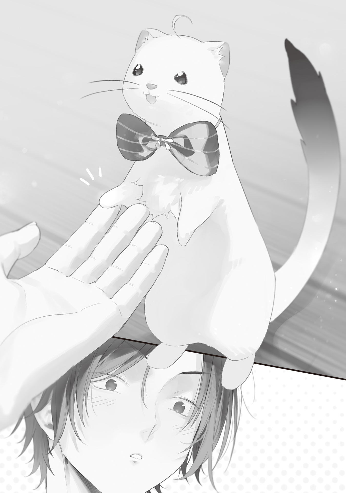

The Blue Witch said she would bring me materials on magic language, so I marked my handmade calendar and waited, counting down the promised five days on my fingers.

A magic wand boosted and reinforced magic cast through magic language, so you couldn't make a decent one without knowing the language.

Making magic wands without knowing magic language was like a CEO who knew nothing about the shop floor running a manufacturing company. Sure, it could be done, but not well.

I had a hunch that studying magic language was essential to understanding and advancing the structural theory of magic wands.

Plus, I was just plain interested in magic language.

My motivation was night and day compared to when I'd been forced to study English in school.

I mean, it's magic language—magic! Who wouldn't be interested?

Five days later, I was eagerly waiting for the stack of magic language materials I figured the Blue Witch would bring me, and my hopes got dashed.

The Blue Witch showed up in her usual ragged black clothes, with Blue Wand Cyanos and her mask, but no materials. Instead, a little animal sat perched on her shoulder.

"Hello, it's nice to meet you. I'm Ohinata Kei!"

"I-It talked!?"

The little animal had fired off a cheerful greeting in a young girl's voice.

It looked like a weasel, but its fur was white, so it was probably a ferret.

The ferret talked.

Normally, ferrets didn't talk.

But it was talking.

Which meant...

"A ferret monster!"

"Ahaha, I guess that's what I look like. I'm actually a stoat. Also, I'm human."

With that, the ferret—correction, the stoat—scurried down the Blue Witch's body to my feet, stood up on its hind legs, and held out a tiny right forepaw.

The gesture baffled me for a second before I caught on, crouched down, and shook its paw.

Its hand is so tiny! I'm shaking hands with a talking stoat—forget fantasy, this is a fairy tale.

Hmph. Funny little creature.

That's all well and good, but I ordered magic language materials, didn't I?

What's the deal, delivery lady? This isn't what I ordered. Did you drop off the wrong package or something?

"What about the magic language materials? Was the delivery late? I was so excited to get them today, and then you brought a stoat instead. What a letdown."

I can barely take care of myself, let alone a pet.

When I griped at the Blue Witch, she answered, sounding unusually pleased.

"Kei-chan was born and raised in Ome. Her parents divorced before the Gremlin Disaster, and her father took her with him to Minato Ward. That's why she survived."

"Oh, yeah? Good for her."

I meant it.

I knew all too well how fixated the Blue Witch was on protecting Ome and its people.

Everyone in Ome had been presumed dead, so if one of them had turned up safe, in whatever form, that was something to celebrate.

"Wait, so what does that mean? This thing used to be human?"

"That's right. My magic misfired, and I ended up like this!"

The stoat—Ohinata—threw both her stubby little arms in the air.

She's so cute! I couldn't stop grinning.

I'd always hated those TV shows that dub voices over animals, but an animal that actually talked like a person was seriously cute.

I wasn't good at talking to people, and I wasn't good with animals either (the beasts that trashed my fields had turned me against them), yet put the two together and somehow you got something cute.

You made the right call giving up on being human, I thought, but I had just barely enough decency not to say it out loud.

"A failed transformation, huh? So you're a witch? Like, a stoat witch?"

"No. I'm a professor of magic linguistics. I heard Ori-san wanted a lecture on magic language, so Blue Witch-san introduced us, and here I am!"

"..."

As Ohinata dipped her tiny head in a polite little bow, my face went dead serious.

I dragged the Blue Witch around the side of the building, out of the stoat's sight, and grilled her in a low voice.

"Hey! Just give me the materials! On paper! Why'd you bring the actual researcher? Idiot!"

"At first, I meant to pick up paper materials. But when I visited her lab and we talked, I found out Kei-chan was from Ome."

"So what if she is?"

"She said she was curious about the Wand Maker, so I brought her."

"Whaaat?"

Hold on. You told her?

That there was a Wand Maker in Okutama.

That there was a socially inept, unofficial Living National Treasure.

That I was the Wand Maker who made Cyanos.

You told her!?

"You're the one who said I should stay hidden. Why'd you go blabbing?"

"Because she can be trusted, of course."

"She can?"

"Yeah. Kei-chan is from Ome."

The Blue Witch declared it like she was pointing out that the sky is blue.

Hopeless. Normally she was cool and collected, but she had a huge soft spot for anyone from Ome.

I didn't want to meet people, and the Blue Witch didn't want nuke-level technology spreading, so I'd thought we were agreed on keeping me hidden. Talk about a booby trap.

I stole a glance at the fairy-tale creature a little way off, which was busy watching a butterfly.

Then again, Ohinata doesn't look human at all. Actually, she isn't human.

Any way you look at it, she's just a talking critter. If I'm scared of a stoat this obviously weak and cute, I'd have to be scared of every living thing on earth.

I'm the one who dumped all outside negotiations on the Blue Witch... If she's decided Ohinata can be trusted, then, well, I guess it's fine?

Getting the magic language materials on paper would've been best, but a talking stoat isn't bad either.

Good thing she isn't human. Good thing her accident turned her into a stoat. Please stay that way forever.

Done with the interrogation, I went back to the stoat and welcomed her.

This would be my first time talking with an actual researcher.

I'd better call her Professor.

"Thank you for coming today, Professor Ohinata."

"Yes! Likewise! I'd love to learn all about Cyanos from you!"

When I bowed my head, the stoat professor pressed her little paws together in front of her chest and psyched herself up with a determined "Mmph!"

Hmm?

For a professor who researches magic language, her voice and mannerisms seem awfully young.

Maybe she's a stoat on the outside and a middle-aged lady trying to act young on the inside?

No, wait.

Hearing "professor," I'd pictured someone middle-aged or older, but that wasn't necessarily the case.

Just to be sure, I asked.

"Excuse me, but how old are you, Professor Ohinata?"

"Last month, I turned twelve!"

Hmph! So she's just a kid!

Want some candy!?

There was no point talking out here, so I showed Professor Ohinata inside. The Blue Witch knew her way around by now; she told me she'd be reading my book collection (manga) and promptly holed up in the study.

I led Professor Ohinata to my workshop, careful not to step on her, and the stoat let out a cheer.

"Wow...!"

Her round little eyes sparkled as she scurried up onto the worktable and looked around the room in awe.

"Amazing, amazing! It looks like a magic artisan's workshop!"

"Looks like"? That's exactly what it is.

The Blue Witch had reacted the same way the first time I brought her in here.

And honestly, the eight-tatami workshop, which used to be a dirt-floored room, did have a fantasy vibe.

After the Gremlin Disaster wiped electricity off the face of the earth, I'd cleared out the 3D printer and grinder and brought in more primitive tools like whetstones and an anvil.

The half-open junk box, crammed to jangling with milky-white Gremlins from the crystal rain, looked just like a treasure chest. The Okutameteorite was displayed on the wall like a shrine relic, and several wand blueprints were pinned up beside it.

Lab equipment I'd swiped from the Okutama Middle School science room brightened up the glass shelves, and when I struck a match and lit the lantern hanging from the ceiling, the workshop filled with a soft orange glow.

The smell of melted wax and soot added to the old-timey atmosphere. Professor Ohinata's nose twitched and snuffled as she scampered this way and that, careful not to touch the tools I'd left lying around, and peppered me with questions.

Mm-hmm. Ask me anything.

"What's this?"

"I was testing whether I could separate out the components by putting crushed Gremlins in an ether solvent and running them through a hand-cranked centrifuge."

"I see? What an interesting experiment! How did it turn out?"

"It failed."

"Oh. That's too bad... What about this?"

"I tried processing a Gremlin by etching it. Its corrosion resistance was too high, so that was a bust too. All I did was dissolve my tools."

"Wowww! You've tried all kinds of things! That's amazing!"

"I guess."

All that praise from the peppy little critter made me back off a bit.

Man, this stoat's pushy. She's got "lots of friends" written all over her, and I can feel the wall between us.

"Ori-san, you're smart. Do you come up with all these experiments yourself?"

"Well..."

"Ooh! You've got such a creative mind! Did you study this kind of thing at university?"

"I don't think university had much to do with it. Though I guess knowledge is where ideas come from."

"Oh, I get that. The things my dad taught me have helped my research a lot too. I guess it's the same for craftspeople. What university did you go to, Ori-san?"

"Some obscure place. You wouldn't know it if I told you."

"Really? I'm sure that's not true... Was it in Tokyo? Where's your hometown, Ori-san?"

"Aichi."

"Aichi means miso katsu[^1]! It's so good, isn't it? I bet you eat it a lot, huh?"

At first I'd answered because I figured she was interested in a magic wand workshop, but something seemed a little off. She kept throwing out topics that sounded related but weren't.

Why is she digging this deep into my private life? It has nothing to do with magic wands or magic language. Is she trying to find out who I am?

But she's a kid. Would a twelve-year-old kid do that?

"What's with you? You've been prying into everything. What are you after?"

"Oh... Did that bother you? I'm sorry. We're both doing magic research, so I thought it'd be nice if we got along. Ehehe."

"Get along...?"

"Yes! I'd be happy if we could be friends!"

"???"

It was hard to tell from an animal face, but Professor Ohinata seemed to be shyly fidgeting.

It was supposed to be Japanese, but my brain refused to process it, and I couldn't tell what she was saying.

What are you even talking about?

You don't become friends by trying to become friends, do you?

Getting along just so you can become friends makes no sense.

You click, so inevitably you get along, and before you know it, you're friends. That's the natural way things are supposed to go.

Putting in effort to get along? Come on, that's warped. It goes against the laws of human nature.

So even if you hate someone, you hide how you really feel and try to get along, and if that shallow "We're friends, right?" act works, that makes you friends!?

Man, this kid doesn't understand the first thing about friendship.

I've never made a single friend in my life, but even I know that much.

...I do!

I clicked my tongue loudly. Professor Ohinata seemed to get that I was rejecting the whole idea; she flinched, and her little tail drooped as she slumped.

Damn kid doesn't know how harsh the world is. There are guys out there who get so flustered just from being invited to karaoke that they can't get their words out. Pick your friends more carefully!

"Forget all that. Hurry up and teach me about magic language. That's what I called you here for."

"Okay... I'm sorry."

Professor Ohinata looked sad and deflated, but she quickly pulled herself together and hopped over onto my drafting board.

"Um. So, uh, is it okay if I use this paper and pencil?"

"Use as much as you like."

"If you'll excuse me, I'll begin the lecture. Oh, do you need to use the bathroom first? I did prepare 90 minutes' worth of material."

"No problem. Let's hear it."

I settled into a cushioned chair, got ready to take notes, and gave her my full attention.

Never thought I'd be listening to a lecture again after graduating from university.

If any university had offered lectures on magic linguistics, they'd have been hugely popular. The professor was a super-cute stoat, after all.

"First, the history of magic linguistics. My father, Ohinata Soichi, taught linguistics at a university. Shortly after the Gremlin Disaster, an acquaintance of his, Bloodsucking-san... the Bloodsucking Mage, came to him for advice. My father took the chain of events the disaster had set off very seriously, so he gathered his lab's assistant professor and seminar students and launched the Magic Language Analysis Team."

"Huh."

Here we go—the Bloodsucking Mage.

He came up a lot in the Blue Witch's stories too. Apparently he'd been a capable guy with his hands in all kinds of things.

I'd heard he was dead now, but even if he were alive, I probably never would've met him. Highly sociable people weren't my thing.

"The research team first collected language samples.

"There's a five-stage method in experimental science that applies to every academic field, not just linguistics: observation, inference, hypothesis, testing, and analysis. You observe and collect data, make a prediction from that data, set up a hypothesis about what should happen if the prediction is right, actually test the hypothesis, and then analyze the results. After that, you go back to observation and repeat. That's how you get closer to the truth, logically and efficiently.

"Oh, you don't have to take notes on this part. It's fine to just listen. This part's just the introduction.

"Collecting language samples is the very first step of that five-stage method: observation. With Bloodsucking-san's help, the research team interviewed 13 witches and mages about their incantations and ended up with 72 spells in total. When they analyzed and classified the meanings and pronunciations of those 72 spells, they concluded they'd have to posit at least seven unknown phonetic symbols for sounds humans can't pronounce. In other words, magic language was never a language spoken by humans, by Homo sapiens, in the first place."

"I've heard about that. The Blue Witch recited her incantations in a weird voice too."

"That's right. The Vaa-ra school has unpronounceable sounds in it too. You know a lot!"

Professor Ohinata smiled and nodded.

"Magic linguistics is linguistics, but it also takes in history and regional studies.

"Here's a familiar example. Japanese has tons of words for snow: light snow, powder snow, big fluffy flakes, sleet, hail, blizzards, ground blizzards, wet snow, fresh snow, lingering snow, and so on. That's because Japan is a snow country. It's the language of a place where it snows a lot, so the culture developed fine distinctions between different kinds of snow, and those distinctions are reflected in the language.

"In Mongolia, it's horses. They have very fine distinctions for horses, because their whole way of life is bound up with them.

"If you know a language, you understand the environment it was born in, and if you understand that environment, it helps you understand the language. Basically, who speaks it, and where do they live?

"So alongside the language research, the team also studied the witches and mages themselves. They aren't native speakers, but they're the closest thing there is. This kind of research takes enormous patience, and with machines not working anymore, the team was always short-handed. That's how I started going to the lab to help with my father's research."

I'd been listening quietly up to that point, but something kept bugging me, so I raised my hand.

"Mind if I cut in?"

"Yes. Go ahead."

"Professor Ohinata, are you really twelve? This isn't the kind of lecture an elementary schooler gives."

"Thank you! I went to a private school, and ever since I started there, I've never gotten anything but first place on a test. My dad used to praise me for it a lot, too."

With that, the stoat perked up her whiskers and proudly puffed out her chest fur.

She's a child prodigy! Damn, that's impressive.

I wondered whether everyone still alive these days had to excel at something. Take me, the Blue Witch, and Professor Ohinata.

People with no special skills or strengths had probably dropped out of the brutal race to survive. Rough times.

"Getting back on track. Some incantations mention literature, so it looks like magic language has written characters too. But we have no way of knowing what those characters look like. That means magic linguistics has to be based mostly on vocalization and speech.

"And that comes with a big danger. If a person who can't control magic power pronounces magic language accurately while a Gremlin or magic stone is nearby, the magic goes off whether they want it to or not. Of course, that also makes it a very effective test of how accurate a pronunciation is, so it's a phenomenon our research can't do without. But magic misfires are still dangerous."

I nodded.

The Blue Witch had warned me about that too. Accidentally going "magic, boom!" was seriously dangerous. It was like a handgun going off just because you talked. Worst case, somebody could end up dead.

"The research team was there to study magic language, but given the times, they were expected to turn their research into practical results right away. You can't spend precious manpower on research that doesn't help anyone.

"Specifically, the team made modifying and improving incantations its top priority.

"Take the incantations of Bloodsucking-san's Deenit school, for example. Deenit school magic has to do with blood, and one of its spells is self-enhancement magic. It burns magic power and your own blood to give your physical abilities a big boost, and it uses little enough of both that even an ordinary person can handle it. You'll be anemic afterward, but nothing serious.

"In theory, this self-enhancement magic would let an ordinary person holding a fairly large Gremlin take down a weak monster. It would take a huge load off the witches and mages who hunt monsters, make manual labor far more efficient, and help in all sorts of other ways."

"Ooh. I want to learn that. What's the incantation?"

"You can't learn it. It has unpronounceable sounds in it."

"Oh..."

I see, so that's the sticking point.

Then it's no good—way too many incantations are witch-and-mage only. You can research them all you want, but it means nothing if you can't recite them.

"That's why we're researching and developing bypass incantations. We analyze the magic language and rebuild the incantation around words that mean the same thing but that humans can pronounce, steering clear of the unpronounceable sounds. The idea is to create a spell with the same effect that humans can actually say."

"Oh!"

Turns out there's a point to the research after all.

Now I get it! That really is a job only a linguist could do.

Linguistics is freaking amazing!

I looked at Professor Ohinata with new respect. Linguists are killing it. My magic wands can change the world, but linguists like her can decide its fate too. Seriously, major respect, Professor!!!

"And during that research, one accidental magic activation after another killed off the team, until everyone, my father included, was dead. Now I'm carrying on the research alone."

"Huh?"

She dropped that bombshell so casually that I freaked out.

Misfires can kill people? No, people have actually died. Tons of them. What the hell? What happened to safety!?

"Is research into magic language really that dangerous? Dangerous enough to kill people?"

"Yes. This research is life or death. When you recite a modified spell whose incantation structure has been tinkered with, it often has a different effect from the one you expected. Sometimes that effect is fatal. A spell that's supposed to consume blood for self-enhancement might boil the blood instead, or make it multiply so fast the caster bursts. I modified a spell for transforming into a dragon, recited it, and turned into a stoat. I was very lucky I didn't turn into an inanimate object or a microorganism, or just die on the spot."

"Yikes."

I'd been brainlessly cooing over how cute the stoat professor was, but now that I'd heard the backstory, it was no joke.

That's what she got for taking a crazy risk!?

A twelve-year-old kid shouldn't be doing this! Doing research like that, she'd need a hundred lives.

"Just leave the research to witches and mages. They don't have to worry about misfires."

"They aren't aware of what they're pronouncing, or how. And they're all busy people. In the end, an ordinary human who can't make the unpronounceable sounds has to recite the spell to check whether any of those sounds are mixed in. Even with the risk of accidents, it has to be done."

"Why not just quit? The research, I mean. You'll die too. Leave it to the grown-ups."

"I want to finish my father's research with my own hands."

Professor Ohinata didn't waver.

Her round little eyes burned with the fierce resolve of someone living through turbulent times.

I was overwhelmed, and her pint-sized body suddenly seemed huge. Talk about locked-in resolve.

Professor Ohinata was one amazing woman.

Over the course of Professor Ohinata's 90-minute lecture, I picked up the basics of magic language.

Memorizing phonetic symbols, grammar, rhetoric, and the rest in one go would've tied my brain in knots, but the professor gave me her seal of approval: I had the fundamentals down. Getting called an excellent student didn't feel bad at all.

I learned plenty, but mastering the safety sound was clearly the big one.

The safety sound was a fail-safe dreamed up by magic linguists, who had a habit of setting off magic by accident in the middle of their research.

Magic language sounded nothing like Japanese, so nobody was going to cast a spell by accident in everyday conversation. Magic linguists, who spoke magic language day in and day out, were another story. Whenever they talked shop with each other, there was a real risk of a spell going off by mistake.

It'd be a nightmare if you said, "I'd like to consult you about the <ruby>Vaa-ra<rt>Freeze</rt></ruby> school," and a freezing beam went off the second the words left your mouth.

So magic linguists had trained themselves to always put a short fricative at the start of any sentence they spoke in magic language.

That fricative didn't appear anywhere in the magic language identified so far, and it was presumed not to exist in the language at all.

That meant slipping it into magic language made the pronunciation invalid, and the magic would always fizzle.

A safety-device sound to prevent accidental activation. That was why they called it a "safety sound."

The safety sound was so short, quiet, and hard to catch that unless you listened really carefully, you'd dismiss it as noise. Adding it didn't get in the way of conversation at all.

Witches and mages had no need for it, but for ordinary people like me, it was extremely useful.

You could call it one of the magic linguists' impressive research achievements.

Mind you, experiments with bypass incantations and modified incantations needed the magic to actually activate, so they couldn't just tack on a safety sound and make it fizzle. Knowing the safety sound still didn't save magic linguists from fatal accidents.

To protect themselves from incantation accidents, magic linguists needed a more fundamental fix, or some new method.

After the lecture, the stoat professor was worn out from talking, so I poured some canned juice into a small dish for her and took a break myself. It had been ages since I'd worked my brain that hard. I was beat.

I made a trip to the toilet—a pit toilet—and was heading back to the workshop when the Blue Witch poked her head out of the study and stopped me.

"Ori. Is the lecture over?"

"Yeah. Any more and I don't think it'd stick today anyway."

"Then come here a minute. I need to talk to you about something."

She beckoned me into the study, then fiddled with the hair spilling out from under her mask and mumbled like she couldn't get the words out.

"Actually..."

"Yeah."

"Um, it's hard to say, but..."

"Yeah."

"Hear me out without getting mad..."

"Saying that is what's going to make me mad. Spit it out already. The socially awkward slot around here is already filled. By me."

That push finally got her talking.

"I made a promise I can't keep. Well, I didn't say it outright. I kept it vague and said I'd think of a way. But the bottom line is, in exchange for this magic language lecture, I have to solve Japan's food problem. Or at least the one for the whole Tokyo area."

"What are you even talking about?"

How did the conversation even get there?

How do you get from a lecture to that?

None of this makes any sense.

When I got the details out of her, it sounded like there'd been some political dealing at the Witches' Council.

The Foresight Mage, who had Professor Ohinata under his protection, was actually the minister in charge of the food problem. His offer went something like: "I'll lend you my subordinate, so in exchange, help out with the food-production project we've got on our plate."

I also got a long speech about just how bad Japan's food crisis was right now, but that was the gist.

"You made the promise, Blue Witch. You deal with it."

"I don't know much about farming. The only thing I've ever grown is morning glories in elementary school. You've got a vegetable garden and a rice paddy, don't you, Ori?"

She was practically begging, but any way you sliced it, that was a stretch.

"No, don't lump my little garden in with a national-scale agricultural problem."

"But you still know more than I do. And you made Cyanos, didn't you? Can't you make a magic wand that starts an agricultural revolution?"

"Screw that. You're asking way too much."

Even as I said it, I was turning it over in my head.

The simple fix would be to lend Cyanos to the Foresight Mage and let him blast out ultra-amplified fertility magic. But apparently the Iruma Mage had set one hell of a disastrous precedent there, and the Blue Witch said she absolutely couldn't lend Cyanos out and risk a repeat.

Well, I don't know the first thing about this Foresight Mage.

If the Blue Witch says she wants to trust him but can't trust him all the way, that's probably how it is.

"Why don't you just take Cyanos and tour the whole country, handing out fertility magic everywhere you go? ...Oh, right. You don't want to leave Ome."

I answered my own question before she could.

Then Cyanos is out, and the same goes for Okutameteorite.

"What about sheer manpower? It's not like I was saving them for a day like this, but I've got about 300 general-purpose dual-layer magic wands made from Gremlins sitting in storage. I made them to kill time. Teach regular people that fertility magic, get all 300 of them chipping away at it..."

"Sheer manpower won't work. Fertility magic has an unpronounceable sound in it. Only witches and mages can use it."

"Aw, seriously? No, wait, Professor Ohinata said she was working on exactly that! Research on getting around unpronounceable sounds and reworking incantations so humans can say them!"

I snapped my fingers and pointed at the Blue Witch.

Everything clicked. Ah, so that's what Professor Ohinata meant when she said her research had to turn into practical results right away.

Well, what do you know—Professor Ohinata's going to solve it for us even if we just leave her to it! I'd barely started to relax when the Blue Witch shook her head gravely.

"At this rate, Kei-chan is going to die before her research is finished, no question. Incantation experiments kill too many people. I mean to talk her into quitting them somehow, but then there won't be a single magic-language researcher left."

"Oh yeah, they kept dying until she was the only one left, right? So hire new people."

"Over ninety percent of magic-language researchers die on the job. That's a higher death rate than the security force has. They say they're recruiting, but nobody signs up."

Every idea I threw out got shot down, and I was about to snap.

So what do you want me to do!?

"Then it's checkmate."

"Yeah. That's why I'm stuck. I need your brain on this, Ori."

"Can't."

I'm just your average legendary Wand Maker, you know?

If professors smarter than me and politicians with more social skills than a million of me combined can't solve it, then I sure can't.

It was the obvious conclusion, so I threw in the towel, but the Blue Witch wouldn't let it go.

"I get why you'd say that. But at least think about whether there's some way. I'll think about it too."

"...Just think?"

"Yeah, that's all I ask. That helps. Sorry for asking the impossible."

The Blue Witch looked relieved as she bowed her head.

All I want is to hole up as a legendary Wand Maker and watch the world from a safe distance. That's the whole reason I dumped every negotiation with the outside world on the Blue Witch.

Don't make me carry the future of Japan on my back. Seriously, come on.

I guess I can live with just thinking about it, but man, I'm dreading this.

We'd talked for a good while before I remembered I'd abandoned Professor Ohinata in the middle of our break. After the break, we were supposed to move on to Q&A.

I tiptoed back into the workshop, bracing for her to be mad, and found Professor Ohinata curled up on a lap blanket, fast asleep.

S-So cute...!

I reached out a finger to pet her before I could stop myself, and she licked the tip with her tiny tongue without waking up.

What is with this creature? It knows exactly how cute it is!

She's human on the inside, so she doesn't need training, she can fix her own meals, and she's quiet. Talk about the ultimate lifeform.

"..."

Her tongue was warmer than I'd expected, and as I let her lick my finger all she wanted, it slowly started to sink in.

Right.

At this rate, this adorable little critter is going to push ahead with some reckless experiment and die.

I don't want that. It'd be way too sad.

Okay, time to give this some serious thought.

How to solve Japan's food problem and keep the stoat professor from getting killed in an accident.

Still dead asleep, Professor Ohinata was moved into a basket lined with a fluffy blanket, and the Blue Witch carried her home with great care.

Between getting saddled with Japan's food problem, turning into a stoat, and having a one-on-one lecture with a socially awkward guy crammed into her schedule, she must have been worn out, body and mind.

I just hoped she wouldn't work herself to death before an accident could get her. The world was way too hard on elementary school girls.

With my guests gone, I had my comfortable solitude back, and my brain started running faster.

I wrote everything out on paper to sort through the problem, and I came to a conclusion: basically, all I had to do was get the death rate of magic-language experiments down to zero.

Even if I couldn't get it all the way to zero, close would be good enough.

If the death rate of magic-language experiments dropped off a cliff, people would probably start answering the job postings for magic-language research. Professor Ohinata would stop being a one-woman team, and her workload would shrink just as fast. The Blue Witch, who never stopped worrying about Ohinata Kei, could breathe a little easier. Research would speed up, and the fertility-magic bypass incantation would get finished sooner.

Once there was a fertility-magic bypass incantation anyone could recite, the 300 general-purpose magic wands sitting in my storage would finally get to cut loose. If 300 wasn't enough, I could always make more.

Even unprocessed Gremlins could serve as magic-activation media, inefficient as they were. So worst case, if we ran short on wands, we'd only need to spread the wording of the fertility-magic bypass incantation around. Then sheer manpower could cast low-output fertility magic over and over, and the food problem would be solved.

So how was I going to lower the death rate of magic-language experiments?

It was a tough problem, but my one talent was world-champion dexterity. Nobody could touch me when it came to making magic wands. The smart move was to play to my strengths and make a magic wand that lowered the death rate of magic-language experiments.

I'd heard about several fatal accidents from failed magic-language experiments, and in a lot of them, less power would've meant nobody died.

In the accident where someone's blood boiled, a weaker spell would've just warmed it up and given them better circulation.

In the one where a sudden surge of blood blew someone's body apart, a weaker spell would've just made them prone to nosebleeds.

Even the stoat transformation might've stopped at a pair of stoat ears, or just a tail, at lower power.

Every magic wand I'd made so far boosted power. Even the weakest doubled it compared to an unprocessed piece. Cyanos's amplification ratio was so high that nobody had pinned down yet exactly how many dozen times over it amplified magic. (The Blue Witch said it might even hit 100 times.)

So I flipped the idea on its head.

If processing can raise magic's power, can't it lower it too?

The trouble is ratios like two or three times. If I can make a magic wand with a ratio of, say, 1/1000, then even when a magic-language experiment goes wrong, it shouldn't be enough to kill anyone.

I'll make a magic wand with negative amplification—that's the goal.

With a goal set, the rest is my home turf.

All I have to do is develop the processing method and build the thing.

I spent a whole day and night in a staring contest with my drafting board, trying one processing method after another. The floor filled up with scribbled sheets I'd torn off and thrown away, and I groaned over them while I ate the bento that Uber Blue Witch had hung on the workshop doorknob at some point.

The simple logic was this: processing a Gremlin into a sphere raised its amplification ratio, so processing it into the opposite of a sphere should lower it.

But what's the opposite of a sphere...?

Does a sphere even have an opposite...?

Maybe a mathematician who specializes in geometry would have a flash of inspiration, but I've got nothing.

Still, it seemed like the answer called for a geometric approach, so I dug my old high school and college math textbooks out of the closet and went hunting for a good idea.

Sure, carving Gremlins into random, irregular shapes did lower their output, but only to about 1/2 to 1/3.

Plenty of spells could still kill at half power. Irregular Gremlins also sometimes sent magic off in a direction you hadn't aimed it. If a lethal spell aimed at a target glitched and came flying back at you, you'd have a total disaster on your hands. Irregular processing was out of the question.

Processing that used spheres or spherical shapes probably boosted magic.

Maybe a spiral? Or a square?

I tried carving Gremlins into spirals and squares as the ideas came to me, but both only cut the power to 1/2 to 1/3, and on top of that, the natural-frequency beam that should've flown straight curved off in some random direction. Way too dangerous. No good.

I'd just torn up another design sheet when a sidebar on fractal structures in my math reference book caught my eye.

Fractals. A geometric concept where a shape's parts and whole are self-similar...?

The definition didn't click, but one look at the illustration next to it, and I got it instantly.

Oh.

Oh, oh, oh!

You can make fractals in 3D too, not just flat shapes.

And they're recursive.

Fractal structures show up in the natural world too, in trees, coastlines, cumulonimbus clouds, and snow crystals... Mm-hmm, mm-hmm, mm-hmm.

It's just a gut feeling, but this fractal thing feels like a "magical" shape.

My head doesn't get it yet, but these godlike hands of mine, which have precision-carved and handled hundreds of magical stones, are itching at the sight of a fractal.

I traced the dodecahedral fractal in the reference book's illustration with my fingertip and found magical meaning in it.

Professor Ohinata had mentioned it: magic linguistics had something called the Yoshida Conjecture.

It was proposed by the late Associate Professor Yoshida of the magic-language research team, and it held that on top of the seven unpronounceable sounds confirmed so far, magic language had five more that nobody had found yet.

That made twelve sounds total.

She'd skipped over how they could know that, so I had no idea (not that I could've kept up with the technical explanation anyway). But apparently it was a pretty reliable conjecture. Within the research team, it was treated as "a conjecture as close to fact as it gets."

Twelve unpronounceable sounds.

A dodecahedral fractal.

Both twelve. Is that a coincidence, or no coincidence at all?

Ngh, I've been thinking so hard I can't tell up from down anymore.

Maybe I just want them to be connected so badly that I'm tying together two things that have nothing to do with each other.

Then again, it also feels like I've hit on the truth after all the research, prototypes, and thought experiments.

Eh, whatever. I'll just process a Gremlin into an actual dodecahedral fractal and see.

Going by the illustration, it's going to be dizzyingly complex, delicate work, but trying costs nothing.

Since this would be the most complex processing I'd ever attempted, I went with the biggest, easiest-to-work Gremlin I owned: a top-class 28 mm piece collected from the Yokohama Thermal Power Plant.

I'd barely started before I realized this wasn't going to be easy.

Cyanos's spherical multilayer processing had been hard enough, but fractal processing was on another level. Carefully carving out that tangle of the same structure nested inside itself over and over, I felt like my eyes and hands were about to go haywire.

With Cyanos, I'd been able to work straight through, but the fractal wore my concentration down fast. I took break after break, resting my hands and soothing my eyes with hot towels.

Making more than 300 magic wands hadn't been a waste after all.

If I hadn't spent all that time training my eyes and hands and improving my precision, even I couldn't have pulled off work this ultra-precise.

If carving a Great Buddha out of a grain of rice was dexterity level 1, this job was around level 100. And I'm not exaggerating—it was seriously that hard.

Eventually I got so absorbed that I lost all sense of time. When I finally finished the precision work, which had felt like it would never end, all the tension drained out of me and I nearly keeled over.

C-Crap, that was close. I almost dropped the test piece I'd worked so hard on and broke it.

After fractal processing, the test Gremlin was mostly empty space inside and would crack easily, so I had to be careful with it.

I'll fill the gaps with resin later to reinforce it. Even if this prototype turns out to be a flop, I want to keep it as a souvenir of all that effort.

Judging by the empty bento boxes stacked in the corner, I'd been at it for three full days, so no wonder I was sleepy. My stomach was full, but my brain had hit its limit.

I'll test this thing and then go to bed. I got way too into this.

"Aaaagh!"

Swaying a little on my feet, I held up the fractal prototype and recited my usual natural-frequency incantation, but something was off.

No white beam fired. Instead, the dodecahedral fractal flickered on and off in a steady rhythm.

What? Something happened!

I'd been hoping, but I hadn't really expected anything to happen.

My drowsiness vanished, and I set about examining the fractal and whatever unknown thing it was doing.

But I can't tell...!

I have no clue what's going on!

Timing it with a metronome told me the white flashes repeated on a regular cycle.

Beyond that, I had nothing: it wasn't getting hot, and it wasn't vibrating. It just sat there blinking, which might make it handy for an electronic sign.

Poking at it got me nowhere, so for lack of a better idea, I shouted again.

"Aaaagh!"

The instant I shouted, a thin white beam shot out, hit the paper target on the wall, and fizzled out feebly without so much as rustling it.

Whoa!? It's weak!? The power's way down! I don't know why it glitched the first time, but the power's way down!

Could this work!?

"<ruby>Vaa-ra<rt>Freeze</rt></ruby>!"

This time, I tried the freezing incantation I'd just learned.

But again nothing fired, and the fractal started blinking pale blue.

Hm?

Wait, is this...

"<ruby>Vaa-ra<rt>Freeze</rt></ruby>. Aha, just as I thought. Activation-standby state? <ruby>Vaa-ra<rt>Freeze</rt></ruby>, <ruby>Vaa-ra<rt>Freeze</rt></ruby>, <ruby>Vaa-ra<rt>Freeze</rt></ruby>, <ruby>Vaa-ra<rt>Freeze</rt></ruby>. Yep, that's gotta be it. Then how about Vaa-raaa... Nothing at all. Got it."

After reciting it over and over to test it, I figured out that the fractal-processed piece went into an activation-standby state on the first incantation and fired on the second. It didn't respond to incorrect incantations at all.

On top of that, its power had dropped through the floor.

A built-in safety lock that needed two incantations to activate!

Massively reduced power meant massively fewer accidents!

Either feature alone would've been amazing, and it had both.

I trembled at my own genius. It had turned out even better than the ideal I'd been aiming for.

Lately I've been thinking of myself as the world's greatest genius Wand Maker, but maybe I'm the greatest in the universe.

Giddy, I got to work putting the finishing touches on the invention of the century.

I poured resin into the gaps in the structure and let it harden, coated the whole thing in more resin, and carved it into a diamond shape. The classic gem for the tip of a magic wand was a sphere, but a sphere might boost the power I'd worked so hard to lower. Then again, a diamond shape wasn't bad either.

The finished piece looked like a white dodecahedral fractal floating inside a clear, diamond-shaped crystal.

Pretty cool, right? Looking good!

For the wand's handle, I splurged on a long, 120 cm length of paulownia. Paulownia was a soft wood that took a beautiful shine when polished, and it was the lightest wood grown in Japan, so even a huge wand wouldn't feel heavy. It was less sturdy than Cyanos and had no frost protection, but it was for lab use, not combat, so it would be fine.

Light wood or not, it was still 120 cm long, way too big for the stoat who'd be carrying it, but that wasn't a problem.

I like small creatures holding huge weapons!

Little girls swinging around huge-ass hammers are totally my thing too.

I want her to lug around a giant wand way too big for her, giving it everything she's got. Just imagining it makes me grin.

For the design carved into the handle, I worked in the crest of the university where her father had taught. Professor Ohinata seemed like a daddy's girl, so I figured it'd go over well.

Not even the Foresight Mage could've foreseen that the catalog of university crests I'd bought after watching some university-war anime a few years ago would come in handy here.

Finally, I engraved the name Aleister in a stylish font, after Aleister Crowley[^2], the greatest occultist of the twentieth century, and it was done.

I'd finished the wand, written up its instruction manual, and was testing the grip when I sensed someone tiptoeing outside my room.

Perfect timing. I opened the door to greet the Blue Witch, who'd come to drop off a bento.

She jumped when the door suddenly flew open from the inside.

"Good morning!"

"O-Oh. Good morning. It's evening, though. Were you taking a break?"

"Something like that. So, about the solution to the food problem you asked for..."

"Yeah."

"You said I only had to think about it, right?"

"Yeah."

"I kinda made something."

"...Huh?"

"A solution to the food problem. I made one."

"...!?"

"Here, the dodecahedral fractal wand Aleister and its instruction manual. Give them to Professor Ohinata and she'll know what to do. Okay, counting on you. I'm going to bed."

Sorry for being a genius!

The only thing I've got going for me is that I'm good with my hands.

But I'll solve everything with nothing but those hands!

Crushing sleepiness took over, and I passed out on the floor before I could even make it to bed. I'd fallen asleep in the evening, and when I woke up, it was still evening.

Apparently I'd slept through an entire day. Pulling three all-nighters in a row was a bad idea. I'd been too wired to notice while I worked, but my fingertips, shoulders, and lower back hurt, my eyes were bleary, and I was stiff all over.

Still, all that sleep had cleared my head. I made some instant coffee to wake up, took a breather, had a light meal of canned tuna and canned corn, and headed out to check on the rice paddy. I'd left it alone for three whole days, and I was worried.

Now that I was growing rice myself, I finally understood the old folks who go out to check their paddies during a typhoon and die in accidents. Of course they worry.

Luckily, apart from the water level dropping a bit, the paddy was fine. I adjusted the stopcock to let in a little more water, then headed home before the sun was fully down.

Supposedly central Tokyo was under rationing and the food shortage there was severe, but living alone as a shut-in in Okutama, I barely felt it. The Blue Witch brought me food rations on a regular schedule, and the rice paddy was going well. Not that I could let my guard down. Come harvest time, there'd probably be a fierce battle with the pests going after the rice.

On the way home, I thought I'd ask to learn the improved fertility magic too once it was done, since even ordinary people who couldn't pronounce the unpronounceable sounds would be able to use it. When I got back, the Blue Witch and a girl I'd never seen before were standing at my front door with the setting sun behind them.

"Ah! Ori-san! Welcome back! Were you out?"

I didn't recognize the cute girl waving her arm like crazy and calling out to me like we were old friends.

But I recognized her voice.

I also recognized the stoat ears poking up out of her short white hair, and the white stoat tail with its black tip.

A girl of about sixth-grade age.

Stoat-like features.

And she was holding Aleister, the wand I'd given the stoat professor.

The shock left me shaking.

Y-You...

No way!

"Thank you for Aleister! It let me change back, as you can see! Not all the way, but... I just had to thank you!"

"Change her back."

I'd meant to give Professor Ohinata a polite "Good for you," but my real feelings slipped out.

Why'd you go and turn human again, Professor!?

I keep telling you I can't deal with humans!

No, no, no! I liked you better as a stoat!

Change her back! Turn her back into a stoat!

Damn it!

"...Glad you got your human form back."

"Y-You sound disappointed!?"

My forced congratulations left Professor Ohinata flustered.

Then I overheard the Blue Witch whispering to her.

"Kei-chan, I think Ori might be a furry."

"Furry...?"

"Ori's bad with people. He must have the kind of kink where he can only be attracted to <ruby>beasts<rt>animals</rt></ruby>."

"I-I see?"

"I can hear you, you human-lovers."

From where I'm standing, you're all perverts with a thing for humans. Sure, you're the overwhelming majority, and I know full well I'm the weird one, but still.

"It's not that I like animals. It's that I'm bad with people."

"I see... Would you like to touch my tail?"

I had a feeling the misunderstanding hadn't fully cleared up, but I did take her up on the fluffy tail she held out.

It was getting dark out, so I invited them both in. My house had no such waste of space as a parlor, so I showed them into the living room and served them the last of my instant coffee.

"So, how's Aleister working out?"

"It's wonderful!"

Professor Ohinata beamed as she answered.

Seeing that she'd turned back into a human, I didn't need to ask to know it had helped a lot. But as its maker, I wanted to hear exactly how it handled.

"What about the design?"

"That's wonderful too! I never even properly asked for anything, but it's like the wand I always pictured wanting, if I ever got one, came to life!"

"Glad to hear it. I sized the handle for a stoat, though, so I'll fix that."

"Huh...? It's just right, though."

Professor Ohinata lifted Aleister a little and tilted her head.

Hmm. Well, if she says so.

The plan had been to hand a small animal a huge-ass weapon, but since she'd turned back into a human, it had ended up a normal-sized weapon by accident.

"Still, I figured it'd help with your research, but I never expected results in a single day. Was it really that good?"

"Hmm. That's true, but it's not the whole story. Until now, there was always the risk of magic misfiring, so I had to pick carefully from my list of experiments and cut them down to the bare minimum. I'd spent over a year putting that list together. This breakthrough let me clear the whole backlog at once... That's basically how it went."

"Got it. So what's the accident rate down to?"

"Effectively 0%. Just like the instruction manual said. Even when there is an accident, it's almost harmless now."

"I tried it too. Compared to magic using an unprocessed Gremlin, the output was about 1/100–1/120," the Blue Witch added as she turned her lukewarm coffee into iced coffee.

"Controlling my magic power bumped it up a little. Witches and mages could use it for load training."

"Oh, yeah? Want one too, Blue Witch? A fractal wand?"

"Cyanos is all I need."

With that, she tapped Cyanos against her shoulder.

She'd seemed unused to it at first, but by now she looked completely at home with her partner.

I took another look at the two sitting across from me.

A witch in black clothes and a mask, holding a beautiful blue wand.

A white-haired beastkin girl holding a geometric wand.

And this isn't even cosplay. Unreal.

Kids born after the Gremlin Disaster would probably grow up with strange magic wands and witches like these as a normal part of life.

Weird feeling. To me, it's thrilling fantasy, but to the new generation, it'll just be normal stuff that's been there since they were born.

So this is how generation gaps happen.

"Good, glad it's working without any problems. The structure's pretty delicate, so if anything goes wrong, let me know right away and I'll do maintenance. Well, it's sealed in resin, so it shouldn't just chip off with normal use."

"Okay. It's working super well so far, but if anything comes up, I'll be counting on you!"

"Please do. What else... Oh, right. How's the fertility magic coming along? Think the research'll get anywhere?"

"Oh, it's done."

"...Huh?"

"The fertility-magic modification. It's done."

"...!?"

I was so shocked my brain took a second to catch up.

No freaking way! It's only been a day!

So the grim forecast of an unprecedented great famine that would go down in Japanese history just got overturned in a single day!?

Undoing her transformation and fixing fertility magic, all in one day!?

S-So amazing. Too amazing!

Amazing, but scary!

Now I'm scared!

Professor Ohinata is such a genius she's gone right past amazing and looped back around to scary!

"Professor Ohinata is truly a remarkable individual. I am deeply impressed."

"Um, please don't talk to me so formally. Like I said earlier, I didn't do all of this in one day, you know? My father and his colleagues, the Ohinata research team, left behind tons of research data, and all I did this time was give it the final push. About 95% of the research was already done. It had completely stalled with 5% to go, and then Ori-san pushed it 4.9% further and I wrapped up the last 0.1%."

"O-Oh, so that's what it was. Figures. You had me scared there. But you're the one who crammed that 95% worth of research data into your head and made it part of you, Professor Ohinata. You worked super hard, and I seriously think you're amazing. That was genius work, no doubt about it. And you can take that to the bank, because a genius like me is the one saying it."

"Do you think so? Thank you."

"Your dad's probably proud of you from beyond the grave, too. Bet he's saying, 'That's my girl.'"

"..."

Professor Ohinata had been smiling the whole time, but the moment I carelessly let that slip, her face changed.

She quickly covered her face with her hands and hung her head.

While I was freaking out, wondering what was going on, I heard a small sob.

O-Oh crap. I made her cry.

Was bringing up her dead father a land mine for a daddy's girl?

Damn it, this is exactly why I hate talking to people. In writing, you get time to reread and check things before you hand them over, so you never blurt out anything careless. Human conversation is way too hard.

"S-Sorry. That was insensitive."

I apologized, my stomach in knots and my nerves shot. Professor Ohinata tried to reply but couldn't get a word out, so the Blue Witch, who'd been gently rubbing her back, answered calmly for her.

"It's fine. Sometimes, Ori, you move people without even realizing it. In a good way. Sure, you're insensitive most of the time, but Kei-chan and I both know that's just who you are. And then, out of nowhere, you give us exactly what we really wanted, the words we really wanted to hear..."

"...?"

"Heh. In short, Ori, stay just the way you are."

The Blue Witch gave a little laugh and summed it up in a way I could understand.

Uh, is that so...? Professor Ohinata's still crying, but she's nodding along with the Blue Witch, so I guess it is.

It's not clicking at all.

Oh well.

If they want me to stay as I am, then I'll stay as I am.

I pulled myself together and picked the conversation back up. Professor Ohinata seemed to have mostly stopped crying, too.

"Anyway, getting back to it. If you've finished the fertility-magic bypass incantation, could you teach it to me too? It's a spell even I can say, right? I want a bigger harvest out of my rice paddy."

"...Sniff. Yes, of course. Actually, we needed someone to do a final test before I report to Foresight-san anyway. How about I teach you, and you can be our tester at the same time?"

"So I just have to test the spell? I'm in, I'm in."

She agreed so easily that while the Blue Witch used my kitchen to make dinner, I got lessons in the improved fertility magic.

It was state-secret-level magic, so I'd only asked on the off chance, figuring they might not teach me. But come to think of it, they were about to spread it all over Japan anyway.

Learning it a little ahead of everyone else shouldn't hurt.

"Um. So, do you just want to memorize the spell? Or do you want to know how it was put together too?"

"I'm curious how it came together."

The last lecture had only covered the basics of magic language.

So how did the fertility-magic bypass incantation, basically the culmination of magic-language research, come about? As a magic-language beginner, I'm dying to hear about the cutting edge.

"Then I'll tell you all about it. Don't worry, I won't say anything you can't follow with what you know now, Ori-san.

"So first off, fertility magic belongs to Flower Witch-san, who manages the area from Arakawa Ward to Taito Ward in Tokyo. Foresight-san paid her to teach it to him, and then I learned it from him.

"The original incantation is '<ruby>Gurisuta Hia-zui<rt>The season of crystals comes around</rt></ruby>. <ruby>Honyarara Ueuento<rt>May the spirit-world predator's blessing be upon us</rt></ruby>.' Humans can't pronounce it.[^3]"

"So the honyarara part is the unpronounceable sound?"

"That's right. Have you ever been in a forest and heard the trees rustling in the wind? It's a sound like that."

I tried making the sound she described and gave up right away.

There was no way I could pronounce that.

"Every kind of magic has what's called a core word. Put simply, it's the basic spell. For Blue Witch-san, that's <ruby>Vaa-ra<rt>Freeze</rt></ruby>. Every single incantation Blue Witch-san uses contains <ruby>Vaa-ra<rt>Freeze</rt></ruby>.

"When you modify an incantation, you can't change the core word. It's fixed. Luckily, Flower Witch-san's core word was <ruby>Ueuento<rt>May blessings be upon us</rt></ruby>, so humans could pronounce it."

"There are core words you can't pronounce? I've heard the more advanced a spell is, the more unpronounceable sounds it has, but by that logic, a core word, being a basic spell, would be the lowest level there is, right?"

"That's a very good question."

Professor Ohinata pushed up a pair of glasses she wasn't wearing and launched into her answer, clearly enjoying herself.

"Sometimes the core word itself is an advanced spell, like Foresight-san's '<ruby>Honiyarara Kunatsuku<rt>Revelation</rt></ruby>.' Witches and mages whose magic schools are built on advanced core words like that tend to take feedback damage from magic backlash, or lose control of their magic and cause secondary disasters."

"Whoa! Yeah, I guess even the simplest kind of seeing the future would be an advanced spell."

That made sense.

Even seeing one second into the future would make you unbeatable in sports or martial arts. Of course it's advanced.

So no amount of magic-linguistics trickery will ever let an ordinary human use foresight magic. It's a Transcendent-only spell. Unfair.

"Of the original incantation, '<ruby>Gurisuta Hia-zui<rt>The season of crystals comes around</rt></ruby>. <ruby>Honyarara Ueuento<rt>May the spirit-world predator's blessing be upon us</rt></ruby>,' the part 'The season of crystals comes around' is pronounceable and already its own clause, so it doesn't need changing. The core word can't be changed, so 'May blessings be upon us' stays fixed too. That means all we have to do is rephrase 'spirit-world predator' with sounds humans can pronounce, but that's the hard part.

"Ori-san, do you know what a spirit-world predator is?"

"Huh? No idea."

Professor Ohinata nodded gravely at my instant answer.

"Exactly. I don't know either. Nobody in this world knows what that word means. Since it's called a predator, I think it's probably a living thing, but, you know how in America they give hurricanes women's names? As long as we don't know the culture or values of the civilization that uses magic language, there's no pinning down exactly what spirit-world predator means. All we can do is guess.

"Working from those guesses, we pulled words that looked usable for the rephrasing out of the 72 spells the research team has on record, combined them carefully, and rebuilt the incantation using only words with no unpronounceable sounds. That gave us 15 versions of a bypass spell."

"And then you tested all 15 with Aleister."

"That's right. Out of the 15 trial spells, only one was confirmed to work the same as the original. Here it is.

"'<ruby>Gurisuta Hia-zui<rt>The season of crystals comes around</rt></ruby>. <ruby>Zei<rt>You</rt></ruby>, <ruby>Dadanidao Putoraeooo Putorae<rt>from a world different from the world reflected in your eyes</rt></ruby>, <ruby>Hitei Hitei Kapaja Ueuento<rt>may the blessing of one who is not eaten be upon us</rt></ruby>.'"

"That's long!!"

"It's a bypass spell, after all."

Whew. No wonder the research gave them so much trouble.

It's like being told to hold a business meeting with no katakana loanwords and only words a kindergartner would know, right? Amazing they managed to cobble together a bypass incantation at all. Of course it came out wordy.

"I have to memorize this whole long thing? Yikes."

"It's a little easier to remember if you understand the sentence structure. Though I bet memorizing comes easy for you, Ori-san.

"All right! That's enough theory. Let's actually practice the pronunciation. It's long, so we'll go a little at a time, phrase by phrase. Now, repeat after me, and don't forget the safety sound. <ruby>Gurisuta Hia-zui<rt>The season of crystals comes around</rt></ruby>."

"Gurista Hi-a-jui."

"Ooh! Your Gurista is good. The first half's okay! Wonderful. The first half is perfect, but the second half is so close. The last sound isn't ju, i. It's zi. You know how you say the letter Z as 'zee'? Start from that sound, then open your mouth and move your tongue like this..."

After that, I spent the whole time until midnight getting pronunciation coaching from a sixth-grade girl, who even stuck her fingers in my mouth to hold my tongue down, and somehow I learned how to pronounce the fertility-magic bypass incantation. So I wouldn't forget, I also covered a sheet of paper with pronunciation notes.

While we worked on the incantation, the Blue Witch quietly made us a late-night snack on top of dinner. What a (conveniently) good woman. That was a huge help.

Then again, she'd probably made more than half of it to help Professor Ohinata grow up big and strong, not for me. The curry was mild, after all.

By the time Professor Ohinata gave me the okay, it was the dead of night.

Professor Ohinata had the nerve to ask, with a totally straight face, "Could I borrow a sofa or something?" and tried to stay the night like it was nothing, but of course I pawned her off on the Blue Witch.

Like hell. With the Blue Witch as her bodyguard, she'd be safe on a dark road or even a battlefield. Kindly go home. I mean it.

Professor Ohinata looked a little put out, but she let the Blue Witch take her hand and waited obediently in the entryway. Before stepping outside, she turned back to me, fidgeting.

"Um, can I come over to play again...?"

"No."

"Ori, you bastard!"

"Ah, it's okay, it's okay! Really, it's fine. I think it was how I phrased it. How I phrased it...?

"Um, I'd like to have another technical exchange. I mean, this time you made a dodecahedral fractal wand starting from my knowledge, right? And thanks to Aleister, I was able to complete the fertility-magic bypass incantation and become human again... well, 90% human. You could say our technical exchange led to technological innovation. I think meeting up regularly to talk and exchange technical knowledge would be good stimulation for both of us. What do you think?"

"No. I never want to see you again."

She made a logical case for the benefits of meeting again, but I flatly refused.

Stoat mode I would have welcomed, but animal-ear mode was a hard pass.

Professor Ohinata was a kid, but she was a good kid. Her stories were interesting too.

But she was so outgoing and cheerful that my instincts rejected her outright. Even if she'd hidden her face behind a mask like the Blue Witch, my body probably still wouldn't have accepted her.

The Blue Witch bristled with killing intent at me for shooting down a kid with everything I had, like a total child, so I hurried to offer a compromise before she turned me into an ice statue.

"Meeting in person is an absolute no, but I'm totally up for writing back and forth. Let's be pen pals."

"Huh. Pen pals...?"

"Yeah. I don't want to see you, but I do want to keep exchanging technical knowledge, and your stories are fun, Professor."

"I see. Yes, please! Let's be pen pals! This is great, I'm kind of excited now. I'll write you a letter as soon as I get home!"

Delighted by my full-throttle socially awkward proposal, Professor Ohinata waved her arm like crazy, wagged her tail too, and headed home with the Blue Witch, beaming and looking back again and again.

I saw them off and wiped away my sweat, a good part of it cold. Phew. I'm beat.

If she's already like that at twelve, what's she going to be like when she grows up?

I won't even be surprised if she starts speaking bird or fish one of these days.

I'll just quietly keep an eye on where Professor Ohinata goes from here.

## Translator Notes

[^1]: **Miso katsu** (味噌カツ): A Nagoya-area dish of breaded pork cutlet served with a rich miso-based sauce.

[^2]: **Aleister Crowley** (1875–1947): An English occultist and writer whose name Ori used for the wand.

[^3]: In these incantations, the bracketed text gives the magic-language pronunciation of the preceding written meaning. In ほにゃららウエウエント, ほにゃらら is an intentional placeholder for the unpronounceable portion, not a pronounceable reading.
