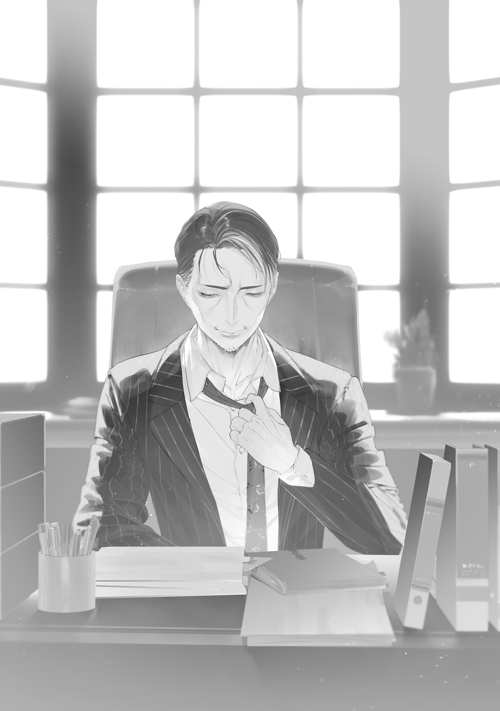

Solving the food crisis had long been the Foresight Mage's dearest wish.

The Foresight Mage had originally been an ordinary office worker.

He was single, lived alone, skipped luxuries, and saved steadily. His dream was to retire early in his forties, buy a small house in the country, and spend his retirement farming on sunny days and reading on rainy ones.

But in his late thirties, just when years of patience had finally put that dream within reach, the Gremlin Disaster struck.

The savings in his account, his digital investments, his stocks—all of it vanished. When he finally woke from the coma that came with becoming a mage and showed up for work, the company was deserted.

With his life plan in ruins, the Foresight Mage drifted like an empty shell for a while.

But then he saved a neighbor in his company housing from monsters, got swept into rescuing people at shelters under monster attack, and accepted sweets from a grateful child he'd rescued. He huddled with refugees whose homes had burned down, tossing scrap wood into a drum can in the park and lighting a fire to keep warm. Little by little, a sense of duty grew in him.

He can see the future. His body is tough and strong, and he can answer the cries of people asking for help.

In this ruined world, if he doesn't do it, who will?

From then on, the Foresight Mage helped people because he chose to, not because he'd been swept along.

As his fame as a mage grew, so did the scale of his rescue work.

Sometimes people mocked him, saying things like, "That's just a childish hero complex," "It's hypocrisy," or "That old guy is trying so hard because he wants people to fawn over him." But the sharpest tongues always belonged to people who never helped anyone and looked out only for themselves—idiots too cynical to do good even as a show, let alone for real.

Nasty criticism hurt him as much as it would anyone, but he had his share of ordinary joys too.

It wasn't as if the Foresight Mage had been selflessly serving society for the sake of peace.

Being treated like a hero felt good, good deeds were satisfying, and being fawned over made him proud.

He could see the future, yet he worked like a man possessed for praise in the here and now, pouring himself into the most obvious job at hand: keeping the peace in his home turf of Bunkyo Ward.

It was the Bloodsucking Mage, the coordinator of the Witches' Council, who gave the Foresight Mage a long-term view.

The Bloodsucking Mage talked him into using a powerful foresight spell he'd always avoided for fear of feedback damage from magic backlash. It let him see three orbital periods ahead—three Earth years when cast on Earth.

Until then, the Foresight Mage had vaguely pictured "annihilation by monsters" and "a large-scale war between Transcendents" as the worst cases. Now, with real urgency, he threw everything he had into averting an "unprecedented great famine caused by food shortages."

He worked even more frantically than he had in his office days.

He had warned the Witches' Council about the food crisis again and again, but only one person truly understood the threat: the Foresight Mage himself, the only one who had vividly "seen" the living hell of people eating people to stave off hunger.

He rolled out one policy after another to solve the food crisis, and with the Bloodsucking Mage laying the groundwork behind the scenes, a few of them became reality.

He met again and again with the Mermaid Witch, who had fused with an electric eel and lost so much intelligence that conversation was difficult, until he finally got through to her and partially revived Tokyo Bay's fishing industry.

He reclaimed Katsushika Ward, which had been flattened right after the Gremlin Disaster and left deserted for ages, and turned it into a large farm (though monsters ate the crops and wiped it out).

He promoted human-waste compost and container gardens to boost food production at the household level.

He ran all over the place to secure seeds and seedlings and protect farmers, and poured enormous resources into reviving farm tools that needed no electricity or machinery, along with forgotten know-how.

Even while he threw himself into the food problem, he still had to keep Bunkyo Ward safe, just as before.

And food wasn't the only problem he tackled.

One accomplishment was something only he could ever know about. Among the religious figures eagerly volunteering in Bunkyo Ward, he found a con man who was certain to become the founder of a murderous cult with 100,000 members, and quietly disposed of him before the preaching and brainwashing could begin.

The workload would have killed an ordinary person from overwork ten times over, but the sturdy body his mutation into a mage had given him kept him alive.

The Foresight Mage pushed himself so hard, under such intense stress, that his face aged ten years in a single year. Thanks to those efforts, Bunkyo Ward had become known as one of the two safest, most livable communities in all of Tokyo, and not a day went by without people from other districts asking to move there.

Bunkyo Ward's streets were as well preserved as Ome's, where the Blue Witch hunted down monsters swiftly and flawlessly. Its safety had drawn freelance technicians—carpenters, water and sewer workers, blacksmiths, auto mechanics, and more—and thanks to them, repairs and renovations kept things running, even if they couldn't come close to meeting demand.

Work was underway to clear and dismantle the broken-down cars that had choked the roads and to restore old technology, and next year a charcoal-powered vehicle transport line would open along the former Tokyo Metro Marunouchi Line.

Yet even Bunkyo Ward, Tokyo's hope as it inched toward recovery, had been fated to sink into famine and collapse in two years' time.

What changed that future was the historic achievement of the magic-language research team he had taken in after they fled Minato Ward.

The Foresight Mage had fretted plenty—over how far he could trust the Blue Witch, who'd claimed to "have a lead," and over whether the Blue Witch might abduct Ohinata Kei, the last member of the research team and reportedly from Ome. But once he heard the fertility-magic research was complete, none of it mattered anymore.

"Well done, Ohinata-kun. Really, truly well done...!"

"Whaaa!?"

The ecstatic Foresight Mage tossed Professor Ohinata into the air in celebration, again and again, leaving her completely flustered.

Every time her head came close to the office ceiling, Professor Ohinata squeezed her eyes shut and curled up small, until the Foresight Mage finally came to his senses and set her back on the floor.

He had foreseen this: Professor Ohinata in his office, happily delivering her report. But foresight showed him only images, not sound, so he hadn't known what the report said and couldn't be sure of it.

Professor Ohinata smoothed her mussed hair, flattened the wrinkles in the papers she'd been clutching, cleared her throat, and held out the report.

"Ahem. Here's the report. Anyone can use the fertility-magic bypass incantation by reciting it exactly as written here. That said, it's hard to pronounce accurately just from reading the text. The safest, surest approach is for me to supervise pronunciation practice. It's also the most efficient."

"Yeah. And I'll say it as many times as I want—you really did a great job."

"It was only possible thanks to the prior research by my father and our predecessors. Well, um. I'll keep on researching magic language. If anything comes up, please don't hesitate to ask."

"Yeah. I'll let you know about your reward later, Ohinata-kun. I promise it'll be worthy of what you've achieved."

"Please don't worry about it. Excuse me."

Professor Ohinata gave the Foresight Mage a polite bow and hurried out of the office. Young as she was, Ohinata Kei was the leading figure in magic linguistics, and while she wasn't as busy as the Foresight Mage, she was plenty busy.

She really was an exceptional girl. Far from being overhyped as a child genius, she had pulled off something no ordinary genius could have. In a world where everything had collapsed and the news was nothing but bad, she was one of the few rays of hope.

He had no idea how every problem had been solved in a single day, but it didn't matter anymore.

The future where Japan would sink into a great famine had been averted.

That fact was enough.

Because he could see the future, the Foresight Mage had spent so long struggling in a dark future. Now, with a bright future opening up before him, he trembled, and his eyes grew hot.

But even as he wiped his eyes with his sleeve, the next job arrived.

The Foresight Mage was, without question, the busiest man in Japan right now. He had no time to bask in the afterglow of victory.

The clerk who came in as Professor Ohinata left set a stack of sticky-noted documents on his desk and flipped through them, talking a mile a minute.

"Because of the new fuel restrictions, some ward residents have stopped boiling their drinking water. The medical team reports more patients complaining of stomach pain and diarrhea. I've summarized two proposals here: one for the administration to boil water in bulk and distribute it, and one to increase fuel allocations. Shinagawa Ward seems to have fuel to spare, so I'd like you to ask Flame Witch-sama to send some our way at the next Witches' Council meeting. That should tide us over for now. And then—"

"Hold on, Matsuo-kun."

The Foresight Mage stopped the Food Team administrator mid-flow and pushed the documents back.

Matsuo had been burned out of Minato Ward in the giant kaiju incident and had taken an administrative job in Bunkyo Ward. He was a capable man, but he had a habit of ignoring rules and proper channels.

"I can't have this. Send documents through my secretary. When they come to me piecemeal, the work stalls."

All political decision-making power in Bunkyo Ward rested with the Foresight Mage.

That was because he could make full use of foresight magic to see the results of a decision in advance and choose the best course.

Still, if he handled even low-priority decisions like searches for lost pets, he'd need more bodies than he could ever have. Thanks to his secretary, who vetted the information, ranked it by importance, and summarized it concisely, his workload stayed at a level that would merely kill an ordinary person from overwork a few times over.

Bringing documents without going through the secretary broke the rules. It might be a tedious procedure for Matsuo, but to the Foresight Mage, forever half-drowned in a sea of work, it was a necessity.

Cut off mid-appeal, Matsuo made no effort to hide his displeasure.

"Bloodsucking-sama would've made an exception."

"..."

When he saw the Foresight Mage struck speechless, Matsuo caught himself and scratched his head sheepishly.

"Sorry, that was out of line. All right, all right, I'll go through the secretary."

The Foresight Mage watched Matsuo slink out of the office, gripping the fountain pen a great mage had given him—so long ago now that it felt like ancient history—so hard it cracked.

It had happened again.

Months had passed since his death, but plenty of people still chased the Bloodsucking Mage's shadow.

Even the Foresight Mage, working himself to the bone at a soul-crushing pace, was second-rate next to the Bloodsucking Mage. It hurt to see the disappointment in people's eyes, as if they were asking, "You can see the future, and this is the best you can do?"

The Bloodsucking Mage had done a masterful job of holding together the Tokyo Witches' Council, oddballs and all. He'd won them over one by one and built a system of cooperation for recovering from an unprecedented disaster.

Charisma, political skill, combat strength, broad vision, deep knowledge—if the word Transcendent existed for anyone, it was for a man like the Bloodsucking Mage. Even the cunning, brutal Iruma Mage had been warier of him, and respected him more, than anyone else.

The moment the Bloodsucking Mage died, the Tokyo Witches' Council was badly shaken. The witches had lost their anchor, and their cooperation was starting to creak.

What the Bloodsucking Mage had done as a matter of course, without magic, the Foresight Mage couldn't pull off even with all his magic.

He didn't have the brains or the ability to use foresight magic to its full potential. He was an ordinary man who'd gotten his hands on magic too powerful for him and was being jerked around by it. The Bloodsucking Mage had simply been a man of a different caliber.

"I'm trying too. I'm trying too, you know...!"

The fury he'd held back for so long leaked out through his gritted teeth.

He is giving this everything he has.

He is doing work no ordinary person could ever manage.

And his reward is "Bloodsucking-sama would've handled it better"?

Isn't that just too much?

He could even use his magic to rule as a tyrant.

He could even destroy everything, take everything, and tear it all apart.

Is this how they repay him for working so hard, for pay no better than an ordinary clerk's, nowhere near enough to match the heavy responsibility and crushing workload?

The Foresight Mage was originally a mere office worker. And yet so many infuriating people act as if it's only natural for him to be a world-class politician. Then try doing it yourself!

"No, calm down. I'm doing well. I'm fine."

Realizing his mind was tilting in a bad direction, the Foresight Mage took a deep breath.

There were people who understood him.

The Eyeball Witch took the lead in convening the Witches' Council and looked out for the other witches in all sorts of ways. Since the Bloodsucking Mage's death, she had been a friend who shared his hardships.

His secretary was young, but she picked up the work like a dry sponge soaking up water and supported him devotedly. Not once had he felt disappointment or dismay from her.

He isn't asking for luxuries like better food or more rest.

He just wants to be praised more, recognized more, fawned over more. Is that really too much to ask?

The completion of the fertility-magic research had put the Foresight Mage in high spirits, only for Matsuo to throw cold water on them and rub him badly the wrong way. Still, he sank those bottled-up feelings deep inside again, let out a heavy sigh, and got back to work.

The fertility-magic bypass incantation would punch a hole in his biggest current problem, the food shortage. Spreading it would make his workload explode for a while, but once they got over the hump, one burden would be off his shoulders.

There were all sorts of ways to spread the fertility-magic bypass incantation across Japan quickly, but every one of them needed the cooperation of its developer, Professor Ohinata.

The Foresight Mage drew up several draft plans and sent them to Professor Ohinata, and while he was at it, he asked if there was anything she wanted.

Because she was in charge of such an important project, he had already given Professor Ohinata all sorts of special treatment: good-quality food rations, priority medical care, exclusive use of a private bath, guards posted at her lab and home, and more. But an achievement this big called for a special bonus to match.

Professor Ohinata had carried a responsibility far too heavy for a twelve-year-old girl, and she'd pulled it off almost too well.

Whatever selfish request she made, she'd have earned it, and the Foresight Mage would do everything in his power to grant it.

It was the only thanks the adults could offer after having no choice but to entrust Japan's future to a child.

With manners far beyond her years, Professor Ohinata firmly declined the bonus and said something touching enough to bring a tear to the eye: "I'd like my reward to be used for Bunkyo Ward." But that only fired the Foresight Mage up even more.

She was at the age when a girl ought to be making selfish demands, giving her parents trouble, and heading into her rebellious phase, and yet she was showing a devotion rarely seen even in adults.

It made him grateful, and sad.

What made the Foresight Mage unbearably sad was a world where children couldn't honestly ask for what they wanted, and the harsh society that had forced them to be that way.

The Foresight Mage kept pressing her about what she wanted. In the end, he talked her around, half threatening her: "If you don't accept a special reward, it'll set a bad precedent that hard work goes unrewarded." At last, Ohinata answered timidly.

"Then... I want to become a university professor. Like my father."

Hearing her shyly describe such a sweet, childlike dream, the Foresight Mage was moved by Professor Ohinata's pure innocence and threw himself into making it come true.

Fortunately, Bunkyo Ward was dotted with universities and other schools, and they were well preserved.

Waving the banner of "restarting school education," the Foresight Mage sent people to fix up an especially well-preserved university, named it Tokyo Magic University, and appointed Ohinata Kei as both its founding president and its first chief professor.

At first, restarting school education was nothing more than a pretext to grant Professor Ohinata's wish. But as he listened to the residents' hopes and to Professor Ohinata's excited question—"Should I write entrance exam questions or something?"—he realized it had turned into a bigger deal than he'd expected.

He'd meant to round up some children more or less at random and have them attend as students, but he changed plans and, after conferring with his advisers, folded it into official policy.

In other words, Tokyo Magic University would teach the fertility-magic bypass incantation.

Foresight magic had already shown him that if he sent Professor Ohinata on a nationwide tour teaching fertility magic, she'd be caught up in a feud between witches or a monster attack along the way and killed.

That was extremely hard to avoid. Even if she dodged it once, she'd get caught up in something else in another region.

Tokyo, on the other hand, was relatively safe thanks to what remained of the Bloodsucking Mage's political legacy, and none other than the Blue Witch had declared Professor Ohinata under her protection and was keeping everyone in line. Nothing serious was likely to happen.

They would keep Professor Ohinata at the lectern of Tokyo Magic University, bring in students from all over, and have her teach them all at once. That was the safest, most efficient plan.

To start, after careful meetings and groundwork, he had the Information Division's Letterpress Printing Section print a flood of flyers reading "Magic University Opening, Students Wanted," and gathered an outstanding first cohort.

Until then, magic had been almost exclusively the domain of Transcendents and monsters.

First, incantations were hard to pronounce and included sounds humans couldn't make. That meant they were difficult to learn, and sometimes impossible.

Second, magic power varied from person to person, but most people had very little. The shooting-magic core spell <ruby>Agh-<rt>Fire</rt></ruby>[^1] used the least magic power of any spell a human could pronounce, yet a single cast of even that spell drained most people and made them faint.

Third, many witches kept their magic secret and were unwilling to share their incantations.

People had resented being shut out of magic, the new technology of a new era, and when the chance to learn it finally came, they scrambled over each other to grab it.

Magic University had 30 places and more than 6,000 applicants, and the Foresight Mage selected among them strictly by exam. Anyone of any age could apply, but the tests would weed them out.

First came an intelligence test and an explanation-skills test.

The first cohort had to master the fertility-magic bypass incantation in a short time and then turn around and teach it.

If Professor Ohinata taught fertility magic by herself, the famine would arrive long before she was done. Her 30 students would each teach 30 people, then all 930 of them would each teach 30 more, and so on—only that kind of exponential growth would work.

The first cohort would be the first 30 in that chain, so they needed both the intelligence to learn the spell quickly, reliably, and without mistakes, and the skill to explain or teach it well.

Next came the magic-power test.

Both the original fertility magic and its bypass incantation were fuel-efficient spells that used about as much magic power as <ruby>Agh-<rt>Fire</rt></ruby>. But if first cohort students, who were expected to serve as teachers, fainted after a single recitation, they couldn't even give a proper demonstration.

Incantations that sounded like screaming beavers echoed through the exam hall. Only those with enough magic power to recite it five or more times without passing out made the cut; anyone who fainted failed and was hauled out of the hall.

Last came the articulation test.

Even someone smart with plenty of magic power would struggle with the difficult pronunciation of magic language, so far removed from Japanese, if their articulation was poor.

The human vocal tract could produce every sound in the fertility-magic bypass incantation, so anyone could learn it with enough time. But the first cohort, as future teachers, had to learn it quickly and reliably. Poor articulation was a major strike against them.

Applicants took a magic-language pronunciation test Professor Ohinata had devised. In the end, 30 passed into the first cohort, and those who failed on articulation alone were offered provisional places in the second cohort.

The recruitment, selection, and education of Tokyo Magic University's first cohort all went smoothly.

That was only natural, since the Foresight Mage had cleared away every likely obstacle in advance.

For instance, he had foreseen a ward resident starting a malicious, baseless rumor that "ordinary people who use magic turn into monsters," one that huge numbers of people would believe. He trumped up some charge against that resident and had them thrown in jail ahead of time.

The Foresight Mage wasn't so all-powerful that he could foresee every danger ahead, and there were plenty of cases where seeing the future didn't help at all. This time, though, it did.

Everything was going smoothly. The work he'd put into keeping it that way was paying off.

All that remained was to send the trained first cohort out to survivor communities across the country as teachers, and fertility-magic users would multiply everywhere on their own.

The food problem was serious everywhere. Anyone who could use fertility magic would be prized in any community.

Just one new spell could change the face of the world.

The potential of magic research was bottomless. Until now, he'd invested in little besides magic linguistics and hadn't had the resources for any other research, but once the food problem was solved, he could catch his breath and have a little room to spare.

The brighter mood spread, and color returned not only to the Foresight Mage's face but to the faces of the Bunkyo Ward Office staff. They had room to breathe. When the Foresight Mage came out of the nap room after midnight and found the ward office completely dark, every light out, he was actually moved. No one watched the sunrise with a dead face anymore, counting the days on their fingers.

For the first time in ages, the Foresight Mage woke refreshed, free of nightmares, and stretched out in his office chair. According to the grandfather clock, a whole three hours had passed.

His secretary, who had been sorting documents at another desk, her fingers stained black, noticed her boss was awake and bowed politely.

"Good morning, Foresight-sama."

"Did I sleep too long?"

"No. If you're tired, would you like to go home for a while?"

"We don't have that kind of time to spare."

Having enough slack to nod off at all was good enough. Wanting to lie down in a soft bed was asking too much.

While he and his secretary were going over the day's schedule in his office, Matsuo walked in looking cheerful. The Foresight Mage flinched, and when his secretary saw him flinch, her smile froze.

Matsuo was a capable man, but he tended to take the Foresight Mage lightly, and the Foresight Mage found him hard to deal with.

"Foresight-sama, there were flaws in the levee-repair plan, so I prepared a revised proposal. Please look it over."

"There's no need to revise it. You probably thought the order was strange, but that's the best option. I saw the future, so I'm sure."

"Really? Do we need to use this many people for something like this?"

"I can explain, but it'd take a while. You'll understand once we carry it out anyway."

"...You aren't using foresight magic as cover to force through a mistake in the plan, are you?"

"..."

Stung by Matsuo's words, the Foresight Mage clutched his chest and fell silent. His secretary, who had been listening quietly, suddenly stood, walked briskly over, tapped Matsuo on the shoulder, and politely gestured toward the door.

"Matsuo-san, come this way for a moment."

"Later, please. Right now, I—"

"This. Way."

Told a second time, in a voice that was gentle and calm yet left no room to argue, Matsuo reluctantly followed the secretary out of the office.

The moment the office door shut, two loud cracks came from the other side, as if a furious secretary had slapped a grown man across the face with all her strength.

"!?"

The Foresight Mage jumped, eyes wide, as he heard his secretary—who always wore a gentle, graceful smile in front of him—roaring at Matsuo. She was so loud that stepping outside had been pointless; her fury came straight through the door, and he heard every word.

The secretary's blistering lecture was over in under a minute.

The door opened again, and the two came back in.

Matsuo was on the verge of tears, a bright red, puffy handprint standing out on each cheek.

"F-Foresight-sama. I am sorry. I said something rude without knowing how hard you work..."

"Matsuo-san? Is that how you apologize? Your head is too high. Bow lower."

"Eek."

One look at the secretary smiling and lightly shaking out her hand, and Matsuo was utterly terrified. He dropped to his hands and knees and prostrated himself, forehead pressed to the floor.

"I am terribly sorry. I did not know my place. I will never be disrespectful again."

"Ah, y-yeah. I know Matsuo-kun has been doing his best in his own way. It's fine."

"That's what he says. Isn't that nice?"

Smiling with boundless compassion, the secretary gently patted Matsuo on the back. He got to his feet gingerly, shrank in on himself, and left the office.

He didn't need foresight magic to know it: Matsuo would never again say anything that cut the Foresight Mage so deeply.

"Should I have him suspended? That wasn't the first time, or even the second, was it?"

"No need. He did it because he was thinking about the future in his own way. If he'd said it out of malice, I would've fired him long ago."

The secretary seemed about to say something, but in the end she only bowed and returned to her desk.

The two of them quietly worked through documents for a while. Then the Foresight Mage finally put into words the thought that had been stuck in his throat like a fishbone.

"Besides."

"Yes?"

"If Bloodsucking were alive, he'd have handled it better. It's true that I'm not capable enough."

"That is not true."

The secretary shot down his moment of weakness at once.

She looked the Foresight Mage straight in the eye, her gaze fierce.

"Foresight-sama was the one who saved me. It was not Bloodsucking Mage-sama."

"But—"

"Noise like that is not even worth listening to. Foresight-sama is the greatest mage in the world. I have watched you from closer than anyone, so I guarantee it."

"..."

The secretary had idolized the Foresight Mage ever since he saved her from a monster attack a year ago, and she was always on his side. That was exactly why he shouldn't take her words at face value.

He knew that in his head, but her straightforward words still sank deep into his heart.

"Thank you. For everything."

"Not at all. It is an honor to be of use to you, Foresight-sama."

Before he knew it, the black sludge that had built up deep inside him had melted away without a trace.

Just a little encouragement from his secretary, and all his pent-up frustration and worry had blown away at once.

He was way too easy to please, the Foresight Mage thought, and laughed at himself.

They had averted a hell of mass starvation, but the world was still far from peaceful.

Even so, it was steadily getting better. Not by chance, but through people's unceasing efforts.

The world still needed the Foresight Mage. Being relied on and praised felt good.

But he couldn't keep up this crushing workload forever.

He'll spread magic. He'll help people grow stronger. And once they can maintain a decent peace without depending on the personal military might of Transcendents who act on a whim, this time he really will retire early and live a slow life farming in the country...

The Foresight Mage smiled at the future he pictured and set his hopes on what lay ahead for Tokyo Magic University.

## Translator Notes

[^1]: The source writes the sound in katakana with a dakuten and long-vowel mark, representing a harsh voiced “aaah.”
