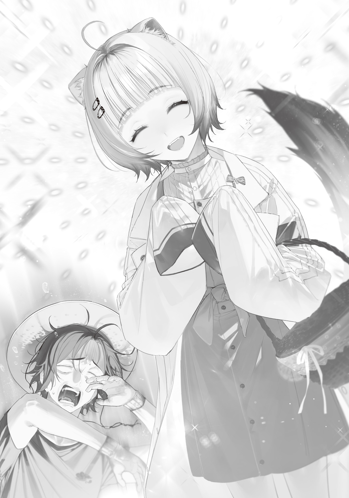

A year and a half earlier, the Shantak Meteor Shower had rained down on Earth, stripping humanity of electricity and handing it magic instead. That was what the world called the Gremlin Disaster.

Scientific civilization, built on electricity, collapsed almost overnight. Monsters, witches, and who knew what else sprouted up left and right, and the world became a crucible of chaos.

But time had passed, and the chaos melted down in that crucible was cooling, hardening, and starting to take shape.

Humanity had entered its reconstruction phase, learning to ride the chaos flung everywhere and pull new things out of it.

The two biggest symbols of that reconstruction were the defeat of the giant kaiju and the fertility-magic bypass incantation, which had headed off an unprecedented great famine. I was proud to have given magic wands to the witch and the stoat who pulled those off.

I'm an amazing Wand Maker. And that's not me being conceited.

I'm so amazing that a dragon kidnapped me and almost stashed me away in its nest as one of its treasures. Doesn't that mean I get to call myself a Living National Treasure?

My friend the Blue Witch had just rescued me from that bad dragon, and now she'd escorted me, along with the stuff she'd recovered from its nest, all the way back to Okutama.

She parked the cart in front of my house and helped me unload, pestering me the whole time.

“Look, won't you reconsider? There's a safer, more comfortable house in Ome. Come live there.”

“No. I like my life the way it is. I've got fields to look after, too. I'm staying in Okutama for good.”

“What will you do if you get kidnapped again? I taught the Dragon Witch a lesson, but there's no guarantee a stray dragon won't show up. Honestly, you were lucky it was only a kidnapping. I might not be able to protect you next time... Please, just stay where I can keep an eye on you.”

“No.”

“Ngh. Why won't Kei-chan or Ori let me protect them...!”

The Blue Witch groaned in frustration.

Probably because you all want to protect different things? Not that I'd know.

“Well, it'd be a huge help if you just dropped by now and then to check I'm okay. Don't worry about it so much. You showing up is what saved me this time, anyway. Actually, how'd you know I was locked up in the dragon's nest?”

“I went over to share some apples, and your house was wrecked. There were dragon tracks out front, and your rice harvest had been dropped halfway through. I knew right away what had happened, so I rushed straight to that piece of trash's nest.”

“Makes sense.”

Now that she mentions it, yeah, I did leave some pretty obvious clues. It was a seriously blatant kidnapping scene.

Thank god the culprit was an <ruby>idiot<rt>Dragon Witch</rt></ruby> with none of the cunning it takes to cover up a crime~!

“I'm worried, Ori. You were just kidnapped, and you've already got that slack look on your face. You're not taking danger seriously enough. You could at least move somewhere in Okutama closer to Ome...”

“Hey, I take danger seriously too. It's not like I haven't thought about countermeasures, okay? While I'm fixing the wall, I'm thinking of lining it with steel plates or something. And building a hidden room I can run and hide in. And next time, even if I lose my temper, I won't go picking a fight with a dragon.”

“You picked a fight with it!? You idiot! I told you to hide!”

The Blue Witch's worry gave way to anger.

Crap, that slipped out.

Okay, fine, I was careless there, and that part's on me. But I'd like her not to forget that the one most at fault is the Dragon Witch, and that nobody got hurt in the end (except the Dragon Witch).

The Blue Witch lectured me on self-defense for a good while, until she apparently noticed I was only pretending to listen and heaved a huge sigh.

“Honestly. You don't get that these are dangerous times, where no amount of caution is enough. Forget it. Fine. I'll think up some security measures on my end. I'm heading home for today, but lock up properly, and don't go out at night. If something feels dangerous, stay away from it and keep your head down.”

“Roger, Mom. Oh!!! Right, I almost forgot. Since we're friends now, wanna play a card game sometime? I've got decks at my place. I've only ever played online, but I went ahead and bought the paper cards too.”

Playing the Blue Witch sounds way more fun than running a fake match by myself and playing both sides.

I've never once wanted to make friends in my whole life, but I did always figure having some would be handy, since I'd never be short of someone to play against.

I'd called the Blue Witch back just as she was leaving, and she sounded thoroughly exasperated.

“More of your carefree nonsense... You don't mean regular playing cards, do you?”

“Hell no. Trading cards. A trading card game. If you don't know it, I'll teach you the rules.”

“Fine, I guess. See you tomorrow, then.”

The Blue Witch headed back to Ome, looking over her shoulder worriedly again and again.

Hmm, do I really seem that oblivious to danger? I don't get it.

I always carry Hendensho so I'm armed, I keep a compact first-aid kit with painkillers, disinfectant, and bandages in my pocket, I stay away from cliffs in the mountains, and I avoid the mountains and rivers the day after it rains. I'm actually being pretty careful here, you know.

Maybe our sense of danger is just calibrated differently. I live a peaceful life in Okutama, where the monsters are far fewer and weaker than in other areas and there's no messy people drama, while she's apparently lived through some seriously tragic past.

It hit me all over again how peaceful the Reiwa era[^1] had been. Then, as she'd told me, I locked up properly, threw a blue tarp over the broken wall as a stopgap, made a few odds and ends, ate dinner, and went to bed early instead of staying up late.

---

The next morning—well past noon.

I was back at the rice harvest when two visitors showed up.

The Blue Witch, in her usual ragged black robes and mask, and the stoat professor, in a stylish autumn outfit.

First things first, I waved the Blue Witch over and grilled her under my breath.

“Are you screwing with me? Why'd you bring her? If there's something you need, we can do it by letter!”

“So you can learn some defensive magic right now. You have a hard time picking up incantations when I send them written in phonetic symbols, don't you, Ori? Learning straight from Kei-chan is fastest.”

“Quit hitting me with facts.”

When I snuck a glance at Professor Ohinata, she flashed me a full-on extrovert smile as dazzling as the crisp, clear autumn sky and held up a basket giving off a warm, mouthwatering smell.

Gah! She's just a kid, and she still never forgets to bring a gift. What a good kid! But that only makes my stomach hurt worse. Talking to Professor Ohinata in human form feels like having all my own shortcomings rubbed in my face, and it stresses me out.

I mean, she's a good kid, she really is, but still. It's not that I dislike her, it's just that we don't click.

“Oh, right, before I forget. Wait a second.”

Before the impromptu magic lesson that was apparently about to start could wring my brain dry, I ducked back into the house, grabbed a picture frame, and came back out.

“Here. I made this picture frame to thank you for saving me yesterday. Use it if you want. Your little sister liked pink and kept a Java sparrow, right? I worked those into the design.”

I knew the Blue Witch carried her little sister's photos around in a mini album (the parts that probably showed her parents and childhood friend had been blacked out. Seriously dark).

That mini album was already pretty beat-up, so moving a photo into a frame and putting it on display seems like a solid idea to me.

When the Blue Witch took the picture frame from me, she went completely still. Right about when I was starting to wonder if someone had hit her with petrification magic, she spoke in a faint, trembling voice that almost disappeared.

“Thank you.”

“Huh. Wait, are you about to cry? Why?”

“Tch! Shut up. If you're going to be considerate, at least keep it up for five seconds.”

“S-Sorry. Talking with you, I let my guard down and stuff just slips out. If that's what a friend is, someone I can talk to this easily, then it's not half bad.”

“...What exactly are you trying to do to my emotions?”

The Blue Witch noticed Professor Ohinata beaming at our exchange and cleared her throat.

“Anyway, I've filled Kei-chan in. Have her teach you some magic to protect yourself. I'm going to make a round of Okutama and wipe out every monster nearby.”

With that, the Blue Witch hurried off into the mountains, Cyanos in hand.

That left me alone with Professor Ohinata, which I found plenty awkward, but she chatted away, friendly and completely at ease.

“It's been a while, Ori-san! We've been writing each other, but I'm so happy to see you in person again! I'm happy, but... talking to me is still tough for you, isn't it, Ori-san? I've picked out some spells that should be easy to learn and useful, so let's knock them out quick! The sooner you learn them, the sooner we're done. Let's do our best!”

Professor Ohinata clenched a fist in front of her chest to cheer me on.

Aaaah! Scary! That right there is the problem: how organized she is, how she thinks about my feelings, how cheerfully she's got my back! I'd rather she handled this in a cold, mechanical, businesslike way with zero humanity, but I can't just throw the professor's kindness back in her face. See, that's exactly what I mean (I'm losing it).

“Uh, okay, then, let's do it in the workshop again... No, wait, the workshop's wrecked right now. Is the living room okay for the lecture?”

“Sure. Thanks for having me. Oh, and here, these are hash browns, made with new potatoes. Have them for dinner or something!”

I put the finishing touches on the rice harvest, then took Professor Ohinata back to the house.

Hash browns taste better warm, so I snacked on them with a cup of hot water while the professor gave me a one-on-one lecture.

She started with a few intake questions, a list she'd written out on loose-leaf paper in one hand.

“Well then.

The magic we can learn today is limited by how much magic power you have.

Dealing with strong monsters takes strong magic, and strong magic consumes a lot of magic power. Spells that consume a lot of magic power are advanced and often contain unpronounceable sounds, though there are exceptions.

Today, let's learn one or two handy spells that don't contain any unpronounceable sounds and that you can cast with the magic power you have, Ori-san.

To do that, I need to know how much magic power you have. I've heard it's a lot, Ori-san, but what's that in shooting-magic-core-spell consecutive-use-count equivalents?”

“What's a what now?”

I couldn't keep up and asked her to say it again, so Professor Ohinata kindly put it another way.

“Um, how many times in a row can you cast the easiest spell? You know, the one where you yell <ruby>Agh-<rt>Fire</rt></ruby> and shoot out a white beam, like a screaming beaver.”

“Oh, that one. Hmm, come to think of it, I've never actually counted. How many... 50 or 60, maybe? I can fire <ruby>Do Vaa-ra<rt>Freezing Javelin</rt></ruby> three times. Four's too many.”

“Mm-hmm. Then anything past this point is probably out... You can just go with your gut, but which of these three would you like to learn: ‘familiar summoning,’ ‘creating Lost Mist,’ or ‘entering suspended animation’?”

“So really it's a choice between two. Is magic that puts you in suspended animation even useful?”

“It makes you harder for monsters, witches, and mages to detect, both with their five senses and with magic power. We don't know exactly how it works, though.”

“Okay, that's useful.”

If it's called suspended animation, I'm guessing you can't move, but for lying low until an enemy passes, it sounds super handy. Magic for the weak, for getting through without a fight.

“Still, familiar summoning is the one I'm most interested in.”

“Got it. Then let's learn familiar-summoning magic. Um, so, the incantation goes like this.”

On a blank sheet of loose-leaf, Professor Ohinata wrote out an ominous Japanese sentence in big letters, “<ruby>Yomohoroge Jyuya Taketatee Kunnu-mu Wa-a<rt>If it meant knowing my son was safe, I'd be willing to gouge out this eye</rt></ruby>,” added the pronunciation, and showed it to me.

Okay, that's scary.

“Hold on. Does this spell make you gouge out your own eye?”

“No, no gouging. It's fine. That's just what the incantation says. When you cast it, an eyeball familiar pops right out.

This familiar-summoning magic belongs to Eyeball Witch-san, and its core word is <ruby>Kunnu-mu<rt>Eyeball</rt></ruby>. Cast it, and one eyeball familiar appears that you can move around freely just by thinking about it. On top of sharing its vision, you can hear sounds through it and send your voice through it. Being able to fly is a big plus, too. Its maximum altitude is only about 10 m off the ground, though.

What makes this magic special is that once you've cast it, the familiar stays out until it's destroyed or you make it self-destruct. Your maximum magic power drops by however much you spent casting it, and that portion won't come back, but if Ao-san carried a familiar you'd summoned, for example, you could contact her and call for help anytime in an emergency.”

“So it's basically a video call.”

That's insane. Is she saying I can have my own communication device in a world where the power grid and communication networks got wiped out?

Sick! From the sound of it, I could use it for recon too. All the information advantage I could ever want!

“Exactly. It eats up a lot of magic power, so it's rare for a human to be able to use it, but I think you could manage summoning one, Ori-san.”

“Does this spell have a max range for calls? Like, past this point you lose signal?”

“Good question. The range seems to depend on your magic-power control skills. Eyeball Witch-san's is a 180 km radius, but when I used it, mine was 20 km. I think yours will be about the same, Ori-san.”

“20 km...”

I pulled out a map between bites of hash brown and checked: that range reached from Okutama to Ome. That's plenty.

“Also, it can carry things up to about 2 or 3 kg, and though it can't fight, it works as a decoy.”

“So it's a drone too. I'm learning this one.”

“Oh, you don't want to hear about the other spells? I'd recommend the Lost Mist spell myself.”

“Nah, I'm going with the eyeball. Any way you look at it, it's crazy useful.”

I also like that with enough of them, it might have the potential to bring back the internet and online shopping. This spell deserves to spread around the whole world. Though that'll be tough, since you can't use it without a lot of magic power.

“It really is super useful, isn't it? All right!

Then let's get practicing right away. Okay, say it with me, nice and loud!

<ruby>Yomohoroge Jiyuya Taketatee<rt>If it meant knowing my son was safe</rt></ruby>!”

“Yomohoroge Jyuya Taketatetat... Flubbed it.”

“Are you okay? Let's see, why don't you try saying it slowly at first? ‘Taketatee’ is an especially easy spot to get your tongue tangled, so let's focus on that part.

Okay, nice and slow, repeat after me! <ruby>Taketatee<rt>If I could know</rt></ruby>.”

“Taketatay-eh. No, that's not it. Taketatet, taketake... I'm about to snap.”

“C-Calm down...!”

With breaks in between, I spent half the day learning the eyeball-familiar spell.

During one of those breaks, Professor Ohinata told me what had become of Blood Moon, the red magic stone confiscated from the Dragon Witch. Under a will the Bloodsucking Mage had left with a lawyer, it was in the custody of the Tokyo Witches' Council for the time being.

Once magic-language research had progressed and ordinary people with lots of magic power and real combat ability had been trained up, the stone would go to one of them, on the condition that they protect Minato Ward.

Apparently the Bloodsucking Mage had felt that rule by witches and mages had its limits, and had been planning to make ordinary people stronger and, in the long run, bring them into politics.

Smart. Raise the baseline of humanity's skills and abilities as a whole, and people like the Dragon Witch, all power and a garbage personality, won't get to run wild.

Handing magic stones to ordinary people who've learned magic, to give them a leg up, makes way more sense than handing them to witches and mages who are already strong and making them even stronger.

I only found out about the Bloodsucking Mage after he died, but the more I learn about him, the more his stock goes up in my book.

Meanwhile, the Dragon Witch swiped the magic stone and stuffed it in her pocket against his will, so her stock keeps dropping, and she isn't even here.

I still think killing her would've been the better call. Then again, if the lesson doesn't stick and she pulls something else, the Blue Witch will probably go finish her off for real this time, no prompting from me needed.

Anyway, the magic-language research at Ohinata Laboratory, started by the Bloodsucking Mage and carried on by the Foresight Mage, was steadily bearing fruit.

I poked at the eyeball familiar bobbing in the air, which I'd finally managed to summon after endless pronunciation practice, and felt grateful for the will people had passed down from one to the next, and for everything it had achieved.

Me, I'll be reaching in from just outside the circle of human bonds and helping myself to the results!

## Translator Notes

[^1]: **Reiwa:** Japan's current imperial era, which began in 2019. Ori is looking back on the pre-disaster period.
