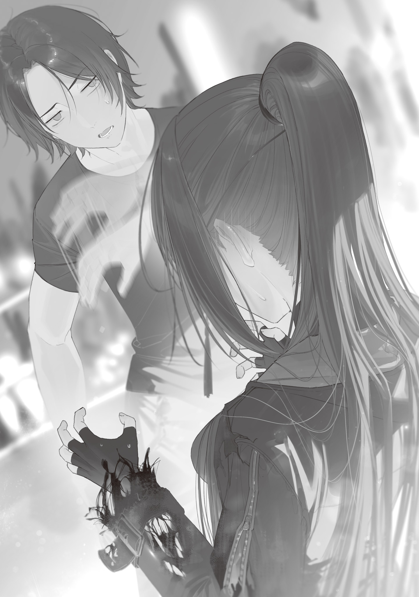

Standard mass-produced wands, made with the Handa-style manufacturing method, were slowly catching on as production lines came online one after another. They were the symbol of the mass-production route, the exact opposite of mine.

It had been less than half a year since standard magic-wand production started, and output was still only about 100 wands a day. At that rate, it would take roughly eighty years to get one to everyone living in and around Tokyo.

But every new production line added about ten wands to the daily output. The craftspeople were slowly getting better too, and production kept getting more efficient.

Since output would keep accelerating, it probably wouldn't be long before magic wands spread beyond Tokyo to all of Japan.

Tokyo had a good reconstruction cycle going.

Or rather, they'd managed to build one with the Witches' Council at its center.

According to the Dragon Witch, who flew all over the country and whose information was a little questionable, the Tokyo Metropolis run by the Tokyo Witches' Council was the largest of all the survivor communities and the furthest along in rebuilding.

The Eyeball Witch had run a statistical survey at the start of this fiscal year, and it put Tokyo's current population at about 2.8 million. Counting the whole greater Tokyo area, it came to 3.5 to 4 million, roughly 20% of what it had been at its peak.

Right after the Gremlin Disaster, they'd been desperately short of hands. Life in Tokyo had depended on enormous amounts of all kinds of supplies shipped in from outside, and when logistics stopped, that life collapsed.

People ate through their stockpiles, worked the fields with everything they had (without machines!), and cleared new land as fast as they could, while fishermen with nowhere else to turn lined the docks. Even sparrows and pigeons became precious food. They also made the rounds of nearby cities, gathering up food from places monsters had wiped out.

Even so, nobody got enough nutrition, and the people of Tokyo slowly grew thinner.

With the water supply cut off, they had to walk a long way to the river every day to fetch water, and tearing down abandoned houses for firewood took time and effort. Someone always had to watch the fire (a fire in central Tokyo would be no joke. There were no fire trucks!), and whenever a monster showed up, people dropped everything and fought for their lives until a witch or mage arrived.

Everyone in Tokyo was scrambling just to make it through each day, with no energy to spare for tomorrow, let alone for reconstruction.

I knew those early hardships firsthand, too.

Most of each day went to gathering food and fuel, and even then it wasn't enough. Life was so precarious that it made me anxious even with all the countryside's supplies to myself.

In those brutal days, when people kept falling behind and dying, a handful of people led by the Bloodsucking Mage had somehow forced out enough slack to invest in the future. They deserved real credit for that.

That small, fragile hope for the future bore fruit when Professor Ohinata got the fertility-magic bypass incantation to work.

Fertility magic more than doubled farm yields, which freed up the people who'd been stuck doing farm work for other jobs.

Those spare hands could then put in a simple water system.

And once the water system was in, the people who'd been hauling water were freed up too.

The number of people who could work for tomorrow, instead of just surviving today, exploded.

That was how they could found a university, something nobody needed if all they cared about was surviving the day, and keep building magic-wand workshops one after another and staffing them with craftspeople and apprentices.

The fertility-magic bypass incantation had been the first spark, and the chain reaction it set off had worked beautifully, creating a virtuous cycle.

Well, most of what I knew about this came secondhand from the Blue Witch and Professor Ohinata. I hadn't actually been in the middle of the dramatic reconstruction (I had only pitched in here and there from the safe, peaceful countryside), so I couldn't say how closely what I'd heard matched reality.

The giant Gremlin that landed in my lap that day was another product of that chain reaction.

When the Blue Witch took down the giant kaiju a while back, she left behind a huge, thick glacier that swallowed an entire city, and only magical fire could melt it.

So the Flame Witch had been chipping away at it every day. Then ordinary people started learning fire magic, and once standard mass-produced magic wands began to spread, the thawing sped up. A job originally expected to take three years was finished in two and a half.

Amazing.

But what the hell is up with the Blue Witch, making a glacier in one shot that takes two and a half years to thaw? Are you some kind of bug in the world or what?

Even with the thawing done, it sounded like there were still plenty of headaches left, like relocating the residents, and apparently there had been a whole squabble over the giant kaiju's corpse too.

First off, the Dragon Witch took the mountain of raw kaiju meat.

Most monster meat wasn't fit for people to eat; it upset human stomachs. Witches and mages could eat it just fine, though, so the Dragon Witch—who had dropped by to sneak a few bites and had literally acquired a taste for it—took over disposing of all of it. Apparently she smoked whatever she couldn't eat raw with her fire breath, all in one go.

It bugged me a little, but all's well that ends well. If disposing of that much inedible meat had dragged on, it would have rotted in no time and turned into a breeding ground for disease. Even she was useful once in a while.

Everything besides the meat, though, turned into a fight.

The kaiju's tough scales, which half-baked magic couldn't even budge, started deteriorating fast once they were thawed out and removed and their magic power drained away, but they were still useful. The sturdy bones that had held up its giant body were valuable resources too, and the two 80 mm giant Gremlins taken from its tail and chest were priceless.

The residents of Hamura City, where the kaiju had died, claimed ownership along with their administrator, the Tobacco Witch. The Blue Witch showed interest too, and the Flame Witch and the Hachioji Witch, who had put their lives on the line to hold the kaiju back, demanded their cut. Then the Setagaya Witch, who had run from the kaiju partway through, had the gall to join the scramble, and things descended into total chaos.

In the end, the Eyeball Witch stepped in to mediate, and they agreed to split everything fairly.

Of course, then they fought over what “fair” meant (By contribution? How do you measure contribution? An even split per witch?), and apparently it got to the point where the Blue Witch almost leveled Cyanos. Scary. I'd never want to sit in on a meeting like that. Even with ten stomachs, every one of them would give out.

Sure, the fallout from her magic had frozen an entire city solid and killed several dozen residents who hadn't gotten out in time, but the Blue Witch was still the one who finally took the kaiju down.

It also counted for a lot that, by a conservative estimate, tens of thousands more people would have died if she hadn't beaten it. In the end, she walked off with both giant Gremlins as her share.

When Professor Ohinata begged, she handed one over to Tokyo Magic University just like that, and it became perfect material for joint research between the Department of Monster Studies and the Department of Gremlin Engineering.

And the other one ended up with me.

I set the giant Gremlin on a stand in my home workshop and looked it over from every angle, admiring it.

“So biiig... 80 mm, was it? It's no magic stone, but it's still pretty. Man, this is nice.”

“You like it, then. Want to push the board game to tomorrow?”

“Hm? Oh, yeah. Wait, is it really okay for me to have this? It was your share, right?”

“It'd just sit around if I kept it. I have Cyanos. I only got it because I figured you'd want it, Ori.”

“Seriously? Let's be friends forever! Friends are the best!”

“You're way too easily bought...”

The Blue Witch sounded fed up, but I meant every word.

I'd figured I would go my whole life without ever understanding what friends were for, but now that I actually had one, it wasn't bad.

Or was I wrong about that? This happy feeling I couldn't quite put into words, something beyond just getting my hands on something expensive—maybe it wasn't because she was my friend. Maybe it was because she was the Blue Witch?

With only one friend, I had no way of telling.

The Blue Witch went home, leaving behind a two-player board game she said she'd dug out of the ruins, and I turned my full attention back to the giant Gremlin.

Until now, the biggest Gremlins on record were 28 mm-class electricity-derived ones found at power plants around the country, and 40 mm-class monster-derived ones.

This one, on the other hand, was 80 mm. A whopper that smashed the old record.

Like all monster-derived Gremlins, it was close to spherical even unprocessed, and it had color. Its distinctive bluish white looked like ice, and when the light hit it from another angle, it looked like the blue of a scorching-hot flame.

Hmmmm. Beautiful.

I could polish it up and put it on display. Next to Okutameteorite, the sacred object of my magic-wand workshop, it would look amazing.

But a Gremlin this big would also let me try all sorts of processing methods that size limits had always ruled out.

What to do... Talk about a luxury problem.

I spent the whole night zoning out in front of the giant Gremlin, torn, but in the end I decided to use it for processing experiments.

Decorating the workshop with it was tempting, but Tokyo Magic University was using theirs for research, and it spooked me a little to think I might fall behind on technique if I got too relaxed about my hobby. Professor Handa's research team was seriously no joke.

If both giant Gremlins had been mine, I could have displayed one and experimented on the other. Oh well, that's how it goes.

Specifically, I'd use the giant Gremlin to push research on Moebius processing, the hottest topic going, even further.

Moebius processing ran deep. It was worth spending a giant Gremlin on, and some experiments could only be done with one.

The key point was that an incantation behaved differently depending on which Gremlin you cast it with.

The behavior broke down like this.

① Using magic with a normal-shaped Gremlin

・Two unrelated people using magic with one Gremlin at the same time → only one activated. The other one failed.

・Twins using magic with one Gremlin at the same time → both activated, but abnormal vibration occurred.

② Using magic with a Moebius ring Gremlin

・Two unrelated people using magic with one Gremlin at the same time → both activated at the same time.

・Twins using magic with one Gremlin at the same time → both activated at the same time.

In short, a Moebius ring was a magically stable shape, special in that it could process two spells at once. It didn't amplify magic or weaken it; it put magic out at exactly 1.00 times the power.

But the principle went further than that.

It had to do with twins casting the same spell into a Moebius ring Gremlin at the same time.

In that case, the magic-power cost got split between them.

Let's take a case that had actually been tested and confirmed: the freezing-magic core spell “<ruby>Vaa-ra<rt>Freeze</rt></ruby>.”

When twins held a Moebius ring Gremlin together and both said “<ruby>Vaa-ra<rt>Freeze</rt></ruby>” at the same moment, only one freezing beam came out, with the power and magic-power cost of a single casting by one person.

However, the twins split that cost in half.

Effectively, the two of them had teamed up to cast one spell, and each could cast it for half the magic power.

They had also run the experiment with triplets, and in that case a single spell activated for one-third of the magic power per person.

They hadn't been able to test quadruplets or more because they couldn't find any, but the twin and triplet results alone were more than enough to guess what was going on.

In theory, hundred-tuplets could split the magic-power cost a hundred ways.

Some powerful magic was technically castable by humans but cost so much magic power that it was effectively reserved for witches and mages. With this method, people could share the cost and cast it together.

In fact, one pair of twins had reportedly pulled off a spell neither of them had the magic power to cast alone, using this cooperative incantation that Professor Ohinata called a “chorus.”

Very, very interesting.

Magic that two people cast by matching their voices and combining their power! Cool as hell! And practical too!

The catch was that their voices had to match perfectly.

Because of that restriction, only exceptions like twins, triplets, and the Hell Witch could use a “chorus.”

That was still amazing, but I wanted to see a hundred people join in one massive chorus and set off some huge spell.

So I came up with a plan to use the giant Gremlin to get rid of the chorus restriction.

Unrelated people can't do a “chorus”?

Only twins can do a “chorus”?

Then I'll just make the Gremlins into twins!

The Blue Witch had told me once, a long time ago, that all Gremlins were related, parent and child, born from an original magic stone.

And if there are parents and children, why not twins?

Making twin Gremlins was simple.

Carve several perfectly identical Moebius rings out of one giant Gremlin.

The same finished piece, carved out of the same lump.

That should count as twins.

I had no real basis for thinking this twin-Gremlin processing would succeed.

It could easily flop, but I had a hunch it might pan out. That's what experiments are for.

I wasn't a professor, so I couldn't lay out the theory step by step.

It was the gut instinct of the Wand Maker with the most Gremlin-processing experience in the world, the same hunch that tells you a part will slot in right there. I just had a feeling this method was going to work.

I spent nearly a month carving twelve perfectly identical Moebius rings out of the 80 mm Gremlin, plus one slightly larger Moebius ring for comparison.

To get a 100% shape match, I worked slower than a snail, taking a ridiculous amount of time and care, and concentrated so hard I thought my eyes might start bleeding.

At one point I got a nosebleed from concentrating to the absolute limit, and before I knew it, my chin and lap were covered in blood.

But thanks to that, I didn't make a single mistake, and I was sure the precision had hit the theoretical limit of what I could do.

If there was any error in the processing at all, it couldn't possibly be 1.0 micron or more.

It was a masterpiece. Even real twins wouldn't look this alike.

After finishing the 12+1 Moebius rings, I slept like the dead for three whole days, dragged myself up like a dying turtle, listlessly munched on hardtack, and spaced out for about half a day before I could finally function again. Then I called the Blue Witch over through an eyeball familiar.

The processing was done. All that was left was the experiment: would they actually work the way I expected?

A while later, the Blue Witch made it through the Lost Mist. She took one look at my face at the front door and frowned with worry. “Ori, aren't you looking a little worn out?”

“N... No? Probably?”

“You said you'd be concentrating for a while. You did eat, right?”

“I'd be dead if I'd fasted for a month. Enough about that. Come on, get in here and help me with the experiment.”

I brought the Blue Witch into my workshop, showed her the Moebius rings I'd made, and explained what I expected to happen.

She turned one of the twelve perfectly identical Gremlins over in her hand and tilted her head.

“So I hold this, you hold another twin Gremlin, and I do a chorus with you?”

“Yeah. But let's call it ritual magic instead of a chorus. I've been thinking about it, and that sounds way cooler, right?”

“...? Well, if that's what you want to call it, Ori, fine. I get your prediction that if the two of us do ritual magic, the magic-power cost will be split in half. But where does the magic come out? Which ring does it come from? Somewhere between the two?”

“Huh? Uh, who knows? I didn't think about that at all.”

I'd been so focused on whether twin Gremlins could make ritual magic work that I hadn't given that part a single thought.

Eh, it's fine, it's fine. We'll find out when we try it.

The Blue Witch sighed.

“This is exactly what I mean when I say you have no sense of danger. What if it goes off wrong? Just to be safe, let's point our Gremlins in different directions when we cast.”

“Okay, let's do that. We'll use ‘<ruby>Vaa-ra<rt>Freeze</rt></ruby>.’ On one, two, three, okay? Picture casting right after you say the ‘ee’ in ‘three.’”

The Blue Witch nodded and aimed her Gremlin somewhere it couldn't possibly hit me.

I aimed mine somewhere it couldn't possibly hit the Blue Witch either.

Then we cast the spell.

“One, two, three! ‘<ruby>Vaa-ra<rt>Freeze</rt></ruby>’!”

We knew right away that the experiment had worked.

The Moebius rings in both our hands glowed gold, but only one spell went off.

And that spell came shooting out of the larger comparison ring I'd hung on the wall.

I was stunned.

That one!? I didn't see that coming!

Of all places, the freezing beam was headed straight for the Blue Witch, and on reflex I jumped in front of her to shield her with my back.

“Gah!? C-cold! Eeek!”

The freezing beam hit me square in the chest, and I shook with cold.

It was like I'd jumped into an ice bath. I'm gonna freeze, I'm gonna freeze! Cold! So freaking cold!

While I was rubbing my goosebumped skin and stamping my feet, a hand grabbed my shoulder hard from behind and spun me around to face the Blue Witch.

“Hey! What were you thinking!?”

The Blue Witch was livid. Sh-she's super mad!

I put my hands up and backed away.

“I-I mean, how could anyone know? No one could've predicted the magic would come out of that ring! Going by twin theory, that one probably gets recognized as the eldest of a set of thirteen-tuplets, so the magic power gathered from the twelve smaller Moebius rings converged on the slightly bigger eldest-brother ring, and—”

I tried to explain my theory and plead my innocence, but the Blue Witch cut me off and blew up at me.

“That's not the point! Why did you shield me? What if you'd died!? I'll kill you! You idiot!”

“No, no, I wasn't trying to shield you! Seriously, not even a little! The freezing beam came out of nowhere and startled me! My body just moved on its own!”

As I scrambled to explain, all the force suddenly drained out of the Blue Witch's voice.

“...You shielded me on reflex? Without thinking?”

“Yeah. Sorry, okay!”

That was seriously dumb of me. The Blue Witch had a natural resistance to cold, so if it had hit her, she'd have been fine.

When I apologized, the Blue Witch went quiet. She'd gone completely still, so I waved a hand in front of her mask, but got no reaction.

“Sh-she's dead...!”

“Alive. But. Going home. Now.”

“Huh? What about the rest of the experiment?”

“Tomorrow.”

When she finally did move, it was to head home, talking and moving all stiff and jerky.

And the bit of ear I glimpsed between her mask and her hair had gone red. Maybe she's coming down with a cold...?

I wasn't dense enough to actually think that.

Oh, I could tell.

The Blue Witch had been embarrassed! So embarrassed her ears turned red!

But about what?

What was there to be embarrassed about? It made no sense.

Well, her sense of things was every bit as quirky as mine, so something must have embarrassed her. Some days are like that.

Anyway, thanks to the Blue Witch's help, I'd confirmed the experiment worked.

Now all I had to do was coat these 12+1 twin Moebius rings with resin so they wouldn't get scratched and send them to Professor Ohinata.

And then I'd gloat.

Well? Bet your university can't copy these twin Gremlins.

I'm gonna keep cranking out artifacts no ordinary person could make!

Wahahahaha!
