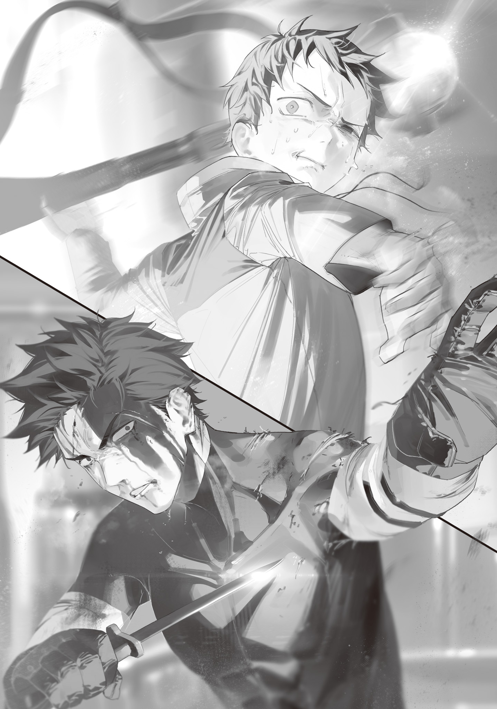

Dareda Kimi was your average adult male, burned out of Minato Ward and now living in Shibuya Ward.

Through middle school, Dareda had been on the track team. He loved running and was the outdoorsy type, the kind of kid who went jogging with his father even on days without practice.

Then, in his third year of middle school, a traffic accident left him with complex fractures in both legs. Surgery got him walking again, but he could never run the way he used to.

Heartbroken, Dareda consoled himself with videos of the World Athletics Championships.

He couldn't run anymore, but studying running form made him feel like he was still part of that world, just on the far edge of it.

The more World Athletics videos he watched, the more his interests drifted.

At first he watched only sprints and middle-distance races, but then he started on marathons too.

After marathons came triathlons.

Triathlons got him watching swimming, then cycling, then stunt biking, then movie stunts, until he'd fallen headfirst into the world of movies.

One interest led to the next, and after a lot of twists and turns, the once-outdoorsy Dareda had turned into a full-fledged fantasy-movie fanatic.

That fantasy-movie fanatic grew up, and when the Gremlin Disaster struck, he got his hopes up. It wasn't something he could ever tell anyone.

Every electronic device had been wiped out, and in the middle of a catastrophe on a scale no one had ever seen, even laughing out loud felt wrong. But monsters and witches had appeared. Magic had appeared.

Was it really so bad to get excited about healing magic, to think it might magically fix the legs modern medicine hadn't been able to?

Not that he could ever say out loud that magic was wonderful and full of hope, not while he watched people die from that very magic, the magic monsters used.

Dareda took a keen interest in the magic the disaster had brought into the world.

He applied to the Minato Ward Civilian Guard and was assigned as a shooter (because of his bad legs). From then on, he sketched every monster he ran into without fail and wrote down everything in detail: its traits, the magic it used, when and where it appeared, how the fight went.

His fellow guards fought monsters for their lives, putting their bodies on the line until the Bloodsucking Mage, who was in charge of Minato Ward, could arrive. Dareda was a rear guard with a crossbow, so he had it easier than the front line, easy enough to pull out a notebook after a fight. Naturally, he sketched and took analytical notes on the Bloodsucking Mage too.

When a giant kaiju came ashore from Tokyo Bay and burned him out of Minato Ward, Dareda still sketched it and took down data on it.

Since he'd been collecting data instead of just getting through each day's work, he soon noticed something: the Blue Witch's magic, which had killed the giant kaiju in one blow, was abnormally powerful.

Most Tokyo residents feared her even as they praised her. “That's the Blue Witch for you,” they said. “She's the strongest witch there is.” But Dareda had been collecting data on mages and witches as well as monsters, and something about it felt off.

Witches and mages were not invincible.

They could struggle against a powerful monster. They could be beaten and forced to retreat.

Magic had its limits too.

It was only a gut feeling, but judging from the scale of the damage, the Blue Witch's magic seemed to go past the limits of any witch.

Dareda had evacuated to Shibuya Ward, the Eyeball Witch's territory. He kept working for the guard there and kept digging, and eventually he learned about something called Blue Wand Cyanos.

Anyone in the know had heard of magic stones, the mysterious treasures that amplified the power of magic.

The Bloodsucking Mage had carried his own magic stone, Blood Moon, around without making any effort to hide it, and magic stones had been one of the big things fought over in the Iruma coup.

From what little he could piece together from eyewitness accounts of the Blue Witch, Cyanos seemed to be some kind of tool built around a magic stone. Had someone stuck a magic stone on a stick to make it easier to carry around? He couldn't tell.

The Blue Witch's magic had been off the charts during the Iruma coup too, but even allowing for a magic stone, this giant-kaiju kill was abnormal.

There was some secret to it. Maybe if he got his hands on Cyanos, even he could use magic? It was the kind of thing that tempted a person into baseless hopes like that.

Once, Dareda snuck a pair of binoculars out of the Civilian Guard's supplies and went to scout Ome.

After staking out the city from outside its limits for half a day, he managed to catch the Blue Witch running across the rooftops on patrol. Then she looked straight at him through the binoculars, and he fled in a panic.

He couldn't risk getting on her bad side and getting killed for it.

He'd confirmed that she carried a beautiful wand with a blue gemstone set into it, but he hadn't had the chance to get a closer look. Investigating the Blue Witch was too dangerous, so Dareda gave up and went back to his usual Civilian Guard duties.

About half a year later, word went out across Tokyo that a magic university was opening in Bunkyo Ward.

A magic university!

Of course, Dareda jumped at it.

Only an idiot would let a wave like this pass him by, not when anyone admitted was promised lessons in magic. Some people were thrilled at the thought of becoming like the witches and mages, while others signed up for the exam because students were excused from work.

Dareda was in the first group. He failed anyway, flat out, and was crushed.

He passed the articulation test and put up an excellent score on the magic-power test, but he flunked the intelligence test.

A guy who'd joined the guard at the same time as him, and who was definitely smarter than Dareda (he'd gone to a national university), had failed too. So it wasn't that Dareda was stupid. Tokyo Magic University's standards were just too high.

Only a handful of truly exceptional people could get into the Magic University.

The rejection sank Dareda into despair, but he couldn't let it go, and he kept gathering information about the Magic University anyway.

Ohinata Kei, president of Tokyo Magic University, genius girl of the century, professor of magic linguistics, and someone with close ties to the Blue Witch, carried an overblown wand called the dodecahedral fractal wand Aleister.

She always had dedicated security discreetly nearby, and they never let anyone suspicious get close, so Dareda dug up what he could about Aleister secondhand from university students.

Aleister was a different kind of magic wand from Cyanos, with a dodecahedral fractal core, just like its name said.

Dareda's guess was that Aleister was a wand built around some special magic stone.

Pyrite was famous for forming natural crystals in neat, perfect cubes. Make it a magic stone, and it could surely grow into a fractal on its own.

Some people said someone had made it, but to Dareda, that was ignorant nonsense from people who had no idea what an artisan's work was like. Gremlin processing was extremely difficult. In a world where precision machinery had broken down and could no longer be used, who could carve out the intricate fractal he had heard about? No artisan capable of that existed.

On top of his daily guard work, Dareda researched wands, witches and mages, and monsters, all while studying for the next Magic University entrance exam.

His days were packed.

But all that effort didn't pay off.

Dareda failed the entrance exam the next year, and the year after that too.

That second one had been especially close.

Up to the year before, the Magic University had only had one department, the Department of Magic Linguistics. That year it was adding four more, the Department of Gremlin Engineering, the Department of Monster Studies, the Department of Mutation Studies, and the Department of Combat Studies, and it was recruiting professors as well as students.

Dareda went for a professorship in the Department of Combat Studies on the strength of his Civilian Guard experience, and for one in the Department of Monster Studies on the strength of the monster data he'd painstakingly compiled on his own. Both times, he lost to someone who was basically an upgraded version of him.

The Combat Studies professorship went to a genius who wasn't just skilled with a staff and a gun, but had taught himself to copy a witch's magic and actually use it. The man who got the Monster Studies job hadn't just collected monster data like Dareda had. He'd organized it statistically and worked out a system for classifying monsters by type.

Compared to most people, who were struggling just to get through each day's work, Dareda had thought he'd put a lot into his own research. But there was always someone better.

Dareda was on the capable side himself.

But he was still one step short of getting through the Magic University's narrow gate.

Nothing seemed to go right for him. Then, eight months after his last rejection letter, his big break came.

Dareda had failed the Magic University entrance exam three times and its professor selection twice in total, but the university had kept his personal information on file from the applications.

On the strength of his large magic-power reserves and his Minato Ward roots, the Witches' Council itself asked him to take part in the Minato Ward Recapture Operation.

Dareda was stunned.

Before the Gremlin Disaster, it would have been like an amateur zoologist suddenly being called up by the Japanese government for a top-secret operation.

Of course, he said yes on the spot.

Half wondering if it was some kind of prank, he passed through the gates of the Tokyo Magic University he'd admired for so long. In a conference room on campus, he found others who'd been called in just like him.

Some of them looked uneasy. Others were fired up, sure the time had finally come to take Minato Ward back from the monsters' clutches.

Once the seats had filled, the last person walked in: a cute beastkin girl with white fur.

She dragged a step stool over from the corner, hopped up onto it behind the lectern, and bowed with a warm smile.

“Hello, everyone! Thank you for coming today on such short notice. I'm Ohinata Kei, and I have the honor of serving as president of this university. At the request of the Tokyo Witches' Council, I have been entrusted with teaching you ritual magic for this operation.”

According to Professor Ohinata, the recapture of Minato Ward had been in the works for a long time, and they finally had all the cards they needed.

Minato Ward, once ruled by the great Bloodsucking Mage, had been burned to the ground by the giant kaiju's rampage.

Ideally, another witch would have taken over the ward from the dead Bloodsucking Mage, but the Witches' Council was stretched to its limit. Its members were already covering as much ground as they possibly could, and there was no one left to look after Minato Ward.

Even the Eyeball Witch, who controlled over a hundred familiars at will, kept watch over one of the widest areas of anyone on the Witches' Council, and ran six wards, had no room for a seventh.

With no one in charge, Minato Ward quickly turned into a monster nest.

The Itabashi Witch, who often went out on roving duty for the Witches' Council, thinned them out on a regular basis. But she also had to do regular culls in the other empty areas, like Katsushika Ward, Ota Ward, western Hachioji, and Inagi City, and on top of that, she'd taken on the job of driving back monsters coming in from Chiba and Saitama. She was run off her feet. There was no way she could focus on Minato Ward alone.

Even if a witch went all out and wiped out the monsters for a while, there was no way to keep the ward clear.

But the situation had changed.

This wasn't two and a half years ago, when they'd had no choice but to flee Minato Ward and could only watch, helpless, as the monsters took it over.

Research by the Department of Magic Linguistics had given ordinary humans more combat-ready spells they could cast.

Research by the Department of Gremlin Engineering had turned out enough standard magic wands to go around the whole Minato Ward Civilian Guard.

Research by the Department of Monster Studies had produced a draft field manual that ranked monsters by danger level and listed their traits and weaknesses.

Several wizards trained in the Department of Combat Studies volunteered for the recapture operation.

The Tokyo Witches' Council judged that the time was ripe.

Here was the plan.

A wizard carrying a wand made from Blood Moon, the magic stone the Bloodsucking Mage had left behind, would lead the charge, and they would take the center of Minato Ward in one lightning strike.

They would turn the ruins of Tokyo Tower into a watchtower and station a ritual magic group on it. From that high ground, they would watch the whole ward and curse every monster in sight to death with ritual magic, one after another.

Even after Minato Ward was under control, ritual magic from the watchtower would be the heart of its monster watch-and-response system.

“This blood wand Vampir, which uses Blood Moon, is the first magic-stone wand manufactured by our university. In terms of performance, it falls far short of Blue Wand Cyanos, but we outsourced only the final polishing, and its core is a perfect sphere. We did no internal multilayering, so that it can be upgraded as new processing techniques are discovered and developed.

“Blood wand Vampir comes from Minato Ward's past. It will make its debut in battle in the present, with the recapture of Minato Ward, and it will be carried on into the future.

“Kyogoku Yamato-san, top-ranked student of the Department of Combat Studies. Please come forward.”

A huge, muscle-bound man stepped up to receive blood wand Vampir, and the conference room broke into loud applause.

Next, thirteen people, Dareda among them, were each handed a wand with a twisted ring of pale-blue gemstone attached.

“The Thirteen Ritual Implements I have just handed to you are specially made wands required for humans to use ritual magic, which consumes a great deal of magic power. The cores are covered in protective material, but they are very delicate, so please handle them carefully.

“With the focus wand I gave Kobayashi-san at the center, the thirteen of you can split the magic-power cost between you and cast one great spell.”

Professor Ohinata drew diagrams on the blackboard and lectured them on how to use ritual magic.

The spell went wherever the focus-wand holder aimed it, so Dareda's job was basically to be a magic-power tank.

That suited him fine. He was a washout who'd failed to get into the Magic University again and again, but if he could wield magic as part of the force retaking Minato Ward, he didn't mind one bit not being the star.

“You said our role would be to curse monsters to death, but what exactly is death-curse magic?”

When Dareda raised his hand and asked, Professor Ohinata tapped her pointer against her palm and answered gravely.

“Good question. Death-curse magic is the magic of the Koganei Witch, who died early in the Gremlin Disaster. A professor in the Department of Mutation Studies who has absolute pitch happened to hear her magic and remembered it, so our university has a record of exactly one curse spell: death-curse magic.

“Death-curse magic consumes a great deal of magic power, but it can curse any target in sight to death. If a target has less magic power than the amount consumed, they die instantly.”

The conference room stirred at Professor Ohinata's words.

Plenty of magic was outrageous, but this death-curse magic was in a league of its own.

The professor waited for the murmuring to die down, then went on.

“However, if the death curse fails, it rebounds on you. That can happen if the target has more magic power than the amount consumed, or if they use magic-power control to deflect the curse.

“In that case, the person using the magic dies from severe feedback. Even with a backlash-prevention mechanism to reduce it, we can't guarantee you'll survive.

“When we asked you here, we warned you that we couldn't guarantee you'd survive. Part of that is the risk of dying in battle against monsters, but this feedback is a big part of it too.

“Please use the monster classification table. Do not attempt to use death-curse magic on monsters whose magic power is too great. Request help from a witch or mage instead.”

The conference room went silent for a while. Eventually, a few people withdrew.

Getting killed fighting monsters was one thing, they said, but they weren't going to die blowing themselves up.

Fair enough. Honestly, Dareda wanted to back out too.

Dying in a fight he could accept, but if he misjudged a monster's magic power and dropped dead like an idiot, he'd never rest in peace.

Then again, that was exactly the kind of mistake the monster classification table was there to prevent. After a lot of agonizing, Dareda kept his butt in his seat. Someone had to put their life on the line to do this job, and Dareda chose to look on the bright side: he was qualified to be that “someone.”

Ritual magic was expected to be cast several times a day, so there were nearly forty magic-power tanks in all. A few had dropped out, but the recapture operation was going ahead.

Dareda and the others learned the death-curse magic incantation and drilled hard on ritual magic and teamwork. Two months later, amid a grand sendoff from the former Minato Ward residents who had gathered at the Magic University, they set out on the Minato Ward Recapture Operation.

The abandoned cars that had once choked the city center had long since been cleared, so the roads were open to bicycles. The operation unit rode in single file and before long reached the edge of Minato Ward.

With the burned-out ruins and the sun at his back, Kyogoku Yamato, field commander of the recapture operation, raised blood wand Vampir and gave a short speech.

“Everyone! We're back! We've come back to Minato Ward! Each of you must have your own feelings about this! Some of you may have none at all and be here simply because it's your job! But today, at this very moment, we unite under one goal!”

Kyogoku broke off, turned on his heel, and shouted.

“We're taking Minato Ward back from the monsters! Operation, begin!!”

A roar of battle cries went up, and the recapture operation began.

As planned, they drove for the center at lightning speed. If they took their time clearing out every monster and stamping out every threat along the way, they would run out of magic power.

Keeping only a bare-minimum watch, the unit hurried along National Route 1 toward Tokyo Tower.

Luckily, their enemies weren't human, so there were no traps to worry about. When monsters lay in wait, the unit simply outran the slow ones. Anything they couldn't shake, the wizards took down fast with concentrated fire from their magic wands.

If a monster that was too strong blocked their path, the plan was to go around it or turn back. Luckily, there were none like that along National Route 1, which meant the second unit coming up behind them could set up a supply route without any trouble.

A few members had to drop out along the way, some after tripping on rubble and spraining an ankle, others after monsters burst out of the ground at them. But the group reached the foot of Tokyo Tower in just under an hour, right on schedule.

They took a short break in a kiosk that had survived the fire, with a view of Tokyo Tower, and Kyogoku, their captain, praised Dareda and the rest for their work.

“Good work, all of you. All that's left is to climb the tower, take the high ground, and put the ritual magic unit in position.

“Once we can fire death-curse magic in every direction from up high with a clear view, Minato Ward is as good as ours again.”

“But, Captain...”

“Yeah. The question is whether we can make it all the way up the tower.”

Kyogoku nodded at the unit member's words and peered out the kiosk window.

Tokyo Tower had become a monster nest.

Human-sized cocoons clung all over it, and packs of bizarre monsters, like some misshapen cross between a beast and a mantis, were tending to them.

These monsters hadn't been there the last time the Itabashi Witch swept the area. They must have moved in and spread after she left.

“Captain, excluding the cocoons, there are 16 beast mantises. No other monsters are in sight.”

“I checked the monster classification table. They're a chimera type, a mix of two kinds, beast and insect, so I'd put their danger level somewhere between here and here.”

“I see... We can't take them all on at once. I want our best long-range magic shooters to snipe them. If we drop or weaken four or five of them right off the bat, the fight gets a lot easier.”

Dareda was sitting in a kiosk chair, listening to the captain and the others plan their attack, when he picked up a faint noise.

It was a tiny sound, but something about it nagged at him. He looked out the window just in time to see a beast mantis that had crept up from the roof take the head off the unit member standing guard.

Dareda's heart leapt into his throat, and he screamed.

“Enemy attack! The guard's down! One monster or more on the roof!”

He was on the verge of panic, but he still managed to call out an accurate situation report on the spot. That had to be the two months of training paying off.

Not everyone could react the way Dareda had, though. Two beast mantises smashed through the kiosk window and tumbled inside, and the resting unit was thrown into complete disarray.

Captain Kyogoku moved like the captain he was. He shouted to get everyone under control and swung blood wand Vampir toward the beast mantises.

But the mantis was faster. It fired a spray of spikes from its rear end at the unit.

Most of the spikes hit no one and stuck in the kiosk walls, but one of them was a freak unlucky shot.

Of all things, it knocked Vampir out of Kyogoku's hand and sent it flying out the broken window.

Worse, the wand rolled right to the feet of an especially big, flashy rainbow-colored beast mantis that had been creeping closer from Tokyo Tower.

The rainbow beast mantis stopped its many legs, cocked its head the way insects do, and eyed the wand that had literally rolled into its lap.

Kyogoku stood dumbfounded at a disaster that felt like a lifetime's worth of bad luck hitting all at once, and for a moment, his eyes met Dareda's.

The next instant, a charging beast mantis slammed its huge body into Kyogoku and pinned him to the floor.

Things had spiraled completely out of control.

The kiosk was bedlam, and no one could attack the beast mantises properly for fear of hitting each other. Blood sprayed, and screams echoed. The captain they were counting on had lost his trump card and was pinned under a beast mantis, and that crucial trump card was lying at the enemy's feet.

The confusion and terror were enough to drive anyone mad, and inside Dareda's head, he thought he heard something snap.

In that instant, his mind went clearer than it had ever been.

Dareda made a split-second call he probably could never make again. He snatched the focus wand from Kobayashi, who was floundering nearby, shoved his own wand into Kobayashi's hands, and ran for the exit.

“Ritual magic, get ready! Origin, Dareda! Count 3, 2, 1!!”

His shout was nearly a scream as he kicked the kiosk door open and burst outside.

“<ruby>Nato Yau-e<rt>I love you</rt></ruby>”

Dareda ran.

For the first time in ten years, he ran with everything he had.

His body had gone completely rusty, but he still remembered the form.

The incantation he'd repeated hundreds, thousands of times until it was second nature spilled from his lips, and behind him, he could hear everyone reciting the same words.

“<ruby>Dennie Kuraraba Aien<rt>But I'm a devil</rt></ruby>”

His legs screamed, and every step felt like it would shatter the bones in them, but Dareda howled the spell like an animal and pushed through the pain.

“<ruby>Fukushitsu wa Kurara Fuifui Yau-e<rt>This is what my love looks like</rt></ruby>!!”

With Dareda as its focus, the ritual death-curse magic went off as a murky black wave. It hit the rainbow beast mantis just as the monster snatched up Vampir in its sickle and took off.

The rainbow beast mantis went limp in midair and dropped. Dareda ran to its corpse and wrenched Vampir out of its sickle.

When he turned around, he saw the captain at the kiosk window, covered in blood, holding the beast mantises off with a short sword in his right hand. The captain's left hand was stuck out the window, motioning for Dareda to hand it over.

Dareda had been a Civilian Guard shooter for a long time, and he'd picked up throwing along the way.

The blood wand Vampir he tossed landed in Captain Kyogoku's hand as if pulled there, and in the blink of an eye, it blasted away the two beast mantises that had thrown the kiosk into chaos.

That settled it.

The rainbow one had apparently been the pack's leader, and the other beast mantises had clearly lost their edge.

The beast mantises' ambush had cost them several lives.

But after that, no one else was hurt, and they took Tokyo Tower.

Just as planned, they cursed everything around them to death from the high ground and made the area safe.

The date was December 25. Christmas.

Paid for in blood, Minato Ward was back in human hands for the first time in two years and eight months.
