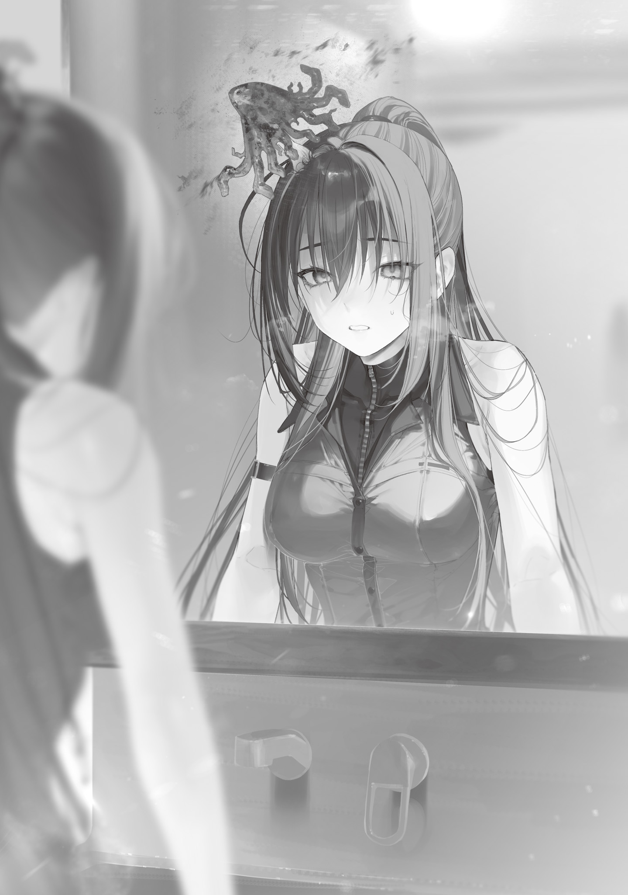

Shortly after New Year's, the Foresight Mage issued an infection-prevention order covering all of Tokyo, and at first the Blue Witch didn't take it very seriously.

He'd foreseen a rise in people falling ill a month out, but that kind of thing had happened several times before.

When he'd foreseen a major typhoon, they'd reinforced roofs and windows and kept the damage to a minimum.

When he'd foreseen a drought, they'd stored up water in advance.

When he'd foreseen a flu outbreak, they'd locked down the area where the infections started and headed off a full-blown epidemic.

Of course, there had been plenty of tragedies Foresight couldn't prevent, too.

He'd missed the giant kaiju, and he'd missed the Iruma coup (though that was largely because Iruma had been so crafty). He hadn't been able to stop the Hell Witch's rampage or the destruction of the big farm in Katsushika Ward either.

But whenever he had seen a tragedy coming, they had always prevented it.

With a month to prepare, they could cut the damage from almost any tragedy way down, even if they couldn't stop it entirely.

So she'd optimistically assumed that if they'd seen an outbreak coming a month ahead, it would stay small when the time actually came.

But a month later, when the Blue Witch went to the Magic University to deliver a letter from Ori to Ohinata, she was shocked to find that four of its five departments had suspended classes.

"So many students and professors say they're feeling unwell..."

Ohinata, who received her in the president's office, was visibly drained herself.

Her face was pale, and the fur on her ears and tail had lost its luster.

The Blue Witch felt a stab of unease.

"Not you too, Kei-chan? You should be in bed..."

"No. I have to analyze the infected. Even for Tokyo, the university has an especially high rate of people reporting symptoms. But some people are perfectly fine. I need to find out what makes the difference... If the university is ground zero for the infection... But then some things don't add up..."

Ohinata tried to go back to compiling the data from her papers, but there was no strength in her voice or her hands, and her fountain pen left a shaky scrawl.

"No. Get some rest, okay?"

The Blue Witch pried the fountain pen from her fingers, pushed the papers aside, and scooped Ohinata up and laid her on the sofa before she could object.

Ohinata fussed a little and reached for her unfinished work, but once she was lying on the soft sofa with a blanket over her, her will to get up seemed to crumble.

The Blue Witch held Ohinata's small hand and gently stroked her cheek.

"Have you seen a doctor? Want me to go get one?"

"The doctors are sick too. Have you seen what the city's like? Half the people are ill. And not just in Bunkyo Ward. These symptoms might be spreading across all of Tokyo—no, all of Japan..."

Watching Ohinata close her eyes and speak so weakly sent a chill through the Blue Witch.

She put a hand to Ohinata's forehead, but there was no fever. No sweating, either.

Yet Ohinata lay completely limp, so weak she looked like she might die right then and there.

"So I have to—I have to look into it. I have to find out what's causing this illness..."

Before she could finish, Ohinata's hand went slack.

The Blue Witch called her name in a panic and felt for a pulse. There was a heartbeat. She could hear soft sleeping breaths, too, and once she realized Ohinata had only fallen asleep, she wiped the cold sweat from her brow.

Right. If Ohinata was this worn out, sleep had to be the best way for her to get her strength back.

The Blue Witch couldn't wake her, but she couldn't leave her sleeping on the sofa forever either.

After a moment's hesitation, she picked up the sofa with Ohinata still on it and carried it to the university infirmary.

Every bed in the infirmary was taken.

Students just as pale and limp as Ohinata filled them all, and some were even sitting on the floor.

Scowling, the Blue Witch grabbed only some clean sheets and blankets, made up a makeshift bed in an empty classroom, and carried Ohinata in to lie down. She also made sure to write in big red permanent marker on the classroom entrance: "MEDICAL PERSONNEL WANTED. I WILL KILL ALL OTHER INTRUDERS. BLUE WITCH."

If this was an infectious disease, isolating Ohinata now wouldn't do much good. Still, letting her mix with other infected people wouldn't help either.

The Blue Witch stayed by her side and nursed her as the sun went down, the moon rose and set, and morning came.

Ohinata drifted between shallow sleep and hazy waking, and the Blue Witch gave her water and fed her softened bread. When Ohinata got hot, she pulled the blanket off; when she got cold, she put it back. She helped her to the toilet, too.

At one point Ohinata groaned in her sleep, reaching for something, and when the Blue Witch took her hand, the girl murmured, "Dad." It made the Blue Witch's heart ache.

She could never be this bright, sweet girl's father. But she could be something like a big sister, and she wanted to believe she already was.

As night gave way to morning, the Blue Witch watched the sun come up, let out a long, deep breath, rolled her shoulders, and rubbed her eyes.

Her body felt unusually heavy. She put it down to the nursing, until a few seconds later she remembered she was a witch.

There was no way one night of looking after someone should wear her out this much.

The Blue Witch was stunned.

I'm infected too!

She hadn't been sick a single day since becoming a witch. Her body was supposed to be tough enough that a small cut healed completely by the end of the day.

She was staring at her hands in disbelief when someone knocked on the door of the classroom she'd turned into Ohinata's private sickroom.

"Excuse meee— Hm? What's this... Ah, the Blue Witch!? E-Excuse me!"

Whoever it was had apparently spotted the scrawl on the entrance just before opening the door. Hurried footsteps ran off.

But before they went, they'd shoved a sheet of paper through the gap in the door.

The Blue Witch pulled it through and read it.

The letterpress ink wasn't even dry yet, but the notice carried important information.

> The illness currently spreading becomes severe in anyone who has experienced magic-power-depletion fainting even once, and its mortality rate then jumps to 100%. Those with little magic power should be especially careful to refrain from using magic.
>
> Make sure this is thoroughly communicated. Bunkyo Ward Medical Team

The Blue Witch crushed the paper in her fist.

The warning had come far too late.

Thanks to the spread of fertility magic and fire magic, more than half of Tokyo's residents had definitely been through magic-power-depletion fainting already.

At the Magic University especially, the entrance exam included a magic-power capacity test that pushed applicants to their absolute limit, so 99% of its people had experienced magic-power-depletion fainting.

Naturally, Ohinata, on the cutting edge of magic linguistics, had fainted from magic-power depletion many times herself.

And the Blue Witch had fainted from magic-power depletion once too, when she brought down the giant kaiju.

The Blue Witch had begun to roll downhill toward death.

---

The Blue Witch went home to Ome while she still had the strength to move.

She had killed a lot of people. Some of it had been revenge, some self-defense, and some collateral damage to save more lives. She'd had her reasons, but killing was killing, and she'd earned more grudges than she could count.

She had always been strong enough that retaliation was never worth a second thought. Now, what frightened her more than anything was that retaliation aimed at her might drag in the people she cared about.

On the way home, the lifeless streets brought back the earliest days of the disaster, whether she liked it or not.

Doors were shut tight, and hardly anyone was out walking. Even if someone collapsed at the roadside and didn't move, nobody had the energy to spare for them.

Just a few days earlier, the city had been bustling and full of life. Now it had gone dead quiet.

The soil in one house's flower bed had dried out completely, and the flowers had withered. The sight left the Blue Witch gloomy.

The Witches' Council had made the flowers of recovery bloom all over Tokyo, and done it splendidly, but that beauty had lasted only a moment. It had been the kind of thing that withered almost at once.

Once she made it home, the Blue Witch went to sleep to save what strength she could.

And when she woke up, there was a mushroom growing out of her head.

"...What is this?"

When the Blue Witch saw the mushroom on top of her head in the bathroom mirror, its familiar color and shape brought an ugly memory flooding back.

A cap mottled in poisonous purple and red, and a stalk creased with wrinkles like a creepy human face.

Apart from the size—human-sized then, palm-sized now—it was a dead ringer for the mushroom monster the Iruma Mage had controlled with puppetry magic.

When they'd killed the mushroom monster, its corpse had exploded.

It had exploded into fine powder.

The blast itself had been weak, but nearly every member of the Witches' Council at that fight had been showered with the powder it scattered.

She hadn't given it a thought at the time, but maybe that powder hadn't been ordinary powder. Maybe it had been mushroom spores.

If the witches had been infected back then, become carriers without realizing it, and spread the fungus all over Tokyo... that would explain the disaster they were in now.

Watching in the mirror, the Blue Witch set the scissors at the base of the mushroom and carefully snipped it off, stem and all.

It was obviously a foreign object. Something like that had no business growing out of her head, or so she'd reasoned.

That turned out to be a huge mistake.

The instant she cut it off, magic power was sucked out of her whole body so fast it made her dizzy, and within a few seconds an identical mushroom had grown back in exactly the same spot.

She hadn't just burned through a huge amount of magic power at once. Her condition had taken a sharp turn for the worse, too.

She was far past feeling sluggish now. It took willpower just to stay on her feet.

Cursing her own carelessness, the Blue Witch dragged her heavy body along, slapped her cheeks to clear her fogging head, stumbled into the study, and tore through the bookshelves.

She dug out a mushroom field guide someone had bought her as a child, one she'd never gotten even halfway through, and flipped through it as if her life depended on it.

Of course it wasn't going to say anything about that mushroom monster, but she wanted any clue she could get.

If I can't cut it, should I burn it? Or would burning it make things even worse? What about freezing it? That might make things worse too...

Naturally, the field guide said nothing about how to treat mushroom disease.

But it did give her the worst possible news.

Some kinds of mushrooms spread mycelium through their growing medium before they ever sprout above ground.

A giant mushroom may seem to spring up from a rotting log in just a few days, but it has actually spent months before that threading its roots through the wood.

Only after months of working those roots through the entire log, when everything is ready, does it finally send up its mushrooms all at once.

Between that and the way magic power had been sucked out of her whole body as the cut mushroom grew back, the Blue Witch understood that the mushroom monster's mycelium had already overrun her entire body.

The mushroom on top of her head was just the visible tip of the iceberg.

The real culprit was the mycelium spreading through every part of her.

In that case, there was nothing she could do.

She couldn't cut it out, and burning all of it would mean burning her whole body to cinders.

The Blue Witch tried to chill herself with freezing magic, hoping a lower temperature would slow the mushroom's growth even a little, but maybe because the illness had progressed, she couldn't control her magic power well enough, and the spell wouldn't activate.

Even when she recited the incantation, she could feel the mushroom snatching the magic power that should have formed the spell and soaking it up.

Horribly sick, and now cut off from her magic as well, the Blue Witch fell into despair.

Then all that's left is to die, isn't it?

The mushroom will keep sucking up my magic power and my strength until I die as its seedbed.

Had he planned it, or was it chance? Either way, the Iruma Mage had left behind the worst possible time bomb, and the Blue Witch cursed him. No matter how many times she killed that bastard, it would never be enough.

Then it suddenly came back to her: Ori lived deep in the mountains and probably hadn't heard a thing. She had to tell him about the mushroom disease.

The Blue Witch was Ori's source of news. If the Blue Witch said nothing, Ori knew nothing.

She didn't know whether Ori had ever experienced magic-power-depletion fainting, but if he hadn't yet, she needed to warn him before the illness could turn severe—before its mortality rate could shoot up to 100%.

Her head had gotten so sluggish that she hadn't even realized that until now.

But when she tried to send a warning through an eyeball familiar, her voice was already gone. Nothing came out but a hoarse, voiceless breath.

The Blue Witch wasn't afraid of dying herself.

She'd gotten past that worry long ago.

What she was afraid of, and only that, was failing to protect the people she cared about. She was afraid of letting their lives slip through her fingers.

There was nothing more she could do for Ohinata. In her sorry state, leaving Ohinata to the Bunkyo Ward Medical Team would be dozens of times better than butting in herself.

But Ori was her responsibility. She had to do something.

If she couldn't reach him through an eyeball familiar, she'd just have to walk to Okutama.

The Blue Witch crawled out of bed and half slid, half crawled down the stairs from the second floor to the first.

It was willpower moving her now, not stamina.

It took her nearly an hour to crawl less than ten meters, and then she noticed a letter lying under the front door.

A letter... When did that get here?

Now that she thought about it, she had a feeling the doorbell had rung a while back.

Even her hearing had grown weak.

Blinking again and again to clear her blurry vision, she checked who it was from.

The sender's name was "Foresight Mage."

Why would he go to the trouble of sending a letter when he could just fly an eyeball familiar over? What was he thinking?

The hazy question found a hazy answer.

The mushroom had gotten into Foresight too, and he couldn't use magic anymore.

If his symptoms were that far along, he couldn't come see her in person either.

A letter had been his only option.

What had Foresight seen?

What was he trying to tell her?

The Blue Witch still hadn't let her guard down around Foresight.

Iruma had seemed sincere, just like Foresight. He'd seemed capable. Everyone had trusted him.

And all the while, he'd been plotting an outrageous coup.

I want to believe Foresight, but I can't trust him all the way...

Her mind had dulled so much that even that lingering doubt was gone.

Thinking was hard now.

If Foresight was offering her hope, all the Blue Witch could do was cling to it.

She tried to open his letter and read what was inside.

But she no longer had the strength to open it.

Over and over and over, she tried to open the letter, which was only glued shut, and failed.

Tears spilled out, and she couldn't stop them.

Hope was right there in her hands, and she couldn't do a thing with it.

Despair had invaded her whole body, and she could see no light.

She lost all sense of time and had no idea how long had passed.

Then, out of nowhere, the Blue Witch felt someone take the letter from her hand.

"Huh? What're you doing? What's this letter?"

They were in the middle of an unprecedented biohazard, and Ori's carefree voice didn't carry the slightest sense of danger. Yet right now, somehow, it sounded incredibly reassuring.

Wrapped in that relief, the Blue Witch let go of the consciousness she'd barely been holding on to and fell into a coma.
