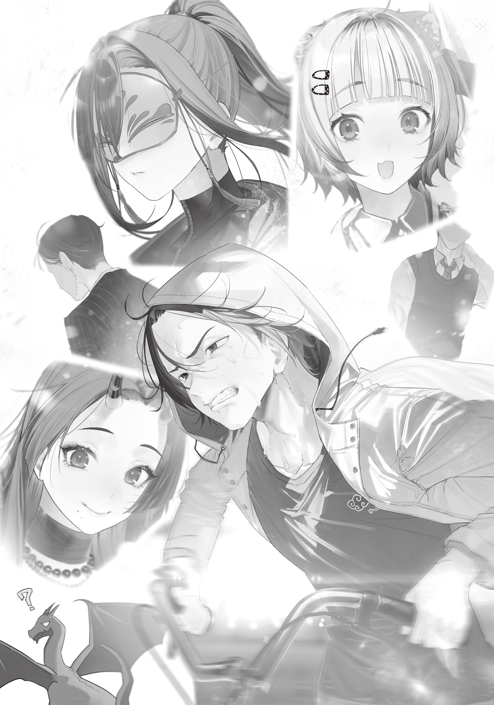
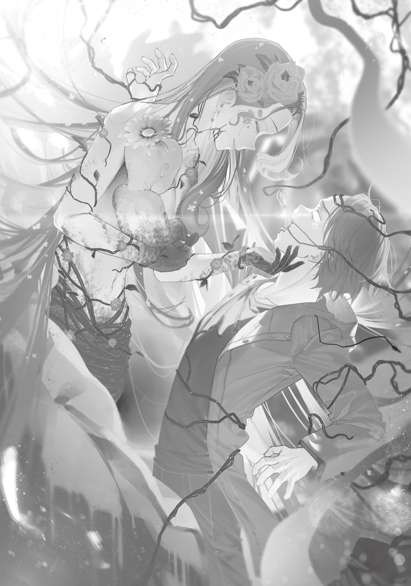

Lately, I'd been working on combining geometric beauty with artistic beauty.

It didn't do much for a wand's performance, but I wanted my wands to look good, not just perform well. Not that I didn't like rugged wands too, mind you.

I'd had Professor Ohinata get me books on math and art, and I spent my days snug under the charcoal kotatsu[^1], buried in them and jotting down whatever ideas they sparked.

Farm work was off for the winter. Between the kotatsu and the wood stove, the room stayed warm even without electricity.

For dinner, I stuffed myself with new-crop rice cooked in a pot. In the morning, I took the leftover rice, added clean water, shaved dried fish, mushrooms, dried daikon strips, and a pinch of salt, and boiled it all into a hearty rice porridge.

All of it was delicious. New rice really was on a whole other level from year-old or two-year-old rice—how it cooked, the texture, the smell, everything.

Sometime this spring, my homemade miso and soy sauce would be done aging. Then I could cook with those seasonings—the very soul of the Japanese people—as lavishly as I liked, without worrying about running out. I couldn't wait.

So there I was, living the easy life in my workshop deep in the mountains, when I woke up one morning to find a mushroom growing out of my head.

It had been almost four years since the Gremlin Disaster. I'd gotten used to plenty of off-the-wall stuff by now, but even I freaked out at this one.

No way—did I eat so many mushrooms that one sprouted out of my head!?

I was scared stiff, but the mushroom on my head turned out to be a kind I'd never seen before, nothing like the edible ones I usually picked in the mountains.

Its cap was a poisonous-looking mottle of purple and red, and the wrinkles on its stalk looked almost like a human face.

Creepy.

It looked bad for my health, so I ripped it off right away and shampooed thoroughly to wash out the roots.

Once the mushroom was out and I'd showered, my body felt kind of lighter. Hmm. Was it some sort of parasitic mushroom?

I had no idea whether it was a rare Earth species or a special type of monster, but to commemorate it growing out of my own body, I put it in a jar of alcohol as a specimen.

The mushroom floating in the jar was pretty creepy to look at, but kind of fun too. It was basically a baby tooth I'd lost. Probably. Don't quote me on that.

Two days after the mushroom sprouted, I took the specimen and a board game over to the Blue Witch's house to hang out. I'd asked through the eyeball familiar whether I could come over, but got no reply. Looked like she'd blocked me. I'd done that to her before, so this was probably payback.

Sheesh, she could be childish too. Honestly.

Still, she'd gotten pretty fired up over this board game, so if I brought it along, she'd probably agree to play.

I also wanted to ask her about the mushroom while I was there. I had this image of witches being experts on weird mushrooms. Maybe that was just a stereotype.

When I got to the Blue Witch's house, I was startled to find her sprawled on the floor just inside the door.

"Huh?"

What was she doing? Sleeping in the entryway? Who did that, besides some burned-out salaryman at a sweatshop company? Way too bizarre.

I was about to take off my shoes, careful not to step on her, when I noticed she was holding a letter.

"What're you doing? What's this letter?"

What the hell? Seriously, what happened?

Hold on, doesn't she have a mushroom growing out of her head too? What, is this a trend now?

Baffled, I picked up the letter, mostly out of curiosity.

The sender was the "Foresight Mage."

Huh. Maybe it was some kind of business memo from the Witches' Council.

I was curious what it said, but it felt rude to stare too hard at someone else's mail.

I went to put it back in the Blue Witch's hand—and realized it wasn't someone else's letter after all.

I'd happened to catch the address on the front. It read: "To whoever is standing at the entrance of the Blue Witch's home at 9:33 AM on February 8, 2028."

I stared at those words hard enough to bore a hole in them, then looked up at the pillar clock in the entryway.

Its hands read 9:33.

"Huh..."

What is this? Creepy...

I'd heard the Foresight Mage could see the future, but he can seriously do stuff like this?

That's scary. My personal info's completely exposed.

Wait, he doesn't seem to know my name, so maybe he can't see everything?

I looked around without meaning to. Is the Foresight Mage watching me right now, too? Not like I can do anything about it if he is, but it still creeps me out.

I stared at the address for a while, thinking it over, then spoke to the Blue Witch sprawled at my feet.

"Hey, this is addressed to me, right? Can I read it?"

She didn't answer.

She was so still that I suddenly got worried and held my hand near her mouth, but she was breathing, faintly.

Phew, she's alive. Good.

Man, she slept like the dead, though. I'd never seen her asleep before, so I hadn't known.

I couldn't just leave her on the cold entryway floor, so I dragged her up onto the fluffy mat in the hall.

I took off my winter coat and draped it over her, then opened the letter and started reading.

---

Nice to meet you. I am a member of the Tokyo Witches' Council, known as the Foresight Mage.

I am writing this letter because I have seen a future in which you read it, here and now.

Time is precious, so I will start with the conclusion.

I need you to go to the Flower Witch at once

and obtain the antidote for this nightmare of an epidemic.

Ideally, you would read the rest of this letter on your way to her. Unfortunately, I doubt you would accept so sudden a request without an explanation.

First, let us review what is happening. You may already know some of this, but I want to lay it out step by step so nothing is misunderstood.

A bizarre disease that makes mushrooms grow from people's heads is currently spreading fast, centered on Tokyo.

The mushroom grows by draining stamina and magic power from the host it parasitizes, and the symptoms progress in three stages.

First is the incubation stage. The infected have no idea anything is wrong and are perfectly healthy. Even so, they are already highly contagious and spread the infection to those around them.

Next is the pre-onset stage. The draining of stamina and magic power begins, and the host is hit by fatigue.

Then comes the post-onset stage, in which mushrooms sprout from the head, fed by the nutrients they have drained.

Depending on conditions, this later stage takes one of two forms.

The mild type, and the severe type.

The mild type is exactly that: mild. Even with a mushroom growing from the head, the symptoms go no further than a slight fever.

Even that clears up once the mushroom is removed, and that alone cures the disease completely.

From what I saw of you from behind, there was no mushroom on your head.

So either you are not infected, or you had the mild type, removed the mushroom, and have already made a full recovery. You need not worry.

The problem is the severe type.

Anyone who experiences magic-power-depletion fainting even once after infection will, without exception, go from the mild type to the severe type.

In the post-onset stage of the severe type, magic power and stamina are drained at an extreme rate.

The patient can no longer use magic. Removing the mushroom only makes things worse, and it grows back at once.

As magic power and stamina rapidly drain away, the patient shows clouded consciousness, loss of the five senses, and similar symptoms, then falls into a coma. At that point, even IV fluids stop working. The draining continues until every last nutrient is gone, and the patient dies.

In this way, those who develop the severe type die within 2–5 days. Unfortunately, the fatality rate is 100%.

---

After reading that far, I looked away from the letter and down at the Blue Witch. She hadn't so much as twitched on the mat.

Gingerly, I took off the mask she never went without. Underneath was the face of a beautiful girl—lovely, but gone ashen.

What the hell!?

Her color's awful! This is the severe type! The fatality rate's 100%!

Is this any time to be standing around in the entryway reading a letter!?

The Flower Witch has an antidote!?

Dumbass! Get going, now!

"Hey, hang on! I'm taking you to the Flower Witch right now!"

I squished her cheeks as I said it, then ran to drag a cart out of the shed in the back garden.

I gently lifted the Blue Witch in my arms, let the muscle I'd built doing farm work do the carrying, and laid her on a blanket in the cart.

Then I tied the bicycle and cart tightly together with a short rope and checked a map of Tokyo for the route to Taito Ward and Arakawa Ward, where the Flower Witch had her base.

This was probably the best I could do. Full speed ahead. I had to reach the Flower Witch and get the antidote into the Blue Witch before she died.

I shoved the map in my pocket and swung onto the bike.

Then, as I started pushing the heavy pedals, I read the rest of Foresight's letter.

If the end of this letter says "Prank successful!" or something, I'm coming over there to punch you.

---

Once mushroom disease has turned severe, the only treatment is the antidote held by the Flower Witch.

Unfortunately, she will give it to no one but you. Only you can obtain it. I need you to strike a deal with the Flower Witch and get that antidote, whatever it takes.

As for the terms, they will be neither painful nor difficult for you.

The Flower Witch knows roughly what is going to happen. The negotiations should go smoothly.

Talking with her, you will feel as though she can predict the future, but that is not quite right.

I would prefer you not spread this around, but I once made a deal with the Flower Witch.

As a result of that deal, I spend half my magic power foreseeing her future. That is how she knows what is coming.

I could not fully grasp the meaning of what I saw, but when I told the Flower Witch about it, she seemed to understand. She needs you, and you need her—if you want the antidote for the Blue Witch.

Unfortunately, this is all I can tell you.

I am sure there is more you want to know. There is a great deal I want to tell you and ask you as well.

But apparently, any more information would backfire.

Just face the Flower Witch as you are.

That, it seems, is what will draw in the best possible future. For everyone.

If you get the antidote, use it on the Blue Witch first, then deliver the rest to the Bunkyo Ward Office. If I am still alive, I will take it from there. And even if, unfortunately, I am dead, my subordinates and the surviving members of the Witches' Council will somehow bring the situation under control.

I wish you luck.

Foresight Mage

---

The letter stayed serious from start to finish, nowhere near a prank.

And on the way to the Flower Witch's base in Taito Ward, I saw for myself the reality of a pandemic that was nowhere near a prank either.

I'd been worried someone might talk to me along the way, but "unfortunately," that worry turned out to be for nothing.

Almost without exception, the people I came across on the main roads lay collapsed on the ground.

And the ones who had only collapsed were the lucky ones. Half of them had mushrooms growing from their heads. Some of those mushrooms had swollen bigger than their hosts' heads, and from their ugly, human-faced wrinkles came faint cries like fingernails on a chalkboard. The real hell of it was that those cries sounded louder than the living calling for help.

Being talked to was one of the things I hated most in the world.

But having parasitic mushrooms with twisted grins—and I could tell they were grinning!—call out to me in horrible, incomprehensible cries was many times worse.

In central Tokyo, the reek of burning stung my nose.

Houses were being burned.

People covered head to toe in ugly patchwork vinyl suits—were those supposed to be chemical protective suits?—were setting homes on fire.

Some of the vinyl-suit groups were brawling or arguing with tough-looking armed people. I had no intention of eavesdropping, but they were red in the face and screaming at each other, so I heard both sides whether I liked it or not.

Apparently, the vinyl-suit people called themselves the "Purification Squad," and they were burning mushroom-infested corpses along with the houses they lay in to keep the infection from spreading. Maybe they were doing it out of goodwill or a sense of duty, but going by Foresight's letter, it wasn't accomplishing anything. If anything, with the risk of the fires spreading, it was probably doing harm.

The armed ones were the security force. Their main job was supposed to be fighting monsters, but they'd been dragged out to deal with the Purification Squad, and they were livid. Monsters were still showing up as usual during the pandemic, so they were furious at the Purification Squad for piling on extra work. In some places they were blasting magic at the Squad and beating down what was basically a gang of arsonists.

Tokyo had split into two extremes: areas as quiet as the grave, and districts in an uproar of fires and brawls. There was nowhere normal left.

Riding through all that with my hood pulled low and a cart in tow, I should have looked suspicious. But there were plenty of people far more suspicious than me, so by comparison I didn't stand out.

The Purification Squad stood out badly, of course, in their full-body patchwork vinyl suits. But there were also people draped all over with empty mold-remover cans, cackling like maniacs; dead-eyed people dragging baskets taller than they were, collecting mushrooms off corpses; people spraying spit as they ranted in some foreign language; and people praying to crosses built from scrap. All kinds.

It was scary passing between all those obviously dangerous people, but the Blue Witch dying behind me pushed me on. I kept my eyes on the road so I wouldn't meet anyone's gaze and kept pedaling.

Honestly, I'd thought the Blue Witch was some invincible ultimate life-form. It had never crossed my mind that she could get hurt or sick.

But apparently even the Blue Witch could end up at death's door.

The Blue Witch was my one and only friend.

If I let her die, I'd never be lucky enough to have another.

I'd never once thought being alone was hard.

And I probably never would. Not ever.

But sometimes, having someone around made me happy.

So the Blue Witch was my one and only... Wait, hang on.

What about Professor Ohinata?

That's right. That stoat girl's got to have the severe type too! No way someone actively running experiments as a magic linguistics professor has never had magic-power-depletion fainting.

Oh crap. The professor isn't my friend, but I don't want her dying either. Once I get the antidote into the Blue Witch, I've got to hurry over to the Magic University. For now, saving the Blue Witch and Professor Ohinata comes first.

And Foresight too, while I'm at it. He gave me advice. Professor Handa too, maybe? Professor Handa is my pretty decent riva... foil. Stay alive.

And I don't want to find the Hell Witch dead somewhere on her travels with mushrooms sprouting out of her, either. And the Dragon Witch... Eh, skip the Dragon Witch.

Thinking back, I'd picked up a lot more acquaintances than I'd realized.

They were all basically strangers, but I'd be bummed if any of them died. I didn't want to see them, but I did want them living healthy lives somewhere outside my field of vision.

That was one more reason I needed the Flower Witch's antidote. If I couldn't get the witch's medicine, I couldn't even save the Blue Witch, let alone Professor Ohinata.

After leaving Ome, I pedaled for about five hours, until my legs were swollen stiff, and finally huffed and puffed my way into Taito Ward.

The Flower Witch ruled an area stretching from Taito Ward into Arakawa Ward, and the edge of her territory was easy to spot: abandoned cars crawling with vines were piled up all along the border.

The only way in or out was through gates set into gaps between the cars. Yet for all those gates, there wasn't a single guard.

No idea why, but it suited me fine.

I went through a gate into the Flower Witch's territory and wondered what to do next.

I'd made it to the Flower Witch's home turf, but I didn't know where in the district the witch actually was.

She had to be somewhere. But where?

Isn't there a map board around here or something? The kind that marks the witch's house like it's a tourist attraction.

I really didn't want to flag down some random passerby and ask, "Excuse me, where's the Flower Witch's house?"

While I was glancing around anxiously for a map board, a thick tree root suddenly punched up through the ground.

I wasn't scared or anything, but I did jerk back so hard I nearly tumbled off my bike. The root made a beckoning sort of motion at me, then pointed down the main road, over and over.

"Uh, um, are you Flower Witch-san?"

The root didn't answer my timid question. It just sank back into the ground and vanished.

...This is that thing, right? The one from Foresight's letter.

The bit about how the Flower Witch pretty much knew what was going to happen, so things would go smoothly.

I did as I was told and headed the way the root had pointed.

Toward the heart of her territory, where the Flower Witch held court.

I didn't know what was coming, but like the letter said, I'd just go in as I was.

That should settle things.

Surely.

---

Every so often a root would pop out of the ground and beckon me on—well, root-beckon, since it had no hands—and following them, I made it to the Tokyo Bunka Kaikan.

Or what was left of it, anyway.

Even though it was winter, vivid green moss covered the concrete pillars, and a big beehive had been built right over the "Tokyo Bunka Kaikan" sign.

All the big glass windows were smashed, and instead of clear man-made panes, thick curtains of vines kept out the wind and rain.

A young camellia by the entrance was quietly blooming red, but its handful of flowers had all opened facing my way, like they were looking at me. Watching me. It made me seriously uncomfortable.

Even from a distance, it was obvious this was the Flower Witch's base, because a giant tree of some unknown species grew up from inside the building and burst through the roof. It looked a thousand, maybe two thousand years old, and it stood 50 meters tall, possibly even 60. Its thick foliage was white as snow and stood out sharply against the blue sky. That was no tree from Earth. Flocks of little birds perched in its branches, chirping back and forth, and their droppings had stained the building's roof.

The Tokyo Bunka Kaikan was the only building in the area that was overgrown with plants. Guarded by branches, leaves, and the scent of flowers, it felt like a natural sanctuary that had sprung up all alone in the concrete jungle.

At the entrance, a root beckoned me on, so I parked my bike and cart and hoisted the Blue Witch onto my back.

Her body was frighteningly cold. On the way here, I'd rewrapped her in blankets every hour and checked that she was still alive, but her heartbeat was faint. It felt like even a little jostling might stop it altogether, so I carried her as gently as I could while hurrying deeper into the building.

The Flower Witch was waiting for me in the very center of the building.

She was even more beautiful than the rumors said.

Her throne lay in the dim shade of the giant tree, but she bloomed there all the same, one huge flower in the shadows.

In the middle of the rubble scattered by the collapse, vines and green leaves, each leaf a full armful across, formed a base, and on top of it bloomed a crimson flower of a kind I'd never come across.

I'd never seen a red so beautiful.

It was like fresh blood, like flame, like a jewel: an eye-catching red, every single petal brimming with life. Nature's harmony had shaped a beauty that seemed out of this world.

And growing from the center of that huge crimson bloom was a person: a good-looking woman in her prime. Her well-proportioned body wore no clothes, just vines and leaves draped over it like some piece of avant-garde art.

The lower half was one thing, but honestly, I couldn't tell you whether the human-shaped upper half was beautiful or not. Women with nice faces all looked the same to me.

Well, her green hair's a nice color, I guess. What do I know.

"Welcome to my sanctuary. I've been waiting for you."

The Flower Witch gave me a seductive smile, and a vine slithered out and stroked my cheek.

U-Um, excuse me. This is kind of scary. Why are you stroking me? Taste-testing?

You have been filled in on all this, right? This vine isn't going to strangle me or anything, right?

"I will grant your wish and heal the Blue Witch. Foresight told you as much, didn't he? I will also give you enough antidote to go around all of Japan."

"B-but...?"

"Yes. But. You will pay me for it."

With a graceful smile, the Flower Witch lifted the petals that spread around her like a skirt.

Hidden underneath was a snarled mass of vines, roots, and stems, every one of them throbbing and faintly squirming. Anyone with trypophobia would faint five or six times just looking at it.

"My first daughter plant could not be born. I am trying to bear a second, but she is tangled up with the first one's body. At this rate, she will die."

The Flower Witch said it sadly.

"I cannot fix this myself. I tried to untangle them, but they only got more tangled.

"I cannot cut a single strand, or my daughter plant will die.

"Nor do I have much time. She should have been born on the night of the full moon.

"You are the only one who can untangle this and save her.

"Save my daughter plant, and I will give you the antidote."

"Oh, is that all?"

It was such a letdown that I let out a sigh of relief.

The Flower Witch's lower half was a seriously gross tangle of vines, roots, and stems, but gross was all it was. The tangle itself was simple, and one look told me how to undo it.

Seriously, she can't untangle something this easy? The Flower Witch must be super clumsy. Poor thing.

But thanks to that, the mushroom disease antidote is as good as mine. I was scared of what she'd demand in return, but this'll be a breeze. What a relief.

"Um..."

"Lay the Blue Witch down over there. You can hardly work with her on your back."

"Oh, thanks."

I gently laid the Blue Witch on the bed of dead leaves and twigs that had been set out for her, brushed the hair off her face so she could breathe easier, then turned back to the Flower Witch and rolled up my sleeves.

"Be careful, won't you? If you fail, I will kill you and the Blue Witch both and drain you dry."

"Ha ha, you're joking, right? That's like saying you'll kill me if I screw up building a house of cards."

"...Then wouldn't it be difficult?"

"Sorry, I have no idea what you're saying."

I'm saying failing would be the hard part. Why isn't that getting through?

I crawled under the Flower Witch's petal skirt and had the tangle undone in no time flat.

"All done. Here's your daughter plant. It's a healthy baby girl! Okay, the antidote, please."

When I held out the daughter plant I'd delivered, the Flower Witch's eyes went wide.

The daughter plant had nearly suffocated deep in the roots, but she'd pulled through. I handed her over—she looked like a miniature Flower Witch—and stuck out my hand. C'mon. Antidote.

For some reason, though, the Flower Witch looked a little weirded out as she took the fussing daughter plant.

"I-I see. My daughter plant is safe. I see. So it was this easy? For you, that is. I see..."

"Um, the antidote?"

The Flower Witch had been rattled, but the moment she cradled the daughter plant in her arms, her face softened.

She began soothing the daughter plant with a sound like an animal's cry, a song, or the melodic rustling of trees.

I keep asking for the antidote, and this witch keeps not handing it over. Well, she did just give birth. Naturally the baby comes first.

She looked at her baby with so much love, the two of them so lost in their own little world, that I decided to kill some time. I dug a grave for the other daughter plant I'd delivered... the dead, mummified one.

I dug into the leaf mold in a corner of the throne room with my bare hands, flipped a cracked tile out of the way, and laid the body in the hole.

Her upper half was human-shaped too, but a silent body didn't scare me.

Amen. Namu Amida Butsu.[^2] Rest in peace.

I put my hands together, made the sign of the cross, and silently recited whatever Bible verses I knew before covering her with dirt.

What a sad story. She never even got to be born.

She died without ever getting to love anything.

She never even got to live, and yet she'd nearly killed her little sister.

So at least rest easy from here on out. It ain't much, but I'm making you a grave.

Once she was buried, I grabbed a light-looking stone from the rubble and set it down as a grave marker. Then I dug a shard of broken glass out of the dead leaves, chipped it with a pointed rock into a flower shaped like her mother, and left it in front of the grave as an offering.

Well, that'll about do it. Goodbye, and on to your next life! Rest in peace!

Okay, the touching first meeting between mother and newborn should be about wrapped up.

I dusted the dirt off my hands and turned around to collect my antidote, only to find the Flower Witch, her daughter plant sound asleep in her arms, staaaaaaring at me.

The blood drained from my face, and I started shaking.

"Eek! U-Um, sorry for sticking my nose in. I-I-I-I'll put it right back. I'll dig it right back up. Right now!"

Oh crap!

I screwed up! All she asked for was help with the birth. Who told me to go making graves?

Nobody asked for this. It's extra, it's uncalled for... Argh! What is wrong with me!?

I scrambled to dig the grave back up and put things the way they'd been, but a tree root grabbed my arm, and I froze.

I'm done for.

She's going to kill me.

I was in total despair, but when I peeked at the Flower Witch through half-closed eyes, she didn't look angry.

She was studying me intently, like she'd just spotted some bizarre, rare animal for the first time.

"All I ever had foreseen was this child's future. All I wanted was for her to be born safely. But you saw that other child, the one I refused to look at."

"Huh? Uh...? I guess?"

The Flower Witch's voice was calm, and the root around my arm wasn't squeezing hard, either.

Maybe she isn't going to kill me after all...?

"I am grateful to you. Thank you. I will give you the antidote now."

"Oh, thanks."

Not only was I forgiven, the Flower Witch actually seemed to be in a good mood. Apparently something had struck a chord with her.

Maybe she liked the design of my offering? See, this is why you study design.

The Flower Witch let go of my arm and set her roots and vines writhing, weaving them together into a wooden pail, which she then snipped off from her body.

She set the pail on the ground, held the tip of a branch over it, and began dripping a clear liquid inside.

At once, a fresh scent spread through the air, like a walk in the woods, and that alone was enough to make the throbbing mushroom on the sleeping Blue Witch's head turn black and wither.

"!? Huh, just from the smell? She didn't even drink it!?"

That's a straight-up healing aura! How does that even work?

I ran over to check on the Blue Witch. Some life was beginning to return to her almost corpse-like complexion. Her breathing had steadied too, settling into soft, peaceful little breaths.

While I gaped, the Flower Witch explained, still dripping liquid into the pail.

"Plants like us can secrete special compounds to protect ourselves from fungi and insects. People commonly call it essential oil. Essential oil kills germs. Ordinary essential oil has no effect on that mushroom, but mine works very well. None of the people in my district were infected, were they?"

"Oh, uh, well, I was looking at my feet the whole way, so I couldn't tell you."

"I-I see. You're shy with strangers, then?"

She said it like she was trying to be tactful about it.

She totally figured out I'm socially awkward. So what if I am!

"This essential oil kills the mushroom through mere contact with its vapor, so even spraying a solution diluted a thousand, ten thousand... no, a hundred thousand times should wipe it out. It will also kill other magical fungi and insect monsters, but you don't mind, do you?"

"Well, obviously."

I nodded.

Some people might mind, but any way you sliced it, wiping out the mushroom came first.

"This is only my impression, but I suspect this mushroom is the kind you become immune to once you've caught it and recovered. You need not worry about a second or third pandemic. Of course, it will still need investigation, research, and countermeasures, but you can leave all that to Foresight or the Eyeball Witch. There. That is plenty."

While she was talking, the pail had filled to the brim with essential oil, and the Flower Witch capped it with a lid made of vines and branches.

But when I reached for the pail, humanity's new hope, a tree root suddenly seized my hand, and the Flower Witch yanked me in close.

"Wh-wh-wh-what is it, what is it, what is it!? Mmph!"

As I stumbled, she grabbed my jaw, pried my mouth open, and tipped my head back without a word of answer.

Smiling beautifully all the while, she let three drops of golden liquid, secreted from the tips of a bundle of petals, fall into my mouth.

It was terror, pure and simple. Eek! What is she making me drink!?

I tried to spit out the mystery liquid, but she slid a thin vine down my throat and forced me to swallow.

Once she'd made sure the golden liquid had gone down, the Flower Witch let me go.

I dropped to all fours and coughed violently.

It didn't feel bad, exactly. If anything, the golden liquid she'd forced on me was sweet and richly fragrant, and there was a pleasant sense of nature's power filling my body. But I had absolutely no idea what the stuff was.

I actually drank it. What? What did she just do to me? Explain!

"W-What was that?"

"You're better off not knowing. But it isn't anything harmful."

"No, I really do want to know. What did you make me drink?"

"There must be countless people who would kill you just to learn what you drank."

"Yikes..."

She's been way too scary this whole time.

Could you maybe not feed me something that dangerous?

The Flower Witch only smiled, gently rocking the daughter plant in her arms, and didn't look like she planned to explain any further.

Foresight, you liar! You wrote that the deal was safe!

Wait, did he? He wrote that it would be neither painful nor difficult, but I don't think he ever actually said safe.

Damn it, I've been set up!

Looking on the bright side, what she'd made me drink was probably harmless.

Poisoning the midwife right after he'd helped with the birth exactly as agreed? That would be insane. Witches did tend to have warped morals, but I wanted to believe even a witch wouldn't go that far.

Whatever it was, it was probably fine to drink.

But then what was all that about tons of people being willing to kill me to find out what I'd drunk?

So it's dangerous after all!

I wanted to grill her about what exactly I'd drunk, but she looked like she'd get mad if I kept intruding on her private time with her baby. Besides, people were dying of mushroom disease at this very moment.

It could be Foresight. It could be Professor Ohinata.

Whatever she'd fed me, the smart move was to trust it wouldn't kill me and get out of here.

I had to get the antidote to the Bunkyo Ward Office, fast.

With the Blue Witch breathing peacefully on my back and the heavy pail tied tight to my belt, I left the plant sanctuary. As I went, the Flower Witch called after me warmly.

"I hope you and I will be on good terms for a long time to come. Do come see me now and then. You will be welcome."

【alraune secret nectar】

A secret remedy of nature that preserves the drinker's youth and extends their lifespan.

Only one drop of secret nectar is produced a year, but when an alraune dies and withers, a large bucketful pours out.

Securing enough is practically the same as gaining eternal life.

## Translator Notes

[^1]: **Kotatsu** (こたつ): A low table with a heat source and a quilt underneath.

[^2]: **Namu Amida Butsu** (南無阿弥陀仏): A Buddhist invocation expressing refuge in Amida Buddha.
