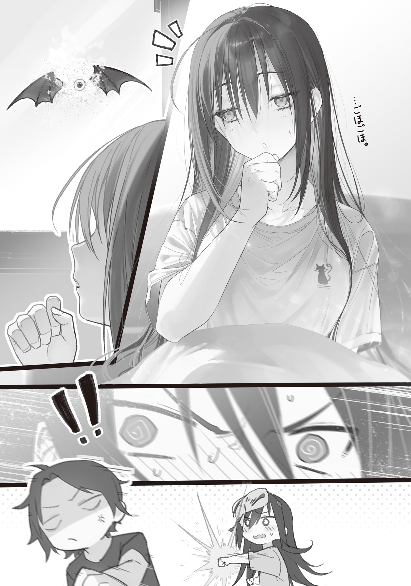

Toward evening, I reached the Bunkyo Ward Office by bicycle, towing the Blue Witch in a cart.

The security force had set up barricades in front of the ward office and stood on guard with wands and crossbows ready. There were no bodies in front of the barricades, but bloodstains that couldn't be scrubbed away remained. The smells of blood and char still hung in the air, reminders of fierce fighting.

I hesitated, thinking they'd kill me if I approached, but inside the barricade, near the ward office entrance, I spotted a woman under guard. She held a sign saying, "Person at 9:33 AM," and looked around anxiously.

Easy enough. Apparently I was supposed to hand it to her.

I got off the bicycle, picked up the pail, and approached the woman with the sign. The security force all trained their wands and crossbows on me at once and demanded to know who I was.

"Who goes there! State your name and business!"

The sharp, hostile shout made my stomach clench.

I was too scared to talk, so I pointed at the sign with a trembling hand. The woman had the security force lower their weapons, then beckoned me over.

When I approached to hand over the pail full of the Flower Witch's antidote, the woman spoke with both anxiety and hope in her voice.

"I'm very sorry, but may I confirm something? Can you tell me who the letter was addressed to?"

"To whoever is standing at the entrance of the Blue Witch's home at 9:33 AM on February 8, 2028."

"Ah! Thank you. Thank goodness, it's here in time...! Sergeant Sasaki, take this to Foresight Mage-sama immediately! Hurry! We absolutely cannot let him die!"

"Roger!"

The pail I gave the woman was immediately passed to a burly man. After giving me a crisp salute, he disappeared into the ward office at a run.

"Um, is Professor Ohinata alive?"

When I asked anxiously, the woman nodded emphatically.

"She's in the same intensive care unit as Foresight Mage-sama. Thank you so much. If you'd taken until night, we surely wouldn't have made it in time. If, if that had happened..."

The woman's voice broke partway through, and she crumpled to the ground and burst into sobs.

The security force exchanged looks. Some of them started tearing up too.

I'd had it rough, but apparently things had been rough here too.

I mean, it looked like mobs had stormed the place two or three times. You guys had it rough.

Anyway, mission complete.

They said Foresight and Professor Ohinata were okay, so Professor Handa was probably okay too.

My job was over. I could leave the rest to them.

When I turned on my heel, someone called after me.

"Wait! What's your name!?"

Of course I didn't answer. I pulled my hood down low again. Then I silently mounted my bicycle and rode off with the cart in tow.

The less I talk, the easier it is on my stomach.

Once I got the Blue Witch back to Ome, I started nursing her at her house.

The parasitic mushrooms were dead, but she'd only just come back from the brink of death. She was badly weakened and just wouldn't wake up.

The Blue Witch slept quietly on the bed like she was half dead. She didn't react when I talked to her, pulled her cheeks, or tickled the soles of her feet. I worried that she might just keep getting weaker and die.

I'd heard of people dying from secondary infections despite a successful operation, or going into cardiac arrest because their strength gave out.

Could the Blue Witch already be so weak that even getting rid of the mushrooms had come too late...?

I spent a full day and night changing her ice packs, wiping away her sweat, and keeping watch in case her condition suddenly changed. But she had not gotten better after an entire day, so I lost my patience.

Flower Witch! That medicine was the real deal, right?

I saved your daughter. If you turn around and fail to save my friend, I'm gonna lose it. That's not what we agreed on.

I made up my mind to go file a complaint with the Flower Witch.

She said to drop by sometimes.

She said she'd welcome me.

She didn't have to welcome me. Just give me some extra medicine or something. A nutrient tonic, maybe.

Normally, it probably would've been better to take the patient to see her. But I was scared that moving her when she needed rest would make her condition worse. I wanted the Flower Witch's opinion on whether it was safe to move her too. She was the only one in Tokyo who could do anything about mushroom disease.

Late that night, with hardly anyone around, I snuck back to the Flower Witch at Tokyo Bunka Kaikan in Taito Ward.

Unlike last time, there were sentries holding torches in front of the barricade of abandoned cars surrounding her territory. I had to crawl up to it on my stomach, squeeze through a gap between the abandoned cars, and sneak inside.

I had a feeling the sentries would let me through normally if I talked to them. But compared to that kind of hard labor, clearing a stealth mission was way easier.

The Flower Witch's sanctuary at the base of the huge, mystical white tree had not changed at all since the day before.

The ceiling of the large room in the center of the Bunka Kaikan had fallen away, and rubble lay scattered at my feet. Rain fell through, and the damp floor had rotted through. Vigorous roots peeked through gaps in the broken floorboards.

At the center of that natural sanctuary, the Flower Witch gently held her sleeping daughter plant. Even in the middle of the moonless night, glowing lichen clinging to the walls bathed the sanctuary in soft, dreamlike light.

The Flower Witch turned toward me as I slipped quietly into the room and gave me a seductive smile.

"I'm glad you came. Did you come to see my child?"

"No, I'm not interested in her. Um, the Blue Witch isn't waking up. Does that medicine really work?"

When I got straight to the point, the Flower Witch went silent for a while.

After a moment, she spoke as if nothing had happened.

"You came to see my cute, cute daughter plant, didn't you?"

"No. The Blue Witch's mushroom disease is cured, but she isn't waking up, so I only came to file a complaint. Isn't this different from what you told me?"

I glared as hard as I could at the base of the huge flower, trying to intimidate her. The Flower Witch let out a big sigh and reluctantly answered.

"The parasite had gotten quite deep, so she won't wake up right away. There's nothing strange about that. Even a witch can't be up and running the day after nearly dying."

"But she's the Blue Witch, right? She's the strongest witch by far. She's tough, and she should recover quickly too. If there wasn't anything wrong with the medicine you gave me, can't you give me something like a nutrient tonic to help her recover faster? Her complexion is good, but she doesn't react when I talk to her, so it makes me nervous."

"...You truly care about the Blue Witch. Very well. If you insist, I will make you a nutrient tonic. She's likely not waking because she's so weak. If she gets enough nutrition, she should wake up quickly."

Wood creaked overhead, and a thick branch from the huge white tree came down through a hole in the room's ceiling.

A crack split open in the bark of the thick branch like a living thing's mouth and spat out the corpse of a monster that must have been 3 m long.

The corpse of a powerful creature, like a rabbit blown up to elephant size with a dog head and a cat head stuck onto it, rolled onto the ground in sticky slime with a heavy thud. My legs calmly and composedly gave out.

Hmm. Scary as hell.

Would you mind not suddenly putting a hulking monster that could one-shot me right in front of me? Even if it's a corpse.

As my legs shook so hard I could no longer stand, the Flower Witch chuckled, lifted me with vines, and sat me in a wooden chair.

"It's dead, you know? How timid."

"My cerebral cortex was just temporarily paralyzed by fear and shock, making my body go limp."

"In other words, your legs gave out. That's what being timid means."

"...Guh."

Unable to argue with that, I shut up. The Flower Witch began making the nutrient tonic while she explained.

"This white tree is a storehouse. When I'm full and can't absorb any more nutrients, I store corpses in this tree."

The Flower Witch wrapped roots around the bizarre chimera type monster and squeezed it hard.

The thick, powerful roots pulsed like blood vessels. The monster quickly shriveled into a bone-dry mummy. Even that mummy was crushed and balled up, then sucked dry by countless roots.

"Eek."

She sucked up every last bit of it. Terrifying.

I'm glad the Flower Witch is on my side.

No, is she...? Feels like she does an awful lot purely for her own convenience.

Well, she isn't an enemy, so that's fine.

Then again, strictly speaking, I was pestering the Flower Witch for aftercare outside our contract, so I was acting for my own convenience too.

The Flower Witch bundled together the roots that had sucked up the monster and began dripping a blood-red liquid into a bottle-shaped container made by reshaping a branch. The droplets from the root tips had a unique fragrance that made me want to call it the scent of life.

"There is no better nutrient tonic for either magic power or physical health. The Blue Witch can drink it all at once. You must not drink it, all right? It would work too well."

With that, the Flower Witch corked the container and gave me the special nutrient tonic.

I was so grateful. Now the Blue Witch would get better faster too. So, so grateful.

"Thanks! That really helps."

As I forced my still-unsteady legs under me and staggered to my feet, the Flower Witch gently extended vines to help me. Kind.

"Take good care of the Blue Witch. As long as she cares for you, she will return your care in kind."

"No, we're friends. It's not like I'm being kind to her because I expect something in return."

I'd only said something completely normal, but the Flower Witch looked caught off guard. The vines around my waist went slack and slowly writhed in confusion.

Wait. That reaction. What if what I thought was common sense actually wasn't?

There was nothing wrong with going against common sense, but knowingly ignoring it and simply not knowing it were two completely different things.

Better to ask and be embarrassed for a moment than not ask and be embarrassed for a lifetime.

I nervously asked the Flower Witch.

"I'm new to this whole friendship thing, so I don't really know, but... If a friend gets sick, wouldn't you nurse them too, Flower Witch-san? Could it be that taking care of a sick friend isn't normal...?"

"I'm not sure."

The Flower Witch spoke wistfully.

"Your selfless friendship is surely a wonderful thing. But ever since I took this form, I can't understand feelings like that anymore. I can pretend I do, but the feelings themselves are no longer there.

"Family or not. Useful or not. That's the only way I can see anything now."

"...? Isn't that a good thing?"

I couldn't understand why she said it as though it were a bad thing, so I tilted my head.

"Isn't having clear values and boundaries a virtue? There are plenty of people with double standards who say life is precious, then say anyone who can't value life should die. Isn't a person who makes sound judgments based on their ego and acts logically more respectable than someone who pretends to be good, preaches lofty ideals, and does whatever the hell they want based on how they feel at the time? I dunno, though. There are limits, and it depends on the situation."

Halfway through, I lost confidence in my own argument, so I added a timid disclaimer and wrapped it up.

The Flower Witch stayed silent beside me for a long time as I toddled around, desperately trying to get the feeling back in my numb legs.

Once the feeling in my legs returned and I could walk properly again, the Flower Witch spoke softly.

"If you and the Blue Witch ever fall out, run away to me. I'll protect you."

"No, I'm good. If we fight, we'll just talk it out and make up."

Running away after a fight makes no sense. She's not an enemy. We can just talk. Why would I need to run away?

The Flower Witch kept saying things I couldn't make sense of.

I thanked the Flower Witch once more for the nutrient tonic, then snuck out of her territory before dawn and returned to Ome, where the Blue Witch slept.
When I poured the whole bottle of nutrient tonic I'd gotten into the mouth of Sleeping Beauty (peerless under heaven), lying on the bed, she immediately choked on it. The Blue Witch, who hadn't reacted to anything in her sleep, woke up within a few dozen seconds.

"!? This kicks in fast as hell! What is this, some kind of dangerous drug?"

The medicine worked so ridiculously fast that it scared me, and I checked the container for a label or something. The Blue Witch slowly spoke without fully opening her eyes, her voice hoarse and her throat raw.

"Hey... What did you make me drink...? It feels like I drank a hundred nutrient tonics at once..."

"That's about right. Morning. Is there anything you want?"

"...Water."

I brought her water like she asked, chilled it with basic freezing magic, and gave it to her to drink. The Blue Witch exhaled in relief, then fell asleep again.

After waking up that first time, the Blue Witch gradually got better as she drifted in and out of shallow sleep.

When she woke up the second time, I made rice porridge for her as she sat blankly on the bed. I blew on each spoonful to cool it and fed it to her. The Blue Witch ate half the porridge very slowly, then went back to sleep as if just moving her mouth had used up all her strength.

The third time she woke up, she ate an entire bowl of porridge and, still dazed, checked whether Professor Ohinata was safe.

Then a full day passed after I gave her the nutrient tonic. When she woke up for the fourth time, she was fully conscious.

When I came into the room carrying an ice pack I'd made with freezing magic, the Blue Witch sat halfway up in bed and said sullenly,

"Why weren't you in the room?"

"Huh? You were asleep."

"Weren't you nursing me? I wondered where you'd gone."

"Do I need to be in the room the whole time? You were asleep, so it doesn't matter where I was."

She'd gotten over the worst of it and was recovering smoothly, so she didn't need constant watching anymore.

If she was asleep, she couldn't tell whether I was in the room or not. Even so, I didn't want her saying something unreasonable like I had to stay in the room the whole time.

I had stuff to do too, like sleep, eat, use the toilet, take baths, read manga, and pop the Bubble Wrap-kun I'd found in the closet.

I was making a perfectly reasonable point, but the Blue Witch looked dissatisfied.

"That's not the point. Ori, you're so col... Ah, no. I haven't thanked you yet."

"Huh?"

"You saved me, didn't you? Thank you."

"Don't mention it. You always save me."

As I said that, I laid the Blue Witch back down and swapped out the ice pack on her forehead.

The Blue Witch narrowed her eyes in pleasure, but then suddenly touched her face with a puzzled look.

Then she remembered and apologized.

"Sorry. I wasn't wearing my mask."

"Oh, you remembered. But it's fine until you're better. It's hard to breathe with it on, right?"

"Is it? Honestly, that helps."

The Blue Witch gave a weak smile.

Seeing the Blue Witch this weak made me feel weird. More than that, seeing her bare face made me uneasy. I'd gotten too used to the mask.

I took a good, long look at her bare face for the first time in a while.

This girl really has a nice face. Even pale and weak, she looked like some beautiful girl fated for tragedy. That's just unfair. You could call it underhanded. Her face was so perfectly put together that it was intimidating.

"What are you looking at?"

"Nothing. I was thinking you've got a nice face."

"...Ori has a nice face too."

"That's where we disagree. I'll go make food. You're hungry, right?"

When I tried to step away from the bed, the Blue Witch reached out her hand. I took it and pushed it back under the covers.

Dad's going to make rice porridge now! Stay warm and sleep like a good girl! You're not a kid anymore, so you can stay in a room by yourself, right? Honestly!

I kept nursing the Blue Witch for a week after that.

Even with a witch's unusually tough body, it took a week before she could run around outside. That really showed how nasty mushroom disease was once it turned severe.

From the first day she was properly awake, she stubbornly used the toilet and took baths by herself, so I felt like it was partly a matter of willpower. But if you can't even use the toilet or take a bath without willpower, that's a huge problem, isn't it?

Anyway, now that she could run around, she was fine. She'd gotten her magic-power control back and could use magic again. There weren't any lasting effects either.

I'd only come to the Blue Witch's house to visit in the first place. I hadn't planned to stay over and nurse her. I cleaned up the house, which I'd messed up a little, and got ready to go back to Okutama.

I was worried the yamame trout I'd put in the fish pond might have been eaten by wild animals or monsters. I had a feeling I hadn't secured the net well enough.

I finished getting ready, and while I was putting on my shoes in the entryway, the Blue Witch poked her head out from the living room.

"Are you going out?"

"Hm? No, well, not going out. Going home. You're better now, right?"

"...Cough, cough."

"!? Hey, are you okay?"

The Blue Witch suddenly started coughing and staggered, so I hurried over and caught her.

I'd thought she was completely better. Was she really relapsing?

I took the Blue Witch by the hand and led her back to bed. She obediently lay down.

Her complexion looked good, but it seemed like she still couldn't push herself. Maybe she'd overdone it by running around yesterday.

"You hadn't coughed at all until now. Did you catch another cold while you were weakened? Do you have a fever? ...No, you don't."

"My body feels heavy. It's hard even to stand. Cough, cough."

"H-Hmm. Maybe I should stay a little longer?"

When I asked, the Blue Witch nodded, seeming a little happy.

But the next moment, she looked out the window and her face changed.

An eyeball familiar bobbing outside the window—not mine—was staring straight at us.

"Y-You little...!"

The Blue Witch sprang out of bed with incredible speed and ran to the window. She threw it open, then slammed a devastating punch into the eyeball and smashed it to bits.

Hey.

Hey!

"You're totally fine!"

"Uh. No, this is... But the Eyeball Witch..."

"You tricked me into doing your housework. I'm going home now! Take care!"

I shoved her mask onto the flustered Blue Witch's face, put on my shoes this time for real, and left the house.

Man, honestly. What a shameless woman, pretending to be weak so she could dump the housework on me. Being waited on hand and foot must've been nice, huh!?

Well, she'd nearly died, so a little extra care was fair. But I wasn't going to keep taking care of her forever.

Starting today, it was back to business as usual.

I'll leave all the negotiations with outsiders to you. I'm going all in on my hobbies. I got all kinds of ideas while I was nursing you.

---

When I got back to Okutama, sure enough, the fish pond had been raided. The net over the artificial pond had been moved, and all the yamame trout I'd put in there as winter food were gone. I got seriously pissed off. I can't forgive this. Those damn animals...!

The Blue Witch's Lost Mist over Okutama made intruders lose their way, but it couldn't shut everything out 100%. Once in a while, an animal would get so lost in the mist that it happened to reach my house.

While I complained about that to the Blue Witch through our eyeball familiars, I heard the news that the pandemic was ending, which she'd gotten from the Eyeball Witch's familiar.

The antidote I'd delivered to the Bunkyo Ward Office was diluted properly, quickly carried all over Tokyo, and sprayed. Both Foresight Mage and Professor Ohinata had pulled through. Apparently Professor Handa had only had a mild case to begin with. There had been comparatively many mild cases in the Department of Gremlin Engineering.

They expected the infection to have spread to other survivor communities around the country because fertility-magic teachers had relocated to them too. So in exchange for the giant kaiju's huge Gremlin at Tokyo Magic University, the Dragon Witch took on delivering the antidote around the country.

They said magic was less widespread among ordinary people outside Tokyo than inside it, so there were probably fewer severe cases too. Even so, the antidote delivered by the Dragon Witch must have saved many people.

On the other hand, there were people who couldn't be saved.

The Itabashi Witch, the Sumida Witch, the Hachioji Witch, an associate professor from the Department of Magic Linguistics, and a professor from the Department of Mutation Studies all died before treatment could reach them.

The Tobacco Witch herself barely survived, but apparently all the subordinates she trusted died, and she was taking it badly. There were many other important people who died too.

In Shinagawa Ward and Setagaya Ward, powerful monsters appeared as if to take advantage of the security force and witches being down. They apparently caused an enormous number of deaths.

A week had passed since antidote spraying began. The vast majority of severe cases had either been treated or died, but the antidote had not reached everyone yet, and a small number of people were coming down with it after a delay.

One characteristic of mushroom disease was that symptom onset could trigger a chain reaction. When one person grew mushrooms from their head, even people nearby who had only recently been infected would start coming down with it one after another in response. That was why the pandemic had happened all at once, but the chain reaction still had not completely run its course. We would need to stay on high alert for a while longer.

The authorities were in disarray and not functioning well enough, but based on the information gathered so far, they expected the final death toll from this pandemic to reach 500,000–700,000 people in Tokyo alone.

Before the pandemic, Tokyo's population had been about 2.8 million. That meant one disease had killed 20% of the total population in just under two weeks. Terrifying.

It was callous, but I couldn't help being glad that neither I nor anyone I knew was in that 20%.

In terms of the scale of the damage alone, the plague, said to be the worst disease in human history, was probably worse. The infamous plague, the Black Death, had killed tens of millions in a single outbreak. But that was over one or two years, across regions with vast land and populations like Europe and China.

If you considered the damage inflicted in the small area of Tokyo and the short time of two weeks, mushroom disease had destructive power on par with the plague. And even that was only because a mage who could see the future had kept the damage down. If there had been no Foresight Mage or Flower Witch, Japan, which had not fully recovered from the Gremlin Disaster, would have been dealt the finishing blow and civilization would have regressed as far as a hunter-gatherer lifestyle. It would not have been strange at all if more than 90% of the population had died.

Tokyo's rebuilding, which had finally started to gain momentum, got punched hard right in the nose and was pushed way back.

Some people had finally crawled up from the bottom of the Gremlin Disaster, only to lose their will to go on when what they'd struggled to build was destroyed and taken from them.

But the Eyeball Witch said this:

Humanity had definitely been pushed far back.

But not everything we had built up was lost.

Even if we had been pushed back two steps, we had taken three steps forward.

We had no choice but to keep moving forward enough to make up for the steps back.

The moment we stopped moving forward would be the real end.

Words like that couldn't bring back the lives that were lost, but they were comforting.

The Eyeball Witch was famous for being a people person, and she really was good with words.

I was moved too. Self-help books didn't really do anything for me, but the words of a witch desperately struggling in a world that had actually collapsed hit home a little.

That's right. Let's keep moving forward.

For me personally, I'd luckily lost nothing this time. You could say it was easy for me to get up from where I'd fallen.

And when I fall, I don't get back up empty-handed either.

Let's try making something that puts what I learned from this pandemic to use, so I can say I gained something from it too.
