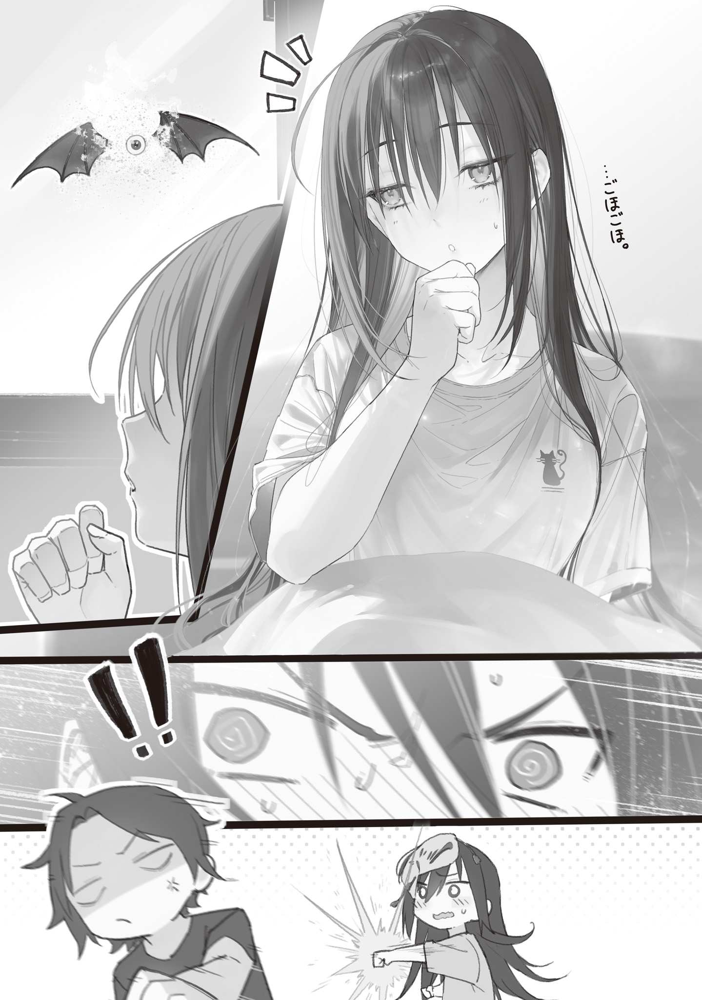

Toward evening, I finally made it to the Bunkyo Ward Office on my bicycle, towing the Blue Witch behind me in the cart.

The security force had barricaded the front of the ward office and stood guard behind it, wands and crossbows at the ready. There were no bodies in front of the barricade, at least, but the bloodstains hadn't all scrubbed out, and the lingering smell of blood and char told of a vicious fight.

I hesitated. Wouldn't they kill me if I got any closer? Then I spotted a woman inside the barricade, near the ward office entrance, with guards protecting her. She was holding a sign that said "Person at 9:33 AM" and looking around anxiously.

Well, that was easy to follow. Apparently she was the one I was supposed to hand it to.

I got off the bicycle, picked up the pail, and headed for the woman with the sign. At once, the whole security force trained their wands and crossbows on me and challenged me.

"Who goes there! State your name and business!"

The shout was sharp and murderous, and my stomach knotted up.

I was too scared to even speak, so I just pointed at the sign with a shaking hand. The woman had the security force lower their weapons and waved me over.

I went up to hand her the pail, which was full of the Flower Witch's antidote, and she spoke in a voice caught between worry and hope.

"I'm terribly sorry, but I need to confirm something. Can you tell me who the letter was addressed to?"

"To whoever is standing at the entrance of the Blue Witch's home at 9:33 AM on February 8, 2028."

"Ah! Th-Thank you so much. Thank goodness, we made it in time...! Sergeant Sasaki, take this to Foresight-sama right now! Hurry! We absolutely cannot let him die!"

"Roger!"

She immediately passed the pail to a burly man, who gave me a crisp salute before running off into the ward office.

"Um, is Professor Ohinata alive?"

I asked nervously, and the woman gave a big nod.

"She's in the same intensive care unit as Foresight-sama. Thank you so much. If this had dragged on until nightfall, we never would have made it in time. If... if that had happened..."

Partway through, her voice turned tearful, and she sank limply to the ground and started bawling.

The security force exchanged looks. A few of them were tearing up too.

I'd had a hard time of it, but apparently so had they.

I mean, there were obvious signs that rioters had stormed the place at least two or three times. Good work out there, guys.

Anyway, mission complete.

Foresight and Professor Ohinata were supposedly okay, and Professor Handa was probably fine too.

My job was over. I could leave the rest to them.

As I turned to go, a voice called after me.

"Wait! What's your name!?"

I didn't answer, of course. I tugged my hood back down over my eyes, then silently climbed onto my bicycle and rode off with the cart in tow.

The less I talk, the easier it is on my stomach.

I brought the Blue Witch back to Ome and started nursing her at her house.

The mushrooms that had infested her were dead, but she'd only just been pulled back from the brink. She was badly weakened and wouldn't wake up.

Lying still on the bed, the Blue Witch looked half dead. Talking to her got no reaction, and neither did pulling her cheeks or tickling the soles of her feet. I started to worry that she would just keep getting weaker until she died.

I'd heard that even after a successful operation, some people died from secondary infections, or their strength gave out and their hearts stopped.

Surely not, but... what if the Blue Witch was already so weak that getting rid of the mushrooms had come too late...?

For a whole day and night, I changed her ice packs, wiped off her sweat, and kept watch in case she took a sudden turn. But twenty-four hours went by without her getting any better, and I ran out of patience.

Flower Witch! That medicine was the real deal, right?

I saved your daughter. If you turn around and fail to save my friend, I'm gonna lose it. That's not what we agreed on.

I made up my mind to go file a complaint with the Flower Witch.

She said to drop by sometimes.

She said she'd welcome me.

I don't need a welcome. Just give me some more medicine or something. A nutrient tonic, maybe.

Normally, I probably should have brought the patient along to be examined. But she needed rest, and I was scared that moving her carelessly would make her worse. The Flower Witch was the only one in Tokyo who could come up with a countermeasure for mushroom disease, and I wanted her opinion, including on whether it was even safe to move her.

In the dead of night, when it was dark and hardly anyone was around, I snuck back to Tokyo Bunka Kaikan in Taito Ward, where the Flower Witch lived.

Unlike last time, sentries with torches stood in front of the barricade of wrecked cars ringing her territory, so I had to crawl up on my belly and squeeze in through a gap between the wrecks.

The sentries probably would have let me through if I'd just talked to them. But clearing a stealth mission was way easier than that kind of hard labor.

The Flower Witch's sanctuary at the base of the huge, mystical white tree hadn't changed at all since the day before.

In the large room at the heart of the Bunka Kaikan, the ceiling had caved in and rubble littered the floor. Rain had blown in and soaked the floorboards until they rotted through, and roots bursting with life poked up through the cracks.

At the center of that natural sanctuary, the Flower Witch gently cradled her peacefully sleeping daughter plant. Even at midnight with no moon, the glowing lichen that clung to the walls bathed the sanctuary in a soft, dreamlike light.

I tiptoed into the room, and the Flower Witch turned my way with an alluring smile.

"How nice of you to visit. Have you come to see this child's face?"

"No, I'm not interested in that one. Um, the Blue Witch isn't waking up. Does that medicine actually work?"

I got straight to the point, and the Flower Witch went quiet for a while.

Then, after a pause, she carried on as if nothing had happened.

"You came to see my cute, cute daughter plant, didn't you?"

"No. The Blue Witch's mushroom disease is cured, but she isn't waking up, so I only came to file a complaint. That's not what we agreed on, is it?"

I glared as hard as I could at the base of the giant flower to put the pressure on, and the Flower Witch heaved a big sigh and answered reluctantly.

"It seems she was infested quite deeply, so she won't wake up that quickly. There's nothing strange about that. Even a witch can't be up and running around the day after nearly dying."

"But she's the Blue Witch, you know? She's hands down the strongest witch there is. She's tough, and she should recover fast too. If there wasn't anything wrong with the medicine you gave me, couldn't you give me something like a nutrient tonic to get her back on her feet faster? Her color's good, but she doesn't react when I talk to her, and it's making me nervous."

"...You really do treasure the Blue Witch. Very well. If you insist, I will make you a nutrient tonic. She's likely not waking because she's so weak, so once she's properly nourished, she should wake up soon enough."

Wood creaked and groaned overhead, and a thick branch of the huge white tree came down through a hole in the ceiling.

A crack ran along its bark and opened like a creature's mouth, then spat out the corpse of a monster that had to be a good three meters long.

It looked like someone had stuck a dog's head and a cat's head onto a rabbit and blown it up to the size of an elephant. The burly creature's silent corpse tumbled onto the floor with a heavy thud in a mess of sticky slime, and my legs calmly and composedly gave out.

Hmm. Scary as hell.

Would you mind not suddenly serving up a hulking monster that could one-shot me right in front of my face? Even if it is a corpse.

My legs were shaking so badly I couldn't stand, and the Flower Witch giggled, lifted me up with her vines, and set me in a wooden chair.

"It's only a corpse, you know? How timid you are."

"Fear and shock just temporarily paralyzed my cerebral cortex, so my body went limp. That's all."

"In other words, your legs gave out. That's what we call being timid."

"...Guh."

Beaten down by pure logic, I shut up, and the Flower Witch started making the nutrient tonic, explaining as she went.

"This whitewood is my storehouse. When I'm full and can't take in any more nutrients, I keep corpses stored in it."

She caught the bizarre chimera monster in a tangle of roots and squeezed it tight.

The thick, brawny roots throbbed like blood vessels, and in no time the monster had shriveled into a bone-dry mummy. Then even the mummy was crushed, rolled into a ball, and drained away completely by countless roots.

"Eek."

She sucked it up without even leaving a corpse behind. Terrifying.

I'm glad the Flower Witch is on my side.

Wait, is she, though...? It feels like she does an awful lot purely for her own convenience.

Well, she isn't an enemy, so I guess that's good enough.

Then again, strictly speaking, I was pestering her for aftercare that wasn't in our contract, so we were both in it for ourselves.

The Flower Witch bundled together the roots that had absorbed the monster and reshaped a branch into a bottle, then began dripping a blood-red liquid into it. The drops falling from the root tips gave off a distinctive fragrance, the kind you'd almost want to call the scent of life.

"There's no better nutrient tonic, for magic power or for health. The Blue Witch can drink it all at once. You mustn't drink it, though, all right? It would work too well."

With that, she corked the bottle and handed me the special nutrient tonic.

I was so grateful. With this, the Blue Witch would be better in no time. So, so grateful.

"Thanks! That really helps."

My legs still didn't have much strength in them, but I forced them into action and wobbled to my feet, and the Flower Witch gently brought her vines over to support me. How kind.

"Take good care of the Blue Witch. As long as she values you, she will return the favor."

"No, we're friends. It's not like I'm being nice to her to keep score."

All I'd said was plain common sense, but the Flower Witch seemed caught off guard. The vine supporting my waist loosened and writhed slowly, as if confused.

Hang on. That reaction... Don't tell me what I thought was common sense isn't actually common sense?

Not that I thought breaking with common sense was bad, but knowingly ignoring it and simply not knowing it were two completely different things.

The shame of asking lasts a moment; the shame of not asking lasts a lifetime.

So, nervously, I asked her.

"I'm new to this whole friend thing, so I don't really get it, but... wouldn't you nurse a friend who got sick too, Flower Witch-san? Or is taking care of a sick friend not normal...?"

"I wonder."

The Flower Witch sounded melancholy.

"Selfless friendship like yours must be a wonderful thing. But ever since I took this form, I've lost any sense of it. I can pretend to understand, but the feeling at the root of it is gone.

"Family or not family. Useful or not useful. That's the only yardstick I can measure anything by now."

"...? Isn't that a good thing?"

I didn't get why she said it like it was a bad thing, and I tilted my head.

"Having clear values and drawing clear lines is a virtue, isn't it? There are tons of people out there with double standards, who say life is precious and then turn around and say anyone who doesn't value life should die. Isn't somebody who makes sound calls based on their own ego and acts rationally better than someone who plays the good guy and waves lofty ideals around, then does whatever the hell they feel like in the moment? I dunno, though. There are limits, and it depends on the situation."

Somewhere in the middle I stopped being sure of my own argument, so I tacked on a wimpy disclaimer to cover myself and wrapped it up.

I toddled around, struggling to get the feeling back into my limp legs, and the Flower Witch stayed silent beside me for a long time.

By the time the feeling had come back and I could walk properly again, she spoke gently.

"If you and the Blue Witch ever have a falling-out, come running to me. I'll protect you."

"No, I'm good. If we fight, we'll just talk it out and make up."

Running away after a fight makes no sense. She's not my enemy. We can just talk. Why would I need to run away?

Nothing the Flower Witch said made much sense to me.

I thanked her once more for the nutrient tonic, slipped out of her territory before dawn, and went back to Ome, where the Blue Witch lay sleeping.

Sleeping Beauty (peerless under heaven) was lying on the bed, and when I dumped the whole bottle of nutrient tonic into her mouth, she immediately choked on it. The Blue Witch, who had slept through everything, woke up in under a minute.

"!? That kicked in fast as hell! What is this, some kind of dangerous drug?"

The stuff worked so absurdly fast that it circled back around to scary, and I was checking the bottle for a label or something when the Blue Witch spoke up, slow and hoarse, her eyes barely open and her throat raw.

"Hey... What did you make me drink...? It feels like I drank a hundred nutrient tonics at once..."

"That's about right. Morning. Want anything?"

"...Water."

I brought her water like she asked, chilled it with basic freezing magic, and helped her drink. The Blue Witch let out a contented breath and fell back asleep.

Once she'd woken up that first time, she slowly got better, drifting in and out of shallow sleep.

The second time she woke up, she just sat on the bed in a daze, so I made her rice porridge, blew on each spoonful to cool it, and fed it to her. She ate half of it with painfully slow movements, then fell asleep again as if just moving her mouth had used up all her strength.

The third time, she polished off a whole bowl of porridge and groggily asked whether Professor Ohinata was safe.

Then, a full day after the nutrient tonic, she woke up for the fourth time, and this time her head was clear.

I came into the room with an ice pack I'd made with freezing magic and found the Blue Witch sitting halfway up in bed, looking sulky.

"Why weren't you in the room?"

"Huh? Well, you were asleep."

"Weren't you taking care of me? I was wondering where you'd gone."

"Do I really need to be in the room the whole time? You were asleep, so it doesn't matter where I was."

She'd made it past the worst and was recovering smoothly, so there was no need for me to stick by her side every second anymore.

If she was asleep, she wouldn't know whether I was in the room or not. And yet she was telling me to stay in the room the whole time. I wished she wouldn't make such unreasonable demands.

I had plenty of other stuff to do too, you know: sleeping, eating, going to the bathroom, taking baths, reading manga, popping the Bubble Wrap-kun I'd found in the closet.

I'd made a perfectly reasonable point, but the Blue Witch looked unhappy.

"That's not the point. Ori, you're so col... Ah, no. I haven't thanked you yet."

"Huh?"

"You saved me, didn't you? Thank you."

"Don't mention it. You're always saving me."

I laid her back down as I said it and swapped out the ice pack on her forehead.

The Blue Witch narrowed her eyes contentedly, then suddenly touched her face, looking puzzled.

It hit her, and she apologized.

"Sorry. I wasn't wearing my mask."

"Oh, good of you to remember. But you can go without it until you're better. It's hard to breathe with it on, right?"

"Really? Honestly, that's a relief."

The Blue Witch smiled weakly.

Seeing the Blue Witch so weak gave me a weird feeling. Or really, it was her bare face that had me on edge. I'd gotten way too used to the mask.

I took a good, long look at her unmasked face for the first time in ages.

She really does have a great face. Even pale and worn out, she looks like some tragic beauty, which is just unfair. Downright dirty, even. Her features are so perfect that they're intimidating.

"What are you looking at?"

"Nothing. Just thinking you've got a really nice face."

"...Your face is nice too, Ori."

"That's where we disagree. I'll go make food. You're hungry, right?"

When I started to step away from the bed, the Blue Witch reached out for me, so I took her hand and tucked it back under the blanket.

Daddy's going to go make you porridge now! Stay warm and be a good girl and sleep! You're not a little kid anymore, so you can stay in a room by yourself, right? Honestly!

I kept nursing the Blue Witch for another week.

Even with a witch's superhumanly tough body, it took a week before she could run around outside again. That told you just how brutal mushroom disease was once it turned severe.

From the first day she properly woke up, she'd stubbornly insisted on going to the bathroom and taking baths by herself, so I got the feeling a lot of it came down to willpower. Then again, if you need willpower just to go to the bathroom or take a bath, that's a pretty big problem.

Anyway, now that she could run around, she was in the clear. She'd gotten her magic-power control back, could use magic again, and didn't have any particular aftereffects either.

Originally, I'd only come over to the Blue Witch's house to hang out. I'd never planned on staying over to nurse her. I tidied up the house, which I'd messed up a bit, and got ready to head back to Okutama.

I was worried that wild animals or monsters might have eaten the yamame trout I'd released into my fish pond. I had a feeling I'd been sloppy with the net, too.

I was all packed and putting on my shoes in the entryway when the Blue Witch poked her head out of the living room.

"Are you going out?"

"Hm? No, not going out, exactly. Going home. You're better now, right?"

"...Cough, cough."

"!? Hey, are you okay?"

The Blue Witch suddenly started coughing and staggered, so I rushed over to hold her up.

I'd thought she was completely better. Could she actually be relapsing?

I led her back to bed by the hand, and she lay down without a fuss.

Her color looked good, but apparently she still couldn't push herself. Maybe running around yesterday had actually set her back.

"You hadn't coughed at all until now. Did you catch some other cold while you were weak? Any fever? ...Nope."

"My body feels heavy. It's hard even to stand. Cough, cough."

"H-Hmm. Maybe I'd better stick around a little longer?"

The Blue Witch nodded, looking just a little happy about it.

But the next moment, she glanced out the window, and her expression changed.

An eyeball familiar (not mine) was bobbing outside the window, staring straight at us.

"Y-You little...!"

The Blue Witch sprang out of bed, dashed to the window, flung it open, and drove a fist of absurd destructive power into the eyeball, smashing it to smithereens.

Hey.

Hey!

"You're totally fine!"

"Uh. No, this is... But the Eyeball Witch..."

"You just conned me into doing your chores! I'm going home! Get well soon!"

I shoved her mask onto the flustered Blue Witch's face, put my shoes on for real this time, and left.

Geez, seriously. Faking weakness to stick me with the housework. What a shameless woman. Being waited on hand and foot must've been real comfy, huh!?

Well, she'd nearly died, so a little pampering was fine. But I had no intention of looking after her forever.

As of today, it's back to business as usual.

I'll leave all the negotiations with outsiders to you. I'm going all in on my hobbies. I got all kinds of ideas while I was nursing you.

---

Sure enough, when I got back to Okutama, the fish pond had been raided. The net over the artificial pond had been pushed aside, and every last yamame trout I'd stocked as winter food was gone. I totally lost it. Unforgivable, seriously. Those damn animals...!

The Lost Mist the Blue Witch had cast over Okutama kept intruders wandering, but it couldn't shut out a hundred percent of them. Every so often, an animal that got lost enough in the mist would stumble onto my house by pure chance.

I griped about all that to the Blue Witch through our eyeball familiars, and she filled me in on the news that the pandemic was winding down, which she'd picked up from the Eyeball Witch's familiar.

The antidote I'd delivered to the Bunkyo Ward Office had been properly diluted, rushed all over Tokyo, and sprayed. Foresight and Professor Ohinata had both pulled through. Professor Handa had apparently only had a mild case to begin with (the Department of Gremlin Engineering had comparatively many mild cases).

The infection was expected to have spread to survivor communities around the country too, carried there by the fertility-magic teachers who'd relocated to them. So the Dragon Witch agreed to deliver the antidote nationwide, in exchange for the giant kaiju's huge Gremlin kept at the Magic University.

Magic was supposedly less widespread among ordinary people outside Tokyo than inside it, so there were probably fewer severe cases out there. Even so, the antidote the Dragon Witch delivered must have saved a lot of people.

But not everyone made it.

The Itabashi Witch, the Sumida Witch, the Hachioji Witch, an associate professor from the Department of Magic Linguistics, and a professor from the Department of Mutation Studies all died before treatment could reach them.

The Tobacco Witch herself barely pulled through, but apparently every one of her trusted subordinates had died, and she wasn't taking it well. Plenty of other key figures had died too.

In Shinagawa Ward and Setagaya Ward, as bad luck would have it, powerful monsters had shown up as if to take advantage of the security force and the witches being down, and the death toll there was said to be staggering.

It had been a week since they'd started spraying the antidote. Most people with severe cases had either been treated or died, but the antidote still hadn't reached everyone, and a small number of people were coming down with it after a delay.

One trait of mushroom disease was chain-reaction onset. When one person sprouted mushrooms from their head, even people nearby who had only just been infected would start developing symptoms one after another in response. That was why the pandemic had exploded all at once, but the wave of chain-reaction onsets still hadn't completely passed. We'd need to stay on high alert for a while yet.

The government was in chaos and barely functioning, but based on the information gathered so far, the final death toll from this pandemic was apparently expected to reach 500,000 to 700,000 in Tokyo alone.

Before the pandemic, Tokyo's population had been about 2.8 million. That meant a single disease had killed 20% of the entire population in just under two weeks. Terrifying.

It was an insensitive thing to think, but I couldn't help being glad that neither I nor anyone I knew was part of that 20%.

In terms of sheer scale, the plague, said to be the worst epidemic in human history, was probably worse. The notorious Black Death killed people by the tens of millions in a single outbreak. But that took a year or two and spread across vast regions with enormous populations, like Europe and China.

Considering that mushroom disease had done its damage in an area as small as Tokyo, over a span as short as two weeks, it was every bit as destructive as the plague. And that was with a mage who could see the future holding the damage down. Without Foresight and the Flower Witch, Japan, which still hadn't fully recovered from the Gremlin Disaster, would have been finished off, and civilization would have slid all the way back to hunting and gathering. It wouldn't have been strange at all for more than 90% of the population to die.

Tokyo's recovery had finally been picking up steam, and then it took a brutal punch square in the nose and got knocked way back.

Some people had only just clawed their way up from the rock bottom of the Gremlin Disaster, and when everything they'd worked so hard to build was wrecked and taken from them, they lost the will to go on.

But the Eyeball Witch had this to say:

True, humanity had been pushed a long way back.

But not everything we'd built was lost.

Even if we'd been pushed back two steps, we'd taken three steps forward.

All we could do was keep moving forward, enough to outpace the steps back.

The moment we stopped walking would be the real end.

Nice words couldn't bring back the lives that were lost, but they were some comfort.

The Eyeball Witch was famous for her social skills, and sure enough, she had a way with words.

I was moved too. Self-help books never did much for me, but coming from a witch who was desperately struggling along in a world that had actually collapsed, those words hit home a little.

That's right. Let's keep moving forward.

As far as I personally was concerned, I'd been lucky enough to lose nothing this time. You could say getting back up from where I'd fallen would be easy.

And I never get up from a fall empty-handed.

Let's make something that puts what I went through in this pandemic to use, so I can say I got something out of it too.
