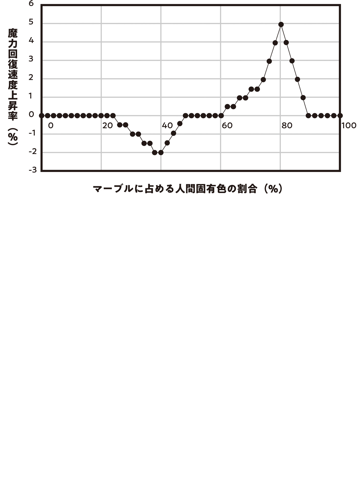

If you want to get something from an enemy, first you have to know your enemy.

I didn't want this mushroom biohazard pandemic to end up as nothing more than a disaster, so I started researching the mushroom that had grown out of my head.

Obviously, we'd be far better off without wars, disasters, or epidemics, but they could still teach us things.

Wars advanced science, every disaster improved preparedness and prediction, and epidemics advanced medicine. I wanted this pandemic to do the same.

Apparently, the medical teams in each ward of central Tokyo were throwing themselves into autopsies and the like to work out how the disease worked and keep it from happening again. I wanted to make this mushroom useful to me in my own way too.

Specifically, I was hoping I could use the mushrooms to make magic-sealing wands, magic-power suction wands, or self-repairing wands.

Severe-type mushrooms sealed the magic of whoever they parasitized.

If you tore one off, it rapidly sucked up magic power and stamina and regenerated at super speed.

If I could work out the principles behind that and apply them to making wands, the possibilities would be limitless.

To be safe, I set up an isolated dissection tent in a corner of the backyard and started with the human-faced mushroom, the one that made my skin crawl.

Its basic structure was like an ordinary mushroom's: a cap with gills on the underside, and a stalk running down from the cap, its base sending mycelium out into the host.

But when I split the stalk open, I found a fibrous mass inside that almost looked like a heart. Creepy.

Was it an animal? A fungus? No idea. The university's Department of Monster Studies would probably investigate that part.

When I opened up the fibrous heart, I found a single tiny, tiny Gremlin buried inside.

Since it had a Gremlin, this mushroom was definitely a kind of monster. Animal monsters were common, and plant monsters showed up sometimes too, but this was my first time meeting a fungal monster. Or a Gremlin from one.

I picked it out with tweezers. As usual, it was nearly spherical, about 0.1 mm in diameter. Smaller than a flea.

But once I set it in a petri dish and took a good look, I could see exactly what made it special.

The mushroom's Gremlin was striped in uneven bands of milky white and gold.

I'd never seen a marbled Gremlin before. Interesting.

Every Gremlin I'd seen so far had been one solid color.

Gremlins grown on electricity were a plain milky white, the exact same shade as one of this mushroom Gremlin's two colors. Gremlins from monsters came in all kinds of colors, but each one was still a single solid color.

Some magic stones had impurities in them, but overall, they were one solid color too.

And yet this thing was marbled: a newly discovered, rare type of Gremlin.

Was the marbling special to this one? Or did every mushroom have a marbled Gremlin like this?

A single mushroom off my head wasn't enough to tell, so I sent a letter to the Foresight Mage through the Blue Witch, though I felt bad asking when she'd only just recovered, and got him to send me fifty mushroom samples.

Half came from mild-type patients, and the other half from severe-type patients.

The Gremlins from the mild-type and severe-type mushrooms were noticeably different sizes.

The mild-type ones were 0.1 mm.

The severe-type ones were 0.5 mm.

The results split very cleanly between the two groups. Severe-type mushrooms sucked up magic power far more intensely than mild-type mushrooms, so the difference in how much they absorbed probably showed up in the Gremlins' size. If anything, the size difference could've been even bigger.

Mild type or severe type, the Gremlins were all marbled.

Each had two colors. One was always milky white, and the other was random.

I lined up all fifty-one marbled Gremlins, but I couldn't see any real pattern in the colors.

My guess was that the different marbling colors came from the host's blood.

Back during my melt-recast Gremlin experiments, I'd figured out how to dye Gremlins.

Monsters' Gremlins got their color from some component in the monster's blood.

What if it was the same for humans?

What if some component in human blood traveled up the mycelium the mushroom used to suck nutrients out of its host, and showed up as color in the Gremlin?

Then, of the marbled Gremlin's two colors, the fixed milky white would come from the mushroom.

The other, random color would come from the blood of its human host.

That added up.

To test the hypothesis, I made a syringe, drew my own blood, mixed it into a melted, electricity-grown milky-white Gremlin, and let it solidify.

The recast Gremlin came out gold.

The marbled Gremlin from the mushroom that had grown out of my head was striped milky white and gold.

I compared them side by side, and they were exactly the same color.

Woo-hoo! Bullseye!

Nothing feels better than nailing a hypothesis dead-on like this!

I was starting to get carried away, but I talked myself down and went to get one more sample to be safe.

With only one data point, it could just be a coincidence. Naturally, I asked the Blue Witch to be the donor.

Not even a month had passed since the Blue Witch had hovered between life and death.

She'd have been well within her rights to refuse when I asked for her blood, but she didn't seem to mind at all. She answered my summons through the eyeball familiar and came all the way out to Okutama to donate.

The Blue Witch rested her arm on a towel spread over my workbench, but when I came at her with the syringe, she went rigid.

What are you, a kid?

"It's okay, it'll be over right away~. Okay, you'll feel a little prick~. All done~. Keep the cotton pressed there for a while, okay~."

"!? I-Is it over? Already? I don't think I even felt the prick."

"I'm dexterous."

"That's not a catch-all excuse, you know. Well, fine."

Being dexterous wasn't the only reason I'd pulled off a painless blood draw on the Blue Witch, though. I'd just gotten the knack of it while drawing my own blood. ...No, maybe that did just mean I was dexterous...

Once I'd drawn her blood, I had no more use for the Blue Witch, but she said she wanted to watch, so I let her sit beside me while I melted and recast the Gremlins (plus blood components).

She didn't say much and really did just watch, but it made for a calm, nicely relaxed stretch of time.

The melt-recast Gremlin I took from the reverberatory furnace had come out a vivid, beautiful blue. Hmm. Just as I thought, the blood's color seemed to show up in the Gremlin. Monster, human, or witch, blood components colored Gremlins. But when I'd tried it with wild crow blood, no color had come out... There seemed to be some kind of rule at work here.

That caught my interest too, but right now, my research was about the mushroom's marbled Gremlins. I kept my focus and didn't go off on a tangent.

Next, I'll try mixing two colors of Gremlin into one marbled lump. At least on the outside, that should make it look like a mushroom's marbled Gremlin.

They'll be melted and recast, so they'll probably lose their function as magic-activation media, but just comparing artificial marbled Gremlins to natural ones is bound to teach me something. Like how the marbling mixes. I've also got a feeling they might be brittle along the boundary between the two colors.

I fired up the furnace again and was melting two pairs of Gremlins, white with blue and white with gold, when the Blue Witch spoke up. She'd been sitting on a stump, thinking about something.

"About the Gremlins you colored with blood."

"Hm?"

"They're the same color as our eyeball familiars. Mine are blue, and yours are gold, right?"

"...Huh. I guess they are?"

I thought back for a moment, then nodded.

Now that she mentioned it, she was right.

Eyeball-familiar magic varied from person to person.

When I cast it, I got golden eyeballs that looked like cat's-eye gems.

The Blue Witch's familiars were bluish eyeballs that looked almost sickly.

Apparently, the Eyeball Witch's familiars were a different shade from ours too.

Hmm. Eyeballs have blood vessels running through them. And going by the wording of the eyeball-familiar incantation, it would make sense if a familiar's color reflected its caster's own blood—their personal magical color.

We talked about how the same spell differed from caster to caster while I tended the reverberatory furnace, and eventually I pulled out the finished marbled Gremlin prototypes.

I'd taken them out too early, so the rapid cooling had cracked them, but both the white-and-blue and white-and-gold marbling had mixed more or less the way I wanted.

Hmm. A slightly shorter heating time would probably give me cleaner stripes.

I was holding one of the finished marbled Gremlins in the fire tongs and checking it from every angle when the Blue Witch suddenly reached over and snatched it.

"Hey!"

"Wait. This is... This is...?"

"What? What is it? Spit it out."

"Quiet. I'm checking right now."

That was all she said. Then she just stood there, frozen, pinching the Gremlin between her fingers.

I waited, getting a little irritated.

She was apparently checking something, but what was it supposed to be? Had something clicked for her?

She kept me waiting a good ten-plus minutes before she finally rebooted and handed the Gremlin back.

"Sorry, I was manipulating my magic power. I checked, and it looks like this accelerates magic-power recovery."

"Accelerates magic-power recovery?"

That caught me a little off guard.

It has a recovery-boosting effect? This thing? Like a healing power stone?

Sure, I'd run this whole series of experiments hoping to find some kind of effect, so the fact that it had one didn't surprise me.

But not magic-power absorption, magic sealing, or self-repair? Magic-power recovery acceleration?

Not what I expected.

"How, exactly?"

My curiosity piqued, I pressed her for details, and the Blue Witch pointed at the two marbled Gremlins, white-and-blue and white-and-gold, as she described what she'd sensed.

"It's doing something odd to the flow of magic power. That white-and-blue marbled Gremlin with my blood in it accelerates the recovery of my magic power. Magic power flows like this..."

The Blue Witch traced her fingertip through the empty air like she was conducting an orchestra, then gave up on explaining halfway.

"No, there's probably no point explaining it like this to someone who can't sense magic power. Anyway, if I have the white-and-blue marbled Gremlin, it definitely accelerates my magic-power recovery. It's just going by feel, but I'd put the increase at around 2–3%.

"But if you hold the white-and-blue one, Ori, it doesn't speed up your magic-power recovery. The one accelerating yours is the white-and-gold."

"Huh. So if you carry a marbled Gremlin with your own blood in it, your magic-power recovery goes up?"

I rubbed my chin as I boiled it down, and the Blue Witch nodded.

"Strictly speaking, you don't need to have it on you. If the marbled Gremlin is near you... within one or two meters, it should have an effect."

"So my magic-power recovery speed is up right now?"

"Yeah."

"...I don't feel anything..."

"No, I can tell. It's slight, but your recovery speed is up. No question."

The Blue Witch said it with total certainty.

She can say that all she wants, but I seriously can't tell. My magic-power recovery speed is supposed to be up, and I don't feel anything like it.

Well, she did say it's only up 2–3%, and humans can't sense magic power in the first place, so there's no way I'd ever feel a boost in recovery speed anyway.

If the Blue Witch hadn't been here, I might never have noticed this effect in my life. Good thing I called you over, Blue Witch.

I rolled the marbled Gremlin around in my palm and thought it over.

Faster magic-power recovery isn't just interesting. It's a seriously valuable effect.

If the magic power you spend comes back quickly, you can keep firing off spells even with a small magic-power capacity.

But a 2–3% boost? Seriously, that's cold comfort.

...No! Maybe the recovery rate is low because the marbled Gremlin has cracks in it.

There's a real chance a bigger Gremlin would push the recovery rate up. With Gremlins, bigger is always better anyway.

It's too early to be disappointed.

I've got a foothold for profiting off mushroom disease, the very embodiment of disaster.

All that's left is data. Gather data. Do that, and things will start to become clear.

Over the next month or so, I made a huge batch of marbled samples in the reverberatory furnace and compiled the statistics.

The data showed that carrying a marbled Gremlin mixed with your own blood raised magic-power recovery speed by up to 5%. The marbling's colors made no difference, and the increase was the same for witches and humans.

The factor with the biggest effect on the increase was the mixing ratio of milky-white Gremlin (electricity-grown Gremlin worked for this) to personal-color Gremlin. A 2:8 ratio maximized recovery speed. The ratio was what counted. How the marbling was mixed and how big the Gremlin was barely mattered.

Mixing them so thoroughly that the marbling disappeared, or making them smaller than 0.1 mm, killed the effect. But as long as you could still make out the marbling and the Gremlin was at least 0.1 mm, recovery speed went up 5%.

Cracks in the marbled Gremlin didn't affect magic-power recovery speed either. As long as it didn't break clean through, a few cracks seemed to be fine. Shape didn't matter at all.

In the end, even after all my improvements, the effect was tiny. But faster magic-power recovery was never going to hurt, and building it into a wand would boost the wand's performance. A 5% increase was a drop in the bucket for ordinary people, but for anyone with the insanely huge magic power of a witch or mage, it was nothing to laugh at.

But I decided not to embed a marbled Gremlin in a wand.

It just didn't seem like a good fit. Mainly from a design standpoint.

No matter how I looked at it, using the marbled Gremlin on its own would give me far more design options than sticking it in a magic wand.

So instead of putting it in a wand, I'd work the marbled Gremlin into accessories like rings and necklaces.

Changing its size and shape didn't improve magic-power recovery speed, but flip that around and it meant I could make it any size and shape I liked. I could turn it into an amulet of any design I wanted.

Cramming every function into a wand wasn't always the answer. Nobody wanted an internet-connected rice cooker that walked on two legs. Functions that should be separate were better off separate.

Besides, a magic wand only had to be in your hand while you were casting, but faster magic-power recovery was worth having all the time. An accessory could be worn constantly and left both hands free, so it came out ahead there too.

As the culmination of all this research, I made a 30 mm white-and-gold marbled melt-recast Gremlin with my own blood. I carved it into a star in honor of Okutameteorite, the meteorite that had started it all for me, a gift from space, and made it into a pendant amulet.

With the amulet around my neck and Okutameteorite in my hand, I struck a pose in front of the workshop mirror and basked in how cool I looked.

Nice! Really nice! I look like a total mage!

And it wasn't just cosplay. The amulet and the magic wand both had a real purpose and real magical abilities packed into them. There were principles and ingenuity behind them, and they'd become magic items like this because they were always meant to.

That hit me deep, and it fired up my excitement circuits like crazy.

I was striking pose after pose in front of the mirror and wishing I could take a selfie when the Blue Witch poked me with Cyanos. She'd been dropping by often during the research to help check the amulet's performance with the kind of magic-power control only a witch could manage.

"Where's my amulet?"

"Huh? I didn't make one."

"Why not?"

"What do you mean, why? You hate accessories, right?"

I said it in honest confusion, and the Blue Witch tilted her head.

"No...? Did I say that?"

"Huh? I thought you said something like that back when I gave you an accessory."

"? I don't remember."

"Didn't you?"

We both tilted our heads.

Well, if neither of us remembered it clearly, one of us had probably just misremembered.

"Oh, is that why you kept giving Kei-chan accessory prototypes as presents? Because you thought I hated accessories?"

"I got that wrong? Huh?"

"I don't remember saying anything like that at all... Ah? ... No, well, I've never said I hate accessories. Yeah. If you'll make an amulet for me, Ori, I'll gladly accept it."

I didn't really get it, but apparently the Blue Witch's accessory slot was open.

In that case, I'd be glad to make her one.

Part of me also wanted her to look like a witch if she was going to call herself one. When we first met, all she'd had was an unprocessed magic stone clutched in her fist.

And now she was carrying a magic wand and about to equip an amulet? That girl with the pathetic gear was all grown up. Sob sob sob.

Using a white-and-blue marbled Gremlin made with the Blue Witch's blood, I made a six-petal snow-crystal pendant amulet and gave it to her.

A six-petal snow crystal was the shape a snowflake took as its icy branches grew, displaying the artistic harmony between nature and cold. It was a fitting design for the Blue Witch, who used ice magic.

The Blue Witch seemed to like the amulet I had made just for her. She hooked a finger through the pendant at her neck and twirled it round and round, looking pleased.

Glad it went over well.

As the fruit of more than a month of research, the amulet was a little underwhelming for something gained from a disaster as ridiculously huge as the mushroom pandemic.

Then again, you could say the weird ones were my earlier results, like the massive magic amplification from multilayer processing and the 85% cut in magic backlash.

That was how things normally started.

At first, cars were slower than horses.

At first, airplanes could only fly for one minute.

But technology advanced.

The amulet might top out at a 5% boost to magic-power recovery speed for now, but I believed its performance would climb to 10%, then 50%, someday.

And I'd dump all the research needed to get it there on the Magic University.

Because gathering data all by myself was exhausting. This kind of thing wasn't my job. It was the university's.

Word was the university would resume classes next month, so it was probably about time I could get away with tossing them more work.

Now then, I'm going to take a breather and have some fun making a freaky magic wand[^1] shaped like a seven-branched sword.

The rest of the amulet research is all yours. Good luck!

## Translator Notes

[^1]: The seven-branched sword is an ancient ceremonial sword with six side branches off a central blade; the source invokes its distinctive shape for the wand's design.
