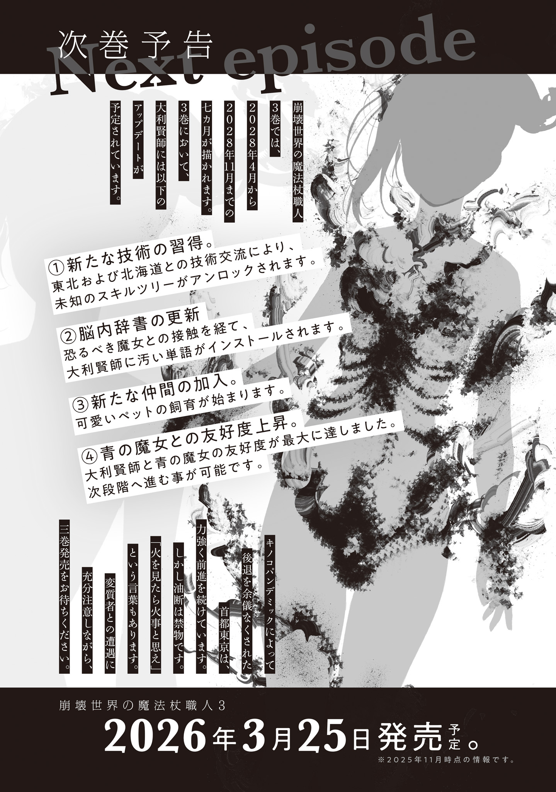

The Hinonoya family had been patrons for generations.

Generation after generation, this wealthy family had found talented people trapped by poverty, supported them generously, and led them to success.

The oldest record on the scrolls in their storehouse traced the tradition back to around the Edo period. They had nurtured celebrated tea masters, writers, designers, singers, and more, helping them make their names.

They were a noble family who truly loved great art and found joy in supporting and sharing it.

But to Hinonoya Takuo, the family's last survivor, they were just hardcore fans.

They loved running around hyping up their favorites—“Isn't this incredible? Look, look!”—then smugly taking credit once the artist got popular: “I raised this artist.”

Patrons, philanthropists, investors—who are you kidding? Quit dressing it up with fancy titles, you out-of-touch idiots! Takuo had railed at his parents that way, but now he was all alone.

The Gremlin Disaster had struck everyone alike, regardless of status or beliefs. With so many old families wiped out entirely, the Hinonoyas were lucky to have even one survivor to carry on the line.

Takuo had a favorite artist too.

It was OK Workshop.

OK Workshop was the handle of a craftsman active on an online auction site before the Gremlin Disaster. They used the same name on social media too.

Their real name, age, gender—everything was a mystery.

They'd exchanged messages over the dozens of auctions Takuo had won, but every reply from OK Workshop read like a stiff business template scrubbed of all personality. He couldn't even get a sense of what they were like.

All he had learned from those mechanically polite messages was that OK Workshop was probably not a child, but an adult who knew how to write properly. That was it.

OK Workshop was practically a digital fairy, with no hint of a life offline. When the Gremlin Disaster silenced the communications network, Takuo lost every way of finding out whether they were safe.

The sense of loss was terrifying.

He wasn't asking for luxuries like seeing an OK Workshop masterpiece again. He just wanted them to be alive—to have somehow escaped danger and be living in good health and at peace.

But where could he even direct that wish? He couldn't throw money at his favorite craftsman anymore: no bank transfers, no sending supplies through a wish list. What a nightmare!

OK Workshop, please still be alive.

Takuo had wished that for the four years since the Gremlin Disaster began.

But four years was a long time.

The long, long lists of missing people at Tokyo ward offices and administrative centers had countless names crossed out in black. In plenty of districts, they'd stopped posting the lists altogether.

After mourning his family, Takuo had tried to track down OK Workshop, the person whose survival concerned him most. But this was an eccentric craftsman who had never shown their face; their entire relationship had been online.

A stint of cyberstalking had narrowed their location down to somewhere around Tokyo, but that still left far too much ground to cover. He had no idea whether they were safe.

Takuo had displayed OK Workshop's unofficial anime merchandise and trinkets in an exhibition room at home. During that first year, looking at them every day had given him the strength to survive those harsh, painful times.

The next year, he had carried an OK Workshop wooden figurine as an amulet whenever he went to tend his hidden rice paddy. He'd planted it in a dangerous area without the Witches' Council's permission.

By the third year, all he did was clean the exhibition room on his days off.

He was spending less and less time on his favorite craftsman.

Yet that hollow feeling in his chest was fading too. For better or worse, time really did make a difference.

He was close to accepting the loss of OK Workshop, the craftsman he'd once been utterly obsessed with.

He didn't want to forget OK Workshop.

That distinct style was one of a kind: incredibly precise, yet somehow full of the warmth of something handmade. He was certain he would never meet another artist who fit his tastes so perfectly.

And yet his memories were fading, and so were the huge-ass feelings that had welled up inside him whenever he picked up one of their works.

There'd been no new OK Workshop releases in nearly four years, which of course meant nothing new to feed his excitement. Even the most passionate fan cooled off without fresh fuel.

Takuo couldn't decide: accept OK Workshop's death—the worst loss in the history of the universe—and find a new favorite artist, or spend the rest of his life treasuring the memories of his all-time favorite.

The turning point came at Tokyo Magic University's open house.

Tokyo Magic University was recruiting students from all across Tokyo. Takuo went to an information session, curious to see what this much-talked-about Magic University was like, and found himself in a huge crowd. He hadn't realized there were still this many people left in Tokyo.

It was said that Tokyo's population had fallen to twenty percent since the Gremlin Disaster.

In his own neighborhood, the drop was plain to see. He'd known Tokyo at its most overcrowded, and he'd felt civilization's decline firsthand.

Some places still had plenty of people.

Many visitors were well into middle age or older, living proof that it was never too late to learn. Research and development had surged ahead thanks to the university's policy of welcoming talent of any age or gender. Now even ordinary civilians were getting magic wands, not just witches. Tokyo Magic University had clearly made the right call.

After looking around the laboratories of the Department of Magic Linguistics, Department of Gremlin Engineering, Department of Monster Studies, and Department of Mutation Studies, Takuo also stopped by the campus store.

The store was bustling too, especially the magic-item section, where people crowded beneath a banner reading, “Now Taking Orders for New Works!”

The store had a wide selection: loose-leaf paper, fountain pens, inkpots, abacuses (perhaps as replacements for calculators), Japanese-bound reference books, scissors, all kinds of tools, hardtack, and more.

Most of Tokyo had been living on rations for so long that seeing a permanent shop instead of a barter market felt strange. The days of twenty-four-hour convenience stores always overflowing with goods already felt like ancient history.

After briefly looking over the products, Takuo grew curious about the banner and squeezed into the jostling crowd.

What could be drawing such a crowd?

He fought his way to the front, nearly getting crushed, and finally saw what all the fuss was about.

Inside a glass display case sat a single magic wand.

The label in the case read, “A new work by the master craftsman who made the president's beloved magic wand, the dodecahedral fractal wand Aleister.”

Takuo took one look at the wand resting on its velvet cushion, and his eyes nearly popped out in shock.

What popped out in place of his eyes was a scream that rang through the campus store.

“Whaaaaaat!? It's by OK Workshop!! A-a new work!? Here!? Aah, a miracle! Thank God! Yes, yes, yes, I'll buy it, I'll buy it, I'll buy it! Let me buy it!!”

“Um, excuse me. Could you please be a little quieter?”

“Ah, sorry.”

A staff member busy holding back people trying to get a close look at the wand cautioned him, and Takuo hurriedly clamped a hand over his mouth.

But he couldn't hold back his excitement.

He'd nearly given up on OK Workshop, but they were alive!

It was a fated reunion.

What a miracle! As moving as the Second Coming—his chest felt hot, and his eyes filled with tears.

He wanted that wand, no matter what.

His OK Workshop fever reignited in an instant, and Takuo flagged down a staff member who was stocking the shelves.

“Um.”

“Yes?”

“I'd like to buy that wand on display.”

“Ah, sorry. That's a display sample, so it isn't for sale. We only sell them to order.”

“I-I see. Then what does the one hundred sixty listed as the price mean...?”

“Those are evaluation points. Here, taking classes and submitting short papers earns you evaluation points as well as course credits. You can save up your points and spend them on things like this at the campus store. The more you study, the nicer the things you can buy and the better you can live.”

That made sense to Takuo. It was a much healthier setup than having students sacrifice study time to part-time jobs just to pay for their education.

Of course, the university must have been scrambling to make ends meet behind the scenes to keep it going. It was a tricky system that relied heavily on the good sense of the people awarding points, but letting students meet their everyday needs by studying was best. A university was supposed to be a place to study, after all.

What mattered now, though, wasn't Magic University's unusual policy.

By some miracle, he'd found a new work by his all-time favorite artist—a masterpiece that showed how much better they'd gotten in four years. He had to have it!

Takuo leaned forward and asked again.

“How much are one hundred sixty evaluation points worth? Just between us, I have a fairly large stockpile of freshly harvested rice. Could we arrange a barter?”

“Well, we don't barter. The campus store only accepts evaluation points. Earning one hundred sixty evaluation points would be tough unless you maintained slightly above-average grades for your year. You're here for the open house, right? Once you enroll, please work hard so you can buy things like this. I'm rooting for you.”

The staff member quickly finished stocking the shelves as they spoke, then pushed the empty cart into the back room.

Takuo wasn't ready to give up. He tried another staff member, only to get the same answer. When he persisted, the store manager came out and explained that the president had restricted sales to students. They couldn't sell something like this to just anyone without knowing who they were.

Once it was put that way, Takuo had no choice but to back down.

He could accept restricted sales if it meant OK Workshop's work was that highly valued.

Takuo stepped back from the crowd around the display and quietly listened. Students were eagerly discussing the wand, and casual visitors were exclaiming over it.

Hearing the praise felt almost as good as being praised himself, and he smiled.

OK Workshop had made it big!

That same OK Workshop had once lost their way, making baffling things no one could possibly buy: a hand-knit microwave cover with absurdly elaborate decorative stitching (he'd bought it), or a safe welded into a robot (he'd bought it).

Now their work was known and respected enough to get its own promotion at the campus store of Tokyo Magic University, a leader in this new age.

Takuo had followed OK Workshop since the very beginning, back when they'd been a skilled restoration specialist. As one of their oldest fans, he couldn't have been happier.

He might not be able to get one himself, but this many people were crazy about OK Workshop's works.

He wanted to boast that his home collection held dozens of works made by this extraordinary craftsman back when no one knew their name.

A top-class craftsman like OK Workshop would surely have made it even without help.

He didn't know how much his own support had contributed to their present success.

But surely all his grassroots efforts back in their online-auction days—introducing them to acquaintances, writing long reviews, running promotional campaigns—had counted for something.

OK Workshop was a solitary craftsman who kept their identity strictly private and let their work do all the talking.

Takuo wanted to respect that. He wasn't about to spread stories of their past and risk revealing their identity.

Still, surely he could take a little private pride in having spotted this craftsman's talent early and supported them, now that they'd found such success in a ruined world.

Takuo couldn't stop grinning smugly as he chuckled and puffed out his chest at the entire world.

“Heh heh heh heh...! I raised OK Workshop!”

Afterword

I realized something. Manga don't have afterwords, do they? Not usually. Movies don't either, just credits. Why is writing afterwords a thing only novels do? I flew to the Amazon to solve this mystery, then came home and Googled it like normal.

From what I found, afterwords apparently date back to ancient Rome, when people would add extra information and acknowledgments at the end of a book. The evidence is a little shaky, but it seems broadly right.

If that's true, it would also explain why manga and movies don't have afterwords. They're newer art forms that didn't exist in Rome (or did, but died out without passing anything down), so they can develop independently of ancient Roman customs. My reaction was: Ohhh, now I get it!

But then again, manga have fan books, and movies sell programs. Maybe every kind of entertainment has what amounts to an afterword, just in a different form. Acknowledgments aside, I guess there's a demand for extra information throughout the entertainment business.

I don't put extra information in my afterwords. If I included it all, it could end up longer than the actual story.

That's why I always get by with vague afterwords like this...

One day in September 2025 — Kurodome Hagane

