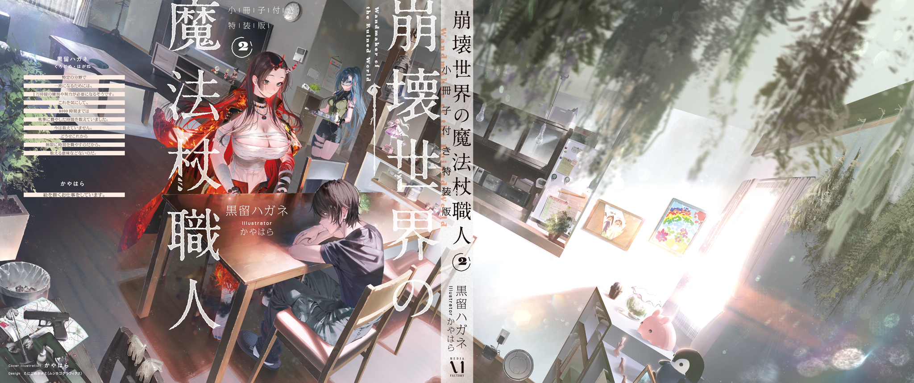

The Blue Witch was recovering steadily after her brush with death, and now she was getting bored in bed. She was still as unsteady on her feet as a newborn fawn, but her head was clear and she didn't seem sleepy. She didn't know what to do with herself.

I'd cleared away the Blue Witch's rice porridge, clear soup, and small dish of pickled plum and was about to leave the room when she called me back.

"Ori, want to stay and talk for a bit?"

"Huh? I'm about to wash the dishes, though."

"I'm bored. I'm not sleepy, and reading for too long wears me out."

She marked her place in the novel and set it on the small writing desk beside the bed as she spoke. From the title, it looked like a romance.

No wonder you get tired reading difficult books like that. You should read something easier, like a mystery novel or an academic journal.

"Well, if you want to talk, fine, but what are we going to talk about? I can't do emotional support or anything."

Apparently, I had a habit of rubbing people the wrong way when I talked to them.

I didn't think I was the best company for someone who was sick, but the Blue Witch beckoned me over and had me sit down beside her bed.

"It's fine—we can talk about anything. Just stay here with me."

"Huh...? Talk for no reason? Just for the sake of talking? What does that even...?"

"Don't overthink it. If you don't want to talk, you can just stay there."

???

I didn't really get it, but apparently just being there was enough.

I just sat on the edge of the bed doing nothing, as she'd asked, but the Blue Witch seemed to be in a good mood.

What's this? Am I a therapy animal now? Like having a dog around to lower stress?

If it helped her recover, that was fine, but sitting there doing nothing was boring too.

I pulled over some loose-leaf paper from the vanity and doodled to keep my hands busy. The Blue Witch leaned over to see what I was doing and exclaimed at my sketch of the stuffed toy on top of the closet.

"Whoa, you're good. Wait, you're really good, aren't you? It's practically a photograph. Did you graduate from art school?"

"No, I studied science and engineering. I told you before that I'm good at realistic drawing. It's not hard at all."

I kept my ballpoint pen moving as I spoke, copying the pretty lady in front of me onto the loose-leaf paper in precise detail.

This stuff's easy, you know. All I have to do is move my hand and put exactly what I see on paper. It's simple work, nothing more than a dull way to kill time.

"Hm, you're drawing me? Amazing. Couldn't you make a living as an illustrator?"

"Idiot. A photo would do the job. Going out of my way to do it all by hand is just stupid."

"Huh? No, you don't have to put yourself down that much..."

"You don't get it. For example... Okay, you know that picture your sister drew, the one hanging in the kitchen? That one's way better than this. Skill-wise, it's total crap, but one look and bam—you can tell how much your sister loves you, right? That's a good picture. Intent, purpose, who you're making it for and how! That's what matters in art!"

My specialty was magic wands—handicrafts, not drawing. I didn't know much about drawing, but the same basic principles had to apply to both.

My Ori-style art theory earned me a look from the Blue Witch that I couldn't quite read.

"Never call my sister's drawing bad again. Still, thank you. I'll accept the compliment."

The Blue Witch stared out the window with a faraway look, apparently lost in old memories.

She was off in her own world, so I picked up the tray of empty dishes and quietly left the bedroom, careful not to attract her attention.

Man. Putting up with a sick person's whims isn't easy.

