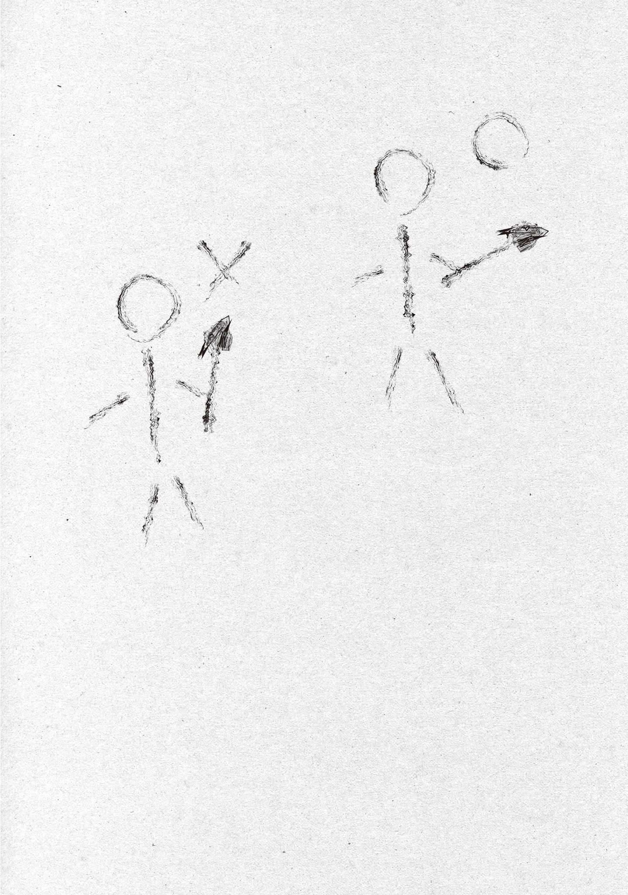

Magic backlash was a phenomenon that happened when someone used advanced or powerful magic.

Magic power poured into a Gremlin or magic stone, or held suspended in the air (Transcendents only), would slip out of control, take on the properties of the spell being cast, and flow back into the caster's body, causing feedback damage.

For example, magic backlash from <ruby>Vaa-ra<rt>Freeze</rt></ruby>-type magic froze your body, backlash from foresight magic turned your brain to mush, and backlash from eyeball magic left you blind.

Bad enough backlash sent the magic out of control until it killed you. Apparently Katsushika Ward had once been wiped flat because a mage lost control of a powerful spell. The mage in question supposedly burst apart and turned to dust. Way too scary.

Witches and mages could lessen the feedback damage from magic backlash by controlling their magic power. They could simply push back the magic power trying to flow backward, or deftly deflect it and let it escape into the air.

But magic-power control had its limits: even the Blue Witch had nearly lost control of her magic when she froze the giant kaiju, and apparently every time Foresight looked into the distant future, it fried his brain and he ended up regressing into a little kid.

The real problem was ordinary people who had only learned magic and couldn't control magic power at all... wizards.

Tokyo Magic University was currently wrestling with this magic-backlash problem.

Plenty of spells were pronounceable and didn't need more magic power than people had, yet magic backlash made them too dangerous to actually use.

Fire magic topped the list.

The Flame Witch's fire-magic core spell, "<ruby>Jin Ga<rt>Flame</rt></ruby>," cost very little magic power and had a short incantation, but fire magic in general was prone to magic backlash.

A spell that made fire didn't sound all that advanced, but even the simplest fire magic could melt the ice from Great Glacier magic, which natural fire couldn't thaw. It probably came with some crazy-advanced magical bonus effect built in by default.

When an ordinary person used "<ruby>Jin Ga<rt>Flame</rt></ruby>," they got hit with magic backlash easily and ended up burned. They could cast the spell itself, but the downside outweighed the upside.

Since fire magic was drawing attention for cooking, heating, and as a substitute for fuel, Professor Ohinata was researching ways to prevent magic backlash on top of her teaching.

Just as a safety sound kept a spell from going off by accident, she'd been experimenting to see whether adding some sound or word to the incantation could cancel out or reduce magic backlash, but apparently she hadn't gotten anywhere.

According to Professor Ohinata, the fuel problem wasn't as urgent as the food problem, but it was still high priority.

Ideally, medical-magic research would come right after food as the top priority, but nobody could use medical magic, so there was no way to research it, and the fuel problem had moved up the list instead.

For now, central Tokyo mostly covered its fuel for cooking and winter heating with lumber salvaged from tearing down buildings nobody lived in.

But however carefully they rationed it, the city's lumber would run out eventually, and newly planted trees wouldn't be big enough to burn for another ten to twenty years.

Cutting timber in the mountains outside the city and hauling it into town was a ton of work too. People were hoping charcoal freight trains could handle that kind of transport, but, well, when you traced it back, a charcoal train ran on wood in the first place.

The trains deserved praise as a brilliant feat of engineering, but sadly, they weren't an efficient way to haul freight.

Magic, of course.

Magic solves everything.

Unless you swung the wand to launch it, the fire-magic core spell "<ruby>Jin Ga<rt>Flame</rt></ruby>" just kept burning in place for several minutes. That was plenty for light cooking, lighting fires, boiling water, or reheating food.

Apparently about one in three people had enough magic power to cast it, so if this worked out, a fire user in every household wasn't just a dream. Across all of Tokyo, the fuel savings would add up to something amazing.

If they couldn't find a way to make fire magic usable, the plan was apparently to hammer out the details of improving and spreading charcoal freight vehicles and shipping lumber down from the mountains by river. That made it my problem too.

After all, the Tama River flowed through mountainous Okutama, cut straight across urban Tokyo, and emptied into Tokyo Bay, which made it a perfect river for shipping.

If I just sat back and relaxed, the forestry folks would come swarming into Okutama and start felling trees, loud and rowdy, right in my peaceful haven. There was even a risk of a logging base going up.

I'd hate that way too much.

Professor Ohinata's letter was full of considerate lines like "If you have the time," "There's no deadline," and "At your own pace, Ori-san," but for all that, she'd explained magic backlash and laid out her magic-linguistics research, progress and problems alike, in painstaking, passionate detail.

Every other line hinted that she was pretty much at a dead end, so I got fired up and decided to lend a hand.

Even if the magic-linguistics approach was stuck, a processing-studies approach might crack it pretty easily.

First, I asked the Blue Witch what she thought about magic backlash. She'd been building a deck with a card box on her lap while I pored over the letter.

I only knew about magic backlash in theory, so I really wanted the opinion of a witch who'd actually experienced it and could control it to some extent.

When I showed her Professor Ohinata's letter and asked for her take, she filled in details that only a witch who'd lived through magic backlash and dealt with it could give.

"You really feel it when you cast with Cyanos, but there's actually a way to hold a wand that makes magic backlash less likely."

"Huh, that's a thing?"

"It is. You hold it like this... No, would it be easier to understand if I drew it?"

The Blue Witch raised Cyanos to demonstrate, then thought better of it and drew two diagrams on a sheet of paper for comparison. One look told me she wasn't much of an artist.

"Stick figures? Seriously?"

"Ugh... I-It's not my fault. Some girls just can't draw. Ahem, anyway! First, the one on the left is the bad way to hold it. When you use magic, the magic power leaves your mouth with your voice and gets poured into the magic stone. When it backflows, it comes in through whichever body part is closest to the magic stone. In the left diagram, the head's closest to the magic stone, right? The backflowing magic power goes straight into your head. That's dangerous, and it's hard to control."

"Hmm... So if I held the magic stone with my toes, the backflowing magic power would come in through my toes?"

"Right. Now look at the one on the right. This is the good way to hold it. Your right fingertips are closest to the magic stone, so the backflowing magic power enters there and spreads through your whole body. That's far safer than having it hit your head directly, and it's easier to control too."

"I see............"

So magic power takes one route going into a magic stone or Gremlin and a different route when it backflows, huh.

Going by that logic...

No...

Could it... work...?

In theory, it seems like it should work. Guess I'll ask.

"Hey, if I gave the handle magic resistance like this, do you think it'd cut down on magic backlash? Just go with your gut."

I dashed off a simple diagram and showed it to the Blue Witch.

"Whoa, how can you draw a circle that accurate freehand? And hey, Ori, you're using stick figures too."

"So what? If I wanted realism, I could make it look like a photo. You cut corners when you can get away with it. Anyway, what do you think? We send magic power along the black-arrow route, and it backflows along the white-arrow route, right? So I figure we could put a magic-resistant material in the magic wand's handle, right between the magic stone and the right hand."

"...Hmm? No, I'm not really following."

"Hard to follow? Remember a while back, when we did that experiment where we melted Gremlins down and let them harden again? You know, with the reverberatory furnace. I think I told you about it, but if you put that stuff between a Gremlin and yourself, a spell's magic-power consumption doubles. In other words, you get 50% magic-power loss.

"So if we use melt-recast Gremlin for the wand handle in this diagram, the backflowing magic power gets cut by 50%! Backflowing magic power halved! Feedback damage halved! ...Or that's what I figured, anyway. What do you think?"

"............"

The Blue Witch put a hand to her chin and thought it over for a while. Then she pressed Cyanos to the paper with her doodles on it and cast a spell.

"<ruby>×× ×× Fuifui Ii Vaa-ra<rt>Let moonlight and cool breezes alike all become ice</rt></ruby>."

Once she'd turned the paper into a thin sheet of ice, the Blue Witch clenched and unclenched her hand a few times, as if checking how it felt, and nodded.

"Yeah. If that part of the handle in your diagram were a material magic power has trouble getting through... one that causes magic-power loss, I guess? It feels like less magic power would flow back."

"Oh! Right? I had a hunch it would! Ha-ha!"

I'd written melt-recast Gremlin off as a shelved research result that wasn't worth shit, so it cracked me up that it was already about to prove useful. By the time the research was needed, it was already done.

What a genius. I really am the world's greatest Wand Maker...!

Sure, this lightning-fast solution stood on the work of Professor Ohinata and a Gremlin-melting experiment team whose names I didn't even know, so not all of it came down to my genius, but my own inventiveness still gave me chills.

Take useless experimental data and put it to good use. That's how a first-rate engineer uses his head! My flashes of inspiration are on another level from your run-of-the-mill creator's. Another level, I tell you.

I got right to work modifying Cyanos based on my new theory.

I took Cyanos apart, carved a long, narrow hollow inside its handle, and fitted in a piece of melt-recast Gremlin.

When I had the Blue Witch run a magic-backlash test, prototype one failed. The backflowing magic power went around the melt-recast Gremlin instead of through it and flowed straight into her hand.

Going on gut feel, the Blue Witch said, "There's a gap between the melt-recast Gremlin and the magic stone, and the backflowing magic power is leaking through it. If you make them touch, it should flow in the way you want." So I made the changes exactly as she said and had her try prototype two.

Prototype two worked, but just as the theory predicted, it only cut magic backlash by around 50% (by the Blue Witch's estimate).

For just two prototypes, that was a huge result. Even if I reported back to Professor Ohinata with only this theory, she'd be overjoyed at how fast her problem got solved.

But I'm not stopping there—I've still got plenty left in the tank! I can push the magic-backlash reduction rate even higher!

If one melt-recast Gremlin means double the magic-power consumption and a 50% cut, then with four, magic-power consumption doubles, then doubles again, and again, and again. Two to the fourth power: 16 times! That's an incredible 93.75% cut rate!

Or so I thought, but even when I bundled four rods of melt-recast Gremlin together and installed them in the handle, the magic-backlash reduction rate only reached about 85%.

I tried bundles of five and six too, but according to the Blue Witch, "It doesn't feel any different."

Cutting back to a bundle of three still gave about 85%, and a bundle of two dropped it to around 75%.

In other words, magic-backlash reduction with melt-recast Gremlin hit a ceiling at 85%.

It felt like I could squeeze out a little more, but I couldn't come up with any better processing ideas yet, so I decided to call it done for now.

When I wrote to tell Professor Ohinata, "I can do backlash-prevention modification now!" I also offered to recall the general-purpose magic wands Tokyo Magic University was using.

I wanted to collect every one of them for the time being and swap in handles fitted with the backlash-prevention mechanism.

The swap would be a pain, but if someone had a magic-backlash accident with one of my magic wands, it would look like my wand's fault, and I'd hate that.

I didn't want to hear, "I used a magic wand, but it didn't prevent a magic-backlash accident." I wanted praise like, "Thanks to the magic wand, I avoided a magic-backlash accident, got a girlfriend, made the starting lineup in my club, and my grades went up! It's all thanks to the magic wand!" Five-star reviews only, please.

Professor Ohinata accepted the recall and promptly collected the general-purpose magic wands, then had the Blue Witch bring them to me along with a personal thank-you letter and an official certificate of appreciation from Tokyo Magic University. She went all out praising me for solving the problem in a single day. That was embarrassing.

Come on, Professor, improving fertility magic and undoing your own transformation in one day is pretty impressive too. Both our lightning-fast fixes were built on a foundation of basic research, so neither of us really did it in one day. But hey, let's keep patting each other on the back.

The new version of the magic wand had evolved out of Professor Ohinata's assignment and the Blue Witch's testing, and I saw huge potential for further development in it.

Until now, the only part of my wands that meant anything was the core magic stone or Gremlin.

Honestly, you could've just held the processed magic stone directly. The handle and the carvings were nothing but fancy decoration.

But now, finally, the magic-wand handle had a real job too.

The core gem at the tip amplified the magic, and the handle reduced the feedback damage.

Isn't that a beautiful structural collaboration?

If I kept researching, maybe I could give real magical roles to the protective material around the gem, the metal reinforcing the handle, even the carvings on the handle. So many possibilities.

Magic wands still had plenty of room for improvement. Time to keep evolving them.
