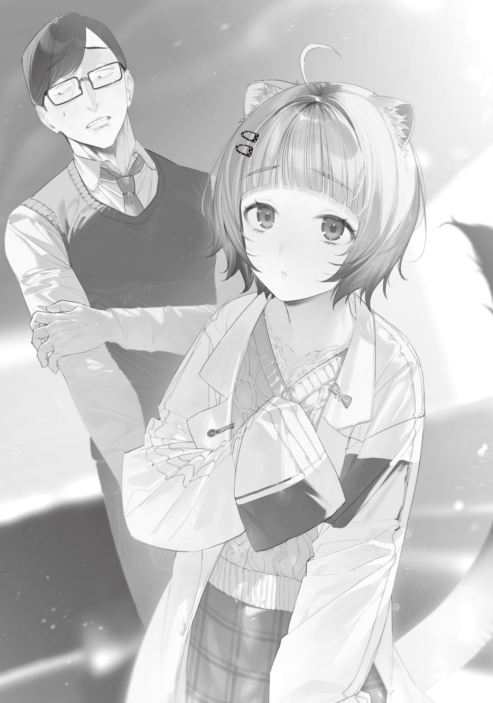

Handa Sakunosuke, one of the first students to enroll after Tokyo Magic University switched to a one-year curriculum, originally came from Saitama City in Saitama Prefecture.

Saitama City was just one of the many places where law and order had completely collapsed in the Gremlin Disaster.

Regions that weren't lucky enough to see a witch or mage born almost always met a miserable fate. Unable to hold off the monsters that came wave after wave, they were swept by a storm of slaughter and looting. The Self-Defense Forces and police could put off the collapse for a while, but the moment their ammunition ran out, the monsters' violence swallowed everything.

The weak, the stupid, and anyone slow to act died first, young or old, man or woman, and Saitama City's population plummeted in under a month.

Nobody had taken an accurate census anywhere, but areas with a witch or mage were said to have kept an average of 20% of their population. Areas without one had kept somewhere around 0.1–5%. Saitama City was no exception.

Handa had been in his mid-thirties, in the prime of his working life, and employed at a plumbing shop. He lost his entire family right after the disaster, and before he even had time to grieve, society's upheaval swept him along.

That he survived at all was pure luck.

For about a year, he had no choice but to stay alive by looting in a Saitama City overrun with monsters. Then, sick of all of it, he abandoned his hideout and headed south in search of a paradise.

Even if a monster killed him on the road, that was far better than going on like this, trampling his conscience to rob dying old people and orphaned children of their last scraps of supplies.

Rumor had it that Tokyo had witches who had gained the power of monsters and used it to protect people from them and hand out food. Handa followed the Arakawa River toward Tokyo.

With communications down, there was no way to check whether the rumor was true. There were countless others like it, and every one of them was nothing but a fantasy born of the faint hope that salvation existed somewhere. Still, for some reason, the one about the witches felt believable.

Maybe he had only wanted to believe it. Either way, Handa won his bet.

Tokyo took him in as a refugee from outside the city. After a few screening questions, he was assigned to the territory of the Flower Witch, which spanned Arakawa and Taito Wards.

Handa Sakunosuke's new life began.

First of all, he was surprised to be treated as a refugee. It had been a long time since he'd met anyone who treated a stranger like a human being.

It surprised him even more that he was assigned a place to live according to clear rules.

Incredibly, Tokyo still had order.

It had organizations. It had politics.

He had taken those things for granted before the disaster, yet now they felt so strange that he might as well have stumbled into an alien culture in another world.

The people already living in the Flower Witch's territory greeted him with pity.

According to them, of all the Witches' Council members who ruled the various parts of Tokyo, ending up in the Flower Witch's district meant you were out of luck. It wasn't the worst district, but no one there would get to die a decent death...

The defining feature of her district was that dead residents became her nourishment. And she didn't let anyone flee the district to escape that fate.

Her people had no graves. Roots burst out of the ground and dragged the dead down into the soil to feed her.

And once she had drunk up the corpses, the Flower Witch bloomed so beautifully she hardly seemed to belong to this world.

Then again, that was about the only downside.

Thanks to her fertility magic, everyone ate three solid meals a day, even if the rations were only grains, vegetables, and fruit.

The roots running under the whole territory killed any monster that appeared in an instant. Flying monsters were the one exception, and for those the security force had to fight back or ask witches from other districts for help. Still, just having no monsters on the ground made life easy.

The Flower Witch laid down only the most basic laws, like no stealing, no killing, and no deceiving, and otherwise didn't meddle much in residents' lives.

The corpse-eating that some residents talked about with a shudder didn't bother Handa at all.

If anything, it impressed him that people here had room to worry about what happened after they died. Tokyo really is peaceful.

She only fed on the dead. She didn't go out of her way to make more of them, so there was nothing to worry about.

Handa spent several peaceful months at the Flower Witch's roots, letting his worn-out body and mind heal. Then one day, he met a mage for the first time.

The man called himself the Foresight Mage. He was about Handa's age and looked tired, and at a glance he was just an ordinary middle-aged man in a rumpled suit. Yet he boldly negotiated with the Flower Witch, whom the residents feared, made some kind of promise, and left (Handa heard later that he had paid a price to learn fertility magic).

Watching the Foresight Mage come in from outside and leave again unharmed opened Handa's eyes.

The Flower Witch fed on dead residents, and since she didn't want her food running off, she forbade her people to leave the district.

But apparently that wasn't an absolute rule. If he had power, if he had status, if he could negotiate, then he wouldn't have to spend the rest of his life inside this district.

Several months of peace, far beyond anything he'd had the year before, had made Handa want more. He wanted to see the other districts of Tokyo.

His life now was good, but if he could live even better somewhere else, he wanted to.

First, he gathered materials from the city's rubble, which was barely being cleared since heavy machinery no longer worked, and courted the Flower Witch's favor with gifts of artificial and pressed flowers. He praised her beauty with the kind of cheesy lines he'd only ever said to his late wife, scoring points with her.

Then, when Tokyo Magic University began recruiting students, he seized the chance and asked to be allowed to study outside the district.

He'd come back, he promised. He would learn knowledge, skills, and magic that would be of use to her and bring them home.

The Flower Witch listened to his plea, smiled gracefully, and whispered in his ear.

“I'm told that if I send you off, you won't come back even after you graduate. Magic University must be awfully comfortable.”

“!”

Handa went pale as he began to grasp what kind of deal the Flower Witch and the Foresight Mage had struck.

Of course. If the Foresight Mage had paid some price in that deal, it had to be his foresight, his greatest bargaining chip.

Handa braced himself to be seized by the roots and torn limb from limb. Instead, to his surprise, the Flower Witch drew back and giggled, as if his reaction amused her.

“But very well. I'll permit it. Building ties with Magic University isn't a bad idea. Once you're there, do send me a letter now and then, won't you? Handa Sakunosuke.”

Feeling more dead than alive, Handa withdrew from the Flower Witch's presence.

It wasn't until after Magic University's entrance ceremony that it occurred to him. Come to think of it, she actually remembers people's names.

At the time, Tokyo Magic University had just one department, the Department of Magic Linguistics, so that was naturally where Handa enrolled.

He had expected a second round of university to be awkward, stuck among kids more than a dozen years younger than him. But his classmates' ages were all over the place. There was a man pushing sixty, older than Handa, and a girl who couldn't have been out of middle school yet.

He'd heard that Magic University didn't choose students by age, but he had assumed that was just the official line and that young people would still get in first. So it came as quite a surprise.

Handa had enrolled less to learn magic than to see Tokyo, so he did just enough in class and spent his free time exploring Bunkyo Ward, where the university was.

The first thing that surprised him was that there were no corpses lying around anywhere.

In Saitama City, bodies had usually been left unburied, torn apart by animals and monsters, their gruesome remains out in the open.

In the Flower Witch's territory, the witch consumed the dead as nourishment, so of course there were none.

But the Foresight Mage who governed Bunkyo Ward wasn't the corpse-eating type. If 80% of Bunkyo Ward's population had died, there should have been over 180,000 bodies. Had every one of them really been disposed of?

That must have been a huge job. He wouldn't have been surprised to find them piled up somewhere, but Bunkyo Ward's streets were clean. There were no mountains of corpses, no pits to dump them in, and no smell of rot.

When he asked a classmate who had always lived in Bunkyo Ward about it, he got an answer he never saw coming.

Believe it or not, at the height of the Gremlin Disaster chaos, when the death toll was worst, “the Zombie Witch paraded all over Tokyo, turned every corpse she came across into a zombie, and took them away.”

And that was why there were no corpses lying around Tokyo.

Handa was impressed.

Sure, if corpses walked on their own, that saved a lot of cleanup.

That's an efficient way to handle it, he thought with a nod, and his classmate frowned and edged away from him, looking disturbed.

Really, if mountains of corpses had been left in a city as crowded as Tokyo, scavenging monsters and wild animals would have kept swarming in, flies would have multiplied like crazy, and the bodies would have fouled the soil and water and turned into a breeding ground for disease.

Even if it desecrated the dead, turning them into zombies and hauling them off had been hugely worthwhile for protecting the living.

That kind of disrespect toward the Zombie Witch's enormous contribution pissed Handa off. A few days later, though, he heard the full story from someone else and understood.

The Zombie Witch, it turned out, kept the best-looking zombies she had collected at her side and indulged in a <ruby>necrophilia<rt>corpse reverse harem</rt></ruby>.[^1]

Even Handa was seriously creeped out.

A year of extreme survival had knocked Handa's sensibilities out of whack for good, but even he couldn't understand how witches thought.

Anyway, Bunkyo Ward had no corpses and was a nice place to live, and Handa quickly grew to like it.

The Flower Witch's district had been safe enough, but living in Bunkyo Ward, he could see why her people had grumbled. Traces of the hellish apocalypse were still everywhere, yet everyone here was lively, their eyes shining with hope for the recovery.

At the end of every month, Bunkyo Ward held a barter market, and supplies poured in from all over Tokyo. Money was worthless, so everything was a straight trade, and there were oddballs trying to swap precious liquor for pricey pre-collapse trading cards. It was fun just to watch.

The food rations were reliable and colorful too. The portions were small, but nutritionally balanced, like a modest school lunch.

Monster incidents were handled amazingly fast. Handa once saw the Foresight Mage bustle up to a manhole, glancing at a pocket watch. The instant a frog the size of a calf burst out of it, he punched clean through its skull, killing it on the spot, and hurried off again.

He apparently couldn't foresee every monster, but once Handa had seen him head off an attack in person, the man seemed incredibly dependable.

The public bathhouse, open on Sundays only, also deserved a mention.

It had opened soon after Handa started university, apparently at the medical team's urging. They had argued passionately that even if it used up huge amounts of water and fuel, keeping residents clean would pay off in the long run, and the proposal went through.

The bath was packed like a can of sardines, but getting to soak once a week still made Handa very happy. It beat wiping himself down with a wet towel by a mile.

Most things in Bunkyo Ward ran efficiently and in good order.

That was probably the Foresight Mage's magic at work. As a resident, Handa couldn't have been more grateful, but it worried him that the man looked more haggard every time he saw him.

The best leader Handa had ever known was directing a team of talented people, so no wonder Bunkyo Ward's recovery was a cut above the rest. In name and in fact, the Foresight Mage was the pillar holding Bunkyo Ward up.

But just as Minato Ward had been razed and its residents scattered when the Bloodsucking Mage died, Bunkyo Ward would fall into chaos overnight if the Foresight Mage disappeared.

That was exactly why Tokyo Magic University existed, Professor Ohinata had said in a short speech before class: to develop the technology and people to keep it from happening. By then Handa felt right at home in Bunkyo Ward, and her words struck a chord.

As he came to like Bunkyo Ward, he grew attached to the university and his classes too.

For now, all he did was benefit from Bunkyo Ward, but he started to want to give something back.

After the uproar over the recall of the general-purpose magic wands used in class, Handa sat in his dorm room examining the wand that had come back to him, improved.

According to Professor Ohinata, a backlash-prevention mechanism had been built into the handle, and at the start of class that day, they'd had a lesson on how to hold a wand properly and how the mechanism worked.

Holding it properly was one thing, but even if he understood the mechanism, it wasn't something he could easily copy (how was he supposed to get his hands on a reverberatory furnace?). Still, it fascinated him.

Handa had worked at a plumbing shop for years. His boss had drilled all sorts of knowledge into him that seemed like it should come in handy on the job but never did, so he knew a fair bit about fluid mechanics.

Hearing the backlash-prevention mechanism explained brought back knowledge he'd half forgotten in all the upheaval.

The mechanism supposedly relied on magic-power loss: when backflowing magic power passed through a rod of melt-recast Gremlin, some of it was lost along the way.

In other words: magic power, flowing, through a pipe.

He had to admit it was more a hunch full of holes than a theory, but it felt just like water running through a water pipe, and he found himself thinking about the heart of the problem and how to solve it.

Then, to test an idea, Handa started taking apart the magic wand he had been told never to disassemble.

Magic wands were awarded at graduation. Until then, they were only on loan, university property, and had to be handled with care. Taking one apart was out of the question. But Handa's curiosity won.

By his reasoning, the mechanism should work better if the melt-recast Gremlin were shaped like a Tesla valve instead of a rod.

In a straight pipe, backflowing magic power would naturally rush straight through at full force.

So the answer was to change the pipe's shape and make the backflowing magic power churn into turbulence and eddies inside it. If the new shape disrupted the flow and sapped its force, he could expect the magic-backlash reduction rate to jump dramatically.

That was assuming backflowing magic power moved through melt-recast Gremlin the way a fluid did, anyway...

Handa wasn't a mage, so he had no idea how magic power flowed and couldn't sense it either. The only way to check was to try.

It wasn't as if he meant to attempt some freakishly intricate, superhuman machining like Professor Ohinata's beloved dodecahedral fractal wand Aleister. He only meant to shave the straight rod a little and get a feel for it.

Surely even his skills could manage that much. Handa picked up his tools and set to work, and within a few dozen seconds, he had broken the melt-recast Gremlin into several pieces, big and small.

After shaving the first bit, he thought he'd gotten the hang of it. But the instant he tried the next bit the same way, it cracked in a way that made no sense, and the crack raced through the whole rod and split it apart.

Handa went pale.

Now he'd done it.

This was no little chip. It had broken so spectacularly that no excuse could cover it.

He'd known in theory that it was hard to work, but he'd never imagined it was this delicate.

Gremlin was supposed to be tougher than that. Apparently he'd happened to focus the force right on an especially weak cleavage plane.

Handa sat on his bed clutching his head for the better part of an hour, thinking up excuses and cover-ups. Then he did the honest thing and took the broken wand to the president's office.

If the president had been older than him, he would have chosen to cover it up, and done it well. But hiding his mistake from a thirteen-year-old girl didn't sit right with him. It was just too pathetic for an adult. Not that going to apologize was much better.

Professor Ohinata heard his explanation in the president's office, then flattened her animal ears and let her tail droop limply. She folded her arms, visibly troubled.

“Hmm, this is a problem.”

“I'm sorry...”

“Oh, it's all right. I'll take care of it. You took it apart and broke it for an experiment, out of academic curiosity rather than as a prank, correct? As the head of a place of learning, I could never fault you for that.”

“...Um, pardon me, but are you really thirteen?”

“I am. Why?”

When she tilted her head, Professor Ohinata looked as cute as any girl her age, but she talked and acted like a seasoned educator. Handa felt more pathetic than ever.

She kept her arms folded for a while, humming as she mulled it over, until at last she clapped her hands and spoke up brightly.

“Let's see. How about this, Handa-san?”

“Y-Yes?”

“How would you like to be the professor of Gremlin engineering when we launch it next year?”

“Pardon?”

Thinking his ears must be playing tricks on him, he asked again, and Professor Ohinata repeated herself with a warm smile.

He hadn't misheard.

“Your idea is wonderful, and theoretically sound too. Not even professional Wand Makers thought of it. And if it broke on your second cut, that means you managed one cut, right? With whatever tools you had lying around, no less. Doing that on your very first try is truly, truly amazing! None of the applicants for our Gremlin engineering professorship could do the same. You could call yourself the second-best in the world!”

“W-Well... But it was only once. It must have been a fluke. There's no need to flatter me that much...”

“Even if the cut was a fluke, the idea is the real thing. Handa-san, you're far, far more amazing than you think. I would really love for you to teach what you know here at the university.”

“No, even so, all I ever did was work at a plumbing shop. This time it just happened, purely by chance, that what I learned there came in handy. Or rather, I only tried to make it come in handy.”

He had come here to apologize, ready to be expelled, and now the conversation had gotten completely out of hand.

Handa lost his nerve and tried to turn her down, but Professor Ohinata clasped both his hands and pleaded with him, eyes sparkling, until he had nowhere left to run.

“I fully understand that you aren't a Gremlin expert yet. I won't ask you to teach perfect classes or guide your students right from the start.

“But someone has to blaze the trail for Gremlin engineering. We can't rely forever on one person's exceptional skill that no one else can copy. We need knowledge and techniques that anyone with some aptitude or enthusiasm can reproduce. In other words, Gremlin engineering has to be researched, taught, and spread as an academic field.

“If anyone can do that, Handa-san, it's you. I'm certain of it.”

“B-But really. Me, a university professor...”

“It'll be fine! Our university has no history at all. It was only just born. Just think of it as starting from zero and growing up alongside us, and take it easy. If you ever feel you truly can't do it, you can quit anytime. So, what do you say?”

“Uh...”

“Won't you, please?”

When she looked up at him like that and begged, Handa gave in.

“A-All right. I'll give it a try. But please, really, don't expect much.”

“Thank you so much! If you don't want me to expect anything, I won't, but I will trust you, all right? You weren't interested in class at first, but then you got interested and started working hard. I noticed all of that, Handa-san! I believe it'll be the same with your work as a professor!”

“Haha...”

From anyone else, it would have sounded like plain flattery, but coming from Professor Ohinata, it sounded like nothing but the honest truth.

When someone trusted you, you wanted to live up to it. Especially in a world where trust was so precious.

And that was how Handa Sakunosuke became a professor in Tokyo Magic University's Department of Gremlin Engineering.

## Translator Notes

[^1]: The ruby's baseline is “necrophilia”; its upper gloss preserves the written “corpse reverse harem.”
