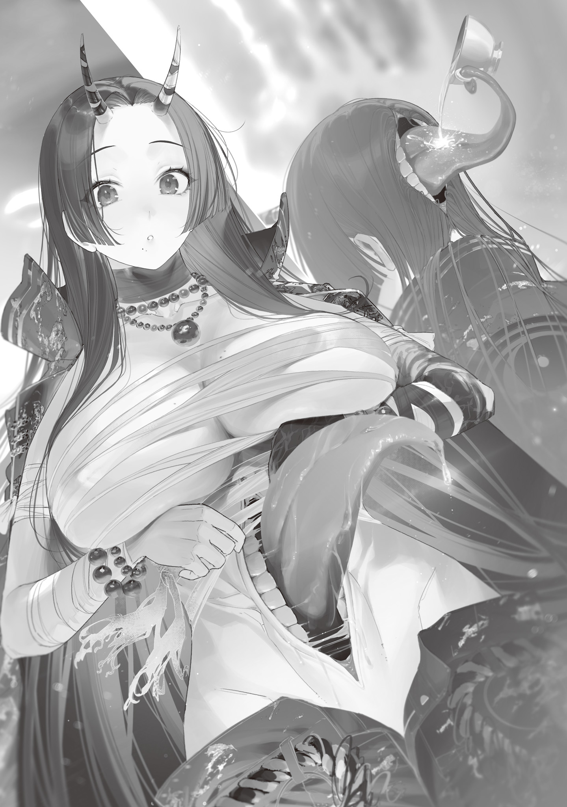

Five days had passed since I shipped custom-made, high-end magic wands to the big shots of the Tokyo Witches' Council via Blue Witch delivery.

Each order form had its owner's personality all over it, so building the wands got me fired up and turned out to be a lot of fun.

Magic stones weren't available, so every wand used a Gremlin, but the Hachioji Witch specified what color she wanted. She asked for black, so the Blue Witch gave me a matte jet-black Gremlin from a man-eating monster bird she said she'd hunted long ago.

The Eyeball Witch ordered two and didn't specify a design, but since she said one was a gift, I went all out on the gift box as well as the wand itself.

The Flame Witch wanted a sturdy wand she could use hard in battle and sometimes bash things with, so I reshaped some steel for the core. Even so, I assumed it would break eventually, so I made it easy to maintain and threw in two replacement handles.

The Foresight Mage asked for one thing and one thing only, in a desperate-sounding letter: a backlash-prevention mechanism with its performance pushed to the absolute limit. Naturally, I poured every technique I had into it and made it as precise as I possibly could.

Every single one came out great.

It was surprising that I hadn't gotten an order from the Dragon Witch, but there was no way she didn't want one, so the Blue Witch was probably shutting her out. Having her as my manager was a real help.

But for those five days, the Blue Witch hadn't come by once, which wasn't like her.

She probably had her own stuff to do, but I wanted to hear how the customers liked their wands. So I headed to Ome to ask, and while I was at it, I brought along a card set for crushing the Blue Witch's defense-heavy deck with my ultra-firepower deck.

I made it to the Blue Witch's house without getting lost, but something weird was going on, and I ducked behind a vine-covered utility pole.

An oni woman was sitting cross-legged in front of the witch's house.

That thing's a witch, right? Probably?

The Blue Witch banned anyone who wasn't an Ome resident from entering Ome.

As a rule, she beat intruders to a pulp and threw them out the moment she found them, or just killed them.

No ordinary person would plop down there that brazenly, and she didn't look like a monster, so she had to be a witch.

She was so big I could tell even with her sitting down; standing, she'd probably top 190 cm.

Her boobs were huge too, wrapped in a binding cloth and bigger than any I'd ever seen. Her ripped six-pack was bare, which looked like a good way to catch a chill.

She had two horns, black hair hacked off at a slant across her back, and one of those baggy uniforms biker gangs wear, so she looked like a girl gang boss from hell. Her face didn't match the getup at all, though: she was a refined-looking beauty. That made her seem like a rich young lady who'd gone delinquent, which was scary in its own way.

No idea what her deal is, but if she's camped out in front of the house, she must have business with the Blue Witch. If I show myself now, she's definitely going to stop me.

Okay! Visit canceled! Back to Okutama!

I tried to sneak off on tiptoe before she spotted me, but a little bird pecking at bugs in the vines on my utility pole suddenly let out a chirp, and the oni woman looked my way.

"Huh!!? Wait, are you an Ome resident!!?"

"Eek...!"

On her feet, the oni woman was tall, her boobs were huge, and even her voice was huge.

There was no getting away, so on reflex I stared at the ground and shrank in on myself.

Heavy footsteps stomped toward me, and a pair of huge feet appeared in my view of the asphalt.

Eeeek! Bigfoot! Big! Human! Scary! No!

"I-I don't know anything, I'm not involved, I don't get it, I have things to do, I'm busy."

"Don't be so scared!! I'm the Hell Witch!! I'm not going to eat you!!"

"R-Really?"

"If you're a good person!!"

"Awaaah...!"

So you'll eat me if I'm a bad person? Nooo!

I'm not a bad person! All I ever did was make a little money off copyright-infringing anime merch, way back when! Really, I'm a good person otherwise! Don't eat me!

"The Witch of Ome won't hear me out, and I'm stuck!! Could you talk to her for me!!?"

"U-Um, well..."

Her ridiculously loud voice rattled my eardrums, and I was shaking hard enough to set off an earthquake when I heard the familiar incantation, "<ruby>Do Vaa-ra<rt>Freezing Javelin</rt></ruby>," and the oni woman went flying and tumbled across the road.

Whoa, my savior's here!

The Blue Witch stood planted in the doorway with Cyanos raised, and I dashed over and hid behind her. Phew, saved! Nice one!

I was breathing easy behind the strongest wall there is when the Blue Witch, keeping Cyanos trained on the Hell Witch as she tried to get up, started grumbling at me under her breath.

"Why did you come? I told you, didn't I? The Hell Witch is hounding me, so I can't come over for a while, and you're not to come here."

"Huh? Nobody told me that."

"Yes, I did. Through an eyeball familiar."

"Ohh, I blocked you. You kept calling and talking forever."

When the Blue Witch first started contacting me through the eyeball familiar, it was just quick business stuff, but the calls kept getting longer.

Lately she'd been making me sit through about an hour of pointless chatter every night. Who wouldn't block that?

"You blocked me!? You idiot, then what's the point of a communicator—<ruby>Do Vaa-ra<rt>Freezing Javelin</rt></ruby>. So that's why you never answered. You... Honestly, you...!"

The Blue Witch grumbled on, blasting the Hell Witch back with magic every time she tried to come closer.

"You only ever call about pointless stuff. Who cares that you put a bird feeder in your yard? Don't feed the pests."

"Shut up. They're cute. And it isn't just sparrows—Japanese white-eyes come too, you know. I play your card game with you, and you ignore me?"

"Okay, that's... fair? Sorry. Maybe that's on me."

"Not maybe. It's on you. Thanks to you, an annoying situation just got even more annoying. <ruby>Do Vaa-ra<rt>Freezing Javelin</rt></ruby>."

After the ice spears had sent her flying again and again, the huge oni woman put both hands up in surrender.

Or so I thought, until she went straight down on all fours and into a flawless bow, forehead to the ground.

Then, in an earnest and ridiculously loud voice, she said, "Witch of Ome!! Look, I'm begging you!! Let me meet the Wand Maker!! I'd be breaking my code if I didn't thank my benefactor in person!!"

The Blue Witch fell silent.

I fell silent too.

Hey, you said this was an annoying situation, right?

But hasn't it kind of turned into an interesting one?

The Wand Maker she's after is standing right in front of her, and she has no clue.

Then again, I probably just look like some card gamer with a deck case, not a Wand Maker. Good thing I kept Hendensho in my inside pocket.

I poked my head out from behind the Blue Witch's back. "Um, this benefactor—what did they do for you?"

I don't know any oni woman like this.

Who even is she? I don't remember doing her any favors.

I'd asked like I was somebody else entirely, and the Hell Witch answered with her forehead still ground into the asphalt.

"They stopped my runaway magic!! For two and a half years!! I'd been holding it down that whole time!! Adachi Ward was hell!! But thanks to the Wand Maker's wand, I got my magic under control and got rid of the runaway magic!! Adachi Ward and I are both free!!"

I-I see?

That explained everything, including why I didn't remember her.

The gift wand the Eyeball Witch had ordered must have ended up with this Hell Witch.

And the witch's seal had been broken.

"When I thanked the Eyeball Witch!! She told me it was all thanks to the Wand Maker!! So I won't move from here until you let me meet the Wand Maker!! Please!! You're the only one who knows where the Wand Maker is, right!!?"

"Don't know. Go home."

The Blue Witch brushed her off cold, but the Hell Witch stayed down in her bow, clearly not about to budge an inch.

That human loudspeaker had scared the hell out of me, but her story had me curious.

She held down runaway magic for two and a half years?

And then she used my wand to stop it?

You almost never get field data that off-the-wall. I have to hear what the wand was like to use.

"I want to ask her a few things," I whispered to the Blue Witch. "Can you let her in?"

"...You sure? She's not rotten at heart, but she is a witch who eats people."

"Honestly, I'm scared, but I'm curious. If she tries anything, you'll protect me, right, Blue Witch?"

"Well, yes, but..."

"But I don't want to talk to her. So you ask her my questions for me. I'll just sit next to you and listen."

"Screw you. Talk to her yourself."

The Blue Witch clicked her tongue, got the Hell Witch to her feet, and invited her inside.

Ugh, so I have to do the talking? I don't wanna... but it's for valuable data, so I'll chalk it up as a necessary expense and squeeze every last detail out of her.

---

The Blue Witch showed the Hell Witch into the living room, made just two cups of tea, and sat down at the table, with me beside her and the Hell Witch across from us.

"You forgot a cup," I whispered into the Blue Witch's ear. "There are three of us in here."

"I know. I did it on purpose."

"Huh...? What do you mean...?"

"She's not welcome, so she doesn't get one. Get it? It means, 'There's no tea for you.'"

"Ahh, gotcha? Come to think of it, I saw something like this in some old daytime drama. A nasty mother-in-law kept harassing her son's wife when she came to the house. So underhanded. Women at their worst, you know?"

"..."

Without a word, the Blue Witch went to get a third cup.

What, so you're giving her one after all? Then just put it out in the first place.

The Hell Witch had watched our exchange looking puzzled at first, then all smiles. When she got her cup of tea, she said thanks at the top of her lungs, straightened up, and got to the point.

"So, does this mean you'll let me meet the Wand Maker!!?"

I looked at the Blue Witch, but she just sipped her tea and didn't seem about to answer, so I reluctantly did it myself.

"Er, um, I'm actually the Wand Maker's apprentice. I'll pass your thanks along."

"So you're apprentice-kun!! Nice to meet you!! Is your master out right now or something!!? Or, don't tell me he's sick!!?"

"Oh, no. He's just got crippling social anxiety, so he doesn't like meeting people."

"Hey!! You shouldn't badmouth your own master!!"

"Eek! S-Sorry! I'm a good person! Don't eat me."

"I told you, I'm not gonna eat you!! I only eat real bad guys!! Sorry, I guess I'm kinda scaring you!! And don't mind the loud voice either!! I just ended up like this when I mutated!!"

"R-Right..."

So it's like the Dragon Witch's thing? Having the way you talk forcibly changed sounds like a low-key pain.

While I was thinking of that dragon and her cutesy sentence endings, the Hell Witch folded her arms and groaned.

"Hmm, if he doesn't want to meet me, I guess there's nothing I can do!!? The Witch of Ome never told me anything, you know!! I couldn't figure out why she wouldn't let me meet him, so all I could do was sit out there!!"

"Hey."

"Shut up."

I elbowed the Blue Witch in the ribs, and she looked away awkwardly.

You're always calling me a socially anxious misfit, but you're pretty messed up yourself, you know.

The oni woman looked up at the ceiling for a moment, thinking, then nodded once and dug a hand into her pants pocket. "Then, apprentice-kun!! I want you to give this to your master!! Tell him it's a thank-you gift from the Hell Witch!! If he makes wands, something like this should make good material, right!!?"

With that, she set a huge gemstone on the table.

It was a flat stone a little smaller than an open palm, with the vivid color of amber, but unlike amber, it was cloudy and you couldn't see through it.

But what really stood out was how beautiful it was!

It hit me like a jolt.

That unique presence.

That strangely eye-catching appeal.

No doubt about it.

"It's a magic stone! Are you sure I can have this!?"

"I mean, not you, your master, okay!!?"

Nodding along to the correction, I slid the amber magic stone over to my side before the Hell Witch could change her mind.

Yes! Talk about a windfall!

I made a wand with a Gremlin, and it came back to me as a magic stone!

This thank-you gift is bugged! How great is that!?

"Hey," the Blue Witch said curtly to the oni woman, looking a little fed up with the grin I couldn't hide. "You sure about this?"

"About what!!?"

"Handing over a magic stone that easily."

"The Edogawa Witch lends hers to people all the time, right!!? What's wrong with that!!?"

"That same Edogawa Witch was killed the moment she lent a magic stone to Iruma. The days of lending and borrowing that casually are over."

At the Blue Witch's warning, the Hell Witch sprayed out her tea and started coughing.

"Whaaat!!!? Iruma did that!!? To Edogawa!!? He wasn't the kind of guy who'd do that, was he!!?"

"Everyone thought so. That's why nobody knew until it happened. The Edogawa Witch, Crow, Meteor, and the Tachikawa Mage died in the Iruma coup. I killed Iruma. The Arakawa Mage went back home after the coup was put down, so the Flower Witch rules Arakawa Ward now. Oh, Bloodsucking somehow managed to establish communication with the Mermaid Witch. She's at about the level of a dolphin that's learned human words."

"Whoa, wait, that's a lot at once!! Isn't that way too much change for two and a half years!!?"

"So Eyeball didn't fill you in."

"It's not like she didn't!! But pretty much all she said was that the Witch of Ome had gotten cold toward anyone who wasn't a resident, so even if I came, she probably wouldn't talk to me...!! Then what about that mask!!?"

"What's it to you what I wear?"

"O-Okay...!! I won't ask!!"

Um, you seem to think the mask came from some big incident too, but actually she wears it because my social anxiety is so bad I can't look this girl's pretty face in the eye. It's such a stupid reason that I really wish you hadn't brought it up.

"So a lot happened while my magic was out of control!! I'm an oni, but I feel like Urashima Taro[^1]!!"

"Ask the Eyeball Witch for the details. She's probably the best informed. Adachi Ward isn't fit for people to live in anymore, is it? She should be able to arrange a new territory for you to manage, too."

"Oh, sorry!! I'm actually planning to leave Tokyo!!"

The Blue Witch's hand stopped for a second as she poured me a refill.

She hadn't seemed in a great mood to begin with, and now it dropped another notch.

"Why? You're from Tokyo, aren't you? It's not as if you left family behind in some hometown."

"Well, Tokyo's peaceful now!! I mean, not exactly peaceful yet, but look!! Reconstruction's come pretty far, right!!? I looked around the city on my way here from Adachi Ward, and it didn't feel like a place where you don't know if you'll live to see tomorrow!!"

Wait, yikes.

Was central Tokyo really like that before?

Glad I stayed holed up in Okutama, and glad the first person I met was the Blue Witch. Even if she almost killed me.

"But there are a lot of areas with no witches or mages, and life's rough there, right!!? So I'm thinking I'll travel the world and help out the people who survived!!"

"Besides, nobody's left in Adachi Ward anymore!!" the Hell Witch added.

The Blue Witch asked quietly, "Don't you want to keep protecting the city?"

"Adachi Ward!!? With nobody left!!? Hmm, nah, not me!! Kill the bad guys, eat 'em, clean up, and help the good people!! That kind of thing suits me best!!"

"I see..."

"? ...Oh!! Sorry, that was thoughtless!! There's hardly anybody in Ome because, I guess—no, I mean, sorry!!"

"..."

The Blue Witch had gone quiet and stopped moving, and the Hell Witch watched her anxiously.

She shot me flustered glances too, which only got me flustered. Um, if you could maybe not look over here so much...

"Uh, um!! Looks like I made things awkward!! Aaagh, why does my voice get loud on its own even at a time like this...!! Anyway, my business is done, so I guess I'll get going!! Apprentice-kun, be sure to give your master my best regards!!"

She tried to tiptoe out awkwardly, with her voice as loud as ever, and I hurried to stop her.

Your business might be over, but mine isn't!

Reviews! Usability! Give me your wand usage data!

"Ah, um, sorry, there's still something..."

"Oh, sorry, I was about to leave on my own!! What is it!!?"

"Um, would you mind telling me how the wand felt to use?"

"How it felt to use!!?"

The oni woman dropped back into her chair from her half-standing crouch, making it creak under her huge ass, and tilted her head.

Well, fair enough. An engineer asking her for product feedback data probably wasn't something she was used to.

"Hell Witch-san, you got a magic wand from Eyeball Witch-san and used it to stop your runaway magic, right? Even though it had been running away for two and a half years. I'd like to hear anything you thought about it, like how you used the wand, what was good about it, what you wish had been different, how things changed with and without the wand. It'll be useful as a reference... for my master."

"Whoa, what's that? That's real craftsman professionalism!! Sure, I'll tell you as much as you want!! What should I talk about!!?"

"Oh, nothing specific. Just say whatever comes to mind."

"Is that how it works!!? Hmm, then, let's see!! So, first off, I used to live in Adachi Ward!!"

According to the Hell Witch, she'd originally been a college student living in Adachi Ward.

While she lay in the coma that came with her mutation, monsters attacked her, and a woman whose name she never learned protected her and saved her life. Once she woke up, she put on her benefactor's clothes and started helping and protecting people as the Hell Witch.

But the Hell Witch's magic was hard as hell to use. She didn't know a single small, easy-to-handle spell; everything she could cast was a map-wide weapon.

Magic that made every living thing in its area kill one another.

Magic that turned an area into a sea of fire and burned everything to ash.

Magic that sank an area into a pool of blood and made anyone who touched the blood suffer so much they'd choose to die.

Every one of them had way too big an area of effect to use lightly. A witch who could only cast hellish magic: the Hell Witch in every sense. So she fought monsters and thugs mostly with her fists.

Even after she got hold of a magic stone that someone had turned in at a police box, she held off on using it. Her magic was already wide-area and hard to control, and she figured powering it up would only make it harder to handle.

But one day, an emergency left her no choice.

"You know those slime enemies you always see in games!!? A monster like that showed up!! Apparently it multiplied in the sewers and came up to the surface, and I had to wipe it out fast before it spread!!"

"So you used your area magic, and it ran away on you?"

"That's part of it, but not all of it!! Two spells weren't nearly enough to kill them all, so I cast three spells boosted by the magic stone, all at the same time!!"

"Three at the same time? How?"

"Because I have three mouths!!"

"Huh."

Right before my eyes, the Hell Witch lifted her teacup to the back of her head. I couldn't see it from my angle, but the back of her head squirmed, and I could tell the tea she poured was going down.

Th-There's a mouth on the back of her heeeead! She's a monster! I mean, she's an oni, so yeah, she's a monster, but still!?

"And here too!!"

"!?"

When her abs suddenly started talking, I nearly fell out of my chair, but a closer look showed that the slit of the mouth just lined up perfectly with the groove between her abs. What kind of camouflage is that?

As if nothing had happened, the Hell Witch shut her two extra mouths and went on talking with just the one in the usual place.

"Anyway, back to the story!! I went overboard, so I wiped out the monsters!! But because I went overboard, my magic ran away!! Adachi Ward turned into a hell of blood, fire, and miasma!! For two and a half years, I drank blood and ate mud and held back the runaway magic the whole time!! Because if I let go of control completely, it looked like the hell would spread out around me!!"

"Th-That's brutal...!"

When she said she'd held back her magic for two and a half years, I'd figured she could still sleep and eat like normal and just couldn't leave ground zero.

But from the sound of it, she hadn't slept or rested at all. What kind of stamina does that take? No, the really crazy part here is her willpower, and her magic-power control has to be amazing too.

"But!! About five days ago, the Eyeball Witch came through the hell all the way to ground zero to bring me a wand!! The runaway magic and my control had been deadlocked, and the balance tipped all at once in my favor, so I could wipe out the hell!! Happily ever after!! That's about it, I guess!! Think that'll help!!?"

"Ah, yes, well."

I nodded vaguely.

Most of that had been less a review of the wand and more the Hell Witch's life story.

A layperson couldn't know what a technician needed to hear, so she'd probably just been thorough and told me everything that came to mind. I totally got it; I'd seen online auction reviews like that too.

I asked a few more specific questions about the parts of the wand's feel she'd skipped, and pulled out valuable data she hadn't mentioned because she'd thought it was trivial.

Yes, this, this is the stuff I want. Special data like this is exactly what helps you build special wands, or work out general rules.

We are most pleased. This looked set to take magic wands up another level.

It might have been a little nosy of me, but as thanks for the valuable data, I decided to give the Hell Witch one small lecture.

Same with the Dragon Witch, but if the Hell Witch was also getting jerked around by urges her mutation had twisted, somebody ought to say something and set her straight. She might not really get how dangerous she was.

"Then, um, just one last thing. This has nothing to do with magic wands, and I'm not telling you to do this or not do that. Just take it like something some random passerby muttered. Actually, no, I'd be happy if you took it at least a little seriously..."

"What!!?"

"Eek! N-No, um. Maybe you should quit eating p-people? Like, it'd probably mess up your relationships, or make people hate you... Um, generally speaking..."

I mean, she'd freaked me out too, and even now that I had a rough feel for who she was, part of me still wondered if she was really safe to be around.

When I timidly made my suggestion, the Hell Witch gave me a big smile.

"Thanks for worrying about me!! But I won't stop!!

I know eating people is wrong, even if they're bad people!!

Someday, someone will judge me!!

The world will become peaceful and strong enough to judge a man-eating ogre!!

But that isn't now!!"

The Hell Witch's words had real force behind them.

It hit me hard: a firm, unshakable conviction that felt even bigger than her voice.

"The world right now can't keep going unless we kill off the bad guys who drag everyone down too much!! We don't have time for trials!! There are lots of people who need killing right away!! Or, as Foresight would put it, 'unfortunately'!!

Foresight seems to do what needs doing behind the scenes too, and Bloodsucking probably does as well!! Eyeball and the others... I don't know about them, but to some degree or another, this is necessary!!

But I think a necessary evil is still evil!! Kill people, eat them, get hated!! Make the world better the ugly way!! And in the end, the vile man-eating ogre gets put down!! That's how I want to live, and how I want to die!!"

"..."

"Ah, sorry!! You were just worried about me, and I went off rambling about myself!! I really do like human flesh, so basically, I'm a bad guy!! But I at least wanted to thank the person who saved me!! That's all!!"

With that, she got up to leave, for real this time, and I stopped the oni woman again.

Apparently she was a bad guy and a good person at the same time.

Her journey would probably be a lonely one. Even if she left Tokyo and saved people everywhere she went, their gratitude would likely fade the moment she devoured someone there.

She was painfully aware of her own good and evil, and she'd made up her mind to become a foundation for peace and die for it. I found myself wanting to give her a partner for the road.

"Um, I'll make a seriously amazing wand out of this magic stone, so would you take it along as your travel partner? It'll definitely come in handy. I'd really like you to use it... is what my master would probably say. So, what do you think?"

The Hell Witch loomed over me with her enormous frame, looking blank for a while, and then she spoke up.

"Hey, you!!"

"Yes."

"Are you maybe the Wand Maker himself!!? You don't sound like an apprentice at all when we talk!! You never say you'd have to ask your master first, and it sounds like you decide everything yourself!!"

G-Gulp──────!!!!!

H-H-H-How does that prove I'm the real Wand Maker?!

Is evidence proof that proves things!?

"N-No way, that's not it. My socially anxious master just leaves everything to me. I mean, I'm socially anxious too, but I'm less bad, sort of, so I'm not the master, I'm the apprentice, honest. I'm not lying."

"Right, of course!! I said something weird!! Forget it!! I'd be delighted beyond words to get a good wand, but don't go too far out of your way for me!!"

The Hell Witch laughed lightly, told us she'd be staying with the Eyeball Witch for a while to catch up on two and a half years of changes, and left, for real this time.

One person leaving freed up about two people's worth of space in the living room.

In a silence so deep my ears rang, I turned to the Blue Witch, who was still sitting there with a hand on her chin, quietly lost in thought.

"Hey, think she got suspicious? I feel like I was acting pretty shifty when she asked if I was the Wand Maker and I said no."

"...Hm? Oh, it's probably fine. Ori's always shifty."

"Oh, okay. Good."

Then I guess we're fine.

Good thing I have social anxiety.

Now this socially anxious guy is off to make a special magic wand just for the Hell Witch. Guess I'll head back to Okutama for now.

It's my first magic-stone job in ages, and I'm itching to get to work!!

---

The Hell Witch stood out in every possible way. Everything about her was huge, and she left one heck of an impression. It was easy to get caught up in her looks, her convictions, and the sheer guts it took to hold down runaway magic for two and a half years.

But from a Wand Maker's perspective (and probably a magic linguist's too), her biggest trait was that she had three mouths.

Like she'd said herself, she could cast three spells at the same time.

She could bring three kinds of hell into being at once.

If she learned magic from other witches, she could even pull off solo combo magic, like predicting an opponent's moves with foresight while throwing an ice spear and binding them with chains.

Three times the moves. Way too strong. The magic-power cost was three times higher too, though.

Three mouths for three spells was simple and strong, but it wasn't all upside.

Specifically, it put a strain on the magic-activation medium.

Witches and mages were superhumans who could use magic with their bare hands even without a magic-activation medium like a Gremlin or magic stone.

Apparently that didn't hold when they used two or three spells at once, though. They had to use a magic-activation medium as the anchor for focusing the magic.

Cast several spells at once through a Gremlin, and it would vibrate abnormally and shatter after a single use. An irregularly shaped Gremlin could even shatter partway through the incantation, so the magic never activated at all. That was how much strain simultaneous incantation put on it.

Magic stones, on the other hand, were a straight upgrade from Gremlins. Two spells at once made them shake a little ominously, but they held up just fine.

Three big spells at once, though, had apparently been too much, and the abnormal vibration had cracked the stone.

That was why the amber magic stone the Hell Witch had given me had a small crack running through its center.

If anything like that happened again, the crack would probably spread, and there was a real risk of the stone splitting or shattering.

There is an extremely simple solution to this problem.

The trouble comes from piling all the strain onto one magic stone and one wand.

She just has to carry three wands: split the magic stone into three, make three wands out of it, and cast a separate spell through each one.

But this nice, simple solution, the three-wand setup, has one fatal flaw.

It looks uncool.

Just picturing it is super uncool!!

Three-sword style is cool, but the second the swords turn into wands, it's lame. I can't let that slide, not me.

Dual-wielding wands isn't bad, but it isn't good either, and it doesn't quite click for me.

A magic wand really does look best when you hold just the one.

I'd love for the Hell Witch to go with that style too.

Make the most of the Hell Witch's greatest strength: three-spell simultaneous incantation.

Do something about its one weakness: abnormal vibration in the magic stone.

Make it one wand. Using two or three would be a cop-out.

Those are the three things I have to keep in mind while making this wand.

First, I wrote to Professor Ohinata to ask her opinion.

After all, Gremlins and magic stones vibrating abnormally under simultaneous incantation seemed more like a magic-linguistics problem.

I sent her a detailed write-up of everything I'd gotten from interviewing the Hell Witch, and for once, her reply took a while.

A week later, her answer arrived by Blue Witch delivery, longer than anything she'd ever sent me. Along with the usual bonus snacks, the package held a thick stack of statistics, distribution charts, and more.

---

Though the worst of summer is behind us, the lingering heat is still fierce these days. You have been working away at your research without letting the heat slow you down at all, Ori-san, and as someone who wilts every summer, I can only envy you (my tail still won't shed its winter coat!).

I hear that Hachioji Witch-san has recently gathered the surviving meteorologists and weather forecasters and is planning to bring back weather forecasts.

Without artificial satellites, even tracking the clouds is hard work, but if we can know ahead of time, even roughly, when it will turn hot or cold, daily life will become much easier.

Once we can forecast Okutama's weather, I will be sure to let you know!

Now then.

As for the matter you asked about in your last letter, I found it so interesting that I ran some related experiments here. That is why my reply took so long, and I apologize.

That said, I believe I was able to gather data that will be useful to you, Ori-san.

First, casting two or more spells through a single Gremlin.

Basically, this does not work. Even if two people time it perfectly and begin their incantations at exactly the same moment, only the spell of the person whose mouth is closest to the Gremlin activates, and any other spells fail.

We collected detailed data on this about half a year ago, and I have enclosed copies (the ones marked A-1 through A-3 in the upper right), so please refer to those for details.

Hell Witch-san, however, has managed this simultaneous incantation.

I asked Foresight Mage-san and Eyeball Witch-san for their help and ran an experiment.

The goal was to find out whether simultaneous incantation works for any witch or mage who can control magic power, or only for Hell Witch-san.

The result: only one of their two spells activated.

So we can say that using two or more spells at once through a single magic-activation medium is a trait particular to Hell Witch-san.

At no point in any of this did we observe the abnormal vibration you described.

So I kept researching and dug deeper into this unusual phenomenon.

I ran several experiments (just in case, I have also enclosed separate sheets summarizing the failed ones, labeled B-1 through B-5), and one of them, the twin experiment, gave striking results.

My hypothesis was that Hell Witch-san can manage simultaneous incantation because she uses exactly the same voice for each incantation.

Magic language demands extremely precise pronunciation, so I thought simultaneous incantation might require not only the same pronunciation, but voices that match down to the finest detail.

So I put out a call for identical twins and had them cast two simple spells on one Gremlin at the same time.

Both spells activated through that one Gremlin, which then vibrated abnormally and shattered.

Just as I suspected, the secret to simultaneous incantation lay in a perfect match of vocal quality.

I then had the twins help with further experiments to look for patterns in the abnormal vibration. Please see the separate sheets for this series (C-1 through C-6), but in short, some Gremlin shapes seem less prone to abnormal vibration than others.

With help from other professors here at the university, I tested several Gremlin shapes (see separate sheet, figure D-1) and found that a flat shape with a hole in the center produced the least abnormal vibration: something like a five-yen coin[^2].

However, our university's processing technology only goes so far, and we cannot take this research any further.

Comparing vibration values by shape (figure D-2) suggests there is a shape that can bring vibration down to zero, or close enough to ignore, but we cannot process a Gremlin into that shape here.

It would be a great help to us if you could put your outstanding processing skills to use, Ori-san, and find that predicted ideal shape.

I think it would also help with the wand you are making for Hell Witch-san.

This letter has grown very long, but that is all the data I can offer from my end.

I hope it proves useful.

Lastly.

This may be none of my business, but I worry, because I get the impression that you tend to neglect yourself when you throw yourself into your work, Ori-san. If you eat three proper meals, sleep well, and stay in good shape, your work will go more efficiently too.

Please take good care of yourself.

Ohinata Kei

---

I pored over the mountain of research data, snacking on the dried pineapple she'd sent along with it.

Professor Ohinata worries about me getting too absorbed in my work, but come on. Producing and compiling this much research data in a single week? If you ask me, that's getting pretty absorbed in research too.

Well, okay, she has research students under her, other professors, witches and mages backing her up, tons of help, so her load is probably nothing like mine, since I do all my production work alone.

Social skills... Connections... Professor Ohinata's amazing, even though she's so tiny.

The data wasn't just interesting; it looked super useful, too.

All I'd done was toss her what I'd heard from the Hell Witch, and an avalanche of follow-up data had come crashing back.

I'd only been hoping for a hint or something, and she'd practically handed me the answer.

There's an ideal Gremlin shape that doesn't cause abnormal vibration?

And it's close to a five-yen coin?

So when people pool their wisdom and technology, they can figure out that much in no time at all?

And it's not some "I went by feel and it kinda worked" deal, either. They reasoned it out properly, step by step.

Looks like the final push is up to me, but hey, that's division of labor.

Leave the freakish, beyond-human processing to me. I'm really good at that kind of stuff.

Another way to put it: I'm bad at everything else.

With this much groundwork laid for me, I can't afford to fail as a technician.

Following her advice, I took sensible breaks while I carved Gremlins into every variation on the five-yen-coin shape I could think of, then sent them to the university for abnormal-vibration testing.

I sent all sorts, from red-blood-cell shapes to hollow diamonds to bellows-pleated circles, and one of them hit a perfect score.

It showed zero abnormal vibration under simultaneous incantation.

A Moebius ring.

A Moebius ring is what you get when you give a long, narrow strip a single twist and join the ends. It has one continuous surface with no front or back, and it's famous in math circles and middle-school-syndrome circles alike as an example of how strange and beautiful geometry can be.

Apparently, it was a shape with magical significance too.

In magical terms, the Moebius ring seemed to be an extremely stable shape: no matter how big the ring was, it showed a magic amplification ratio of 1.00, perfectly one-to-one.

It even came with special effects: when someone cast magic through a Gremlin shaped into a Moebius ring, the inside of the ring glowed gold, whatever the kind of magic.

Moebius processing, beloved by magic, had other quirks too, but what mattered was that the shape was perfect for the Hell Witch.

The moment I saw the Moebius ring, I settled on the shape of the magic wand I'd give her.

A khakkhara[^3].

Nothing else would do.

A khakkhara, with its head of linked rings, is carried mostly by Buddhist monks in training. Perfect for the Hell Witch as she walked a seeker's path.

Out of the flat amber magic stone, I carved seven seamless Moebius rings, working carefully so they stayed linked instead of coming apart.

There's a legend that the Buddha took seven steps right after he was born.[^4] In honor of that, I gave the head seven rings in all: one large central ring, with three small rings hanging on each side.

For the handle that would house the backlash-prevention mechanism, I used wood from the bodhi tree, the auspicious tree the Buddha was said to have attained enlightenment under.

Neither the number of rings nor the handle's material served any practical purpose.

If anything, the six small rings would jangle around and get in the way, and there were stronger woods out there.

But this wand wasn't a combat weapon, where high performance was all that counted.

It was her companion on a hard journey.

I wanted it to carry a meaning worthy of that.

The inscription took a lot of agonizing, but after turning every dictionary and encyclopedia in the house inside out, I found the perfect one.

Kishimojin[^5] is a Buddhist figure who once ate people, then gave it up and became a god. Her Sanskrit name is हारीती, which Japanese reads as "Hariti."

With this inscription, I wanted to send her my blessing.

The Moebius-linked khakkhara Hariti was finished just in time, the day before the Hell Witch left the Eyeball Witch's place and set out on her journey. When the Blue Witch went to deliver it, the Hell Witch was apparently already packing.

Because I'd taken breaks and worked slowly and carefully, it came down to the wire, but that meant I could vouch for the result.

It wasn't just some high-performance product; it was a custom wand of the highest order, with a craftsman's soul poured into it.

I hope the Hell Witch's journey will be a good one.

## Translator Notes

[^1]: **Urashima Taro** (浦島太郎): A Japanese folktale hero who returned home to find that many years had passed.

[^2]: A five-yen coin is a Japanese coin with a hole in its center, matching the flat ring shape described here.

[^3]: A **khakkhara** is a Buddhist ringed staff, traditionally carried by monks or pilgrims.

[^4]: A Buddhist legend says the Buddha took seven steps immediately after his birth.

[^5]: **Kishimojin** is the Japanese Buddhist form of Hariti, a former child-eating demon who became a protective deity.
