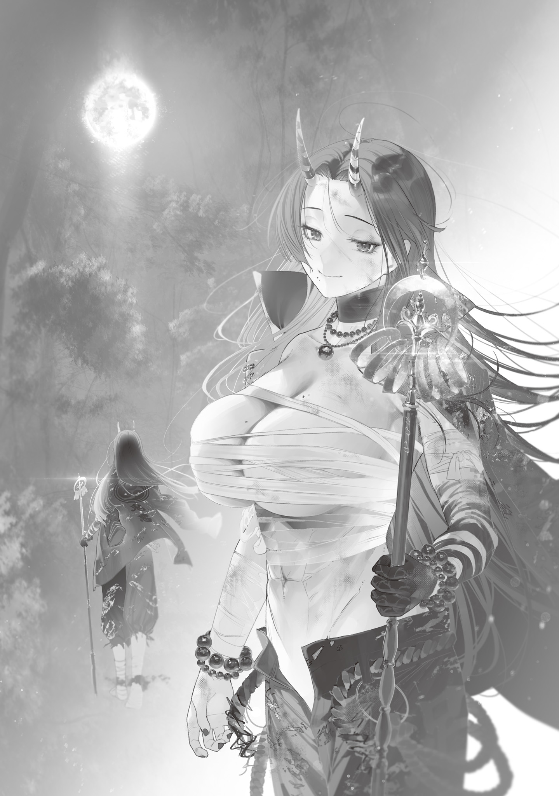

It was a tiny, tiny village in the mountains, cut off from the outside.

Terraced fields and rice paddies covered the steep mountain slopes, and the scattered houses with tin roofs were old and worn down.

There were no traffic lights, of course, and the widest road was gravel instead of asphalt. Red rust covered a mini truck abandoned beside the road, and voracious vines were swallowing it up.

The Gremlin Disaster had devastated many cities and sent them into decline, but this little village was so quiet, small, and rundown that it looked like it might have been this way even before the disaster.

The Hell Witch came to the village around the start of October, deep into autumn. It was rice-harvesting season. The mountains blazed with color, and vivid fallen leaves carpeted the ground like brocade.

The Hell Witch walked all the way along those mountain paths, leaning on her khakkhara. The villagers welcomed her with screams and thrown stones.

“Oh, an oni! There's an oni!”

“Get outta here! We ain't got anything to eat!”

“Wait!! I'm a witch!! I just have something I want to ask!!”

“What's this? This oni can talk! Everybody, don't listen to it! Those are yokai words!”

“I told you, no!! I'm not a monster!! I'm not a yokai!!”

“Get Ikegami-san! It's an oni, an oni!”

No matter what she said, all she got back were insults and attacks. At a loss, the Hell Witch fled.

She fled until the village was out of sight, caught her breath behind a mossy boulder, and looked up at the sky.

Humanity had been robbed of electricity, transportation, and information networks. In cities, people had kept exchanging information, investigating the calamities humanity faced, and sharing what they learned. Isolated little communities couldn't do that.

There were plenty of little villages that had been unable to grasp the state of the world since the Gremlin Disaster and simply huddled in isolation, with no idea what was happening.

No, if they were managing to live at all, that was still better. Most of the little villages the Hell Witch had seen between leaving Tokyo and reaching here had been destroyed by food shortages or monster attacks. People had vanished, and monsters had made nests in collapsing houses. There was nobody to mourn them, and no graves.

This village had survived for more than three years without any help. That made it a rare case.

They had no way to know witches existed. They surely didn't know magic either.

It was only natural that they mistook the bizarre-looking Hell Witch for a monster and tried to drive her away.

The Hell Witch was traveling to help people suffering because of the Gremlin Disaster. If the villagers were getting by without problems, there was no reason for an outsider to stick her nose in while getting pelted with stones.

But one thing bothered her...

As the Hell Witch puzzled over the village's problems, she heard a twig snap. When she looked that way, she noticed a little girl peeking around the other side of the boulder she'd been leaning against, half-hidden and staring at her with open curiosity.

She was maybe six or seven. Her cheeks were hollow, and her lips were chapped. Her pink shoes were much too big, and her clothes were just as oversized.

Even so, there wasn't a trace of fear in her sparkling, innocent eyes. Once she realized the Hell Witch had noticed her, she walked right over without the slightest hesitation.

“Hello!”

“...Hello!!”

“Wah.”

The girl had greeted her cheerfully, so the Hell Witch greeted her back. Startled by the loud voice that came out whether the Hell Witch wanted it to or not, the girl covered her ears. The Hell Witch must have been intimidating, but the girl just stood there with her mouth hanging open and looked up at her without any wariness.

The Hell Witch smiled.

She was a cute little girl who wasn't afraid of a man-eating monster like her. It was dangerous for a child to leave the village alone and approach some bizarre stranger she knew nothing about, but even so, the Hell Witch was simply happy.

The Hell Witch decided to talk to the little girl for a bit, partly to gather information.

“You're from the village, right!! I'm the Hell Witch!! I just want to ask one thing!! Where does this village get its water!!?”

“Huh, water? Um, there's a river for water. But it's gone now.”

“Gone!!? You mean it dried up!!?”

“Dried... up? Um, water stopped coming to the place where it used to flow.”

Using all the words she knew, the girl did her best to explain. Apparently, the village's water source had dried up soon after the Gremlin Disaster.

The soil in the village's fields and rice paddies was bone-dry and cracked. Even the heads of rice that should have been heavy with grain were thin and lifeless.

She had worried the village might be suffering a water shortage from the moment she entered and saw the weak crops, and sure enough, it was.

The source of the stream that ran through the village and supplied water to its fields and paddies was apparently behind the home of Ikegami-san, a prominent man in the village. Uncle Ikegami used spells to protect the village from monster (yokai) attacks, the girl said, puffing out her chest proudly.

“Hmm...!!? Spells, huh!!”

The Hell Witch was almost certain that meant some kind of magic. Was this Ikegami fellow a mage? If he was a man who had awakened as a Transcendent like her, then of course he could drive off monsters and protect the village.

But it just didn't make sense. If Ikegami was a mage, that explained why monsters hadn't wiped out the village, but it didn't explain why the river had dried up.

The girl didn't seem to know the details either, so the Hell Witch crossed her arms and thought it over.

The girl poked the Hell Witch's thick thigh as the Hell Witch wondered how far she should involve herself in the village's affairs, then fidgeted and said,

“Hey, onee-san. Will you play with me...?”

“Huh!!? U-Um, shouldn't you play with kids your own age!!?”

“Ton-nii and Yaa-chan died. I don't have a mom or dad either, and Uncle and Auntie won't play with me. They say they're busy.”

The girl pouted as she complained, leaving the Hell Witch at a loss for an answer.

The Gremlin Disaster had taken and destroyed everything. Sadly, it wasn't rare for people to have lost family or friends. If anything, it was rarer for someone not to have lost anyone close to them.

But that didn't mean, “Everyone's suffering, so it's okay.”

The Hell Witch nodded.

“Sure, but only for a little while!! Even a flower without nectar may still have fragrance[×××エウズニムテイイ・ウエウエントウエスア].”[^1]

The Hell Witch put her hand on the ground and chanted the incantation, making flowers grow from under the fallen leaves and form a flower crown.

The flower crown had a faint, sweet scent. When she placed it on the girl's head, the girl's eyes shone and she cried out in delight.

“Whoa...! Amazing, amazing! How'd you do that!? Was it a spell!?”

“Hehehe!! Onee-san knows lots of magic[^2] like that!! Want me to teach you some!!?”

For a while, the Hell Witch even forgot her hunger and enjoyed their brief playtime. Maybe the girl had been starving for someone to play with. No matter what the Hell Witch did, she laughed and got so excited it was almost over-the-top, and just watching her made the Hell Witch feel warm inside.

But fun times passed quickly. Before long, the sun began to sink, and the Hell Witch stopped making a bamboo-leaf whistle.

“It's almost evening!! Time to go home!!”

“Whattt!? No! Why do I have to go home!?”

The cute girl had picked up the Hell Witch's volume in that short time and protested loudly. It was adorable.

The Hell Witch crouched down to meet the girl's eyes and gently ran her fingers through her hair, with its conspicuous split ends.

“Sorry!! I'm a bad oni!! If we stay together too long, I'll start wanting to eat you!!”

“Uh... I-It's okay? You can eat just the ends of my hair! So, come on, let's play more? Oh, onee-san, come to my house too! I've got cards, and Othello. I'll let you borrow my cutest doll!”

One little hand gripped the Hell Witch's fingertips, tugging and pleading.

Gently freeing her fingertips from that warm hand, the Hell Witch planted her khakkhara and stood up, then shook her head.

“No!! Come on, go back to the village now!! Uncle and Auntie must be worried!! I'll eat bad kids who make grown-ups worry!! Rawr!!!”

When she opened the second mouth on her belly and roared, the girl's eyes went round in surprise. Taking that chance, the Hell Witch jumped high, kicked off the trees, and vanished deeper into the mountains like a monkey.

Leaving the lonely girl was hard, but the Hell Witch refocused and headed for Ikegami's house, where the water source was.

What mattered was helping the troubled villagers. In other words, she had to do something about the dried-up water source.

If a landslide or something had crushed the water source, she could do something about it.

The Hell Witch had the strength, stamina, and willpower to work day and night for years. With a body like hers, she didn't need heavy machinery.

The village's water source was behind the large, impressive house built on the highest spot in the village. There should have been a large pond there, with water flowing from it to supply the whole village.

But the pond was surrounded by high piles of sandbags and fill dirt, making it impossible to see from outside.

What could the sandbags be for? There was also a smell like dried fish coming from around them, and that made no sense either.

Wondering about that, the Hell Witch pushed through the brush toward the sandbags. A dry gunshot rang out.

A slight pain pricked her temple, and a beat later, the Hell Witch realized she had been shot.

When she turned around, a middle-aged man stood with a hunting rifle raised, staring at her in disbelief.

After punching her own stomach hard to calm the appetite stirred by his well-padded, fat body, the Hell Witch raised both hands to show she meant no harm and tried to explain.

“No, sorry!! I'm not up to anything suspicious!! It's just that it looked like water wasn't coming to the village!! I came to look into why!! I don't mean any harm!!”

“Oh... uh...?”

“Do you live in this house!!? I'm the Hell Witch, traveling to help people!! Don't worry about how loud I am!!”

The man with the hunting rifle had been overwhelmed and flustered, but as the Hell Witch stood still for a while with both hands raised and a smile on her face, he gradually calmed down.

He cautiously lowered the hunting rifle and looked her up and down. His eyes kept going back and forth between her face and chest, and she sensed his lewd desire, but tried hard not to care. It wasn't pleasant, but if he didn't do anything, it wasn't worth pointing out and making things awkward.

While the man watched the Hell Witch, she watched him too. She had suspected he might be a mage, but he wasn't. His magic power was average.

He was probably an ordinary person with no special powers. It was still possible he had some special skill that didn't rely on magic power, like that Wand Maker.

As the Hell Witch carefully sized him up, the man asked hesitantly.

“Are you... a yokai?”

“I used to be human!! Normal animals turn into monsters, um, or I guess you'd call them yokai!!? You know animals turn into yokai!!? I'm the human version!! You can think of me as a human with yokai-like power!!”

“I-I see.”

The booming voice made the man flinch again.

“You said you were a witch? I don't know who you are, but go home. It's a nuisance having outsiders wandering around.”

“Yeah, sorry for an outsider sticking her nose in!! But I couldn't just leave it alone!! Could you at least tell me what's causing the village's water shortage!!? The water source is here, right!!?”

“Don't know. Go home.”

“Hmm, that's a problem!!”

The man's dismissive attitude made the Hell Witch suspicious.

Of course, she understood that the truly suspicious one was the monster-looking stranger who'd appeared out of nowhere and started asking about an important village facility: her.

But even allowing for that, the man seemed to be hiding something.

He was like a high schooler hiding a cigarette behind his back in front of a teacher, his eyes wandering. The sight reminded her of scenes she'd witnessed in her school days.

For now, the Hell Witch took only a few slow steps with both hands still raised and stood beside a thick tree that had been there for decades. Then she casually wrapped both arms around the tree, pulled it out by the roots, and threw it away.

The man's mouth fell open, and he dropped his hunting rifle.

“This really is a problem!! I only want to know why the water dried up!! What should I do!!? Maybe I'm starting to get annoyed!!”

“Ah. Uh, hahaha, if that's what you wanted, you should've said so from the start. Haha. The water source, the water source. Uh, this way, then. I'll show you.”

The man gave in to the intimidation of that brute display of strength. His attitude changed completely, and he welcomed the Hell Witch with a meek, fake smile.

The man, who introduced himself as Ikegami, brought a ladder from his shed and leaned it against the stacked sandbags so they could get inside.

Ikegami used the ladder to get inside the enclosure, but the Hell Witch cleared the wall with a light jump. A single monster occupied the large pond within.

It was a giant catfish at least 5 m long.

The pond's water level had dropped all the way, exposing soggy gray mud. The giant catfish was coiled in the center of that sludge, slurping fresh water that welled up from the bottom of the mud.

The catfish glared at the intruding Hell Witch with cloudy eyes, shook its whiskers, gave a cry like a fat frog, and used some kind of magic.

At once, an invisible wave spread out from the giant catfish and grated on the Hell Witch's nerves.

Feelings of not wanting to be there and wanting to get away surged up in her. The Hell Witch gripped her khakkhara tightly and gritted her teeth. She threw all her mental strength and control over her magic power into suppressing the magic's interference with her mind.

The Hell Witch let out a heavy breath through her gritted teeth and realized that this giant catfish was why monsters hadn't attacked the village.

One monster was staking such a powerful claim to its territory that other monsters stayed away.

The Hell Witch took deep breaths to calm herself, but Ikegami didn't seem to feel anything.

Was it magic that only affected those with strong magic power? Or magic that only worked on supernatural beings?

In any case, Ikegami began explaining what had happened as he stroked the giant catfish's slimy back.

“This thing's a yokai that settled in the pond right after the electrical disaster. I call it the Water Eater.”

“The Water Eater!!?”

“It drinks water until it's full. It drinks as much as there is. This thing is the village's guardian god, so I've got to give it the pond's water and keep it fed. The people down below will have to put up with being a little short on water. It's a whole lot better than getting attacked and killed by monsters, right?”

“...”

For a moment, Ikegami's explanation sounded reasonable.

Even if there wasn't enough water, it would only mean a bad harvest. But if monsters attacked, people would die right away.

Should they send the pond's water to the village, starve the Water Eater, and risk monster attacks?

Or should they give the pond's water to the Water Eater, bring on a poor harvest, and risk starvation?

It was a hard choice.

But even so, something was strange. The Hell Witch gave Ikegami a doubtful look.

“Then why are you hiding the pond!!? This monster is pretty strong, right!!? You're not protecting it from the villagers, are you!!?”

“Th-That's...”

At a loss for an answer, Ikegami mumbled and shuffled his feet, trying to hide something.

The sharp-eyed Hell Witch noticed, shoved Ikegami aside, and checked under the Water Eater's belly. A pile of gold dust lay there, still gleaming dully through the mud.

As the Hell Witch stared in shock at the unexpected treasure, the Water Eater let out a huge burp. A fresh piece of gold plopped out of its butt.

“Gold...!!? This monster makes gold!!”

“Tch! Yeah, that's right. The Water Eater is a money tree, a gold-producing yokai. I built the wall so nobody with bad intentions could steal its gold. That's why I didn't want to show you. Got it?”

Ikegami seemed to have confessed resentfully, but he still hadn't told her everything.

Now that she'd come this far, she needed to uncover everything that looked suspicious.

The Hell Witch pointed to one corner of the piled-up sandbags and asked about the source of the dried-fish smell.

“Whose grave is that!!?”

“...A grave? What are you talking about?”

There was a slight hesitation before he answered, and that told her he had a guilty conscience.

The Hell Witch slipped past Ikegami as he played dumb, knelt where the smell was coming from, and began vigorously digging with both hands.

“Hey, what are you doing!? Stop! Don't dig that up!”

“You don't know anything about a grave, right!!? Then you don't know what this is either—right!!?”

The Hell Witch was a man-eating oni.

She ate human flesh, and human bones too. She could smell them. Her nose for humans was far keener than any human's.

The dried-fish smell drifting up from beneath the ground definitely came from a human skeleton.

The Hell Witch uncovered the buried body. The corpse was nothing but bones, with tattered synthetic clothes still clinging to it. From the scraps of clothing and the skeleton, she could tell it was a woman.

There was also a mark on the woman's skull at the temple, as though something hard and small had punched through it.

It looked as if she had been shot with a hunting rifle.

The Hell Witch glared at Ikegami, who stood there frozen and pale.

“You!!! You killed this person!!?”

When she demanded an answer, Ikegami lost his temper and shouted back.

“...I had no choice! I said we should split the gold. But she said we should cut the Water Eater's water in half and send the rest to the village! She was an idiot! She didn't understand what gold was worth. If we cut the water in half, we only get half as much gold. She couldn't do math that even a kid could do. You get it, right?”

“I don't get it!! Gold isn't a reason to kill someone!! And gold is useless in the world now!!”

“No, you're wrong! Didn't you learn it in school? Gold has value in any age. Even if civilization collapses, gold is still gold. How much do you think all this gold is worth? Gold is worth more than a human life!”

Ikegami said those unbelievable things with absolute confidence in how smart he was.

The Hell Witch remembered.

The villagers who had been cutting thin rice heads with sickles were as skinny as the rice heads themselves.

The people of this village had escaped the threat of monsters, but they were suffering from a food shortage that could have been avoided.

All because one man's ugly greed had monopolized the water source.

“...You're a bad person!! The villagers suffering because of you have the right to judge you!! Free the water source, confess everything, and wait for their judgment!!”

“Hah! It's pointless. The villagers completely believe I'm a sorcerer who uses spells to drive yokai out of the village. I guarantee it, they won't believe a word some oni like you says. My side of the story or your side of the story. Which one do you think the villagers will believe?”

Ikegami backed away as the Hell Witch closed in, a faint smile on his face.

The villagers had wanted nothing to do with the Hell Witch from the moment they saw her.

It pissed her off, but Ikegami was right.

When the villagers tried to drive the Hell Witch away, they had called for Ikegami's help. The little girl had clearly respected him too.

Ikegami had the village completely under his control. Nothing an outsider said would get through to them.

“I don't care if they believe me!! You only need to give half the water to the Water Eater, right!!? Here's my ultimatum: free the water source!!”

“Don't make such a scary face. Hey, you look like you can handle yourself, and you've got a pretty face. You're way too tall, though. Truth is, since my wife disappeared, my nights have been boring. So how about this? I'll give you half the gold, and you can say I subdued you and become my second wife—”

“That's too bad!! Take this!!”

He ignored her ultimatum.

Without letting him finish, the Hell Witch tore the bad man's head off with her bare hands.

She opened one of her three mouths wide, the mouth on the back of her head, and ate the torn-off head. At the same time, the mouth on her belly devoured the headless body.

Sadly, fresh human flesh filled her parched body and melted away the hunger she'd endured for so long in an instant.

Drooling thick, stringy saliva from the mouths on the back of her head and her belly as she ate the body, the Hell Witch called into her belly.

“Sorry, but you're going into my stomach instead of a grave!! Become my flesh and blood, and when I die, let's fall into hell together!!”

The Bloodsucking Mage might have been able to talk Ikegami into changing his ways.

The Foresight Mage might have been able to see a future where the situation could be fixed without killing Ikegami.

Even the Edogawa Witch, the Eyeball Witch, or the Flame Witch. Surely any of them could have settled things in another, more peaceful way.

But the Hell Witch could only do this.

Kill, then eat.

Bloody solutions were all she had.

After eating half the bad man and taking a breath, the Hell Witch set the half-eaten body aside for the moment and started cleaning up.

First, she tore down the sandbags surrounding the pond so the clear spring water that kept bubbling up could flow to the village.

She made a small reservoir some distance from the large pond for the fat Water Eater and shoved it in there. She dug a channel to let some water flow in from the large pond, which should keep it from starving.

The giant catfish was so fat it couldn't even jump by itself. Forced out of its comfortable mud, it wriggled unhappily. It let out a cry and tried to drive her away with magic, but when she slapped it, it flinched and went quiet.

The Water Eater was just living.

It had no intention of harming the villagers or protecting them either.

The Water Eater didn't care at all when Ikegami, who had probably taken such good care of it, was killed right in front of it.

The magic the Water Eater used to keep away enemies just happened to help people.

The shit the Water Eater produced after eating water just happened to be something that stirred human greed.

In the end, Ikegami was the only bad person in this village.

And because of that one man who laid bare his filthy greed, one person died and many suffered.

At least from now on, may this village head in a better direction.

With that prayer, the Hell Witch headed down to the village where everyone could see her, greedily eating Ikegami's half-eaten body with the mouth on her belly.

The villagers, who had been putting away their sickles and hoes in the deep-red sunset, were so shocked they nearly fell over. A huge commotion broke out, like someone had kicked a beehive.

“Waaaaah! It's back! An oni! An oni is here!”

“It's eating someone! Those clothes... Don't tell me that's Ikegami-san!?”

“The oni ate Ikegami-san!”

“W-What, what have you done!?”

“Don't falter! Grab your weapons! You evil oni, we can't let you get away with this!”

“Kill it! Kill it!”

It was just like when she had first set foot in the village. But the insults and attacks were even fiercer.

Then the Hell Witch spotted the little girl she had spoken to only briefly among the furious villagers.

Their eyes met as the girl was shielded behind an adult's back.

Amid the roaring shouts, that small voice was strangely clear. Clear enough that she wished she hadn't heard it.

“Eek... M-Murderer...”

When the Hell Witch saw the unmistakable fear and disgust in the girl's eyes, her chest hurt as if a dragon had bitten it.

A man-eating monster trying to be friends with humans was never going to work.

They threw stones at her, jabbed her with spears, and showered her with abuse and curses.

None of it hurt the Hell Witch, but she pretended it did and staggered away. On the way, she made sure to drop gold along with a scroll.

It was a scroll containing instructions for simple magic that ordinary people could use, which she had learned at the Tokyo Witches' Council.

The people of this village wouldn't listen to anything an oni said.

But they would probably read a secret scroll left behind by the oni they had defeated.

People hated having things forced on them, but they liked things they had won with their own strength.

After putting on that little performance, the Hell Witch looked back once she was far enough away from the village.

The villagers weren't chasing her. Their victory cries came from beyond the trees, and the Hell Witch smiled, knowing this had been for the best.

Now water would return to the village.

With the Water Eater keeping monsters away, an abundant water source, and easy, useful magic, life in the village would surely become much easier from here on.

What mattered was for the innocent people suffering through hard times to be happy.

For that, she didn't care how much infamy she had to carry. She didn't care if she fell into hell.

She didn't care if people hated her.

With a sense of accomplishment and a little loneliness in her chest, the Hell Witch turned her back on the village and continued her journey, tapping the khakkhara named for Kishimojin[^3] and making its rings jingle softly.

It was a lonely journey all by herself, but whenever she held the staff, she could remember that she really did have someone who understood her beneath this sky.

The parting gift from the Wand Maker, who had understood what her harsh wandering journey meant, had truly become a source of strength for the Hell Witch.

## Translator Notes

[^1]: The brackets give the magic-language pronunciation of the written incantation; `×××` marks a sound humans cannot pronounce.
[^2]: The source writes “magic” but gives it the reading “spell,” echoing the girl's term for magic.

[^3]: **Kishimojin** (鬼子母神): The Japanese Buddhist form of Hariti, a former child-eating demon who became a protector of children.
