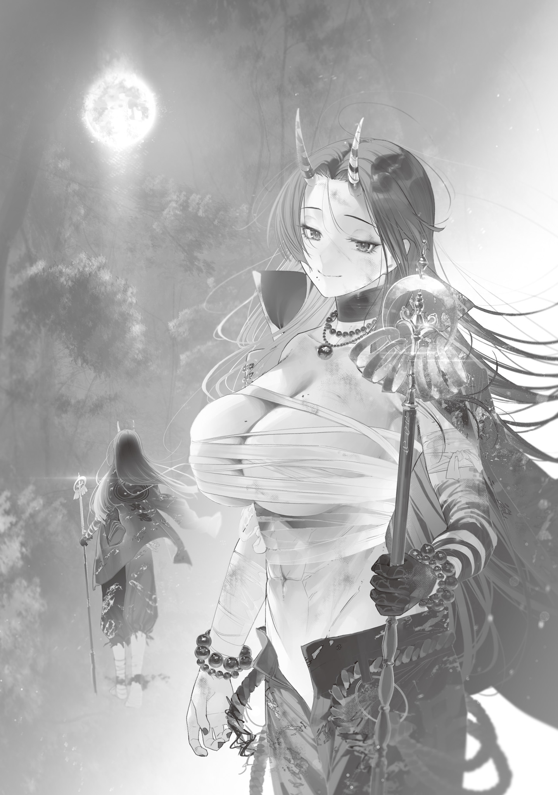

It was a tiny little village tucked away in the mountains, cut off from the outside world.

Terraced fields and rice paddies climbed the steep mountainsides, and the tin-roofed houses dotted here and there had grown old and weathered.

There were no traffic lights, naturally, and the widest road was gravel, not asphalt. A mini truck abandoned beside it was blistered with rust and slowly disappearing under greedy, spreading vines.

The Gremlin Disaster had wrecked plenty of cities and left them in decline, but this little village was so quiet, small, and forgotten that it might well have looked like this before the disaster, too.

The Hell Witch arrived in early October, as autumn deepened. It was rice-harvest season. The mountains blazed with color, and bright fallen leaves carpeted the ground like brocade.

She had come a long way on foot along those mountain paths, leaning on her khakkhara, and the villagers greeted her with screams and a hail of stones.

“O-Oni! There's an oni out here!”

“Get outta here! There ain't nothin' to eat here!”

“Wait!! I'm a witch!! I just want to ask something!!”

“What the—this oni talks! Don't listen to it, everybody! That's yokai talk!”

“I'm telling you, I'm not!! I'm not a monster!! I'm not a yokai!!”

“Get Ikegami-san! It's an oni, an oni!”

Whatever she said, she got only insults and attacks in return, and at her wits' end, the Hell Witch fled.

Once the village was out of sight, she stopped to catch her breath in the shade of a mossy boulder and looked up at the sky.

Humanity had lost electricity, and with it transportation and its information networks. In the cities, people had traded information and investigated over and over until they had a shared picture of the catastrophe that had struck humanity. Small, isolated communities had no such luck.

Plenty of small villages had never grasped the state of the world after the Gremlin Disaster and had simply huddled where they were ever since, with no idea what was going on.

No—if they were still managing to live at all, they were the lucky ones. Most of the small villages the Hell Witch had passed since leaving Tokyo had been wiped out by food shortages or monster attacks. The people were gone, and monsters nested in the crumbling houses. There was no one left to mourn the dead, and there were no graves.

This village had kept itself alive for more than three years with no help from anyone. That made it a rare case.

They'd had no way of learning that witches existed. They probably didn't know about magic, either.

No wonder they had taken the Hell Witch, with her inhuman shape, for a monster and tried to drive her off.

The Hell Witch was traveling to help people suffering from the Gremlin Disaster. If the villagers were getting along fine, there was no reason for an outsider to butt in and get pelted with stones for her trouble.

But one thing bothered her...

While the Hell Witch puzzled over the village's troubles, a twig snapped. She looked toward the sound and found a little girl half-hidden on the far side of the boulder she'd been leaning on, watching her with open curiosity.

The girl looked six, maybe seven. Her cheeks were hollow and her lips chapped. Her pink shoes were far too big for her, and so were her clothes.

Still, there wasn't a trace of fear in her bright, innocent eyes. When she realized the Hell Witch had spotted her, she came right on over without a hint of shyness.

“Hello!”

“...Hello!!”

“Wah.”

The girl had greeted her so cheerfully that the Hell Witch greeted her back. Her voice came out loud whether she liked it or not, and the startled girl covered her ears. It must have hit her like a blast, but the girl only stared up at the Hell Witch with her mouth hanging open, without the least bit of wariness.

The Hell Witch smiled.

What a sweet little girl, not even scared of a man-eating monster like her. A child wandering away from the village alone to approach some inhuman stranger from who-knows-where was a dangerous thing, but all the same, the Hell Witch was honestly glad.

She decided to chat with the little girl for a bit. It would also be a chance to gather information.

“You're from the village, right!! I'm the Hell Witch!! I just want to ask one thing!! What does this village do for water!!?”

“Huh, water? Um, we've got a river for water. But it's gone now.”

“Gone!!? You mean it dried up!!?”

“Dried... up? Um, the water stopped coming where the water used to go.”

The girl did her very best to explain with every word she knew, and from what she said, the village's water source had dried up not long after the Gremlin Disaster.

The soil in the village's fields and paddies was bone-dry and cracked, and the rice, which should have been hanging heavy with grain, was thin and limp.

She'd suspected a drought from the moment she set foot in the village and saw how sickly the crops looked, and sure enough, she'd been right.

The water source for the stream, which ran through the village and watered its fields and paddies, was apparently behind the house of Ikegami-san, the village's big man. Uncle Ikegami used spells to protect the village from monster (yokai) attacks, the girl said, puffing out her chest with pride.

“Hmm...!!? Spells, huh!!”

Some kind of magic, almost certainly, the Hell Witch guessed. Was this Ikegami a mage? If he'd awakened as a Transcendent like her, then of course he could drive off monsters and protect the village.

But something didn't add up. If Ikegami was a mage, that explained why monsters hadn't wiped out the village, but not why the river had dried up.

The girl didn't seem to know any of the details either, so the Hell Witch folded her arms and thought it over.

As the Hell Witch wondered how far she ought to stick her nose into the village's affairs, the girl poked her thick thigh and fidgeted. “Hey, onee-san. Will you play with me...?”

“Hweh!!? W-Well, um, why not play with kids your own age!!?”

“Ton-nii and Yaa-chan died. My mom and dad are gone too, and Uncle and Auntie won't play with me. They say they're busy.”

She pouted as she said it, and the Hell Witch didn't know how to answer.

The Gremlin Disaster had taken everything and broken everything. Sadly, losing family or friends wasn't unusual at all. If anything, it was rarer to meet someone who hadn't lost anyone close.

But just because everyone was suffering didn't make it okay.

The Hell Witch nodded.

“Sure, but only for a little while!! <ruby>××× Euzu Nimu Teii Ueuento Uesua<rt>Even a flower without nectar may still have fragrance</rt></ruby>.”[^1]

The Hell Witch put her hand to the ground and recited the incantation, and flowers sprouted from under the fallen leaves and wove themselves into a crown.

The crown gave off a faint, sweet scent. When she set it on the girl's head, the girl's eyes lit up and she squealed with delight.

“Whoa...! Amazing, amazing! How'd you do that!? Was it a spell!?”

“Hehehe!! Onee-san knows lots of magic[^2] like that!! Want me to teach you some!!?”

For a little while, the Hell Witch even forgot her hunger and enjoyed their brief game. The girl must have been starved for a playmate. Whatever the Hell Witch did, she laughed and squealed almost over the top, and just watching her warmed the Hell Witch's heart.

But good times always fly by. Before long the sun started to sink, and the Hell Witch put down the bamboo-leaf whistle she was making.

“It's almost evening!! Time to go home!!”

“Whaaat!? No! Why do I have to go home!?”

In that short time, the cute little girl had already picked up the Hell Witch's habits, and she protested at the top of her lungs. It was adorable.

The Hell Witch crouched to the girl's eye level and gently combed her fingers through her hair, split ends and all.

“Sorry!! I'm a bad oni!! If I stay with you too long, I'll start wanting to eat you!!”

“Huh... I-It's fine? You can eat the ends of my hair! So, come on, let's play some more? Oh, I know, onee-san, come to my house! I've got cards, and Othello too. I'll lend you my cutest doll!”

A small hand caught hold of the Hell Witch's fingertips and tugged, pleading.

The Hell Witch gently slipped free of that warm little hand, planted her khakkhara, stood up, and shook her head.

“No!! Come on, go back to the village now!! I bet your uncle and auntie are worried!! I eat bad kids who make grown-ups worry!! Rawr!!!”

She roared with the second mouth on her belly wide open, and the girl's eyes went round. In that moment, the Hell Witch leaped high, kicked off from tree to tree, and vanished deep into the mountains like a monkey.

It was hard to leave the lonely little girl behind, but the Hell Witch pulled herself together and set off for Ikegami's house, where the water source was.

What mattered was helping the villagers in their trouble—which meant doing something about the dried-up water source.

If a landslide or something had buried the water source, she could handle that.

The Hell Witch had the power, stamina, and willpower to work for years without sleep or rest. With a body like hers, who needed heavy machinery?

The village's water source lay behind an impressive house on the highest ground in the village. There should have been a large pond there, with water flowing out of it to supply the whole village.

Instead, the pond was ringed by high walls of stacked sandbags and heaped earth that hid it from view.

What were the sandbags for? A smell like dried fish drifted from around them, too, which was just as puzzling.

Wondering what was going on, the Hell Witch pushed through the brush toward the sandbags, and a gunshot cracked through the air.

Something stung her temple, and a beat later, she realized she'd been shot.

She turned around to find a middle-aged man with a hunting rifle raised, gaping at her in disbelief.

The sight of his well-fed, fat body stirred her appetite, so she punched her own stomach hard to quiet it. Then she raised both hands to show she meant no harm and tried to explain.

“No, sorry!! I'm not anyone suspicious!! It's just, it looked like no water was reaching the village!! So I came to find out why!! I'm not hostile!!”

“Oh... uh...?”

“Are you from this house!!? I'm the Hell Witch, and I'm traveling around helping people!! Don't mind how loud I am!!”

The man with the rifle was overwhelmed and flustered, but after the Hell Witch had stood still for a while with her hands up and a smile on her face, he gradually calmed down.

He warily lowered the rifle and looked her up and down. His eyes kept crawling back and forth between her face and her chest, and she could feel the lust in them, but she did her best to ignore it. It wasn't pleasant, but as long as he didn't try anything, it wasn't worth calling out and souring the mood.

While he studied her, the Hell Witch studied him right back. She'd suspected he might be a mage, but no. His magic power was average.

He was probably just an ordinary person with no powers at all, though she couldn't rule out some special skill that didn't depend on magic power, like that Wand Maker had.

As she carefully sized him up, the man asked hesitantly, “Are you... a yokai?”

“I used to be human!! Ordinary animals turn into monsters—um, I guess you'd call them yokai!!? You know about that, right!!? I'm the human version!! Just think of me as a human with yokai-like powers!!”

“I-I see.”

Blasted by that booming voice, the man flinched again.

“A witch, you said? I don't know who you are, but leave. Outsiders poking around here are a nuisance.”

“Yeah, sorry for butting in when I'm an outsider!! But I couldn't just leave it alone!! Can you at least tell me why the village is short on water!!? The water source is here, right!!?”

“Don't know. Leave.”

“Hmm, that's a problem!!”

The man's cold shoulder struck the Hell Witch as suspicious.

Of course, she understood that the one who truly looked suspicious was her: a monster-shaped stranger who'd shown up out of nowhere wanting to know about the village's most important facility.

But even allowing for that, he seemed to be hiding something.

He was like a high schooler hiding a cigarette behind his back in front of a teacher, eyes darting everywhere. It was a scene she'd watched play out back in her own school days.

For now, the Hell Witch kept her hands up and took a few slow steps over to a thick tree that had to be decades old. Then, without any fuss, she wrapped both arms around it, pulled it out by the roots, and tossed it aside.

The man's jaw dropped, and the rifle fell from his hands.

“This really is a problem!! All I want to know is why the water dried up!! What should I do!!? I think I'm starting to get a little annoyed!!”

“Ah. Uh, hahaha, if that's what you wanted, you should've said so from the start. Haha. The water source, the water source. Uh, this way, then. I'll show you.”

Cowed by that primitive show of strength, the man did a complete about-face and welcomed the Hell Witch with a groveling, fake smile.

He introduced himself as Ikegami, then fetched a ladder from his shed and leaned it against the sandbag wall so they could climb in.

Ikegami climbed over on the ladder, but the Hell Witch cleared the wall with a light hop. Inside, in the large pond, was a single monster.

It was a giant catfish, easily 5 m long.

The pond had drained almost dry, leaving soggy gray mud exposed. The giant catfish lay coiled in the middle of the muck, slurping up the clean water that welled from beneath it.

It glared at the intruding Hell Witch with cloudy eyes, quivered its whiskers, let out a croak like a fat frog, and used some kind of magic.

At once, an invisible wave rippled out from the giant catfish and rubbed the Hell Witch's nerves raw.

A sudden urge welled up in her to get out of there, to be anywhere but here, and the Hell Witch gripped her khakkhara hard and clenched her teeth. Summoning every scrap of willpower and magic-power control she had, she managed to force down the magic tampering with her mind.

Letting out a heavy breath through her gritted teeth, the Hell Witch understood: this giant catfish was the reason monsters had left the village alone.

With one monster staking such a strong claim to its territory, no other monsters came near.

While the Hell Witch took deep breaths to steady herself, Ikegami didn't seem to feel a thing.

Did the magic only affect people with strong magic power? Or did it only work on supernatural beings?

Either way, Ikegami began explaining the whole story, stroking the giant catfish's slimy back.

“This thing's a yokai that moved into the pond right after the electrical disaster. I call it the Water Eater.”

“The Water Eater!!?”

“It drinks water by the bellyful. Drinks as much as there is. This thing's the village's guardian god, so I've gotta give it the pond water and keep it fed. The folks down below'll just have to put up with a little water shortage. Beats getting attacked and killed by monsters, right?”

“...”

For a moment, Ikegami's explanation sounded reasonable.

A water shortage only meant a bad harvest, but a monster attack meant people would die on the spot.

Send the pond water to the village, let the Water Eater starve, and risk monster attacks?

Or give the pond water to the Water Eater, let the crops fail, and risk starving?

It was a tough call.

But if that was the whole story, something didn't fit. The Hell Witch turned a suspicious eye on Ikegami.

“Then why are you hiding the pond!!? This monster's pretty strong, isn't it!! You can't be protecting it from the villagers!!”

“Th-That's...”

Stuck for an answer, Ikegami mumbled and shuffled his feet, trying to hide something.

The Hell Witch didn't miss it. She shoved Ikegami aside and checked under the Water Eater's belly, and there lay a heap of gold dust, gleaming dully even through the mud.

As she stared in shock at the unexpected treasure, the Water Eater let out a huge burp, and a fresh bit of gold plopped out of its butt right in front of her.

“Gold...!!? This monster makes gold!!”

“Tch! Yeah, that's right. The Water Eater's a money tree. A gold-making yokai. I built the wall so no crook could come steal its gold. That's why I didn't want to show you. Got it?”

Ikegami made it look like a grudging confession, but he still hadn't told her everything.

Now that she'd come this far, she was going to expose every last suspicious thing.

The Hell Witch pointed to one corner of the sandbag wall, where the dried-fish smell was coming from. “Whose grave is that!!?”

“...A grave? What are you talking about?”

He hesitated for a split second before answering, and that told her he had something to feel guilty about.

The Hell Witch slipped past Ikegami as he played dumb, knelt where the smell was coming from, and started digging furiously with both hands.

“Hey, what are you doing!? Stop! Don't dig that up!”

“You don't know anything about a grave, right!!? Then—you don't know what this is either, do you!!?”

The Hell Witch was a man-eating oni.

She ate human flesh, and human bones too. She could smell them, far more keenly than any human could smell another.

The dried-fish smell rising from under the ground was, without a doubt, coming from a human skeleton.

The Hell Witch's hands laid the buried body bare. It had long since been reduced to bones, with tattered synthetic clothing still clinging to it, and from the scraps of fabric and the shape of the skeleton, she could tell it was a woman.

And at the temple of the woman's skull was a mark, as though something small and hard had punched right through it.

It was just the kind of mark a hunting rifle would leave.

Seething, the Hell Witch glared at Ikegami, who stood rooted to the spot, white as a sheet.

“You!!! You killed this woman!!?”

When she confronted him, Ikegami flew into a rage and shouted back.

“...I had no choice! I told her we'd split the gold. But she goes and says we should cut the Water Eater's water in half and let the rest flow down to the village! She was an idiot, that one! She didn't get what gold's worth. Cut the water in half, and you get half the gold. Math any kid could do, and she couldn't do it. Hey, you get it, don't you?”

“No, I don't!! Gold's no reason to kill someone!! Besides, gold's useless in the world these days!!”

“Nope, you're wrong! Didn't they teach you in school? Gold's valuable in every era. Civilization can fall, and gold's still gold. How much do you think this much gold is worth? Gold's worth more than a human life!”

Ikegami spat out those unbelievable words with the conviction of a man utterly sure of his own cleverness.

The Hell Witch thought back.

The villagers cutting the thin rice with their sickles had been as thin as the rice itself.

The people here had been spared the threat of monsters, but they were struggling through a food shortage that never should have happened.

All because one man's ugly greed had him keeping the water source to himself.

“...You're a bad guy!! The villagers suffering because of you have the right to judge you!! Open up the water source, confess everything, and wait for their verdict!!”

“Hah! Waste of time. The villagers are dead sure I'm a sorcerer whose spells keep yokai out of the village. I guarantee it, they won't believe a word an oni like you says. My word against yours. Who do you think they'll believe?”

Ikegami backed away as the Hell Witch advanced on him, but a thin smirk stayed on his face.

Just showing her face had been enough for the villagers to reject the Hell Witch outright.

It made her furious, but Ikegami had a point.

When the villagers were driving her off, they'd talked as if Ikegami was the one to count on. The little girl, too, had spoken of him with real admiration.

Ikegami had the village firmly in his grip. Nothing an outsider said would get through.

“I don't care whether they believe me!! Half the water's enough for the Water Eater, right!!? Here's my ultimatum: open up the water source!!”

“Don't make such a scary face. Look, you seem pretty handy with your fists, and you've got a nice face. Way too tall, though. Truth is, my nights've been pretty dull since my wife disappeared. So here's the deal. I'll give you half the gold, we'll say I subdued you, and you can be my second wife—”

“What a shame!! Hyah!!”

He had ignored the ultimatum.

Before he could finish, the Hell Witch tore the bad man's head off with her bare hands.

She opened wide the mouth on the back of her head, one of her three, and devoured the torn-off head, while the mouth on her belly gorged on the headless body.

Sad to say, the fresh human flesh filled her parched body to the brim and, in one go, melted away the hunger she had endured for so long.

Sticky strings of drool hung from the mouths on the back of her head and on her belly as she ate, and the Hell Witch spoke to what was in her stomach.

“Sorry, but you're going into my stomach instead of a grave!! Become my flesh and blood, and when I die, let's fall into hell together!!”

The Bloodsucking Mage could have sweet-talked Ikegami into changing his ways.

The Foresight Mage could have seen a future where things got better without anyone dying.

The Edogawa Witch, the Eyeball Witch, the Flame Witch—any of them would surely have found some other, gentler way to settle this.

But this was all the Hell Witch could do.

Kill. Eat.

The only solutions she had were bloody ones.

Once she'd eaten half the bad man and caught her breath, the Hell Witch set the half-eaten corpse aside for now and started cleaning up.

First, she broke down the sandbags around the pond so the clear spring water that kept welling up could flow down to the village.

For the bloated Water Eater, she dug a small reservoir a little way from the big pond and shoved it in. She also dug a channel to let some water run in from the big pond, which should keep it from starving.

The giant catfish was too fat even to flop around on its own. Dragged out of its cozy mud against its will, it squirmed in protest, croaking and trying to drive her off with magic, but one slap made it flinch and go quiet.

The Water Eater was just living its life.

It had no intention of hurting the villagers, or of protecting them.

Ikegami had probably looked after it devotedly, yet it didn't care in the slightest when he was killed right in front of it.

The magic it used to keep enemies away just happened to be useful to people.

The dung it produced from eating water just happened to be something that stirred human greed.

In the end, the only bad person in this village had been Ikegami.

And because of that one man and his naked, filthy greed, one person had died and many more had suffered.

From now on, at least, may things go better for this village.

With that prayer, the Hell Witch headed down into the village where everyone could see her, making a show of gorging on Ikegami's half-eaten corpse with the mouth on her belly.

The villagers putting away their sickles and hoes in the red glow of sunset nearly jumped out of their skins, and the whole place erupted like a stirred-up hornets' nest.

“Waaaaah! Again! It's the oni! The oni's back!”

“It's eating somebody! Those clothes... No, is that Ikegami-san!?”

“The oni ate Ikegami-san!”

“W-What, what have you done!?”

“Hold your ground! Grab your weapons! We can't let you get away with this, you evil oni!”

“Kill it! Kill it!”

It was a replay of her first visit to the village, except the insults and attacks were even fiercer now.

Then, among the enraged villagers, the Hell Witch caught sight of the little girl she'd talked with for such a short while.

The girl was sheltered behind an adult's back, and their eyes met.

Amid the roar of angry voices, that small voice came through strangely clear. So clear she wished she hadn't heard it.

“Eek... M-Murderer...!”

When the Hell Witch saw the unmistakable fear and disgust in the girl's eyes, her chest ached as if a dragon had bitten into it.

A man-eating monster trying to be friends with humans was never going to work.

They pelted her with stones, jabbed her with spears, and showered her with abuse and curses.

None of it hurt the Hell Witch, but she pretended it did and staggered away. On the way, she made sure to drop some gold, along with a scroll.

She had written it herself: instructions for simple magic that even ordinary people could use, the kind she'd learned at the Tokyo Witches' Council.

The people of this village would never listen to anything an oni said.

But they would probably read a secret scroll dropped by the oni they'd beaten.

People hated having things pushed on them, but they loved what they'd won with their own strength.

Her little act over, the Hell Witch looked back once she was well away from the village.

The villagers weren't chasing her. Victory cries rose from beyond the trees, and the Hell Witch smiled. This had been for the best.

Now the water would come back to the village.

Between the Water Eater keeping monsters away, a plentiful water source, and handy, easy magic, life in the village would surely get a lot easier from here on.

What mattered was that the innocent people struggling through hard times could be happy.

For that, she didn't care how bad a name she had to carry. She didn't care if she fell into hell.

She didn't care if people hated her.

Carrying a sense of accomplishment and a little loneliness, the Hell Witch turned her back on the village and went on with her journey, planting her khakkhara named for Kishimojin[^3] as its rings jingled softly with each step.

She traveled completely alone, but whenever she held the staff, she remembered that somewhere under this same sky was someone who understood her.

The farewell gift from the Wand Maker, who had understood the point of her grueling, wandering journey, had truly become a source of strength for the Hell Witch.

## Translator Notes

[^1]: The brackets give the magic-language pronunciation of the written incantation; `×××` marks a sound humans cannot pronounce.
[^2]: The source writes “magic” but gives it the reading “spell,” echoing the girl's term for magic.

[^3]: **Kishimojin** (鬼子母神): The Japanese Buddhist form of Hariti, a former child-eating demon who became a protector of children.
