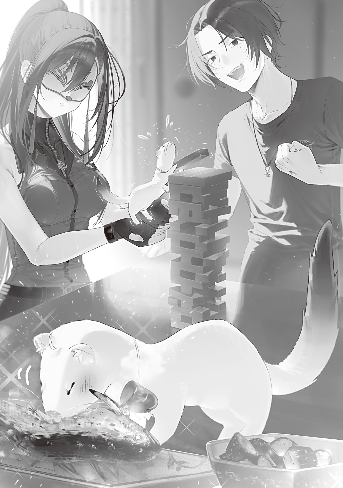

It was the height of summer, and the scorching days kept coming. Ears had started forming on the rice in my paddies.

The grains would now form and swell inside those ears, leading to a rich autumn harvest. It was an important stage. Every stage of rice farming from spring to autumn was important, but the crop needed extra care once the ears began to form.

Last year, I'd skimped too much on the topdressing that helped the grains fill out, so too many of them had come out light. This year, I spread more than before.

With no new chemical fertilizer being produced, the effective stuff was precious. Before the Gremlin Disaster, people could apply plenty of it, knowing it would reliably boost their yield. Now I had to judge the amount carefully and make it last.

I'd also tried making organic fertilizer by composting human waste and food scraps, but that wasn't going very well. Apparently, one person's waste simply wasn't enough.

A compost heap made from one person's household waste was too small.

If the heap was too small, the heat from fermentation escaped before the temperature could rise.

If the temperature didn't rise, the bacteria and parasites in the compost didn't die.

If they didn't die, the waste didn't become good compost.

If I forced the temperature up with fire or boiling water, I'd kill the microorganisms that needed to survive too.

That was why making good compost on my own was so difficult.

My household had recently grown to one person and three <ruby>lizards<rt>fire salamanders</rt></ruby>, but those guys lived on charcoal and didn't poop. All they did was burp like little exhaust pipes.

City centers produced huge amounts of household waste, so apparently their fertilizer production was going well. I could've just had them send me some, but I didn't want the basics of my life to depend too much on outsiders. What if they started saying, “If you want fertilizer, do this! Do that!” Probably just paranoia, but still.

One day, as I tended the paddies, I was also designing a contraption that used insulation, vapor pressure, and a brazier to keep the compost at a constant temperature with minimal supervision. Then a letter arrived from Professor Ohinata.

It opened with the usual seasonal greeting, then moved on to news from the city and answers to my questions. What surprised me was the part that said, “I'd like to come visit you soon.”

Professor Ohinata knew how bad I was with people and had always been very considerate about it. I wondered what had brought this on, but the letter continued: “I've succeeded in stabilizing transformation magic.”

What?!

So this means you can switch freely between stoat mode and beastkin mode?!

Whoa, this is huge!

If she was coming as a small, fluffy, adorable stoat instead of a human, I had no reason to refuse. I happily wrote back with an enthusiastic welcome.

The Blue Witch, our mail carrier, had already seen the professor transform. She'd even given her seal of approval: “Kei-chan is cute as a stoat too.” That only made me look forward to the visit more.

Professor Ohinata was swamped. She served as president of Tokyo Magic University, taught in the Department of Magic Linguistics, and advised the Witches' Council. Still, she managed to clear her schedule and came to Okutama for the first time in quite a while at the beginning of September.

I couldn't help smiling when a white stoat came trotting out from beyond the Lost Mist at the Blue Witch's feet. Welcome! Welcome to Okutama Park!

“Been a while, Professor.”

“It has, Ori-san. I'm so happy to see you again!”

She scampered over, and I crouched down to shake her tiny front paw.

An amulet locket on a shortened chain swayed against the glossy fur on her chest.

Oh, I see. I'd thought she'd suddenly turned back into a stoat, but apparently she'd been working on this for a while.

The locket was the amulet I'd given Professor Ohinata half a year earlier.

She'd requested a locket so she could keep a photo of her father inside, and she'd also asked me to make the chain adjustable.

I hadn't thought twice about the request at the time, but there had been a good reason for it. Apparently, the adjustable chain was so she could keep wearing the necklace when her size changed between human and stoat form.

“I'm glad you're a stoat again, but are you okay with that, Professor?”

“What do you mean by that?”

“You like being in human form, right? Oh, or do you get some special ability when you go into stoat mode?”

The Dragon Witch, for example, used transformation magic. Her default form was human, but she stayed a dragon so much that it became her title.

Dragons could breathe fire without an incantation, fly, and protect themselves with tough scales. They had all sorts of powerful, useful abilities. Apparently, the Dragon Witch's temperament also matched a dragon's nature, so the form felt right to her.

I wondered whether stoat mode had some advantage too, but Professor Ohinata shook her head.

“No, there aren't any special abilities. I'm sturdier and more dexterous as a human, and I move faster. As a stoat, I get hungry more easily, I can eat fewer things, and I shed more too.”

“So there aren't any upsides...”

“There are benefits, you know?”

“Like what?”

“I get to see you like this, Ori-san.”

Professor Ohinata said it with a cheerful smile and no hint of embarrassment.

Huh...? Is that a benefit?

“So you like me, huh?”

“Yes! Can we be friends if I'm like this?”

I'd meant it as a joke, but she fired back with an enthusiastic straight counterpunch. That seriously threw me.

Eek, extroverts are scary! We're supposed to be speaking the same language, but every word out of her mouth radiates light. Terrifying. I knew it—people of the light make no sense.

“Did you work hard so you could freely transform between human and stoat just to become friends with me...?”

“Yes.”

“W-Why? I hate to say it myself, but I'm not exactly the kind of person anyone would want as a friend, am I?”

The Blue Witch had been watching us, and the rude woman gave an emphatic nod at my heartfelt question.

I'm gonna wreck you at Jenga later.

“Hmm. The reason I wanted to be friends is because I wanted to be friends.”

“Huh?”

“Ever since we first met, I've wanted to get along with you and become friends. Is that so strange?”

“That's strange.”

“Kei-chan is just that kind of girl. Ori, have you never met someone like Kei-chan before?”

The Blue Witch must've sensed that our conversation was about to go in circles, because she cut in.

Professor Ohinata was supposed to be brilliant, but she was making so little sense that I turned to the Blue Witch for an outside opinion.

“I seriously don't get it. What does that mean?”

“There is no reason. Kei-chan is outgoing, that's all. You already knew that, didn't you? She wants to be friends even with a hopeless case like you, Ori, and she'll work at it.”

“Friendship isn't something you work at. You click, naturally get close, and before you know it, you're friends. That's real friendship. Like us.”

“...Well, some friendships are like that. But that isn't what friendship means to Kei-chan.”

“?????”

She explained it gently, but I still didn't get it.

What does that even mean? This is beyond me.

I'd managed to understand and navigate the compound-fracture relationship mess that started with the Flame Witch's arson sex, yet Professor Ohinata's thinking still made no sense to me.

I clutched my head while Professor Ohinata swished her tail nervously. The Blue Witch sighed and took charge.

“Just follow your heart. Forget your definition of friendship for once. How did you feel when Kei-chan said she wanted to be friends?”

“I thought extroverts were scary.”

“Seriously... Fine. Did you hate it?”

“I... guess I didn't hate it?”

We'd been exchanging letters for years, so I knew Professor Ohinata was a good person.

Her letters were always clear and kind, and she included sweets every time. We didn't click, but she was a genuinely good person through and through.

Her asking to be friends had scared me, but it hadn't bothered me.

“Okay. I think I get what you're saying.”

“Then you already know how to answer Kei-chan.”

With that, I turned back to the stoat.

Professor Ohinata's tail was sticking straight up, and she looked a little tense. I told her, “It didn't feel bad. We can be friends.”

“You'll be my friend?”

“Well, yeah.”

“Thank you very much! Let's be good friends!”

Professor Ohinata hopped up and down, absolutely delighted.

Cute.

If it makes this cute little creature that happy, then sure, we can be friends.

There was one problem, though.

I turned to the Blue Witch, who was nodding away in satisfaction.

“Now that I'm friends with Professor Ohinata, I have to rethink my relationship with you.”

“Hey, what are you about to say now...?”

“Our friendship is pretty high-level, right? But Professor Ohinata and I just became friends, so the two relationships have different, uh, intimacy levels? Isn't it weird to lump both of you together under the same word, ‘friends’?”

“Oh, is that all? You're overthinking it, Ori. We can both be your friends. There are all kinds of friends, aren't there?”

“No, I'm not satisfied with that. So from today on, Blue Witch, you're my best friend.”

The Blue Witch froze at my words.

She sure freezes up a lot. The mask makes it hard to tell what she's thinking sometimes.

“...Best friend. I don't mind. But if we've gone from friends to best friends, keep in mind that we might become something else someday too.”

“Huh? Is there something above best friends?”

“Never mind if you don't know. More importantly, if we're best friends now, calling me Blue Witch is too distant. Start using my family name or given name already.”

“Oh, I guess you're right. It was just a habit. Ao, Ao, Ao-what was it? Aomori? Aoki? The one on the nameplate at your house, right?”

“It's Aoyama. Aoyama Hiyori.”

“Then Hiyori.”

“You're really going straight to my given name...? What is wrong with your sense of distance? Honestly.”

Hiyori—formerly the Blue Witch—had started grumbling, so I tugged her sleeve, caught the still-bouncing stoat in one hand, tucked her in my arms, and happily headed inside.

There are three of us now, so let's play cards in the living room! The card games you can play with two people are pretty limited, and that was getting boring. Three players give you way more options for board games too.

I'm glad I got more friends. But I don't think I need any more than this.

After that, we spent the whole morning playing cards and board games.

Professor Ohinata was good at both cards and board games. Her play was strong, but so was her table talk.

Whenever I accepted one of her seemingly win-win deals and did what she said, she'd somehow won before I knew it. But if I turned down her demands, for some reason I still couldn't win. Isn't she too strong? This is impossible.

Out of spite, I dominated at Jenga and sugoroku[^1], while Hiyori sulked over placing second or third in every game. She had actually come first in one board game, but she'd snapped at the innocent stoat—“You were going easy on me!”—and declared the match invalid herself, so it didn't count.

I couldn't tell whether Professor Ohinata had really let her win. If she had, she was far too good at it.

For lunch, I made a simple meal of salt-grilled ayu, pot-cooked rice, lightly pickled cucumber, and miso soup. All of it was homemade.

Hiyori ate lunch at my place often enough that she didn't react, but the stoat made a huge fuss over the meal and buried her face in the food on her little plate.

Tasty, right? Of course it is. I'm a good cook, and my food's delicious. The first time I ever held a kitchen knife, in elementary school home economics, I made an apple rabbit—the realistic version—and left my teacher speechless. Nobody in the dexterity crowd is a bad cook.

Once we'd eaten our fill, none of us really felt like playing more games, so we naturally settled in to relax for a while.

Over after-lunch tea—Professor Ohinata had brought the leaves—I asked what she'd been up to lately.

“Professor, I figured you'd be busy. You free today?”

“Don't worry. I cleared my schedule for the whole day.”

“So you usually are busy.”

“Yes. I suppose I keep pretty busy.”

“What've you been up to lately? Teaching? Research?”

“Hmm. Let me see, the most interesting thing I've been working on lately is...”

The stoat folded her tiny arms to think.

Hiyori took a sip of tea and jumped in.

“Of the ones I've heard about, the Nameless Epic was interesting. Why don't you tell Ori?”

“Oh? The Nameless Epic...!”

I had no idea what that was, but the name alone had me hooked.

It brought my middle-school sensibilities rushing back. I'd been a sucker for words like “Nameless” and “Unrivaled” back then. Count me interested!

The stoat studied my face, then smiled.

“Are you interested? Then let me give you a quick overview. The Nameless Epic Hypothesis could be fundamental to magic linguistics. The idea emerged after the envoys from the Tohoku Hunting Association and Hokkaido Magic Beast Farm gave us more samples of magic incantations.”

Some incantations, she explained, seemed to follow a chronology and connect to one another.

One spell's incantation linked to another's, and their magical effects were related too.

That had led them to suspect that the many magic incantations were actually excerpts from a single long passage.

“The biggest clue behind the hypothesis was the link between death-curse magic and magic-reflection magic. Death-curse magic kills its target with a curse, and its incantation goes like this: ‘<ruby>Nato Yau-e<rt>I love you</rt></ruby>. <ruby>Dennie Kuraraba Aien<rt>But I'm a devil</rt></ruby>. <ruby>Fukushitsu wa Kurara Fuifui Yau-e<rt>This is what my love looks like</rt></ruby>.’”

As she spoke, the professor wrote the translated incantation on a sheet of notepaper.

I recoiled as soon as I read the translated incantation. A death curse from that incantation? That's seriously messed up.

“That devil's bad news. His idea of love is way too twisted.”

“I did think that a little myself. Anyway, the incantation for the magic-reflection magic used by a witch from the Hokkaido Magic Beast Farm goes like this: ‘<ruby>Nshiyuon U-tatsu honiyarara Ya-ue<rt>Love yourself before anyone else</rt></ruby>.’”

As she spoke, the professor wrote the translated reflection incantation beneath the translated death curse.

Side by side, the connection—or rather, the exchange—was obvious.

First,

“I love you. But I'm a devil. This is what my love looks like,”

the devil spouted that crap while trying to curse someone to death.

In response, the person under the curse preached back:

“Love yourself before anyone else.”

Then they sent both the curse and its twisted love straight back at the devil.

“So the devil confessed, and the other person—probably a cleric or something—turned him down, right? It sounds like something a cleric would say.”

“Yes, exactly! It works as a reply in the conversation, and the spell itself reflects the death curse. Apparently, the witch who uses this incantation had wondered why telling someone to love themself would produce magic-reflection magic. But once you consider the death-curse incantation, could it be any clearer?”

“Huh. That makes sense.”

This was seriously interesting.

I'd always thought the translations of incantations sounded poetic.

But it had never occurred to me that they really were poetry—or pieces of a poetic text.

Now that she'd pointed it out, it seemed obvious.

“At the Department of Magic Linguistics, the leading theory is that every magic incantation is quoted from a single epic. We don't know the title of this grand epic, so we've provisionally named it the ‘Nameless Epic.’”

“Best name ever. I want to send a wand to whoever came up with it.”

“Haha, I'll let them know.”

The incantations revealed the Nameless Epic in fragments so small that they still couldn't make out the whole story.

All they knew for sure was that a devil and a cleric appeared in it, and that someone became a king partway through the story.

The Nameless Epic was the source of all magic. I wanted to read the whole thing so bad.

“Tell me when they figure out the full text of the Nameless Epic. I'm super interested.”

“Yes, of course. Personally, I hope that unraveling the Nameless Epic will also reveal the origins of the Shantak Meteor Shower that caused the Gremlin Disaster. That disaster has already happened, but there could always be a second or third. We're better off knowing the cause. ...And honestly, I'm dying to read the full text of the Nameless Epic too!”

“The freezing-magic incantation I know sounds pretty sad. I wonder if the story has any salvation in it.”

“Ugh, right. The epic could have a bad ending. I don't like that.”

“I'm not sure. I don't think it'll be a simple bad ending. Even if it ends badly, there should at least be some kind of lesson in it. Of course, I'd be happy if the epic has a happy ending.”

For a while after that, we got carried away talking about the mystery of the Nameless Epic.

Working with magic stones and Gremlins had real depth.

Magic linguistics was every bit as deep.

I couldn't wait to see where the research went from here.

## Translator Notes

[^1]: **Sugoroku (双六):** A Japanese race board game played by rolling dice and moving pieces along a track.
