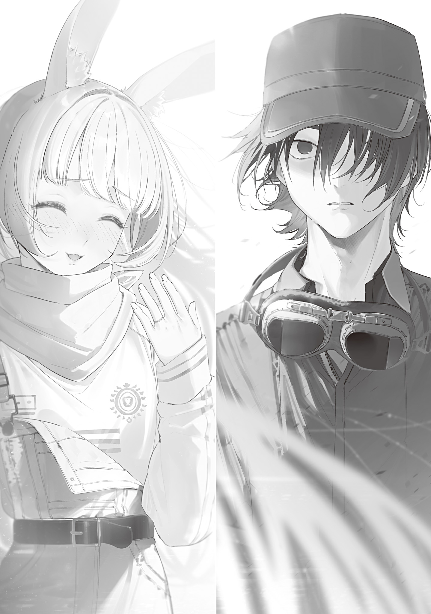
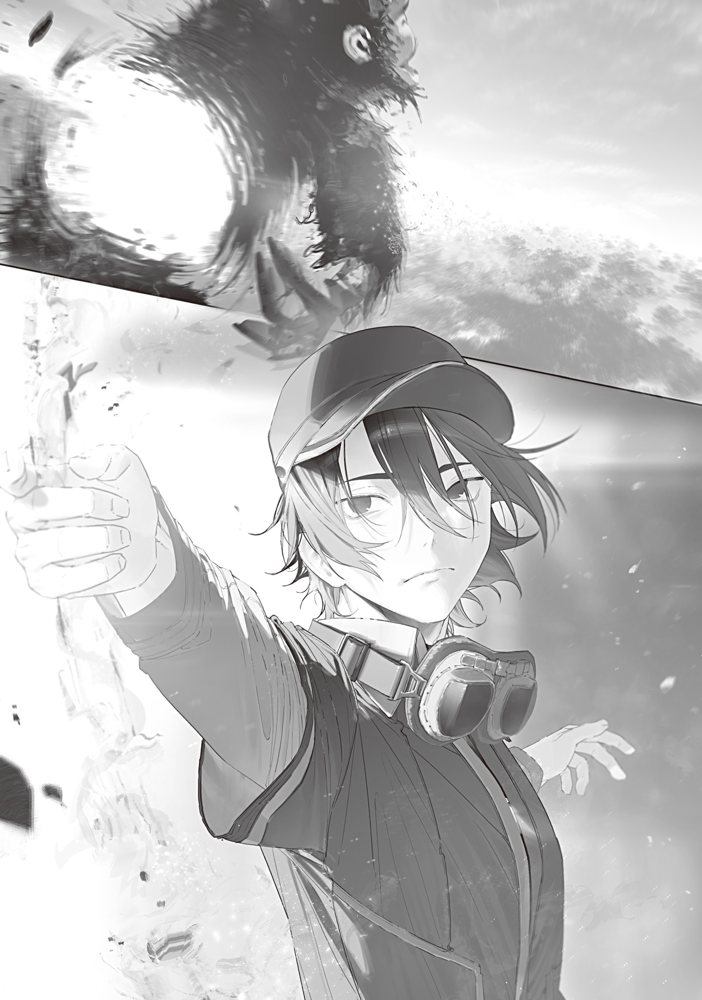

Murakumo Kariya had decided to take his secret to the grave.

Murakumo was a mage.

And no one knew it.

Not even his direct superiors, the higher-ups of the Tohoku Hunting Association, knew.

At first, he had not intended to keep it secret.

Murakumo had originally worked at a restaurant, and gathering wild mountain vegetables was his hobby. Even during the Gremlin Disaster, he had spent one night at a mountain hut, counting the mushrooms he had gathered. But the mutation-induced coma turned that one night into three.

When Murakumo woke from the coma, he immediately became aware of his dramatically improved physical abilities, the magic power surging from his entire body, and the magic incantations etched into his mind.

Murakumo spent several days at his mountain-foraging hut, facing the changes in himself and somehow coming to terms with them. Then he came down from the mountain, determined to go to a proper hospital and get checked out before doing anything else.

When he came down from the mountain, Sendai was a picture of hell.

Monsters ran rampant, Self-Defense Forces troops and police built defensive lines around shelters, and blood, flames, screams, frenzy, and death spread everywhere.

Murakumo had awakened tremendous power, but he was an ordinary person with no resolve. Frightened and cowed by a disaster that seemed impossible in modern Japan, he practically tumbled into a shelter and was taken in.

But that shelter did not even last a few days before it was wiped out. Then four Transcendents appeared, drove the monsters out of Sendai, and brought the citizens together.

That was the Tohoku Hunting Association.

The Tohoku Hunting Association was a family.

Not metaphorically. Except for one witch who joined later, they were all related by blood.

Apparently, they were a family line whose members easily developed the static-prone constitution needed to become witches and mages and were physically tough. Three of them were also experienced, licensed hunters. Their tremendous teamwork and skill earned them an enthusiastic welcome from the surviving people of Sendai.

But. Even so. Yet.

Murakumo's relief was short-lived.

Sendai's heroes, the Tohoku Hunting Association, quickly showed their limits. The Association knew there simply was not enough food and it could protect only a limited area. It decided on a reduction of mouths to feed and forced it through over the opposition.

They drove the weak, the old, the sick, and others beyond their defensive area, into a place of death where human-eating monsters roamed.

Looking back, it had been the right choice.

Even after the reduction of mouths to feed, people fell ill from malnutrition one after another. If they had tried to protect everyone, famine would have struck them all, and they would have all been wiped out together.

But just because it was the right choice did not mean he could feel safe.

Murakumo learned that the Tohoku Hunting Association was willing to do that sort of thing. He decided he would absolutely keep his power secret.

They knew their limits. They knew there were things they could not protect. They knew sacrifices were sometimes necessary.

Murakumo feared that, if he revealed his power, he would be made to work himself to the bone because it was the duty of the strong, then cast aside.

Of course, the Tohoku Hunting Association was strict but fair.

There was no way they would needlessly abuse someone or force them into a meaningless death.

But that also meant that, if necessary, they would ask someone to die.

After all, during the reduction of mouths to feed, they had not even made exceptions for blood relatives, casting them aside too.

Their fairness was what made them frightening.

Murakumo did not want to die.

Even though he had awakened to supernatural power, that did not make him immortal. He would die when his time came.

Mages had no duty to protect people in the first place. Even if they did, there was no hope in this collapsed world of a reward matching the heavy duty of protecting tens of thousands of lives.

Murakumo suspected there had to be other witches and mages who hid their power like him and quietly blended in among people.

No matter how great their power was, there had to be people who thought it was better if they did not have to use it. Some might be unable to hide even if they wanted to, depending on how mutation had changed their appearance.

Murakumo kept his magic power down to a level where people thought he was pretty good for a human, hid the distinctive traits of a mage, and secured a place for himself in the Tohoku Hunting Association.

Murakumo was especially good at controlling magic power, even among mages. It had not been hard to pass himself off as a fairly capable ordinary person.

Murakumo got a job manning the Daidarabocchi watchtower on Mount Nishi-Azuma and made it work for several years.

The watchtower stood just barely outside Daidarabocchi's territory.

If Daidarabocchi started rampaging, he would be the first to die. But as long as Daidarabocchi stayed quiet, there was no easier job. And if Murakumo showed his ability as a mage, escaping would be easy even if Daidarabocchi did start rampaging.

Three people had initially been assigned to the Mount Nishi-Azuma watchtower, but because Daidarabocchi stayed quiet, the staff had been gradually cut back. Now Murakumo was there alone.

Monsters feared Daidarabocchi and did not go near its territory. The watchtower on the edge of that territory was mostly safe too. As long as he watched out for the territory expanding once every seven months, there would be no accidents.

Murakumo's safe but lonely life as a watchtower attendant was eased by the monthly supply deliveries and by Iwatsura, the only woman in the Tohoku Hunting Association, who brought them on her regular patrol.

True to her name, Iwatsura was a witch with rabbit-like ears.

She was a slender, petite woman with pink hair, quick, light movements, and a cute face. Her personality was lively and approachable too, and before he knew it, she had completely captured Murakumo's heart.

Iwatsura was the Tohoku Hunting Association's only woman and the only member not related by blood, yet her natural friendliness seemed to have let her fit smoothly into the organization.

Of course, the useful enhancement magic she wielded must have counted for a lot. Even so, there was no doubt that Itazu, the coordinator known as a stubborn old man, liked her because of the fine person she was.

Once a month, Iwatsura came with supplies, collected the Daidarabocchi observation log, exchanged small talk with him, and left.

After Murakumo realized how he felt, he made subtle approaches to Iwatsura. He asked about her tastes and tried cooking for her, or gave her a bookmark made from flowers in colors she liked.

More than once, he had considered telling her that he was a mage so he could get closer to her.

But the words that rose to his throat always retreated whenever he saw the scarf around her neck. The scarf and the scars hidden beneath it always reminded him, whether he liked it or not, of the bloody hunting accident in which Iwatsura's neck had nearly come off.

Murakumo did not have the courage to throw away his quiet life as a watchtower attendant and jump into a life-or-death battlefield.

She was cheerful, energetic, and bright, a woman who naturally used the power she had awakened for innocent people. If Iwatsura learned that Murakumo had power and was letting it lie unused, she would never think well of him.

Murakumo was more comfortable being thought of as an ordinary person with a little extra magic power who could handle himself.

Even if becoming anything more was difficult.

Then the naivete of that thinking was thrown in his face without mercy.

Just as he had been drawn to Iwatsura, why had he not thought that another man might be drawn to her too?

One winter day, Iwatsura came to the watchtower fully armed for the Daidarabocchi hunt. A silver ring shone on the ring finger of her left hand.

It was a wedding ring.

Iwatsura noticed Murakumo staring at the ring in speechless shock, and she smiled shyly.

“Oh, this? Okyaku asked me to marry him once we beat Daidarabocchi. We haven't had the ceremony yet. It's just the ring for now.”

He hoped the “congratulations” he forced out had sounded normal.

Iwatsura held the ring up to the sun and smiled with genuine happiness. She was more beautiful than he had ever seen her.

She shone brighter looking at that proof of romance and love than she ever had laughing at one of his jokes or thanking him for a gift.

After that, Murakumo barely remembered how he had sent Iwatsura off to fight.

When he came to, he found himself up in the watchtower, standing blankly before the telescope.

His insides felt as if they were boiling with anger at his own stupidity.

Why had he not worked up more courage?

Why had he not been able to tell her his secret?

Why, why had he not been able to tell her he liked her...?

Murakumo shed tears, and those unmanly tears made him hate himself even more.

Anything would do. He wanted something to take his pent-up anger out on.

And with the first gunshot, the battle between the Tohoku Hunting Association and Daidarabocchi began, giving Murakumo the perfect outlet for his emotions.

Anything would do.

Kill it!!!

I'm pissed off right now.

Murakumo had never seen the actual magic items said to have been imported from the Tokyo Witches' Council for this hunt.

But Itazu had gone so far as to retract his words that Daidarabocchi was not to be touched, so they had to be something extraordinary.

Iwatsura's excitement right after last month's operation drill had shown that too. Weapons even better than Sanukino's masterpieces were beyond anything Murakumo could imagine.

In fact, after Daidarabocchi was hit by a special round called a sealing round fired by a sniper, it slowly stood up like a turtle and let out an unnaturally drawn-out roar.

Its movements—no, time itself—had slowed down. Apparently, sealing rounds worked on a principle similar to the Monster Trap.

In the opening created by Daidarabocchi's slowed movements, five figures burst from the five observation posts and raced toward the giant's feet from five directions to surround it.

Murakumo's mutated, superhuman vision showed him they were four mages and one witch.

Noticing the hunters approaching, Daidarabocchi spewed huge amounts of sickly purple gas from its waist. But a huge whirlwind suddenly sprang up and scattered the gas far into the sky.

It was the magic of Aokera, a member of the Tohoku Hunting Association.

Even a huge whirlwind strong enough to blow houses away and grind them to pieces had no effect on Daidarabocchi.

But the deadly magic smoke vanished from the ground, and the hunters reached the giant's feet.

More sealing rounds were fired in, and the simultaneous barrage began.

Being a mage, Murakumo knew magic's limits. But every one of the hunters' spells went several levels beyond those limits.

The power of the Tokyo Witches' Council's rumored “wands” was even more incredible than the rumors claimed.

A storm raged, pillars of light poured down from the sky, blinding purple lightning lashed out as if countless bolts had been bundled together, and the jaws of a huge, semitransparent wolf bit into the giant's leg. It was as if a natural disaster had gained a will of its own and attacked the giant.

By the time five sealing rounds had been fired into it, Daidarabocchi's rock armor had completely peeled away. Reddish-bronze fur was exposed, revealing an ugly, distorted monkey-like face.

Murakumo was sure they would win.

The troublesome armor was destroyed. All that was left was to beat it to a pulp.

*If it weren't for you, Iwatsura and I would surely be together by now.* Murakumo worked himself into an incoherent rage over that, but his excitement gradually cooled, and he started to feel uneasy.

The operation had gone smoothly through the destruction of the armor, but now it was starting to go wrong.

The time delay was definitely working. Daidarabocchi's stomping feet and swinging arms were so slow they did not even graze the hunters.

Every spell in the concentrated barrage of super-enhanced magic struck Daidarabocchi.

But Daidarabocchi was regenerating.

Its wounded parts were healing at a terrifying speed.

It was taking damage faster than it could regenerate, and its wounds were gradually increasing and growing more serious, but it was still alive despite being hit with enough magic to kill it twice already. Its only major injury was that one leg was nearly torn off.

It was tougher than expected. Daidarabocchi's regenerative ability was known, but no one had thought it would be this powerful and long-lasting.

The battle continued like that for nearly thirty minutes.

The instant the thirteenth sealing round struck, all of Daidarabocchi's limbs were destroyed.

At last, Daidarabocchi's head, which had been high up where magic had difficulty reaching it, fell to the ground.

For a moment, Murakumo felt the tension on the battlefield ease.

There were still two sealing rounds left.

All that remained of Daidarabocchi was its torso and neck, with no limbs. They just had to finish it off.

Even battle-hardened hunters could not maintain that level of concentration after thirty minutes of fighting. On top of that, they had only been pounding it with attacks, and it had put up no real resistance. Murakumo thought they could finish it off at this rate.

Daidarabocchi had probably been waiting for that opening.

Daidarabocchi had two kinds of magic: lethal, wide-area sticky poison gas, and regeneration.

But at the brink of life and death, it activated a third kind of magic.

Daidarabocchi's huge body, stripped of its limbs, sprang upward.

The way it sprang was ominous.

It was not slow and lumbering like something underwater. It thrashed with the vigor of a fresh fish flung onto land.

Limbs rapidly sprouted from its huge body in midair.

Murakumo broke out in a cold sweat all over.

The worst possible trump card.

Daidarabocchi had hidden a third magic: time-acceleration magic, which canceled the time delay caused by sealing rounds.

The hunters had no chance of winning.

They had been forced to pour out spell after spell, lost their concentration, and nearly exhausted their magic power.

Far from making one final push, even escaping would be difficult.

Even so, the hunters were veterans. The instant the five realized the danger, they all retreated at once.

The five scattered and fled in five directions.

Having fully regenerated its entire body, Daidarabocchi grabbed a huge boulder from the mountain at its feet and began drawing back to throw it at one of the fleeing hunters—Okyaku.

Even from nearly 20 km away, Murakumo's mutated eyes could clearly see Okyaku's back as he fled without a glance to either side.

Something unsettling crossed Murakumo's mind.

Iwatsura was not the one being targeted.

It was the man who had won Iwatsura's heart while Murakumo had sat on his hands.

Murakumo pictured something awful.

Iwatsura, grieving after losing the man she had promised to marry. And Murakumo standing beside her, gently comforting her...

...Having thought that far, Murakumo gave a sharp laugh and raised his hands as if holding a bow and nocking an arrow in the empty air.

Murakumo liked Iwatsura.

No matter the reason, I don't want to see her cry.

“A hunt needs only three things[×××キキレトエウエス・アイヤ]: a weapon and resolve[ガルガ×ヲ×], and a wife's farewell[ロロ・ラア].”

He poured in all the magic power he could, just short of runaway magic, and a golden bow and arrow with a soft phosphorescent glow formed in the empty air.

“Behind the approaching monster, a hunter crept[モンノソユマムギスウラツ×××モンワソユ].”

With the next incantation, the golden bow and arrow disappeared, leaving nothing in his hands but the feeling of it drawn taut.

All sound and scent vanished, and even the sense of its magic power grew faint.

Murakumo did not hesitate over the incantation for a third spell he had never used before.

“Hunt or be hunted[×××・ポラ・××××].”

The explosive increase in power came at a price: if he missed his target, the arrow would pierce him.

Murakumo filled the arrow with as much magic power as he could without triggering depletion symptoms and drew it all the way back. His heart was strangely calm and still as he gently released his fingers.

The invisible arrow flew straight, tearing through the sky.

It ignored air resistance and caused none of the sonic boom it should have, flying quietly and without a trace as if its presence were inversely proportional to its destructive power.

The killing arrow crossed the 20 km distance in just a few seconds, blew away Daidarabocchi's torso just as it was about to throw the boulder, and tore its upper and lower halves apart.

He had not aimed for its head because he wanted to avoid any chance of missing such a small target.

If he blew away its torso and forced it to spend time regenerating, he could buy Okyaku enough time to escape. Even if Okyaku could not get outside its territory, he could get beyond the range where its thrown rocks were guaranteed to hit.

Murakumo had no magic power left to fire a second shot, but he held his follow-through and watched the battle.

Daidarabocchi's separated upper and lower halves fell to the ground with a rumble.

And...

...it did not regenerate.

Fresh blood poured out like a river and dyed the trees and ground red. Daidarabocchi did not so much as twitch.

The air on the battlefield changed again.

It looked dead, but they had only just been caught off guard after making that assumption too soon. The hunters and Murakumo stayed on guard, kept their distance, and watched, ready for battle.

An hour passed without the tension easing.

Daidarabocchi did not move.

Another hour passed, and as the sun began to sink behind the mountains, a small bird landed on Daidarabocchi's wide-open eye.

Even then, Daidarabocchi did not move.

The river of blood had stopped, and Daidarabocchi's huge body had shriveled from massive blood loss.

There was clearly no life left in it.

Daidarabocchi was dead.

Even Daidarabocchi's seemingly endless regenerative ability had a limit.

It had spent every last bit of power on that final burst of time acceleration and rapid regeneration.

Murakumo finally let out a long breath and sank to the floor.

After a long battle of endurance, Daidarabocchi was dead.

Iwatsura was safe.

Okyaku was alive too.

Could there be a happier ending than this?

Murakumo gave in to the weight of his exhaustion and sprawled on the cold floor of the watchtower, deciding that if the Tohoku Hunting Association asked, “Did you see what happened at the end?” he would play dumb and insist he knew nothing.

Murakumo Kariya had decided to take his secret to the grave.

The only woman he might have told his secret to had married another man.

Murakumo had never even made it into the ring to compete with his rival.

Some people might laugh at him as a pathetic loser.

But Murakumo could feel proud of himself for saving the man the woman he loved had fallen for.

With that pride in his heart, Murakumo would live out his life as an anonymous man, neither a mage nor anything else.
