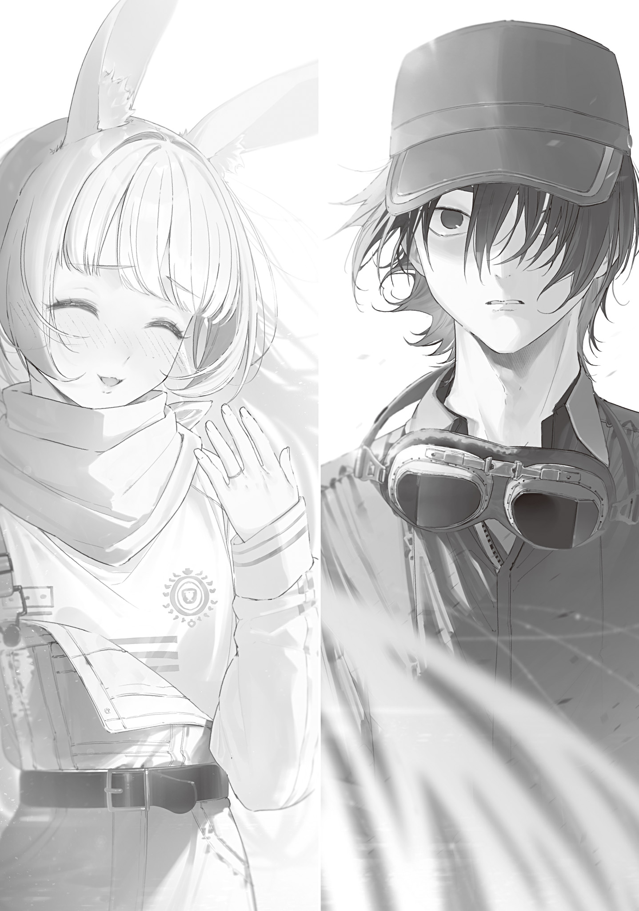
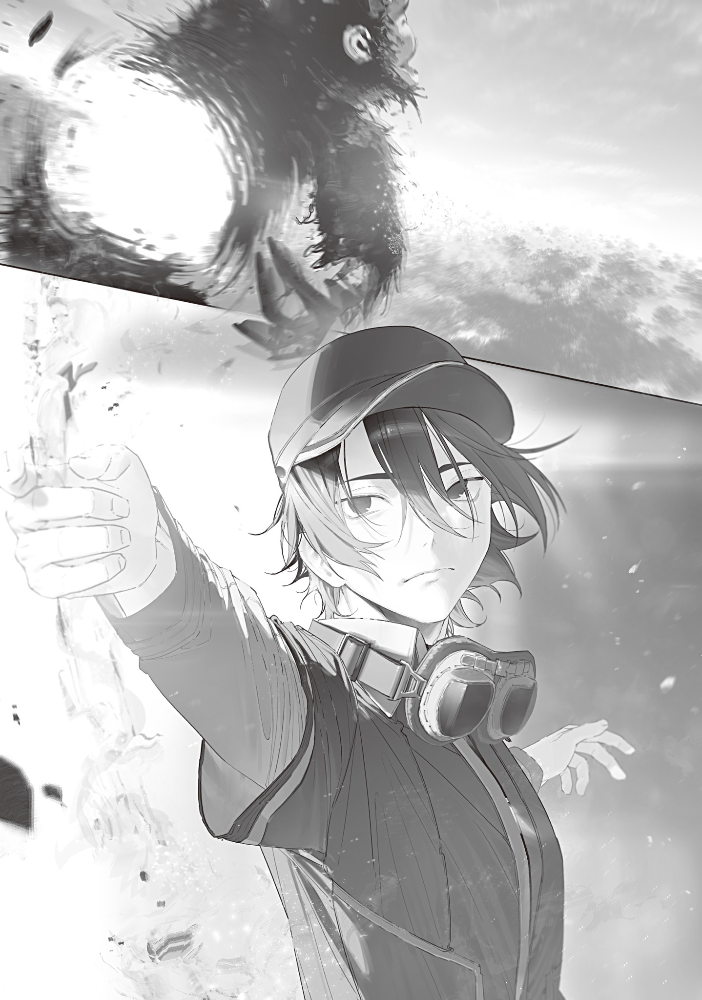

Murakumo Kariya had decided to take his secret to the grave.

Murakumo was a mage.

And no one knew it.

Not even the leaders of the Tohoku Hunting Association, his direct superiors, knew.

At first, he had not intended to keep it secret.

Murakumo had worked at a restaurant, and gathering wild plants in the mountains was his hobby. When the Gremlin Disaster struck, he happened to be spending the night at a mountain hut, counting the mushrooms he'd picked. A mutation-induced coma stretched that one night into three.

When Murakumo woke, he realized at once that his physical abilities had improved dramatically. Magic power surged from his entire body, and magic incantations had been etched into his mind.

He stayed at the hut for several days, grappling with what had happened to him until he somehow came to terms with it. Before he did anything else, though, he wanted a proper hospital to examine him, so he headed down the mountain.

Sendai was hell.

Monsters ran rampant. Self-Defense Forces troops and police had built defensive lines around shelters. Everywhere Murakumo looked, there was blood, fire, screaming, chaos, and death.

Murakumo had awakened to tremendous power, but he was still an ordinary man, utterly unprepared for any of this. The sight of a disaster that had no place in modern Japan left him terrified and cowed, and he all but threw himself into a shelter that agreed to take him in.

But that shelter did not even last a few days before it was wiped out. In its place, four Transcendents appeared, drove the monsters out of Sendai, and brought the citizens together.

That was the Tohoku Hunting Association.

The Tohoku Hunting Association was a family.

Not metaphorically. Except for one witch who joined later, they were all related by blood.

Apparently, physical toughness and the static-prone constitution required to become a witch or mage ran in the family. Three of them were also experienced, licensed hunters. Their skill and remarkable teamwork earned them a hero's welcome from Sendai's survivors.

But. Even then. Still.

Murakumo's relief was short-lived.

Sendai's heroes, the Tohoku Hunting Association, soon reached their limits. They knew there wasn't enough food and that the territory they could protect was limited, so they decided to reduce the number of mouths they had to feed. They forced the decision through over the opposition.

They drove the weak, the old, the sick, and others like them beyond their defensive perimeter, out into the killing ground where man-eating monsters roamed.

Looking back, it had been the right choice.

Even after they cast those people out, the survivors fell ill from malnutrition one after another. If the Association had tried to protect everyone, famine would have taken them all.

But just because it was the right choice did not mean he could feel safe.

Murakumo learned that the Tohoku Hunting Association was willing to do that sort of thing. He decided he would absolutely keep his power secret.

They knew their limits. They knew there were things they could not protect. They knew sacrifices were sometimes necessary.

Murakumo feared that if he revealed his power, they would work him to the bone because the strong had a duty to serve, then cast him aside.

Of course, the Tohoku Hunting Association was strict but fair.

They would never abuse someone without reason or force them to die for nothing.

But that also meant that, if necessary, they would ask someone to die.

After all, when they cut the number of mouths to feed, they hadn't made exceptions even for blood relatives.

Their fairness was what made them frightening.

Murakumo did not want to die.

Even though he had awakened to supernatural power, that did not make him immortal. He would die when his time came.

Mages had no duty to protect anyone in the first place. Even if they did, this ruined world couldn't possibly offer a reward to match the burden of protecting tens of thousands of lives.

Murakumo suspected other witches and mages were doing the same thing he was: hiding their power and quietly blending in.

However great their power, some people had to think they were better off never having to use it. Of course, depending on how the mutation had changed their appearance, some probably couldn't hide even if they wanted to.

Murakumo suppressed his magic power to a level that qualified as “not bad for a human,” concealed the traits that marked him as a mage, and secured a place in the Tohoku Hunting Association.

Murakumo's magic-power control was exceptional even among mages, so passing himself off as a fairly capable ordinary person hadn't been hard.

He got a job manning the Daidarabocchi watchtower on Mount Nishi-Azuma and managed just fine for several years.

The watchtower stood just outside Daidarabocchi's territory.

If Daidarabocchi went on a rampage, Murakumo would be the first to die. As long as it stayed quiet, though, there was no easier job. And if the worst did happen, escaping would be easy once he used his true strength as a mage.

The Mount Nishi-Azuma watchtower had originally been staffed by three people, but Daidarabocchi stayed so quiet that the Association gradually cut back the staff. Now Murakumo was there alone.

Other monsters feared Daidarabocchi and stayed away from its territory, so the watchtower at the edge was mostly safe too. Nothing ever happened as long as Murakumo stayed alert for the territory's once-every-seven-months expansion.

Two things eased Murakumo's safe but lonely life in the watchtower: the monthly supplies, and <ruby>Iwatsura<rt>Rabbit</rt></ruby>, the Tohoku Hunting Association's only woman, who delivered them on her regular patrol.

True to her name, <ruby>Iwatsura<rt>Rabbit</rt></ruby> was a witch with rabbit-like ears.

She was slender and petite, with pink hair, a cute face, and quick, light movements. She was lively and approachable too. Before Murakumo knew it, he was smitten.

Despite being both the Association's only woman and its only member unrelated to the others, <ruby>Iwatsura<rt>Rabbit</rt></ruby> seemed to have settled right in through sheer natural friendliness.

Her useful enhancement magic must have counted for a great deal, of course. Even so, if <ruby>Itazu<rt>Great Bear</rt></ruby>, the coordinator known for being a stubborn old man, liked her, it was undoubtedly because she was such a wonderful person.

Once a month, <ruby>Iwatsura<rt>Rabbit</rt></ruby> came with supplies, collected the Daidarabocchi observation log, exchanged small talk with him, and left.

Once Murakumo realized how he felt, he tried to woo <ruby>Iwatsura<rt>Rabbit</rt></ruby> in small ways. He asked what she liked and cooked for her, or gave her a bookmark made from flowers in her favorite colors.

More than once, he had considered telling her that he was a mage so he could get closer to her.

But whenever the words rose to his throat, one look at the scarf around her neck forced them back down. The scarf—and the scars hidden beneath it—reminded him, whether he liked it or not, of the bloody hunting accident that had nearly taken <ruby>Iwatsura<rt>Rabbit</rt></ruby>'s head off.

Murakumo didn't have the courage to trade his quiet life in the watchtower for life-or-death battlefields.

She was cheerful, energetic, and bright. Using the power she'd awakened to protect innocent people came naturally to her. If <ruby>Iwatsura<rt>Rabbit</rt></ruby> learned Murakumo had power of his own and had chosen to let it go to waste, she would never think well of him.

Murakumo was more comfortable letting her think he was an ordinary man with a little extra magic power and some skill in a fight.

Even if becoming anything more was difficult.

Then, without mercy, he was forced to face just how naive that was.

Just as he had been drawn to <ruby>Iwatsura<rt>Rabbit</rt></ruby>, why had he not thought that another man might be drawn to her too?

One winter day, <ruby>Iwatsura<rt>Rabbit</rt></ruby> came to the watchtower fully armed for the Daidarabocchi hunt. A silver ring gleamed on her left ring finger.

It was a wedding ring.

When <ruby>Iwatsura<rt>Rabbit</rt></ruby> noticed Murakumo staring speechlessly at the ring, she gave him a bashful smile.

“Oh, this? <ruby>Okyaku<rt>Great Wolf</rt></ruby> asked me to marry him once we beat Daidarabocchi. We haven't had the ceremony yet. It's just the ring for now.”

Murakumo could only hope the “congratulations” he forced out had sounded normal.

<ruby>Iwatsura<rt>Rabbit</rt></ruby> held the ring up to the sun and smiled with pure happiness. He'd never seen her look so beautiful.

As she looked at that proof of romance and love, she shone brighter than she ever had while laughing at one of his jokes or thanking him for a gift.

After that, Murakumo barely remembered seeing <ruby>Iwatsura<rt>Rabbit</rt></ruby> off to battle.

When he came to his senses, he was up in the watchtower, standing blankly before the telescope.

He seethed at his own stupidity.

Why had he not worked up more courage?

Why had he not been able to tell her his secret?

Why, why had he not been able to tell her he liked her...?

Tears ran down Murakumo's face, and he hated himself even more for crying so pathetically.

Anything would do. He just needed somewhere to vent all that rage.

Then a gunshot signaled the start of the Tohoku Hunting Association's battle with Daidarabocchi. Murakumo had found the perfect target for his rage.

Anything would do.

Fucking kill it!!!

I'm pissed off right now.

Murakumo had never seen the actual magic items said to have been imported from the Tokyo Witches' Council for this hunt.

But <ruby>Itazu<rt>Great Bear</rt></ruby> had gone so far as to withdraw his standing order not to touch Daidarabocchi, so they had to be something extraordinary.

<ruby>Iwatsura<rt>Rabbit</rt></ruby>'s excitement right after last month's training exercise said as much. Murakumo couldn't imagine weapons that surpassed even Sanukino's masterpieces.

Sure enough, a sniper struck Daidarabocchi with a special projectile called a sealing round. The giant rose as slowly as a turtle and let out an unnaturally drawn-out roar.

Its movements—no, time itself—had slowed. Apparently, sealing rounds worked on a principle similar to the Monster Trap.

With Daidarabocchi slowed, five figures burst from five observation posts and raced in from five directions to surround the giant at its feet.

Murakumo's mutated, superhuman eyesight could make out four mages and one witch.

Daidarabocchi noticed the approaching hunters and spewed a vast cloud of sickly purple gas from its waist. But a huge whirlwind suddenly sprang up and scattered it high into the sky.

It was the magic of <ruby>Aokera<rt>Serow</rt></ruby>, a member of the Tohoku Hunting Association.

The whirlwind could have blown houses away and ground them to pieces, but it did nothing to Daidarabocchi.

The deadly magic smoke had been swept clear of the ground, allowing the hunters to reach the giant's feet.

More sealing rounds struck, and the hunters opened fire all at once.

As a mage, Murakumo knew the limits of magic. Every one of the hunters' spells blew several levels past them.

The Tokyo Witches' Council's rumored “wands” were even more devastating than the stories claimed.

A storm raged. Pillars of light poured from the sky. Blinding purple lightning, thick as if countless bolts had been bundled together, lashed out as the jaws of a huge, semitransparent wolf sank into the giant's leg. It was as if a natural disaster had taken on a will of its own and turned against the giant.

By the time five sealing rounds had struck, Daidarabocchi's rock armor had been torn clean away. Reddish-bronze fur lay exposed, along with an ugly, distorted face like a monkey's.

Murakumo was sure they would win.

The troublesome armor was destroyed. All that was left was to beat it to a pulp.

If it weren't for you, I bet <ruby>Iwatsura<rt>Rabbit</rt></ruby> and I would be together by now. Murakumo worked himself into an incoherent rage over that, but as his excitement cooled, unease began to creep in.

The operation had gone smoothly through the destruction of the armor, but now trouble was brewing.

The time delay was definitely working. Daidarabocchi's stomping feet and swinging arms were so slow they did not even graze the hunters.

Every spell in that concentrated barrage of super-enhanced magic hit Daidarabocchi head-on.

But Daidarabocchi was regenerating.

Its wounds were closing at a terrifying speed.

The attacks did outpace its regeneration, and its wounds were slowly multiplying and deepening. But even after taking enough magic to kill it twice over, Daidarabocchi was still alive. The only major injury was one leg that had nearly been torn off.

It was far tougher than expected. Everyone knew Daidarabocchi could regenerate, but no one had imagined the ability would be this powerful or last this long.

The battle continued like that for nearly thirty minutes.

The instant the thirteenth sealing round struck, all of Daidarabocchi's limbs were destroyed.

At last, Daidarabocchi's head, which had been so high that their magic struggled to reach it, dropped to the ground.

For a moment, Murakumo felt the tension on the battlefield ease.

There were still two sealing rounds left.

Only Daidarabocchi's torso and neck remained. They just had to finish it off.

Even battle-hardened hunters couldn't maintain that level of concentration through thirty minutes of fighting. Besides, they'd done nothing but rain attacks on an enemy that put up no real resistance. Murakumo thought they could finish it off at this rate.

Daidarabocchi had probably been waiting for that opening.

Daidarabocchi possessed two kinds of magic: one produced lethal, wide-area clouds of sticky poison gas, and the other let it regenerate.

But at the brink of death, it activated a third kind of magic.

Daidarabocchi's limbless bulk sprang into the air.

There was something ominous about that leap.

This wasn't a slow, lumbering bounce like something underwater. It thrashed with all the vigor of a fresh fish flung onto land.

New limbs rapidly sprouted from its body while it was still in the air.

Cold sweat broke out across Murakumo's body.

The worst possible trump card.

Daidarabocchi had hidden a third magic: time-acceleration magic, which canceled the time delay caused by sealing rounds.

The hunters had no chance of winning.

They'd been forced to pour out spell after spell until their concentration broke and their magic power nearly ran dry.

They couldn't mount one final push. They'd be lucky to escape.

Even so, the hunters were veterans. The instant they sensed the danger, all five retreated at once.

The five scattered and fled in five directions.

Now fully regenerated, Daidarabocchi snatched a huge boulder from the mountain beneath it and cocked its arm to hurl it at one of the fleeing hunters—<ruby>Okyaku<rt>Great Wolf</rt></ruby>.

Even from nearly 20 km away, Murakumo's mutated eyes could clearly make out <ruby>Okyaku<rt>Great Wolf</rt></ruby>'s back as he fled without a glance to either side.

An ugly thought crossed Murakumo's mind.

<ruby>Iwatsura<rt>Rabbit</rt></ruby> was not the one being targeted.

It was the man who had won <ruby>Iwatsura<rt>Rabbit</rt></ruby>'s heart while Murakumo had sat on his hands.

Murakumo pictured something terrible.

<ruby>Iwatsura<rt>Rabbit</rt></ruby>, grieving after losing the man she'd promised to marry. And Murakumo beside her, gently comforting her...

...Murakumo got that far, then gave a short laugh and raised his hands as if to hold a bow and nock an arrow in empty air.

Murakumo liked <ruby>Iwatsura<rt>Rabbit</rt></ruby>.

No matter the reason, I don't want to see her cry.

“<ruby>××× Kikireto Euesu Aiya<rt>A hunt needs only three things</rt></ruby>: <ruby>Garuga× O×<rt>a weapon and resolve</rt></ruby>, and <ruby>Roro Raa<rt>a wife's farewell</rt></ruby>.”

He poured in every drop of magic power he could, stopping just short of runaway magic. A golden bow and arrow formed in the empty air, glowing with soft phosphorescent light.

“<ruby>Monno Soyu Mamugisu Uratsu××× Monwa Soyu<rt>Behind the approaching monster, a hunter crept</rt></ruby>.”

At the next incantation, the golden bow and arrow vanished. Only the tension of the drawn bow remained in his hands.

Its sound and scent vanished, and even its magic power grew faint and hazy.

Murakumo didn't hesitate to cast a third spell, one he'd never used before.

“<ruby>××× Pora ××××<rt>Hunt or be hunted</rt></ruby>.”

The explosive boost in power came at a price: if he missed his target, the arrow would pierce him instead.

Murakumo filled the arrow with magic power right up to the threshold where depletion symptoms would set in, then drew it back as far as it would go. His heart felt strangely still as he gently released his fingers.

The invisible arrow flew straight, tearing through the sky.

It ignored air resistance and made none of the sonic boom it should have. It flew silently and without a trace, as quiet as it was destructive.

The killing arrow covered the 20 km in just a few seconds. Just as Daidarabocchi was about to throw the boulder, the shot blew its torso away and tore its upper and lower halves apart.

He hadn't aimed for the head because he couldn't risk missing such a small target.

Blowing away its torso and forcing it to spend time regenerating would buy <ruby>Okyaku<rt>Great Wolf</rt></ruby> enough time to escape. Even if <ruby>Okyaku<rt>Great Wolf</rt></ruby> couldn't get beyond the monster's territory, he could at least escape the range where its thrown rocks never missed.

Murakumo had no magic power left for a second shot, but he held his stance and watched.

Daidarabocchi's separated upper and lower halves crashed to the ground with a rumble.

And...

...and it didn't regenerate.

Fresh blood poured out like a river, staining the trees and ground red. Daidarabocchi didn't so much as twitch.

The air on the battlefield changed again.

It looked dead, but they'd just paid for making that assumption too soon. The hunters and Murakumo kept their distance and watched, still ready to fight.

An hour passed without the tension easing.

Daidarabocchi did not move.

Another hour passed, and as the sun began to sink behind the mountains, a small bird landed on Daidarabocchi's wide-open eye.

Even then, Daidarabocchi did not move.

The river of blood had stopped, and Daidarabocchi's huge body had shriveled from massive blood loss.

There was clearly no life left in it.

Daidarabocchi was dead.

Even Daidarabocchi's seemingly endless regeneration had its limits.

It had spent every last bit of power on that final burst of time acceleration and rapid regeneration.

Murakumo finally let out a long breath and sank to the floor.

After that long battle of attrition, Daidarabocchi was dead.

<ruby>Iwatsura<rt>Rabbit</rt></ruby> was safe.

<ruby>Okyaku<rt>Great Wolf</rt></ruby> was alive too.

Could there be a happier ending than this?

Murakumo gave in to the weight of his exhaustion and sprawled on the cold watchtower floor. He decided that if the Tohoku Hunting Association asked, “Did you see what happened at the end?” he would play dumb and insist he knew nothing.

Murakumo Kariya had decided to take his secret to the grave.

The only woman he might have told his secret to had married another man.

Murakumo had never even made it into the ring to compete with his rival.

Some people might laugh at him as a pathetic loser.

But he'd saved the man the woman he loved had chosen. Murakumo could be proud of that.

With that pride in his heart, Murakumo would live out his days as an anonymous man, never known as a mage or anything else.
