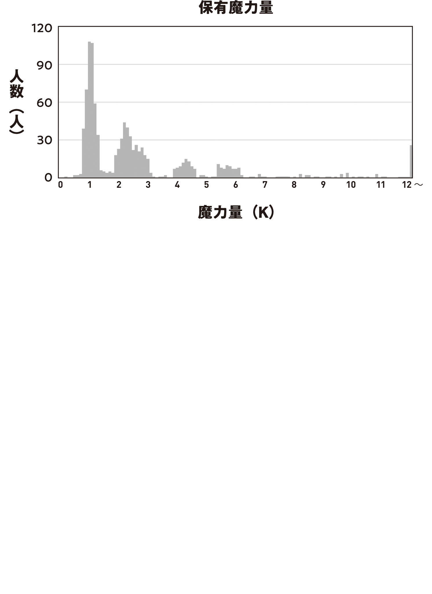

The Tohoku Hunting Association's Daidarabocchi hunt had not only whipped Sendai into a frenzy, but had also become a hot topic in Tokyo.

The general public was focused on trade with Tohoku opening up. The seriously dangerous monster that had blocked the overland route was gone, so people and goods would be moving back and forth more actively from now on. Daidarabocchi's huge territory had become one big empty lot, so people were also talking about whether they could turn it into farmland. Before trade could even begin, they needed to prepare the trade route—in other words, fix the roads—and apparently a large-scale recruitment drive was underway for that.

Tokyo Magic University's Department of Monster Studies was comparing the Class A-1 giant kaiju that had appeared in Tokyo with Daidarabocchi. If they could figure out the abilities, appearance patterns, how they arose, and so on of Class A-1 monsters, which stood out as especially powerful even among monsters, it would be a big help for future public safety and disaster measures.

And in the Department of Gremlin Engineering, discussion of the mysterious black Gremlin Daidarabocchi had possessed was getting lively.

I, for one, had been thinking about the mystery of the black Gremlin in my own way.

I got nice and warm under my charcoal kotatsu[^1], snacking on river-fish skin crackers and drinking homemade unfiltered sake (long live the natural extinction of the Liquor Tax Act!) while I thought things over. Then I came up with a hypothesis: What if it had been structural color?

If the black Gremlin's color had been structural color, I did not know why it had turned to dust, but it would explain the strange coloration.

Structural color was, as the name suggested, color made by structure. Color could come not from chemical pigments, but from physical structures too.

For example, when you turn over a compact disc, it looks rainbow-colored depending on the angle you view it from.

That came from structural color.

The tiny indentations engraved into a CD to record data refracted light, making it look rainbow-colored without any rainbow dye.

Structural color existed in nature too. The vivid colors of peacocks and hummingbirds were produced by light refracting through physical structures, not pigments. Blueberries and morpho butterflies got their blue that way too.

Actually, 99.9% of blue in living things was structural color. The existence of a real blue pigment was practically a miracle. That was why there were concepts like the bluebird of happiness and the miraculous blue rose.

Structural color might seem like a marvel of physics, but for living things, it was not even unusual equipment.

Which meant...

Daidarabocchi's black Gremlin might have been structural color too.

Before Daidarabocchi mutated into a monster, it had to have been an animal. It would not be strange if it had possessed some kind of structural color and that had appeared in its Gremlin.

In other words, all of Daidarabocchi's Gremlins had been reddish bronze. One of them—the smallest—just had finely structured grooves in it that made it look black through light refraction and absorption.

That was my hypothesis.

It did not explain the dusting, but the color made sense.

To test my hypothesis, I decided to engrave structural color into a Gremlin.

Since black was a color that reflected no light at all, I started engraving light-absorbing physical structures into the surface of some random Gremlin. Regularly spaced at exactly 500-nanometer intervals.

The steel-sheep work gloves were comfortable and did not get in the way of my fingers, even for such delicate engraving. My magic tools were working well too. Obviously, chisels and crochet hooks could not do precision work like this. It was like doing laser processing by hand.

I could not exactly say it was easy, but after spending a day on it, I engraved a 1 cm-long black structural-color groove into the Gremlin.

Rubbing my stinging eyes, I looked at the structural-color Gremlin again.

Yep, it was definitely black. And I had not used black paint at all. This was structural color. Even though I knew how it worked, it was strange.

I took off my work gloves and poked the structural color to check whether it would turn to dust, but something strange happened.

The instant I poked the black structural color with my fingertip, it turned from black to white for just a moment.

It was not an illusion. I definitely saw it.

This time, instead of just poking it, I pressed my finger flat against it. Then the black structural color quickly turned white.

And when I took my finger away, it quickly went back to black.

Oh?

What's this interesting phenomenon?

Hmm. Does it react to human contact...?

No, that's not it. Temperature? Magic power?

I tried touching it with a finger chilled with ice and a finger warmed with a hot-water bottle, but apparently temperature had nothing to do with it.

Also, I had to touch it with bare skin. It did not react through gloves. If I made any part of my body touch it directly—my elbow, cheek, or tongue—it showed the same color-change reaction from black to white.

The more I tested it, the stronger my suspicion got.

Doesn't this thing seem like it's reacting to magic power?

It might have reacted to life force or lifespan, but all the various effects Gremlin processing had shown so far were related to magic power or magic. It was probably safe to think this one was related to magic power or magic too.

I went to the reverberatory furnace and pressed the structural-color Gremlin against the three fire salamanders dozing in the morning mist. It changed from black to white only while I held it against them. There did not seem to be any individual difference—or species difference—in the color-change reaction.

That was as far as I could test by myself, so I called in a magic-power expert.

Of course, Hiyori.

I woke Hiyori up early over familiar communication, and she came through the Lost Mist looking annoyed. But even while grumbling, she helped me test the structural-color Gremlin.

“Hmm. It really does change color.”

Hiyori nodded as she put a finger to the structural-color Gremlin.

I eagerly asked her.

“Hey, is this color change related to magic power? It doesn't seem like it has anything to do with an intrinsic color.”

“Wait. I'll check.”

Hiyori said that, then went still.

I did not understand it, but she was probably doing something or other with magic-power control.

Hiyori really was my best friend, coming when I called her early in the morning and listening to my request!

But she had also suddenly asked me in the middle of the night to listen to her worries about whether she should take a job as a part-time lecturer at Tokyo Magic University, so that made us even. Let's just say we're alike.

Hiyori kept one finger on the structural-color Gremlin and did not move like a statue for a while. Then she suddenly took off her mask, brought her face so close that the tip of her nose nearly touched the Gremlin, and stared hard at it.

After a little while in that position, the structural-color Gremlin started switching black-white-black-white at an incredible speed.

She's doing something! I have no idea what she's doing!

But I was a legendary Wand Maker who knew how to wait, so I swallowed every question and waited quietly until Hiyori finished checking.

After another ten minutes or so, Hiyori pulled back from the structural-color Gremlin and put her mask on again.

The diagnosis seemed to be over. So how is my kid, Doctor!?

“I mostly understand. This Gremlin reacts to magic-power capacity.”

“Oh. Details.”

I had known it was something related to magic power.

But magic-power capacity?

Does that mean it's become a magic-power meter?

“This shows my current remaining magic power. Watch... There. When I restricted my magic power and lowered its pressure—in other words, pretended I was out of magic power—the scale went down, right?”

“Whoa!”

I did not understand at all what kind of magic-power control Hiyori had used, but I could see the result of it.

Hiyori had one finger on the edge of the structural-color Gremlin. From where her finger touched it, the black Gremlin turned white and then returned to black, like a volume gauge going up and down.

I could clearly see that the horizontal lines I had engraved at 500-nanometer intervals to create structural color were serving as scale marks.

When Hiyori said, “Raise magic power,” the marks in the black structural color turned white. When she said, “Lower magic power,” the marks that had turned white went back to black.

Both how it worked and how it looked were easy to understand.

The collection of 500-nanometer structural-color horizontal lines I had engraved into the Gremlin had become a remaining-magic-power gauge!

“Remaining magic power and the scale are directly proportional. Look, when I doubled the magic power in contact with it, the width that changed color doubled.”

“So this structural-color Gremlin has become a remaining-magic-power gauge, right?”

“That's right. A witch or mage can fool the scale as much as they want like this, but it will definitely be useful for accurately checking the remaining magic power of humans who cannot control magic power.”

“Seriously? I've been waiting for this function forever...!”

I envisioned an insanely hype jackpot animation.

I trembled with emotion.

Until now, we had never once managed to measure magic power quantitatively.

We could only measure magic power by standards like a witch's intuition saying, “You have a lot of magic power,” or, “You have enough magic power to use the shooting-magic core spell <ruby>Agh-<rt>Fire</rt></ruby> just once, so you have little magic power.”

But now.

This structural-color Gremlin let us see magic-power capacity and remaining magic power on its scale.

I had gotten a ruler for magic power.

Until now, humanity had been researching magic by relying on vague, fuzzy expressions like “about the length of a thumb and forefinger spread apart.”

But if we used a structural-color Gremlin as a ruler, we could research using specific values like “188.2 mm long.”

Both the precision and the range of research would leap forward.

Revolution. This is a revolution...!

Holy crap. I had meant to solve the mystery of Daidarabocchi's black Gremlin, but I had accidentally made something unbelievable.

“Ori, it's fine to be happy, but this Gremlin cannot measure all of my magic power. It goes past the scale. Actually, even your magic power would go past the scale, right?”

“Leave it to me, leave it to me. Once I understand the function and the principle, I've got this. I can improve it right away, right away, so wait!”

The inspiration circuits in my brain were flashing like crazy.

I got to work at full speed making a structural-color Gremlin that could measure Hiyori's massive magic power.

First, a small proof-of-concept experiment.

The Gremlin with black structural color made of 500 nm-wide horizontal lines had magic-power-sensing display ability that was too sensitive, so even my magic power made it overflow.

So I tried making structural color with horizontal lines that were 700 nm, 600 nm, 400 nm, 300 nm, and 200 nm wide too.

Then I found that the narrower the horizontal lines were, the duller the magic-power-sensing display ability became.

In other words, a Gremlin engraved with structural color using 200 nm-wide horizontal lines could precisely measure even a witch's enormous magic-power capacity.

I confirmed that melt-recast Gremlins had the same magic-power-capacity display function as natural Gremlins too (around the time I was doing this experiment, Hiyori got bored and went home), then cast four 20 cm-long Gremlin rods.

Then I engraved structural-color horizontal lines 500 nm, 400 nm, 300 nm, and 200 nm wide into each rod.

Even I struggled with nanometer-scale processing. It was just so tiny!

If I engraved lines at 200 nm intervals, I had to engrave 50,000 of them just to make a 1 cm band of structural-color lines.

Fifty thousand precise movements for a single centimeter! Ridiculous. Only after repeating it steadily, without resting for a moment from sunrise to sunset, at one line per second while telling myself I was a work machine, did I finally finish one centimeter.

I could not think about why I was doing this. It would be over if I came to my senses. Even when my fingers cramped and my arms swelled up, I had to keep going. The work itself was hard enough, but stamina, muscle strength, and willpower were just as big a problem.

Driven by some mysterious sense of mission, I stubbornly pushed on for a whole month. I finally reached the halfway point and, even for me, took a short break.

I enjoyed a long bath, shaved my unkempt beard, made an elaborate meal, and slept as much as I wanted without watching the time. Once I woke up, I went to make it up to the fire salamanders I had neglected for a while.

The fire salamanders pounced on the sparks from sparklers I pulled out of the storehouse and immediately got back in a good mood. Then they clung to big rocket fireworks and flew into the sky, crying in wild excitement as they vanished beyond the trees.

I laughed. Those guys were always full of energy. They gave me trouble when I took care of them sometimes, but they got me energized too.

While I was cleaning up the burned-out fireworks by putting them in a bucket of water, Hiyori brought over a broom and dustpan. That was a big help.

“Were you watching? You could've called out. We could've done it together.”

“The fire salamanders would get nervous if I were nearby.”

“Ah, well, that's true.”

Only I had won over the three fire salamanders. They did not think any creature besides me was one of their companions. If some huge creature dozens of times their size was nearby, they could not enjoy themselves even if they wanted to.

“If you're done with work, want to listen to records at my place? I got a stack along with a phonograph. There are probably songs you know too.”

“No, I'm only taking a break. It's not like work is done and I'm playing around.”

“It's still not done...?”

“Progress: 50%.”

Hiyori knew very well that I had shut myself in the workshop for a whole month. Even so, hearing I was only halfway done made her draw back a little.

Think about it the other way around. I'm doing something in one month that an ordinary person couldn't do even if they lived a hundred lives, you know? That's fast, if anything. Slow, but fast.

Since she was there, I decided to show her my progress. I brought the unfinished magic-power meter out of the workshop and measured the magic power of various things in the yard for her.

The meter's scale did not move when I pressed it to dirt, buckets, the stones edging the pond, or weeds, so it could not measure any magic power. Grasshoppers and crickets had no magic power either.

But frogs and yamame trout in the fish pen made the scale move just a little. Some yamame trout made the scale move and some did not, so I learned that magic-power capacity differed from one individual to another.

“Huh? Fish have magic power too? I didn't know that.”

I was surprised to hear that from Hiyori as she crouched beside me at the edge of the pond and looked beneath the water.

I had heard witches were sensitive to magic power, though.

“Didn't witches know how much magic power someone has just by looking?”

“I can't sense tiny amounts of magic power like this, where it makes no difference whether it exists or not. I'm not measuring precisely. I'm only sensing it by feel.”

“What do you mean, by feel?”

“Well. For example, the yamame trout you're holding now looks like it weighs around 300 g. But if you wanted to measure it precisely to 0.1 g, you'd need an electronic scale, right?”

“Don't need one. This one's 312.6 g.”

When I calculated its weight from the heft in my hand and answered right away, Hiyori looked up at the sky.

“You human precision machine... That was a bad example. Um, you can't tell my height to the millimeter just by looking, right? You can make a rough estimate, but...”

“172.0 cm.”

“...”

“Your weight is 53 kg.”

“!? W-Why do you know that...!?”

“I carried you on my back when you went down with mushroom disease, right? If I remember right, it should be about that much. If I calculate your body-fat percentage—”

“Shut up, idiot! You have zero tact! Just shut up!”

Hiyori's ears turned red as she shouted, and I flinched.

Huh? Why is she mad? Is it because I brought up her weight?

Women getting mad when you talk about their weight isn't fiction? I thought it was a superstition on the level of getting a nosebleed if you ate chocolate.

I don't get it. Why is height okay, but weight isn't? Actually, age too.

If the urban legend that talking about a woman's weight is off-limits is true, it stands to reason that age, which is related in the same way, also has a high chance of being off-limits. I probably shouldn't talk about either one.

“Sorry. I didn't mean to make you mad.”

When I apologized with both hands raised in surrender, Hiyori glared at me so hard I could tell even through her mask, then sighed like she had no choice.

“I know you didn't mean harm. But be careful. Seriously. I want you to learn to be at least ten times more considerate.”

“Uh, want some homemade ice cream? I have some set aside in the icehouse.”

“...I'll acknowledge the effort. I'll have some.”

Hiyori smiled at my desperate move, made with every last bit of my meager communication ability.

Safe. Looks like I'm forgiven. I don't want to fight with my one and only best friend over something this stupid. Friendship!

After that, we ate ice cream while she let me measure her magic power. Even the least-sensitive meter, the one that could measure huge amounts of magic power, overflowed. But she also said it looked like it could measure her if the scale were twice as long. That rapidly recharged the motivation that had gone limp from endlessly repeating simple work.

I could endure hard work if the goal was clear. Nobody but me could make a magic-power meter that could measure the magic power of the Blue Witch, who had the most magic power in the Tokyo Witches' Council. If I don't do it, who will?

Getting fired up did not make the work easier. In the end, even though I worked ten hours a day, it took fifty days to finish all four structural-color patterns on all four rods.

Even though I got used to it partway through and sped up, it still took that long. It became the job I had put the most labor into so far.

But thanks to that, I could precisely measure the magic power of every person, witch, mage, and monster.

My magic power. The fire salamanders' magic power. Even the Blue Witch's ridiculously huge magic power.

I sent the four great structural-color Gremlins, which ought to become standard samples for a new system of units that would open up a new world, off to Tokyo Magic University.

Gahaha! Tremble in fear till your knees give out!

It was super overtechnology that nobody but me could make.

You can designate them National Treasures if you want!

---

One week after I sent the four structural-color Gremlins to Tokyo Magic University, Hiyori brought me a splendid certificate of appreciation jointly signed by the professors.

“What’s with this tube case? Did it have a use besides holding diplomas?”

“Kei-chan thought you’d be happy, so she went out of her way to come up with it. Be happy.”

The stoat's clever scheme worked perfectly and made me happy. All I got was thick paper with calligraphy on it, but it was strange how it suddenly looked like a treasure once it had been properly formatted.

According to Blue Witch-sama, who held a little award ceremony for me, the research teams had been so desperate to quantify magic power that the magic-power meters were like sacred artifacts that had suddenly fallen from heaven. Apparently, people were lining up to use them and fighting over them.

The ecstatic researchers had gotten so caught up in the festival mood that Professor Ohinata, who had written the certificate on everyone's behalf, apologized in a letter for how long it had taken. She was apparently too busy to come to Okutama herself. A happy problem, I guess.

Getting rated that highly made me big-headed too. I want them to use them a ton. But they're a huge pain to make, so take good care of them, okay?

According to the materials attached to the certificate, the first research project to use the structural-color Gremlins had established a new system of units.

The magic-power meters were done. Next, before anything else, they needed to decide on a unit.

For length, meters.

For weight, grams.

So what about magic power?

The faculty had fiercely debated what the unit should be, but in the end they decided to split the difference between theory and reality.

Using structural-color Gremlin magic-power meters, they measured the magic-power capacities of 1,000 randomly selected people. The most common magic-power capacity almost exactly matched a 1 mm reading on a 400 nm structural-color Gremlin.

From this, they defined the amount of magic power needed to change the scale on a 400 nm magic-power meter by 1 mm upon contact as the basic unit of magic power: 1.0 Kenshi, or 1.0 K.

An ordinary person had about 1 K of magic power. Easy to understand.

The name was easy to understand too.

Magic power was “wisely viewed and determined,” so it was Kenshi.[^2]

Man, that’s a great name for a unit!

It has nothing to do with my name, Ori Kenshi, right!?

There was a doodle of the little stoat sticking out her tongue and winking beside the section on the unit system in the attached materials, so it was definitely on purpose.

You playful stoat, you got me. It was crafty how she didn't use my name directly, but changed the characters to make it seem legit. Did she think I'd be embarrassed if it used the exact same name? Correct!

But I don't hate it. When a creator's name gets out there, it makes a visible difference in how well their work sells. If I think of it as my pen name becoming the name of a new unit, I'm totally okay with it. Nice surprise, Professor.

Looking at the graph showing the magic-power capacities of 1,000 ordinary people, I could really see how much magic power I had.

My current magic power was 6.6 K.

The fire salamanders were 44–48 K, so considering the amount I had lost by embedding a fire-salamander Gremlin in my left hand, my original magic power seemed to have been a little over 50 K.

What Hiyori had once said—that I had a lot of magic power—had been true.

Professor Ohinata’s magic power was 120 K.

The Flame Heir Witch, the Flame Witch’s younger sister and one of humanity’s most powerful people, was 200 K.

The Foresight Mage ranked last in the Tokyo Witches' Council at 5,100 K.

The Blue Witch ranked first in the Tokyo Witches' Council with 11,000 K.

Witches and mages really were on a whole different order of magnitude.

With 6.6 K of magic power, I could not use an eyeball familiar's magic, so ever since I embedded the fire-salamander Gremlin, I had been carrying an eyeball familiar summoned by Hiyori around in my pocket. I also could no longer use ice-spear magic because I did not have enough magic power.

But with 6.6 K, I could cast the core spells of fire magic and freezing magic two or three times, so it was less convenient than before, but I was getting by pretty comfortably. Even 6.6 K is plenty of magic power. I'm in the top 10% of humanity, you know.

The letter conveyed the magic university's joy and excitement, but it ended with a slightly scary research result.

According to a study the Department of Magic Medicine immediately conducted using the magic-power meters, magic-power capacity decreased slightly after magic-power-depletion fainting. Each fainting episode caused a decrease of around 0.05–0.1 K.

You could not use magic when you were clearly short of magic power. But if you tried to use magic when you were only a little short, your maximum magic power was automatically shaved down to make up the shortfall by force. The magic activated, your magic power hit zero, and you fainted... That was apparently how it worked.

There had long been a theory that maximum magic power decreased through magic-power-depletion fainting, but the decrease was so small. There were all kinds of possible reasons, like a decrease due to aging, measurement error, or your physical condition, so it had not been clear.

After the mushroom pandemic, magic-power-depletion fainting had become taboo in society. Now there was another reason to avoid fainting.

It's terrifying to think about now. Before the pandemic, Professor Ohinata and the others apparently used to drop from magic-power depletion all the time. It wouldn't be surprising if the Professor had lost around 2–3 K of magic power. That's insane.

They had done something that dangerous without a care, so it showed just how ignorant humanity had been about magic back then. Knowledge is power.

Learning things like this really made me think there were still tons of important magical truths we ought to have noticed but hadn't.

“I brought request forms too. Look them over, and tell me if there are any requests you want to take.”

Just when I had finished looking over the magic-power-meter materials, Hiyori handed me another list.

I quickly looked through the several request forms clipped together, and more than half of them were requests to make additional magic-power meters.

Apparently, there were not enough of them. The magic-power meters I had sent to the university were being fought over and passed around, and the forms said having more would be a huge help.

Hmm... I get that supply isn't keeping up with demand, but I don't really want to take requests to make magic-power meters. The manufacturing efficiency is fucking awful, they're exhausting to make, and making them is boring. It's such a simple, repetitive job, and I can't learn anything new from the work either.

But this is the most in-demand request. It's complicated when the request I'm least excited about is the most popular.

I set the magic-power-meter requests aside for now and looked at the other request forms. The rest were requests from the Tohoku Hunting Association and the Hokkaido Magic Beast Farm. Both were requests to make magic wands.

Hmm? I even turned the list over, but there were no more requests on it.

“There aren’t any requests from the Lake Biwa Pact or the Arataki Group?”

Of Japan's five major survivor communities, only three had sent requests. There were no requests from the Lake Biwa Pact or the Arataki Group in Kyushu.

The Dragon Witch was acting as a messenger, so we should at least have made connections with all the survivor communities. It was not like they were not sending requests because they did not know about me. Do the survivor communities out west have no interest in the world's finest, strongest magic wands made by a highly skilled genius Wand Maker?

When I asked her about it, Hiyori shook her head.

“There aren’t any requests. Or rather, I’m screening them out.”

“Why?”

“They’re suspicious.”

Hiyori's answer was concise. So concise I did not quite get what she meant.

When I tilted my head, she sighed and explained further.

“Ori, you said it before, didn’t you? ‘Sell them to people who will use them properly.’ I exclude anyone likely to misuse what you make from our list of business partners.”

“Huh, what? Are the Lake Biwa Pact and the Arataki Group that bad?”

I was floored to learn that potential customers had automatically been shut out without me knowing.

Can that really happen? Well, I guess it can?

I had heard that a bad guy called the Iruma Mage had once gone on a rampage in Tokyo. Not every Transcendent who awakened to power beyond human understanding was a good person.

“Maybe the Lake Biwa Pact and the Arataki Group have someone like the Dragon Witch as their leader?”

There were people who would do all kinds of awful things if you gave them power.

When I brought up the worst Transcendent I knew and asked her, Hiyori gave a wry smile.

“If they were only small fry like her, they would be cute. Sometimes I want to crush her, but she isn’t a lump of pure malice, right?”

“There are people worse than her?”

“There are. Definitely.”

Hiyori gripped Cyanos tightly and spat the words out like she knew that firsthand.

There are? People worse than that piece-of-shit dragon who kidnaps people, locks them up, and makes them do forced labor?

“The Lake Biwa Pact is in a bogged-down power struggle between hawks and doves. If we gave them your wands, we should assume they would use them to kill every member of the opposing faction.

“The Arataki Group is probing Tokyo while hiding its own information. That isn’t how people act when they want to be friends, right? If we gave them your wands, we should assume they would use them to raze Tokyo to the ground.”

“Uh...?”

I was seriously put off by those grim predictions.

I wanted to say she was being too paranoid, but her seemingly excessive vigilance had saved us before. When she was this serious about it, it started to feel possible.

Scary. We've had more than enough huge incidents back-to-back already. Enough with that stuff.

When the hell would a peaceful world come back?

“Reality is always worse than the worst-case scenario. You get blindsided from somewhere you never expected, and then something irreversible happens.”

“...”

With Hiyori apparently reliving some bitter memory in that dead-serious atmosphere, there was no way I could say I'd just thought of the Flame Witch's unwitting yuri arson sex, so I looked away.

Yeah. Reality is always worse than the worst-case scenario. You get blindsided from somewhere you never expected, and then something irreversible happens.

Exactly. Flame Witch, this is your fault. You went and left me with irreversible fire salamanders. They're cute, though, so whatever.

It felt like there was a huge difference between what counted as a worst-case scenario to Hiyori and to me.

Still, whatever kind of worst thing came at us, I had this vague optimism that it would somehow be okay.

I had overcome dangerous incidents plenty of times now and gained courage and confidence.

If it can be beaten down with violence, Hiyori can beat it.

If it's a problem violence can't solve, I'll do something about it.

A wall that would break me on my own is one we can overcome together.

Whatever comes, bring it on.

## Translator Notes

[^1]: **Kotatsu** (こたつ): A low table covered by a quilt, with a heat source underneath; this one was heated with charcoal.

[^2]: **Kenshi (賢視 / 賢師):** The new unit is written 賢視, “wise seeing,” while Ori’s given name is written 賢師, “wise master.” Both read *kenshi*.
