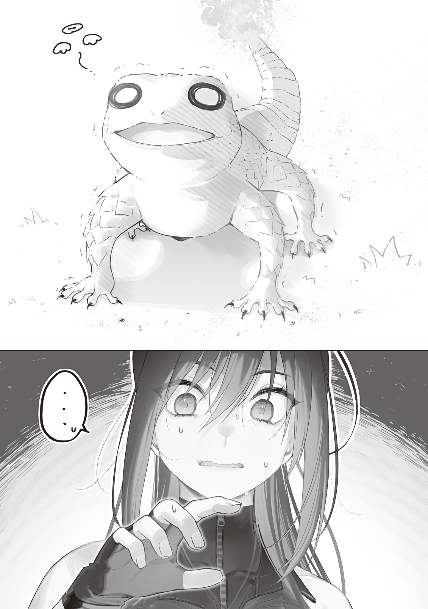

The Blue Witch and Ori Kenshi had known each other for nearly four years.

Long acquaintance meant deep understanding. The Blue Witch could tell that Ori, absorbed in Gremlin processing in his workshop again today, would not be coming back to reality for a while.

Ori was hopeless at communicating. The more the Blue Witch understood Ori, the less he seemed to understand her. Even when she wanted to talk more, wanted to know more, Ori was slow to respond. It was like pushing on a curtain.

Part of her thought that unless she was clearer and more forceful, none of her feelings would get across. But she also thought that if she pushed too hard and scared him, it would have the opposite effect. It was frustrating.

The Blue Witch quietly left the workshop without making a sound. After thinking for a bit, she decided to feed Ori's pets.

There was no way Ori, who forgot even to eat or sleep when he was focused, would remember to feed his pets. Supporting him in things like that was also the Blue Witch's role. Despite appearances, Ori was conscientious. He normally did not notice people looking out for him, but on the rare occasions when he did, he thanked them sincerely. He was cute like that.

She took food from the food box kept high on a shelf where the fire salamanders could not reach, then looked for the three fire salamanders. When she listened closely, she heard their faint, distinctive meeping. Following it, the Blue Witch headed for the kitchen.

The floor of Ori's kitchen was bare concrete, with conspicuous patches over its cracks. It had the look of an old traditional house. The smell of smoke and seasonings soaked into the whole room showed how often Ori cooked for himself.

Homemade jars of miso, salt, and soy sauce lined the shelf mounted on the wall by the sink, each with a scrap of paper neatly stuck to it listing its expiration date. Beside a half-finished mug with ice in it, Hendensho, the magic wand he had probably used to make the ice, had been left lying around.

On the cutting board next to the sink in that kitchen was one fire salamander. From its slow movements and vacant-looking face, it was probably Sekitan.

At first, the Blue Witch had not been able to tell the three fire salamanders apart. But after spending some time with them, she had started to see the differences. The palm-sized little fire salamanders looked the same at a glance, but they each had surprisingly strong personalities.

“Mi, mi, mi, mimi...”

Sekitan had claimed the cutting board and was working hard to sink its teeth into a plump sweet potato bigger than its own body. It clung to the sweet potato with both front paws and steadily gnawed at it. Didn't fire salamanders eat oil and coal? As the Blue Witch watched in wonder, her question was quickly answered.

Sekitan was not eating the sweet potato. It was breaking it apart.

It gnawed the big sweet potato into small pieces, then tried to sweep them into a frying pan with its tail, spilling them all over the floor.

“Mi. Mimi, mimimi.”

When it had finished breaking up the sweet potato, it stood on its hind legs and stretched its front paws toward the seasonings on the shelf, trying somehow to reach them. But it was nowhere near tall enough. After wobbling and reaching for a while, it fell over with a plop and seemed to give up.

Apparently, it was playing at cooking.

All three fire salamanders were very attached to Ori and watched him closely. Sekitan in particular often copied Ori or helped him out—or tried to. The Blue Witch had once seen Sekitan repeatedly smack a Gremlin with its front paws, copying Ori's Gremlin processing.

Sekitan lay limp on the cutting board, staring blankly into space. The Blue Witch put some coal in front of it. Without getting up, it slid along on its belly, stretched out its tongue, and swallowed the coal in one bite.

Sekitan let out a satisfied, smoky breath through its nose and licked its lips. After staring hard at the place where the coal had been, it raised its head with a puzzled look and looked around.

Only then did it notice the Blue Witch standing close by.

Its mouth fell wide open, its eyes went round, and it froze like a stone statue.

“Mi゙...!?”

Sekitan really was laid-back. It seemed not to have noticed the Blue Witch coming close.

“You can cook, Sekitan? Good job.”

The Blue Witch spoke to it gently, as Ori did, but Sekitan tucked in its tail and trembled.

As though a ferocious giant beast stood before it, it slowly backed away, twisted itself between the kettle and the chopstick holder, and hid. Sekitan even made the flame on its tail smaller, trying somehow to hide its presence. It was openly on guard.

Not wanting to upset the frightened Sekitan, the Blue Witch raised both hands in surrender and slowly backed away.

Most monsters judged an opponent's strength by the amount of their magic power. The Blue Witch, who possessed one of the greatest amounts of magic power even among the Transcendents, must have looked terrifying to the fire salamanders.

And Ori, who dealt with such a Blue Witch as an equal, seemed like a mighty protector to the fire salamanders. When Ori was nearby, the fire salamanders were fairly bold even when the Blue Witch came close.

To the fire salamanders, Ori was a reliable boss. To the Blue Witch, he was a man who was always getting himself into danger and making her worry.

After leaving the kitchen, the Blue Witch went to the bedroom next. She could not hear any cries, but she could sense a fire salamander's magic power. The three had very similar magic power, so she could not tell whose was whose, but either Tsubaki or Mokutan was definitely there.

When she opened the bedroom door, the bottom drawer of the clothes chest beside the bed was slightly open. One fire salamander had its face shoved into the small gap and was wagging its tail happily.

After watching for a while, the fire salamander took one of Ori's shirts in its mouth and pulled it out of the chest.

Smaller than Sekitan, letting out needy little cries as it played with Ori's shirt, this fire salamander had to be Mokutan, the neediest of the three.

“Miimi, miimi, mimimimimi!”

Mokutan happily bit the shirt over and over, making it sticky with drool, and tried to carry off its prize.

Then, while dragging the shirt in its mouth, it noticed the big shadow lying before it. It jerked its head up.

“Mi゙.”

Mokutan's eyes met the Blue Witch's. It let out a strained cry and dropped the end of the shirt from its mouth. Then it looked around in a panic and shoved its face into the shirt at its feet to hide. Or rather, it thought it was hiding.

Mokutan had hidden its head but not its tail, which was sticking all the way out of the shirt.

The Blue Witch felt sorry for frightening it, but she also thought its small-animal behavior was cute. Those feelings clashed inside her.

Cute. Mokutan was cute. The Blue Witch liked fluffy little animals, and reptiles did not really appeal to her. But when she watched Mokutan, she started to think fire salamanders might not be so bad.

The flame on its trembling tail was becoming unstable and starting to scorch the shirt, so the Blue Witch immediately pulled Mokutan out of it.

“Mii! Mii! Miimi! Miimi!”

When she put the shrieking, thrashing Mokutan down on the floor, it fled in a panic and ran into the gap beneath the safe.

After Sekitan, now Mokutan was afraid of her too. It made her a little sad.

Did the fire salamanders remember that the Blue Witch had nearly killed them when they first met? Even if they did not, the difference in their magic power would have made them afraid of her. If they did remember, they would be even more afraid.

The Blue Witch did not think her judgment then had been wrong. It was her role to protect Ori's safety by removing and keeping danger away. She had to make up for his lack of caution. Otherwise, she could not protect a delicate, endangered human who had been living carefree as though the collapse of the world were none of his business.

Still, once they had been tamed, gotten used to Ori, and become magic beasts, she no longer thought at all about getting rid of the fire salamanders. Maybe she had forgotten the heat once it had passed, or maybe she was just fickle.

They were cute, innocent kids. They thought of Ori completely as one of their group, and there was no way they would harm him, at least on purpose. If anything, they would probably try to protect Ori in a crisis.

She was reluctant to go so far as Gremlin implantation just to become friends with them. But it made her sad when they were afraid of her and avoided her. It was selfish.

“Mokutan.”

“...”

“Are you hungry?”

“...”

When Ori called its name, it wagged its tail in reply, but it stayed silent when the Blue Witch called it. Yet when she shook some charcoal for it to see, it cautiously poked its face out from beneath the safe and followed the charcoal with its eyes.

When she moved the charcoal right, it looked right. When she moved it left, it looked left. Cute.

It rumbled longingly in its throat, but did not come closer. So the Blue Witch set the charcoal down and backed away. Only then did it slowly approach the food. The moment it snatched the charcoal in its mouth, it ran back beneath the safe.

Mokutan did not show itself again after that. All she heard was the crisp crunching of charcoal from beneath the safe.

It could not be helped that it had put up a wall between them. For now, that was good enough.

She had finished feeding Sekitan and Mokutan. Tsubaki was last.

She searched for Tsubaki's magic power, but could not feel it inside the house. It was probably in its nest.

The Blue Witch headed for the reverberatory furnace on the hill behind the house, where the fire salamanders' nest was.

Tsubaki, which was a size bigger than the other two, also had a big attitude. It was the master of the reverberatory furnace it used as a nest. More than Sekitan or Mokutan, it was territorial and never missed its walk—patrol—around the reverberatory furnace.

Sure enough, Tsubaki blocked the Blue Witch's way just as the reverberatory furnace came into view. It must have sensed her magic power and noticed an intruder in its territory.

Tsubaki took up position in the middle of the narrow mountain path leading to the reverberatory furnace. Looking up at the fearsome witch, it scattered sparks from its mouth and tried to intimidate her.

“Mimimii! Mimi, mimimi!”

Tsubaki cried loudly and breathed fire, setting the dead branches at the Blue Witch's feet alight. It was worked up, snorting as if to say, “Come any closer and this'll happen to you!”

So as not to provoke it, the Blue Witch gently pulled a camellia-oil can from her pocket and shook it for Tsubaki to see.

“Calm down, Tsubaki. I was wrong to come near your territory. I just brought food in Ori's place.”

“Mi...? Mimi!”

Tsubaki's eyes went to the oil can for a moment, but it quickly came to its senses. It glared sharply at the Blue Witch, then rushed to the reverberatory furnace.

Then it immediately came back.

It had a miniature magic wand in its mouth.

It was Ori's wand.

At a glance, the Blue Witch could tell that it was practically a toy, with neither multilayer processing nor a backlash-prevention mechanism. But the color of its core had been matched to the red of a fire salamander's scales, and it had been carefully polished. Ori's obsessive attention to detail showed clearly.

“Tsubaki, did Ori make you a wand?”

“Mi゙!”

Tsubaki held the miniature wand in its mouth, looking proud, and cried out energetically around it.

It somehow reminded the Blue Witch of a small dog wagging its tail with a nice-looking stick in its mouth, and she smiled. She understood why Ori doted on the fire salamanders as pets. They were monsters, but they were still animals. If they grew attached to you, they had to be very cute.

“Mi゙
mi゙

! Mi゙imi゙... mi゙
mi゙

??”

Tsubaki seemed to be trying to breathe fire with the wand still in its mouth, but the wand was in the way and it could not do it properly. The Blue Witch could see that its magic power was not converging well.

It was trying to concentrate magic power on both its own inborn Gremlin and the wand's Gremlin, leaving it unable to focus on either.

After thinking for a moment, the Blue Witch spoke.

“Tsubaki. Why don't you try doing it like this?”

“Mi...?”

Unable to watch any longer, she showed Tsubaki a demonstration of magic-power control that seemed suited to it. It tilted its head, watched closely, and immediately copied her. Its scattered magic power at once began converging beautifully.

The Blue Witch's eyes widened.

Even the Blue Witch, the strongest member of the Tokyo Witches' Council, could not hide her surprise at that talent. It had the intelligence to understand that it should copy the model she showed it. On top of that, being able to copy it immediately was an inborn talent.

With a sharp cry, Tsubaki, still holding the wand in its mouth, breathed fire at the surprised Blue Witch—

“Mi!?”

“Ah!?”

—and the wand it had been holding burned up in an instant and turned to ash.

“...”

“...”

White ash trickled from Tsubaki's mouth. It froze, looking shocked.

The Blue Witch clutched her head.

She had fallen right into an obvious pitfall. Except for the core, the wand was made of wood. Of course it would burn if it breathed fire with it in its mouth. A fire salamander's firepower would turn it to ash in an instant. It was obvious, but she had not thought that far.

She hated herself for being so stupid, and she felt awful for Tsubaki after it burned Ori's present. Her chest hurt with both feelings.

“T-Tsubaki. Um, sorry...”

“...”

It did not react when she spoke to it. It was blank with shock. It seemed to have even forgotten that the Blue Witch was beside it.

Feeling too awkward to stay, the Blue Witch put the whole can of camellia oil before Tsubaki and hurriedly left.

The Blue Witch could neither replace the wand nor comfort Tsubaki. And even if she apologized, she did not know how much it would understand.

She had no choice but to tell Ori what had happened and have him somehow get Tsubaki back in a good mood. He could make it a new miniature wand, or take care of it with his specialty head pats. Ori would probably comfort Tsubaki.

She had been feeding the fire salamanders to help Ori, but now she might end up making more work for him. It got her down.

The Blue Witch was the strongest witch, by her own and others' admission, and she had the strongest wand. She could mow down every enemy who stood in her way.

But she was bad at problems that could not be solved by defeating an enemy.

Still, the Blue Witch, who had once been depressed because of that, was not so pessimistic now.

Ori would do the things she could not do.

She would do the things Ori could not do.

The care of the fire salamanders, and all kinds of unknown threats.

The Blue Witch wished that they could become close enough to help each other with anything, from small things to important ones.
