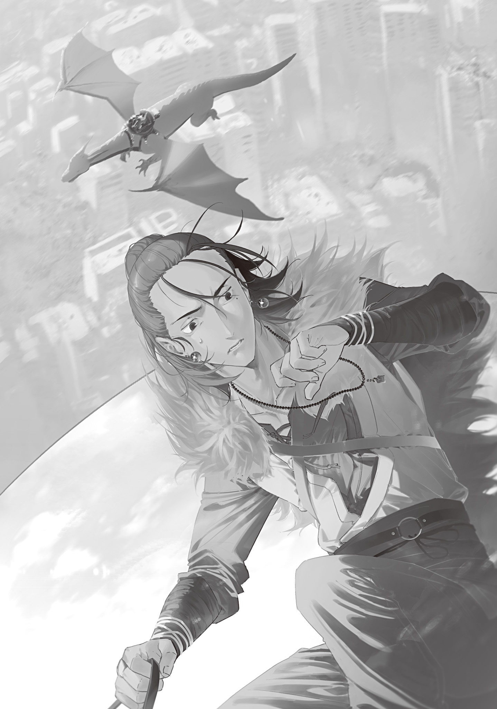

<ruby>Okyaku<rt>Great Wolf</rt></ruby>, a mage with the Tohoku Hunting Association, had come all the way to the skies above the capital on the Dragon Witch's back.

He shielded his eyes from the blasting wind with one hand and looked down. A vast city, in far better condition than he'd imagined, stretched out below. The scars left by what looked like a rampaging giant kaiju were painful to see, but the city still retained its grandeur from before the Gremlin Disaster.

The sight, which still carried traces of Tokyo's glory in its heyday, made <ruby>Okyaku<rt>Great Wolf</rt></ruby> frown.

He had heard that the Tokyo survivor community led by the Tokyo Witches' Council had a population of 2.2 million even after the mushroom pandemic.

That was a sharp drop from its peak of 14 million, but it was still a huge population. More than enough.

<ruby>Okyaku<rt>Great Wolf</rt></ruby> figured the Tokyo Witches' Council needed outside aid this time because it was trying to feed too many people.

To put it simply, too many people had survived in Tokyo.

The Tohoku Hunting Association was a survivor community based in Sendai, run by four mages and one witch.

It had a population of 200,000, which worked out to 40,000 people protected by each hunter. The other large survivor communities—the Hokkaido Magic Beast Farm, Lake Biwa Pact, and Arataki Group—probably had similar ratios.

By contrast, the Tokyo Witches' Council had 16 members for 2.2 million people. About 140,000 per member.

That meant they carried more than three times the burden of the Tohoku Hunting Association.

No wonder they were having trouble running things. If anything, <ruby>Okyaku<rt>Great Wolf</rt></ruby> had no idea how they'd kept the city going this long.

Right after the Gremlin Disaster, the Tohoku Hunting Association had ruthlessly selected which survivors to take in. If it couldn't fully protect someone, it didn't take them in to begin with. That kept the Association from trying to save everyone only for everyone to grow weak together.

Anyone who couldn't walk on their own or had a chronic illness or disability was among the first to be cast aside—even women and children.

People had resented it. But once the Self-Defense Forces and police were wiped out, no one could oppose the united will of the overwhelmingly powerful Transcendents—the only people left who could protect civilians.

It had been a painful decision for the Transcendents too, and the Tohoku Hunting Association had made no exceptions to the selection, even for family.

In fact, because of that selection, <ruby>Okyaku<rt>Great Wolf</rt></ruby>'s chronically ill older brother had quietly walked out beyond the community's defensive line, then died taking a monster down with him. It remained his worst memory, and he still dreamed about it.

The uncompromising policy, harsh to people both inside and outside the community, had caused friction but ultimately been accepted. The citizens would probably say they'd had no choice.

Even then, the Tohoku Hunting Association couldn't fully protect all 200,000 people who remained.

Some died from injuries or illness. Others were killed by monsters that had mutated and hidden in the city.

Above all, without Hakata-sensei, the fertility-magic instructor sent free of charge by the Tokyo Witches' Council, a catastrophic famine would have struck by last year and destroyed the Tohoku Hunting Association.

<ruby>Okyaku<rt>Great Wolf</rt></ruby> had left Sendai and come to Tokyo as a reconstruction-aid envoy this time because he owed Tokyo for teaching his community fertility magic.

Mushroom disease had reached Sendai along with fertility magic, but around 2,000 people in the Tohoku Hunting Association community had died from the disease. Compared with the catastrophic losses they'd have suffered without fertility magic, it was a small price.

After facing one harsh choice after another since the Gremlin Disaster began, the people of the Tohoku Hunting Association were grateful to the Tokyo Witches' Council, not bitter toward it. At least, that was the official story. Anyone who did hold a grudge kept those feelings to themselves instead of lashing out, so outsiders were told there was no ill will between them.

If <ruby>Okyaku<rt>Great Wolf</rt></ruby> left Sendai to support Tokyo, even temporarily, it would leave a gap in the community's hunting rotation and put a heavy burden on those who stayed behind.

But the citizens had been vocal: now was the time to repay the debt they owed for fertility magic.

Hakata-sensei had been especially forceful in petitioning the leadership.

When Hakata-sensei received a letter from his mentor asking for aid, he persuaded <ruby>Itazu<rt>Great Bear</rt></ruby>, the Tohoku Hunting Association's coordinator, to send <ruby>Okyaku<rt>Great Wolf</rt></ruby>, one of its valuable hunters, to help with disaster relief in Tokyo.

Hakata-sensei had earned the citizens' trust by saving the community from a food crisis, and he was normally a quiet, upstanding man. Apparently, even that stubborn old man had been moved when Hakata-sensei got down on his hands and knees to plead.

While <ruby>Okyaku<rt>Great Wolf</rt></ruby> mulled that over, the Dragon Witch began her dive. Their altitude plummeted, the buildings rushed up, and she landed at a dragonport—not a heliport—built in the middle of the city.

The landing sent out a gust of wind and shook the ground. A one-eyed woman awaited <ruby>Okyaku<rt>Great Wolf</rt></ruby> as he slung his luggage over his back and hopped lightly down from the Dragon Witch.

Her springlike outfit of a long skirt and cardigan looked feminine, but her single large, wide-open eye threw his brain for a loop. Without the clothes, he might have mistaken her for a monster.

The one-eyed woman walked up to <ruby>Okyaku<rt>Great Wolf</rt></ruby> and gave him a polite bow.

“Welcome. I am the Eyeball Witch, coordinator of the Tokyo Witches' Council. You are <ruby>Okyaku<rt>Great Wolf</rt></ruby>-san of the Tohoku Hunting Association, correct?”

“I'm <ruby>Okyaku<rt>Great Wolf</rt></ruby>. I look forward to working with you for the next seven days, Eyeball Witch-san.”

“Likewise. Let's make these seven days fruitful.”

They shook hands. The Eyeball Witch smiled gently and nodded, then turned to the Dragon Witch, who was fidgeting and wagging her tail.

“I brought him! Come on, hurry up and give me my reward. You promised!”

“Thank you. You really saved us. Here you go. If you're still around, would you like to stay for tea? We still have some good tea leaves from a trade ship that drifted in last year.”

“Yay! Easy job! I don't want tea. Call me again if you get more tasty work!”

The Dragon Witch happily stuffed the splendid marble-stone necklace the Eyeball Witch handed her into her belly pouch, then hurriedly took off and vanished into the distance.

The Eyeball Witch let out a small breath as she watched the Dragon Witch leave, then led <ruby>Okyaku<rt>Great Wolf</rt></ruby> into the building where this meeting would be held. It seemed to be some sort of hall.

The building was spotless inside, and a whiteboard beside the entrance carried brief notices signed by various witches. A sign beside the first door on the right read, “Welcome, <ruby>Okyaku<rt>Great Wolf</rt></ruby>-sama of the Tohoku Hunting Association.”

A palm-sized fire fairy sat perched on top of the sign.

Apart from her size, the fairy looked about the age of a middle-school girl. Her long hair was made of burning red flame, and wavering fire draped her body like clothing.

The fire fairy spotted <ruby>Okyaku<rt>Great Wolf</rt></ruby> and the Eyeball Witch, sprang to her feet, and bowed. Her voice was calm, at odds with her lively appearance.

“Nice to meet you. I am the Flame Witch. I'm in charge of security during the meeting today.”

“Nice to meet you as well. I'm <ruby>Okyaku<rt>Great Wolf</rt></ruby> of the Tohoku Hunting Association.”

When <ruby>Okyaku<rt>Great Wolf</rt></ruby> held out his hand, the Flame Witch gripped his index finger with both hands as hard as she could and shook it. She scattered sparks just standing there, but she wasn't as hot as she looked. If anything, she was pleasantly warm, like a hand warmer.

She was so cute that he wanted to pet her, but doing that to a security guard would be rude, so he restrained himself. Besides, witches weren't necessarily as old as they looked.

While <ruby>Okyaku<rt>Great Wolf</rt></ruby> was torn between the urge to pet her and his common sense, the Eyeball Witch crouched to meet the Flame Witch's eyes and spoke with concern.

“Oh? Hii-chan, did you shrink again? Are you all right?”

“Um... I'd like some time to speak with Ao-chan-san about that later. There's something I'd like to talk over with her... Could you tell her for me, Eyeball-san?”

“Hmm. I'll try to mention it when she seems to be in a good mood, but I don't know if she'll make time for you.”

“That is enough. Thank you.”

The exchange between the two witches left <ruby>Okyaku<rt>Great Wolf</rt></ruby> feeling strange.

It was an incredibly normal conversation.

Too normal.

Could the Tokyo Witches' Council possibly be a normal group...?

Until now, the Dragon Witch was the only member of the Tokyo Witches' Council <ruby>Okyaku<rt>Great Wolf</rt></ruby> had known personally. He'd vaguely assumed the others were all like her, but apparently not.

The Dragon Witch seemed to be the exception. What a relief.

When he was shown into the meeting room, two women were sitting side by side waiting inside.

One was a young woman who looked barely old enough to be an adult. She wore a tattered black coat and a stylish snow-crystal pendant designed for women.

What caught <ruby>Okyaku<rt>Great Wolf</rt></ruby>'s eye most was the beautiful wand in her hand, set with a brilliant blue gem. The instant he entered, he sensed her casually train it on him.

She was wary of him. He'd heard the VIP would have a personal bodyguard, so this woman had to be the guard.

Beside the guard sat a girl who looked as though she was still in elementary school, or barely in middle school.

Cute stoat-like ears poked out from her head, and the black tip of her white tail swayed beyond the edge of her chair. Her short white hair gave her a lively air, while the friendly smile she wore as she chatted with the guard made her seem sociable.

<ruby>Okyaku<rt>Great Wolf</rt></ruby> tilted his head for a moment.

Going by their physical features, the stoat girl looked more like the witch.

But the guard was the one controlling magic power, so the guard was the witch.

He had heard that the important person attending this meeting was not a witch, but an ordinary expert. Why did an ordinary person have animal ears...?

Once <ruby>Okyaku<rt>Great Wolf</rt></ruby> entered, the Eyeball Witch joined the two women. She personally brewed black tea and passed cups and snacks around, then settled in and made the introductions.

“Allow me to introduce them. The lovely white-haired girl on your left is Ohinata Kei. At only fourteen, she serves as president of Tokyo Magic University and teaches as a professor in the Department of Magic Linguistics. I am responsible for this meeting, but please direct most of what you have to say to her as our representative in the field.”

The stoat-eared girl who had been introduced stood and gave a cheerful bow.

“As introduced, I am Ohinata Kei. I've heard so much about the Tohoku Hunting Association. Not only are you all accomplished mages, I hear you're also excellent hunters. Though I am young, I would be delighted to receive your guidance and encouragement during this visit!”

The polite, cheerful greeting was delivered with a poise unusual for a child. Impressed, <ruby>Okyaku<rt>Great Wolf</rt></ruby> bowed in return.

“I'm <ruby>Okyaku<rt>Great Wolf</rt></ruby>. Hakata-sensei has told me of your reputation, Professor Ohinata. I hear you're an excellent teacher and researcher. I may have come as a reconstruction-aid envoy, but I hope to learn something new from you and take it home with me. It is a pleasure to meet you.”

“Yes! I hope we'll get along!”

Professor Ohinata tilted her head in an adorable plea, cute enough to make <ruby>Okyaku<rt>Great Wolf</rt></ruby> want to claw at his own chest. He almost had to wonder whether she'd been sent as a honey trap. She was sure to grow into quite a beauty.

<ruby>Okyaku<rt>Great Wolf</rt></ruby> was grateful he was neither a lolicon nor a furry.

“Is <ruby>Okyaku<rt>Great Wolf</rt></ruby> a mountain-language term used by <ruby>matagi<rt>hunters</rt></ruby>?”[^1]

“What?! You know your stuff. Just what I'd expect from a linguist. Yes, my grandfather <ruby>Itazu<rt>Great Bear</rt></ruby> gave me the name. Our coordinator is an old-fashioned man. He's always saying things like, ‘When dealing with things beyond this world, don't use everyday words,’ which is why I go by this name. You can call me <ruby>Okyaku<rt>Great Wolf</rt></ruby>-san or Ookami-san, whichever you prefer.”

“Then I'll call you Ookami-san. We're animal friends!”

Even that brief exchange gave <ruby>Okyaku<rt>Great Wolf</rt></ruby> a sense of the stoat professor's personality and left him feeling warm and fuzzy inside. Her bright smile was contagious.

The moment the conversation paused, the dangerous bodyguard cut in with a self-introduction that killed the mood.

“Blue Witch. Guard. If you so much as lay one finger on her, I'll kill... I won't forgive you.”

Before the Eyeball Witch could introduce her, the guard beside Professor Ohinata curtly gave her name, issued her warning, and fell silent.

Confused, <ruby>Okyaku<rt>Great Wolf</rt></ruby> glanced at the Eyeball Witch, whose smile looked a little stiff. Apparently, he hadn't imagined the Blue Witch starting to say she'd kill him.

<ruby>Okyaku<rt>Great Wolf</rt></ruby> had no idea what kind of face to make anymore.

The Tokyo Witches' Council was a baffling mix. The temperature shift between the normal woman and the oddball was enough to give <ruby>Okyaku<rt>Great Wolf</rt></ruby> a cold.

“A-Ahem. She is a little difficult, but extremely capable. As an experienced fighter, she will offer us her perspective.

Today's schedule is to exchange information here, after which I will show you to your lodging.

Starting tomorrow, we will visit the university's various departments to exchange opinions. We will tour Tokyo for the final two days, and if there is anywhere that interests you, we can show you around then.

All told, that makes six nights and seven days. Does that schedule work for you?”

“Yes. I'll leave it in your hands.”

“Thank you. I apologize for beginning so soon after you've come all this way, but our time is limited. First, Professor Ohinata will...”

At the Eyeball Witch's prompting, Professor Ohinata picked up her materials and prepared to speak, but <ruby>Okyaku<rt>Great Wolf</rt></ruby> raised a hand to stop her.

“Actually, excuse me, but may I speak first? One of the things I've brought is perishable... Perishable? Anyway, it needs to be stored properly, so I'd like to explain how to use it and hand it over as soon as possible.”

“Oh, in that case, by all means. We have gifts for you as well, but they keep, so we'll wait until you leave to give them to you and spare you the extra baggage.”

With the Eyeball Witch's cheerful agreement, <ruby>Okyaku<rt>Great Wolf</rt></ruby> pulled a large jar of secret sauce from his luggage and set it down on the meeting room table with a thud.

Professor Ohinata's eyes lit up as she leaned forward. <ruby>Okyaku<rt>Great Wolf</rt></ruby> smiled at her reaction and got right to it.

“For our reconstruction aid this time, the Tohoku Hunting Association decided to give the Tokyo Witches' Council three main things. This is one of them: what we call secret sauce.”

<ruby>Okyaku<rt>Great Wolf</rt></ruby> opened the jar and showed everyone the soy-sauce-like black liquid inside. A slightly sour but appetizing smell spread through the meeting room.

“This secret sauce detoxifies monster meat. Normally, only witches and mages can eat monster meat, but soaking it in this sauce for at least three days makes it safe for ordinary people. For thick cuts of meat, you should allow four or five days.

The sauce is made from monster gastric juices. Apparently, the original batch combined the gastric juices of several monster species with well-developed digestive systems. Not even the person who made it knows why it detoxifies meat, but our policy is to use anything that works.

To make more secret sauce or replace what gets used, top it up with gastric juice from any kind of monster. Adding too much at once will throw the sauce out of balance and ruin its detoxifying effect, so only add more once a day and never more than one-tenth of the total. One day, one top-up, one-tenth—remember it as one-one-one. You can dilute it with water, but too much water will also ruin its detoxifying effect, so...”

<ruby>Okyaku<rt>Great Wolf</rt></ruby> slowed his explanation of the sauce's use and upkeep to match Professor Ohinata's note-taking.

Every household in the territory managed by the Tohoku Hunting Association used secret sauce, and every family's batch tasted a little different. It truly was the source of each household's own flavor.

The Association's hunters delivered their kills to butcher shops, which dressed them and distributed the gastric juices and meat to each household. That supply chain had done a great deal to improve Sendai's food situation from the early days after the Gremlin Disaster.

No one understood how secret sauce worked, but so far it hadn't caused a single case of food poisoning. It would surely be useful in Tokyo too.

After the lesson, Professor Ohinata finished her notes, asked <ruby>Okyaku<rt>Great Wolf</rt></ruby>'s permission, then grilled the sample of monster meat he'd put in the jar and tasted it on the spot.

She munched on it, gave a firm thumbs-up, and affectionately traded bites of meat with the Blue Witch, each feeding the other.

Her nerve in trying it on the spot impressed <ruby>Okyaku<rt>Great Wolf</rt></ruby>, but her use of fire magic surprised him even more.

Professor Ohinata had casually waved her wand and cast fire magic, and <ruby>Okyaku<rt>Great Wolf</rt></ruby>'s eyes went wide.

Tokyo really did live up to its reputation as the home of wizards. Even ordinary people could use fire magic with ease.

Tokyo was on another level entirely. In Sendai, where no magic but fertility magic had spread very far yet, something like this was unthinkable. Then again, Professor Ohinata was a famous magic linguist, so perhaps she was exceptionally good at magic even among ordinary people.

The Eyeball Witch accepted <ruby>Okyaku<rt>Great Wolf</rt></ruby>'s secret sauce with heartfelt thanks and set it in a corner of the room for the time being. At room temperatures like those of early spring, a cool, dark place out of direct sunlight was all it needed, so that would do for now.

Next, <ruby>Okyaku<rt>Great Wolf</rt></ruby> pulled out the Monster Trap and set it on the table.

This time, the Blue Witch leaned forward for a close look at the Monster Trap.

“Hey. Don't tell me this bear trap uses crushed magic stones?”

“That's exactly right.”

“Why would you crush them? What a waste... Ah, no. Sorry for interrupting.”

Halfway through, the Blue Witch seemed to remember she was there as a guard. She settled back into her chair, fell silent again, and gestured for him to continue.

Of course <ruby>Okyaku<rt>Great Wolf</rt></ruby> knew magic stones amplified a spell's power, and that larger stones provided a greater boost. He understood why breaking them into smaller pieces looked foolish. Still, he had a reason.

<ruby>Okyaku<rt>Great Wolf</rt></ruby> pointed to the Monster Trap's components one by one.

“As you can probably see, this is a modified bear trap. We call it a Monster Trap.

The two toothed semicircles in the center work just like an ordinary bear trap. When something steps on the plate in the middle, they bite down and hold it fast.

The important part is the outer ring, specifically these magic-stone fragments set into it. See them? These right here. Two different colors alternate to form a circle, but they don't actually need to make a circle. Any shape works as long as the fragments touch and form one unbroken line from one end to the other. Then you channel magic power into them like this...”

Using magic-power control, <ruby>Okyaku<rt>Great Wolf</rt></ruby> channeled magic power into the trap, and its magic stones flashed for an instant.

“...There. It's now in an activation-standby state. Eyeball Witch-san, can you bring out that familiar? Please have it pass over the Monster Trap.”

“Yes. Would it be better if it stepped on the plate?”

“I only want to show the magic stones' effect, so just pass it over.”

The Eyeball Witch nodded, recited an incantation, and summoned an eyeball familiar.

At the Eyeball Witch's direction, the floating eyeball passed over the Monster Trap.

The instant it crossed over the trap, the eyeball familiar slowed with a jerk. It crept along more slowly than a turtle, as if pushing through an incredibly thick liquid.

The two witches and the stoat girl all cried out in admiration, and <ruby>Okyaku<rt>Great Wolf</rt></ruby> basked in their reaction.

The many new technologies produced by the Tokyo Witches' Council sounded impressive even secondhand.

But the Tohoku Hunting Association's <ruby>traps<rt>hunting gear</rt></ruby> had plenty to offer too.

“As you can see, it drastically slows anything that enters the trap. Combined with the bear-trap mechanism, it can securely hold even powerful monsters. Once you've caught one, all that's left is to beat it to a pulp while it can't move. I think it could help your wizard unit on monster hunts.”

“Wow! That's amazing! Is this a kind of binding magic?”

Professor Ohinata eagerly studied the eyeball familiar crawling through the air from every angle, and <ruby>Okyaku<rt>Great Wolf</rt></ruby> told her everything he knew.

“According to our mages, it doesn't restrain things so much as make time heavier. Simply put, time passes more slowly for whatever enters it. Something that would normally break the trap and escape in an instant can be held there for hours or days, depending on how much magic power you put into it.”

“I see... Hmm. Hunting... stabilizing critically injured patients... preserving food... experiments... There seem to be all sorts of uses for it. This is wonderful! I think many people I know would be interested.”

“The Tokyo Witches' Council has magic stones too, right? The Blue Witch-san's wand appears to be made from one as well. The structure itself is fairly simple, so I think you could copy it right away. I brought the blueprints too. Here you are.

There are several precautions when using a Monster Trap, but the most important is that it catches people as well as monsters. Or rather, it catches every living thing with magic power. We once had a mage carelessly step on one, and it took him days to escape. Since time was passing slowly for him, he didn't go hungry or soil himself, but he would have died if a monster had attacked while he was defenseless. Please be very careful.

You can also rearrange the magic stones to change the trap's activation threshold, making it trigger only when something with at least a certain amount of magic power passes over it, but—huh?”

The door opened behind <ruby>Okyaku<rt>Great Wolf</rt></ruby> mid-explanation. He broke off and turned to see what was going on.

No one stood beyond the door. For a moment, he thought it had opened on its own, but then he lowered his eyes and found the little fire fairy—the Flame Witch.

The meeting was still underway, so why had the guard come in? Had something happened outside?

<ruby>Okyaku<rt>Great Wolf</rt></ruby> tensed, and the Flame Witch asked him in a pleading voice.

“I'm sorry, I overheard you. Could you use that Monster Trap on me?”

<ruby>Okyaku<rt>Great Wolf</rt></ruby> blinked at the unexpected question. The Flame Witch went on pleading.

“I want you to seal me away.”

## Translator Notes

[^1]: **Matagi (マタギ):** Traditional hunters of northern Japan, associated with a specialized occupational jargon called mountain language.
