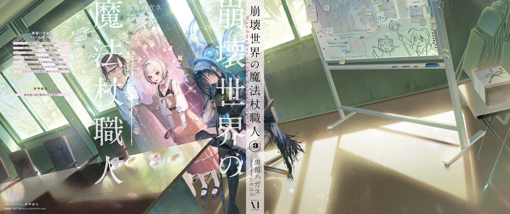

The following guide to taming pouch sparrows is excerpted from the secret techniques of the Hokkaido Magic Beast Farm.

To command a pouch sparrow, first undergo the standard Gremlin implantation procedure using a pouch sparrow's Gremlin, then tame it (get it used to humans and train it to obey).

After Gremlin implantation, a pouch sparrow recognizes the implanted human as one of its own, but that alone will not make it obey.

Pouch sparrows are social animals that live in flocks and naturally follow a leader. Simply undergoing Gremlin implantation will not make them regard you as that leader. In fact, if you fail to obey the current leader sparrow, they will show their disapproval (loud warning cries, barring you from the nest, pecking at and pulling out the hair (feathers) on the back of your head, and so on).

For pouch sparrows to accept you as their leader, your contribution to building the nest must surpass that of every other member of the flock.

When their nest is destroyed for any reason, pouch sparrows dismantle what remains, salvage the nesting materials, move to whichever location they judge best at the time, and rebuild.

During this rebuilding, up to 20 pouch sparrows bring their nesting materials together to form one sturdy apartment complex (colony). To become their leader, you must supply a sufficient quantity of superior nesting material during construction.

The exact requirement depends on the quantity and quality of the materials brought by the other birds. As a general guideline, however, a contribution equivalent to any one of the following should earn you recognition as the flock's leader.

Vending machine ...... 1 unit

Mailbox ...... 2 units

Microwave oven ...... 6 units

50 kg rocks ...... 8

Note that automobiles, container houses, and similar objects are too large. They are considered unsuitable as nesting material and do not count toward your contribution. Low-density, lightweight materials (such as Styrofoam and urethane) are likewise unsuitable.

Flammable materials such as wood and leather are accepted reluctantly, and only when no more suitable nesting materials are available (they count as only a minor contribution).

If the flock decides that you made the greatest contribution, it performs a leader-approval ritual once the nest is complete. To signify its approval, every member of the flock gently nips the leader's belly pouch with its beak.

Humans, of course, do not have belly pouches, so wear clothing with a pocket over the abdomen. If the would-be leader has no belly pouch (belly pocket) when approval takes place, the pouch sparrows will become confused and, in the worst case, may refuse to accept them as leader. Once accepted, you can go without a belly pocket until the next nest building.

Pouch sparrows obey their leader completely, even at the cost of their lives, and display extraordinary loyalty. They will even obey an order to serve as emergency rations, trembling all the while.

Never, ever abuse pouch sparrows' loyalty.

