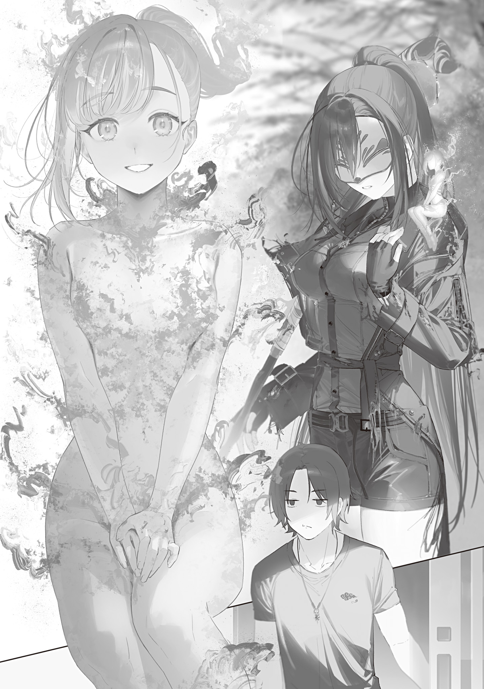
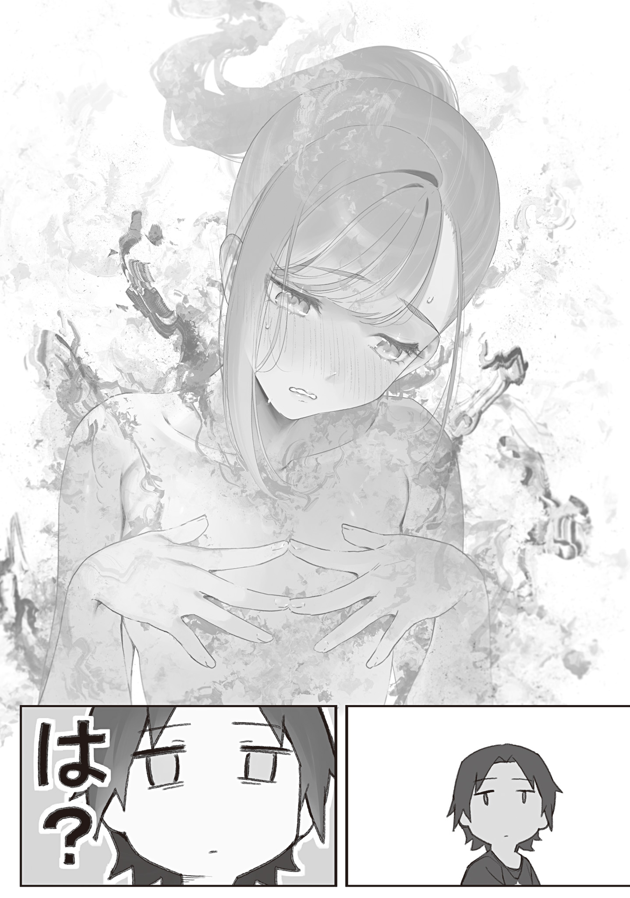

My post-apocalyptic life was entering its fifth year, and I'd finally built myself a solid foundation in Okutama.

Lost Mist shrouded the area around my house, so there was almost no chance of an outside attack.

I'd used last year's experience to keep improving the rice paddies, and I could expect an even bigger harvest this year.

The holding pond out back kept me supplied with fresh fish whenever I wanted it.

I spread my homemade compost over the vegetable garden, then combined it with fertility magic for bumper crops of seasonal vegetables.

Seasonings had been getting more expensive every year, but the homemade miso and soy sauce I'd finally perfected that spring had solved that problem in style.

Even the shiitake mushrooms I'd been planning to grow had sprouted from their logs, though there weren't many yet. That morning, I'd poured miso soup made from my own miso over last night's leftover rice, then added plump, freshly picked shiitake grilled with soy sauce and even salt-grilled char. It was a breakfast lineup to put anyone in a good mood.

Once, I'd been terrified by my dwindling weight and food stores. Times really do change.

Who would've thought I'd ever get to start the day with my ideal luxurious country breakfast?

I'd heard the pandemic had thrown food production in central Tokyo into chaos, but I had it easy. I even had time to make dumplings from seasonal mugwort as a thank-you for the Blue Witch, who would hopefully bring me magic-wand orders from the Tohoku Hunting Association.

After stuffing myself with that glorious breakfast, I pulled on my rubber boots and headed out to retrieve the trap I'd set in the river the night before, partly to work off the meal. Just then, the Blue Witch emerged from the Lost Mist.

The usual mask, the usual blue magic wand, the usual amulet.

The little fairy perched on her shoulder, though—the one that looked like a fire type? She was new.

What's going on?

“Good morning. Nice to meet you. I am the Flame Witch.”

She was a palm-sized girl with hair of red flame and more fire wrapped around her like clothes.

She greeted me in a calm voice with a little bow.

The whole thing was straight out of a fairy tale. She was ridiculously cute, like a fairy who'd popped right out of a picture book.

Hold on—haven't I seen something like this before?

Last time, it had been a stoat.

And just when I'd thought she was cute, she'd gone and turned into a human the second time we met.

I won't be fooled again! You scammer!

“Hah. You're going to get huge when I look away and go back to normal human size, right? Right? You think you can fool me? No way!”

“W-What are you talking about?”

“Calm down, social cripple. Listen to me before you start yapping.”

While I stayed on guard and tried to intimidate the suspicious fire fairy, the Blue Witch explained why she'd brought her.

Just as she'd introduced herself, the fire fairy was the Flame Witch, a member of the Tokyo Witches' Council.

She governed Shinagawa Ward. Though she'd been only thirteen when the Gremlin Disaster struck, she'd burned monster after monster to ash with her specialty, fire magic. Combined with her quiet, sensible personality, that had made her one of the Witches' Council's steady, dependable members.

As anyone could see, her specialty was fire. She could control not only magical fire but, to some extent, any natural fire nearby. That let her suppress fires, spread her fire magic over a wider area, raise or lower its firepower without spending magic power, burn only certain objects, and generally do almost anything she wanted with fire.

The widely used fire spell <ruby>Jin Ga<rt>Flame</rt></ruby> had originally been her magic too. Thank you, as always, for your continued support. I'd used it to make breakfast that very morning.

Over the past year, though, the Flame Witch had weakened rapidly, and now she was on the verge of burning out.

Her body was made of fire. That was simply the kind of creature she'd become. She'd started out at normal human size, but over the last year she'd gradually shrunk and cooled. Right after the Gremlin Disaster, when she'd first become a witch, she couldn't get anywhere near a wooden building without risking a fire. Now, even a tissue held next to her wouldn't ignite.

According to her, it was her lifespan.

It wasn't an illness. Apparently, she could feel herself weakening and growing old naturally.

Mutation had fundamentally changed the bodies of mages and witches from their human forms.

The Hell Witch had become more talkative, grown horns, and awakened to cannibalistic urges.

The Flower Witch's lower half had become a flower monster.

Even the Blue Witch looked human, but she had abnormal cold resistance, inhuman strength, and a throat structure different from a human's.

Apparently, these mutations could affect lifespan too. The witch of Kita Ward was famous for never aging past adolescence. The Sumida Witch, who'd died in the mushroom pandemic, had been on the verge of dying from old age before her mutation, only to perk right up afterward.

But if mutation could extend a lifespan, it could also shorten one.

The Flame Witch's mutation had turned her into a short-lived creature.

Fairies are fleeting.

Four years after her mutation, the fire-fairy Flame Witch had aged almost to the end of her life.

“I've suddenly become afraid of dying...”

Sitting on the Blue Witch's shoulder, the Flame Witch miserably confessed her fear, as though it were something to be ashamed of.

“I've burned countless enemies to death. I knew I'd die someday too. But when I realized the time had come, I was scared. So scared. I know it can't be helped. It's my natural lifespan. I know that, but I'm still scared. I don't care what form it takes. If there's any way I can keep living, I want to cling to <ruby>Okyaku<rt>Great Wolf</rt></ruby>-san's magic item.”

“A customer? Who?”

“The characters mean ‘great wolf,’ but it's read <ruby>Okyaku<rt>Great Wolf</rt></ruby>. He's a mage from the Tohoku Hunting Association. The magic item is this Monster Trap. It can suspend time for whoever gets caught in it. Don't break it, got that? I only borrowed it. The Witches' Council has it in safekeeping.”

With that, the Blue Witch handed me a bear trap.

At a glance, I understood more or less how the bear trap worked.

Oh, I see. They've made a circuit by connecting two types of magic stone. Huh. Such a simple idea, yet I've never thought of it. I've tried connecting and combining fragments from a single kind of magic stone before, but two kinds. Of course.

The construction was so crude you couldn't make it this bad on purpose. What a waste of good material.

Several of the fragments clearly matched, so it looked like the maker had carelessly smashed the stones apart—wham!—slapped down alternating shards of two colors, and connected the ends.

Couldn't they have done something about this? Anything?

Sure, magic stones are hard to polish and cut, and I know they probably couldn't have done any better even if they'd tried. Still, you can practically hear the maker saying that as long as it works, nothing else matters.

“So anything that enters this ring of magic stones gets its time suspended? Hmm. If it reacted to air or dust, it'd go off constantly. It only works on living things—no, creatures with magic power, right? And what powers it...? Magic power, obviously. Does it need an incantation, or do you just charge it?”

“You saw through all of it without me explaining...”

“No, I don't understand all of it. So?”

“Charging it with magic power arms it. Once it's armed, it captures any prey that passes over it. The charging takes magic-power control, so ask me or the Flame Witch when you need it.”

“Then I'm asking now. I want to see it activate.”

Eagerly, I held the Monster Trap out to the Blue Witch, but she only sighed.

“I know you're happy about a new toy, but we're still in the middle of talking.”

“Talking? ...What were we talking about again?”

“I told you the Flame Witch is dying because her lifespan's running out. Come on, Flame Witch. Ask him yourself.”

At the Blue Witch's prompting, the Flame Witch hopped to the ground and gave me a polite bow.

“I want you to make a magic item that will seal me away. Not one that wears off after a dozen or so days at most, but one that can keep me sealed for decades. I want to place my hopes in the future. Even if nothing can be done about my lifespan now, someone might find a solution in a few decades. Please, could you do this for me?”

“Oh, sure. If that's all, you basically want cryosleep. I can already think of a few upgrades. I don't know about decades, but I can make it last ten years or more. Probably.”

“R-Really!? Just like that...? Th-Thank you! Thank you, thank you so much...!”

“You can stop worshipping me. Making a magic item to seal a witch sounds interesting anyway. Hey, Blue Witch. Come over here a second.”

The Flame Witch kept worshipping me anyway. I left her to it, called the Blue Witch aside, and questioned her in a low voice.

“Hey. Weren't we supposed to keep my existence secret? Why did you bring her here?”

“She'll die if I leave her alone. She begged me through tears to introduce her to that craftsman, and she's a good kid. At that nonhuman size, your aversion to people won't kick in, right?”

“I don't have an aversion to people. I'm just bad with them.”

I corrected her, then watched as the Blue Witch awkwardly tried to justify herself.

Hmm. Lately, it really does feel like the Blue Witch is slowly getting over her distrust of people. Her guard is slipping.

Sometimes I get the sense that she was originally an extrovert. Maybe the trauma of being betrayed by and losing so many people close to her is starting to heal too.

If she goes back to being outgoing, she'll be harder for me to deal with, so I want her to stay this way. But the Blue Witch is my friend. I'd rather see her smile than sit around gloomy and brooding. It's a complicated feeling that's hard to put into words.

“Well, I get the part about a magic item to seal the Flame Witch. Did you get the order from the Tohoku Hunting Association?”

“I told him about it. <ruby>Okyaku<rt>Great Wolf</rt></ruby> said he couldn't place an order on his own, so he'd take the proposal back for discussion.”

“Ah, yeah. That makes sense.”

Organizations are a pain because nobody gets to decide anything alone.

On the bright side, this could become a bulk order from several Tohoku Hunting Association witches and mages, not just the one mage who'd come as their envoy. I sincerely hope they give the matter due consideration.

Take flight across the world, premium Ori-brand magic wands!

Having finished her business, the Blue Witch said she would tell the Witches' Council about the Flame Witch and disappeared into the mist. That left me with the Monster Trap and the Flame Witch.

Now what? I looked down at the Flame Witch by my feet. She looked back up at me and asked timidly.

“Um. Craftsman, are you close with Ao-chan-san?”

“She's a friend. Doesn't she like you quite a bit too? What kind of relationship do you have?”

“Ehehe. I've actually been a huge fan since her magazine-model days. Apparently, she even remembered the fan letter I sent! I was so happy when I found out I'd become a witch just like Ao-chan-san.”

“Huh. Well, come in for now. I'll show you the workshop.”

The Flame Witch stared off into the distance at the memory as I showed her inside.

The Flame Witch pattered after me, nearly tripping over every raised bit in my not-at-all-accessible house. Unlike Professor Ohinata, she showed little excitement when we reached the workshop. Apparently, this kind of handiwork didn't interest her much.

The mini furnace caught her eye, though. I used it for small fire jobs that didn't call for the reverberatory furnace.

“As long as you don't break anything, you can look around as much as you want. Uh, where did I put the magic-stone shavings...?”

I left the Flame Witch to look around while I searched through my stock of magic stones.

I had made three magic-stone wands so far.

The supreme treasure, Okutameteorite, made with a black magic stone.

The Blue Wand Cyanos, made with a blue magic stone.

The khakkhara Hariti, made with an amber magic stone.

Naturally, I'd kept every shaving left over from processing them. The stuff I'd saved in case it ever came in handy was about to do exactly that.

I found the case of magic-stone shavings at the back of a shelf and set it on my drafting table. After checking how much I had, I immediately started sketching out my ideas.

First things first, the pieces need to match. Instead of connecting jagged fragments, I need to arrange them so the magic power flows smoothly and evenly. That alone should cut the loss and make the seal last much longer.

Then I need to settle on a shape and find the ideal size for each piece.

I also need to test what happens if I arrange three colors of magic stone in a regular pattern instead of two. Will that improve performance? It could cause a short circuit or even produce a completely different effect.

I want to try building them in three dimensions instead of laying them flat. And rather than slowing time, can I speed it up or stop it completely...?

After I'd spent a while lost in the design, I felt a couple of pokes at my elbow.

The Flame Witch had climbed onto the drafting table. She strained to spread out the blueprints for my reverberatory furnace and charcoal kiln and show them to me.

“Sorry to bother you while you're working. Um, did you make these blueprints, Craftsman?”

“Yeah, I drew both. They're for the ones I built on the mountain behind the house. What about them?”

“You made them exactly according to these blueprints...?”

“Huh? Is something wrong?”

I'd thought I'd researched them thoroughly and considered everything before drawing the plans, but something had apparently caught her attention.

Could a fire specialist like the Flame Witch see some fatal defect in them?

I asked nervously, but the Flame Witch shook her head.

“There's nothing seriously wrong with them, but there's room for improvement. If you're interested, I can teach you how.”

“Seriously? I want to hear it, I want to hear it. Teach me.”

I dropped my design work and asked for a lesson. The Flame Witch borrowed my pencil and added to the blueprints as she explained.

According to her, my reverberatory furnace and charcoal kiln were venting valuable chemical compounds straight into the air.

Burning wood or coal gave off vapor. Collecting, cooling, and condensing that vapor produced <ruby>pyroligneous acid<rt>dry-distillation liquid</rt></ruby>, a mixture of many useful chemical substances.

A few modifications to the reverberatory furnace and charcoal kiln would let me collect this valuable mixture efficiently instead of uselessly venting it into the atmosphere.

First, the smoke would be routed through pipes and into a narrow coiled tube, where cold water would condense it into pyroligneous acid. Anything that stayed gaseous was a flammable substance called wood gas, which could be used directly as fuel.

If left to stand, pyroligneous acid separated into a watery upper layer and a thick lower one.

The watery upper layer was called wood vinegar, and fractional distillation yielded acetic acid, acetone, and methanol from it.

If diluted, acetic acid became vinegar, and it could also be used as a raw material for dyes and disinfectants.

Besides being a cleaning agent, acetone was also necessary to make <ruby>cordite<rt>smokeless powder</rt></ruby>.

Of course, methanol was fuel.

Fractionally distilling the thick tar yielded turpentine, creosote, and pitch.

Turpentine was an important solvent, while creosote could be used as a preservative or disinfectant.

Pitch provided excellent waterproofing and would be indispensable for building and repairing the wooden ships the coming age would likely need.

The Flame Witch drew up not only plans for modifying the furnaces, but illustrated instructions for a fractional-distillation apparatus as well.

Every diagram came straight from memory. She had the whole thing in her head.

Isn't that amazing?

“Fire fairies know this much about chemistry too?”

“Ah, no. I studied all of this. We're developing fire-based industries in Shinagawa Ward.”

“You really work hard.”

The Flame Witch smiled shyly.

The people of Shinagawa Ward must feel pretty safe with her in charge. I want a boss who actually understands my work too... No, never mind that—I don't need a boss. I'm my own boss.

“Also, what do you do with the furnace ash?”

“I spread it on the fields.”

“That's good too, but you can use it to make potash. Dissolve ash in water, remove the impurities, and evaporate the water. White crystals will remain. That's potash. Potash can be used as a raw material for soap and glass, and as a combustion aid. In cooking, you can use it as alkaline water for making noodles.”

The Flame Witch quickly wrote down the structural formula and uses of potassium carbonate (potash).

This girl looks more like a magical life-form than anyone I've ever met, and yet she knows the most about chemistry.

Right, of course. Even if electricity is gone from the world, there's still chemistry that doesn't need it. Magic is a wonderful new technology that will open up the coming age, but I can't forget the chemistry still available to me either.

I sincerely thanked the Flame Witch for the valuable insight and reference material.

“No, that was seriously helpful. It really pays to ask an expert.”

“I'm glad I could be of help.”

The Flame Witch smiled modestly.

She was tiny like Professor Ohinata, but unlike the professor, she seemed to be an introvert. I felt a certain kinship with her.

“You got good grades when you were human, didn't you? It's been a while since I've seen a molecular structural formula.”

“No, no, I'm nothing special. You're way more amazing, Craftsman. I've never seen anyone who could draw such precise blueprints freehand. It's a little cree... amazing.”

“Want something in return for not finishing that sentence? Other than an improved Monster Trap.”

The Flame Witch's revised blueprints looked like they'd make my life in the country way better. That made me want to give her something in return.

If everything goes smoothly, she'll be sealed in a few days and spend a long time trapped in that drawn-out flow of time. Better make some good memories while you can.

When I asked, the Flame Witch thought it over. An idea seemed to strike her, and she fidgeted as she spoke.

“Then... I spotted an abandoned house on the way here.”

“Yeah.”

“Um, could I set that abandoned house on fire?”

“Why...?”

The request came so far out of nowhere that I freaked out.

Why, seriously?

I don't get it.

She'd seemed quiet, sensible, and smart until just now, so why'd she suddenly turn into an arsonist?

This is scary. She puts on this nice-person act, but I guess she really is a witch too.

When the Flame Witch saw the look on my face, she hurriedly waved both hands and explained herself.

“Ah, no, it's not like I have an arson habit! It's not like that!”

“Then what is it like?”

“It's... um...!”

The Flame Witch trailed off and looked down. She was red all over to begin with, so it was hard to tell, but I thought her face had gone even redder.

What? What is it?

I waited silently for the Flame Witch to continue. Eventually, she spoke in a faint voice.

“I just...”

“What?”

“...got horny.”

“Huh?”

What?

Can an explanation leave you more confused than before?

That was the purest “Huh?” I'd uttered in the last ten years. The Flame Witch heard it, turned bright red, and rattled off her explanation in a desperate rush.

“I'm that kind of creature. You know how witches' fetishes can change when they mutate, right? The creature I turned into seems to reproduce when a mating pair sets something on fire together. So when I get horny, I want to set fires so badly I can't stand it.

“I think if a male of my species and I set something on fire together, children might be born from the flames. I mean, it can't be helped, can it? That's just how my species works! I can't go against my instincts!”

“O-Oh.”

“Aah! I knew you'd be put off...! Let me tell you, I only said it because I might die soon, and I trusted you to keep your mouth shut, Craftsman! I've been keeping it to myself all this time and satisfying my pent-up urges by setting enemies on fire!”

“O-Okay.”

I nodded despite being a little put off by her intensity.

You might've confessed in an “I might die soon, so screw it, I'll say it” kind of mood, but think about how I feel, getting blindsided by some fetish I'd never even heard of.

I'd heard a ridiculous story, but there was one thing I could say for sure.

“Listen. I don't know much about the etiquette for conversations like this either, but you probably shouldn't tell anyone else about that fetish.”

“Guh...!”

That “guh” was all the Flame Witch could manage before she fell silent.

“Well, I get the situation. I can't really sympathize, though. If that's what this is about, go ahead and burn it. All the supplies have already been stripped from the abandoned houses in Okutama. It's not like the residents are coming back now.”

The Flame Witch nodded and, still a little red-faced, toddled out of the workshop.

Apparently, she was off to commit arson right away.

Talk about a troublesome fetish. I was about to return to my designs when I heard two witches talking by the entrance.

“Huh? You're leaving?”

“W-Welcome back, Ao-chan-san. I... I'm just going out for a bit. Craftsman said I could burn an abandoned house nobody's using. I'll be right back.”

“I see. I told the Witches' Council that ‘progress is being made toward resolving the Flame Witch's problem.’ Is there anything else? Anything you want me to pass along, or anything you're worried about?”

“............ Um, Ao-chan-san!”

“What?”

“Would you set an abandoned house on fire with me!?”

The Flame Witch's horny voice rang out louder than ever. For a second, I honestly couldn't believe my own ears.

Flame Witch-san!?

What in the world do you think you're saying!?

I mean, that's... Wait, what?

Setting fires with someone is a reproductive act to you, right!?

“Set an abandoned house on fire together...? I don't mind, but...”

The Blue Witch had no way of knowing any of that. Despite her confusion at the sudden request, she agreed.

W-Whoa...! This has gotten completely out of hand!

The Blue Witch has no idea what's going on, but this is outrageous sexual harassment taking advantage of her ignorance!

I half-rose from my chair to stop them, but I couldn't think of what to say. My body froze.

No, no, no, what am I supposed to say about this? “Blue Witch, you're being set up for unwitting yuri arson sex right now, so turn her down,” or something? Like I could say that, idiot!

After agonizing over it, I finally sat back down.

W-Well, they're both women. If you don't know the circumstances, all they're doing is setting a fire. If I keep quiet, there shouldn't be any actual harm.

The Flame Witch trusted me in her own way when she blurted out her fetish, so it wouldn't be right for me to spill her secret. If I keep quiet, everything works out. Sometimes, the truth is better left unsaid.

About an hour later, the Flame Witch returned from her perverted arson session looking refreshed and calm.

The Blue Witch had apparently gone home with the mugwort dumplings I'd left covered in the kitchen as a souvenir, never realizing what she'd been made to do. Poor thing. No way I can tell her the truth.

I couldn't bring myself to ask the Flame Witch exactly what she'd done, so I decided not to bring this up.

The miracle of life sure is something.

Not an example I ever want to follow. At all.
