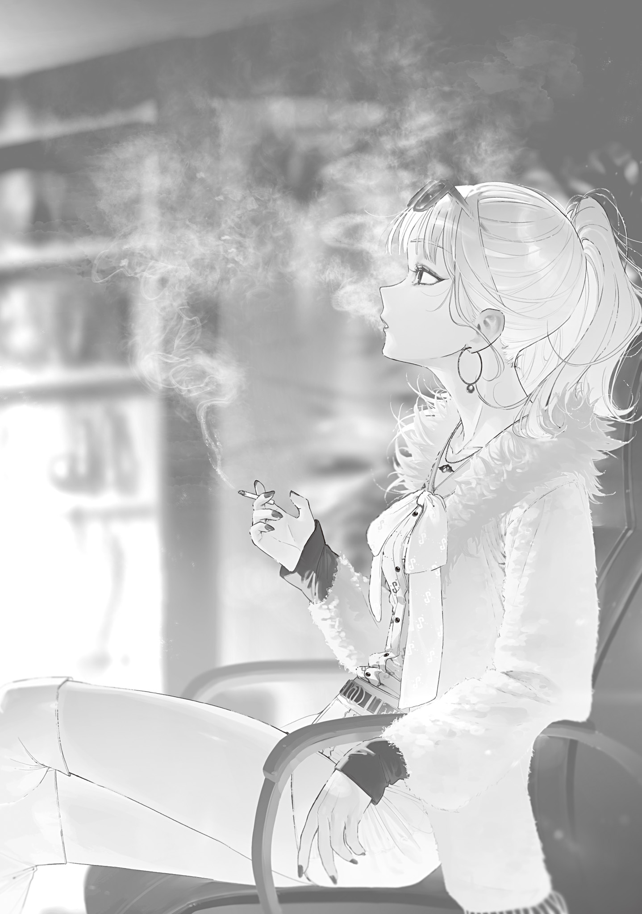

<ruby>Shirokarasu<rt>White Crow</rt></ruby> was the woman who headed a black-market outfit in Suginami Ward.

<ruby>Shirokarasu<rt>White Crow</rt></ruby> had once worked in Shinjuku’s nightlife industry. She lived with her boyfriend, a host, but soon after the Gremlin Disaster began, a monster devoured him right in front of her.

The gruesome sight broke something in <ruby>Shirokarasu<rt>White Crow</rt></ruby>. The shock was more than enough to destroy her common sense and decency.

<ruby>Shirokarasu<rt>White Crow</rt></ruby> took advantage of the chaos after the Gremlin Disaster to build a faction of her own. She gathered capable men she knew through her boyfriend—the sort covered head to toe in tattoos—along with women who were easy to sweet-talk, and launched a black-market operation.

Everyone was desperate after the Gremlin Disaster, and <ruby>Shirokarasu<rt>White Crow</rt></ruby> made a killing off their plight.

The little cold medicine she had hidden during the forced requisition of medicine brought her a mountain of food ration coupons.

She seduced a livestock farmer and got him to divert precious meat to her.

She sold monster blood by passing it off as “witch’s blood,” and secretly bought firearms recovered from the bodies of Self-Defense Forces personnel for dirt cheap.

She gathered women with no family, trained them, and paired them off with men of some standing in the chaos, then skimmed the profits.

<ruby>Shirokarasu<rt>White Crow</rt></ruby>’s gang made money hand over fist. Even amid an unprecedented disaster, they lived in luxury.

But <ruby>Shirokarasu<rt>White Crow</rt></ruby>’s good times were short-lived.

Witches and mages were to blame.

Transcendents maintained order to one degree or another in every ward of Tokyo.

Most wards had food distributions and assigned work, while security forces patrolled and hunted monsters. When a major problem arose, a Transcendent witch stepped in.

Shinjuku, where <ruby>Shirokarasu<rt>White Crow</rt></ruby> had lived, was under the Eyeball Witch’s control. A pacifist who disliked conflict, the Eyeball Witch was lenient even with groups like hers.

The Eyeball Witch once paid her a personal visit. <ruby>Shirokarasu<rt>White Crow</rt></ruby> braced herself for punishment, only for the meeting to feel like a friendly neighborhood auntie worrying about her future. It was almost a letdown.

The Eyeball Witch was soft.

<ruby>Shirokarasu<rt>White Crow</rt></ruby> was starting to get cocky and think no one could touch her when ominous rumors stopped her short.

Others in her line of work in the surrounding areas had begun disappearing one after another.

In neighboring Bunkyo Ward in particular, every black-market operator became unreachable at once after a certain day.

There was no talk of them being caught by security forces or killed by monsters.

Without any warning, they had simply vanished.

Some of <ruby>Shirokarasu<rt>White Crow</rt></ruby>’s subordinates saw an opportunity and suggested expanding into the vacant turf. She knew what was happening, smacked their empty heads, and chewed them out.

Someone—probably the Foresight Mage, one of the Transcendents—was quietly eliminating organized crime with terrifying efficiency.

If something no human could pull off was happening, then a human was not behind it.

Expanding their turf was out of the question.

The Eyeball Witch and Foresight Mage were close. She might have been soft, but he was a man who did what needed doing. If he decided to help her out by cleaning up Shinjuku Ward, he could wipe out <ruby>Shirokarasu<rt>White Crow</rt></ruby>’s group with ease.

<ruby>Shirokarasu<rt>White Crow</rt></ruby> and her people hurriedly packed up and bolted in the night like startled rabbits.

Their destination was Suginami Ward.

Once in Suginami Ward, <ruby>Shirokarasu<rt>White Crow</rt></ruby>’s group discovered they could no longer reach the subordinates who had failed to keep up and been left behind in Shinjuku. They went pale and wiped the cold sweat from their brows. Apparently, they had escaped by the skin of their teeth.

They spent a while living in terror, but no matter how long they waited, nothing happened. Eventually they realized the Foresight Mage’s hand would not reach them and relaxed.

The Foresight Mage was not an all-powerful judge. He could not see and monitor all of Tokyo.

With that reassurance, <ruby>Shirokarasu<rt>White Crow</rt></ruby>’s group resumed its black-market business in Suginami Ward.

This time, though, they cut out their worst operations to avoid the Foresight Mage’s wrath. The order and pattern in which other operators had been disposed of gave them a rough idea of what pissed him off and what he would allow.

<ruby>Shirokarasu<rt>White Crow</rt></ruby> put half her black-market income toward establishing and running an orphanage that took in the many children orphaned by the Gremlin Disaster, currying favor with the Foresight Mage.

And that seemed to have worked.

Once, the Foresight Mage sent her a blank sheet of paper as a letter. That alone sent half her subordinates fleeing in panic. She had apparently caught his eye and was under watch, but at least he had not disposed of her yet.

The lax law and order in Suginami Ward, where they had made their new base, suited <ruby>Shirokarasu<rt>White Crow</rt></ruby>’s group just fine.

The Pebble Witch, who governed Suginami Ward, was a NEET. She was a natural-born social misfit who had been a NEET since long before the Gremlin Disaster.

Right after the Gremlin Disaster, the Pebble Witch had done nothing but guard her own home. The now-dead Bloodsucking Mage talked her around, and she reluctantly began protecting Suginami Ward. But she was still a NEET at heart, so she did little work and never left the manga café she used as her base.

The Pebble Witch could cast magic on Gremlins and create <ruby>golems<rt>stone dolls</rt></ruby> with Gremlins as their cores. They were troops that acted as a witch’s hands and feet, much like the famous Eyeball Witch’s familiars.

These golems were stationed throughout Suginami Ward to hunt monsters in place of the shut-in witch.

But sometimes a monster passed right in front of them and they stood there like statues. Apparently the golems acted semi-automatically and, unfortunately, had inherited the temperament of their master, the Pebble Witch.

When that happened, Suginami Ward residents followed an unspoken rule: kick the golem until it moved. NEET tendencies or not, it had work to do.

And since those golems, which did the security forces’ job in other wards, were like that, Suginami’s public safety was hardly good. No one could expect a NEET to govern with anything resembling social skills.

Even so, it was far better than dangerous zones with no witch, or the Zombie Witch’s managed territory.

Perhaps it was in a NEET’s nature, but the Pebble Witch hated other witches bossing her around or lecturing her. That suited <ruby>Shirokarasu<rt>White Crow</rt></ruby>’s group too. Even if another witch demanded she hand over a criminal outfit like theirs, the Pebble Witch would ignore the demand or tell her no.

The Pebble Witch did not especially protect <ruby>Shirokarasu<rt>White Crow</rt></ruby>’s group. But she did not drive them out either.

In Suginami Ward, where law and order were just lax enough and witches left them alone, <ruby>Shirokarasu<rt>White Crow</rt></ruby>’s battle-hardened group spread quickly and built a stable underworld.

Of course, if the Foresight Mage or any one witch got serious, they would be running away with their tails between their legs again. Their position was hardly secure.

In any case, <ruby>Shirokarasu<rt>White Crow</rt></ruby>’s group put down roots in Suginami Ward under the name <ruby>Watarigarasu<rt>Wandering Crow</rt></ruby>. On the surface, they were respectable citizens who ran an orphanage and pawnshop. Behind the scenes, they were one of Tokyo’s leading black-market outfits, alive and well to this day.

---

It was a day sometime after the mushroom pandemic had passed, when the cherry blossoms had all fallen and the trees had begun putting out thick green leaves.

<ruby>Shirokarasu<rt>White Crow</rt></ruby> was in a basement room beneath their pawnshop in a Suginami shopping arcade, appraising stolen goods her subordinates had brought in.

Her veterans knew how to judge stolen goods, but a greenhorn had brought in this batch. <ruby>Shirokarasu<rt>White Crow</rt></ruby> wouldn’t trust it until she checked for herself. A black-market outfit that sold fakes couldn’t afford to be sold one.

The dark basement was furnished with expensive pieces that had once stood in luxury condos. Neatly arranged on the shelves were packs of <ruby>Shirokarasu<rt>White Crow</rt></ruby>’s favorite pre-collapse cigarettes. She sold the Tobacco Witch’s cigarettes and kept the precious old brands that would never be made again for herself. Bad money drives out good.

In the bright glow of a lantern lit with magical fire, <ruby>Shirokarasu<rt>White Crow</rt></ruby> set her half-smoked cigarette in the ashtray and examined the wand on the table closely through a loupe.

If the greenhorn’s story was true, the item before her was a 27-model general-purpose, dual-layer Gremlin magic wand made by the legendary Wand Maker 0933. Supposedly, he had gotten it from a Magic University graduate who had ruined himself over a woman. But counterfeits were in circulation, and his word wasn’t enough.

<ruby>Watarigarasu<rt>Wandering Crow</rt></ruby> had profited from 0933’s wands for years, but had also taken a huge loss on them. If this one was real, it meant major business. If it was fake, it was trash.

0933—the mysterious figure once known as the Craftsman of Ome—had first entered <ruby>Watarigarasu<rt>Wandering Crow</rt></ruby>’s business dealings about two and a half years earlier.

When Magic University opened, the mysterious Wand Maker rumored to exist ever since Cyanos appeared began releasing mass-produced wands to the public.

Mass-produced or not, the early 25-model wands were made with astonishing skill. They held enormous appeal in both legitimate society and the underworld.

Some people memorized witches’ incantations by ear and hoarded the spells humans could use as hidden trump cards. A few of those rare individuals had risen to become underworld big shots. <ruby>Shirokarasu<rt>White Crow</rt></ruby> was one of them.

A magic wand turned a trump card into a weapon. The profits were enormous.

The 25-model wands went only to Magic University graduates. There was no other way to get one, which only fueled the hunger for wands in both legitimate circles and the underworld.

Black marketeers from other wards had even been foolish enough to set foot in Ome to negotiate directly with the Craftsman of Ome for wands.

But naturally, no one came back.

To <ruby>Shirokarasu<rt>White Crow</rt></ruby>, the outcome was obvious. They were idiots of the highest order.

The Witch of Ome was a lunatic who obsessively guarded an empty city. Worse, she was by far the strongest among the Transcendents of the Tokyo Witches’ Council. She was a living nuclear bomb. Poke her and of course you would get blown away.

Leave a witch alone and she won’t curse you.

That made 25-model wands hard to obtain. Even <ruby>Watarigarasu<rt>Wandering Crow</rt></ruby> had only ever traded one.

They sold that single wand for 15 boxes of antibiotics, six cases of nutritional supplements, three boxes of pills, eight boxes of chocolate, six 250 L drums of gasoline, and 10 bundles of Shinjuku Ward food ration coupons.

For just one magic wand.

In pre-collapse terms, it was probably worth no less than 500 million yen.

That one transaction made <ruby>Watarigarasu<rt>Wandering Crow</rt></ruby> rich, secured the organization’s footing, and let them add five qualified childcare workers to the orphanage.

The following year’s 26-model added a backlash-prevention mechanism, improving the wand’s performance.

As the 25-model became obsolete, demand for the 26-model rose.

The 26-model was especially popular with unaffiliated wizards who had picked up incantations by eavesdropping on witches but couldn’t properly use their trump cards because of magic backlash.

<ruby>Watarigarasu<rt>Wandering Crow</rt></ruby> went to great lengths to acquire one 26-model wand for a major landowner secretly farming outside any witch’s territory.

This time, they sold it for one of the Dragon Witch’s leg bones, two rolls of the Spider Witch’s spider-silk cloth, and 10 cartons of Tobacco Witch brand cigarettes. Each was a rare item so hard to obtain that no price could be put on it.

<ruby>Watarigarasu<rt>Wandering Crow</rt></ruby> made a killing on that deal too. The profit from reselling those valuables let them retain a Magic University graduate as the organization’s magic instructor. They also hired five licensed teachers for the orphanage and installed three new pieces of playground equipment.

But the following year’s 27-model wands made them lose big.

<ruby>Watarigarasu<rt>Wandering Crow</rt></ruby> had lined up an incoming Magic University student in advance. After enrolling in year 27, the student pretended to lose a 27-model wand and passed it to them.

They had risked their necks to get the 27-model and were deciding which major customer to unload it on when Magic University began manufacturing standard mass-produced wands.

Customers immediately jumped on the standard mass-produced wands. They were cheap, easy to obtain, equipped with backlash-prevention mechanisms, and offered a decent amplification ratio.

There were still customers who wanted the very best products badly enough to use the black market, but even they lowballed them.

When the wand’s value crashed, the sizable investment in acquiring that 27-model left them deep in the red.

The Craftsman of Ome’s wands were still top-of-the-line. They performed well and looked good, after all.

But they no longer commanded the outrageous prices they once had.

The losses forced <ruby>Watarigarasu<rt>Wandering Crow</rt></ruby> to lie low throughout year 27. Their only major change was introducing a birthday-cake program at the orphanage.

They had yet to acquire the latest 28-model. University security had tightened after last year’s missing-wand incident, and the mushroom pandemic had cost both the organization and the orphanage no small number of lives, which hurt.

On the other hand, they had learned more about the mysterious Wand Maker.

According to a source at the Bunkyo Ward Office, insiders called the Wand Maker “0933.”

0933 was under the Blue Witch’s protection, had ties to the president of Tokyo Magic University, was someone the Foresight Mage relied on, and had powerful connections to the Flower Witch. More recently, he had sealed the Flame Witch and become close to her successor, the Flame Heir Witch. He was even suspected of being friendly with the Hell Witch, though that was unconfirmed. She had been seen leaving Tokyo with a strange wand.

Faced with a network that was practically Tokyo’s powder keg, <ruby>Shirokarasu<rt>White Crow</rt></ruby> threw up her hands.

If she carelessly touched 0933, <ruby>Watarigarasu<rt>Wandering Crow</rt></ruby> would probably be flattened along with all of Suginami Ward. The Pebble Witch’s refusal to deal with outsiders made a flimsy shield.

0933’s works sold for outlandish prices.

That was why they had to be handled carefully.

Recently, a new 0933 product called an amulet had begun circulating. The magic item accelerated magic-power recovery and was sold at the Magic University campus store. A few ordinary workshops were producing small quantities too.

Rather than chase hard-to-obtain wands, they might be better off making and selling counterfeits under the 0933 brand or trading in cheaper copies.

Keeping their hands entirely off anything related to 0933 would be safest. But if they could exploit his name without angering his connections, they could outmaneuver the competition and make a sweet profit.

Still, that would probably depend on what her subordinates turned up in the industrial espionage they were currently running at an amulet workshop.

The three new technologies supposedly brought by the Tohoku Hunting Association smelled like promising business opportunities too.

Should she send more people to get the information before the official announcement? There had also been a tip that a plan to issue currency and end rationing was moving ahead, and that needed checking too. She had a lot to think about.

As <ruby>Shirokarasu<rt>White Crow</rt></ruby> reflected on the past and present, she found proof that the greenhorn’s wand was fake. She clicked her tongue and tossed it into the trash can in the corner.

Something about it would have been impossible in a genuine 27-model general-purpose, dual-layer Gremlin magic wand by 0933.

The backlash-prevention mechanism standard from the 26-model onward was set precisely into the handle and capped so that a seam in the wood grain concealed it.

It was invisible at a glance, but if the handle was flexed under pressure, dusted with flour, and blown clean, the seam appeared in white.

The wand brought in had no such seam.

The Gremlin core resisted even a diamond without a scratch, but it looked warped for 0933’s work and performed poorly under magic-excitation acoustic appraisal. Both handle and core were low quality. Definitely a fake.

Annoyed, <ruby>Shirokarasu<rt>White Crow</rt></ruby> put the cigarette from the ashtray between her lips and drew the smoke deep into her lungs.

Well, the greenhorn had made a mistake. It was like a puppy bringing back trash in its mouth and thinking it was treasure. A little discipline would be enough.

The problem was the insolent bastard who had knowingly passed a fake off on <ruby>Watarigarasu<rt>Wandering Crow</rt></ruby>. She needed to teach them never to disrespect the organization again.

As <ruby>Shirokarasu<rt>White Crow</rt></ruby> smoked and wrote out her orders, someone suddenly knocked on one of the two basement doors—the one leading upstairs.

“What?”

“You have a customer.”

“Ah, give me a moment... <ruby>Tsupupu Vuibii Deio-o<rt>Even a pebble has its worries</rt></ruby>.”

<ruby>Shirokarasu<rt>White Crow</rt></ruby> put her cigarette back in the ashtray and cast a basic Pebble Witch spell on a sharp Gremlin from her pocket. She had learned it by gifting the otaku Pebble Witch a collected volume of the latest chapters from a famous manga artist’s series that had found its way onto the market.

At <ruby>Shirokarasu<rt>White Crow</rt></ruby>’s command, the enchanted Gremlin floated up and clung above the door leading upstairs. Its magic-power cost was absurd for the effect, and it lasted less than ten minutes. The spell could barely pierce bone, but it was excellent for ambushing people, so she used it often.

The people brought down to her were customers not of the pawnshop they ran as a front, but of the black market behind it.

And valuable ones at that.

That made precautions necessary.

After her signal, a large man she had never seen before was shown in.

He stood nearly two meters tall, thick with muscle and solidly built. He did not look very bright, though. He resembled an idiot troll stuffed into a straining suit.

She already had a bad feeling, though a woman’s intuition could be wrong now and then. <ruby>Shirokarasu<rt>White Crow</rt></ruby> stayed on guard and asked his business.

“<ruby>Shirokarasu<rt>White Crow</rt></ruby> of <ruby>Watarigarasu<rt>Wandering Crow</rt></ruby>. And you?”

“Mobu. I want to sell this.”

With barely a greeting, the large man calling himself Mobu tore open his bundle and dumped its contents onto the expensive ebony desk.

“Huh? This can’t be...”

<ruby>Shirokarasu<rt>White Crow</rt></ruby> murmured at the sight and fought to hide her pounding heart and shock.

The magic wand was obviously top quality, with the hallmarks of 0933’s work all over it.

The sturdy metal handle combined practical construction with fine decoration, setting it clearly apart from the mass-produced university line. This was unmistakably a custom 0933 piece.

In other words, it was a witch’s magic wand.

<ruby>Shirokarasu<rt>White Crow</rt></ruby> rolled the wand over with trembling hands. The Witch of Flame inscription carved into the handle made her dizzy.

It was the Flame Witch’s wand.

Its wielder had been sealed, leaving the Flame Witch’s wand without an owner. Why was something far too dangerous for <ruby>Watarigarasu<rt>Wandering Crow</rt></ruby> sitting here?

“How did you get something like this?”

“I stole it. Took some work, you know?”

Mobu sounded proud, though he had nothing to be proud of.

If he had conned someone out of it with a smooth line, there would at least have been room for excuses. Theft left none.

Of course, a witch’s magic wand would make for a deal on a scale they had never handled before.

But retaliation was certain, and it would cost them their lives. Even the Eyeball Witch would get angry over this.

<ruby>Shirokarasu<rt>White Crow</rt></ruby> took a deep breath and tried to assess the situation. There was still hope.

Perhaps one of the witches was backing Mobu and had ordered him to steal the Flame Witch’s wand. The Witches’ Council was not one big happy family.

“Who’s backing you? How many intermediaries did you use?”

“What are you talking about?”

“The thief, the courier, and you. There are at least three people, right? How many intermediaries did you use?”

“I didn’t do anything that roundabout. I stole it and brought it here myself.”

“...Who’s backing you?”

“I didn’t bring a bag.”

The idiot proudly said something idiotic, and her head began to hurt. She wished this were a bad dream.

It was hard to believe an idiot like this had managed to steal a witch’s magic wand. Then she remembered that the regular Witches’ Council meeting was today.

He could have stolen her older sister’s wand from the home of the Flame Heir Witch, who had only just taken over, while she was out. With enough good luck—or perhaps enough bad luck—it was entirely possible.

<ruby>Shirokarasu<rt>White Crow</rt></ruby> whipped out her pocket watch and checked the time. The Witches’ Council meeting would end soon.

If he had used no intermediaries, someone must have seen Mobu. The theft might already have been discovered, the Flame Heir Witch informed, and a search launched.

<ruby>Shirokarasu<rt>White Crow</rt></ruby> shoved the Flame Witch’s wand back toward Mobu and spelled it out so even an idiot could understand.

“I can’t buy this. Go return it right now and beg for your life.”

Someone had probably seen Mobu during the theft, so the “I recovered it from the thief” ploy would not work. His only hope was to confess, apologize with all sincerity, and beg the witch for mercy.

In a world ruled by all-powerful witches, anyone who forgot their place and missed their chance to back down died.

Honestly, she wanted him gone that very second. What will the witches think if they find me with him?!

An idiot getting himself killed made fine entertainment. She just didn’t want to be dragged into the show.

The idiot sneered at <ruby>Shirokarasu<rt>White Crow</rt></ruby> with the smug look of a man who thought he was smart.

“What, you scared? Even the great <ruby>Shirokarasu<rt>White Crow</rt></ruby> is just a woman after all!”

“You seem like you want to die, but I’ll leave your execution to the witch. The way out is over there.”

She pointed to the door upstairs, but Mobu kept arguing.

“You’re way too scared. The Flame Witch is dead already, isn’t she?”

“No. She was only sealed away. There’s already been a succession.”

“So what?”

“It means the Flame Heir Witch is going to come kill you in a rage because you stole her older sister’s precious wand. The Pebble Witch hates other witches interfering, but she won’t protect you from one who’s seriously pissed off.”

“Hah! The Flame Heir Witch gets called a witch, but she ain’t one. You think I’m scared of some brat acting big because she’s got a wand?”

“Ah, I see...”

There was just no getting through to him.

<ruby>Shirokarasu<rt>White Crow</rt></ruby> decided Mobu would not leave alive. She would send his corpse to the Flame Heir Witch instead.

That seemed like the quicker way to settle things.

<ruby>Shirokarasu<rt>White Crow</rt></ruby> ordered the Gremlin above the door to strike the back of Mobu’s head.

Incredibly, Mobu sensed the perfect ambush at the last instant. He dodged the Gremlin’s point with an agility his lumbering bulk should never have possessed.

“Whoa!? Watch it!”

The Gremlin punched a hole through the desk, and <ruby>Shirokarasu<rt>White Crow</rt></ruby> tried to send it at Mobu again. He was faster. His handgun came out and leveled at the spot between her eyes.

<ruby>Shirokarasu<rt>White Crow</rt></ruby> clicked her tongue and raised both hands. She slowly guided the Gremlin to her feet, then made a show of crushing it beneath her heel.

His idiotic words and behavior had made her underestimate him without even noticing. Apparently, his story about stealing a wand from a witch’s house was true.

“Your killing intent gave you away, <ruby>Shirokarasu<rt>White Crow</rt></ruby>-san. I came here hoping for a nice, peaceful deal, and this is what you pull?”

“I admit I let my guard down. But if you shoot me dead here, my subordinates will flood in and kill you.”

“Not happening. Did you think I came into <ruby>Watarigarasu<rt>Wandering Crow</rt></ruby>’s basement without a plan?”

“...”

Honestly, she had. But <ruby>Shirokarasu<rt>White Crow</rt></ruby> kept both hands raised and silently prompted him to continue.

“I’ve got my men lying in wait at the orphanage. If I don’t come back, they’ll attack.”

“The hell?”

“If you care about the lives of those precious, precious brats, keep your subordinates quiet. Then hand over every valuable thing you’ve stashed away!”

“...Very well. Our vault is beyond the back door. I’ll shout to have them open it. Don’t shoot me. Moeka!”

At <ruby>Shirokarasu<rt>White Crow</rt></ruby>’s shout, the back door to the vault opened at once with a heavy thud.

Her close aide Moeka stood beyond it, looking completely baffled. <ruby>Shirokarasu<rt>White Crow</rt></ruby> addressed her.

“Moeka, listen carefully. ‘Obey every word this man says, and never defy him. Regard his orders as mine.’ Understood?”

“Yes, Boss! Then, um...?”

“Please show him inside.”

“Heh. You’re quick to understand. All right, don’t try anything...!”

Mobu pressed his handgun to the back of Moeka’s head and followed her into the room beyond, never taking his wary eyes off <ruby>Shirokarasu<rt>White Crow</rt></ruby>.

The door closed, leaving a moment of silence.

Then Mobu shouted in surprise and screamed. Silence returned almost at once.

A little later, Moeka opened the door, her cute, childlike face thickly spattered with blood.

Moeka hailed from the world of carnage known as Saitama City and was <ruby>Watarigarasu<rt>Wandering Crow</rt></ruby>’s toughest fighter.

“Boss, it’s done.”

“Good work. One more thing. Apparently this guy has men lying in wait at the orphanage.”

“Huh? ... My apologies. Understood. I’ll handle them right away.”

“Please do.”

Moeka raced upstairs like the wind.

As Moeka left, a subordinate came down to see what had happened. <ruby>Shirokarasu<rt>White Crow</rt></ruby> handed them the Flame Witch’s wand, explained the situation, and sent them to deliver it. She considered sending Mobu with it, but moving such a large, heavy man would be a pain. Better to return the wand as quickly as possible.

She could show them the corpse later and explain what had happened to prove her good faith. They probably wouldn’t harm her. Rumor said the Flame Heir Witch was reasonable, like her older sister.

Worn out, <ruby>Shirokarasu<rt>White Crow</rt></ruby> sank into her expensive office chair and picked up the cigarette that had burned short in the ashtray. She drew on it almost to the filter, close enough to burn herself, held the smoke deep in her lungs, then slowly exhaled a white cloud.

The thugs targeting the orphanage would soon fall quiet too.

<ruby>Watarigarasu<rt>Wandering Crow</rt></ruby> treasured the orphanage children and protected them as an organization. They were its lifeline, without exaggeration.

The moment they stopped their charity work, some mysterious power would surely kill every last member of <ruby>Watarigarasu<rt>Wandering Crow</rt></ruby>.

One hundred percent self-interest. Yes, the orphanage ran on pure calculation. But “<ruby>Shirokarasu<rt>White Crow</rt></ruby> onee-san,” who often brought snacks and toys, was popular with the orphans. <ruby>Shirokarasu<rt>White Crow</rt></ruby> had mixed feelings about that.

Children. They’ll only grow up into rotten adults anyway.

Yet the woman who headed an underworld organization still hoped they wouldn’t grow into the kind of rotten adults who called her “Big Sis <ruby>Shirokarasu<rt>White Crow</rt></ruby>.”
