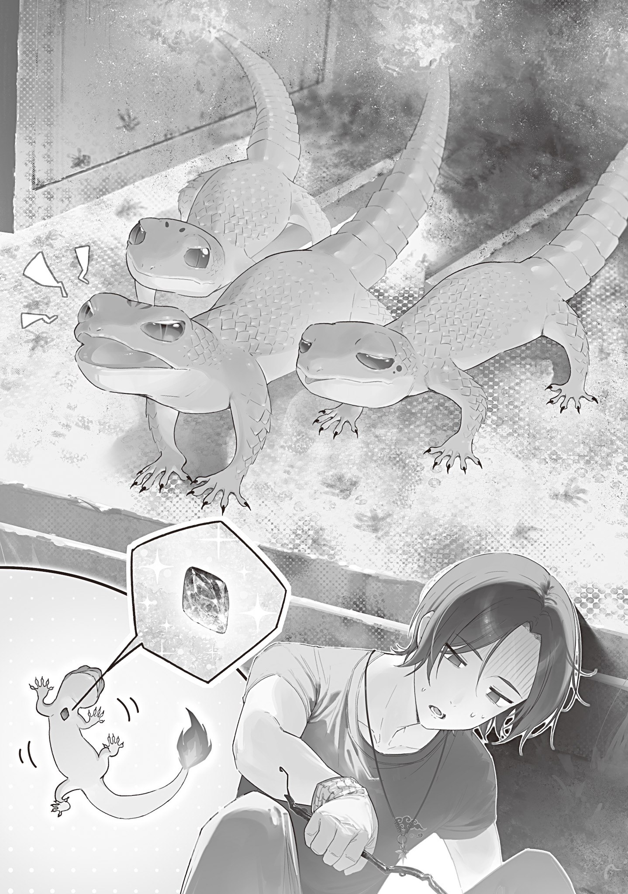

The rice seedlings I had been raising in the barn had grown taller, and late spring was just around the corner.

Every day, I checked the thermometer and predicted how the temperature would rise. That day, I decided, was the best time all year to plant rice.

Weather forecasts would have let us plan our farm work around them, but the Hachioji Witch leading the effort to restore forecasting had died in the pandemic, leaving the project in limbo.

No one had decided yet whether another witch would take over or whether to hand the whole project to civilians. Some people wanted Magic University to do it, but Professor Ohinata pushed for reviving educational and research institutions outside Magic University instead.

Something was wrong with having only one proper academic institution. The broader the base for education and research, the better.

Unless we at least restarted elementary education, it wouldn't be long before we were overrun with adults who couldn't even read, write, add, or subtract.

More than four years had passed since the Gremlin Disaster, and compulsory education was still suspended. Families had to teach their own children, with only a few volunteer teachers holding open-air classes.

Schools were supposed to reopen that summer, but the mushroom pandemic had killed the plan.

The mushroom pandemic had dragged down a recovery that had been going so well. It had left deep scars.

Still, none of that was something I could do anything about.

I just had to do what I could: make magic wands and get on with my daily hunting and farming.

A pleasant spring breeze made it perfect weather for work. The Blue Witch had shown an interest, so we planted rice together. At first, she rolled up the hem of her black coat and stepped gingerly into the mud, but she soon got used to it and planted faster than I did.

Witches really are built different. Her rows are a little sloppy, but I'll chalk that up to the difference in dexterity.

We finished planting before noon, then sat together on a mat spread over the ridge between paddies and ate rice balls.

Still chewing a salted rice ball, the Blue Witch held a hand beneath the kettle and said an incantation.

“Mmph... <ruby>Jin Ga<rt>Flame</rt></ruby>.”

Fire flared up, and the kettle soon poured out white steam with a shrill whistle.

The Blue Witch poured boiling water over the tea bag in my cup, and I felt a little wistful.

The Flame Witch, who had popularized this useful spell, was sealed away now. She'd been a good person.

...Had she, though?

...Yeah, she had. Even if she was a top-tier closet pervert.

Thinking about the Flame Witch's perverted lifestyle reminded me that I still hadn't cleaned up the abandoned house where they'd had unwitting yuri arson sex before she was sealed. I'd gotten so wrapped up in secret sauce, self-blood tanning, and magic tools that I had completely forgotten.

The burned-out site was now a pile of ash and charcoal. Left alone, it could easily start another fire.

A stray shard of glass might happen to act as a lens and focus enough sunlight to ignite the charcoal. It was entirely possible.

I'll spend this afternoon cleaning up the burned-out site.

I made a little boat from the bamboo leaf that had wrapped my rice ball, floated it in the rice paddy, and stood up.

“Thanks for the food. What are you doing this afternoon?”

“Hmm. What's your plan, Ori?”

“I'm cleaning up the burned-out site. You know, the abandoned house where you and the Flame Witch... um... did that.”

“Do you really need to stumble over it? Well, I've got nothing planned today. I'll help for a bit, then head home.”

“That'd help. All right, let's go. Leave the kettle there. We'll pick it up on the way back.”

The two of us wandered over to the arson site.

Okutama had been left mostly untouched for four years. Surprisingly, though, nature hadn't encroached all that much. It depended on the area.

Houses near the mountains had vines crawling up their walls, lay half-buried by landslides, or had become dens for wild animals and reeked of piss and shit. Around the town office, though, the houses stood closer together and concrete roads surrounded them, so they'd held up better.

Even there, weeds poked through cracks in the concrete and plenty of windows were broken. Small birds (or little bird monsters?) had even built nests on dead traffic lights, leaving the road below covered in white droppings.

It had only been four years since the Gremlin Disaster, but four whole years all the same.

Things people made would be worn down by the pressure of the wild, disappear, and gradually return to nature.

The site had burned down completely. Charred beams jutted from the piles of ash and charcoal, while the blackened, soot-covered remains of a refrigerator, microwave, washing machine, and other appliances lay scattered around.

I brought two shovels from a barn in a nearby field and tossed one to the Blue Witch.

“Pile the ash and charcoal in one place, then throw some dirt over it. Move the big stuff out of the way.”

“Aren't you going to use the ash as fertilizer?”

“No. There's probably plastic, broken glass, and chemicals mixed in that shouldn't get into the fields.”

“True. Ori, don't fall over and hurt yourself.”

“Aye aye, ma'am.”

We divided up the work and started clearing the site. While I shoveled ash into piles, the Blue Witch stomped the wrecked appliances flat, rolled them up, and stacked them. Seriously, too much power. She was a human bulldozer.

After a while, my cheeks were filthy with ash. Then the Blue Witch gave a startled shout, and I stopped shoveling.

“What? What happened?”

“There was a monster. Ori, don't come over here. I'll deal with it now.”

“A monster? ...Ah, wait, wait, wait, hold on a second! Don't kill it!”

It suddenly clicked. I threw down my shovel and rushed to stop the Blue Witch.

I'd considered this possibility before.

Witches were monster women with the powers of monsters. They had mutated from humans, but by nature they were closer to monsters.

Pandemic mushrooms and the Flower Witch reproduced asexually. So it was not impossible that two women—two witches, creatures close to monsters—could really have a child through unwitting yuri arson sex.

Viewed as monsters, though, the two of them would be completely different species (fire and ice, for one thing), so I'd figured the odds were basically zero.

But if there's a monster in these ruins, it's probably your biological kid you don't even know about, Blue Witch! You can't kill your own kid!

When I rushed in to stop her, the Blue Witch scolded me.

“Hey, I told you not to come over here. It's dangerous.”

“No, I got curious. Where is it? Which one?”

The Blue Witch sighed, held a hand out to keep me from stepping too far forward, and pointed inside an overturned refrigerator with its door hanging wide open.

There were three monsters inside.

They were tiny lizards about the size of an index finger. Huddled together in a nest they'd made inside the refrigerator, they squeaked at us incessantly, trying to scare us off.

Their scales were a vivid red like flames, and a tiny fire burned at the tip of each tail.

Fire salamanders.

U-Uh. Is this what a humanoid fire fairy's children look like?

Maybe they've got nothing to do with the Flame Witch. Maybe they're just lizards that happened to mutate into monsters and build a nest here. I should check a little more.

I picked up a scorched metal rod and used its tip to prod one of the fire salamanders onto its back.

A blue Gremlin, almost the exact shade of the Blue Witch's personal color, clung to its chest.

Oh... Yep, definitely their love children.

No idea how it works. Did crossbreeding two species somehow turn them into lizards? Their coloring takes after Mom, but their Gremlins take after Mom (?).

The salamander I'd flipped onto its back thrashed wildly. The other two saw that, got mad, and breathed fire at the metal rod.

The Blue Witch grabbed me by the collar and yanked me back.

“Idiot, I told you! Did you get burned? <ruby>Do<rt>Freeze</rt></ruby>────”

“Whoa, wait, wait, wait...!”

The Blue Witch was trying to kill the fire salamanders again. I grabbed her from behind and covered her mouth to stop the incantation.

The Blue Witch mumbled against my hand, then relaxed and gave it a light tap.

When I let go, she heaved a deep sigh.

“Do you like this monster that much? It's a monster. Better to kill it while we can.”

“No... um, it's not that I like them, exactly... I just think we should maybe not kill them.”

“Why?”

“Why...?”

I had no answer.

See, those monsters are the children the Flame Witch had with you after taking advantage of your ignorance.

Like I could say that.

Flame Witch, you can't go leaving a bomb like this behind before getting sealed!

Idiot! You're really an idiot! Pervert!

Well, before she was sealed, she probably just unleashed her dirty urge to fool around with the older woman she admired. She couldn't have expected actual children, right?

And now I'm the one in trouble because of it!

“Th-They're cute, and they don't look dangerous. Can't we let them go?”

“Huh? What are you talking about? Cute—well, fine, they are cute, but they breathed fire. They're nowhere near harmless.”

“No, it's not that bad... Threat-wise, they're probably at the lower end of Class B or the upper end of Class C.”

I pulled the monster threat-level quick reference (third edition), issued by Tokyo Magic University's Department of Monster Studies, from my back pocket. While the fire salamanders kept squeaking threats at us, I checked their classification.

Class A-1... Cannot be defeated by one witch. Contact the Witches' Council and issue an emergency declaration.

(Giant kaiju)

Class A-2... Even witches struggle. A witch with a good matchup, or a strong witch, is needed.

(Those with multiple Gremlins and the ability to wield multiple kinds of magic)

Class A-3... A witch must be deployed. A witch can defeat it without trouble.

(Those that display intelligent behavior such as using tools, or those larger than a house)

Class B-1... A wizard unit can defeat it if it makes use of a Monster Trap, specialized magic wands, and so on.

(Mixed types of three or more kinds of living things, or those with human features)

Class B-2... A wizard unit can defeat it.

(Those that form groups around a special individual, or those that use long-range magic with killing power)

Class B-3... An elite wizard with combat training can defeat it.

(Mixed types of two kinds of living things, or things that do not originally exist on Earth, such as ghosts and slimes)

Class C-1... A wizard, or an armed person skilled at combat, can defeat it.

(Mutants with clearly recognizable monstrous forms)

Class C-2... Attacks humans when necessary. Ordinary people are advised to flee. It can be defeated if armed.

(Mutants of carnivores such as cats and spiders)

Class C-3... May attack weakened people or young children.

(Mutants of omnivores such as crows and rats)

Class C-4... Runs away when it sees humans. Harmless.

(Mutants of herbivores such as rabbits and deer)

*Exceptions exist! If you're unsure how to judge it or feel something is off, flee immediately and call the security force!*

“...Class C-4! They're scared when they see us. There, harmless.”

“They're in a group of three, and they breathed fire. Class B-2.”

“No, no. Look at this metal rod. They breathed fire on it, but it barely did anything. Just scorched the surface, so their firepower's nothing... Wait, no, it melted a little.”

The rod had been sooty but intact when I'd picked it up. Now the spot they'd hit was slightly melted and warped.

Holy crap, their firepower is insane for something so tiny.

Could you quit handing the executioner evidence when I'm trying to keep you off death row?

“................”

“Don't silently point Cyanos at them. Think of it this way: high firepower is good. Right? Train them properly and they'll solve the fuel problem.”

“Impossible. The Department of Monster Studies has tried to train monsters. Every attempt failed.”

“There's supposedly a community called the Hokkaido Magic Beast Farm, right? That name has to mean they know how to raise them.”

“Fire monsters cause fires. They could cause damage beyond their catalog-spec threat level.”

“Yeah, but... come on.”

After nearly an hour of arguing with the Blue Witch, I somehow won the salamanders a stay of execution.

The fire salamanders had built their nest by gathering and melting metal inside the refrigerator. There was even an iron wok mixed into it, which meant they could produce enough heat to melt iron.

The black charcoal crumbs around their mouths suggested they ate charcoal.

A charcoal fire couldn't easily melt iron. Seen as living converters that turned charcoal into iron-melting heat, these fire salamanders could be both valuable and important.

If I trained them right, I'd be freed from the trouble of making charcoal and buying coal.

After hearing me out, the Blue Witch reluctantly went home on the condition that I stay away from the nest.

We settled on her checking them every day and killing them immediately if they grew aggressive or their diet changed (meaning they turned carnivorous).

Phew, that was close. For now, they're safe.

I deserved a pat on the back for stopping a mother from killing her children without ever revealing why I'd protected them.

Later, I'll send the Flame Heir Witch a sealed letter saying, “If the day comes when the Flame Witch's seal is broken, make her get on her knees, lick the Blue Witch's feet, and beg forgiveness.” That pervert sure makes my life difficult.

But I'd only survived the immediate crisis. The Blue Witch was still itching to kill the fire salamanders, so I needed some safety measures.

Realistically, the fire salamanders might wander into town on one of their little walks and start setting fires everywhere.

This was no joke. One of their parents had an arson habit.

The Blue Witch hadn't noticed, and I hadn't gone out of my way to tell her, but those fire salamanders were newborns. They would keep growing.

If they can do all that at the size of an index finger, what happens when they get bigger?

Stumped, I pulled fantasy encyclopedias and manga from bookshelves all over the house and searched for any clue to raising them. I'd send the Department of Monster Studies a letter through Professor Ohinata later, but it couldn't hurt to do my own research first.

The Blue Witch had also said she'd found a clue to how mushroom disease worked in a mushroom encyclopedia, so this kind of research was nothing to sneeze at.

I stayed up all night poring over the materials (if you could call them that). I found no clue to raising the salamanders, but I did come up with a theory about why they'd been born from a humanoid fire fairy.

Maybe the Flame Witch's species underwent complete metamorphosis.

By metamorphosis, I meant the insect kind, not sexual perversion.

Fairies in fantasy were often compared to insects.

Fairies flitting over flower fields looked like butterflies, and some stories had them transform just as butterflies changed from caterpillars to pupae, then from pupae into adults.

Of the twelve manga that featured fairies, four had depictions like that, and a fantasy encyclopedia also had it in a column.

A life cycle in which a larva changed completely on its way to adulthood through a pupal stage was called complete metamorphosis.

The Flame Witch had been dying of old age, so she had of course been an adult.

The fire salamanders newly born from her were, of course, juveniles.

If the Flame Witch's species underwent complete metamorphosis, that would explain why parent and children looked nothing alike.

At some point as they grew, the fire salamanders would surely enter a pupa-like form, then emerge as humanoid fire fairies.

Of course, this was all speculation based on dubious materials. They might simply look so weird because the Flame Witch had conceived them with the Blue Witch, a different species, causing some kind of hybrid bug.

Still, it was pretty funny to think that the pervert who'd done something as outrageous as have unwitting arson sex with the Blue Witch might also undergo complete metamorphosis. Yep. A pervert either way.

My research kept me up until morning, so I headed back to the arson site through the mist.

The Blue Witch had told me not to go near them, but I was worried about them.

The three fire salamanders were bursting with energy, scurrying around the burned-out site, tumbling through the ash together, and stuffing their little mouths with charcoal.

They froze like statues when they noticed me watching from a distance. Once they saw I wasn't going to do anything, they slowly began to move and soon went right back to scurrying around.

Cute. I want to keep them.

Setting aside the fact that they were the Flame Witch's and Blue Witch's children, they really were useful.

I'd love to have them living in my reverberatory furnace and keeping it hot. I'll feed them all the charcoal they want. That iron-melting heat is just too tempting.

Best of all, a workshop furnace with fire monsters living in it is insanely cool. Every part of me is giving the idea a standing ovation. Serious legendary-workshop vibes.

But it was all pie in the sky.

Monsters did not grow attached to people. Keeping them was impossible.

Given the fire risk, it really would be better to dispose of them, just as the Blue Witch had said.

But they were the Flame Witch's and Blue Witch's children. Disposing of them would be too cruel.

And they were cute and useful... Ignoring the danger that they might someday emerge in humanoid form, they were perfect pets.

I wanted to keep these three fire salamanders, but I couldn't keep them.

So what should I do?
