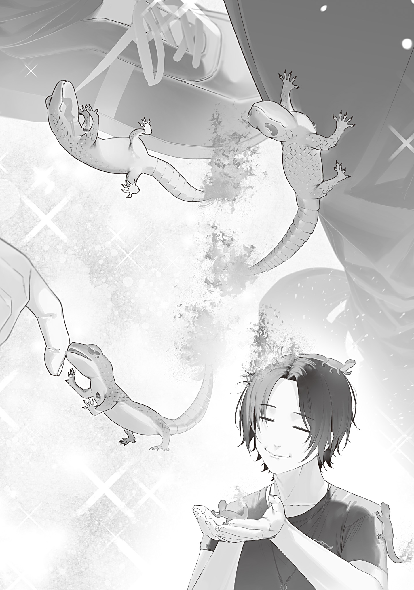

It came a little too late to call it perfect timing.

Still, the Hokkaido Magic Beast Farm's disaster-recovery aid arrived two months after the Tohoku Hunting Association's, and it looked like a critical solution to the fire salamander problem left behind by the arson-sex culprit.

The circumstances were a little complicated.

Apparently, Hokkaido's large survivor community, the Hokkaido Magic Beast Farm, had wanted to help Tokyo ever since the mushroom pandemic beat it to hell.

But it wasn't that simple.

For about three years, the Hokkaido Magic Beast Farm had been dealing with a sea monster that ruled the coast like it owned the place: the Kraken.

The Kraken had made Hokkaido seafood insanely hard to get. It sank every ship, destroyed the aquaculture farms, and made it impossible to safely build houses along the coast.

The Kraken was a powerful monster that looked like a giant squid and octopus fused together—a Class A-2 according to the Department of Monster Studies. Worse, it was exceptionally good at escaping. Whenever it was injured or sensed danger, it fled straight to the seafloor, foiling one joint witch-and-mage hunting operation after another.

The Tokyo Witches' Council might have been suffering from the mushroom pandemic's aftermath, but the Hokkaido Magic Beast Farm was in the same boat. One witch in an important position had died in the pandemic. If anyone wanted aid, it was the Magic Beast Farm.

That was why reconstruction aid for Tokyo came with the condition that Tokyo hunt the Kraken.

The Hokkaido Magic Beast Farm couldn't afford to support the Witches' Council unless Tokyo killed the Kraken in return. Having to give aid to receive aid was a strange arrangement, but it couldn't be helped. Everyone had problems of their own.

So the Tokyo Witches' Council chose the Mermaid Witch.

The Mermaid Witch had lost much of her intelligence and couldn't speak human language, but she was unmatched underwater. Once she chose her prey, she could chase it into the deepest reaches of the ocean and kill it. No one was better suited to hunt the Kraken.

The problem was her dolphin-level intelligence.

She was plenty smart for an animal, but it was hard to tell her that we wanted her to go kill Hokkaido's Kraken.

Once, she listened intently to our request, smiled and nodded, and made us think she'd understood—only to return with a Kraken-like giant squid and proudly toss it onto the pier.

But the other day, we finally managed to get through to the Mermaid Witch. She smiled and nodded, then disappeared from Tokyo Bay for a full day.

She returned as if nothing had happened. Several days later, an envoy from the Hokkaido Magic Beast Farm arrived by sea aboard a sailing ship, bearing a letter of thanks for hunting the Kraken and the aid supplies agreed upon beforehand.

The documents listed every item in the shipment, and once I saw the contents, I understood why it wasn't something they could give away lightly.

The aid was domesticated monsters.

In other words, what the Hokkaido Magic Beast Farm called magic beasts.

There were three kinds of magic beasts, sixty in all. They had put together enough young pairs for long-term breeding.

The documents also explained how to raise them in detail, and the shipment included the required tools and feed, though only the bare minimum.

Basically, it was a Tokyo magic-beast livestock starter kit.

The Hokkaido Magic Beast Farm didn't have vast herds of magic beasts, either. They were still working to breed more of them, so sending sixty to Tokyo was a serious sacrifice.

But considering what they owed for fertility magic and the Kraken hunt, they decided the gift was warranted.

The Witches' Council was currently assigning the sixty magic beasts to different stables and pastures. The documents were all I had—the magic beasts themselves were entirely under the Witches' Council's control.

I was interested in Hokkaido's magic beasts, but I already had my hands full with the fire salamander problem. What mattered more was that the Farm's monster-taming know-how had landed right in my lap.

Could I use the monster-domestication techniques developed in the far north to tame the fire salamanders that refused to warm to me and only breathed fire and meeped at me threateningly? I had pretty high hopes.

After studying the invaluable documents, I learned that monster husbandry began with finding a species that met the conditions for monster domestication.

First came feed. Monsters that ate too much or needed hard-to-find food weren't suited to monster domestication.

Second came growth rate. Monsters that took twenty or thirty years to mature enough to provide meat or fur weren't suited to monster domestication.

Third came reproductive capacity. Monsters that needed vast territories to breed or engaged in abnormal reproductive behavior—arson, for instance—were hard to manage and unsuited to monster domestication.

Fourth came temperament. Man-eating or aggressive monsters obviously weren't suited to monster domestication.

The fifth and final condition was that the monsters form a group with a hierarchy. A human handler could only raise them by becoming the group's leader and making them follow instructions. Conversely, species that formed leaderless groups weren't suited to monster domestication.

Everything in the documents made sense, and it gave me some useful pointers for raising the fire salamanders.

The first condition, feed, was no problem. They ate small amounts of charcoal, so I wouldn't have trouble feeding them.

Their growth rate, the second condition, was unknown, but I didn't need them to grow quickly. Considering the risk that they might emerge as humanoids, slower was better.

As for the third condition, reproductive capacity, they actually went against the basic rule of raising livestock. Don't multiply, you guys.

Their temperament, the fourth condition, wasn't especially gentle, but it wasn't aggressive either. They got angry if one of their own was bullied and stayed wary of creatures bigger than themselves. Pretty normal behavior for a living thing.

As for the last condition, hierarchy, they seemed to have one, at least. Of the three fire salamanders, the slightly bigger, better-developed one often took the lead and scurried around ahead of the other two.

My overall verdict: “Problematic for monster domestication, but probably manageable as pets.”

Once a monster met all five conditions, the documents moved on to the next step in monster domestication.

The caretaker captured several monsters of the same kind, extracted the Gremlin from one of them, and implanted it in their own body.

Once the implanted Gremlin settled into the body, monsters with the same Gremlin began to recognize the caretaker as their own kind.

A caretaker who had a Gremlin implanted and blended into a group of monsters this way was called a beast handler.

It was a bit of a gross modification surgery, but the benefits were huge.

Unless the species fought over territory or regularly hurt its own kind, the monsters would almost never attack the handler.

With the right treatment, the handler could become the group's leader and make the monsters obey. That marked successful monster domestication, and a monster brought under control this way was called a magic beast.

But this modification surgery wasn't easy.

Implanting a Gremlin in a human body carried risks.

First came allergic reactions.

Some people developed symptoms resembling a magical allergy after a Gremlin was implanted in their body.

Their magic power might stop recovering, their magic might run out of control every time, or it might fail to activate even when they recited an incantation.

Sometimes the body simply rejected the foreign object, leaving the skin around the implantation site raw, throbbing, or festering.

People prone to these allergic reactions weren't suited to being beast handlers.

Thankfully, there was an established way to test for an allergy in advance.

The Gremlin was submerged for about 12 hours in blood drawn from the person who would receive it.

If the person was allergic, a coagulation reaction caused components in the blood to clot and precipitate. If nothing precipitated, there was no allergy.

Judging from the allergy-test diagram, components in the blood seemed to form a very obvious, clearly visible clot and precipitate. There was no way to mistake it.

But even after clearing the allergy problem, implanting a Gremlin came with a cost.

Permanent loss of magic-power capacity.

The implanted Gremlin took about a week to settle into the body. During that time, you ran a slight fever and gradually lost magic-power capacity.

The magic-power capacity lost then did not return even if you dug out the Gremlin after it had settled into your body.

The capacity you lost was equal to that of the monster the Gremlin came from.

That was why almost no one but a witch or mage could implant a Gremlin from a monster with immense magic power.

I wondered if an ordinary person could implant the Gremlin of a powerful monster by giving up all their magic power, then command something far stronger than themselves. No such luck.

Permanent loss of magic-power capacity brought irreversible death.

If Gremlin implantation stripped you of all your magic power and left your magic-power capacity at zero, you turned to dust and dissolved into nothingness.

There wasn't even a body left. You simply vanished from the world.

It was irreversible death.

Professor Ohinata had added a footnote in her own handwriting: “Magical death?”

I had heard about it before.

In magic, there was such a thing as magical death in addition to brain death and cardiac arrest.

Professor Ohinata understood magical death as losing one's magic power and never being able to use magic again. That wasn't wrong, but it wasn't precise either. Of course someone who turned to dust and vanished from the world could never use magic again.

The possibility that someone who hadn't turned to dust might still be revived gave me a glimpse of magic's incredible potential. But no one had confirmed that resurrection magic even existed, so for now, brain death, cardiac arrest, and magical death were all the same. Dead was dead. Scary stuff.

You could implant a Gremlin anywhere, but normally it was implanted somewhere from the back of the hand to the upper arm. An implanted Gremlin also functioned as a magic-activation medium, so it was better to implant it in an easy-to-use body part.

Even after taking on those risks and going through all that trouble, you had to keep firmly in mind that implanting the Gremlin only put you at the starting line of monster domestication—magic-beastification.

Implanting a Gremlin made monsters recognize you as one of their own.

But that was all.

Think about it in human terms. Would you feel any affection for a person you passed on the street? Would you want to obey a complete stranger? Would you trust them with your safety and your life?

Of course not.

After implanting the Gremlin, you still needed the effort and know-how to build either a close relationship or a hierarchy with the target monsters.

More than half the stack documented the Hokkaido Magic Beast Farm's know-how for raising the three kinds it had sent to Tokyo. That covered how to establish a hierarchy, train them, set up their stables, and provide their preferred feed, temperature, humidity, and ventilation, all in painstaking detail.

How much trouble had gone into gathering that much information?

Even allowing for what they owed Tokyo for fertility magic and the Kraken hunt, I was amazed they'd agreed to share the fruits of all that work.

Because surely dozens—no, hundreds—of people had died before those documents were completed.

How many people had turned to dust before they understood the principle of magical death?

How many people had suffered from allergies?

How many people had been killed by monsters because taming had failed?

The thought made the stack of documents feel heavy in my hands.

This stack of paper was made of lives. I appreciated it. And it terrified me.

Is it really okay for a mere genius Wand Maker like me, who just makes wands for fun out in the sticks, to shamelessly reap the benefits? I did feel a little guilty, but then a sticky note in Professor Ohinata's handwriting at the end of the documents reassured me: “It was possible to use implanted Gremlin substitutes made with the melt-recast Gremlin coloring technique.”

It couldn't have been even three days since the documents arrived from the Hokkaido Magic Beast Farm, yet Professor Ohinata had already completed an applied study at breakneck speed.

Sure enough, it seemed you didn't need to gouge a Gremlin out of a monster; you could draw its blood and make a personal-color Gremlin instead. And apparently, the substitute had actually worked.

If my technique could advance the Hokkaido Magic Beast Farm's work even further, I had no reason to feel guilty.

They probably thought they were sharing their technology, only to get some right back. Must've knocked them flat.

Tokyo was amazing.

After all, we'd overcome trials just as hard as—or even harder than—those of Hokkaido, the so-called land of trials. Gahaha!

Anyway.

The Hokkaido Magic Beast Farm's documents were excellent from beginning to end.

Best of all, they had arrived at exactly the right time, just as I was struggling with how to handle the fire salamanders.

Judging from the sticky notes scattered through the stack, my magic-power capacity could withstand implantation of a Gremlin from a mid-level Class B-1 monster. That was pretty exceptional for a human. Since Class A-3 and above were effectively reserved for witches and mages, I couldn't ask for more.

The fire salamanders were Class B-2, and they were still newly born juveniles. Even with a generous margin of error, they were probably around the lower end of Class B-1. Implanting one of their Gremlins wouldn't turn me to dust.

In other words, I was qualified to raise fire salamanders!

I didn't know whether monsters gained magic-power capacity as they grew, but they probably didn't lose any. The sooner I drew their blood, made a fire salamander personal-color Gremlin, and implanted it, the better.

Strike while the iron was hot.

I waited until night, then went straight to the fire salamanders' nest.

Under the soft moonlight, the three fire salamanders slept soundly, curled up together in the middle of the metal nest inside the refrigerator. Well, look at that. They're even blowing little sleep bubbles from their noses.

Cute. If only I could've taken a picture...

But I hadn't brought a camera. I'd brought a syringe.

I wanted to draw their blood painlessly, but I didn't know how a fire salamander's body was put together. This might hurt a little, but they'd have to put up with it.

I crept toward the nest without a sound and gently slid the needle between the scales.

“Mii!?”

The fire salamander leaped into the air in surprise at the sudden needle prick.

I quickly drew a tiny amount of blood and ran off as fast as I could before the groggy, confused fire salamander figured out what had happened.

Sooorry! But if I try to draw your blood in broad daylight, you guys will definitely breathe fire, right? An ambush was my only option. Forgive me.

I returned home, checking over my shoulder again and again to make sure the fire salamanders weren't chasing me. Then I started up the reverberatory furnace and made a personal-color Gremlin mixed with fire salamander blood.

The finished Gremlin was oval, about the size of a thumbnail, and the same blue as the fire salamanders—a color very close to the Blue Witch's personal color.

All I had to do was implant it somewhere in my body and let it settle for a week. Then the fire salamanders would see me as one of their kind, giving me a shot at raising them.

If I trained them well and housed them in the furnace or kiln, I'd have a legendary magic workshop where I forged magic items with the fire of magical life-forms. So cool!

If I could prove that I could train and raise them properly, surely even the Blue Witch wouldn't try to kill them.

Everything would work out nicely.

But...

In one corner of the workshop, I had everything ready to implant the Gremlin myself. I'd finished the allergy test too, but when it came time to cut into myself, I hesitated. I just couldn't make up my mind.

I mean, if I implant this, my magic-power capacity will go down.

And not just a little, either. It's expected to take a huge chunk.

This isn't like a Gremlin from a rabbit or tanuki mutant. This is a Class B-2 Gremlin, made from the blood of a super-hybrid born to two witches—if you ignore the circumstances of their birth.

Is it really safe to implant this Gremlin...? I'm starting to think those little guys are more than just Class B-2.

What if my magic-power capacity drops to zero the moment I implant it and I turn to dust?

Even if I don't turn to dust, my magic power will plummet, and I'll get much weaker as a wizard.

I'm a Wand Maker. I have no pride in myself as a wizard.

But I don't want to get weaker. I mean, a path as a beast handler would open up instead... but... hmm...

I chickened out at the last moment. After stewing over it for a while, I put the operation on hold and wrote a letter to the Flame Heir Witch.

Under the pretext that “there might be a problem with the sealing mechanism,” I asked her to send in Himori Wand, which held the sealed Flame Witch, for maintenance.

The Flame Witch was the one who should bear the most responsibility for the fire salamanders' birth. It was bad to wake her so soon after sealing her, but making her take responsibility was the cleanest solution.

Besides, since the Flame Witch was supposedly both their own kind (?) and their mom, she could probably train them without implanting a Gremlin in herself.

But the reply that came back from the Flame Heir Witch the very next day said, “I'm worried about my big sister, so I'll accompany her for maintenance.”

O-Of course! That's what would happen...!

I wanted to refuse.

I wanted to tell the Flame Heir Witch not to come and just send me the Flame Witch's wand.

But she'd never agree to that.

If a dying family member was in cold sleep and the developer of the device suddenly said, “The machine might be bugged,” of course you'd worry yourself sick.

I couldn't refuse her request to come along. That would look way too suspicious.

More to the point, the Blue Witch, who had delivered the letter, was already a little suspicious, saying, “It's rare for Ori to make this kind of mistake.” I screwed up.

I was tempted to just tell the Blue Witch and the Flame Heir Witch everything, temporarily break the Flame Witch's seal, and dump the fire salamander problem on the three people involved.

But I could never say, “They're the biological children you two had through unwitting arson sex. Acknowledge them,” or, “Your sister gave in to her sex drive, tricked the Blue Witch, and made these children.” It was scary to even imagine the nightmare that would follow.

Even if I tried to watch that nightmare from the sidelines, I'd gotten too close to the Blue Witch. There was no staying out of it now.

I sent another letter to the Flame Heir Witch saying, “It was a misunderstanding. There is no need for maintenance,” then steeled myself and implanted the Gremlin in the back of my left hand.

For one week, I ran a slight fever like I had a mild cold and stayed quietly in bed to rest.

The Blue Witch tried to nurse me, but even though I was supposed to rest, she kept talking to me, wandering around the room, or sitting beside me and making her presence felt. My fever made it even more irritating. I just kicked her out.

I know people with normal sensibilities want someone to nurse them. When a friend gets sick, you worry and take care of them.

But I don't want anyone nursing me. I'm socially awkward, okay.

After one week, just as the documents said, my slight fever went away.

Now the fire salamanders should recognize me as one of their kind.

I didn't feel all that different. The Gremlin embedded in the back of my hand felt like a big scab, and the spot itched a little.

Then, for the first time in a week, I went to see the fire salamanders.

The three fire salamanders were scurrying around the burned-out site just as they had one week ago. When they saw me, they stopped dead.

But unlike before, they wagged their fire-tipped tails hard, ran over to me, and swarmed around my feet.

“O-ohhh...?”

“Mii.”

“Mi!”

“Mimimi!”

The fire salamanders tugged at my shoelaces with their teeth and tried their hardest to climb my pants with their little legs. It was hard to believe they'd once scattered sparks from their mouths to threaten me.

Th-they like me!

They warmed up to me so easily!

Amazing. So much for the accepted wisdom that monsters never warm up to humans.

I crouched down and poked their red scales with a finger. They went meep-meep and licked the finger that had poked them.

Even when I nervously cupped one in my palm and lifted it up, it didn't get angry at all. But its body was so hot I felt like I'd burn myself, so I put it down right away.

Now that the fire salamanders saw me as one of their own, even being picked up seemed fun rather than scary. The other two tried to climb onto my hand too, like they wanted a turn.

Wow. Once they see you as one of their own, they're ridiculously friendly. Cute little guys.

There, there. This big brother of yours will take you to a new home and a new room.

From today on, you are members of the Ori family. Don't think of the Flame Witch as your parent. I won't hand you over to the Blue Witch either.

I'll take care of your food and home, so become the masters of my furnace and kiln and help me with my work.

