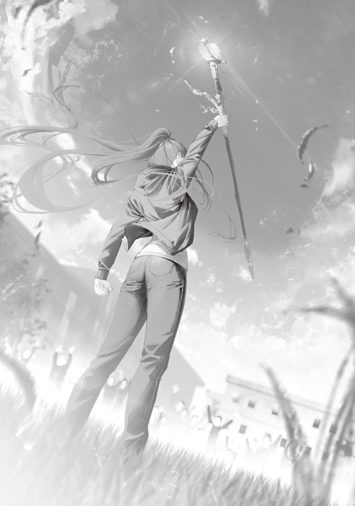

The bat-faced mage stayed glued to Ohinata's side on constant alert, and he was sensitive to magic power, so the Blue Witch could not get near him. Even if she backed off and tried to snipe him with magic, he would probably sense her magic power moving and dodge. He was that sharp.

But Handa Sakunosuke's dynamite suicide bombing had nothing at all to do with magic power. It was purely physical.

So the explosion that blew out the room's wall took the bat-faced mage completely by surprise and badly distracted him.

The Blue Witch had shed her disguise and was hiding behind the big clock on the university's central tower. Seizing this once-in-a-lifetime chance, she moved fast.

She trained Cyanos on the bat-faced mage. He had finally let his guard down, but he was far too close to Ohinata. What if, by the slimmest chance, she caught Ohinata too?

A third party swept that hesitation away.

Something small, almost impossible to see or sense, flew in through the hole the explosion had opened in the wall, slammed into the bat-faced mage, and sent him flying.

The Blue Witch clenched her fist without thinking.

She had not been the only one lying in wait and watching for a chance.

The bat-faced mage plowed into a heap of stacked projectors and printers, and the Blue Witch cast her lethal spell at him, letting loose the cold killing intent she had held in check.

“<ruby>Do ××× Vaa-raa zu Aaraa kunnei shiseruu<rt>That spear was made of ice, snow, and sorrow</rt></ruby>”

Magic power packed the very cold it had created into a pure-white trident. The lethal spear took shape out of nothing in an instant and shot straight down, so fast that it left an afterimage and outran its own sound.

An instant after it launched, it had already punched through four floors and skewered the bat-faced mage straight from head to crotch. Pinned to the ground, the mage naturally died on the spot.

All at once, the university was in an uproar.

That first shot had given away her position. Until she finished off the user of the magic-rampage spell, she could not use Cyanos for the time being.

Before anything else, the Blue Witch started to go save Ohinata, but then she noticed the small figure dragging Ohinata down the hallway at a good clip, pulling her away from the worst of the fighting.

Gratitude flooded up from the bottom of her heart. It was such wonderful work that she could have kissed whoever it was. Once she had wiped out the enemy, she definitely wanted to thank them.

But cleaning up came first.

She took quick stock of the whole situation. The Arataki Group's gang boss had caught the dynamite blast at close range, but he was not dead yet; in the smoke at the center of the blast, a shadow was trying to stand up.

“<ruby>Do Vaa-ra<rt>Freezing Javelin</rt></ruby>”

The Blue Witch tucked Cyanos into her belt and rapid-fired suppression magic barehanded to slam the gang boss back to the ground, and in the same motion she sprang out from behind the big clock in a great leap into the sky. Unleashed at last, the Tokyo Witches' Council's strongest trump card soared through the air.

She was headed for the campus store on the first floor of the south building, where the user of the magic-rampage spell and her two guard witches were.

“!? Nee-san, get back! <ruby>Nautetsuddo<rt>We are a fortress</rt></ruby>!”

With moves that flashy, of course they spotted her.

The red-haired guard witch cast her spell, and a shining, sturdy, translucent barrier sprang up in midair, blocking the Blue Witch's path.

The incantation and the look of the thing gave the Blue Witch a fair guess at how this unknown magic worked. She twisted in midair, kicked off the barrier, and dropped straight to the ground.

“<ruby>××××× De-nitsu<rt>Boil, my blood</rt></ruby>”

She used the crouch of her landing like a spring, and from that low, beastlike stance she exploded forward faster than a bullet and kicked her way through the barrier by sheer force.

Breaking the barrier was not the end of it. Without losing any of the momentum from breaking through, she sped up even more, bowled the red-haired witch over, and straddled her.

The fight shifted dizzyingly with every blink, and the enemy was left completely on the back foot.

The witch beneath her, face desperate, tried to cast something. The ruler of the battlefield jammed the muzzle of her sidearm into that mouth and pulled the trigger, and at the same time fired barehanded magic at the back of the magic-rampage witch, who was trying to flee in a panic.

“<ruby>Do ××× Vaa-raa zu Aaraa kunnei shiseruu<rt>That spear was made of ice, snow, and sorrow</rt></ruby>”

One more blink, and the magic-rampage witch had been run through the heart from behind, turned into a grotesque sculpture of death hoisted up from the earth.

She had been fragile for a witch, as might be expected of someone who went to the trouble of keeping guards. So the Blue Witch decided to spend the magic power she had worked up for a second shot on the guard instead, who was coughing up blood and barely conscious.

“<ruby>Do ××× Vaa-raa zu Aaraa kunnei shiseruu<rt>That spear was made of ice, snow, and sorrow</rt></ruby>”

With five bullets fired point-blank into her mouth, the guard could not speak. A white trident crushed her head, and she died.

In a mere ten-odd seconds, three witches and mages had died.

Two were left at the university.

The Blue Witch took Cyanos in hand once more and let her cold killing intent and magic power seethe.

Enormous magic power poured out with the Blue Witch at its center, and waves of white frost spread across the university.

The dark-red pools of blood soaking into the ground, the bodies left where they had fallen—everything was wrapped in white as winter swallowed spring and ruled in its place.

The Ice Queen reigned.

The Arataki Group underlings who had been milling around the campus in gangs panicked at the sight of the terrifying witch, each trying to be the first to run.

But as they bunched up to flee, several of them were blasted into the air at once.

The shaved-headed mage they had called the Young Boss split the wall of underlings, who stood frozen in fear, and swaggered out with his shoulders squared.

Was that supposed to be a magic wand? He pointed a shabby weapon—nothing but a magic stone stuck to a wooden stick—at the Blue Witch and shouted, his face the very image of a demon's.

“You bitch! Don't think you'll get out of here alive! <ruby>Puurapugiya ga booroo<rt>Come from the great hole in the earth</rt></ruby>—”

“<ruby>Do Vaa-ra<rt>Freezing Javelin</rt></ruby>”

The Young Boss had been foolish enough to show himself and mouth off, and the Blue Witch cut his incantation short with a precisely aimed rapid shot.

Ice-spear magic was an extremely handy spell, well rounded at a high level in everything from its short incantation to its power, efficiency, range, and speed.

With the Blue Witch's superb magic-power control behind it, every one of those qualities rose even higher, accuracy included.

The Young Boss tried to dodge the ice spear but could not get fully clear. It struck his cheek, and his incantation broke off.

Wearing a look of disbelief, the Young Boss cast a short spell this time.

“<ruby>××× Puuraputsuta<rt>How dare you step on me</rt></ruby>!”

“<ruby>Do Vaa-ra<rt>Freezing Javelin</rt></ruby>”

The Blue Witch cast a short spell of her own right on top of his.

A bed of spikes thrust up out of the ground to impale anyone standing on it, but the Blue Witch's ice spear appeared at her own feet.

She stepped on the ice spear as it launched and used it as a catapult, hitting top speed in an instant and appearing right in front of the Young Boss. The spikes stabbed uselessly into empty air.

Short incantations tended to be weak, not strong enough to deal a Transcendent a fatal wound.

She had no intention whatsoever of trading suppression fire at long range.

The Blue Witch always crushed lives by the shortest, fastest route.

She grabbed the Young Boss's face in one hand, slammed him into the ground, and cast her spell without a shred of mercy.

“<ruby>Do ××× Vaa-raa zu Aaraa kunnei shiseruu<rt>That spear was made of ice, snow, and sorrow</rt></ruby>”

Boosted by Cyanos, the spell produced yet another skewered corpse.

After witnessing that one-sided slaughter, the underlings lost all will to fight.

Some wet themselves. Others groveled on the ground and began begging for their lives, weeping in terror.

The small fry could be dealt with later.

The Blue Witch walked toward the last remaining mage.

After Handa Sakunosuke's suicide bombing, the Blue Witch had fired one suppression shot at the gang boss, who had stubbornly survived. But while ice-spear magic was effective for suppression, it could not deal a fatal blow to a mage.

He could easily have been back on his feet long ago, coming at her with magic or his fists.

Now that she faced him again, she could see just how badly hurt the gang boss was.

The whole front of his body was charred black and swollen red, and his jaw was a mangled mess.

No wonder no magic had come flying in to support his side. With a jaw like that, accurate pronunciation was impossible.

The gang boss showed no sign of fleeing as the Blue Witch approached. If anything, he was dragging his wrecked body toward her one step at a time, on legs that twitched and spasmed erratically.

The Young Boss had been the same way: the Arataki Group's members had plenty of fight in them (at least the witches and mages did). With a proud swagger no one would expect from the commander of a beaten army, the gang boss pointed at the Blue Witch, then at himself, and raised his fists.

Unable to speak, he had only his hands to get his meaning across.

The Blue Witch read his meaning exactly.

He seemed to be saying, Fight me one-on-one. Fists only.

But she had no reason at all to go along with that demand. She walked in until he was within the guaranteed-hit range of her trident magic, then pointed Cyanos at the half-corpse and cast a spell to finish him off.

“<ruby>Do ××× Vaa-raa zu Aaraa kunnei shiseruu<rt>That spear was made of ice, snow, and sorrow</rt></ruby>”

The ice spear shot out too fast for the eye to follow and struck the gang boss.

But instead of running him through, the spear only lodged shallowly in him.

The gang boss staggered badly, but he pulled the spear from his chest, tossed it aside, and came at the Blue Witch again, step by step, with a ghastly intensity.

“…………!?”

The Blue Witch's guard went up, and she knitted her brows.

Something about the hit had felt wrong.

It was not just that he was tough.

It was as though magic did not work properly on him. As though he was resistant to it.

As the Blue Witch studied the approaching gang boss, a strange feeling came over her, and then she understood.

The gang boss was most likely the same kind as her.

The magic he knew was different, but like her, he had no heart and was highly resistant to cold. He was that kind of species.

Even strengthened by Cyanos, freezing magic worked far too poorly on him.

He was only resistant, though, not immune, so she could probably still kill him by brute force.

But the Blue Witch chose another method.

She walked up to the half-corpse—an infuriating, behind-the-times fossil who wanted a one-on-one fistfight as the final curtain on his life—and grabbed both his hands.

The gang boss's burned face split into a savage grin. He bore down hard, trying to overpower the Blue Witch.

It was impressive strength, a match for the Dragon Witch's or even greater. Under that tremendous force, the ground beneath the Blue Witch's planted feet caved in.

But she had not the slightest intention of dutifully playing along.

Still locked with him, the Blue Witch cast a spell.

A spell that demanded physical contact, a long incantation, and a great deal of magic power, and in exchange was unmatched in strength.

“<ruby>××××× De-nitsu<rt>Boil, my blood</rt></ruby>, <ruby>×× Giyuna<rt>my rage</rt></ruby>. <ruby>Hatobato De-nitsu Dawa-tagu Min<rt>Wring every last drop of blood from you</rt></ruby>, <ruby>Rasotefu ×× Ri × Kuwawa<rt>Let it atone to your ancestors</rt></ruby>”

As the blood magic was cast, a hideous red mist clung to the gang boss.

Groaning and spitting blood, he stubbornly tried to resist with magic-power control.

But he had no chance against the Blue Witch.

His feeble resistance tore like paper. Magic power and blood burst from every hole in his body and every wound, and he shriveled up as dry as a dead tree—and died.

Pausing for a breather, the Blue Witch noticed the students and professors watching her tensely from a distance. The crowd still did not seem to grasp that it was over.

That was none of her concern. Ohinata was all that mattered.

With that thought, the Blue Witch started toward the little figure who had laid Ohinata down at the base of the water tower and was hopping up and down to get her attention. But then Associate Professor Nanase's words came back to her.

If she was going to face forward from now on instead of looking to the past, she could not stay close only to Ohinata and Ori.

This time, Magic University had pulled together as one.

Not a single person had turned traitor.

Everyone had given it all they had, in their own way.

They could be trusted.

The Blue Witch stopped, turned around, and raised Cyanos high in answer to the watching crowd.

“Celebrate! Magic University is free! You made this happen!”

A huge cheer erupted at her back, and the Blue Witch hurried eagerly off to Ohinata.

The Arataki Group's key witches and mages, who had struck at the heart of the Tokyo Witches' Council, had been wiped out.

All that remained were a few witches attacking various parts of Tokyo from multiple directions.

But the Dragon Witch would probably mop up those remnants gleefully, for the sake of their magic stones. If she had trouble with them, the Blue Witch could always lend her a hand.

The top of the Arataki Group was dead. There was no one left to hold the organization together.

With the Blue Witch and the others taking back Magic University, the Arataki Group's attack on Tokyo was, in effect, over.

