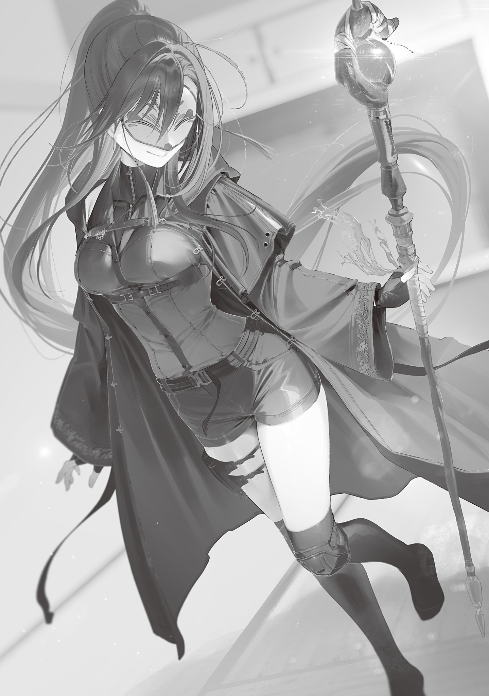

Once you understood the principle, the magnetic field needed for magic-power training was relatively easy to make. It didn't require much machining precision either, so artisans accustomed to extremely difficult Gremlin processing, along with metalworkers (who mainly made the spring-drive components), cranked out magic-power-training coffins at a breakneck pace and set them up all over Tokyo.

Magic-power-training facilities everywhere had long lines day and night, and the data poured in at an incredible rate.

Thanks to that, a lot of new facts came to light.

For example, magic power could apparently be increased without limit. If you ignored the downsides.

Anyone could raise their magic power by around 1–2 K without any trouble. Past that, though, individual differences were huge.

As you trained your magic power, at some point it started to fluctuate. Your ability to control magic dropped, and the magic backlash got stronger.

Even the shooting-magic core spell, “<ruby>-<rt>Fire</rt></ruby>,” supposedly the easiest magic of all, started going out of control. Because of that, lots of people had lost control of “<ruby>-<rt>Fire</rt></ruby>” and broken a hand or an arm.

If you kept increasing your magic power even then, magical illnesses started to set in alongside it and grow more serious.

Halted magic-power recovery, magic-power leakage, magic failing to activate, higher magic-power consumption when using magic, magical hypersensitivity, magic-recognition failure, and so on would develop or become severe.

So you could increase your magic-power capacity without limit, but somewhere along the way the downsides kicked in and got heavier, which meant that realistically, there was a limit.

There were two ways to pin down that magic-power-training limit.

One was to have a witch or mage look at you.

To the eyes of Transcendents, who could control magic power, a person's magic power apparently started fluctuating pretty blatantly as a warning sign that the downsides of magic-power training were about to show up. You just had to stop training at that point.

The other was to use a structural-color Gremlin.

When you measured magic-power capacity with a structural-color Gremlin, its gauge display stopped holding steady and started to waver as you neared your magic-power-training limit. Once the remaining-magic-power display started wavering, you just had to stop training.

Witches and mages could build up their magic power too.

Their gut feeling, from what I heard, was that the better someone was at magic-power control, the higher their training limit probably was.

Humans were probably no different.

Humans couldn't control magic power, but the inference was that people who would have been good at it if they could had high training limits, while people who would have been bad at it even if they could had low ones.

Magic-power training was a world of talent too. Kind of sad.

But the record holder for lowest magic-power capacity, who'd started at 0.2 K, had reportedly already gained 6 K and was still training with no sign of hitting a limit, so there was plenty to dream about.

Even with a low starting value, if you worked hard at training, you might have a shot at reaching around 200 K. How exciting.

Even if your starting magic-power capacity is 1 K, if you keep training for around 150 years, you can surpass the Blue Witch's magic-power capacity of 11,000 K. Let's do our best!!

Now then.

While I picked through the various data being sent my way and learned more, I cleared out the storage room at home and made a magic-power-training meditation room.

It was a small, two-tatami-mat room with magnets embedded around its outer edge. Meditating while spring power rotated the room let you do magic-power training.

When Hiyori came over with a barbecue set for our river trip, I had her try it out, and it worked just as intended. The setup was solid.

After actually building the meditation room, I studied the magnetic lines of force with magnetic-field observation sheets and iron filings and got a better understanding of them. Then I thought, Couldn't I make this into a wand?

The meditation room I built was small for a room but huge for an object. The magic-power-training coffins used in central Tokyo were about the size of a portable toilet too. You could carry one if you had to, but they were way too big.

If I could pack the meditation room's function compactly into a single wand, it'd be super convenient. A meditation wand, anytime, anywhere.

Making the magnetic field needed for magic-power training wasn't that hard once you understood the principle. Rough machining was fine too. It was really forgiving.

With it this forgiving, I could make it smaller. Shrinking precision equipment was hard, but for a device this big to begin with, one that tolerated this much sloppiness, miniaturization was realistic.

The Japanese, you see, are a people who are good at miniaturization. There's even an international joke that goes: the Germans invent it, the Americans turn it into a product, the Japanese make it smaller, the Chinese mass-produce it, and the Jews make money off it.

I ordered a textbook on magnetic properties and read it closely, pored over Department of Mutation Studies papers, and ran experiment after experiment, completely absorbed in working a magnetic-field-change reverse-playback function into a wand.

Since the original was the size of a coffin or a shed, fitting its function into a wand took a lot of miniaturization. The mechanisms were all tangled together, and I had to lay out the magnets like a puzzle.

In principle, you pressed the tip of the wand to your forehead to fix the coordinates, then turned the wand's dial to wind the spring. After that, the mechanism inside the wand slowly rotated on spring power, so if you meditated at the same time, you could do magic-power training anytime, anywhere. That was the idea.

Partway through building the prototype, Hiyori, who'd brought over a beach umbrella for our river trip, cut in with, “Does that need to be a wand?” But that was a stupid question.

There was absolutely no need!

I'm only making it a wand because I'm a Wand Maker. I figure a helmet or something would work too.

Since I was used to how hard Gremlins were to process, the processing itself was easy. If anything, designing the internal mechanisms to mesh properly was the hard part.

But after five prototypes, I somehow pulled it off.

This wand was nothing more than miniaturization, the kind someone would have managed eventually even if I hadn't.

Honestly, I figured even the artisans at the city's wand workshops could make it if they got their most skilled people together. From what I saw when I ordered some commercially available general-purpose wands and took them apart, they seemed to have that level of technology.

But I was the first to make it.

I was the first spear.

No, the first wand...!

The world's first airplane was the Wright brothers' Wright Flyer.

But nobody knows a thing about the second airplane to fly. In anything, what matters is being first.

I named my new anywhere magic-power-training wand the <ruby>Wise Wand<rt>Sage's Wand</rt></ruby>.

The Wise Wand was a wooden wand with a cool burl on the tip, made from a hard, unnamed wood that Fuyo had supplied. A large sapphire was set into the burl as a marker that said, “Please press this part to your forehead to use it.”

It didn't use Gremlins or magic stones. It was strictly for magic-power training. Inside was a mechanical contraption built around magnets, and while I'd made sure it was reasonably sturdy, I hadn't planned on anyone swinging it around in combat at all.

I thought about holding an auction to sell my new Wise Wand, but decided against it. After all, it hadn't even been a year since the new currency was issued.

The only people with serious money were still witches and mages, so I could pretty much guess who'd win it. An auction wouldn't be any fun.

Better to hold one after the monetary economy had caught on and more ordinary people had gotten rich. The more bidders there were, the more exciting an auction got, and the more prestige the wand gained when it sold.

I decided to give the Wise Wand to my best friend.

The day before our river trip, Hiyori brought over a case of Flower Cola (a Taito Ward specialty released after the new currency came out; imitation cola cleverly made from plant ingredients). I gave her the wand wrapped in a piece of cloth I'd thrown in as a bonus, and she looked happy to accept it.

“Thanks. I'm happy. Did you match the gem to my color?”

“Something like that. I used the biggest sapphire I had.”

“I see. Nice. I really like it. I'll meditate with this every day. I'll take good care of it... Hm? What's this cloth?”

Hiyori spread out the deep indigo cloth the wand had been wrapped in and realized it was a brand-new robe.

I explained with a smug grin.

“The materials are the Spider Witch's spider silk, whitewood fiber, and steel sheep wool. It's Gremlin-processed too. It's a robe tailored from top-grade magical fabric that's both high-performance and light. It's heat-resistant and tough. It even resists magic a little. It's stain-resistant, hard to crease, light, and won't fade... Uh, well, basically, it's a custom robe for the great Blue Witch herself.

“Your black coat's been in tatters forever, right? I bet you keep wearing it because it means something to you, but the color's peeling off the back, the shoulders are worn through, and the edges are fraying all over. It's hit its limit. Wear this if you want.”

At my urging, Hiyori held the robe up against herself and checked it in the full-length mirror at the edge of the workshop, then got all fidgety.

Fiddling with the six-petaled snow-crystal brooch on the robe's collar, she got all awkward and asked:

“...If I accept this, I'll be holding your wand, wearing your necklace, and dressed in your robe. What are you trying to do to me, Ori? Do you want to dye me in your colors through and through?”

“No, I wasn't thinking that. But you're a witch, and a super cute girl on top of that, right? I want to see you in something that suits you. Please, wear it.”

Blue Witch Makeover Plan.

When I first met the Blue Witch, she was in a tattered black coat, clutching an unprocessed magic stone, and looked pretty shabby. She was seriously intimidating, but whether she looked cool was another question.

So, bam! A whole lineup of witchy gear, designed by me!

A <ruby>wand<rt>witch's magic wand</rt></ruby>!

An <ruby>amulet<rt>witch's amulet</rt></ruby>!

A <ruby>robe<rt>witch's clothes</rt></ruby>!

Hiyori, become a full-on witch...!

It's definitely going to suit you. I want to see you looking like a classic witch straight out of a fairy tale.

When I let my desires run wild and demanded she put it on, Hiyori let out a weird noise and marched straight up to me.

“Hey, I'm going to hug you. Let me squeeze you.”

“Huh? No thanks? Hey, quit it!”

Without taking no for an answer, Hiyori squeezed me tight, then went into another room to change. The moment she came back, she twirled around to show it off.

“Well? Does it suit me?”

“Oh? Uh, yeah, it suits you. It really suits you. It's worthy of the cutest witch in the world.”

“Heh, hehehehe...! I'll show Kei-chan too!”

Hiyori went home in such a good mood I could tell even through her mask.

I saw her off, then just stood there in the workshop.

The sudden hug still had me rattled. Hiyori used to smell of blood and gunpowder, which was pretty alarming, but this time she'd smelled kind of nice, like perfume.

My heart felt kind of weird too. It was pounding.

Well, getting hugged with Hiyori's strength could leave you with complex fractures all over your body. No wonder my heart pounded once or twice, or three or four times. Good thing it hadn't physically burst.

Heh heh heh. The more the strongest Blue Witch decked herself out in my products, the more my brand's value went up too. I wanted to keep sending new gear her way.

Hiyori was happy with her strong, stylish gear.

I was happy with the advertising and the eye candy.

Everybody was happy.

The world had gone full fantasy on us, after all.

Fantasy brought plenty of suffering, but plenty of fun too.

Let's live it up and savor every last drop of fantasy!
