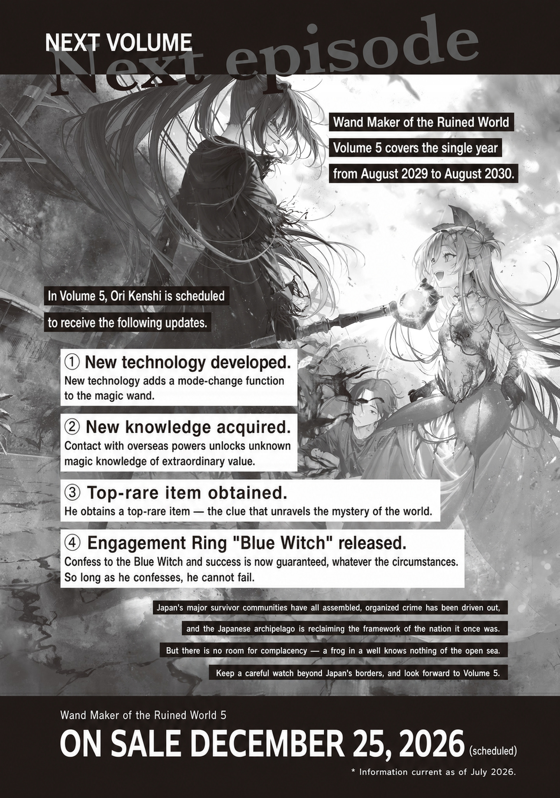
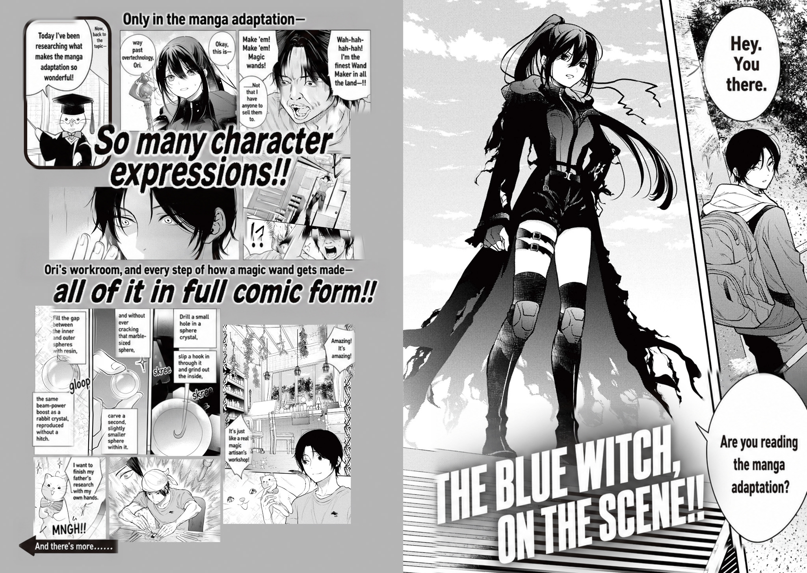
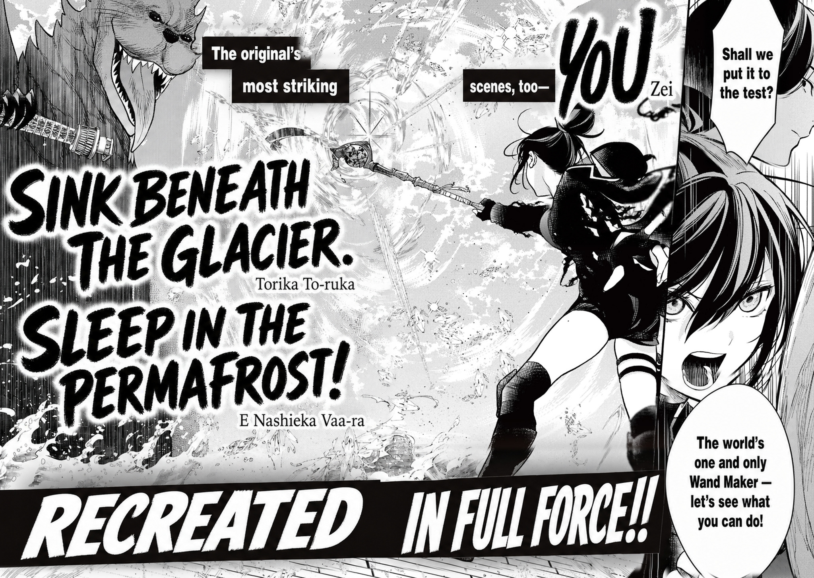

For a veteran carpenter working in Tokyo like Sugoi Daiku, it was common knowledge: new buildings put up after the Gremlin Disaster were crap.

The foundations were a mess, the measurements were a mess, and the earthquake-resistance standards were in tatters. A rundown house built before the disaster was a hundred times better to live in than a pretty but flimsy new one built after it.

A well-built home put up under Japan's strict pre-disaster building standards might look shaky and ready to collapse at any moment, but it would stubbornly hold out for years.

So Tokyo carpenters rarely built new homes, except for jobs in districts like Minato Ward that had been leveled to bare lots.

They salvaged usable materials from collapsed buildings, fitted them into the ones still holding out, and repaired existing buildings by combining parts from two or three into one. That was the most efficient way.

With the compressors stopped, the impact drivers silent, and electricity gone, carpenters' efficiency had dropped tragically low. It wasn't impossible to build a new home from scratch without power tools or heavy machinery, but it was far too inefficient. And in a Tokyo where 85 percent of the population had died, there was one small mercy: empty houses were everywhere. There was no reason not to use them.

Because Sugoi was registered in Nerima Ward, he had a steady, regular supply of work and never lacked for it.

The Spider Witch, who managed Nerima Ward, valued stability. She carefully screened people moving in from other wards and prefectures, and food, medical care, education, and safety all reached everyone fairly and equally. Nothing was lacking.

When it came to building materials, there was actually a surplus.

At its witch's direction, Chofu had adopted a policy of consolidating its residents: every unoccupied house was torn down, and fields were planted on the cleared land. It was Nerima Ward that collected and stored the huge volume of lumber from the demolitions.

Lumber had a wide range of uses, from building materials to waterwheels to shipbuilding, and you could never have too much of it.

In other wards, he'd heard, people sometimes carelessly tore down empty houses for firewood, or left leaky roofs alone because nobody would live there anyway and let the buildings rot. Such a waste. Nerima Ward was lucky to have such an understanding witch.

One day, during a stretch so peaceful and uneventful that he nearly forgot how lucky he was, Sugoi took the start-of-the-month work-assignment order from his mailbox, opened it, blinked, and rubbed his stubble.

Normally it had three to seven building-repair jobs on it, and once in a while a call to help out in a neighboring ward.

This month, though, there was only one job: a new build. On top of that, the schedule section for the following month onward was blank.

Frowning over what this could mean, he found a note at the bottom of the order in meticulous handwriting: “I would like to discuss the details with you. Any time before the weekend is fine, so please come to the address below. If you cannot make it, please send me a letter with a date and time that works for you. Thank you.” It bore the Spider Witch's signature.

Sugoi went straight back inside and hurried to get ready.

Apparently this was a new-build job from the Spider Witch herself. Not being able to make time was out of the question.

He could make time, and even if he couldn't, he'd have rearranged everything to make it his top priority.

Before noon, Sugoi arrived at the Spider Witch's home, a converted car dealership somewhere in Nerima Ward. The Spider Witch was so huge that she couldn't fit through the door of an ordinary house. He'd heard she'd moved through former convenience stores, gyms, and similar buildings before settling at the dealership.

Webs stretched across the broken glass walls of the witch's home, and spiders of every size lay in wait for prey in the shadows, gloomy and silent.

His skin crawled as he felt the spiders' eyes tracking his every move, and he rang the doorbell set up by the door.

At once, the <ruby>interphone<rt>eyeball familiar</rt></ruby> that had been sitting with its eye closed beside the doorbell woke up, spotted Sugoi, and spoke to him gently.

“Good morning, Sugoi-san. It's been a while... Thank you for coming... Was your schedule okay...?”

“Of course. When Witch-sama summons me, rushing over is my schedule.”

“Thank you. Come on in... Go straight to the end of the hall and turn left. I'm in the room at the very back... I'll be waiting...”

The eyeball familiar shut its eye and fell silent, and Sugoi stepped gingerly into the building.

In the ruined dealership, several cars that had probably once cost millions of yen slept quietly under layers of dust. Spiders nesting in the gaps between tires and bodywork and under hoods left open followed Sugoi with eerily glowing red eyes. He knew they were harmless, but they still scared him.

The spiders were the Spider Witch's minions. Spider-type monsters obeyed the orders of their queen, the Spider Witch.

In Nerima Ward, spiders were good omens. Functionally speaking, anyway.

The spiders had watched over and helped the residents for years now without harming them even once, and yet he couldn't bring himself to like creatures that scuttled around on eight legs covered in fine hairs and spines. No matter what, a gut-level disgust welled up in him.

Trying to look at the spiders as little as possible, Sugoi walked down the short hallway and entered the room where the Spider Witch was waiting.

A bamboo blind hung in the room, and beyond that thin partition loomed the ominous silhouette of a giant spider beyond human understanding.

Sugoi froze for a moment, like a frog under a snake's glare.

The Spider Witch didn't eat people. She was a quiet, gentle, kind, and earnest witch. Even so, every time he faced her, he felt like a small animal under a predator's glare.

“Good morning, Spider Witch-sama.”

“...Good morning, Sugoi-san.”

Sugoi forced down his rising fear and bowed, and after a brief silence, the Spider Witch returned his greeting in a listless voice.

“Thank you for coming so early... Sugoi-san, weren't you the type to take it easy in the mornings...?”

“Not really. I just liked my morning coffee, that's all. Ever since the city's coffee stocks ran out, I've been starting work early.”

“I see... Should I order some from the Flower Witch's place...? I'm pretty sure she was growing a few coffee beans...”

“I-Is that okay? Wouldn't it be expensive?”

“It's fine. Increasing our trade with the Flower Witch is a good thing... And some of my spiders like coffee too... So don't hold back...”

At her gentle urging, Sugoi gratefully accepted the witch's kindness, even as he dreaded what she was about to ask of him.

The Spider Witch had a way with words. She was the exact opposite of a smooth talker out to trick and trap people; she was always looking out for others. But the mood had clearly become one where it would be hard to say no, and he couldn't help bracing himself.

The Spider Witch didn't seem interested in a long chat, and after one bit of small talk to cushion things, she got straight to the point.

“Like I wrote in the work request, I want you to build a new house... Sugoi-san, you have good architectural sense, so I really wanted to ask you...”

“I'm honored. But what brought this on? As I'm sure you know, renovating an old house would be quicker.”

“............ Vanity, I guess. It's personal... Um, I mean... A friend might come over... Inviting them into this nest would be a little... you know?”

As she said that, the Spider Witch wriggled as if embarrassed.

True, even to be polite, you couldn't call a dim ruin with no lights and webs everywhere fit for guests.

“So it's a vacation home for your witch-sama friend to visit?” Sugoi asked, picturing the far-too-eccentric witches of the Witches' Council.

The Spider Witch wriggled again and answered, looking somewhat embarrassed.

“No... A man. I don't know if he'll come over, but... If I tell him I built a new house... Maybe he'll be interested...”

Sugoi was shocked.

He'd thought the Spider Witch was wriggling strangely, but he'd been wrong.

That hadn't been wriggling. That had been fidgeting.

The Spider Witch, who had avoided dealing with people for so long, had actually made a male friend, and now she was trying to catch his interest and invite him over...! Could this be love!?

He couldn't help smiling. If that was what this was about, he was fired up.

Building a whole house just to invite a friend over was a pretty bold line of thinking. But friend or no friend, building a fine residence for a witch of the Witches' Council was a good thing to do.

Once, Sugoi had been attacked by a monster and saved by the Spider Witch.

She had saved his life, yet to him it had looked like nothing more than one terrifying monster being killed by an even more terrifying one, and he'd ended up screaming and wetting himself.

Now that he knew what had happened, he felt bad about it.

But how did the Spider Witch objectively look as she reached for him with viciously spined legs, seven blank eyes glowing eerily and drool streaming from her mouth? On that point, he wanted to argue there were extenuating circumstances.

No matter how good a witch she was or how lovely she was on the inside, scary was scary. She looked like nothing but a man-eating monster.

With a fear of spiders carved into his very bones, Sugoi couldn't grow close to the Spider Witch. If someone else could befriend her in his place and ease her loneliness, he wanted to cheer them on all the way.

After hearing the Spider Witch's detailed requests for the new house, Sugoi drew up the plans over the next two weeks, then began construction on a site that had been conveniently prepared for him.

In the world after the Gremlin Disaster, building laws no longer functioned. Without the benefits of a mature civilization, accounting for earthquake resistance, sunlight rights, and road widths took too much work to be realistic, so ignoring all of it had become standard practice. Thanks to that, both design and groundbreaking went fast.

The first job after breaking ground was laying the plumbing.

These days, Tokyo's tap water was pumped up from the Arakawa and Tama Rivers by waterwheels, and rain gutters running through the city like blood vessels served as the water pipes. In other words, the water lines ran aboveground, so there was no need to dig up the ground for them.

The problem was sewage. Most of Tokyo now used pump-out toilets; each household's waste was collected, gathered in the suburbs, and turned into compost. But especially in summer, the toilets started to reek while people waited for collection, and the stench made Tokyo residents miserable. It was even worse than a portable toilet on a construction site.

Apparently, to deal with the smell, Bunkyo Ward, governed by the Foresight Mage, was bringing back sewers and sewage-treatment facilities in some areas on a trial basis.

If they used the old sewage-treatment facilities unchanged, filth-eating slimes would appear, multiply rapidly, and cause a <ruby>stampede<rt>monster crowd accident</rt></ruby>. So they kept slime outbreaks under control with a combination of measures, such as special bait to lure them and regularly boiling the treatment tanks.

Nerima Ward couldn't run such a large, labor-intensive experimental sewage-treatment facility, so Sugoi installed a newly designed household septic tank to handle the sewage.

The new septic tank was buried underground and held a new slime strain selectively bred by the Department of Monster Studies. The strain ate voraciously but reproduced slowly, efficiently treating the waste that flowed into the tank by eating it and discharging clean water.

Normally, keeping a monster that was beyond taming under your house would be far too dangerous. But the Spider Witch could keep it under control well enough.

If you raised waste-treatment slimes on an industrial scale, they'd get out of hand once they multiplied. In a single ordinary household, though, even if they multiplied, their numbers would stay manageable, so dealing with them was easy.

Once the water and sewage lines were in, the next step was the foundation and slab work.

The rebar went in the same as always, but gravel was laid down in place of concrete. Casting chipped-stone magic on that gravel was the newest construction method.

Chipped-stone magic, of the chipped-stone school, was the magic the Pebble Witch had been named for. It could infuse pebbles with magic power and slowly grow them into rock.

There were a few tricks to using it, but handled properly, it made a decent substitute for concrete.

Once the chipped-stone magic was cast, the rock was grown over several days and shaped with a chisel. Then, at last, it was time to put up the scaffolding and start assembling the lumber. That was when the building suddenly began to look like a house.

Naturally, the lumber came from other houses. Old-era lumber had been precut by machine, so its dimensions were uniform, which was good. But the best thing of all was that it had been termite-treated.

Termite treatment, in short, meant protection against termites. Termites lived all over Japan, and without proper precautions, they would devour lumber in no time, reduce it to a crumbling mess, and cause houses to collapse.

Old-era lumber had been soaked through with chemicals that prevented termite damage, which made it extremely resistant to termites. Now that electricity was gone and chemistry had declined, no new termite-proofing chemicals could be produced. When it came to termite-resistant lumber, reusing what the old era had left behind was the best option.

The topping-out ceremony held after framing had changed form too. At some point, instead of offering sacred sake, salt, and rice, people had started burying a Gremlin in a jar.

Following the new custom, Sugoi offered a large Gremlin from a Class A-3 monster, provided by the Spider Witch. The bigger the Gremlin buried under the house at this point, the more auspicious it was said to be, and the better it would protect the house.

Gremlins presumably had no power to keep a household safe. But the bigger a Gremlin was, the higher its amplification ratio and the higher its value, so if you thought of it as burying a secret stash for emergencies, it wasn't completely pointless. Then again, nitpicking a ritual as wasteful or practical was the more uncouth thing to do.

Once the topping-out ceremony was over, the roof went on, and the building materials could be moved indoors.

Since the Spider Witch spared no expense and made full use of her connections, they went with lightweight metal roof tiles produced in Shinagawa Ward.

Clay or slate tiles didn't hold up against crystal rain. After just a year or two of being pelted by the Gremlin crystals the rainclouds brought, they would crack and split and start to leak. If you intended to live somewhere for a long time, a metal roof was essential.

With the roof on, they put in the floors and walls, then installed insulation and built the Spider Witch's amulets into the house.

Several amulets were built into the walls at points chosen by calculating their effective ranges. Their force fields boosted the Spider Witch's magic-power recovery anywhere in the house. She didn't even need to bother wearing one. It was a healing house.

He would have liked to add a dedicated magic-power-training meditation room as well, but understandably, he was uneasy about making technology that new a standard feature of a house, so he passed on it. He was building the Spider Witch's home, after all, not an experimental house.

Once the exterior cladding was on, all that remained was the interior, which Sugoi finished while checking often on what the Spider Witch wanted.

The windows were slime glass. The flooring was made sturdy enough not to wear down under the Spider Witch's weight, and the wallpaper was a muted beige.

If she was going to invite a friend over without embarrassment, then of course good taste in furniture and landscaping mattered too. But that was beyond Sugoi's abilities, so once the interior was completely finished, he had her walk through the house and handed it over.

With labor golems supplied and extra help brought in, it took three months from groundbreaking to handover.

Granted, it had the best possible support system behind it, but the new home, a pet project of a heavyweight of the Witches' Council, was completed remarkably fast.

At his last meeting with the witch before she moved in, Sugoi received her words of praise through the bamboo blind, her giddiness plain in her voice.

“It went up so fast... Thank you so much for making my selfish request come true...”

“Oh, not at all. I'm getting paid, after all. As long as you like it, that's all that matters. Please invite your friend over and take it easy.”

“Y-Yeah... I wonder if he'll mind if I invite him...? First I have to move in and get furniture, but... No, anyway, thank you. It's the best house...”

Sugoi chatted for a while with the elated witch, then wrapped up the big magical-construction job feeling refreshed.

If she was going to be this happy about it, that was a carpenter's greatest reward.

Lately, everyone was making a fuss over new professions for a new era, Wand Makers this, beast handlers that, magic researchers the other. But trades that had carried on since the old era were properly upgrading to keep up with the times too.

Every bit as giddy as the giddy witch, Sugoi smiled with renewed confidence. I'm not so old and doddering that the times can leave me behind yet.

---

## Afterword

Lately, I've been really into emotional economics.

Emotional economics is a theory of creative writing I came up with. It treats the movement of emotions as an economy.

For example. Say you hold an umbrella over a stray cat caught in the rain. When you get home, the cat shows up, says, “I am the cat you so kindly saved earlier,” and gives you 5 trillion yen.

This is a story about a small kindness coming back to you as a big pile of money, but emotional economics looks at it differently.

It sees it like this: you gave the cat a small bit of mercy (an emotion), and big-ass feelings came back in return. You handed over a small emotion and got a big emotion back as thanks, so from the standpoint of emotional economics, your emotional balance sheet shows a huge profit.

The core of emotional economics is to assume that this kind of “emotional profit” is “something readers find pleasant,” and to put it to work in fiction.

For example, “I'm not that into him, but my boyfriend likes me so much it's a problem” can be read as a rich person's humblebrag (an emotion-rich person's humblebrag): I'm not paying my partner any emotion at all, but they're paying me big-ass feelings, so I'm raking in a one-sided emotional fortune, and oh, it's such a problem.

The principle of emotional reciprocity comes into play too.

In an ordinary money economy, selling a 5-yen product for 50,000 yen is a rip-off. On the flip side, if you sell a 50,000-yen product for 5 yen, people get wary: “This is weird. Is there some kind of trap?”

In a normal money economy, a 50,000-yen product sells for 50,000 yen.

In the emotional economy too, trading equal amounts of emotion is the standard.

If you receive a small emotion, you return a small emotion. A big emotion gets a big emotion in return. That's the standard, and it's normal.

If you give a small emotion and get back a big emotion out of all proportion to what you gave, then, just like when you buy a 50,000-yen product for 5 yen, you may end up thinking, “This is too good a deal. I made such a lopsided trade, I feel bad about it.” Though of course, plenty of people just cheer, “Yay, huge profit!”

If you receive a big emotion but only return a small one, you've made the other person take a loss on their emotional balance sheet, so they come out behind and feel bad.

If you return an equal amount of emotion, nobody thinks better or worse of you, and it's recognized as “a normal, proper emotional trade.” So usually, an equal exchange is the safe choice for emotional trades and doesn't make waves.

When it comes to applying emotional economics to writing novels, though, an equal exchange of emotion isn't always the right answer. That's because, looked at from the other side, a safe, balanced emotional trade that doesn't make waves is also a boring one with no ups and downs, no drama, no dynamism.

That's where fraud comes in. You make an unequal emotional trade look as if it's balanced.

The cat that brought 5 trillion yen seems to have repaid a small act of mercy with big-ass feelings far out of proportion to it.

But what if the cat would have frozen to death if you hadn't held that umbrella over it? Suddenly the 5 trillion yen, the big-ass feelings it gave back as thanks, start to seem reasonable. You can accept big-ass feelings out of proportion to the amount of emotion you paid, with a clear conscience.

You can tell yourself: I didn't con anyone out of this huge emotional income. I earned it fair and square.

Depicting emotion in a novel comes down to “how to make a satisfying emotional trade.”

You move the story along on the assumption that readers want to make an emotional killing and don't want to take an emotional loss.

It's unpleasant when you shower someone with big-ass affection and they flat-out ignore you. On your emotional balance sheet, that's a massive loss, a total write-off. So anyone who ignores affection aimed at them is a bad guy committing emotional robbery. They need to give back at least a little emotion, even just a tiny bit, and put on a show of having made an emotional trade, however lopsided, so they're not simply an emotional robber. Or, if they turn you down up front with “I don't want to make emotional trades with you, so please don't give me any feelings in the first place,” they come across as sincere (because it amounts to a declaration of sincerity: “Even if it would profit me, I won't commit emotional robbery against you”).

And when feelings you'd given up on, sure they'd never be accepted (and naturally never returned), not only get accepted but are met with big-ass feelings in return, you've made an emotional killing you never planned on, so of course you're over the moon. The pattern where you confess expecting to get turned down, get a yes, and hear “Actually, I've liked you for a long time too” is one of these.

As you can see, emotional economics can be applied to any scene involving emotion, and it lets you break down, analyze, and logically explain how emotions move in relationships between multiple people, instead of relying on empathy or gut feeling.

Since I started researching emotional economics, I've come to understand the appeal of works that used to leave me completely baffled, and I've enjoyed them a lot. I can now also explain in theoretical terms the appeal of works I used to enjoy without knowing why.

And the emotional beats in my novels, which I used to land only as lucky punches, I can now land on purpose. I've managed to stabilize my novels' attack power and keep it high.

For me, emotional economics is the latest weapon in my writing arsenal, and a very powerful one.

Well, maybe emotional economics is aaall wrong right down to the roots, miles away from the true nature of emotion, off the mark and way out in left field, though.

Still, for now, putting emotional economics into practice hasn't caused me any problems, and I plan to keep using it until I find a fatal flaw. If I find one, I'll just scrap it or fix it. That's how I've built up countless theories of writing and honed my skills as a novelist, and that's how I'll keep doing it, forever.

One day in May 2026 — Kurodome Hagane

## Next Volume

*Wand Maker of the Ruined World* Volume 5 covers the single year from August 2029 to August 2030.

In Volume 5, Ori Kenshi is scheduled to receive the following updates.

① **New technology developed.** New technology adds a mode-change function to the magic wand.

② **New knowledge acquired.** Contact with overseas powers unlocks unknown magic knowledge of
extraordinary value.

③ **Top-rare item obtained.** He obtains a top-rare item—the clue that unravels the mystery of the
world.

④ **Engagement Ring "Blue Witch" released.** Confess to the Blue Witch and success is now
guaranteed, whatever the circumstances. So long as he confesses, he cannot fail.

Japan's major survivor communities have all assembled, organized crime has been driven out, and the
Japanese archipelago is reclaiming the framework of the nation it once was. But there is no room for
complacency—a frog in a well knows nothing of the open sea. Keep a careful watch beyond Japan's
borders, and look forward to Volume 5.

*Wand Maker of the Ruined World 5* — on sale December 25, 2026 (scheduled).

\* Information current as of July 2026.

---

## Manga Adaptation

Today I've been looking into what makes the manga adaptation so wonderful: all the character
expressions you can only see in manga!

Ori's workroom and every step of how a magic wand gets made—all of it shown in full comic form!!

Drill a small hole in a sphere crystal, slip a hook in through it and grind out the inside, and
without ever cracking that marble-sized sphere, carve a second, slightly smaller sphere within it.
Fill the gap between the inner and outer spheres with resin, and you reproduce the same beam-power
boost as a rabbit crystal without a hitch.

"Okay, this is—way past overtechnology, Ori."

"Wah-hah-hah-hah! I'm the finest Wand Maker in all the land—!! Make 'em! Make 'em! Magic wands!
……Not that I have anyone to sell them to."

"Amazing! It's amazing! It's just like a real magic artisan's workshop! I want to finish my father's
research with my own hands."

And there are plenty more memorable lines:

"Hey. You there. Are you reading the manga adaptation? THE BLUE WITCH, ON THE SCENE!!"

The original's most striking scenes, too—recreated in full force!!

"You, sink beneath the glacier. Sleep in the permafrost!"

"Shall we put it to the test? The world's one and only Wand Maker — let's see what you can do!"

*Wand Maker of the Ruined World* — Original Story: Kurodome Hagane. Manga: Futo Nori. Character
Design: Kayahara. Kadokawa Comics A.

Now serialized on KadoComi's Young Ace UP, and manga Volume 1 on sale now!!

Those scenes from the novel—now in manga!! Can you tell which scene each one is? Every character
shows up, one after another!!

"Could you not talk to me? Please don't come near me. I don't even want to look at your face."

"Ori-saaan! Good morning! I'm here. Unfortunately."

Please give the manga your support too!
