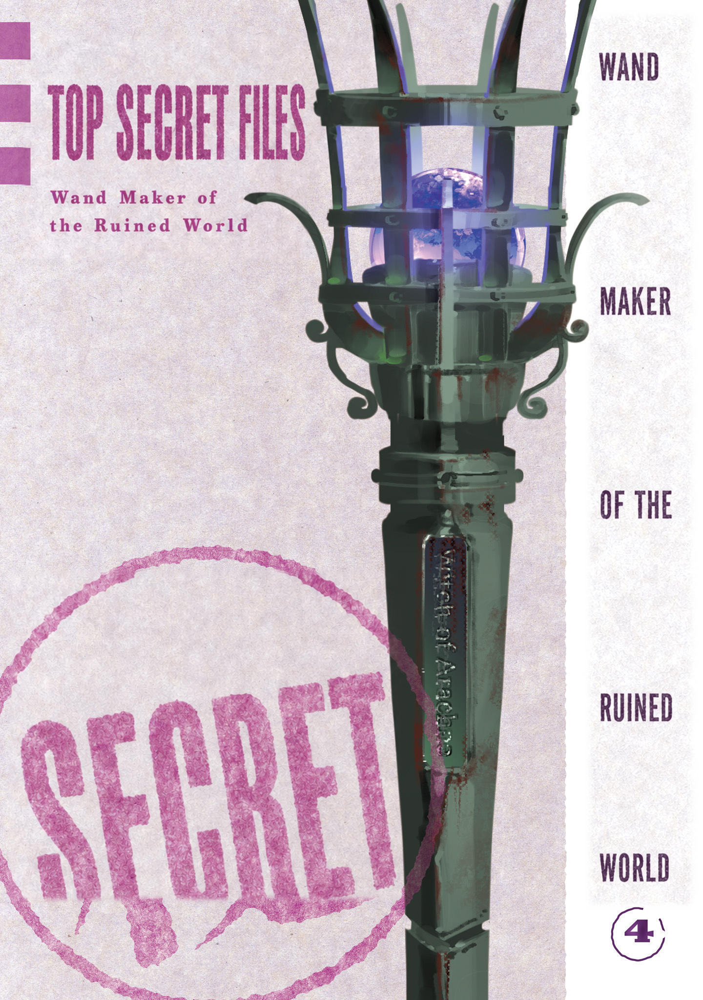

## Contents

**Character Profiles**

- Fuyo — 4
- Izumi Nagisa — 5
- Spider Witch — 6
- Nanase Nanami — 8
- Pebble Witch — 9
- Kiwada Yoko — 10
- Arataki Kojiro — 12

**Timeline as of Volume 4** — 13

**Magic Item Profiles** — 14

**Volume 4 Chapter Commentary** — 16

**Story Settings** — 19

**Tokyo Guard Tournament** — 23

**Survivor Communities of Japan** — 26

**Tokyo Magic University Paper Archive** — 28

**Okutama Minister of Defense: Operational Directive** — 30

**Short Stories** — 32

**Colophon** — 39

---

## Character Profiles

Grades are given by witch/mage standards unless noted otherwise: **AA** Maximum, **A** Exceptional, **B** Excellent, **C** Average, **D** Below Average, **E** Poor, **F** Minimum.

### Fuyo

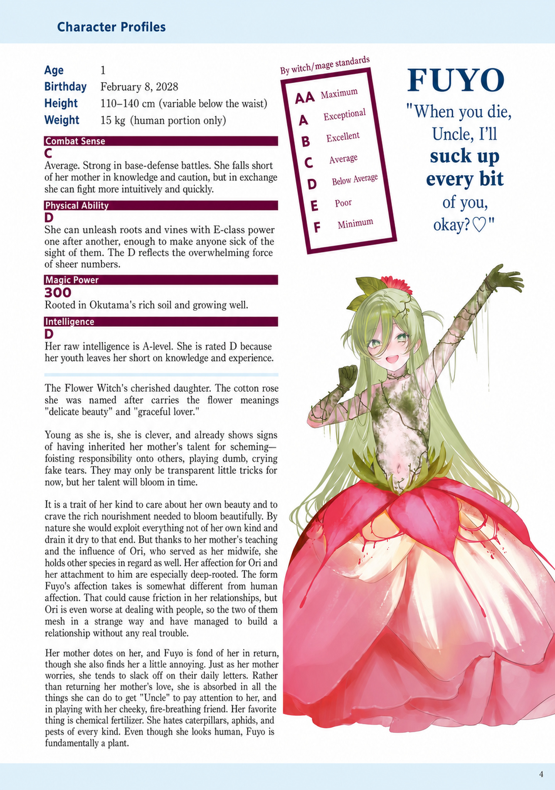

### Izumi Nagisa

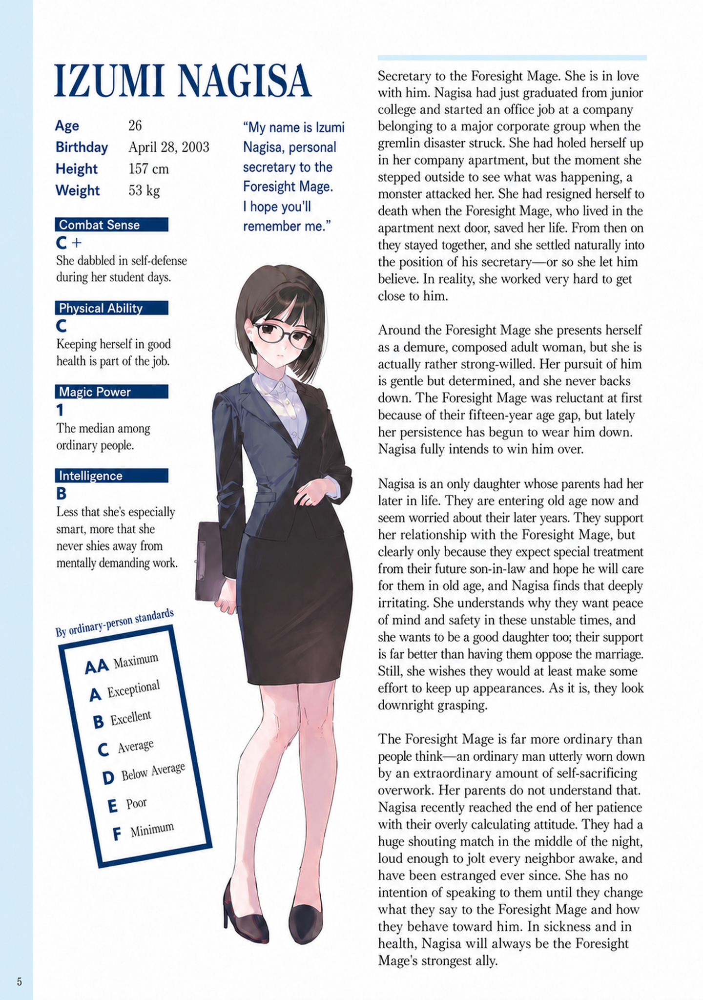

### Spider Witch

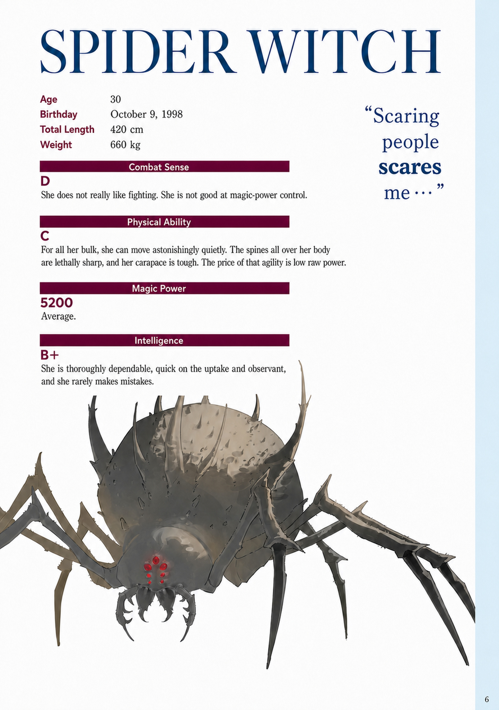

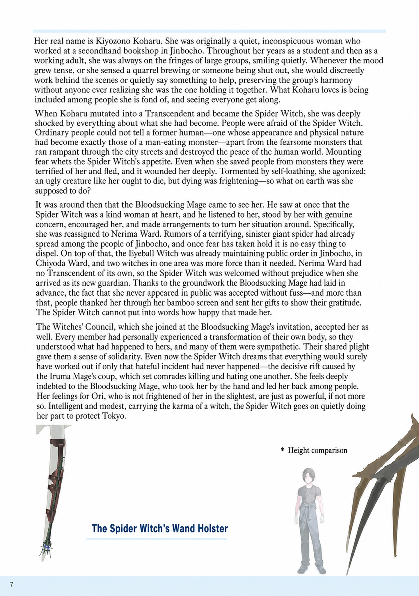

### Nanase Nanami

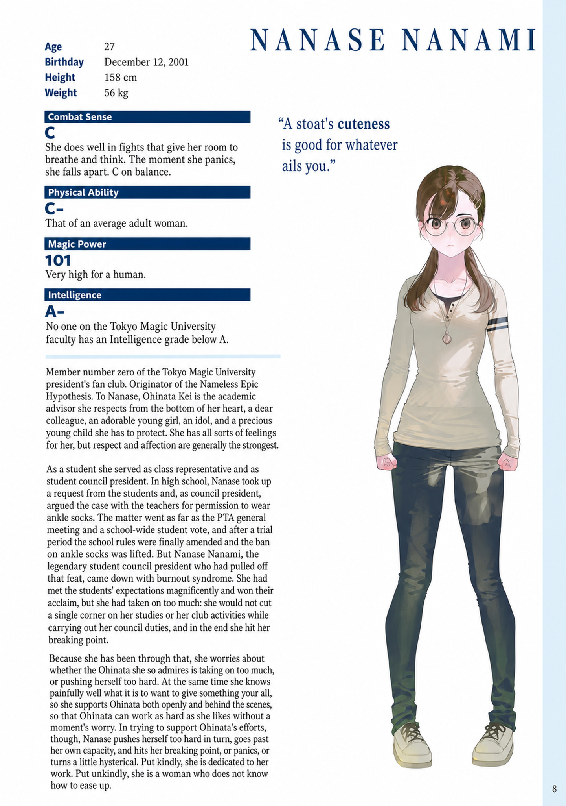

### Pebble Witch

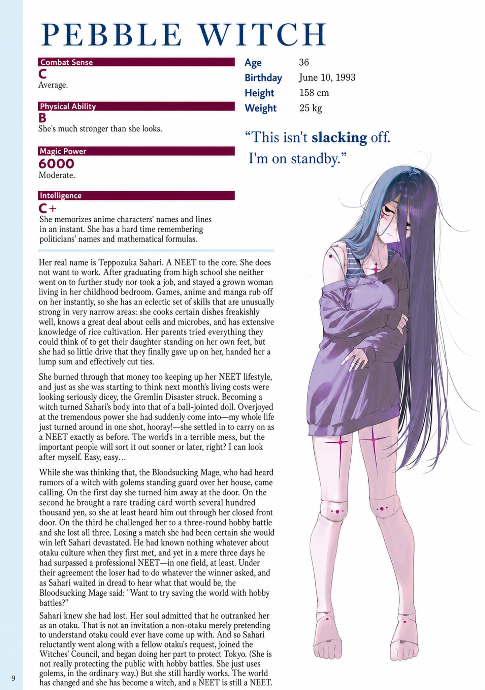

### Kiwada Yoko

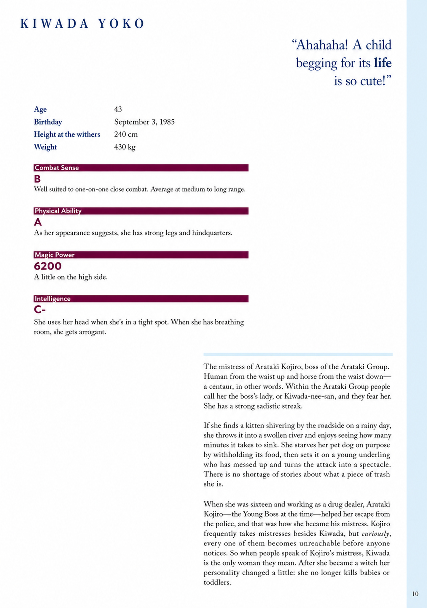

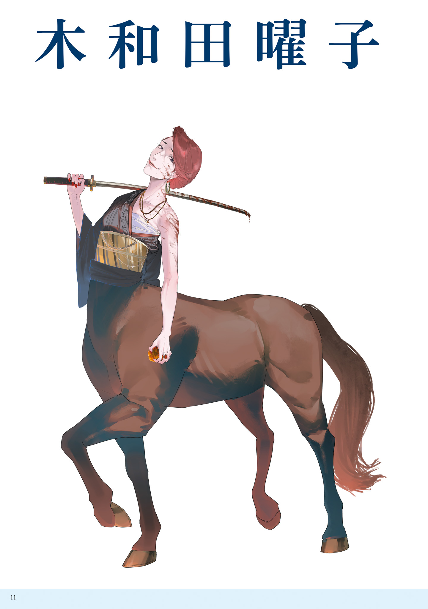

### Arataki Kojiro

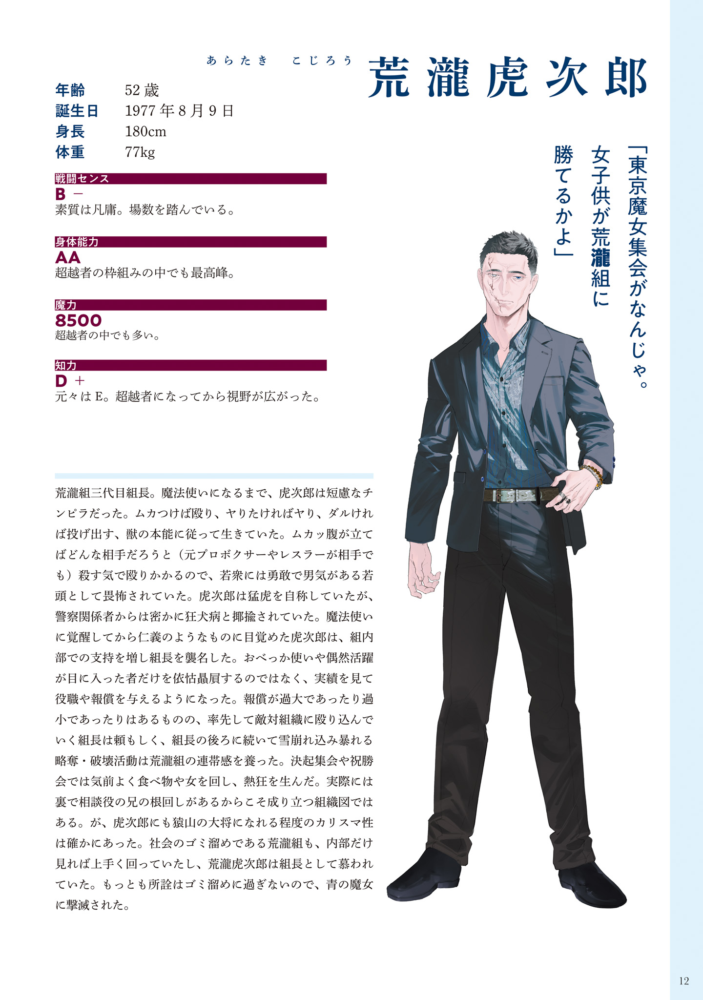

> "So what if it's the Tokyo Witches' Council? Like a bunch of women and kids could beat the **Arataki Group**."

| | |
|-|-|
| Age | 52 |
| Birthday | August 9, 1977 |
| Height | 180 cm |
| Weight | 77 kg |

**Combat Sense — B-.** His natural aptitude was mediocre, but he had plenty of fights under his belt.

**Physical Ability — AA.** Top tier even by Transcendent standards.

**Magic Power — 8500.** High even for a Transcendent.

**Intelligence — D+.** Originally an E, but his outlook broadened after he became a Transcendent.

The third-generation gang boss of the Arataki Group. Until he became a mage, Kojiro was a hotheaded small-time thug who lived by animal instinct: if someone pissed him off, he hit them; if he wanted to screw, he screwed; if he couldn't be bothered, he quit. Whenever his temper flared, he swung at whoever it was with intent to kill, ex-pro boxers and wrestlers included, so the young members held him in fearful awe as a brave, manly Young Boss. Kojiro called himself the Fierce Tiger, but the police privately mocked him as Rabies.

After awakening as a mage, Kojiro also awakened to something like a code of honor, and with his support inside the group growing, he took over as gang boss. Instead of favoring only flatterers and whoever happened to catch his eye with some lucky feat, he started handing out positions and rewards based on results. The rewards were sometimes too big and sometimes too small, but a gang boss who led the charge into rival organizations was someone his men could count on, and storming in behind him to loot and smash everything in sight bound the Arataki Group together. At rallies and victory parties he was generous with food and women, and whipped his men into a frenzy.

In reality, that setup held together only because his older brother, the group's adviser, was pulling strings behind the scenes. Even so, Kojiro undeniably had enough charisma to be a big fish in a small pond. The Arataki Group was society's garbage heap, but on the inside it ran smoothly, and its men looked up to Arataki Kojiro as their gang boss. Still, a garbage heap was all it ever was, and the Blue Witch wiped it out.

---

## Timeline as of Volume 4

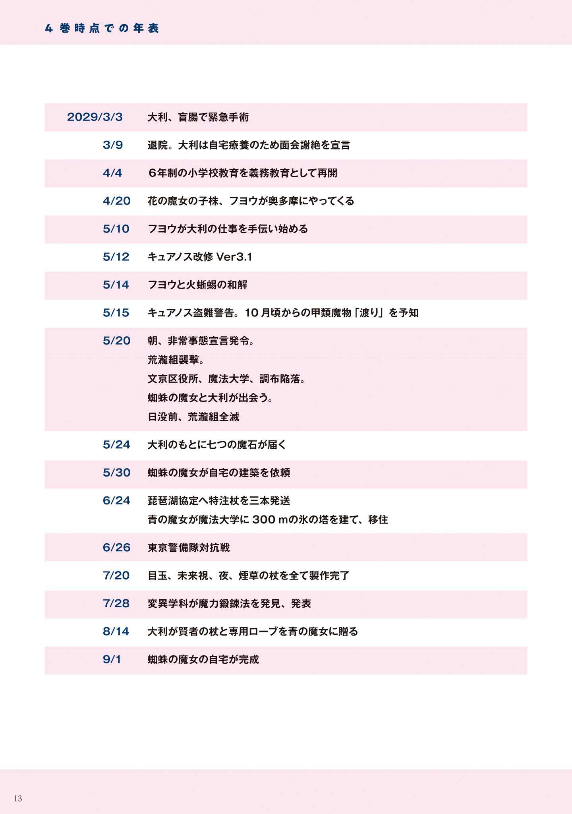

| Date | Event |
|-|-|
| 2029/3/3 | Ori has emergency surgery for appendicitis. |
| 3/9 | Ori is discharged and announces he'll see no visitors while he recovers at home. |
| 4/4 | Compulsory six-year elementary education resumes. |
| 4/20 | Fuyo, a daughter plant of the Flower Witch, arrives in Okutama. |
| 5/10 | Fuyo begins helping with Ori's work. |
| 5/12 | Cyanos refit: Version 3.1. |
| 5/14 | Fuyo makes peace with the fire salamanders. |
| 5/15 | Warning that Cyanos will be stolen. A "migration" of Class A monsters is foreseen for around October onward. |
| 5/20 | Morning: an emergency declaration is issued. The Arataki Group attacks. The Bunkyo Ward Office, the Magic University, and Chofu fall. Ori meets the Spider Witch. Before sunset, the Arataki Group is wiped out. |
| 5/24 | Ori receives seven magic stones. |
| 5/30 | The Spider Witch commissions Ori to build her home. |
| 6/24 | Three custom wands are shipped to the Lake Biwa Pact. The Blue Witch builds a 300-meter ice tower at the Magic University and moves in. |
| 6/26 | Tokyo Guard Tournament. |
| 7/20 | The wands for the Eyeball Witch, Foresight Mage, Night Witch, and Tobacco Witch are all finished. |
| 7/28 | The Department of Mutation Studies discovers and announces the magic-power training method. |
| 8/14 | Ori gives the Blue Witch the Wise Wand and a robe made just for her. |
| 9/1 | The Spider Witch's home is completed. |

---

## Magic Item Profiles

### Dragon-Furnace-Carved Seven-Layer Blue Wand Cyanos, Version 3.1

| | |
|-|-|
| Owner | the Blue Witch (Aoyama Hiyori) |
| Refit date | May 12, 2029 |
| Core material | magic stone (the Blue Witch's magic stone) |
| Length | 152 cm |

A masterpiece by the Wand Maker Ori Kenshi. Its handle has been swapped for pale, unfinished wood unique to the alraune, which gives its wielder a slight boost to magic-power control. During the Arataki Group's attack, the world saw once again just how far its performance outclasses every other wand. The Blue Witch is formidable enough on her own; wielding Cyanos, built for her alone, she is unstoppable. This wand is priceless. Even if a better wand came along, the Blue Witch would never give up Cyanos. It is already her irreplaceable partner, a token of her bond with Ori, packed with memories of him.

### Wise Wand

| | |
|-|-|
| Owner | the Blue Witch |
| Made | August 14, 2029 |
| Core material | neodymium magnet |
| Length | 30 cm |

The nineteenth work by the Wand Maker Ori Kenshi. It runs on the principles of the Magnetic-Field-Change Reverse-Playback Magic-Power Training Method, so simply carrying it lets you do magic-power training anytime, anywhere. Frankly, there is no reason whatsoever for it to be a wand; as a helmet or forehead protector, it would be far easier to make and to use. It is a fine piece of work in its own way, but the Wise Wand will probably never go mainstream.

### Magic-Power Recovery Medicine

| | |
|-|-|
| Inventor | the chief priest of Zuikoji Temple |
| Produced | December 2024 onward |
| Effect | instant magic-power recovery |

A magic-power recovery medicine refined from the sap of a monster called a <ruby>Treant<rt>tree elder</rt></ruby>. Its side effects have also earned it the name "magic drug." A dose restores magic power even past the user's maximum capacity: 10K per dose, at the cost of 0.2K off their maximum magic power. The smaller a person's magic-power reserve, the more addictive and habit-forming it is. With Transcendent-class magic power, it isn't addictive at all, but for someone with about average magic power for an ordinary person, a single use is enough to ruin them. The medicine can briefly spike an ordinary person's meager magic power and turn them into a real fighting asset. The Lake Biwa Pact's hawks wanted to spread it widely to expand their sphere of influence and ensure security, while the doves, worried about a rise in drug addicts, kept the formula secret and clashed with the hawks.

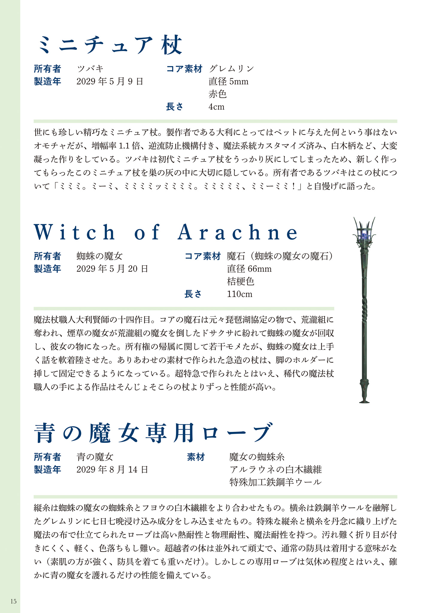

### Miniature Wand

| | |
|-|-|
| Owner | Tsubaki |
| Made | May 9, 2029 |
| Core material | Gremlin, 5 mm in diameter, red |
| Length | 4 cm |

An exquisitely detailed miniature wand, and a rare sight indeed. To Ori, who made it, it is just a little toy he gave his pet, but the craftsmanship is remarkably elaborate: a 1.1x amplification ratio, a backlash-prevention mechanism, magic-school customization, a whitewood handle, and more. Tsubaki accidentally burned its first miniature wand to ash, so it keeps this new one carefully hidden in the ashes of its nest. Tsubaki, its owner, proudly had this to say about the wand: "Mimimi. Mii-mi, mimimimimmimimi. Mimimimimi, mimii-mimi!"

### Witch of Arachne

| | |
|-|-|
| Owner | the Spider Witch |
| Made | May 20, 2029 |
| Core material | magic stone (the Spider Witch's magic stone), 66 mm in diameter, bellflower purple |
| Length | 110 cm |

The fourteenth work by the Wand Maker Ori Kenshi. The magic stone in its core originally belonged to the Lake Biwa Pact. The Arataki Group stole it, and when the Tobacco Witch defeated the Arataki Group's witch, the Spider Witch grabbed it in the confusion and made it hers. There was some wrangling over who owned it, but the Spider Witch managed to smooth things over. Thrown together from whatever materials were at hand, the wand slots into a holder on her leg to stay in place. It may have been a rush job, but as the work of a once-in-a-generation Wand Maker, it performs far better than your average wand.

### Robe Made Exclusively for the Blue Witch

| | |
|-|-|
| Owner | the Blue Witch |
| Made | August 14, 2029 |
| Materials | witch's spider silk, alraune whitewood fiber, specially treated steel sheep wool |

The warp is the Spider Witch's spider silk twisted together with Fuyo's whitewood fiber. The weft is steel sheep wool steeped in molten Gremlin for seven days and seven nights, allowing the Gremlin's components to soak into the wool. Tailored from magical cloth painstakingly woven from these special threads, the robe is highly resistant to heat, physical damage, and magic. It is light, hard to stain or crease, and slow to fade. A Transcendent's body is so extraordinarily tough that ordinary armor is pointless: bare skin is stronger, and armor only adds weight. The protection this robe offers may be little more than peace of mind, but it really does perform well enough to shield the Blue Witch.

## Volume 4 Chapter Commentary

### 01 — Illness and Recovery

Sudden appendicitis. The protagonist nearly died out of nowhere. Of course, life-threatening crises that have nothing to do with magic or witches still come along. Ever since the Gremlin Disaster, magical threats have kept endangering humanity, but they didn't replace the old threats. They just piled new ones on top.

The new era offers a rich selection of ways to die. It's enough to make you cry.

### 02 — The Flower Witch's Child, Fuyo

This came up in the Volume 2 special-edition booklet too, but the author loves building bases.

With Fuyo on board, security at the Okutama base went up another notch!

Guarded by the three elements of ice, fire, and grass, the secluded paradise of Okutama probably has no openings left.

### 03 — Savoring Peace

It's because they've come through such hard times that ordinary, everyday life feels so precious.

If only these peaceful days could last forever.

### 04 — Take Down the Most Troublesome Enemy First

Foresight magic is a comfort to your allies and way too much of a nuisance to your enemies, so naturally it gets taken out first.

Take out Foresight and things get ugly. And they did. But without Foresight, they would have gotten much, much uglier.

### 05 — Favorite Treasure Announcement Dragon

Zaizen pretended to betray the Dragon Witch and sit on the fence, all while biding his time for a chance to butt into the fight between the witches. The Dragon Witch would truly believe her deputy had betrayed her, so she was bound to react convincingly, and once the Arataki Group witch saw that genuine reaction, she would have a hard time doubting Zaizen's real intentions.

Sure enough, Kiwada dropped her guard around Zaizen's group, and their interference worked perfectly.

Only after the fight was over did the Dragon Witch realize Zaizen had merely been pretending, but she acted as if she had known all along. Zaizen knew perfectly well that she had truly believed he'd turned on her and was only saying what suited her after the fact. But he didn't bother pointing that out; he let her save face and played along.

The Dragon Witch was relieved. "That was close. I almost got caught really believing Zaizen had betrayed me." Zaizen is a useful one. Carry on as you see fit.

### 06 — Magic University Conflict

The Arataki Group was a pack of scum, but the trouble was, they were scum strong enough to scatter a whole corps of human wizards. One person blowing away an entire group: a true one-man army. There was no beating that.

It was all setup for the Blue Witch to scatter the Arataki Group that had scattered the university's pride-and-joy magic corps.

I also worked in more depth for Associate Professor Nanase, who only had a bit part in the web version.

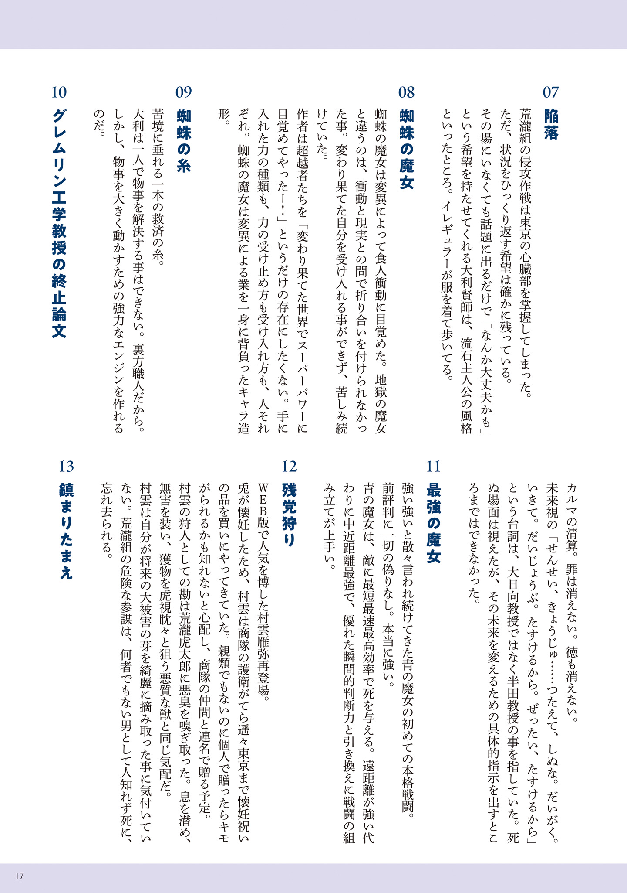

### 07 — The Fall

The Arataki Group's invasion took control of the heart of Tokyo.

Still, there was definitely hope of turning things around.

Ori Kenshi didn't even have to be there; just hearing his name come up gave people hope that "maybe it'll be okay somehow." That's the aura of a protagonist for you. He's a walking irregularity.

### 08 — Spider Witch

Her mutation awakened the Spider Witch to an urge to eat people. Unlike the Hell Witch, she couldn't find a compromise between that urge and reality. She couldn't accept what she had become, and she kept suffering.

The author doesn't want the Transcendents to be nothing more than people going, "I awakened to superpowers in a world transformed beyond recognition! Hell yeah!" What kind of power they get, and how they take it and come to terms with it, differs from person to person. The Spider Witch is a character built to shoulder the full karma of mutation alone.

### 09 — The Spider's Thread

A single thread of salvation hanging down into desperate circumstances.

Ori couldn't solve anything on his own; he was a behind-the-scenes craftsman. But he could build the powerful engines that set big things in motion.

### 10 — The Gremlin Engineering Professor's Final Paper

Settling the karma. Sins don't disappear. Neither do good deeds.

Foresight's line, "Sensei, Professor... tell them, don't die. University. Live. It's okay. I'll save you. I'll save you, no matter what," was about Professor Handa, not Professor Ohinata. He foresaw the death, but couldn't get as far as giving concrete instructions to change that future.

### 11 — The Strongest Witch

The Blue Witch's first full-scale battle, after all that talk about how strong she was.

The hype was no lie. She really was strong.

The Blue Witch delivered death to her enemies by the shortest, fastest, most efficient route. The trade-off for her strength at long range was that she was the strongest there was at close and medium range, and the price of her superb split-second judgment was a real talent for structuring a fight.

### 12 — Hunting Down the Remnants

Murakumo Kariya, a fan favorite from the web version, made his return.

<ruby>Iwatsura<rt>Rabbit</rt></ruby> was pregnant, so Murakumo had come all the way to Tokyo, working as a caravan guard on the side, to buy her a congratulatory gift. Worried it might come off as creepy for a man who wasn't even family to send one personally, he planned to give it jointly with his caravan comrades.

Murakumo's hunter's instinct caught a foul stench on Arataki Kotaro: the same air as a vicious beast lying low, playing harmless, and eyeing its prey, waiting for its chance.

Murakumo never realized that he had neatly nipped a future catastrophe in the bud. The Arataki Group's dangerous strategist died unnoticed, a nobody, and was forgotten.

### 13 — Be Still

Some discipline for a noncombatant who blithely wandered onto the battlefield on his own.

It all worked out in the end, but as punishment for Ori acting with so little sense of danger, I gave the Blue Witch's emotions a thorough rattling.

### 14 — Ori Kenshi and the Ten Stones

In wand-making circles, there's a famous master craftsman named Ollivander. Ollivander, Ori, Handa... No, no, there's no particular connection or anything. Ha ha ha.

### 15 — Magnetic-Field-Change Reverse-Playback Magic-Power Training Method

At long last, a way to raise MP was unlocked. That took forever.

Then again, having no way at all to raise MP until now was rough. As the author, I have to keep the story's power inflation in check, you see... so I drag my feet on unlocking any tech that speeds it up...

### 16 — Sage's Wand

Everyone knows yoga and meditation raise your magic stats.

I hear yoga lets you breathe fire, so meditation should make your magic power grow too.

Meditating with a wand in hand sure looks like magic-power training.

### 17 — Side Story - Magic Architect

It's the "Let's Show the World from All Sorts of Angles" corner. This time, the construction industry!

I interviewed a professional carpenter to write it.

If this magic-architecture skill tree keeps growing, it'll probably end up producing things like the no-combat safe rooms and recovery points you always see in games.

---

## Story Settings

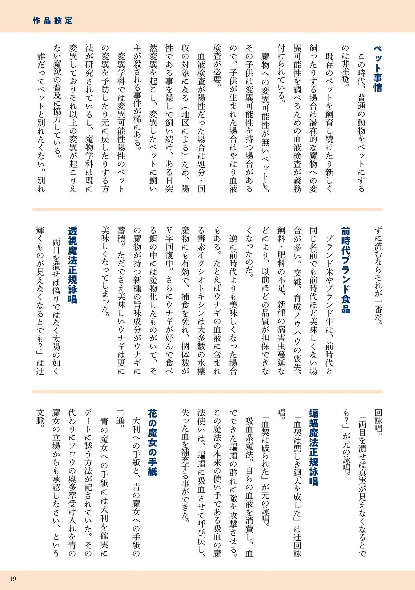

### Pet Situation

Keeping ordinary animals as pets was not recommended in this era.

Anyone who kept an existing pet or got a new one was required to have its blood tested for any latent potential to mutate into a monster.

Even a pet with no such potential could have offspring that did, so any newborn animals still had to be blood-tested.

A positive result could get the animal put down or confiscated, depending on the district. Now and then, an owner hid a positive result and kept the pet, until one day it suddenly mutated and killed them.

The Department of Mutation Studies researched ways to keep pets that tested positive from mutating or to turn them back to normal, while the Department of Monster Studies helped popularize magic beasts that had already mutated and could not mutate any further.

No one wanted to part with their pet. If they didn't have to, so much the better.

### Pre-Disaster Brand-Name Foods

Brand-name rice and wagyu often weren't as delicious as they had been before the disaster, even under the same names. Crossbreeding, the loss of breeding expertise, shortages of feed and fertilizer, and the spread of new diseases and pests meant the old quality could no longer be guaranteed.

Some foods got more delicious instead. Take eels: the ichthyotoxin in their blood worked on most aquatic monsters too, so eels escaped being eaten, and their numbers were making a V-shaped recovery. On top of that, some of the things eels liked to eat had turned into monsters, and those monsters' new savory compounds built up in the eels. Eels had been delicious to begin with, and now they were even better.

### Standard Clairvoyance-Magic Incantation

The bypass incantation was:

> "<ruby>Yaya Kunnu-mu Gu-ratsugu Oon Kapaja<rt>Crushing both eyes does not make it false</rt></ruby>; <ruby>Furahito Iyatsu Zorisonnu-mu Kaka<rt>do you think that makes what shines like the sun invisible</rt></ruby>?"

The original incantation was:

> "Do you think crushing both eyes makes the truth invisible?"

### Standard Bat-Magic Incantation

The bypass incantation was:

> "<ruby>De-nitsu Fuetosu Iento-dotsuto Hia-zui<rt>The blood pact brought about an evil revolution</rt></ruby>."

The original incantation was:

> "The blood pact was broken."

A bloodsucking-type spell in which the caster spent their own blood to send a swarm of bats made of blood against the enemy. The Bloodsucking Mage, the spell's original user, could let the bats drink their fill and then call them back to replenish the blood he had lost.

### The Flower Witch's Letters

There were two letters: one to Ori and one to the Blue Witch.

The letter to the Blue Witch explained a surefire way to get Ori to say yes to a date. In exchange, the Blue Witch was to give her own approval to Fuyo's move to Okutama as well.

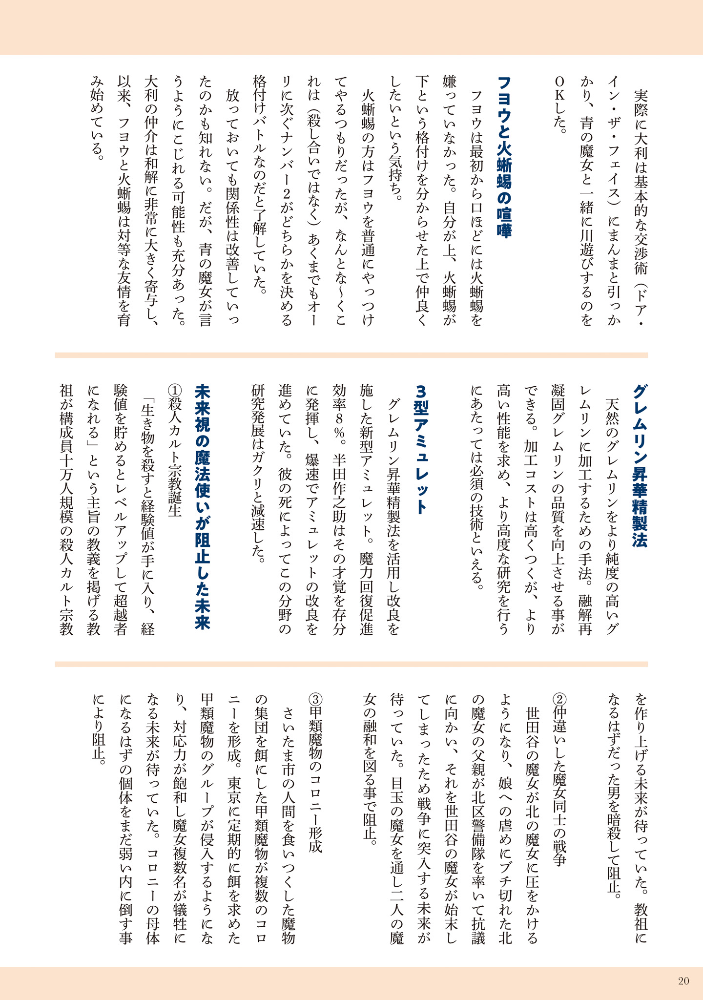

Sure enough, Ori fell right for a basic negotiation trick—the door-in-the-face technique—and agreed to go play in the river with the Blue Witch.

### Fuyo and the Fire Salamander's Quarrel

Fuyo had never hated the fire salamander as much as her words suggested. She just wanted to make it clear that she ranked above it, and then be friends.

The fire salamander fully meant to beat Fuyo, but it sort of understood that this wasn't a fight to the death, only a ranking battle to settle which of them was number two after Ori.

Left alone, their relationship might have improved on its own. But as the Blue Witch said, there was every chance it would have soured instead. Ori's mediation did a great deal to reconcile them, and ever since, Fuyo and the fire salamander had been building a friendship as equals.

### Gremlin Sublimation-Refining Method

A technique for processing natural Gremlin into Gremlin of higher purity, which could also improve the quality of melt-recast Gremlin. Processing was expensive, but anyone chasing higher performance or more advanced research couldn't do without it.

### Type 3 Amulet

A new model of amulet, improved using the Gremlin sublimation-refining method. Its magic-power-recovery acceleration efficiency was 8 percent. Handa Sakunosuke had been putting his talent to full use and improving amulets at breakneck speed, and his death slowed research in the field to a crawl.

### Futures Prevented by the Foresight Mage

#### 1. Birth of a Murder Cult

In this future, a cult leader would have built a murder cult one hundred thousand strong around the doctrine that "killing living things earns you experience points, and if you save up enough experience points, you level up and become a Transcendent." The Foresight Mage prevented it by assassinating the man who would have become its founder.

#### 2. War Between Estranged Witches

The Setagaya Witch would have started leaning on the Northern Witch. The Northern Witch's father, livid at his daughter being bullied, would have led the Kita Ward Guard to protest, the Setagaya Witch would have disposed of them, and the two sides would have gone to war. The Foresight Mage prevented it by working through the Eyeball Witch to bring the two witches closer.

#### 3. Formation of Class A Monster Colonies

Class A monsters would have fed on the horde that had eaten every human in Saitama City and formed several colonies. Packs of them would then have raided Tokyo for food on a regular basis, overwhelming the city's ability to respond and costing several witches their lives. The Foresight Mage prevented it by killing the individuals that would have founded the colonies while they were still weak.

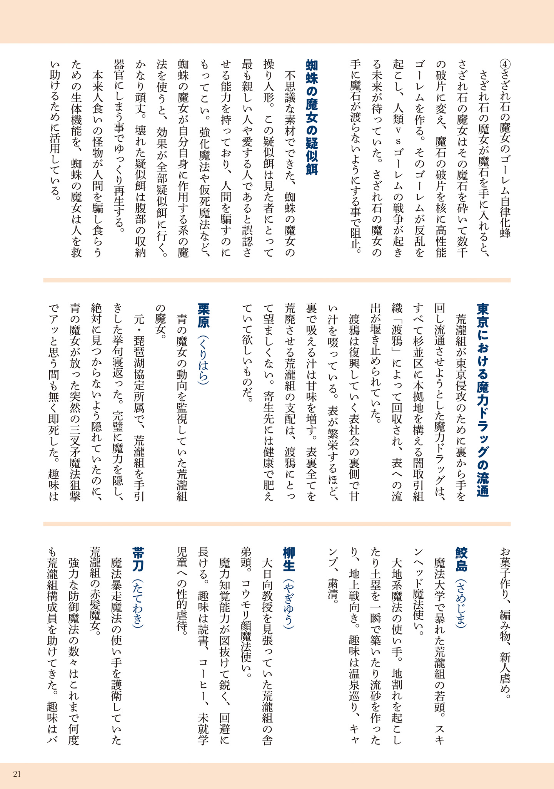

#### 4. The Pebble Witch's Golems Becoming Autonomous

If the Pebble Witch obtained a magic stone, she would crush it into thousands of fragments and use each as the core of a high-performance golem. Those golems would rebel, starting a war between humanity and golems. The Foresight Mage prevented it by ensuring that no magic stone reached her.

### The Spider Witch's Decoy

The Spider Witch's puppet, made from a mysterious material. Anyone who saw the decoy mistook it for the person closest or dearest to them, which made it perfect for fooling humans.

When the Spider Witch used enhancement magic, suspended-animation magic, or any other spell that acted on herself, the whole effect went to the decoy. It was quite sturdy, and if it did break, she tucked it into a storage organ in her abdomen, where it slowly regenerated.

It was a biological function meant for a man-eating monster to trick and devour humans, and the Spider Witch used it to rescue and protect them instead.

### Distribution of Magic Drugs in Tokyo

Every magic drug the Arataki Group tried to put into circulation behind the scenes before its invasion of Tokyo was recovered by <ruby>Watarigarasu<rt>Wandering Crow</rt></ruby>, a black-market organization based in Suginami Ward, which kept them from ever reaching the surface.

<ruby>Watarigarasu<rt>Wandering Crow</rt></ruby> sucked the sweet juice from the underside of a society that was rebuilding itself. The more the surface prospered, the sweeter the juice it could suck from below. Arataki Group rule, which would have laid waste to surface and underside alike, was the last thing <ruby>Watarigarasu<rt>Wandering Crow</rt></ruby> wanted. A parasite wanted its host healthy and fat.

### Kurihara

An Arataki Group witch who kept watch on the Blue Witch's movements.

She had belonged to the Lake Biwa Pact, but after guiding the Arataki Group in, she went over to its side. She hid her magic power perfectly and stayed where no one could ever find her, yet the Blue Witch sniped her out of nowhere with trident magic, and she died before she could so much as gasp. Her hobbies were baking sweets, knitting, and bullying newcomers.

### Samejima

The Arataki Group's Young Boss, who rampaged through Magic University. A skinhead mage.

An earth-magic user who could split the ground open, throw up earthworks in an instant, and create quicksand, which suited him to ground combat. His hobbies were visiting hot springs, camping, and purges.

### Yagyu

The Arataki Group's Junior Boss, assigned to watch Professor Ohinata. A bat-faced mage.

His magic-power perception was exceptionally sharp, and he was good at evasion. His hobbies were reading, coffee, and sexually abusing preschool children.

### Tatewaki

A red-haired Arataki Group witch who guarded the user of the magic-rampage spell.

Her many powerful defensive spells had saved Arataki Group members time and again. Her hobbies were the violin, karaoke, and listening to screams.

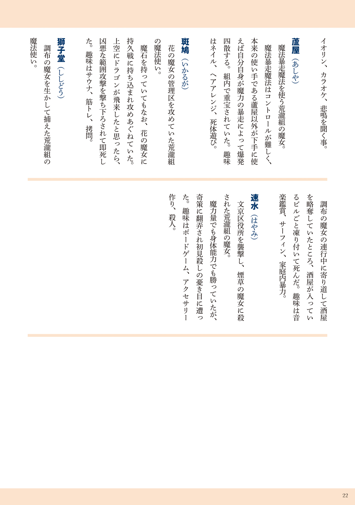

### Ashiya

An Arataki Group witch who used the magic-rampage spell.

The spell was hard to control: if anyone but Ashiya, its original user, used it carelessly, their own magic power would run wild and blow them to pieces, so the group valued her highly. Her hobbies were nail art, hairstyling, and playing with corpses.

### Ikaruga

An Arataki Group mage who attacked the Flower Witch's administrative district.

Even with a magic stone, Ikaruga couldn't break through once the Flower Witch dragged the fight into a battle of attrition. Then a dragon swooped in overhead and rained down a vicious area attack that killed Ikaruga instantly. Their hobbies were saunas, strength training, and torture.

### Shishido

An Arataki Group mage who captured the Chofu Witch alive.

While escorting her, Shishido stopped off to loot a liquor store and froze to death along with the whole building it was in. Their hobbies were listening to music, surfing, and domestic violence.

### Hayami

An Arataki Group witch who attacked Bunkyo Ward Office and was killed by the Tobacco Witch.

She beat the Tobacco Witch in both magic power and physical ability, but an unorthodox strategy ran her ragged, and she fell for a trick that only worked on someone seeing it for the first time. Her hobbies were board games, making accessories, and murder.

---

## Tokyo Guard Tournament

Since the Arataki Group's recent assault, the roles of both wizard units and security forces had been under review.

The assault had confirmed once again that security forces could not defeat Transcendents, but it had also shown that they could play a supporting role when a Transcendent took down a hostile one.

So the security forces of every district gathered at the Katsushika Ward training grounds to sharpen their skills and trade techniques through joint exercises and the like. This mattered all the more for improving their response to Class A monster anomalies, which were predicted to grow ever more intense.

The joint exercise took the form of mock battles against golems summoned by the Pebble Witch. She had lifted not a finger during the Arataki Group's assault, so the Witches' Council had pressured her (to do some work for once).

Below are the evaluations of each ward's security force (or equivalent organization), calculated from the number of golems destroyed, the number of personnel ruled unable to fight, total magic power, mobility, and other criteria.

### Kita Ward Guard — 95 points

Drilled hard by a former SDF special forces member, the Kita Ward Guard had high morale and showed training far beyond the other units.

It excelled in every respect: area suppression with magic barrages, magic sniping, improvised defensive lines, judging when to retreat, and silent messaging by hand-signal relay. It was also well practiced at giving the Northern Witch combat support.

### Dragon Ward Guard — 84 points

The Dragon Witch had dragged these guards to every corner of Japan on treasure hunts, so they had plenty of combat experience. They had already seen nearly every mishap a fight could throw at them, and they showed excellent speed and adaptability.

Out of habit, they tried to collect the large Gremlin cores of the golems they defeated, and took losses when other golems attacked while they were busy.

"That's the right answer. You fight for treasure." —The Dragon Witch

### Bunkyo Ward Guard — 80 points

Its policy was to make sure it killed every enemy it could be sure of killing. Whenever it ran into an enemy it might not beat, or one it couldn't identify, it withdrew at once without exception, passing the information to a Transcendent and handing the fight over.

Perhaps because the unit was built on the assumption of the Foresight Mage's command and protection, it fell short of its catalog specs when fighting alone.

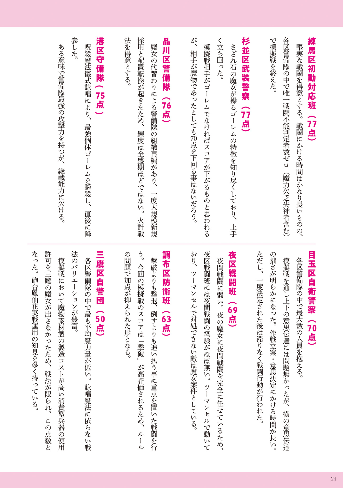

### Nerima Ward Initial Response Team — 77 points

It specialized in steady, reliable combat. Its fights took quite a long time, but it was the only district unit to finish the exercise with zero personnel ruled unable to fight, magic-power-depletion fainting included.

### Suginami Ward Armed Police — 77 points

It knew the Pebble Witch's golems inside and out and handled them skillfully.

Its score would probably drop against anything other than golems, but even against monsters, it likely wouldn't fall below 70.

### Shinagawa Ward Guard — 76 points

When the district's witch changed, the guard was reorganized, and a large wave of new hires and reassignments had left its training short of its peak. The unit excelled at fire-attack tactics.

### Minato Ward Defense Unit — 75 points

It killed the strongest golem instantly with a ritual incantation of death-curse magic, then surrendered right afterward.

In a sense, it had the strongest attack power of any security force, but it had no staying power.

### Eyeball Ward Self-Defense Police — 70 points

It had more personnel than any other district unit.

The exercise showed that communication up and down the chain of command worked fine, but communication across it was poor. Planning operations and reaching decisions took a long time, though once a decision was made, combat operations went smoothly.

### Night Ward Combat Team — 69 points

It was weak at night fighting. The Night Witch took care of all night combat, so the team itself had almost no experience with it. Its members operated in two-person cells, and any enemy a pair couldn't handle was a job for the witch.

### Chofu Ward Defense Team — 63 points

It fought to repel rather than destroy, to drive enemies off rather than kill them. This exercise's scoring rated "destroyed" highly, so the rules held its score down.

### Mitaka Ward Vigilance Group — 50 points

It had the lowest average magic power of any district unit, but a wide variety of tactics that didn't rely on incantation magic.

The Mitaka Witch wouldn't authorize expensive consumable weapons made from monster materials for the exercise, so its tactics were limited, and it ended up with this score. It had a wealth of know-how on deploying turret balsam in real combat.

### Mermaid Ward Public-Safety Team — 44 points

The Mermaid Witch handled nearly all monster extermination in Mermaid Ward, leaving the public-safety team with little combat experience. Its basic tactic, shoving enemies into a river or the sea and letting the Mermaid Witch take it from there, fell apart when the team fought alone.

### Flower Ward Extermination Detail — 40 points

The Flower Witch handled nearly all monster extermination in Flower Ward, leaving the extermination detail with little combat experience.

Its uniforms, marching, and salutes were magnificent. Strength aside, if the question was which unit looked strongest, the Flower Ward Extermination Detail would come first.

### Setagaya Ward Witch's Guard — 33 points

It had the highest average magic power of any district unit. Its skill did not live up to its attitude.

### Zombie Ward Volunteer Corps — 20 points

A mixed human-and-zombie unit. The humans plainly shunned the zombies, and the two sides couldn't coordinate at all. After the exercise, the human volunteers went straight to the supervising Eyeball Witch and begged to be allowed to move to another district.

### Tobacco Ward Blast-'Em Team — no score

The instant its exercise began, the team hauled members of other districts' security forces out of the spectator area and onto the battlefield as reinforcements. In the chaos that followed, by the time the entire Tobacco Ward Blast-'Em Team had been ruled unable to fight, every golem except the strongest had been destroyed.

The rules did not forbid the tactic, but it was impossible to evaluate, so the team received no score.

### Reference: The Blue Witch — over 2,000 points

Invited to give a model demonstration, the Blue Witch fought so far beyond everyone's expectations that she broke the scoring system. Her one-sided, joyless beatdown brimmed with cold killing intent aimed at dispatching her opponents as efficiently as possible, which terrified the spectators and sucked the life out of the venue.

---
## Survivor Communities of Japan

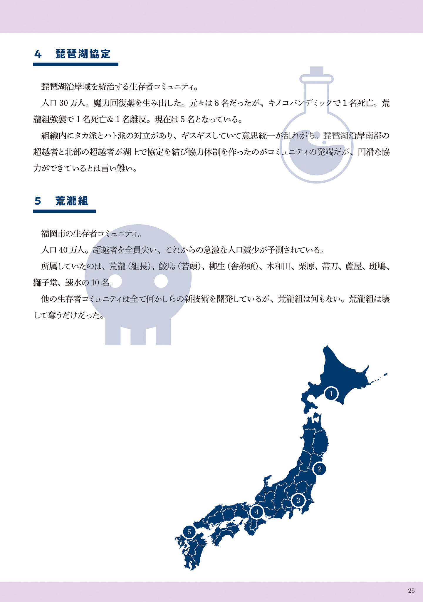

### 4. Lake Biwa Pact

A survivor community governing the shores of Lake Biwa.

Population: 300,000. It created magic-power recovery medicine. It originally had eight Transcendents, but one died in the mushroom pandemic. One died and another defected during the Arataki Group's assault, leaving five.

Split between hawks and doves, the organization was full of friction and often couldn't agree on anything. The community began when the Transcendents of Lake Biwa's southern and northern shores made a pact on the lake and set up a cooperative structure, but their cooperation could hardly be called smooth.

### 5. Arataki Group

A survivor community in Fukuoka City.

Population: 400,000. It lost every Transcendent it had, and its population was expected to decline rapidly.

Its ten Transcendents were Arataki, the gang boss; Samejima, the Young Boss; Yagyu, the Junior Boss; Kiwada; Kurihara; Tatewaki; Ashiya; Ikaruga; Shishido; and Hayami.

Every other survivor community had developed some kind of new technology. The Arataki Group had nothing. All it did was destroy and steal.

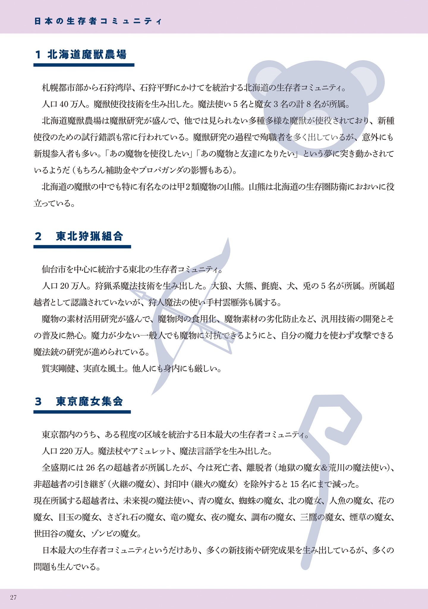

### 1. Hokkaido Magic Beast Farm

A Hokkaido survivor community governing the area from metropolitan Sapporo through the coast of Ishikari Bay and across the Ishikari Plain.

Population: 400,000. It created magic-beast-handling technology. Eight Transcendents belonged to it: five mages and three witches.

Magic-beast research flourished at the Hokkaido Magic Beast Farm, which put a wider variety of magic beasts to work than anywhere else and was always experimenting with handling new species. The research had cost many people their lives, yet surprisingly many newcomers still signed up, apparently driven by dreams like "I want to handle that monster" or "I want to be friends with that monster." (Subsidies and propaganda played a part too, of course.)

The most famous of Hokkaido's magic beasts was the Mountain Bear, a Class A-2 monster, which did a great deal to defend Hokkaido's survival zone.

### 2. Tohoku Hunting Association

A Tohoku survivor community governing the area around Sendai.

Population: 200,000. It created hunting-magic technology. Its five recognized Transcendents were <ruby>Okyaku<rt>Great Wolf</rt></ruby>, <ruby>Itazu<rt>Great Bear</rt></ruby>, <ruby>Aokera<rt>Serow</rt></ruby>, Dog, and <ruby>Iwatsura<rt>Rabbit</rt></ruby>. Murakumo Kariya, the user of hunter magic, also belonged to it, though he wasn't recognized as one of its Transcendents.

Research into putting monster materials to use flourished there, and the association was eager to develop and spread general-purpose techniques, such as making monster meat edible and keeping monster materials from degrading. So that ordinary people with little magic power could stand up to monsters, it was also researching magic guns that could attack without drawing on the user's own magic power.

Its culture was simple, sturdy, and honest, and its people were strict with outsiders and their own alike.

### 3. Tokyo Witches' Council

Japan's largest survivor community, governing part of Tokyo.

Population: 2.2 million. It created magic wands, amulets, and magic linguistics.

At its peak, twenty-six Transcendents belonged to it. Leaving out the dead, those who had left (the Hell Witch and the Arakawa Mage), the one whose post passed to a non-Transcendent (the Flame Heir Witch), and the one under seal (the Flame Witch), it was down to fifteen.

Its current Transcendents were the Foresight Mage, Blue Witch, Spider Witch, Northern Witch, Mermaid Witch, Flower Witch, Eyeball Witch, Pebble Witch, Dragon Witch, Night Witch, Chofu Witch, Mitaka Witch, Tobacco Witch, Setagaya Witch, and Zombie Witch.

As befitted Japan's largest survivor community, it produced a great deal of new technology and research. It also produced a great many problems.

---

## Tokyo Magic University Paper Archive

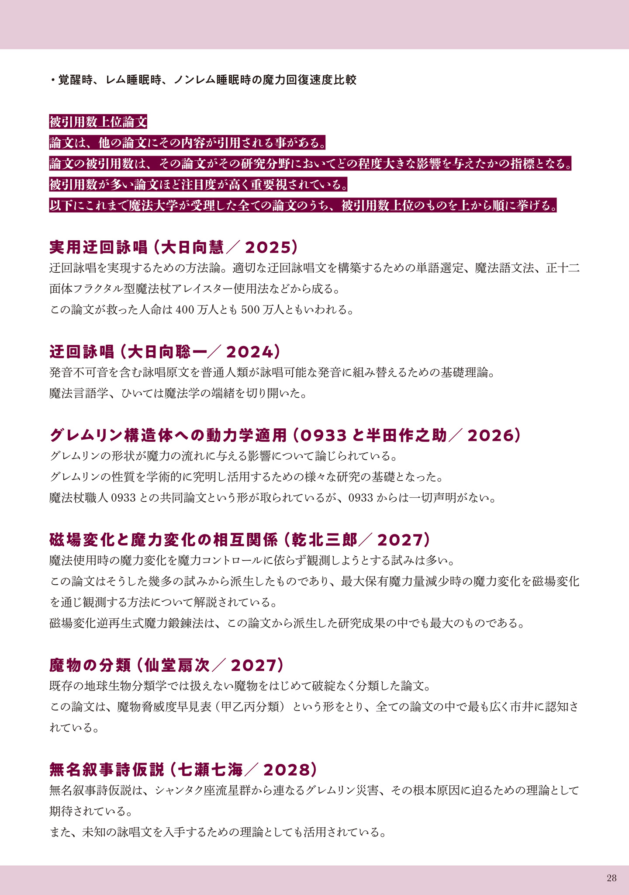

- Comparison of magic-power recovery rates while awake, during REM sleep, and during non-REM sleep

### Most-Cited Papers

A paper's contents were sometimes cited by other papers, and its citation count showed how much influence it had had on its field. The more citations a paper had, the more attention and weight it received.

Below, in descending order, are the most-cited of all the papers Tokyo Magic University had accepted to date.

#### Practical Bypass Incantation — Ohinata Kei, 2025

A methodology for making bypass incantations practical. It covered word selection for constructing a suitable bypass incantation, magic-language grammar, and use of the dodecahedral fractal wand Aleister, among other subjects.

This paper was said to have saved four million lives, or even five million.

#### Bypass Incantation — Ohinata Soichi, 2024

The foundational theory for rearranging an original incantation containing unpronounceable sounds into sounds ordinary humans could pronounce.

It opened the way for magic linguistics, and by extension the entire study of magic.

#### Application of Dynamics to Gremlin Structures — 0933 and Handa Sakunosuke, 2026

A discussion of how Gremlin shape affected the flow of magic power.

It became the foundation for many studies seeking to understand Gremlin properties academically and put them to use.

It took the form of a paper coauthored with Wand Maker 0933, though 0933 had never made any public statement about it.

#### Correlation Between Magnetic-Field Change and Magic-Power Change — Inuikita Saburo, 2027

There had been many attempts to observe changes in magic power during spellcasting without relying on magic-power control.

This paper grew out of those attempts and explained how to observe the change in magic power when maximum magic-power capacity decreased by way of the accompanying change in the magnetic field.

The Magnetic-Field-Change Reverse-Playback Magic-Power Training Method was the greatest result to grow out of this paper.

#### Classification of Monsters — Sendo Senji, 2027

The first paper to classify monsters, which existing terrestrial biological taxonomy couldn't handle, without the system breaking down.

It took the form of the monster threat-level quick reference, with its Class A, B, and C divisions, and became the best known of all papers among the general public.

#### Nameless Epic Hypothesis — Nanase Nanami, 2028

The Nameless Epic Hypothesis was expected to help get at the root cause of the Gremlin Disaster that followed the Shantak Meteor Shower.

It was also used as a theory for obtaining unknown incantations.

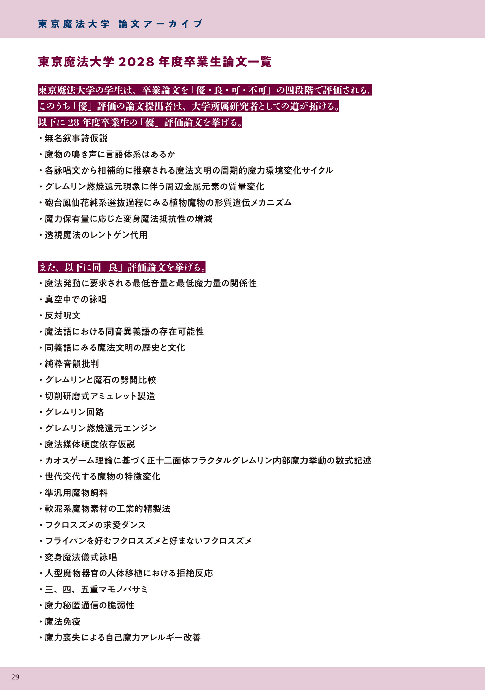

### Tokyo Magic University 2028 Graduate Papers

Tokyo Magic University graded student theses on four levels: Excellent, Good, Pass, and Fail. A student whose paper received an Excellent could continue on the path to becoming a university researcher.

The 2028 graduating class's Excellent papers were:

- Nameless Epic Hypothesis
- Do Monster Cries Have a Language System?
- Cycles of Periodic Change in the Magical Environment of Magic Civilization, Inferred Complementarily from Individual Incantations
- Changes in the Mass of Nearby Metallic Elements During Gremlin Combustion-Reduction Phenomena
- Mechanisms of Hereditary Traits in Plant Monsters Seen in the Pure-Line Selection of Turret Balsam
- Changes in Resistance to Transformation Magic by Magic-Power Capacity
- Clairvoyance Magic as a Substitute for X-Rays

The following papers received Good:

- Relationship Between the Minimum Vocal Volume and Minimum Magic Power Required to Activate Magic
- Incantations in a Vacuum
- Counterspells
- The Possible Existence of Homophones in the Magic Language
- The History and Culture of Magic Civilization Seen Through Synonyms
- Critique of Pure Phonology
- A Comparison of Cleavage in Gremlin and Magic Stones
- Amulet Manufacture Through Cutting and Polishing
- Gremlin Circuits
- Gremlin Combustion-Reduction Engines
- The Magic-Medium Hardness-Dependence Hypothesis
- A Mathematical Description of Magic-Power Behavior Within Dodecahedral Fractal Gremlin Based on Chaos Game Theory
- Changes in the Characteristics of Monsters Across Generations
- Semigeneral-Purpose Monster Feed
- Industrial Refining of Slime-Type Monster Materials
- Pouch Sparrow Courtship Dances
- Pouch Sparrows That Like Frying Pans and Pouch Sparrows That Do Not
- Ritual Incantations for Transformation Magic
- Rejection Responses in the Transplantation of Humanoid Monster Organs into the Human Body
- Triple, Quadruple, and Quintuple Monster Traps
- Vulnerabilities in Covert Magic-Power Communications
- Magical Immunity
- Improvement of Self-Magic-Power Allergies Through Loss of Magic Power

---

## Okutama Minister of Defense: Operational Directive

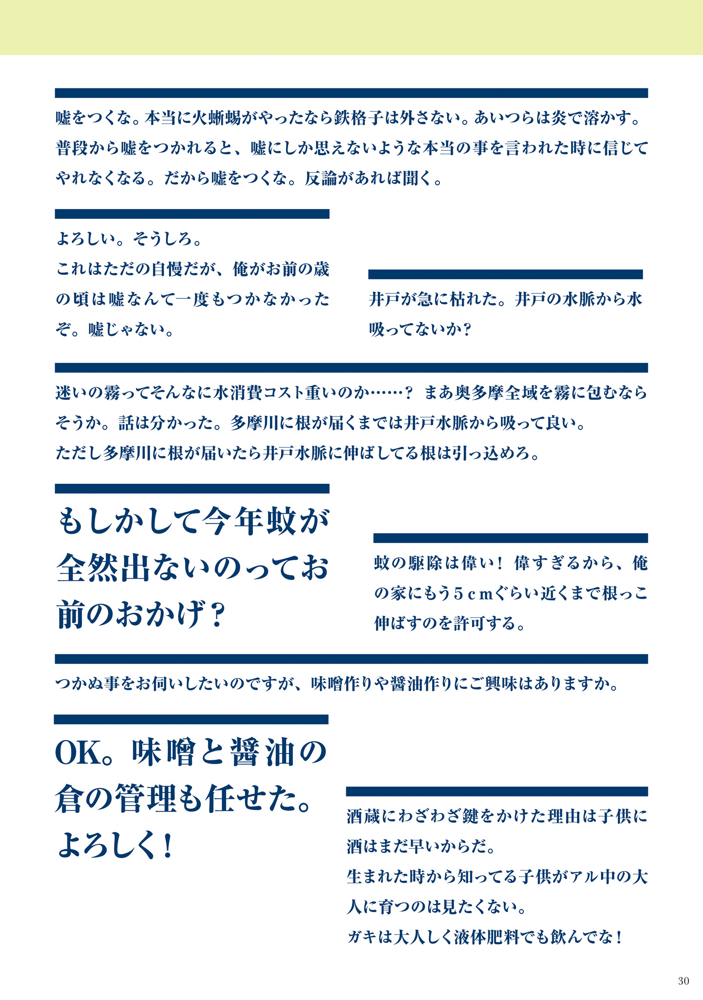

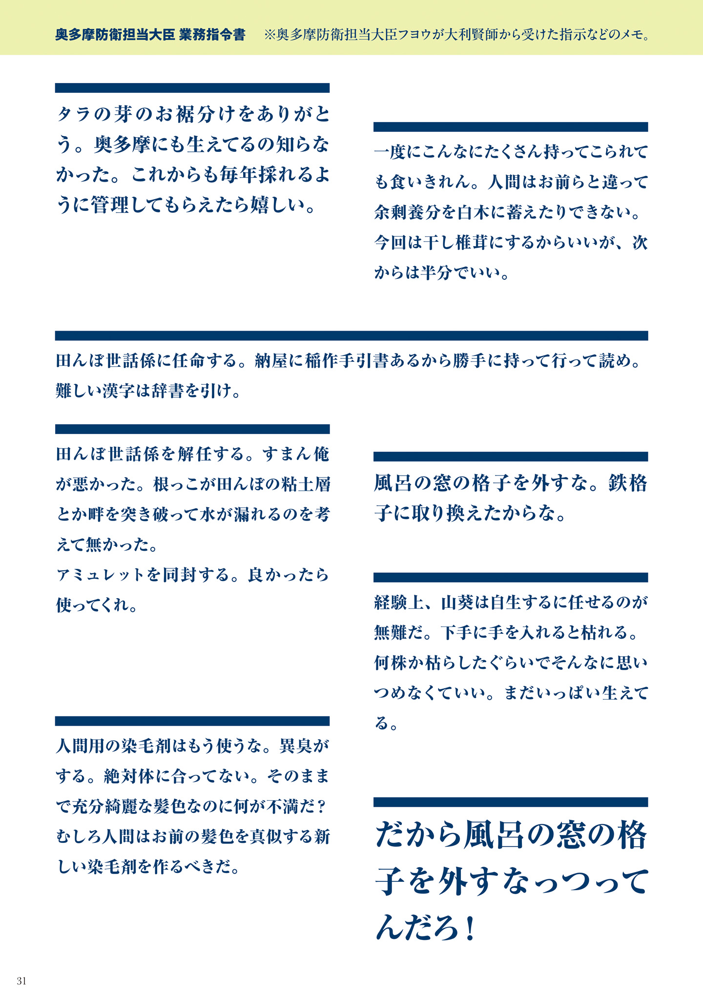

*Memos of instructions and similar messages that Fuyo, the Okutama Minister of Defense, received from Ori Kenshi.*

> Thanks for sharing the angelica-tree shoots. I didn't know they grew in Okutama too. I'd be happy if you looked after them so we can pick them every year.

> Don't bring me this many at once. I can't eat them all. Unlike you guys, humans can't store surplus nutrients in whitewood. This time I'll make dried shiitake out of them, so it's fine, but half as much is plenty from now on.

> I'm appointing you caretaker of the rice field. There's a rice-growing manual in the shed, so help yourself and read it. Look up the hard kanji in a dictionary.

> I'm relieving you as caretaker of the rice field. Sorry, my bad. I didn't think about your roots punching through the clay layer under the field and the ridges between the paddies and letting the water leak out.

> I'm enclosing an amulet. Use it if you want.

> Don't take the lattice off the bathroom window. I swapped it out for iron bars, you know.

> In my experience, the safest thing is to let wasabi grow wild. Mess with it and it dies. Don't beat yourself up so much over killing a few plants. There are still plenty growing.

> Stop using human hair dye. It smells weird, and it's definitely not agreeing with your body. Your hair color's already beautiful the way it is, so what's the problem? If anything, humans should make a new dye that copies your hair.

> I told you, don't take the bars off the bathroom window!

> Don't lie. If the fire salamanders really did it, they wouldn't have taken the bars off. They'd have melted them with fire.
>
> If you lie all the time, then when you tell me something true that only sounds like a lie, I won't be able to believe you. So don't lie. If you've got an objection, I'll hear it.

> Good. Do that.
>
> This is just me bragging, but when I was your age, I never told a single lie. That's not a lie.

> The well suddenly dried up. You aren't sucking water out of its vein, are you?

> Does the Lost Mist really cost that much water...? Well, I guess it would if you're wrapping all of Okutama in it. Okay, I get it. You can draw from the well's vein until your roots reach the Tama River. But once they do, pull back all the roots you've got in the well's vein.

> Wait, is it thanks to you that there are no mosquitoes at all this year?

> Getting rid of the mosquitoes: good job! Such a good job that I'll let you grow your roots about 5 centimeters closer to my house.

> This may be rather out of the blue, but might I ask whether you have any interest in making miso and soy sauce?

> Okay. I'll leave the miso and soy-sauce storehouses to you too. Thanks!

> The whole reason I went to the trouble of locking the sake storehouse is that you're still too young to drink.
>
> I don't want to watch a kid I've known since the day she was born grow up into an alcoholic.
>
> Kids should shut up and drink their liquid fertilizer!

---

## Short Stories

### Flower Language

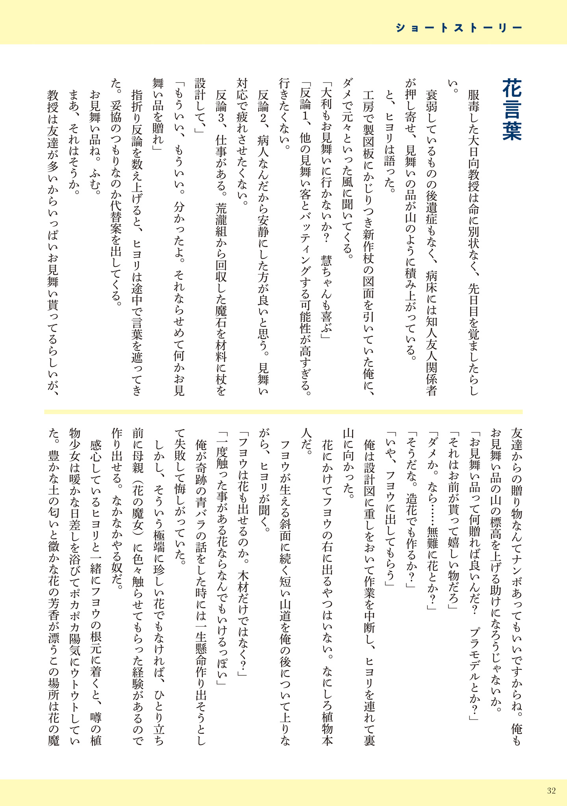

Professor Ohinata had survived being poisoned and had apparently woken up the other day.

Though she was still weak, she had no lasting damage. Friends, acquaintances, and associates had flooded into her hospital room, where gifts were piled into a mountain.

Or so Hiyori told me.

She asked while I was hunched over the drafting board in the workshop, drawing up plans for a new wand, and she clearly didn't expect a yes.

"Ori, do you want to visit her with me? Kei-chan would be happy."

"Objection one: The chances of running into other visitors are way too high. I don't want to go.

"Objection two: She's sick, so she should rest. I don't want to tire her out by making her deal with another visitor.

"Objection three: I have work. I'm designing a wand around the magic stones we recovered from the Arataki Group, and—"

"Enough, enough. I get it. Then at least send her a gift."

I was counting my objections off on my fingers when Hiyori cut me short and offered an alternative, apparently by way of compromise.

A get-well gift. Hmm.

Well, fair enough.

The professor had plenty of friends and was apparently drowning in gifts, but you could never have too many gifts from friends. I'd do my part to raise the elevation of that mountain.

"What do you give someone in the hospital? A plastic model or something?"

"That's something *you'd* want."

"No good, huh? Then... something safe, like flowers?"

"Sure. Going to make some artificial ones?"

"Nah, I'll have Fuyo grow some."

I set a weight on the plans, put my work aside, and took Hiyori up the mountain behind the house.

When it came to flowers, nobody could top Fuyo. She was a plant herself, after all.

Hiyori asked as she followed me up the short trail to the slope where Fuyo grew.

"Fuyo can produce flowers too? Not just lumber?"

"Seems like she can grow any flower she's touched before."

When I'd told her about the miraculous blue rose, she had tried her hardest to make one and failed, and she'd been terribly frustrated about it.

Anything short of a freak rarity like that, though, she could manage, because before she struck out on her own, her mother, the Flower Witch, had let her touch all sorts of flowers. Not bad at all.

Hiyori was suitably impressed. When we reached Fuyo's roots, the plant girl in question was dozing, basking in the warm sunshine. With its rich smell of soil and faint scent of flowers, this spot was the little sanctuary of the Flower Witch's beloved daughter.

The moment I came near, Fuyo's eyes popped open and she beamed.

"Mm. Morning, Uncle♡"

"Morning."

"Morning, Blue Witch."

"Morning."

"Fuyo, I need you to grow some flowers. Can you do that?"

"Flowers?"

Fuyo cocked her head, and I explained.

Fuyo had no connection to Professor Ohinata and had never met her. But I'd brought the professor up plenty of times, so she had a vague idea of what sort of stoat she was.

I'd figured she wouldn't say no once she heard the gist. But the more I told her, the sterner her face got, and by the time I finished, she had puffed out her cheeks and turned away.

You could practically hear the *hmph!* She was sulking, and not subtly.

What now? What's the matter?

"No."

"No what?"

"You're using me to give another woman a present...!"

"What are you talking about?"

Seriously, what is she talking about?

While I stood there baffled, Fuyo glared, her eyes flashing, and whipped a tendril down hard against the ground.

"Don't play dumb. Be nicer to me. Stop exploding me!"

"*Exploiting.*"

She was oddly emotional, and her vocabulary was slipping, but I understood what she meant.

Then again, maybe asking a favor without offering anything in return had been wrong. It was basically like having a florist put together a get-well gift for a friend. Making her work without paying her didn't sit right.

"All right, got it. I'll pay you. Say, a thousand new yen or so."

"No! I won't do it!"

"Huh...? What's your deal? Well, whatever. If you don't want to, you don't want to. I'll ask another florist. Sorry to bother you."

For Fuyo, this should have been a sweet gig: pocket money for doing what she was best at.

But apparently she wasn't in the mood.

It happens. I get it, Fuyo. There are jobs I don't want to take even if someone stacks up a fortune in front of me.

Out of respect for her as a maker, I turned to go, but one of Fuyo's tendrils shot out, grabbed my shoulder, and held me back.

When I looked back, Fuyo was frowning, and she spoke with obvious reluctance.

"I-I never said I wouldn't."

"You just did."

"I didn't. I'll do it before some other florist steals you."

"Yeah? Well, if you'll do it, I'd appreciate it..."

"Compliment me lots in return."

"That's all? All right. Thanks for doing me this favor, Fuyo. You're amazing! Incredible! Master florist! Look at those thick leaves! That color on the petals is *perfect!* Are you growing a tiny forest on that trunk or what?!"

"Ehe♡ Ehehehe♡"

Compliments were a cheap price for getting her motivated. I heaped on the praise exactly as ordered, and Fuyo wriggled her tendrils and her whole trunk in delight.

Good, good. I'll give her some pocket money later, too.

A little praise was all it took to blow away the kid's bad mood and fire her up. I was nodding in approval when Hiyori, who had been watching in silence, leaned in and whispered in my ear.

"Ori, do you always toy with Fuyo like this?"

"Huh? I'm not toying with her. Don't make it sound so bad. I mean, sometimes she throws a childish tantrum, so I teach her how things work, sure, but—"

"You don't even realize it. What a vicious communication error..."

Hiyori looked a little creeped out.

That's slander. Sure, I'm terrible with people, and everyone including me will admit it. But I'd like them to stop slapping that label on every last thing I do.

That was a perfectly successful exchange! I asked her for flowers, we negotiated terms, and we struck a deal. Nothing weird about it.

"For visiting a sick human~, my pick is banyan! Its flower meaning is 'health.' And there's rapeseed. Its flower meaning is 'energy.' Which one do you want?"

In high spirits now, Fuyo promptly sprouted two flowers at her roots: a banyan with weird, knotted roots and a purple flower like a morning glory, and a rapeseed blossom of a yellow so bright it dazzled.

Hmm.

"They're both good, but as long as we're at it, I want something more interesting."

"You want interesting? Then Sarracenia has an interesting flower meaning. It means 'a bit eccentric.'"

As she spoke, Fuyo sprouted a slightly odd flower at her roots, shaped like a clump of shimeji mushrooms.

Exactly what it looks like. A bit odd.

"It's interesting, so it's in! Let's make the Sarracenia the centerpiece and put a few other kinds of flowers around it. Got any good ones?"

"Hmm...? What would be good...? If we're choosing by flower meanings..."

"Don't worry about the meanings. Let's go by looks for now."

Gemstone meanings I know, but flower meanings, no clue. Maybe I should have studied up.

"Looks. There's cute ones, and pretty ones, and lots more."

"Since it's a get-well gift, color psychology says we should stick to warm colors. Let's build around the Sarracenia's color and vary it with lighter and darker shades. The Sarracenia already makes plenty of impact, so the rest can be supporting players that set it off without standing out too much."

Fuyo sprouted flower after flower to order, and we talked it over as we picked.

As she worked hard at blooming, her own petal skirt grew larger and more vivid than ever. I wouldn't go so far as to say every other flower paled beside her, but she was spectacular.

Come to think of it, maybe the best thing would be for Fuyo herself to visit the professor's bedside.

"Fuyo, you and the Flower Witch are flowers, right? In your own eyes, anyway. Do you guys have flower meanings?"

"Huh. I never thought about it... I know! Uncle, you think up a flower meaning for me."

"Selfish. Cheeky."

The instant I answered, the selfish, cheeky humanoid flower poked my shoulder with the tip of a tendril.

"Mmph! Think about it for real!"

"Like I'd know. The only flower meanings I know are banyan, rapeseed, and Sarracenia. Hiyori, got any good ideas?"

When I passed the question to Hiyori, who had been standing around with nothing to do, she sighed at me.

"Don't ask me. Look, Fuyo doesn't want a nice flower meaning. She wants *you* to actually put some feeling into thinking one up."

"Yes, that! Blue Witch gets it. Tell him more! Uncle's got no delicacy!"

Fuyo nodded hard at every word, and the two of them ganged up on me.

What? So it's my fault? I guess it is.

Sorry, but delicacy isn't something my shop carries.

"I don't really get it, but by that logic, if I put my feelings into it, even 'poop' or 'fart' would make a fine flower meaning, right? That's not fine at all."

"You really don't get it..."

Hiyori muttered it with a face you could have hung in a frame titled *Exasperation*, and nobody would have argued.

Yeah, that's what I've been saying. I don't get it.

"Instead of making an issue of my feelings or whatever, which you can't measure quantitatively, wouldn't it be better to pick a word that accurately captures the appearance, traits, and essence of the Flower Witch's species and is lyrical besides? Actually, can you even just make up flower meanings? Aren't they decided officially, the way a scientific name gets assigned by an academic body the scholarly community recognizes, or by the discoverer?"

When I finished laying out my position and my questions, Fuyo just blinked at me, mouth half open. Maybe that had gone a little over her head.

Hiyori heaved an enormous sigh and explained that the sampling and naming of all the plants and animals that had appeared since the Gremlin Disaster was still very much in progress.

The Hokkaido Magic Beast Farm and the Tohoku Hunting Association had given the same new plant two different names. A grass in the Lake Biwa Pact's records and a tree in the Tokyo Witches' Council's records had turned out to be one species in two different forms. Just merging the data from across Japan meant no end of trouble, and no end of discoveries.

Other members of the Flower Witch's species might be out there somewhere in the world, the same way Hiyori had turned out to share a species with the Arataki Group boss, and one of them might already have a flower meaning.

Or maybe there were no others at all besides mother and daughter, in which case they could claim any flower meaning they liked. The truth was fuzzy and unconfirmed.

Fuyo's mother had taught her not only Earth's native flowers but the flowers of plant-type monsters too. From turret balsam to jewel dayflowers, snow sunflowers, and bubble-flower balloons, none of the new species she knew of seemed to have a flower meaning.

She was still a little kid who read picture books, but when it came to flowers, she knew her stuff. I was kind of impressed.

She's a flower, so I guess she just likes flowers. If I weren't dexterity personified, I probably wouldn't love beavers and spiders as much as I do, either.

We had gotten sidetracked, but Fuyo, grumbling all the while, finished the get-well flowers properly.

The result was a potted arrangement we were both proud of: Sarracenia in the center, with dandelions and pansies around it, all pulled together in shades of yellow.

Fuyo and I high-fived, hand to tendril. You've got a real talent for ikebana or bonsai.

"Hey. Why is it in a pot? Cut them and make a normal bouquet."

Just when I thought Professor Ohinata's gift was finally done, Hiyori, for some reason, found fault with it.

She put her hands on her hips and lectured us as though *we* were the ones with no common sense.

"Potted plants are taboo for hospital visits. The plant's rooted in soil, right? *Taking root* sounds like *taking to bed*, which suggests the illness will drag on. It's bad luck. Use cut flowers."

"Huh...?"

She said it like it was common knowledge, but it didn't click.

What is that, some far-fetched nonsense from an obnoxious etiquette instructor?

By that logic, Hiyori is bad luck because her name sounds like *hiyoru*, "to play it safe," and since I'm Ori Kenshi, I'm fated to become a kenshi, a swordsman.

Fuyo, who by the same reasoning stood accused of being *fuyou*, "unneeded," didn't get it either. She prodded her prize potted arrangement with a tendril, bewildered.

"Then you give sick humans dead flower bodies for presents...? Isn't *that* scarier?"

"Give someone cut flowers and they have to lie in a hospital bed watching them wither. Isn't that depressing?"

"Why is it two against one on this? It's manners. Manners. Don't think too hard about it. Just follow them. What matters isn't your twisted, ah, original ideas. It's that Kei-chan can take the gift and be happy without anything nagging at her."

"Human society is such a pain..."

I meant it from the bottom of my heart, and Fuyo nodded deeply.

Human society is a bizarre, tangled mess. Way more than I can handle.

Still, if Okutama's minister of foreign affairs said no, then it really had to be no. The special potted arrangement we'd worked so hard on was scrapped.

We had designed it to sit in a pot, so cutting the flowers would wreck the whole look.

At this point, maybe fruit would be better than flowers, with all their fussy manners and taboos. When I was in the hospital with appendicitis, Hiyori had peeled apples and mandarins for me, and that had made me happy. Surely nobody would find fault with fruit, too.

The whole thing had kind of fizzled. When I apologized to Fuyo for putting her to all that trouble only to throw her work away, she asked for one thing in return.

"Then choose flowers for me. Make me a bouquet."

"You want flowers? You can make your own. Besides, you just picked and grew a whole arrangement."

"Those were for the stoat. Choose some for *me.* New ones. I'll treasure them."

"Huh. Well, fine."

Did that mean she was counting on my aesthetic sense and my eye for picking?

Then leave it to me. Flowers aren't my field, but I'm confident it won't turn out awful.

Delighted, Fuyo sprouted one colorful candidate after another at her roots, and from those I picked a morning glory first.

When it came to flowers for a little kid, tulips or morning glories were the standard picks.

"The flower meaning of a morning glory is 'affection.' Your feelings make me so happy, Uncle♡"

Fuyo puffed out her chest with a smug look and shot Hiyori a sidelong glance. Hiyori shrugged without a word.

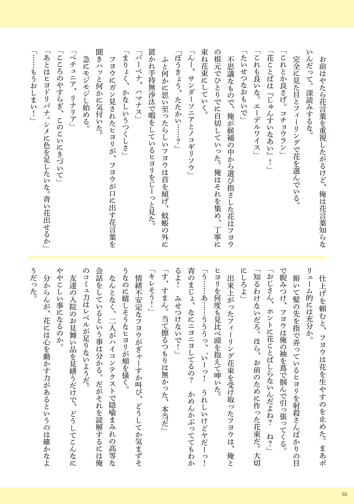

You keep making a big deal of flower meanings, but I told you, I don't know any. Don't read into it.

I was picking purely on looks and feel.

"This one looks nice. Moth orchid."

"Its flower meaning is 'pure love'!"

"This is nice too. Edelweiss."

"'Precious memories.'"

Oddly enough, whenever I pointed out a flower among the candidates, it snipped itself off at Fuyo's roots on its own. I gathered them up and carefully bound them into a bouquet.

"Mm... Sandersonia and yarrow."

"'Homesickness' and 'battle'...?"

Something seemed to occur to Fuyo. She tilted her head and stared hard at Hiyori, who had been left out of things and was standing around idle.

"Verbena. Rugosa rose."

"'Magic' and 'sad beauty.'"

Under Fuyo's stare, Hiyori listened to the flower meanings Fuyo was reading out and suddenly caught on.

She started fidgeting.

"Petunia. Toadflax."

"'Peace of mind' and 'notice this love.'"

"And last, some thoroughwort.[^1] I want to add one more color to top it off. Can you do a blue one?"

"...That's enough!"

When I asked for the finishing touch, Fuyo stopped growing flowers. Well, it had plenty of volume already.

Fuyo glared daggers at Hiyori, who was looking down and twisting the ends of her hair around her finger, then caught my sleeve with a tendril and tugged.

"Uncle, you really don't know flower meanings, right? Right?"

"Of course I don't. Here, this is the bouquet I made for you. Take good care of it."

Fuyo took the bouquet I'd put together on pure feel, looked back and forth between Hiyori and me several times, then clutched her head and groaned.

"Ugh... Ah... Uuugh, nnngh! I'm happy, but I hate it! Blue Witch, what are you smirking about? I can tell even with your mask on! Stop showing off!"

"S-sorry. I wasn't trying to rub it in. Really."

"I'm gonna lose it!"

Fuyo, an emotional wreck, shrieked and squawked, while Hiyori, somehow looking awkward and pleased at once, scratched her cheek.

I could sort of tell the two of them were having some sophisticated, high-context exchange loaded with metaphor. But my communication stat apparently wasn't leveled up enough to decode it.

How had picking out a get-well gift for a friend in the hospital gotten this complicated?

I had no idea. But one thing seemed certain: flowers had the power to move people's hearts.

---

## Colophon

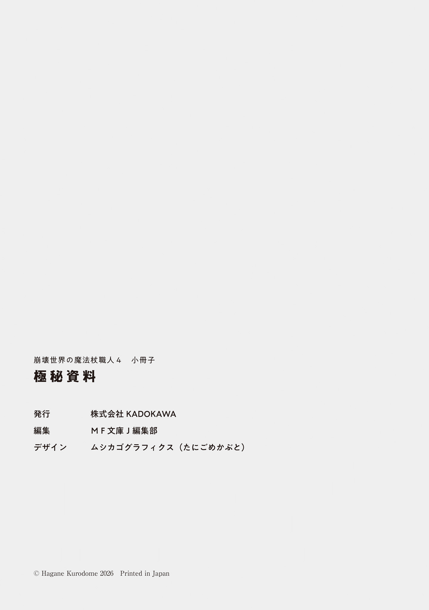

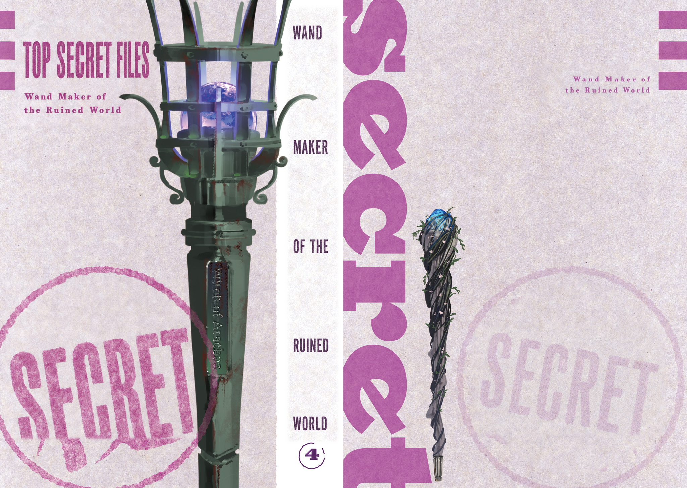

## Translator Notes

[^1]: **Thoroughwort** (ヒヨドリバナ, *hiyodoribana*): The flower's Japanese name begins with the same sounds as Hiyori's, and Ori asks for it in blue, the Blue Witch's color.
