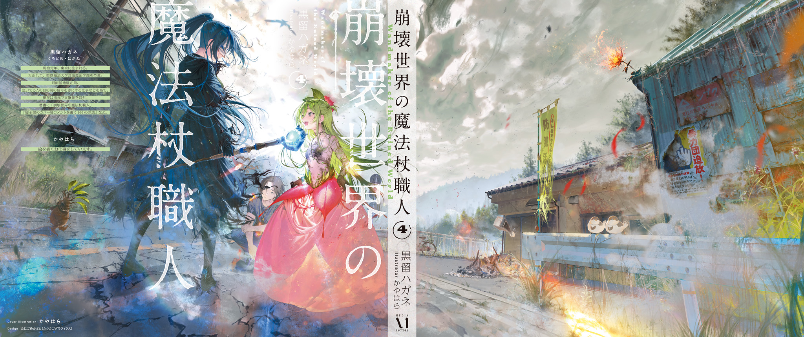

It was a hot, muggy night.

Okutama was heading into the height of summer, and even with the windows wide open, the air was hot and sticky. Lately I'd been making an ice pack with freezing magic and using it as a pillow.

The sheer heat woke me from a nightmare where I was slurping piping-hot ramen at a kotatsu[^1], surrounded by lava.

Even for summer, this was hot. Man, it's hot, it's so hot, I thought as I sat up, blearily rubbing my eyes, and the cause of the abnormal heat jumped right out at me.

“Mii.”

“Mi.”

“Mimimi!”

The three fire salamanders had invaded my bedroom, and they cried happily when they saw I was awake.

They'd hauled six-inch nails, heating wire, and a monkey wrench into the room in their mouths and were busily welding them to the walls and floor as metal reinforcement.

“Y-You guys...!”

“Miimi!”

While I clutched my head, Mokutan ran over, tail wagging, and handed me a rusty razor blade.

The three carried on with total confidence, never doubting for a second that their rampage was a kindness, breathing fire to melt metal and clutter up the room with it.

No wonder it was hot. The whole room was ringed with heated metal that smelled a little scorched, like a sauna. No, like the inside of an oven.

Fire salamanders had a habit of reinforcing their nests with metal. It looked like they'd seen my nest (the bedroom) was short on metal and thoughtfully pitched in to help me build it.

Thanks, you idiots!

“Talk about help I didn't ask for... Okay, the window, open the window... It won't open! The frame's welded shuuut! The door... The door too! I'm trapped!”

“Miimimi.”

“Mimimiimi.”

“Mimiimi!”

The three crawled up an iron pipe welded to the wall and onto the ceiling, where they cheerfully got to work reinforcing it with metal.

The sealed-off bedroom kept getting hotter and hotter, and sweat poured off me like a waterfall. No way. At this rate, my pets are going to steam me alive!

“Hey, stop it, stop it. Tsubaki, Sekitan, Mokutan, assemble! Wait! Stay!”

I called them together to put a stop to any more bedroom-wrecking.

The fire salamanders lined up on the low writing desk, which they'd haphazardly welded crushed empty cans onto, looking surprised and confused by the anger in my voice.

“Mii~?”

“Mimi...”

“Mimimi...?”

I didn't need to understand their language to know how they felt. Their faces said, “We thought you'd praise us, so why are you mad?”

I got that they'd pulled this stunt out of kindness.

I got it, but...

“Could you stop? 'Cause I'm going to die.”

“Mi?”

“No breathing fire in the bedroom.”

“Mimi?”

“Look, my nest is fine just the way it is. You don't need to reinforce it with metal.”

“Mimimi?”

“Yeah, that doesn't really make sense to you, huh? Let's make this simple. If you breathe fire here, this is what happens!”

I hauled the fire extinguisher out from under the bed and pointed the nozzle at them, and the three fire salamanders leapt in shock and scrambled off in a flailing panic.

They charged the door and smacked their heads into it, realized they'd welded it shut themselves, and dithered for a moment before breathing fire on the weld to open a small hole.

Once the fire salamanders had crawled out through the hole and scattered, I threw myself against the door, smashed through it, and somehow made it out of the bedroom.

After I'd nearly been steamed alive, even the lukewarm air of a sweltering night felt like a blast from an AC set to 18°C.

What a night. That was one hell of an accident.

Anyway, I'm going to go get some water. I've sweated way too much.

Tonight, that glass of water is sure to taste like the water of life itself, better than anything else...

## Translator Notes

[^1]: **Kotatsu** (こたつ): A low table with a heater and quilt underneath.
