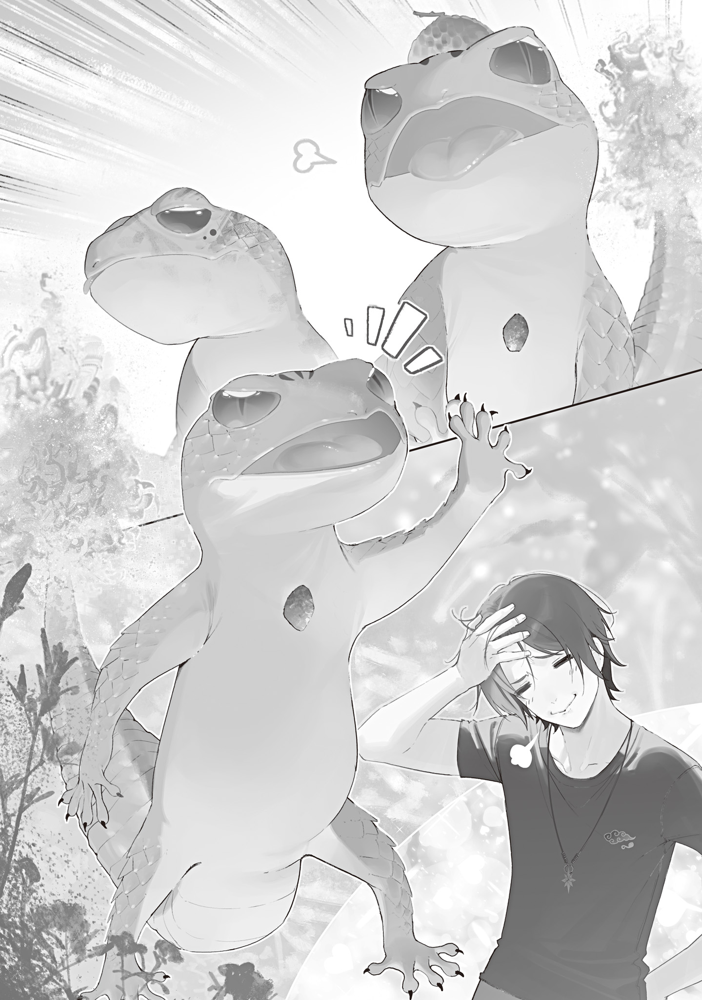

Just over a year ago, I acted as midwife when the Flower Witch's second daughter was born.

The daughter plant had been soft and squishy, a tiny baby small enough to hold in both hands, but in no time at all, she'd grown to about the size of an elementary schooler.

She'd grown fast, but her face looked so much like the Flower Witch's that it was obvious they were related.

“Uncle, I've been looking for you foreeeever. I wanted to see you♡”

The daughter plant slid right up, wrapped both arms around my waist, and held me tight. Then she wound vines and roots tightly around my legs.

The blood drained from my face.

The story that the Flower Witch ate people crossed my mind. Like mother, like daughter.

“Uh, er, ah... P-Please don't eat me...!”

“Huh? Oh, sorry...!”

When I squeezed out a plea for my life, the daughter plant hurriedly released me and moved a little away. Even then, the tips of her thin vines kept lightly brushing my hands, but they didn't feel like they were trying to squeeze.

Or rather, even the strength she'd used to hold me hadn't been enough to suggest she was trying to strangle me to death.

R-Right?

She's not thinking something terrifying like, I'll squeeze my lifesaver to death, kill him, and suck him dry, right?

It's okay to think that, right?

“Mee...!”

“Mii...!”

“Mimimi...!”

My fear spread to the fire salamanders too. Sekitan and Mokutan curled up in my hands, while Tsubaki hid behind my legs, making itself as small as it could.

Crap. My reliable guards had gotten intimidated. All because I wasn't standing proud like a boss...!

“U-Um, it's true the Flower Witch told me, ‘You should come show your face every once in a while,’ but, uh, I didn't mean anything bad by it. I wasn't trying to neglect her or anything, it's just, um, I don't like going out. I'll come if I'm summoned, so p-p-please go easy on me...”

If the Flower Witch and her daughter plant had a reason to contact me, that had to be it.

As I turned into a super-vibration human shaker and shook Sekitan and Mokutan around while groveling, the daughter plant blinked and tilted her head.

“??? I don't really get it. Oh! Hey, hey, I've got a letter from Mommy. I'll give it to you, Uncle.”

The daughter plant rummaged around inside her petal skirt and held out a letter to me.

Trembling all over, I set the fire salamanders in my hands down on the ground. I was shaking so badly that I missed the letter several times. Once I finally got hold of it, I read it, still trembling all over.

This letter's pretty long. And isn't the writing shaky too? No, that's because I'm shaking.

To the benefactor of my beloved daughters,

It has been a long time. This is the Flower Witch.

More than a year has passed without my even asking your name, the seasons have turned, and spring has come.

I have occasionally had the Foresight Mage check on you. I wanted to send my daughter sooner, but I could see only futures where the Blue Witch interfered. Whatever the reason, I apologize for visiting so suddenly.

The daughter who gave you this letter is named <ruby>Fuyo<rt>hibiscus</rt></ruby>. She was named after the fuyo flower. I put into her name my wish that she would grow up beautiful and graceful, blessed with wealth, and live happily.

Now then.

There are two reasons Fuyo has come to visit you.

One is that Fuyo wanted to see you.

Daughter plants grow quickly. She soon learned words, developed a rich range of emotions, and learned to speak with humans. Every day has been eye-opening for me as her mother. It seems that children of my species grow at a considerably different speed from humans.

Fuyo vaguely remembers the feel of your kind, warm hands that delivered her. Perhaps because I occasionally praised you as well, she often made the adorable, selfish demand: she wanted to see you, she wanted to see you.

When she was small, I stopped her because the outdoors were dangerous. But her body grew, she became able to speak with some fluency, and she developed at least some judgment, so I gave her permission to travel like this.

On the way from my territory to Okutama, Fuyo should have enjoyed a safe outing without meeting anyone. If the Foresight Mage is not lying, that is.

Fuyo must be happy to have met you. You do not seem very happy, however. Fuyo likes you. Please be kind to her. At least, do not be cold to her. If you are too cold, benefactor or not, I will be angry.

The second reason Fuyo visited you is to make your land a place where she can put down roots.

Our species spreads its roots widely through the earth and makes that its territory. However, I have already spread my roots throughout the land I manage from Arakawa Ward to Taito Ward, so there is no room for my daughter to put down roots.

Lately, Fuyo has spent more time staying still instead of moving around, and she has gotten worse at walking. She has also begun putting down roots in her sleep more often. We needed to move her as quickly as possible to good prospective territory where she could put down roots and spend the rest of her life.

Okutama, where you live, is suitable territory for Fuyo.

It has enough space, and for some reason, only weak monsters appear there. She will not be attacked by powerful monsters too strong for the still-small Fuyo to deal with. She can grow up safely and healthily. There is clean water, and the soil is rich.

As her mother, I also wish to keep Fuyo close and have her put down roots in a nearby district. However, the land near me is either territory managed by other witches or home to powerful monsters that would endanger young Fuyo.

Without a doubt, the best land for Fuyo is Okutama. I would very much like you to accept my daughter's migration.

That said.

I understand that you would refuse if I simply asked. So I have arranged favorable conditions for you.

First, you can be with my adorable, adorable Fuyo, who adores you. You can see her, talk with her, and hug her every day. Though you probably have no intention of doing so. This is without a doubt the greatest advantage. I will hear no objections.

Next, she can serve as a guard. I have taught Fuyo several useful types of magic. She can use, of course, the Lost Mist magic currently cast over Okutama, as well as eyeball-familiar magic and fertility magic. She has learned night magic and Flame Witch magic too. Fuyo will gladly use the spells she has learned for you whenever you need them. She can also scatter essential oil to rid your fields of insect pests.

Fuyo can pronounce unpronounceable sounds, so if possible, please teach her plenty of new magic. They say skills will help you through life, after all. I would be happy if my daughter grows strong, wise, and beautiful.

The final advantage is a supply of wand materials. Our species can produce wood with all kinds of properties. A year ago, you saw me make a wooden pail, did you not? Fuyo can do the same. She can control its hardness, flexibility, and weight at will. She has not quite mastered it yet, but once she grows up, she will become an indispensable partner in your work.

There. Your mind is made up now, isn't it?

From here, I have four requests of you regarding my daughter's education.

① No matter how much she wants it, please give her chemical fertilizer only once every three days, and only one bag. Chemical fertilizer is bad for her body.

② Do not be lazy about pulling the weeds around her. You may pull them for her, but if possible, please make her pull them herself.

③ Make her bathe in the evening or morning! Please tell her this over and over. If she bathes during the day, water droplets can act as lenses and burn her leaves, or on scorching summer days, the water can heat up and boil her roots.

④ Please tell her to have an eyeball familiar carry letters and send me a letter every day. She will probably start slacking off on her letters after the first month. Fuyo can create her own writing implements, so that will not be a problem.

Those are the four points.

Please take very good care of her.

I have spoken only about my daughter, but personally, I am fond of you as well. You are always welcome to visit. I would like us to have a long and good relationship from now on, too.

Flower Witch

By the time I finished reading, my whole body had stopped shaking.

When I looked up from the letter, Fuyo was wriggling her short roots and threatening the fire salamanders right back as they hid behind me.

“Cheeky! You're smaller than me!”

“Mee!”

“Hmph! I'm the big sister!”

“Mee!”

“Surrender! Come on, roll over and surrender!”

“Mimimi!”

Tsubaki was hiding half its body behind my shoe, sticking out its tongue with a taunting grin. Fuyo smacked the asphalt over and over with her vines in frustration. The asphalt cracked a little, and I freaked out.

No, you're strong. Are you really one year old? You grew up way too fast. When you were born, you were so soft I felt like you'd get squashed if I used even a little force.

“What? You understand these guys' language?”

“Huh? I don't! But I know they don't respect me. I'm the big sister!”

“Mee! Mimi, mimimi!”

“Hey, Tsubaki, don't get too big-headed. Settle the pecking order later.”

“Mii...”

It would be bad if this turned into an exchange of blasts of fire and vine whips across me, so I made them behave for now.

Having my every move seen through with foresight didn't feel very good.

Supporting Fuyo[^1] was definitely a good deal, though. Basically, it meant Okutama's defenses would get stronger and I'd get high-quality wand materials, right? That's a seriously big benefit.

Well, I was going to agree to the migration, but having the whole thing laid out on the assumption that I would agree still kind of rubbed me the wrong way.

I took the blue-white eyeball familiar from my pocket, tapped it a few times to make a call, then spoke into it.

“Hello, Hiyori? The Flower Witch's daughter plant is here around the entrance to Okutama right now. I've decided to give her permission to migrate. Come over and meet her.”

“...Huh? What are you talking about? What did you say about the Flower Witch?”

“I'll explain here. Bye.”

“Hey, you—”

I shoved the eyeball familiar, which was saying something, into my pocket. Then I spoke to Fuyo, who was spreading her vines and roots as wide as she could to threaten the fire salamanders.

“I read your mother's letter all the way through. You can live in Okutama.”

“Huh, really!? Yay! I love you, Uncle♡”

Fuyo stopped threatening them and tried to hug me, openly delighted, but I stepped back to avoid her.

I held the daughter plant off by the head as she stubbornly kept trying to hug me, then laid out the conditions for her migration.

“But. Don't come near the house or the fields. And don't come near the riverbank where the waterwheel is, either. Don't put down roots or stretch vines into the places I just named. Don't show your face there. The only part of Okutama you can make your territory is outside my living area.”

“........? Huh, say that one more time?”

“Don't come around my house. If you can follow that, you can live in Okutama.”

“? Okay!”

You're definitely not getting it... Well, I'll teach you later while I show you around.

“A huuuge territory! With Uncle♡”

Fuyo happily danced her vines and roots around.

I'd barely met her, but her affection level was weirdly high.

...That was high, right? It was, wasn't it? The Flower Witch's letter said Fuyo liked me too.

I don't get it. I understand feeling indebted to someone who saved your life, but does that make you like them?

By that logic, I should be head-over-heels in LOVE with the doctor who operated on my appendix. That makes no sense, right?

After spending a few minutes philosophically considering the connection between human emotions and gratitude, I saw Hiyori come running down the road at absurd speed, gripping Cyanos.

She jumped between Fuyo and me, came to a sudden stop and sent a gust of wind scattering, then pointed the tip of Cyanos right at Fuyo. At that point, her terrifying intensity deflated.

“What are you...? You're not the Flower Witch...?”

“I told you. She's her daughter.”

“Wow, pretty wand... Oh! There's a letter for the Blue Witch too. Here you go!”

“O-Oh. Thanks?”

Still pointing Cyanos at Fuyo, Hiyori took the letter in confusion.

Hiyori opened the letter with one hand and read it, then silently crushed it and shoved it into her pocket.

“What did it say?”

“...Oh, no, it's nothing important. It just said that if Okutama's defenses get stronger, I won't have to worry about Ori when I'm guarding Kei-chan.”

“Exactly. Pretty good, right?”

“The question is whether this child can be trusted in the first place.”

Hiyori stared suspiciously at Fuyo. When Fuyo noticed, she turned squarely to Blue Witch-sama, daintily held the edge of her petal skirt, and <ruby>curtsied<rt>gave a greeting</rt></ruby>.

“Blue Witch. My name's Fuyo! I'm 1 year old. I'm a good girl!”

“...Yeah, okay. I'm the Blue Witch. Good job introducing yourself.”

“Ehe.”

Fuyo smiled happily at the praise.

As the wary tension drained out of Hiyori, she lowered Cyanos.

Didn't she drop her guard pretty fast? Well, fine. I thought Fuyo was mostly safe too.

“Is that okay?”

“The Flower Witch isn't stupid. There is no way she would use her daughter in a scheme. She might devise a scheme for her daughter's sake, though.”

“True. That's true.”

During the mushroom pandemic too, she'd weighed millions of lives against her daughter's and chosen her daughter without hesitation. We'd only known each other for a short time, but even I could tell she wouldn't use her daughter to do something to me.

If anything, I should worry about hurting Fuyo without meaning to and making the Flower Witch mad.

I brushed away the vine that had quietly been reaching toward my hand, signaled the fire salamanders, and headed for my house. Either way, I'd settled things with the person in charge of security. If Fuyo was moving here, nothing could start until I showed her where I lived. I needed to show her the fields and house, then make her understand that she couldn't come near them.

Hiyori and I walked side by side in front, with the fire salamanders and Fuyo noisily following behind us.

There wasn't anything in particular to talk about, so I walked along absentmindedly. Hiyori had been fiddling with the letter in her pocket, and after a while, she cleared her throat and spoke to me.

“Hey, Ori.”

“Hm?”

“This summer, do you want to go to the ocean together?”

“No.”

I wished she wouldn't say such terrifying things. If I did something like that, the midsummer sun and crowds of normies would burn me to ash.

As I shuddered, Hiyori continued.

“Thought so. Then what about the river? We could fish or play in the water together in one of Okutama's rivers.”

“Oh, sounds good.”

It wasn't like I especially loved playing in rivers, but after hearing about a living hell, it sounded weirdly appealing. Come to think of it, I hadn't played in a river for a long time.

“Then let's have a contest to see who can catch the bigger softshell turtle! Mississippi red-eared sliders don't count.”

“All right. Then it's a promise. Get a swimsuit ready. I'll get one ready too.”

“Huh, aren't shorts fine? Ah, no, I guess they aren't for you. Sorry, that was thoughtless. Okay, I'll get something ready too. I wonder if I still have my high school swim goggles...”

I headed home with Hiyori, who seemed to be in a slightly better mood, and the whole gang of monsters.

Fuyo's words and behavior were very childlike, but she learned things well.

She quickly remembered the riverside waterwheel and fishing spot, along with where the fields and rice paddies were.

She'd even managed to remember the reverberatory furnace on the mountain behind the house and the location of the house itself. So far, so good. But that was where the problem began.

Fuyo happily hurried over beside the backyard well and started sticking her roots into the ground. I pulled her out with all my strength.

When I grabbed her by the sides and pulled her out with a pop, Fuyo looked surprised.

“Huh. This place isn't okay? Do you want me closer to the house?”

“You were trying to put down roots, right?”

“Yeah.”

Fuyo nodded honestly.

“You listened while I explained all those places, and you remembered, right?”

“I remembered!”

Fuyo energetically thrust a hand into the air.

“Listen, and listen good. You can't go into the places I explained and showed you earlier. Of course, this house is off limits too. Only put down roots in places I didn't explain. In other words, don't come near me.”

“...Why? Uncle, do you hate me?”

Fuyo looked up at me with hurt, watery eyes.

Why are you acting like the victim, you little brat? I'm hurt too. Specifically, my stomach. And my appendix.

I'd grown as a person too now that I had friends. I'd learned to pretend I was somewhat sociable and talk a little.

But that didn't mean I'd stopped feeling stressed.

I'd only learned to talk while pretending I wasn't stressed.

And even that didn't last long. I could only manage to keep it up because I was dealing with a child.

She needed to hurry up and understand her territory, then get out of my sight.

I didn't want stress taking a toll on my stomach and guts.

“I don't hate Fuyo, but I can't handle you. Go somewhere else.”

“Ori, watch how you say that. You're talking to a child.”

“She won't get it unless I say it straight.”

Hiyori scolded me, but I had no choice. This was the only way Fuyo would understand.

Fuyo was freakishly smart for a one-year-old, but she had a limited vocabulary and didn't seem to understand difficult words.

I can barely hold a conversation even with a proper adult. There's no way I can choose my words and have a considerate conversation with a child! Sorry!!!

When I made a shooing gesture with my hand, Fuyo sucked her tears back in, swung her roots and vines around, and let her frustration explode.

Those were fake tears? Crafty little brat.

“Nooo! I'm gonna live in Uncle's house tooooo!”

“I don't want that either! Why do I have to see some kid who's not even my friend every day? I absolutely refuse!”

Not to be outdone, I threw a fit right back, but Fuyo cheekily tried to outdo me.

Hiyori pressed a hand to her forehead over her mask in exasperation.

“Tsubaki and Sekitan and Mokutan live there too! Why am I the only one who can't!?”

“Mee! Mi-mi-mi!”

“Hey, don't laugh, Tsubaki.”

“Not fair! Cheaters! They took it! I was gonna live there! They took ittt!”

“Yeah, yeah, you're so loud. If you keep being selfish, I've got an idea too.”

This selfishness. It looked like the Flower Witch had spoiled her quite a lot.

I gave her a light threat, but she didn't look like she'd taken it seriously at all. Fuyo threw an even bigger tantrum.

“No, no! No means no!”

“You sure? If you won't be sensible, I'll do what I have to do too.”

“No! I'm gonna live in Uncle's house too!”

“Fine, then... Noooo! No no no no! Noooo!!!”

When I rolled around on the backyard dirt, shouted as loud as I could, and started thrashing around in a tantrum, Fuyo froze in surprise.

Hiyori and the fire salamanders, who had been watching us from a little way away, stepped back at the sheer force of it.

“I don't want Fuyo living in my houseeeee! I don't even want to see your face! You have to live happily and healthily somewhere I can't see you, or no no no no no! Noooo!!!!”

“Huh... U-Um... Sorry for being selfish...”

“Hmph. You should've said that right away.”

I nodded at Fuyo, who was now completely intimidated and seemed to understand the difference in our ranks. Then I stood and brushed the dirt off my clothes.

Hah. I showed that brat how terrifying adults could be.

Did you see that? That's the kind of intensity no child could ever match. Don't you ever defy me again.

I wanted the Flower Witch to learn from my firm discipline.

Fuyo nervously watched my expression for a while, but when I told her to give me an eyeball familiar for contact, she happily cast her magic. She produced a brownish familiar like a nut, pressed it into my hand, and eagerly headed into the mountain.

I saw her off, and before Fuyo had quite disappeared beyond the trees, a voice came through the familiar.

“Uncle, I'm settling here!”

“That was fast. Too close, too close. Well, I can just barely not see you, so I guess it's fine...”

“Hey, when I spread my roots, I get a little sleepy. But talk to me lots today and tomorrow, okay! And then, someday I'll become pretty like Mommy, so come see me then, okay?”

“What are you talking about? I delivered you myself. And you're growing up here in Okutama. Of course you're going to be prettier than the Flower Witch.”

When I taught this simple fact to an ignorant child who didn't know how things worked, a crylike sound came through the familiar, packed with complicated emotions.

Then Hiyori's hand suddenly reached in from the side and crushed the familiar.

When I gave her a questioning look, Hiyori stayed quiet for a moment, then answered briefly.

“You don't like long calls, right? Cut it off early.”

“Oh, I see? Was that a long-call flag?”

“And... even if she's a child, try to refrain from suddenly saying things that cut deep.”

“Huh. What? Which thing I said?”

“If you don't understand, that's fine. How does your mind even work? Are you socially awkward or good with words? Pick one. Honestly.”

Hiyori went home, somehow a little angry.

What was with her? She keeps calling me socially awkward, but she doesn't make sense sometimes either, okay? We're even.

---

Just as she'd said, Fuyo spent the next several weeks spreading her roots and was sleepy the entire time.

She did contact me through her familiar every day, but the reports never went beyond alarming, self-contained updates. She'd caught a bug she'd never seen before, strangled a monster to death by herself for the first time, or found an old skeleton crushed beneath a rock at the bottom of a cliff.

She hardly made the selfish requests I'd been afraid of, like Do this for me or Do that for me. Coming down hard on her that first time seemed to have worked.

Unlike Hiyori, she also didn't make long calls or suddenly call in the middle of the night. Her calls came at one of three times: sunrise, solar noon, or sunset. Maybe those were simply the times a plant could clearly keep track of. Probably.

As far as I was concerned, I was happy to have a good new neighbor.

The fire salamanders weren't happy.

The fire type and grass type that had threatened each other when they first met were still throwing sparks weeks later.

Every day, they brawled, fought for dominance, and sent sparks flying.

Today too, Tsubaki came to my bedroom early in the morning to summon me to another territorial battle.

Tsubaki, your boss is still asleep, you know?

“Mimimee-mi, meemi!”

“Again... I don't need to come. You guys do it yourselves...”

“Meemi, meemi, meemeemi!”

“Okay, okay, but at least let me get changed.”

Tsubaki woke me by meeping and bouncing around on the covers. Rubbing my sleepy eyes, I changed out of my pajamas and went to the backyard.

Mokutan was already waiting there, armed with an acorn cap perched on its head, apparently as a helmet. Sekitan was too, with mud smeared all over its face as camouflage.

Seriously? How cute do you guys have to be before you're satisfied? Cut it out already.

“Meemi. Mimimimi, mimi. Mimeemi, mimimee!”

“Mee!”

“Mee!”

When Tsubaki, which had called me out here, stood on its hind legs and gave some kind of battle cry, the other two answered energetically.

They were really fired up. Ever since Fuyo appeared, it felt like the three of them had grown more united.

As I watched to see what they planned to do, the three of them scurried over to where broccoli was planted in the backyard vegetable garden and started working hard to dig up the soil with their front paws.

They meeped at me like they were urging me on, so I helped dig. We uncovered a hefty root as thick as my upper arm.

“Whoa. What's this? I should've removed all the big roots and stones when I made the field... Wait, is this Fuyo's root?”

“Mee!”

“Mii!”

“Mimimi!”

As I put a hand to my chin and marveled at how fast Fuyo's roots had grown, the fire salamanders all breathed fire at the exposed root at once.

The root, full of moisture, gave off billowing white steam as it quickly withered and caught fire. In no time, it had turned to ash.

From beyond the trees on the mountain slope facing the backyard came a pained scream, like someone had stubbed their little toe on the corner of a dresser.

The three fire salamanders heard Fuyo scream and let out evil-sounding meeping laughter.

At it again, huh?

As I stood there exasperated, I heard Fuyo shout angrily.

“What are you doing!? That hurts!”

“Mee!”

“You made fun of me! Come over here! I'm gonna beat you up!”

“Mimimee!”

I didn't understand fire salamander language, but one look at Tsubaki's resolute expression told me it meant, Bring it on. It was aggressive.

Tsubaki always led the territorial dispute with Fuyo, but even Sekitan, the gentlest of the three, was wearing war paint. This must have been the fire salamanders' shared decision.

“You guys. It's fine if you fight, and you don't have to get along, but don't overdo it.”

“Meemi!”

Whether it understood or not, Tsubaki bravely scattered sparks from its mouth and began advancing at the head of the group toward the mountain slope where Fuyo had planted herself.

We climbed the scorched, narrow animal path along the mountain slope, clear proof that the fire salamanders went back and forth there every day. Fuyo greeted us, now firmly rooted in the ground with more branches than before.

Fuyo narrowed her eyes and threatened the fire salamanders, then noticed me. Her voice turned sugary as she stretched out a vine.

“Ah! Good morning, Uncle♡ Would you like some tea?”

“No.”

“Mimi!”

“Tsubaki and the others can lick a puddle or something.”

“Mee!”

The fire salamanders and Fuyo stuck their tongues out at each other and went, “Bleeh!”

This was such a childish fight. The Blue Witch's fights involved ripping off other witches' legs. Compared to that, this was cute.

I told the fire salamanders, who were snorting and leaning forward like they might charge at any second, “Wait.” Since I had the chance, I asked Fuyo how the request I'd made was coming along.

“Fuyo. How are the wand materials coming?”

“Wand materials...? Um, you mean whitewood?”

“Yeah. Think you'll be able to produce a steady supply?”

“Umm, whitewood might take a little longer. It's hard to grow.”

Fuyo looked back apologetically at the young tree behind her, whose leaves were pure white too.

Apparently, each member of the Flower Witch's species had one special auxiliary tree: a whitewood.

White from its roots to the tips of its leaves, a whitewood was an organ that stored nutrients and magic power. It was connected to the main body through underground stems. When its owner was hungry, she could draw out stored nutrients and fill her stomach. When she had taken in too much nutrition and looked like she might get fat, she could deposit the surplus nutrients there.

The Flower Witch had a huge whitewood 50 m tall, reaching into the sky. It was a megabank of nutrients, grown carefully over years by absorbing great numbers of human and monster corpses. During the mushroom pandemic, she had used the nutrients stored in that whitewood to make a nutrient tonic for the weakened Hiyori.

Fuyo, the Flower Witch's beloved one-year-old daughter, had a whitewood much smaller than her mother's. This young whitewood, less than a month old since Fuyo took root in Okutama, was only as high as my shoulder. Its branches were thin, its trunk swayed whenever the wind blew, and it didn't look very dependable.

Even so, that whitewood showed excellent properties as a wand material.

The Flower Witch's letter had said something like, “Why don't you have Fuyo make wand materials?” I had Fuyo make samples of every kind of wood she could, but after testing them, whitewood was the best.

According to Hiyori, who had helped with the tests, whitewood lumber helped control magic power.

It was like how I used magic tools. With ordinary tools, I couldn't fully bring out my natural dexterity. Only when I had magic tools specialized for precision work could I put all of my dexterity to use.

That whitewood lumber likewise served as a good tool for getting the most out of magic-power-control techniques.

For people who couldn't control magic power in the first place, whitewood lumber did nothing at all. But for people who could, it had the kind of effect they could manage without but were happy to have.

It was like a shoehorn when you put on shoes. Or fukujinzuke[^2] served with curry rice.

Magic stones were popular because magic power flowed through them well and they felt good to use. For Transcendents who controlled magic power as naturally as breathing, wands made from whitewood lumber, which made magic power easier to handle, had to make a good impression too.

For my Wand Maker 0933 brand, which touted high-performance, high-end products, I definitely wanted to use whitewood in the wands I made from now on.

So I had high hopes for Fuyo, the supplier of whitewood.

“I swapped out Cyanos's handle, but I want to swap out the handles of Okutameteorite and Hendensho too. I also want spares to test primer on. When do you think the next batch will be ready?”

“Umm... I'll work hard, but... the sun has moods too... Ah! If Uncle gives me head pats, I'll work muuuch harder♡”

“No. You said something like that last week too, then acted needy until you were satisfied and didn't do anything. You little brat, didn't your mommy teach you to keep your promises?”

“Mommy said you should use promises well!”

“Use them? That's some lousy education.”

The Flower Witch had also made outrageous profits in exchange for teaching fertility magic and providing the mushroom-disease antidote. Maybe her species had that kind of selfish mindset. Or was it simply how her mother had raised her? I didn't know.

The Flower Witch certainly seemed skilled at using promises as contracts to her advantage. But she did not break them. If Fuyo was going to imitate her mother, I wanted her to imitate not just the surface but the real core too.

As I talked about this and that with Fuyo, the fire salamanders, who had been fired up only to be ignored, impatiently grabbed my shoelaces in their mouths and pulled.

The fire salamanders looked up at Fuyo and me in turn and meeped. Fuyo gave them a smug, triumphant look and said,

“Hehe♡ I'm helping Uncle. I'm his partner. Tsubaki and Sekitan and Mokutan are just pets! Uncle's pets! I win!”

“Mii...?”

“Mee...?”

“Mimimi...?”

But Fuyo's all-out attempt to one-up them seemed to have used words too difficult for the fire salamanders to understand.

The fire salamanders tilted their heads and looked at each other. Fuyo looked stumped for a moment and thought it over, then put on her triumphant expression again and rephrased it more simply.

“Tsubaki's a weakling! Sekitan's a loooser too! Even Mokutan is weak!”

“!?”

“—!?”

“—!!”

This time, they understood properly. The fire salamanders got angry and spat sparks from their mouths. Seeing that, Fuyo cackled happily.

You guys do get along after all. I had thought the saying, “The more you fight, the closer you are,” was a complete lie. If people fight, they normally just have a bad relationship. But watching these guys, I started to wonder if it might be true. If they really hated each other, they wouldn't even want to see each other's faces.

Provoked, the fire salamanders jumped at Fuyo and started breathing fire. Fuyo fought back by controlling several vine whips.

I erased my presence and quietly retreated. Tsubaki had apparently wanted to fight Fuyo under my banner, but if I got dragged in, I was sure to get badly hurt. They could do whatever they wanted.

Getting dragged into a kids' fight first thing in the morning had worn me out. I went back to the house to heat up last night's leftovers for breakfast, and found Hiyori just opening the front door with her spare key.

“Hm? Oh, you're here. Morning, Ori.”

“Oh. What's up? Something happen?”

“No, it's something minor. You told me to say anything at all if a wand had a problem, right? The paint on the handle peeled off.”

“Ah... So the primer and the material really didn't get along. I had a feeling that would happen.”

I let Hiyori in to have her wand serviced, stopped by the kitchen to quickly make rice balls from cold rice, then moved to the workshop.

I took Cyanos from her with a rice ball held in my mouth. As I used paint remover to strip away the rough, flaky paint, Hiyori looked toward the mountain behind the house as if she could see through the wall and muttered:

“Are the fire salamanders and Fuyo fighting again?”

“Yeah. How do you know?”

“If their magic power is excited and clashing, I can sense it even from some distance away. Ori, if you hear the sound of a car, you can at least tell one is driving somewhere nearby, right?”

“Ah, got it.”

Maybe you couldn't tell the exact model of car or the distance, but you could tell something was happening over in that direction. Hiyori was good at analogies.

As I marveled at the magic-power sense Transcendents got as a special perk, Hiyori continued tentatively.

“Is it okay? Leaving them alone.”

“Why?”

“Those children have fought every day since they met. I don't think that's a good thing.”

I could hear the seriousness in her voice. After swallowing all the rice in my mouth, I turned to face Hiyori.

What, you got a problem with how I raise them?

“It's fine if they fight. It's not like they're killing each other, and it seems like it ends whenever one of them says they surrender. They're just roughhousing. Leave them alone.”

“Fuyo and the fire salamanders are monsters. They are not human children. What if they get seriously hurt from all that fire-breathing and beating with vines? They are not old enough to know how to hold back.”

“Come on, that's overprotective. They don't want us telling them what to do at every turn either. They have minds that can think for themselves, even if they're children. They'll work it out on their own. You only need to scold them when they do something really bad.”

Her instinct to look after everyone was one of Hiyori's good points, but it depended on the situation.

I had never once been glad that my parents had nagged me to “MAKE FRIENDS” or “BE MORE FRIENDLY.” Obviously. That was like ordering a penguin to fly.

People have aptitudes, you know. Monsters do too.

Telling them to do this or do that doesn't lead to anything good. Adults' condescending advice is often nothing but annoying, harmful orders to children.

“You can't just leave them alone. The fire salamanders are your precious pets, and Fuyo is the child you delivered, right? You should get more personally involved and give them affection. Shouldn't you mediate their fights?”

“That's why I'm saying that's overprotective. When parents or teachers butt into children's fights and force them both to say sorry, does that make everything nice and settled? It obviously doesn't solve the root problem at all.”

Even though I was making an undeniably correct argument, Hiyori did not look convinced.

Why did I have to have a conversation like parents fighting over how to raise children?

As I got a little irritated, Hiyori carefully chose her words and gently put her hand on my knee.

“I understand your point too. From your perspective, what you're doing is right. But not everyone in the world is like you, Ori. Everyone thinks and feels differently from you.”

“You mean everyone's different, right? I know that.”

“Really? Are you not thinking that if Fuyo and the fire salamanders truly hated each other, they would keep their distance and refuse to talk, and that if they are fighting while seeing each other every day, they must get along?”

“Huh. Scary. Did you use mind-reading magic?”

She had perfectly read thoughts I had not said out loud, and I shook with fear.

Witches are scary! They always do this!

Hiyori smiled wryly at me as I trembled in fear, then continued.

“Your thoughts are simply easy to understand. Well, sometimes you come up with incomprehensible ideas from way out in left field... But putting that aside... Ahem. Anyway! I think we should step in and break up the fights between Fuyo and the fire salamanders. What you want and what those children want are different things.”

“Hmm...?”

“More than that, what those children want and what is good for them are different things too. They may be play-fighting now, but what if it escalates and they begin to genuinely hate each other? You are their guardian. Stop them while you still can.”

“Hmm...”

As she earnestly reasoned with me, I started to think Hiyori had a point too.

Fuyo and the fire salamanders were both one year old. They were babies.

And my communication skills were baby-level too.

Maybe respecting their independence was too much to ask of babies. It might be worth trying things Hiyori's way for now.

“Fuyo and the fire salamanders like you, Ori. If someone unrelated like me said it, it would probably have the opposite effect. But if you tell them, they will both stand down.”

“O-Okay.”

I thought she wasn't unrelated at all—she was the fire salamanders' real mother—but I did not say anything. There was no need to make an already difficult communication problem even more difficult.

After I finished Cyanos's maintenance and got some more advice from Hiyori, I went to visit Fuyo at her base again.

Fuyo had won this round. The fire salamanders were bound all together with thin vines and hung in the air, meeping their protests.

“Surrender? Surrender?”

“Meemi, meemeemimmi, mimimi!”

“If you raise your hands and surrender, I'll let you down. If you don't surrender, I'll squeeze you tighter, okay?”

“—!”

The three fire salamanders thrashed around, blowing blackish exhaust from their mouths. They seemed to be out of gas. Fire salamanders could not breathe fire forever.

Fuyo, on the other hand, had scorched vines and leaves all over, and the edge of her petal skirt was smoldering.

Fuyo had won, though it was close to a draw with both sides battered.

“Fuyo, let them down. Tsubaki, Sekitan, Mokutan, come here.”

When I called out, Fuyo obediently released her captives, and the beaten-up fire salamanders staggered over to my feet.

I gave the three of them charcoal, coal, and camellia oil, then tossed Fuyo a bottle of liquid fertilizer.

Eat something and calm down for now. Then tell me why you're fighting.

“Bit late to ask, but what don't you like about the fire salamanders, Fuyo? Is it because your territories overlap?”

“I'm letting them stay by you, Uncle, but Tsubaki's cheeky. Sekitan ignores me, and Mokutan scratches me. I hate them!”

Fuyo pouted as she unscrewed the cap on the liquid fertilizer and poured it over her scorched petals.

Mm-hm. So it wasn't like she couldn't stand them on a gut level. Fuyo didn't seem to feel any species-wide divide like extroverts versus introverts. She just hated their attitude.

I looked down at the pets by my feet.

“What don't you guys like so much about Fuyo? Tell me.”

“Mimi, mimimimimimi.”

“Mimeemimeemi!”

“Mee... Mi-meemi.”

The three of them earnestly presented their cases, meeping while stuffing their mouths with food.

I nodded deeply.

“I see. I have no idea what you're saying.”

“Tsubaki and the others burn me when I spread my roots. They're mean! Isn't that awful?”

“Hmm. Then it sounds like territorial instinct.”

The fire salamanders' behavior couldn't really be helped. They pulled my shirts out of the dresser and carried them off to their nest, and they bathed in sesame oil from the kitchen, then walked around all greasy and made the whole house sticky. Even I, the boss they respected as their pack leader, had a hard time handling them. There was no way I could make them behave politely toward Fuyo.

Fuyo couldn't help expanding her territory either. She was a plant. Growing roots was in her nature. If I kept her so cramped that she got rootbound, there'd be no point in the Flower Witch sending her daughter to spacious Okutama. Her mother would complain to me.

........

...Hey, wait. I'd ended up concluding that neither side could help what they were doing.

Crap. I'm stuck. They're bound to fight.

Hiyori-sensei! Mediating fights is too hard for a socially awkward guy! Bring me the Stoat Professor!

I agonized over it, but the more I thought, the less I understood. So I decided to drag the conversation onto my home turf.

I didn't understand fights, falling-outs, or any of that interpersonal-friction stuff.

But craftsman-to-craftsman respect? That I understood.

Let's try that angle.

“Tsubaki. About that new miniature wand I made you.”

“Mi?”

“Its handle is made from whitewood scraps.”

“Mii...?”

“This. Wand. Material. Processing. This. Get it?”

I put Tsubaki on my palm and carried it right up to the whitewood. After staring closely at the white tree in puzzlement, it suddenly opened its eyes wide.

“Mimi! Mimi! Mimi!”

“Yeah. Wand. A wand.”

It got it.

Your favorite treasure was made with sponsorship from Fuyo.

“Sekitan's favorite little boat was made from Fuyo's leaves too.”

“Mii...”

“Mokutan, you secretly eat Fuyo's branches after they turn into charcoal in fights too, right?”

“Mimimi...”

When I showed them Fuyo's leaves and scraps of her carbonized branches, Sekitan and Mokutan looked away guiltily too.

Fire salamanders. If you're part of the Ori Workshop too, you should understand showing respect to your material supplier.

I also spoke to Fuyo, who was looking down at the quiet fire salamanders with a smug winner's grin.

“Fuyo. That amulet you're wearing around your neck.”

“Huh, no! I'm not giving it back. Uncle gave it to me, so it's mine now!”

“No, that's not what I mean. That amulet uses metal and a Gremlin forged in the fire salamanders' flames. It's a collaboration between me and the fire salamanders.”

“Huh...”

Fuyo had been looking down on the fire salamanders, and this was clearly beyond anything she'd imagined. It caught her completely off guard.

“You guys can make something this pretty...?”

“Mee.”

“Mii.”

“Mimimi.”

When Fuyo hooked the amulet with the tip of a vine, swung it, and asked in surprise, the fire salamanders puffed out their chests proudly.

Even my hopeless people skills could tell the mood had turned warm and fuzzy.

“It's fine if there are things you don't like about each other. But try looking for each other's good points too. Don't just fight all the time.”

After that final push, Mokutan was the first to shake its head, take off its acorn helmet, and drop it on the ground.

Next, Sekitan rubbed its face against a pebble and wiped off its muddy war paint.

Watching the other two, Tsubaki reluctantly put its tongue away and lowered the flame on its tail.

Good! So obedient! The fire salamanders were offering peace. What about you, Fuyo?

“H-Hmph? So you're surrendering. Then apologize. For everything you've done so far.”

“Fuyo. Be honest.”

“............Fine. I'll get along with you. Because I'm the big sister.”

Fuyo relaxed her shoulders, smiled a little, and poked the three fire salamanders' foreheads with the tip of a vine.

After hesitating a little, the fire salamanders gave the vine a gentle nip, puffed out smoke, and went back to their nest.

I left Fuyo where she was, fiddling with the amulet and thinking, then went home.

Mediation mission complete. From the look of things, this probably wouldn't cause any more trouble.

They were all cheerful companions in Okutama who helped me make magic wands, so the better they got along, the better.

It had settled down for now, but I was still a little worried whether this had been the right way to handle it.

For my own convenience, because I wanted them to stop fighting, I felt like I had guided and controlled the natural feelings of Fuyo and the fire salamanders.

Isn't that warped?

Can this be called a healthy relationship...?

No, but.

Hiyori had said, “What those children want and what's good for them are different things.” I wanted to think mediating their fight had not been wrong. Letting them do what they wanted however they wanted was not necessarily the best move... probably...

The more I thought, the deeper I seemed to wander into a maze until I didn't know what to think anymore.

Relationships between monsters were just as troublesome as human relationships.

But it did not look like the fire salamanders' relationship with Fuyo had gotten worse because of my intervention.

I wanted to think I was starting to understand emotional nuances too.

I'm sure it'll all work itself out.

## Translator Notes

[^1]: **Supporting Fuyo**: Fuyo's name (`フヨウ`) is pronounced the same as `扶養`, meaning to support or maintain a dependent.
[^2]: **Fukujinzuke** (福神漬): A Japanese condiment of sweet pickled vegetables, commonly served with curry rice.
