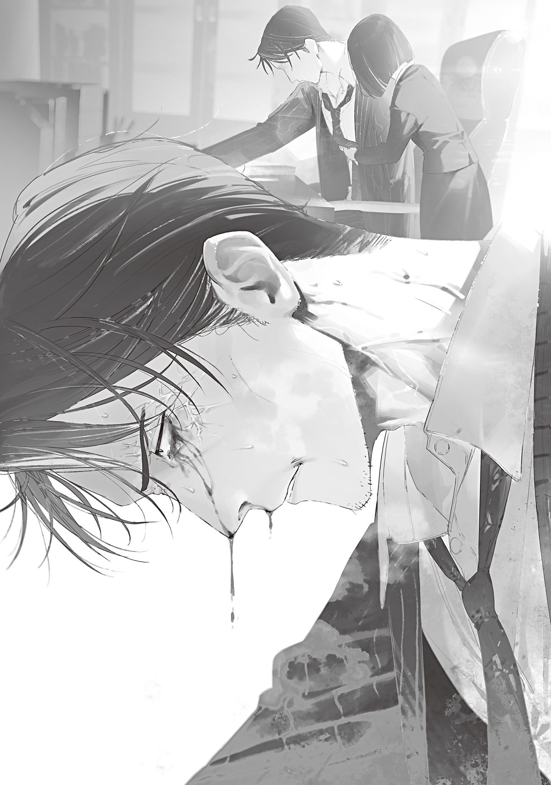

Everyone in Tokyo knew how tirelessly the Foresight Mage worked.

He had foreseen disasters and monster appearances, of course, but he had also foreseen unknown threats that would have been unimaginable before the world collapsed.

In some cases, like the mushroom pandemic, even openly taking countermeasures had unfortunately not been enough to prevent all the damage.

In others, like the Iruma coup and the giant kaiju's landing, he had failed to see the danger coming at all.

On the other hand, there were also many cases where he had completely prevented a disaster that should have happened, without a single incident: the birth of a murderous cult, a war between witches who had fallen out, Class A monsters forming a colony, the Pebble Witch's golems becoming autonomous and rising up, and more.

Everyone living in Tokyo thought highly of the Foresight Mage.

But probably no one other than the Foresight Mage himself truly understood everything he had accomplished.

And since the New Year, that same Foresight Mage had been especially busy.

He was always extremely busy, of course, but on top of the foresight work needed to keep the issue of the new currency, the restart of compulsory education, the establishment of a trade economic bloc, and more moving smoothly, two major threats had come clearly into view, and he was struggling with how to handle them.

One of the two major threats waiting in the future was the growing number of Class A monsters with black Gremlins.

This anomaly, first confirmed during the hunt for Daidarabocchi, was known to get worse as the months went by.

Class A monsters that had learned time-acceleration magic through black Gremlins generated inside their own bodies were a threat. Thanks to time acceleration, even species that had once gone down without trouble could now be hard to kill, cause heavy damage even when they were killed, or injure witches.

With healing magic still undiscovered and medical care far from adequate, an injured witch was a devastating loss.

Class A monsters that used time acceleration would steadily grow in number.

Eventually, more witches would be injured, and they would have to deploy while still wounded.

Deploying while wounded led to serious injuries.

And serious injuries led to death.

All of this would unfold faster than wizard training and combat drills could make up for.

If nothing was done, the Tokyo Witches' Council, whose numbers were already shrinking every year, would inevitably lose even more members. The Eyeball Witch, the Foresight Mage's friend and the witch with the largest administrative district, would be the first to die, once her capacity to respond was stretched past its limit.

To keep that from happening, the Foresight Mage had been pushing weapons development forward.

If ordinary people could use weapons to deal with Class A monsters that only Transcendents could handle, things would get a lot easier.

He had asked the university's Department of Gremlin Engineering to research magic wands, traps, and bombs that would work even on Class A monsters.

Professor Handa of the Department of Gremlin Engineering was capable and practical-minded. Right after taking the request, he had written off the magical approach and proposed building a system to produce nitroglycerin.

It was extremely difficult for ordinary people to use magic to make attacks that worked on Class A monsters. As things stood, even a Monster Trap combined with blood wand Vampir unfortunately couldn't land an effective blow.

But chemistry was different.

Not all of the old era's chemical technology was dead.

Chemistry had lost electricity and regressed two hundred years, and people said it had no hope of advancing further, but it still had techniques they could use.

Nitroglycerin, the explosive that formed the main ingredient of the famous dynamite, was a proven weapon that had wreaked havoc in the previous civilization's wars. Estimates suggested its effect on Class A-2 monsters and above was doubtful, but it could land an effective blow on Class A-3 monsters.

Professor Handa had teamed up with surviving chemists to take on bomb-making, which was probably outside his field, and they had succeeded in producing nitroglycerin at the laboratory level. According to the report that had come in, they had now begun researching designs for highly lethal dynamite bombs and working out the theory for a mass-production system feasible at the current level of civilization.

All he could do was pray that weapons development would make it in time, before Class A monsters grew more vicious and the witches' ability to respond was overwhelmed.

If he was honest, the Foresight Mage would have liked to ask the mysterious genius craftsman 0933 to mass-produce powerful magic wands, sealing rounds, and the like.

But the Blue Witch, whom 0933 had entrusted with his negotiations, was reluctant to let powerful weapons that would wreck the balance of power into circulation.

Besides, if anyone tried to force 0933 into anything, he would disappear and cut off all contact.

There was no forcing a temperamental genius craftsman to develop weapons.

0933 had already contributed almost too much to humanity, and apparently he was the type who hated social activity to an extreme. Rather than force an unwilling 0933 to work and have him vanish, it was unfortunately better to keep him out of the response to Class A monsters growing more vicious.

He did seem happy to analyze black Gremlins, though, if they could manage to deliver one to him before it disappeared with time, so the Foresight Mage was pinning his hopes on that.

The apparent evolution of monsters was frightening, but what the Foresight Mage found most eerie was that, starting about half a year from now, some Class A monsters would begin to “migrate.”

Some of the Class A monsters with black Gremlins would start making great migrations eastward across the sea.

Those that could swim would swim, and those that could fly would fly. Those that could do neither would be carried by other species that migrated by swimming or flying.

As a rule, monsters only formed groups with their own species. Magic University's Department of Monster Studies had confirmed cases of different species forming a certain degree of symbiotic relationship, but there were no known cases of them showing behavior that hinted at organized leadership.

The scene he foresaw, of Class A monsters setting out to migrate one after another, as if they had arranged it with other species, was deeply eerie and ominous.

Looked at simplistically, this “migration” was good news.

The abnormal Class A monsters tormenting survivor communities everywhere would cross the sea to the east and be gone, so if people could get through the worst of it, peace would be waiting for them, even if there were casualties along the way.

But no one knew why they were migrating.

If the monsters that disappeared into the east never came back, that would be fine.

But what if, like migratory birds, they bred in the land at the end of their migration, grew in number and strength, and came back?

What if they set something off at their destination, and the damage spread all the way to Japan?

If powerful Class A monsters formed packs, there was no telling what catastrophic damage they might cause.

The Foresight Mage's foresight had its limits.

He couldn't tell what the migration would lead to, or whether it would lead to anything at all.

With a little more time, the future would draw closer, and it would become easier to see what was waiting. All he could do was pray with all his heart that it wouldn't already be too late by the time he could see it.

Serious as the Class A monster threat was, Foresight had also foreseen a second threat.

The Arataki Group.

The Arataki Group was a large survivor community based in Kyushu. About five months earlier, it had seized and subjugated the Lake Biwa Pact in a lightning strike, and had only just brought it under its own umbrella.

Now its clutches were closing in on Tokyo as well.

As far as the Foresight Mage was concerned, if the Arataki Group would govern well, he would gladly hand over every bit of Tokyo's politics and economy. Then he could finally set down the far-too-heavy burden on his shoulders and live the slow country life he had been longing for.

Unfortunately, though, the Arataki Group's rule appeared to be terrible.

The Arataki Group would first approach the Setagaya Witch, and if that contact was allowed to happen, Setagaya Ward would be eaten away by dangerous, addictive drugs and public safety would rapidly deteriorate. Politics and the economy would collapse, order would vanish, and the ward would become a dangerous zone where violence did the talking.

Then, using Setagaya as a foothold, the Arataki Group would rapidly spread ruin across all of Tokyo.

Who the Arataki Group's members were was unknown. All he knew was that there were at least two of them. The details of the drugs were unknown too.

The Setagaya Witch revered mages and witches as sacred and leaned toward elitism, so he could understand the danger of her sympathizing with the Arataki Group's policy of oppressing the powerless.

What he couldn't understand was why he saw a future where even the witches likely to resist the Arataki Group's tyranny meekly did as they were told.

The Arataki Group apparently saw the Setagaya Witch as an easy mark (probably correctly), and for about a month it had kept fixating on contacting her, no matter how often the Foresight Mage interfered.

But about a week earlier, he had stopped seeing any future where it tried to make contact.

Instead, he saw a future where the Blue Witch came storming into the Witches' Council, yelling.

Apparently, someone had stolen Cyanos.

Given the surrounding circumstances, it was probably the Arataki Group that had stolen (or tried to steal) Cyanos. Having learned it couldn't win over the Setagaya Witch, it had presumably changed tactics. Stealing a magic wand from the Blue Witch was no easy feat. The culprit was definitely a witch or a mage.

But he couldn't see the Cyanos thief, so he couldn't rule out the possibility that something else had just happened to coincide with an Arataki Group scheme.

The Foresight Mage had once acted on uncertain information from a future he had seen, treating it as settled fact, and the Bloodsucking Mage had cleaned up his mess and scolded him for it.

The Foresight Mage limited himself to warning the Blue Witch, “Someone is trying to steal Cyanos.”

The warning worked.

The day Cyanos was supposed to be stolen passed without anything happening.

If the Arataki Group stole Cyanos, there was a high chance its abnormally amplified magic would mow down the witches all at once. He absolutely could not let them have it.

But thanks to the warning, the Blue Witch, already a highly wary person, was on maximum alert with her nerves on edge. Not even the Foresight Mage could have stolen from the Blue Witch in that state.

With the Arataki Group handled for the moment, the Foresight Mage took a breather, then spent the next several days concentrating on the future of the Class A monster anomaly.

The Class A monster problem and the Arataki Group were both headaches.

But his magic power was limited, and magic backlash also strained his brain, so he couldn't keep a full watch on both.

The Foresight Mage considered the Class A monster problem more dangerous than the Arataki Group problem.

Bluffs worked on the Arataki Group, after all, but not on monsters.

The Foresight Mage openly claimed that he could see the future, and he really was doing tremendous work based on foresight magic.

But he kept the details of his ability secret so that it would serve as a deterrent.

If the specifics of foresight's limits and effects became widely known, people with bad intentions would inevitably try to outwit it.

In fact, back when the Iruma Mage had been pretending to be a good person before the coup, he had tried to probe for details about foresight magic. Missing the coup had been the Foresight Mage's own blunder: he had believed the Iruma Mage was a comrade and blabbed the details of his magic.

He would not make the same mistake again.

Apart from the Iruma Mage, who was already dead, the Foresight Mage had told no one the details of his magic.

Thanks to that, he had been able to keep quite a lot of crime and trouble in check.

Unless he was flattering himself, it was also thanks to foresight magic's deterrent effect that the Zombie Witch, who had millions of zombies packed into her administrative district, stayed quietly shut in, indulging in her <ruby>necrophilia<rt>corpse-loving</rt></ruby> reverse harem.

The Setagaya Witch, for one, was fairly blatant about trying to read his mood, and she often checked with him on how her rule looked from foresight's point of view.

The Arataki Group had probably learned of the Foresight Mage's existence through the Dragon Witch too (he couldn't imagine the Dragon Witch had been thoughtful enough to keep the information to herself), so it was likely overestimating foresight magic and being overly cautious.

But Class A monsters didn't know the meaning of caution.

They were just strong.

They just kept getting stronger and more threatening.

The murkiness of the situation was a threat in its own right.

Since indirect tactics didn't work on them, it was only natural for Foresight to decide to look into the future of Class A monsters more broadly and deeply.

He spent several days using foresight to track one of the Class A-3 monsters that had deliberately been left unhunted.

So, what has the Arataki Group been up to?

While working at the Bunkyo Ward Office, the Foresight Mage saw a future tied to the Arataki Group and was stunned.

Bunkyo Ward had been wiped flat, its people and buildings gone without exception; everything had been blown away, completely and cleanly.

And it hadn't been leveled over the course of several days. This was a future that would come within a single day.

The color drained from the Foresight Mage's face.

A nuclear bomb? A Class A-1 monster? No, this was the Arataki Group's doing.

Using foresight several more times in a row, he found that the Arataki Group apparently intended to dispose of him along with Bunkyo Ward, then attack Tokyo from multiple directions.

“Is it an emergency?”

He was sitting with his elbows on his desk, drenched in a cold sweat and agonizing, when the female secretary standing by at his side put the question to him tersely, her face tense.

The Foresight Mage gave a heavy nod.

“Call the communications team. I'll look for a future where we avoid this emergency as much as possible, but we'll probably have to issue an emergency declaration.”

“Understood. Guard! Please call five people from the communications team, right away! At least one who can take shorthand!”

As a voice answered and footsteps ran off, the Foresight Mage sorted out in his head which futures he needed to see.

If it was going to happen within a day, he didn't have much time. This was less a question of magic power than of time and the strain on his brain. These might be light predictions no more than a day ahead, but narrowing their content precisely and using them back-to-back in a short span would do serious damage to his brain.

He had to narrow it down to only the futures that were truly necessary. What should he look at, and what should he leave unseen?

He wrestled with it for only about a minute. The communications team soon arrived, lined up, and readied their writing tools, stiff with nerves, so Foresight smiled and told them to relax.

“Don't worry. Trouble is coming, but the future is bright. I'll make it bright. It's enough if you just do your own jobs as well as you can.

Now... <ruby>Zagaanu Opuo<rt>My today ends</rt></ruby>. <ruby>N-roiyutsun××× Kunatsuku<rt>A signpost for your tomorrow</rt></ruby>.”

The Foresight Mage began making predictions.

He examined the future scenes he saw and gave instructions.

“Call the Eyeball Witch, Night Witch, Tobacco Witch, and the Hachioji— No, damn it, she's gone now. Call the three I just named here. Call the Spider Witch too if you can. Bring up the Bloodsucking Mage's name, tell her it's fine to keep herself hidden, and ask her however you have to.”

“All three are linked by eyeball familiars. Right away. We will send a messenger to Spider Witch-sama at once.”

“I'll leave it to you. Sometime during daylight today, the Arataki Group will attack here. Tell everyone to stay together, keep watch on their surroundings, and work together to deal with it. Bunkyo Ward may be leveled. Urge them to be as careful as they possibly can. That's the first item.”

“Understood. Shimizu-san, please.”

“Roger. I'll use the fastest runner. Is that all right?”

“That's fine. Hurry.”

One member of the communications team bowed and hurried off, memo in hand.

Foresight kept making predictions in rapid succession.

“<ruby>Zagaanu Opuo<rt>My today ends</rt></ruby>. <ruby>N-roiyutsun××× Kunatsuku<rt>A signpost for your tomorrow</rt></ruby>. ... Warn the Dragon Witch. Around noon, an Arataki Group witch will come in from the Saitama prefectural border.

<ruby>Zagaanu Opuo<rt>My today ends</rt></ruby>. <ruby>N-roiyutsun××× Kunatsuku<rt>A signpost for your tomorrow</rt></ruby>... That witch I just mentioned, the one coming for the Dragon Witch, has a magic stone. She's not someone the Dragon Witch can't beat. I want this passed on to her deputy, Zaizen-san, more than to the Dragon Witch herself: ask him to egg the Dragon Witch on as much as he can and get her to fight. It'll be bad if that district falls. That's the second item.”

“I will issue strict orders. Shall we send wizards to support them?”

“No, we're short-handed. They'll have to manage on their own over there. Starting the third item. <ruby>Zagaanu Opuo<rt>My today ends</rt></ruby>. <ruby>N-roiyutsun××× Kunatsuku<rt>A signpost for your tomorrow</rt></ruby>. ...!? ... <ruby>Zagaanu Opuo<rt>My today ends</rt></ruby>. <ruby>N-roiyutsun××× Kunatsuku<rt>A signpost for your tomorrow</rt></ruby>... <ruby>Zagaanu Opuo<rt>My today ends</rt></ruby>. <ruby>N-roiyutsun××× Kunatsuku<rt>A signpost for your tomorrow</rt></ruby>. Ah, no good. This one won't make it in time, damn it!

<ruby>Zagaanu Opuo<rt>My today ends</rt></ruby>. <ruby>N-roiyutsun××× Kunatsuku<rt>A signpost for your tomorrow</rt></ruby>. <ruby>Zagaanu Opuo<rt>My today ends</rt></ruby>. <ruby>N-roiyutsun××× Kunatsuku<rt>A signpost for your tomorrow</rt></ruby>. ... Let me look a little further. <ruby>Zagaanu Opuo<rt>My today ends</rt></ruby>. <ruby>N-roiyutsun××× Kunatsuku<rt>A signpost for your tomorrow</rt></ruby>. All right, here it is. Send a messenger to the Blue Witch. In southern Ome, near the city border, there's a witch watching the Blue Witch from the roof of an abandoned gas station. A woman with a tattoo on her shoulder. Ask the Blue Witch to take her out, then hurry and join up in Bunkyo Ward.”

“Understood. We will send the messenger by relaying through the nearest wizards' eyeball familiars.”

“Please. Why won't she just carry a direct-line familiar, damn it! ...No, sorry. I lost my head. That's the third item. Starting the fourth.”

As he cast spell after spell, the Foresight Mage was grateful to 0933 from the bottom of his heart.

Empty-handed, without that man's custom wand, he would have ended up spending two or three predictions to learn what one now told him.

The backlash prevention was so welcome it almost brought tears to his eyes. Even after looking one day ahead seven times in a row, his head was clear. Had he been empty-handed, his brain would have been fried by now and he'd be slurring his words.

Taking breaks of about an hour in between would make it a lot easier.

But that one-hour break would very likely mean outlaws seizing Tokyo and plunging it into a lawless dark age.

Every prediction he made here and now was worth its weight in gold.

The Foresight Mage kept firing off spells with the full benefit of a custom piece from the world's best Wand Maker, but once he passed thirty castings, even reciting the incantation finally became a struggle.

Blood dripped from his nose, and his vision swayed.

What he took for tears running down his face turned out to be blood.

Close to losing track of what he was doing, the Foresight Mage recited the spell one more time.

“<ruby>Zagaanu Opuo<rt>My today ends</rt></ruby>. <ruby>N-roiyutsun××× Kunatsuku<rt>A signpost for your tomorrow</rt></ruby>... Arataki Group... everyone has magic stones. Strong. Be careful. Why so many... Ugh, right, did they take them from the Lake Biwa Pact?”

“That is enough. Foresight-sama, evacuate immediately!”

The secretary was holding him up, and it took him a few seconds to realize he had nearly collapsed.

She was trying to lay him down on a stretcher that had been brought into the office at some point without his noticing.

“Foresight-sama, please, no more. You will die! At least rest for a while first!”

“Don't want to... no... not yet... not yet, one more time...! <ruby>××××× De-nitsu<rt>Boil, my blood</rt></ruby>.”

The Foresight Mage cast self-enhancement magic for its stimulant effect.

Self-enhancement magic briefly boosted physical ability and also had a mild stimulant effect. As long as that effect lasted, he would not lose consciousness, even if his magic power hit zero or his brain took serious damage.

Gently but firmly, the Foresight Mage pushed aside the hand of his secretary, who was crying her eyes out as she tried to cover his mouth, and recited the final incantation.

“<ruby>Zagaanu Opuo<rt>My today ends</rt></ruby>. <ruby>N-roiyutsun××× Kunatsuku<rt>A signpost for your tomorrow</rt></ruby>... Ugh, ah... Sensei... Professor... tell them... don't die. University... live. It's okay. I'll save you. I'll save you, no matter what...”

Beyond that point, nothing he said came out as words.

No longer able to speak properly, the Foresight Mage was somehow loaded onto the stretcher by his frantic secretary and rushed to the evacuation site.

He kept mumbling and sucking on the secretary's fingers until they were inside the evacuation site. At last, with a few indistinct words like a baby's babbling, he let out a weak breath and lost consciousness.

And two hours after the Foresight Mage lost consciousness.

The Arataki Group's surprise attack on the still-unprepared Tokyo Witches' Council began.

