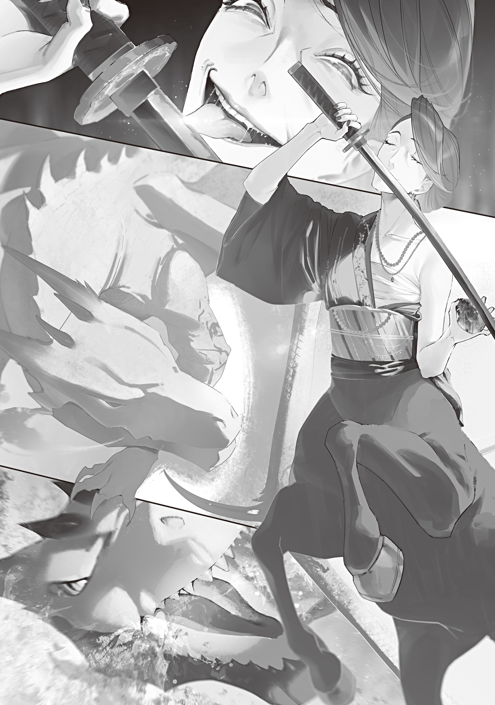

“Come on, Dragon Witch-sama. Eat up, eat up.”

“Ugh, what a waste...”

The Dragon Witch tearfully ate Gremlins inside the huge cave she had dug into the flank of a burst dam. Her slightly chubby deputy, Zaizen Kintaro, urged her on as she balked at eating the shiny treasures she had worked so hard to collect.

This was how the Dragon Witch prepared for battle.

Dragons carried fire inside their bodies, which let them unleash a powerful <ruby>breath<rt>flaming breath</rt></ruby>. But that inner fire had one more important job.

Digesting Gremlins.

Dragons could eat Gremlins, melt them into sludge with that inner fire, and circulate the molten Gremlins through their whole bodies to enhance themselves. Their breath grew stronger, their flight speed rose, and their physical strength increased. Nearly every physical ability got a boost, from agility and dynamic visual acuity all the way to magic resistance. That was why dragons were counted among the very strongest species of monster.

“They say the Arataki Group coming here has magic stones, don't they? If you hold back and then lose, it'll all be for nothing.”

“I know. But my treasure's going to shrink.”

Even with mountain ranges of gold, silver, and treasure carpeting her nest right in front of her, the greedy dragon dragged her feet over one measly mound of Gremlins. She was barely getting any down.

One way or another, Zaizen coaxed and cajoled the Dragon Witch along.

“Dragon Witch-sama, think of this as an upfront investment. You eat the Gremlins, crush the enemy, and get your hands on their magic stones. You like magic stones, don't you?”

“I do, I do. I love them! Ugh, this is an upfront investment. An upfront investment...!”

Repeating it to herself, the Dragon Witch managed to get the necessary amount of Gremlins down. As the Gremlins began circulating through her huge body, her red scales took on a faint magical glow, and her presence grew more intimidating.

The pouch sparrow Zaizen carried around for message deliveries couldn't take the dragon's presence and fainted in his breast pocket. The loyal bird had held out against its instinct to flee a dragon in battle mode, but it couldn't hold out against the pressure. Touching, really.

Her preparations finished, the Dragon Witch lumbered out of her nest. As she led the security force waiting outside toward the Saitama prefectural border, a witch approached them from Belluna Dome, the ballpark that had lost its entire roof.

She looked to be in her forties, wore her black kimono loose, and was a horse from the waist down. In her right hand she held a drawn sword.

“Huh? I know that face. Um, Kiwada?”

“Ah, long time no see, Dragon Witch. Looks like Foresight's warning got to you, judging by the look of things.”

Kiwada, the centaur witch, smiled seductively at the Dragon Witch, who had a whole crowd of security guards trailing along behind her.

The Dragon Witch's eyes were glued not to Kiwada herself but to the magic stone clutched in her left hand.

“I heard about your invasion plan. Leave the magic stone and all the accessories on your neck and waist, then get lost. The sword too. Do that and I'll let you go.”

“Big talk. You're a troublesome witch. But you really think you can beat me when I've got a magic stone? I'm telling you for your own good: surrender. I'll put in a word with the boss to make sure you're treated well. Your hangers-on too. You like a world ruled by violence, don't you?”

The Dragon Witch nodded firmly at the blunt pitch.

“I do! But in that world, the Blue Witch is queen. I'd have to tiptoe around. A world about like this one is the comfiest.”

“I see, I see...”

Something in Kiwada's smile changed.

It became the smile of a wild beast licking its lips over its prey.

The air shook, and not as a figure of speech.

Magic power, amplified through the magic stone, surged out of Kiwada and prickled against their skin like static. Fallen leaves and gravel trembled on the ground, and an unnatural whirlwind spun up.

The Dragon Witch didn't bat an eye. She lowered her huge body into a forward crouch, brimming with magic power and bloodlust.

The air was stifling and stretched tight, ready to explode at a touch. In the middle of it, the security force and Zaizen edged backward and traded whispers.

“Ah, excuse me. May I have a moment?”

After a short huddle, Zaizen raised his hand on behalf of the security force, who were plainly getting cold feet, and made his announcement without a shred of shame.

“We've had a change of heart. We'll side with whoever wins. So long as they're strong enough to protect the citizens from monsters, it doesn't really matter who's on top, does it?”

“Huh!? Zaaaizen! You betrayed me!? You bastard, I won't forget this!”

“Ahaha, I kinda like that! Then you weathercocks can butt out!”

Kiwada laughed as the security force threw down their weapons and scampered off. Then she held her sword low and back and opened the battle with an explosive charge.

“<ruby>Ketenereratsusu ×××× Jiejiyu<rt>The way to cut wind was learned from rock steel</rt></ruby>.”

“<ruby>××× Pupupopu Toraetotsu Karifusu×× Jijimigu<rt>That statue will guard the grave until the end of the world</rt></ruby>.”

Before Kiwada's blade could reach her, the Dragon Witch spat a large Gremlin out of her mouth and took off into the sky, reciting the Pebble Witch's incantation as she went.

In an instant, a <ruby>gargoyle<rt>rock doll</rt></ruby> with a pair of rock wings had formed around the Gremlin. Kiwada tried to cut it down in one stroke, but the rock was astonishingly tough, and her blade stopped halfway through its torso.

She quickly pulled her blade back and slashed at it several more times, but its crossed arms caught the blows, and it answered with a kick.

Kiwada took the kick on her front legs and was sent flying several meters. She landed heavily on all fours and swore.

“It's too hard! You magic-power freak! How much magic power did you pump into that thing!?”

“You just keep playing down there! I'll roast you from above!”

Circling high overhead, the Dragon Witch cackled and blasted the ground with a fierce <ruby>breath<rt>crimson flame</rt></ruby>. In an instant, the ruins and roadside trees turned into a fiery hell and went up in an explosive blaze.

Monsters too slow to escape were engulfed and burned alive, charring black in moments before they gave out and dropped.

In front of Kiwada, a powerful golem was charging. Behind her rolled a deadly tidal wave of searing heat.

Caught in the pincer, Kiwada clicked her tongue and recited another incantation.

“<ruby>Giyodotashitsua Keteneru Jiejiyu<rt>The way to run rainbows was learned from wind</rt></ruby>.”

“Ugh.”

Kiwada's legs flashed for an instant. She caught hold of the air and ran up into the sky.

She looked down, wary that the gargoyle would fly up from the ground after her, but down in the crimson tidal wave, all it did was flail both arms at the sky.

Apparently the pincer attack she'd feared couldn't happen once she was up in the air. Kiwada sneered, though inside she'd had a real scare.

“What, are those rock wings just for show!?”

“Nobody told me you could fly!”

“That's 'cause I never told you!”

The centaur witch ran across the sky, chasing the flustered Dragon Witch.

The Dragon Witch beat her wings and punched through the clouds in a sudden burst of speed, but Kiwada stayed right on her tail.

The two witches were faster than the wind, and they kept picking up speed until they broke even the sound barrier. Sonic booms thundered across the sky in ear-splitting blasts that carried all the way to the ground, shaking the lake's surface and the trees.

But even against sky-walking magic enhanced by a magic stone, the Dragon Witch was still faster, and little by little she pulled away.

In aerial combat, the Dragon Witch had the edge in experience. Not only could Kiwada not catch up, but she had to wear herself out dodging the breath the dragon deftly spat behind her while flying like a stunt plane.

“Gah-hah-hah! Come on, come on, fall already!”

“Why you...!”

Cackling, the Dragon Witch fired breath after breath, turning the cold upper air into waves of heat. When one stream of fire came straight at Kiwada and she couldn't get clear of it, she had no choice but to slash it aside with her sword, and incredibly, the blade melted and dripped away right from the base.

Kiwada's eyes bulged. She tossed away what was left of her sword and swore as she kept sprinting through the air after the dragon.

“Don't fuck with me. You keep spitting out flames like they're nothing!”

“Mmm, the loser horse is snorting about something. Your weapon's gone, so now you'll just have to die!”

For all her glee, the Dragon Witch was spending magic power every time she breathed fire. She couldn't keep up the flamethrowing forever, and the troublesome enhanced state unique to dragons wouldn't last forever either.

Even so, getting pelted over and over with high-powered attacks that guaranteed severe burns, with no incantation and literally as easily as breathing, was more than Kiwada could take.

With a click of her tongue, Kiwada poured no small amount of magic power into the magic stone to amplify it and recited an incantation.

“<ruby>×××× Egurofu Ho-wa- Ajiejiyu<rt>The way to forge rock steel was learned from my grandfather</rt></ruby>.”

“Ugh.”

When she saw the swordswoman pull a new sword out of thin air, its blade flashing in the sunlight, the dragon let out an irritated groan. The battle wasn't over yet.

Kiwada readied the sword, stamped down hard on a cloud, and charged to close the distance, but the gap didn't shrink one bit.

Frowning, Kiwada sheathed the sword she had only just conjured and pointed both hands at the Dragon Witch.

“Guess I've got no choice. If I amplify it, even at this range... <ruby>Niyankiyau Koiro Giyodo Jiejiyu<rt>The way to bring down birds was learned from rainbows</rt></ruby>.”

An invisible wave, amplified by the magic stone, shot out and slammed into the Dragon Witch.

As if something enormous had shoved her down from above, the Dragon Witch lost a lot of altitude and stalled, but the glowing red scales all over her body quickly canceled out the invisible pressure, and she righted herself.

“Gbuh!? Nnngh, y-you weakling! Th-th-that doesn't work on me at all!”

“Still not falling!? Tough one, aren't you! <ruby>Niyankiyau Koiro Giyodo Jiejiyu<rt>The way to bring down birds was learned from rainbows</rt></ruby>.”

“Gabuh!? I-I told you, it doesn't work—”

“<ruby>Niyankiyau Koiro Giyodo Jiejiyu<rt>The way to bring down birds was learned from rainbows</rt></ruby>.”

“Bogeah!!!”

Forced down a third time, the Dragon Witch crashed into Tama Lake, near where the battle had started, and sent up a huge column of water.

Spraying water from her nose, the Dragon Witch did the dragon paddle, not the dog paddle, over to the bank and crawled up onto the shore. She gave her huge body a hard shake, flinging off the water.

Then she saw Kiwada a few paces off, sword at the ready right in front of her, and went pale.

She swallowed hard and put on a brave face.

“A-are you sure about this? If you stay there, I'll roast you.”

“At this range, I can cut you faster than you can breathe fire. You can't bite me either, can you? And of course I won't give you an opening to recite an incantation.”

“Urgh...!”

“Missing a leg like that, you can't fight me up close. Give up.”

“............”

Kiwada looked down at the silent Dragon Witch, gloating.

Even with the magic stone's boost, she'd been made to spend a great deal of magic power.

But it was Kiwada who had brought the dragon down to earth, and Kiwada who held her life in her hands.

“Say something, why don't you? Hm?”

“...Something.”

“Hm? Ah, stalling for time. You're planning to have that gargoyle from earlier jump me from behind, aren't you? Make the gargoyle destroy itself and surrender within five seconds, or I'll cut you down. One, two.”

“Grrgh...!”

“Three, four,”

“S-surre—”

Kiwada wore a sadistic smile that suggested she'd just as soon cut the dragon down anyway. But an instant before she could hear the surrender, four ice spears slammed into the flank of her horse body, and she staggered.

Blindsided by an attack she had never seen coming, she stumbled and reflexively turned to look.

Lying low in the bushes were the security force and Zaizen, the same ones who had supposedly thrown down their weapons and run.

“Get her, Dragon Witch-sama!”

“If you can't finish her here, you're just a lizard!”

At the security force's jeers, Kiwada hastily snapped her gaze back to the front.

There stood the Dragon Witch, grinning viciously, her eyes glittering with greed. Her belly glowed red-hot, and a superheated flame burned deep inside her great jaws.

“<ruby>××××<rt>Great discovery</rt></ruby>! <ruby>Jin Gatsushin Gana Ashinka<rt>Apparently flames burn</rt></ruby>!”

“Oh sh—”

Dragon breath, boosted by the Gremlins coursing through her whole body, with fire magic layered on top.

The crimson heat ray, so bright it was blinding, swallowed Kiwada.

She became a black shadow writhing and dancing in the flames, and in no time the shadow burned and crumbled away.

When the breath stopped a few seconds later, all that was left was a small, smoking mound of white ash.

Kiwada had burned to death.

“Hmph! Weakling! That's right, I really am strong after all! Gah-hah-hah-hah!”

Cackling, the Dragon Witch lumbered over to the ash heap and blew it away with a snort, revealing a magic stone that radiated heat.

All magic stones were meteorites, and unlike Gremlins, they were extremely heat-resistant, tough enough to survive the heat of atmospheric entry. Even dragon fire wouldn't melt one.

Drooling, the Dragon Witch eagerly tucked the hot magic stone into her belly pouch and broke into a happy dance, and the security force and Zaizen came crowding over, chattering away.

“I took her for a sharp witch, but she turned out to be quite the fool. Imagine falling so neatly for such a classic ploy.”

“A ploy? ...Oh. Z-Zaizen, you're a guy who gets things done. I knew it. Of course I trusted you.”

“Why, I'm honored. Your acting was very convincing as well, Dragon Witch-sama. It looked just as if you really believed I'd betrayed you.”

Zaizen laughed merrily, his fat belly jiggling, and the Dragon Witch laughed along, a little awkwardly.

The security force chatted and laughed, crudely spitting on the witch's ashes and giving her remains the finger.

“Moron. No way our Dragon Witch-sama loses to some small-fry witch who's just clutching a magic stone.”

“Yeah, yeah. Being strong's the one thing she's got going for her.”

“We would've lost without Zaizen-san's plan, though...”

“Well, Zaizen-san is Dragon Witch-sama's external brain, so it basically counts as her solo win.”

“You think? Maybe so.”

It had been a narrow win, but on results alone, it was a total victory over a witch with a magic stone: no casualties, not even a single injury. Zaizen cleared his throat and made a suggestion to the giddy Dragon Witch.

“Dragon Witch-sama, are you sure you don't want to go help the other witches? There are more magic stones to be had.”

“Nnn, I'm beat. Today I'm going to sleep holding magic stone-chan. Then tomorrow I'll attack those pieces of trash again and rescue poor magic stone-chan. One a day!”

“Very well. Then please leave the defense of your territory to us while you're out. Well, if a witch or mage shows up, we'll surrender, but we'll make sure it's easy for you to take it back afterward.”

“Handle it however you see fit. Fwaaah, I'm going to bed now. You take care of the rest.”

“Good night, Dragon Witch-sama.”

Zaizen bowed politely and watched the Dragon Witch lumber back to her nest.

Kidnapping, wasting talent, stealing: the Dragon Witch did whatever her instincts told her, but whatever else you could say about her, she was strong.

If it weren't for the Blue Witch, she would be the Witches' Council's top fighting force, which put her a head above the rest even among Transcendents.

As long as the Dragon Witch was there, her territory was safe.
