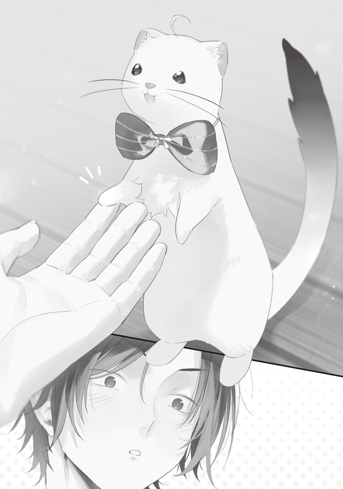

【魔法言語学】

青の魔女が魔法語資料を持ってきてくれると言ったので、俺は手作りカレンダーにマルをつけ、約束の五日後を指折り数えて待った。

魔法杖[まほうづえ]は魔法語を通して行使される魔法を補助強化するものだから、魔法杖を製造する上で魔法語知識は欠かせない。

魔法語を知らずに魔法杖を作るのは、現場を知らない社長が製造業の音頭を取るに等しい。まあやれるけど、上手[うま]くは行かない。

魔法語の勉強は魔法杖の構造理論理解と発展のために欠かせないものだと睨[にら]んでいる。

あとシンプルに魔法語に興味がある。

学生時代に無理やり英語を勉強させられていた時とはやる気に雲泥の差があった。

だって魔法語だもんな。魔法だぞ魔法！　誰だって興味ある。

そして五日後、青の魔女が持ってきてくれるであろう魔法語資料の束をワクワクして待っていた俺の期待は裏切られた。

青の魔女はいつものボロボロ黒服に青魔杖キュアノス＆仮面装備で、資料を持っていなかった。代わりに肩に小動物がちょこんと乗っている。

「こんにちは、初めまして。大[おお]日向[ひなた]慧[けい]です！」

「しゃ、喋[しやべ]った!?」

小動物は幼い女の子の声で元気よく挨拶をかましてきた。

そいつはイタチのように見えたが、体毛が白いからたぶんフェレットだ。

フェレットが喋った。

普通、フェレットは喋らない。

でも喋ってる。

という事は、

「フェレットの魔物だーッ！」

「アハハ、やっぱりそう見えちゃいますよね。実はオコジョなんですよ。あと、人間です」

フェレット改めオコジョはそう言って青の魔女の身体[からだ]をささーっと駆け下り俺の足元までやってくると、後足で立ち小さな右前脚を差し出してきた。

意味不明なジェスチャーだったが、一拍遅れて意図に気付き、俺はしゃがんで握手した。

手、ちっさ！　俺、喋るオコジョと握手しちゃってるよ。ファンタジーというかメルヘンだ。

ふん、おもしれー生き物。

でもそれはそれとして、俺が注文したのは魔法語資料なんですが？

どうなってるんですか、配達員さん。注文の品と違いますよ。誤配ですか？

「魔法語の資料は？　配達遅れ？　せっかく今日手に入るって期待して待ってたのにさ、オコジョなんて連れて来られてガッカリだよ」

自分自身の飼育ですら苦労してるのに、ペットなんて飼えないぞ。

青の魔女に文句をつけると、珍しく嬉[うれ]しそうに言った。

「慧ちゃんは青梅[おうめ]生まれ青梅育ちなんだ。グレムリン災害の前に両親が離婚して、父に引き取られて港[みなと]区に引っ越したおかげで生き残ってくれていた」

「あ、そーなん？　良かったじゃん」

俺は素直に祝福した。

青の魔女が青梅とその住人の守護に固執しているのはよく知っている。

全滅したと思われた青梅の住人が、形はどうあれ無事見つかったなら喜ばしい。

「て事はなに？　こいつ元々人間？」

「そうなんです。魔法の暴発でこーなっちゃいました！」

そう言ってオコジョ、大日向は短い両手を上げバンザイした。

めっちゃかわいい～！　ニコニコしてしまう。

テレビの動物アテレコ番組は大嫌いだったけど、本当に人の言葉を喋る動物ってマジかわいいな。

人の言葉は苦手だし、動物畜生も苦手なのに（畑を荒らす畜生共のせいで嫌いになった）、合体すると可愛[かわい]いのは不思議だ。

お前人間辞めて正解だよ、と思ったが、口に出さないだけの良識がギリギリ俺にもあった。

「変身失敗か。じゃ、魔女なんだ？　オコジョの魔女とか？」

「いえ。私は魔法言語学教授です。今日はですね、大利[おおり]さんが魔法語の講義をお望みとの事で、青の魔女さんに紹介頂いて伺いました！」

「…………」

ちっさい頭をぺこーっと下げお行儀よく一礼する大日向を見て、真顔になる。

俺は青の魔女を建物の陰に引っ張った。

オコジョから見えない位置に魔女を引っ張り込み、声を潜めて詰問する。

「おいっ！　資料でくれよ！　紙でくれ！　なんで研究者本人連れてきちゃうんだよ！　バカ！」

「私も最初は紙の資料を受け取ろうと思っていたんだが。研究室を訪ねて話していたら、慧ちゃんが青梅出身だと分かったんだ」

「分かったからなんなんだよ」

「魔法杖職人[ワンドメーカー]に興味があると言ったから、連れてきた」

「はぁ～？」

おいおい、話したんか？

奥多摩[おくたま]に魔法杖職人がいると。

コミュ障非正規人間国宝がいると。

俺こそがあのキュアノスを作った魔法杖職人だと。

話したんか！

「俺の存在は隠した方が良いって言ったのお前だろ。なんでペラペラ喋った？」

「もちろん、信用できるからだ」

「そうなのか？」

「ああ。慧ちゃんは青梅出身だからな」

青の魔女は「空は青い」ぐらい当たり前の事実を言うようにのたまった。

ダメだこいつ。普段は冷静沈着なのに、青梅出身者に甘すぎる。

人間に会いたくない俺と、核爆弾クラスの技術を広めたくない青の魔女の間で、俺の存在を隠すという合意はとれていたと思っていたんだが。とんだトラップがあったもんだ。

俺は少し距離が離れたところでちょうちょを目で追っているメルヘン動物をチラ見した。

いや、でも、大日向は全然人間に見えないっていうか人間じゃねぇしなあ。

どうみてもただの喋る小動物。こんな見るからに非力で可愛いオコジョを怖がってたら生きとし生けるもの全てを恐れなきゃならんぞ。

対外交渉を全て青の魔女に丸投げしたのは俺だし……青の魔女が信用できると判断したなら、まあ、いいか？

魔法語の資料は紙で貰[もら]えるのが一番良かったが、喋るオコジョでも悪くはない。

人間じゃなくて良かった。事故ってオコジョになってくれていて良かった。一生そのままで頼む。

俺は詰問を終えオコジョの前に戻り、歓迎した。

研究職の方と話すのは初めての経験だ。

教授とお呼びしないとな。

「今日はよろしくお願いします、大日向教授」

「はい！　こちらこそ！　キュアノスについて色々ご教授いただければ嬉しいです！」

頭を下げると、オコジョ教授はお手手を胸の前で揃[そろ]え、ムン！　と気合を入れた。

うーん？

魔法語の研究をしている教授って割には、声も仕草も幼い気がするんだよな。

見た目はオコジョ、中身は若作りオバさんとか？

いや待てよ。

「教授」という言葉の響きで中年～老齢ぐらいをイメージしていたが、そうとは限らない。

一応聞いてみる。

「失礼ですが、大日向教授はおいくつですか？」

「先月、十二歳になりました！」

ふんっ、なんだガキかよ！

飴[あめ]ちゃん食べるか!?

立ち話もなんなので、大日向教授を家の中に案内する。勝手知ったる人の家、青の魔女は俺の蔵書（漫画）を読むために一言断ってからさっさと書斎に引っ込んだ。

踏みつぶしてしまわないよう気を付けながら大日向教授を我が作業室に案内すると、オコジョは歓声を上げた。

「わあっ……！」

オコジョは小さくつぶらな瞳をキラキラさせ、作業机の上にちょろちょろっと駆け登り部屋を見回し感嘆する。

「すごい、すごいです！　魔法職人さんの工房みたい！」

みたい、っていうかその通りなんだよなあ。

青の魔女も初めて作業部屋に通した時に同じような反応をした。

実際、元々土間だった八畳の作業部屋にはファンタジー感がある。

電気をこの世から消し去ったグレムリン災害の後、３Ｄプリンターやグラインダーは部屋から撤去し、砥石[といし]や鉄床[かなとこ]など原始的な工具を増やした。

晶雨産の乳白色グレムリンをジャンジャラ詰め込んだ半開きのジャンクボックスはまるで宝箱。壁にはオクタメテオライトを飾って祀[まつ]ってあるし、いくつかの魔杖設計図も貼り付けている。

奥多摩中学校の理科室からパチってきた実験器具もガラス棚を彩り、俺が天井から吊[つ]り下[さ]げたランタンにマッチで火をつけると、工房はオレンジ色の柔らかな光に照らされた。

溶けた蝋[ろう]とススの匂いがまた雰囲気のある古臭さを演出し、大日向教授は鼻をピスピスさせ置きっぱなしの工具に触らないようチョロチョロ動きながらあれこれ聞いてくる。

うむ、なんでも聞いてくれたまえ。

「これはなんですか？」

「それは砕いたグレムリンをエーテル溶媒に入れて手廻[てまわし]式遠心機で成分分離できないか試してた」

「なるほど？　面白い実験ですね！　結果はどうでした？」

「失敗した」

「あら。残念です……こっちは？」

「エッチングでグレムリンを加工しようとした。耐腐食性が高すぎてこれもダメだった。工具溶かしただけだった」

「へぇえぇ～っ！　色々やっていらっしゃるんですね！　すごいです！」

「まあね」

元気いっぱいの小動物の賛辞にちょっと引く。

このオコジョ、ぐいぐい来やがるな。友達多そうで壁を感じる。

「大利さんは頭がいいんですね。こういう実験って全部自分で思いついてるんですか？」

「まあ……」

「おおーっ！　発想力あるんですね。やっぱり大学でそういうの勉強したり？」

「大学はあんま関係ねぇんじゃないか。知識が発想の元になるのはそうなんだろうけど」

「あ、分かります。私もお父さんに習ったこと、すごく研究に役立ってます。こういうのって職人さんと一緒なんですねぇ。大利さんはどこの大学に通ってらしたんですか？」

「言っても伝わらん地味なとこだよ」

「そうなんですか？　そんな事ないと思いますけど……東京の大学ですか？　大利さんの地元ってどこなんですか？」

「愛知」

「愛知っていうと、味噌[みそ]カツ！　美味[おい]しいですよね。やっぱりよく食べるんですか？」

最初は魔法杖工房に興味があるのかと思って質問に答えていたが、なんかちょっと違うっぽい。関係あるようで関係ない話題を振られまくる。

なぜこんなに俺のプライベートを掘り下げてくるのか？　魔法杖にも魔法語にも関係ないぞ。ひょっとして身元の探りを入れられてる？

でも子供だしなあ。十二歳の子供がそんな事するか？

「さっきから何だ？　根掘り葉掘り聞いてきて何がしたいんだ」

「あ……嫌でした？　ごめんなさい。おんなじ魔法の研究をしている同士ですし、仲良くなりたいなって思って。えへへ」

「仲良く……？」

「はい！　友達になれたら嬉しいです！」

「？？？」

動物の顔だと分かりにくいが、どうやら大日向教授は照れてモジモジしているようだった。

日本語のはずなのに脳が理解を拒んで何を言っているのか分からない。

お前は一体何を言っているんだ？

友達ってのはなろうとしてなるもんじゃなくないか？

友達になるために仲良くするって意味不明だ。

気が合うから、必然的に仲良くなって、いつの間にか友達になっている。それが自然の成り行きというものだ。

仲良くなるための努力ってお前、そんなの歪[いびつ]だろ。人間の摂理に反している。

じゃあ相手の事が大嫌いでも、本心を隠して仲良くなる努力をして、上っ面の「俺達友達だよね」が通れば友達なのかよ!?

はーまったく、コイツは友達という概念をなんもわかってねぇな。

俺、生まれてから一人も友達つくったことないけど、そういうのは分かるぞ。

……分かるぞ！

俺が大きく舌打ちすると、全面拒否の意図を察したらしい大日向教授はびくっと震え、小さな尻尾[しつぽ]を垂れ下げションボリした。

社会の厳しさを知らんガキがよぉ。世の中にはカラオケに誘われただけで動揺で呂律[ろれつ]が回らなくなる男もいるんだ。もっと友達は選びな！

「そういうのいいから。さっさと魔法語について教えてくれ。そのために呼んだんだぞ」

「はい……すみませんでした」

大日向教授は悲しそうに落ち込んでいたが、すぐに気を取り直し、作業用の製図版にジャンプして飛び移った。

「えっと。じゃあ、あの、この紙と鉛筆使っていいですか」

「いくらでも」

「では失礼して。それでは講義を始めさせてもらいますね。あ、トイレとか大丈夫ですか？　一応、90分の講義内容を組んできたんですけど」

「問題ない。聞かせてくれ」

俺はクッションを敷いた椅子に尻を預け、メモを取る準備をして傾聴の姿勢をとった。

まさか大学を卒業してからまた講義を聞く事になるとは思いもしなかったぜ。

魔法言語学の講義がある大学があったら大人気だっただろうな。めちゃかわオコジョ教授だし。

「まず魔法言語学の歴史から。私の父、大[おお]日向[ひなた]聡一[そういち]は大学で言語学の教鞭[きようべん]をとっていたんですが、グレムリン災害が起きて間もない頃、知人の吸血さん……吸血の魔法使いに相談を受けたんです。グレムリン災害に端を発した一連の事態を重く見た父は、研究室の助教とゼミ生を集めて魔法言語解析チームを発足させました」

「ほう」

出たよ、吸血の魔法使い。

青の魔女の話にもよく出てくるけど、手広く色々動いてた有能マンだったらしいな。

もう死んでしまったというが、生きていても会う事はなかっただろう。社交性の高い人は苦手だ。

「研究チームは、まず言語サンプルを集めました。

言語学に限らず全ての学問に適用できる実験科学の手法に、『観察・推論・仮説・検証・考察』という五段階法があります。観察してデータを集め、データから予想を立て、予想が正しければこうなるはずだと仮説を設定し、実際に仮説を検証して、検証結果を考察する。そしてまた観察に戻り、繰り返します。こうして理論的かつ効率的に真実に近づいていくんですね。

あ、このあたりはメモ取らなくても聞き流して大丈夫ですよ。ガイダンスなので。

言語サンプルの蒐集[しゆうしゆう]はこの一連の五段階法の『観察』にあたる初歩です。研究チームは吸血さんに協力頂いて、13人の魔女と魔法使いから呪文の聞き取り調査を行い、合計72の呪文をサンプリングできました。この72の呪文の意味と発音方法を分析分類したところ、人類には発音不可能な未知の発音記号７音を少なくとも設定しなければならないという結論に達しました。つまり魔法語は、そもそも人間、ホモ・サピエンスが使う言語ではないんですね」

「それ聞いた事ある。青の魔女も変な声で詠唱してたな」

「そうですね、ヴァアラー系統も発音不可音を含んでいます。よく御存知[ごぞんじ]ですね」

大日向教授はにっこり頷[うなず]いた。

「魔法言語学は言語学ですが、歴史や風土学の要素も含みます。

例えばですね。身近な例では、日本語は雪に関する言葉が豊富です。淡雪、粉雪、牡丹雪[ぼたんゆき]、みぞれ、霰[あられ]、吹雪、地吹雪、べた雪、新雪、残雪などなど。これはですね、日本が雪国だからです。雪がよく降る国の言葉なので、雪を細かく言い分ける文化が生まれ、言語に反映されているんですね。

これがモンゴルだと、馬を非常に細かく呼び分けます。生活と馬が密着した文化ですから。

言語を知ればその言語が生まれた風土が分かりますし、風土が分かれば言語理解の助けになるんです。どこに住むどんな人々が話す言語なのか？　という事ですね。

だから研究チームはネイティブスピーカーではないけれど、それに最も近い魔女・魔法使い本人についても言語研究と並行して調査しました。これらは非常に根気の要る研究で、機械が使えなくなったせいもあって常に人手が足りず、私は研究室にお邪魔して父の研究を手伝うようになったんです」

ここまで大人しく拝聴していたが、気になってしょうがないので挙手をする。

「ちょっといいか」

「はい。どうぞ」

「大日向教授、本当に十二歳？　小学生がやる講義内容じゃないんだけど」

「ありがとうございます。私、私立に通ってたんですけど、入学してからテストで一位以外取った事ないんですよね。お父さんにもよく褒められました」

そう言ってオコジョはヒゲをピンと立て、自慢げに胸毛を膨らませた。

神童じゃーん。すげぇな。

なんだろう、今生き残ってる人類ってなんかに特別秀でてないとダメみたいなのあんのかな。俺といい、青の魔女といい、大日向教授といい。

特技も取柄も無い人は厳しすぎる生存競争の中で脱落してそう。キツい時代だぜ。

「話を戻しまして。呪文の中には文学について言及しているものがあるので、どうやら魔法語にも文字はあるようです。が、その文字がどんなものか、私達には知る術[すべ]がありません。必然的に魔法言語学は発声、発話ベースの研究が主になります。

しかしこれには大きな危険が伴います。グレムリンまたは魔石が近くにある状況で魔法言語を正確に発音すると、魔力コントロールができない人間は強制的に魔法を発動させてしまうからです。もちろん、発音の正確さを測る非常に有効な検査としても機能するので、研究に欠かせない現象ではあるのですが。魔法の暴発が危険である事に変わりはありません」

俺は頷いた。

青の魔女にも注意された事だ。うっかり魔法ドーン！　はマジで危ない。喋っただけで拳銃が暴発するようなものだ。下手したら死人がでるぞ。

「研究チームは魔法語の研究を行うわけですが、時代が時代です。すぐにでも研究を実利に結び付ける事が求められていました。何の役にも立たない研究に貴重な人手を割くわけにはいかないですからね。

具体的には、研究チームは呪文の改造と改良を至上命題として掲げています。

吸血さんのデーニッ系統の呪文を例に挙げましょう。デーニッ系統の魔法は血に関するものですが、その一つに自己強化魔法があります。これは魔力と自分の血液を消費して身体能力を大きく向上させるもので、消費魔力量と血液量的には一般人でも使用に耐えうるものです。使用後に貧血になりますが、大事には至るほどのものでもありません。

この自己強化魔法を使えば、理論上大きめのグレムリンを握った一般人が弱い魔物を打倒できるようになります。魔物狩りを行っている魔女と魔法使いの負担を大幅に減らし、肉体労働効率を大幅に向上させ、他にもあらゆる面で役に立ちます」

「おお。それ覚えたいな。どんな呪文？」

「覚えられません。発音不可音を含むので」

「ああ……」

なるほど、そこがネックになってくるのか。

じゃあダメじゃん。呪文には魔女魔法使い専用が多すぎる。いくら研究しても唱えられないんじゃ意味はない。

「だから、迂回[うかい]詠唱の研究開発をしています。魔法語を分析し、発音不可音を避けつつ、同じ意味かつ人間でも発音できる単語を使って詠唱文を再構築する事で、人間が発音できる同じ効果の魔法を作り出そう、という研究ですね」

「おお！」

研究する意味、ありました。

なるほどね～！　確かにそれは言語学者にしかできない仕事だ。

言語学ってスゲーッ！

俺は大日向教授に尊敬の眼差[まなざ]しを向ける。言語学者大活躍じゃん。俺の魔法杖も世界を変えられるけど、彼女たち言語学者も世界の命運を左右できる。流石[さすが]にリスペクトっす、教授！！！

「そしてこの研究の過程で起きた魔法の暴発で、研究チームは次々と亡くなり、父を含め全員死亡しました。今は私が一人で研究を引き継いでいます」

「えっ」

さらりと告げられた驚愕[きようがく]の事実に恐[おそ]れ戦[おのの]く。

魔法の暴発で下手したら人が死ぬっつーか、本当に死人出てるじゃん。出まくってるじゃん。どうなってんだよ！　安全性はどうした!?

「魔法語の研究ってそんなに危ないのか？　人が死ぬほど？」

「そうです。この研究は命懸けです。呪文の構造を弄[いじ]った改造呪文を唱えた結果、期待されているものとは違う効果が発揮される場合が多々あります。時に、それは致命的です。血液を消費して自己強化するはずが、血が沸騰したり、急激に増血して破裂したりします。私もドラゴンに変身する呪文を改造して唱えたところ、オコジョになってしまいました。無機物や微生物に変身したり、即死したりしなかったのはかなりの幸運です」

「ひえっ」

オコジョ教授の事を何も考えず脳死で可愛い～とか思っていたが、事情を聞くとシャレにならねぇ。

危ない橋渡った結果がソレかよ！

十二歳の子供がやる事じゃねーぞ！　そんな研究してたら命がいくつあっても足りない。

「魔法を暴発させずに済む魔女とか魔法使いに研究任せればいいだろ」

「彼女たちは自分が何をどう発音しているかに無自覚ですから。お忙しい方ばかりですし。結局は、発音不可音が混ざっていないかどうか、発音不可音を発音できない普通の人間が呪文を唱えてチェックする必要があります。事故の危険があっても、やらなければなりません」

「いや辞めたら？　研究。お前も死ぬぞ。大人に任せろよ」

「私は自分の手で父の研究を完成させたいんです」

大日向教授はキッパリ言った。

つぶらな瞳に、動乱の時代を生きる者の激しい覚悟の炎が灯[とも]っていた。

気圧[けお]される。ちんちくりんの体躯[たいく]が大きく見える。覚悟ガン決まりかよ。

大日向教授、すごい女だ。

大日向教授の90分にわたる魔法語講義により、俺は魔法語の基礎知識を学んだ。

発音記号の暗記や文法、修辞などまでは頭がこんがらがってしまいそうで一息には覚えられなかったが、基本は押さえられたと教授に太鼓判をもらった。優秀な生徒と褒められて悪い気はしない。

色々と学ばせてもらったが、「安全音」を修得できたのは分かりやすくデカい。

安全音というのは、研究の中で魔法を暴発させがちな魔法語学者が考案したセーフティーシステムだ。

魔法語は日本語と発音が全然違うから、日常会話の中でウッカリ魔法を唱え暴発させる危険性はない。しかし、日常的に魔法語を話す魔法言語学者は別だ。他の魔法言語学者と魔法語について話す中で、誤って魔法を暴発させてしまう危険が大きい。

「凍れ[ヴアアラー]系統について相談したい事が」などと言い出した瞬間に冷凍ビームが暴発したりしたら危なっかしくて仕方ない。

だから、魔法言語学者は魔法語を喋る時、文の先頭に必ず短い擦過音をつける癖をつけている。

この擦過音は現状把握されている魔法語では一切使われていない音であり、魔法語に存在しない発音だと推測されている。

従って、この擦過音を魔法語に混ぜ込む事により、魔法語は不適切発音になり、必ず魔法が不発する。

魔法語の暴発を防止するための、安全装置音。だから「安全音」。

安全音は聞き取りにくく短く小さな音なので、よっぽど注意深く聞かないと雑音として聞き逃す。安全音をつけて喋っても会話に支障は出ない。

魔女や魔法使いには無用の安全音だが、俺達のような一般人にはとても役立つ。

魔法語学者が編み出した立派な研究成果の一つと言えるだろう。

まあもっとも、迂回詠唱や改造詠唱の実験の時には魔法を発動させる必要があり、安全音をつけて不発にするわけにはいかないから、安全音を覚えたところで魔法語学者はやっぱり致命的事故から逃げられない。

魔法語学者が詠唱事故から身を守るためには、もっと根本的な対策や新手法が必要だ。

講義を終えて喋り疲れたオコジョ教授に小皿に注いだ缶ジュースを出し、俺も休憩に入る。久しぶりにゴリゴリに脳みそ使ってくたびれたぜ。

トイレ（ぼっとん便所）に行って作業室に戻ろうとすると、書斎から青の魔女が顔を覗[のぞ]かせ呼び止めてきた。

「大利。講義は終わったか」

「終わった。これ以上教えてもらっても今日はもう覚えらんなそうだし」

「じゃあちょっとこっちに。相談がある」

手招きされるがまま書斎に入ると、青の魔女は言いにくそうに仮面から零[こぼ]れる髪を弄りながらモソモソ言った。

「実はだな」

「ああ」

「そのー、言いにくいんだが」

「ああ」

「怒らないで聞いて欲しい……」

「その言葉で怒りそうだ。はよ言え。コミュ障枠は俺一人で間に合ってるぞ」

促すと、青の魔女はやっと話し始めた。

「実は空手形を切ってしまって。いやハッキリ明言したわけではなくて、方法を考えておくとボカしはしたんだが。要するに、今回の魔法語講義の対価として、日本の、少なくとも東京周辺一帯の食料問題を解決しなければならなくなったんだ」

「何言ってんだお前」

どういう話の流れだよ、それは。

なにをどうすればそうなる？

まるで意味が分からんぞ。

詳しく話を聞くと、どうやら魔女集会で政治的取引があったらしい。

大日向教授を保護している未来視の魔法使いが実は食料問題担当大臣で、部下を貸し出す代わりにウチが抱えてる食糧増産プロジェクトを手伝え、みたいな。

いかに現在の日本が深刻な食糧危機にあるかという話を長々とされたが、まとめるとそういう事だ。

「青の魔女が約束したんだろ。そっちでなんとかしてくれよ」

「私は農業について詳しくないんだ。小学校でアサガオを育てた経験しかない。大利は家庭菜園と田んぼをやっているだろう？」

縋[すが]るように言ってくるが、どう考えても無理がある。

「いや個人のガーデニングと国策規模の農業問題を一緒にすんな」

「でも私よりは詳しい。大利はキュアノスを作っただろう？　農業革命を起こすような魔法杖を作れないか？」

「ざけんな。無茶[むちや]ぶりが過ぎる」

言いながら考える。

キュアノスを未来視の魔法使いに貸して超増幅豊穣[ほうじよう]魔法をブッ放させれば済む話だが、そのへんは入間[いるま]の魔法使いが極悪大惨事な前例を残しているらしく、その二の舞になる危険を考えると絶対に貸せないと言う。

まあ、俺はその未来視の魔法使いがどんなヤツか全然知らんしな。

青の魔女が「信じたいが、信じ切れない」と言うならそうなのだろう。

「お前がキュアノス持って全国津々浦々豊穣魔法施し巡りすればいいだろ？　……ああ、青梅から動きたくないのか」

青の魔女が答える前に自分で納得した。

ほなキュアノス使ってどうにかするのは無理か。オクタメテオライトについても同じ事が言える。

「人海戦術はどうだ？　こんな事もあろうかってワケじゃあないけど、暇つぶしに作ったグレムリン製の汎用二層型魔法杖が３００本ぐらい倉庫に眠ってる。その豊穣魔法をパンピーに教えて、３００人がかりでチマチマ豊穣魔法をかけて回れば」

「人海戦術はできない。豊穣魔法は発音不可音を含む。魔女と魔法使いにしか使えない」

「マジか～！　いや待て、大日向教授がそういう研究してるって言ってたぞ。発音不可音を迂回して、人間でも唱えられる呪文に改造する研究だ！」

指を鳴らして青の魔女を指す。

頭の中で情報が繋[つな]がった。なるほどね。大日向教授の「すぐ実利に繋がる研究をしてる」って言ってたのはそういう事か。

なーんだ、ほっといても大日向教授が問題解決してくれるじゃん！　と安心したのもつかの間、青の魔女は重々しく首を横に振った。

「このままでは間違いなく、研究完成前に慧ちゃんは死んでしまう。詠唱実験の死亡事故率が高すぎるんだ。なんとか説得して実験を辞めさせるつもりでいるけど、そうすると魔法語研究者が誰もいなくなる」

「あー、死にまくって今は一人しか残ってないんだっけか。新規採用しろよ」

「魔法語研究者は殉職率九割超え。警備隊より死亡率が高い。人員募集はしているというが、誰も集まらん」

出す案を片端から全て否定され、キレそうになる。

じゃあどうしろってんだよ！

「詰みじゃねぇか」

「ああ。だから困っている。大利の知恵を借りたい」

「無理」

俺、ただの一般伝説的杖職人ぞ？

俺より賢い教授とか、俺百万人より社交性がある政治屋諸氏が解決できてない問題なら、俺にだって無理だ。

当然の結論として匙[さじ]を投げたのだが、青の魔女はしぶとく頼み込んでくる。

「そう言いたくなるのは分かる。だが、何か方法が無いか考えるだけ考えてみてくれ。私も考えるから」

「……考えるだけな？」

「ああ、それで構わない。助かる。無理を言って悪かった」

青の魔女はホッとした様子で頭を下げた。

俺は伝説の魔法杖職人として引きこもって気楽に高みの見物をしていたい。そのために対外交渉を全部青の魔女に丸投げしているのに。

日本の未来なんて背負わせないでくれよな。頼むぜ、マジで。

考えるだけなら、まあ、いいけどさあ。気が重いよ。

けっこう話し込んでしまい、休憩に入ったまま大日向教授をほったらかしにしていたのを思い出す。休憩してから質疑応答タイムに入る予定だったのに。

怒ってないかな、と戦々恐々としながらそーっと作業部屋に戻ると、大日向教授は膝掛けの上に丸まってスヤスヤ寝ていた。

か、可愛い……！

思わず撫[な]でようと指を伸ばすと、眠ったまま指先を小さな舌で舐[な]められる。

なんだこのあざとい生き物ォ！

中身が人だから躾[しつけ]もいらねぇ、餌は自分で用意できるし、うるさくもしない。最強生物かよ。

「…………」

思ったより温かな舌に好きに指を舐めさせている内に、だんだん実感が湧いてくる。

そうか。

このままだと、この愛くるしい小動物は無謀な実験を敢行して、死んでしまうのか。

それは嫌だな。悲しい。

ちょっと本気で考えてみよう。

日本の食料問題を解決し、オコジョ教授の事故死を防ぐ方法を。

爆睡している大日向教授はふかふかの毛布を敷いたバスケットに移され、青の魔女によって丁重に運ばれ帰っていった。

日本の食糧問題を背負わされた上、オコジョになって、コミュ障男とのマンツーマン講義を捻[ね]じ込[こ]まれ、心身共に疲れ切っていたのだろう。

事故死の前に過労死しない事を祈りたい。世界が小学生女子に厳しすぎる。

来客が去り心地よい一人の世界が戻ってきて、頭の回転も良くなる。

俺は紙に情報を書き出しながら問題を整理し、要するに魔法語実験の死亡率をゼロにできればいいという結論に達した。

完全にゼロにはできなくても、ゼロに近づけられればいい。

魔法語実験の死亡率が激減すれば、魔法語研究の人員募集にも人が集まるだろう。大日向教授のワンマンチームではなくなり、彼女の負担は激減する。大日向慧の心配をしてやまない青の魔女も一安心。研究効率は上がり、豊穣魔法の迂回詠唱完成が早まる。

誰にでも唱えられる豊穣魔法迂回詠唱が完成すれば、俺の倉庫に眠る３００本の汎用魔法杖が火を噴く。３００本で足りないなら増産してもいい。

未加工グレムリンでも非効率だが一応魔法発動媒体になるから、最悪杖の数が足りなくても豊穣魔法迂回詠唱の詠唱文を広めさえすればそれこそ人海戦術で低出力豊穣魔法をかけまくり、食料問題は解決するだろう。

では、どうやって魔法語実験の死亡率を下げるのか？

難しい問題だが、俺の取柄は器用さワールドチャンピオン。魔法杖製作で俺の右に出るものはいない。自分の持ち味を生かし、魔法語実験の死亡率を下げる魔法杖を作るのが良いだろう。

魔法語実験失敗時の死亡事故事例をいくつか聞いたが、パワーダウンすれば死亡が避けられるものが多い。

血が沸騰して死んだ事故は、パワーダウンして血があったまるだけになれば血行が良くなるだけで済んだだろう。

急激な増血で身体が弾[はじ]け飛[と]んだ事故は、パワーダウンすれば鼻血が出やすくなる程度で済んだだろう。

オコジョ変身だって、パワーダウンすれば耳だけオコジョ耳になるとか、尻尾が生えてくるだけとか、その程度で済んだだろう。

今まで俺が作る魔法杖は、全て威力を向上させるものだった。未加工品と比べて最低でも２倍。キュアノスなんて強化倍率が高すぎて未[いま]だに何十倍に増幅されるのかハッキリしていない（１００倍に届くかも知れない、と青の魔女は言っていた）

そこで逆に考える。

加工によって魔法の威力を上げられるなら、下げる事もできるのでは？

強化倍率が２倍とか３倍だから困るのだ。例えば強化倍率１／１０００の魔法杖を作れれば、魔法語実験で事故が起きても死亡するほどのものにはなるまい。

強化効率マイナス魔法杖を作る。これが目標だ。

目標が設定できたら後は俺の得意分野。

そういう加工法を開発し、作ればいい。

俺は製図板と睨めっこしながら、一昼夜かけてあーでもないこーでもないと加工法を考えた。床は破り捨てた殴り書きで埋まり、いつの間にか作業部屋のドアの取っ手にひっかけられていたウーバー青の魔女のお弁当を食べながらウンウン唸[うな]る。

単純に考えるなら、球形に加工すれば強化倍率が上がるのだから、球形の逆の形に加工すれば強化倍率が下がるはずだ。

しかし、球形の逆……？

球形に逆なんてあるか……？

幾何学専攻の数学者なら何か閃[ひらめ]くのかも知れないが、俺にはサッパリだ。

だが幾何学的アプローチが必要そうだったので、押し入れから高校と大学で使っていた数学の教科書を引っ張り出し、良いアイデアを探す。

グレムリンをランダムで不規則な形状に加工してしまえば、もちろん出力は下がるが、せいぜい１／２～１／３ぐらいなんだよなぁ。

出力が半減しても十分人を殺せる魔法は多い。不規則な形状のグレムリンで魔法を使うと、魔法が狙った方向に飛ばなかったりするし。的を狙って撃った殺人魔法がバグって自分に飛んできたりしたら目も当てられない。不規則加工は論外だ。

たぶん、球形や球体を利用した加工は魔法を強化してしまう。

やるとしたら螺旋[らせん]とか。正方形とか？

思いついたままグレムリンを螺旋形に削りだしたり、正方形に削り出したりしてみたが、どちらも威力減衰は１／２～１／３に留[とど]まった上、真[ま]っ直[す]ぐ飛ぶはずの固有振動数ビームがぐねっと曲がって明後日[あさつて]の方向に飛んで行った。危なすぎる。ダメだ。

また一枚設計図を破り捨てた俺は、数学の資料集のコラムに書かれているフラクタル構造に目を惹[ひ]かれた。

フラクタル。図形の部分と全体が自己相似になっているものを指す幾何学概念……？

定義を読んでもピンと来なかったが、横の挿絵を見ると一発でどういうものなのか分かった。

ほう。

ほうほうほう！

平面図形じゃなくて立体でもフラクタルを作れるのか。

しかも再帰性がある。

フラクタル構造は樹木や海岸線、積乱雲、雪の結晶でも見られる自然界に現れる形状であり……ふむふむふむ。

感覚的なものだが、このフラクタルってやつは「魔法的」な図形っぽく感じるな。

頭で理解したわけではないが、今まで何百ものマジカルストーンを精密加工し触れ合ってきた経験を持つ俺の神の手が、フラクタル図形に疼[うず]いている。

指先で資料集の挿絵に例示されている正十二面体フラクタルをなぞり、そこに魔法的意味を見出[みいだ]した。

大日向教授が話していたが、魔法言語学には「吉田[よしだ]予想」というものがある。

魔法語研究チームの故・吉田准教授が提唱した「吉田予想」によると、魔法語には現在確認されている発音不可７音に加え、あと５音の未知の発音不可音があるらしい。

合計十二音だ。

なぜそんな事が分かるかまでは説明を省略されたので知らないが（専門的な説明をされてもどうせ理解が追いつかなかっただろう）、けっこう信頼性の高い予想らしく、研究チーム内では「限りなく事実に近い予想」という扱いなのだそうだ。

十二音の発音不可音。

十二面体フラクタル。

どちらも十二。これは偶然か必然か。

むむむ、考えすぎてワケわかんなくなってきた。

そうあって欲しい、関連していて欲しいという願望が全く無関係の二つを結び付けたがっているだけのようにも思えるし。

調査と試作と思考実験の末に真理に辿[たど]り着[つ]いたような気もするし。

まあいいや。加工して実際に正十二面体フラクタルを作ってみよう。

資料集の挿絵を見る限り眩暈[めまい]がするような複雑で繊細な加工になりそうだが、やってみるのはタダだ。

未だかつてない複雑な加工になるので、所持している中で一番大きく加工しやすい横浜火力発電所で採取された直径28㎜の最大級グレムリンを使う。

加工を始めてすぐ、俺はこれは一筋縄ではいかないと気付いた。

キュアノスの球形多層加工も大概難しかったが、フラクタル加工はその上を行く。同じ構造が何重にも重なる入り組んだ構造を慎重に削り出していると、目も手もおかしくなりそうだ。

キュアノスの時はぶっ続けで加工できたが、フラクタル加工をしていると集中力が持たない。俺は何度も休憩を入れ、蒸しタオルで目を癒[いや]し手を休めた。

３００本以上の魔法杖作りは無駄ではなかった。

散々目と手を慣らし加工技術精度を上げていなかったら、いくら俺でもこの超精密加工はできなかっただろう。

米粒から大仏を削り出すのを器用レベル１だとすると、この加工はレベル１００ぐらいある。大袈裟[おおげさ]じゃなくて、マジでそれぐらいある。

やがて集中し過ぎて時間の感覚を失い、終わりが来ないように思えた精密加工をようやく終えた俺は気が抜けて倒れ込みそうになった。

あ、あぶねえ。危うくせっかく苦労して加工した試作を落として壊すところだ。

フラクタル加工を施した試作グレムリンは、中がスカスカになりかなり割れやすくなっている。扱いは慎重にしなければならない。

後で隙間に樹脂を充填[じゆうてん]して補強しよう。この試作品が失敗に終わったとしても、苦労の記念としてとっておきたい。

部屋の隅に重ねて置いていた空の弁当箱の数から考えると、俺は丸三日加工に集中していたらしい。道理で眠いわけだ。腹が満ちていても脳がもう限界。

この試作のテストが終わったら寝よう。加工に熱中し過ぎた。

「ア゙ーッ！」

ちょっとフラつきながらフラクタル加工試作を掲げ、いつもの固有振動数呪文を唱えるが、なんか様子がおかしい。

白いビームが発射されず、代わりに正十二面体フラクタルがチカチカと規則的に明滅している。

なんだ？　なんか起きたぞ！

期待していたが、本当に何かが起きるとは思っていなかった。

眠気が吹っ飛び、俺は未知の異変を起こしたフラクタルを調べる。

が、分からない……！

何が起きてるのかよくわからん！

メトロノームを使って計測したところ、フラクタルの白色明滅は規則的な周期で繰り返されているらしいと分かった。

そしてそれ以上の事は何も分からない。熱くなっているわけでもなし、振動しているわけでもなし。ただ、ピカピカ光っているだけだ。電光掲示板に使えそう。

調べても分からんので、俺はとりあえずもう一度叫んだ。

「ア゙ーッ！」

叫んだ途端に今度は白く細いビームが飛び、壁の的に当たり、紙製の的をそよとも揺らす事なく頼りなく掻[か]き消える。

おおっ!?　弱いぞ!?　めちゃめちゃ威力が減衰してる！　なんで一回目バグったのか分からんが、めちゃ威力が減衰してる！

これはいけるのでは!?

「凍れ[ヴアアラー]！」

今度は覚えたばかりの冷凍呪文を唱える。

が、また不発し、フラクタルが青白く点滅し始める。

むむ？

これは……

「凍れ[ヴアアラー]。ははぁ、やっぱりな。発動待機か？　凍れ[ヴアアラー]、凍れ[ヴアアラー]、凍れ[ヴアアラー]、凍れ[ヴアアラー]。間違いなさそうだ。じゃあヴァーラー……これは完全に無反応、と」

何度も呪文を唱えて試したところ、このフラクタル加工品は一度目の詠唱で魔法発動待機状態になり、二度目の詠唱で発動すると分かった。不適切な詠唱には反応しない。

その上、威力がガン下がりしている。

二回詠唱しないと発動しない天然のセーフティーロック！

威力大幅低下で事故率も大幅低下！

どちらか一つだけでも素晴らしい機能なのに、二つ兼ね備えてしまっている。

自分の天才性に震えた。目指していた理想以上の出来だ。

最近、自分の事を世界一の天才魔法杖職人[ワンドメーカー]だと思ってたけど、こりゃ宇宙一だったかも知れん。

俺はウキウキで世紀の大発明の仕上げに取り掛かった。

構造の隙間に樹脂を注ぎ込んで固め、全体を樹脂で保護しひし形に削り出す。魔法の杖に嵌[はま]る宝石といえば球体が定番だが、球体にするとせっかく低下させた威力が上がってしまうかも知れない。ひし形だって悪くない。

全体としてはひし形透明結晶の中に白い正十二面体フラクタルが浮いているような形になった。

なかなかカッコええやん？　良い感じ！

杖の柄には１２０㎝の長い桐[きり]材を贅沢[ぜいたく]に使った。桐は磨くと美しい光沢が出る柔らかい素材で、国産最軽量の木材だからデカ杖にしても重さが気にならない。キュアノスより強度は低いし凍結対策もしていないが、戦闘用ではなく研究室で使う用だから大丈夫だろう。

軽い木材といっても１２０㎝。持ち主となるオコジョの体躯には大きすぎる杖だが、問題ない。

俺、小さな生き物がデッカい武器持ってるの好きだから！

幼女がクソデカハンマー振り回してるのとかも性癖です。

彼女には是非身の丈に合わないデカ杖を一生懸命運んで欲しい。想像しただけでニコニコしてしまう。

柄に彫り込む意匠には彼女の父が教鞭をとっていたという大学の校章を取り入れた。大日向教授はパパッ子みたいだし、ウケると踏んだ。

何年か前の大学戦争アニメを見た時に買った校章総覧本がまさかこんなところで役に立つとは、未来視の魔法使いでも見通せなかっただろう。

最後に銘として二十世紀最大の魔術師アレイスター・クロウリーからとったＡｌｅｉｓｔｅｒをオシャレフォントで刻めば完成だ。

杖を完成させ、取扱説明書を書き、持ち心地を確かめていると、折よく部屋の前で足音を忍ばせる人の気配がした。

いいタイミングだ。ドアを開けて弁当を届けにきた青の魔女を迎える。

青の魔女は突然内側から勢いよく開かれたドアにびくっとした。

「おはよう！」

「あ、ああ。おはよう。今は夕方だが。休憩か？」

「そんなもん。それであのさあ、頼まれてた食料問題の解決策なんだが」

「ああ」

「考えるだけでいいって言ったよな？」

「ああ」

「なんかできたわ」

「……ああ？」

「食料問題の解決策。できた」

「…………!?」

「はいこれ正十二面体フラクタル型魔法杖アレイスターと取扱説明書。大日向教授に渡してくれれば分かるから。じゃ、頼んだ。俺は寝る」

天才でスマンッ！

俺は手先が器用なだけが取り柄の男だ。

だが、手先の器用さだけで全てを解決するぞ！

重度の眠気に身を委ね、ベッドにすら辿りつけず床で爆睡した俺が目を覚ますと、夕方に寝たはずなのにまだ夕方だった。

丸一日寝ていたらしい。三徹なんてするもんじゃないな。作業中はハイになっていたから感じなかったが、指先も肩も腰も痛いし、目もショボショボする。全身バキバキだ。

しかしたっぷり眠って頭はハッキリした。目覚ましのインスタントコーヒーを淹[い]れて一服し、ツナ缶とコーン缶の軽食をとって田んぼの様子を見にでかける。三日も放置してしまった。様子が気になる。

自分で稲作をするようになって、台風の日に田んぼの様子を見に行って事故死する老人の気持ちがよく分かった。そりゃ心配だよ。

幸い、田んぼはちょっと水深が下がっていたが、なんともなかった。止水栓を調節して水の流入量を若干増やし、日が完全に落ち切る前に帰宅する。

都心では配給制度が布[し]かれ食料不足が著しいというが、奥多摩で一人引きこもって生活しているとあんまり感じない。青の魔女が食料を定期配給してくれるし、田んぼも上手くいっている。まあ、刈り入れ時になったら稲穂を狙う害獣との熾烈[しれつ]な戦いが発生するだろうから油断はならんのだけども。

発音不可音を発音できない一般人でも使える改良版豊穣魔法ができたら俺にも教えてもらおう、と考えつつ家に戻ると、玄関先に青の魔女と見知らぬ女の子が夕日を背にして立っていた。

「あっ！　大利さーん！　お帰りなさい、お出かけでした？」

親しげにぶんぶん手を振って声をかけてくる可愛らしい女の子に見覚えは無い。

しかし、声には聞き覚えがあった。

ショートカットの白髪からぴょっこり生えているオコジョ耳と、白くて先端だけ黒いオコジョ尻尾にも見覚えがあった。

小学六年生ぐらいの女子。

オコジョっぽい特徴。

オコジョ教授に渡したはずの杖、アレイスターを持っている。

衝撃に震えた。

お、お前。

まさか！

「アレイスターをありがとうございました！　おかげ様でこの通り戻れました！　完全には戻らなかったですけど……どうしてもお礼を言いたくて！」

「もどして」

大日向教授に「良かったな」と社交辞令を言おうとしたが、つい本音が出てしまった。

なんで人に戻っちゃったんだ教授ーッ！

人間は苦手だっつってんだろ！

やだやだやだ！　オコジョのままが良かった！

戻して！　オコジョに戻して！

くっそー！

「……人型に戻れて良かったな」

「ふ、不満そう!?」

無理やり捻[ひね]り出した祝辞に大日向教授はオロオロしている。

そこに青の魔女が耳打ちするのが漏れ聞こえた。

「慧ちゃん、たぶん大利はケモナーなんだ」

「ケモ……？」

「大利は人間が苦手だから。きっと動物[ケモノ]しか好きになれない性癖なんだよ」

「な、なるほど？」

「聞こえてんぞ、ヒトナーどもが」

俺にしてみりゃお前らみんな人間を好きになる異常性癖者だよ。そっちの方が圧倒的多数派で、俺の方がおかしいのは重々承知ですがね。

「動物が好きなんじゃない。人間が苦手なんだ」

「そうなんですね……尻尾、触ります？」

なんか誤解が解け切っていない気もしたが、差し出されたモコモコ尻尾は触らせてもらった。

外が暗くなってきたので、とりあえず二人を中に招く。ウチに応接間とかいう無駄空間は存在しないので、居間に通してインスタントコーヒーの残りを出した。

「で、アレイスターの使い心地はどうだ」

「素晴らしいです！」

尋ねると、大日向教授はニコニコ答えた。

人間に戻ってしまったところを見ると、かなり役に立ったらしいのは聞かなくても分かる。しかし製作者として詳しい使い心地を聞きたい。

「デザインは？」

「それも素晴らしいです！　ちゃんとお願いしたわけじゃないのに、まるで杖を貰えるならこういうのが良いっていう私の想像が形になったみたいで！」

「そりゃ良かった。オコジョの体格で柄の長さ決めたから、そこは手直ししよう」

「いえ……？　ちょうどいいですけど」

大日向教授はアレイスターを軽く持ち上げ首を傾[かし]げる。

むむむ。まあ、本人がそう言うなら。

小動物にクソデカ武器を持たせる計画だったのに、人間に戻ってしまったせいで図らずも通常サイズ武器になってしまった。

「それにしても、そっちの研究に役立つとは思ってたが。まさか一日で成果が出るとはなあ。そんなに使える性能だったのか」

「うーん。その通りなんですけど、それだけではないですね。今までは魔法暴発の危険があったので、やりたい実験リストの中から厳選して、実験数を必要最小限に絞り込む必要があったんです。実験リストそのものは一年以上かけて作ってあって。今回のブレイクスルーで渋滞してた実験を一気に消化できた……って感じです」

「なるほど。事故率は何％ぐらいになった？」

「実質０％になりました。取り扱い説明書に書いてあった通りです。事故が起きてもほぼ無害になったので」

「私も使わせてもらったが、未加工グレムリンを使う魔法と比べて威力１／１００～１／１２０ぐらいだったな」

青の魔女が温[ぬる]いコーヒーをアイスコーヒーにしながら補足する。

「魔力コントロールをしたら少し威力が上がった。魔女か魔法使いなら負荷訓練に使えるだろう」

「あ、そう？　青の魔女も要る？　フラクタル杖」

「私はキュアノスだけで十分だ」

そう言って青の魔女はキュアノスで自分の肩を叩[たた]いた。

最初は慣れない感じだったけど、もうすっかり相棒に馴染[なじ]んだようだ。

改めて対面に座る二人を見る。

黒い衣に仮面をつけ、美しい青の杖を持つ魔女。

白髪の獣人で幾何学的な杖を持つ少女。

これがコスプレじゃないってんだから現実離れしてるよな。

グレムリン災害後に生まれた世代は、こういう異質な魔法杖や魔女が当然のものとしてそこに在る暮らしをしていくのだろう。

変な感じだ。俺にとっては胸躍るファンタジーでも、新世代の子供たちにとっては生まれた時からそこにあった普通のモノになるわけで。

こうしてジェネレーションギャップが生まれていくんだなー。

「使って問題が無かったなら良かった。かなり繊細な構造してるから、不具合あったらすぐ教えてくれ、メンテナンスする。まあ樹脂で固めてあるから普通に使ってればポロッと欠けたりはしないはず」

「はい。今のところすっごく使い心地いいですけど、何かあったら頼らせてもらいますね！」

「そうしてくれ。他には、そうだな。豊穣魔法はどうなった？　そっちは研究進みそうか？」

「あ、できました」

「……は？」

「豊穣魔法の改良。できました」

「…………!?」

衝撃過ぎて理解にタイムラグが起きた。

ンな馬鹿な！　昨日の今日だぞ!?

日本が未曾有[みぞう]の大飢饉[だいききん]に襲われるという日本史に残る凄惨な未来予想がたった一日でひっくり返ったって事か!?

変身解除に加えて豊穣魔法改良まで一日で!?

す、すごい。すごすぎる！

すごいけど、怖い！

もう怖いよ！

大日向教授が天才過ぎて一周回って怖い！

「大日向教授は本当に凄[すご]い方ですね。感服しました」

「あの、敬語はやめて下さい。さっきも言いましたけど、全部一日でやったわけじゃないですからね？　父とその同僚、大日向研究チームが遺[のこ]してくれた研究データがたくさんあって、私はその研究データを踏まえて今回最後の一押しをしただけです。95％ぐらいはもう研究終わってたんですよ。残り５％で全然進まなくなっていたところを、大利さんが４・９％進めて、私が０・１％片付けたんです」

「あ、ああ、そういう事ね。流石にか。ビビったわ。でも95％の研究データをちゃんと自分の頭の中に叩き込んで血肉にしたのは大日向教授だろ。大日向教授はめちゃ頑張ったし、マジですげぇと思う。紛[まぎ]れもなく天才の仕事だ。天才の俺が言うんだから間違いない」

「そうでしょうか？　ありがとうございます」

「教授の父ちゃんも草葉の陰で誇らしく思ってるだろうな。自慢の娘だって」

「…………」

何の気なしにポロッと言った途端、ずっとニコニコしていた大日向教授の顔色が変わった。

手でサッと顔を隠し、俯[うつむ]いてしまう。

いきなり何事かと動揺していると、小さなすすり泣きが聞こえてきた。

や、やべ。泣かしてしまった。

パパっ子に死んだ父の話は地雷だったか。

くそっ、こういう事が起きるから人と話すのは嫌なんだ。書面でのやりとりなら相手に渡す前に読み返してチェックする時間があるから、迂闊[うかつ]な一言を言わずに済むのに。人間の会話ムズ過ぎる。

「す、すまん。無神経だった」

俺が胃を痛めキョドりながら謝ると、返事をしようとして声が出てこない大日向教授に代わり、彼女の背中を優しくさすっていた青の魔女が穏やかに答えた。

「いいんだ。大利は時々、無自覚に人の心を揺さぶる。良い方向にな。確かにだいたいいつも無神経だが、大利がそういう奴[やつ]なのは私も慧ちゃんも分かっている。それでいて本当に欲しかったもの、本当に欲しかった言葉を不意打ちみたいにくれるから……」

「…………？」

「ふ。つまり、大利はそのままでいてくれ、という話だ」

青の魔女は軽く笑って、分かりやすくまとめた。

はあ。そうなんですか……？　大日向教授まだ泣いてるけど、青の魔女の言葉に頷いてるし、そうなんだろうな。

全然ピンと来ねぇ。

まあいいや。

そのままでいてくれって言うなら、そのままでいよう。

気を取り直して話を続ける。大日向教授もだいたい泣き止[や]んだっぽいし。

「話戻すけどさあ、豊穣魔法迂回詠唱ができたんなら俺にも教えてくれないか？　俺でも唱えられる呪文なんだろ？　田んぼの収穫増やしたいんだ」

「……ぐすっ、はい。それはもちろんです。そうですね、未来視さんに報告する前に最終テストしてくれる方が必要でしたし。それも兼ねて教えさせていただくという形でどうでしょう？」

「呪文のテスターになればいいのか？　やるやる」

アッサリ許可が出たので、青の魔女が台所を使って晩飯を作ってくれている間に俺は改良豊穣魔法を教わる事になった。

国家機密レベルの重要魔法だし教えてもらえないかもなーとダメ元で頼んだのだが、よくよく考えればどうせすぐ日本全国に盛大に広める事になるのだ。

俺がちょっと先んじて教わっても問題なかろう。

「えっと。じゃあ、呪文を覚えるだけにしますか？　呪文の成り立ちとかも知りたいですか？」

「成り立ち興味あるな」

前回の講義では魔法語の基礎を一通り教わっただけだ。

魔法語研究の集大成とも言える豊穣魔法迂回詠唱がどう成立したのか？　魔法語初学者としては最先端研究のお話が気になるところですね。

「ではお話ししますね。大丈夫です、今の大利さんの知識で分からない話はしませんから。

まずですね、豊穣魔法は東京都荒川[あらかわ]区から台東[たいとう]区にまたがる地域を管理している花の魔女さんの魔法です。未来視さんが対価を支払って教えてもらいまして、それをさらに私が教わった形になります。

詠唱の原文は『結晶の季節が巡る[グリスタ・ヒアーズイ]。幽界捕食者の恵みあれ[ほにゃららウエウエント]』で、人間には発音できません」

「ほにゃららの部分が詠唱できない発音不可音？」

「そうです。森の中で、木々が風にざわめく音を聞いた事ありますか？　あんな感じの音です」

俺は言われた通りの音を出そうとして、すぐに諦めた。

そんなの絶対発音できない。

「魔法には必ず基幹単語というものがありまして、これは分かりやすく言えば基本呪文です。青の魔女さんでいうところの凍れ[ヴアアラー]ですね。青の魔女さんが使う全ての魔法の詠唱文には必ず凍れ[ヴアアラー]が含まれます。

魔法詠唱を改造する上で、この基幹単語は変えられません。基幹単語は固定です。幸い、花の魔女さんの基幹単語は恵みあれ[ウエウエント]ですから、人間でも発音可能でした」

「発音できない基幹単語とかあんの？　高等呪文ほど発音不可音が多いみたいな話聞いた事あるけど、その理論でいけば基礎呪文だっていう基幹単語は最下級呪文なわけだろ」

「大変良い質問ですね」

俺の質問に、大日向教授は存在しない眼鏡をクイッと上げる動きをしてノリノリで答えてくれる。

「未来視さんの『啓示を[ほにやららクナツク]』など、基幹単語がそもそも高等呪文の場合があります。こういった高等な基幹単語の魔法系統を扱う魔女や魔法使いは、魔力逆流でフィードバックダメージを受けたり、魔法の制御を失って二次災害を起こしがちです」

「へぇ～！　確かに未来予知は一番簡単なヤツでも高等呪文っぽいよな」

解説を聞いて納得する。

一秒先の未来が視えるだけでも、スポーツや格闘の世界で無敵になれる。そりゃ高等に決まってる。

という事は、未来視魔法は魔法語学的にどんな小細工をしても普通の人間には使えない、超越者専用呪文ってワケね。ズルい。

「詠唱原文である『結晶の季節が巡る[グリスタ・ヒアーズイ]。幽界捕食者の恵みあれ[ほにゃららウエウエント]』のうち、『結晶の季節が巡る』は発音できますし、文節が切れているので、変える必要がありません。基幹単語は変更できないので、『恵みあれ』も固定です。だから『幽界捕食者』を人間に発音できる音で言い換えるだけで良いんですが、これが難しい。

大利さん、幽界捕食者ってなんなのか知ってます？」

「え？　知らん」

俺が即答すると、大日向教授はしみじみと頷いた。

「そうなんですよ。私も知りません。この世界の誰も知らない言葉です。捕食者っていうからにはたぶん生き物だと思うんですけど、ほら、アメリカだとハリケーンに女性の人名をつけるじゃないですか？　魔法語を使っている文明がどんな文化・価値観を持っているのか分からない以上、幽界捕食者が何を意味しているのか正確な特定はできず、予想するしかありません。

我々は予想に基づいて、研究チームが把握している72個の呪文の中から言い換えに使えそうな単語を抽出して、上手く組み合わせて、発音不可音を使わない単語のみで詠唱を再構築した迂回呪文を15通り作成しました」

「で、その15通りをアレイスターを使って実験したのか」

「そうです。15通りの試作呪文の中で、原文と同様の効果の発動が確認できた唯一の呪文はこうです。

『結晶の季節が巡る[グリスタ・ヒアーズイ]。君よ[ゼイ]、その瞳に映る世界とは違う世界の[ダダニダオプトラエオオオ・プトラエ]、食べられる者ではない者の恵みあれ[ヒテイヒテイカパジヤウエウエント]』」

「ながっ!!」

「迂回呪文ですからね」

はーっ、こりゃ研究に手こずるわけだ。

カタカナ禁止縛りで、更に幼稚園児でも知ってる語彙限定で、ビジネス会話しろみたいなもんだろ？　よく迂回詠唱をでっち上げられたもんだよ。そりゃ冗長な詠唱にもなりますわ。

「こんな長文暗記しないといけないのか。ひえー」

「文の構造を理解しているとちょっとは覚えやすいんですけど。大利さんは暗記が楽でしょうね。

では！　理屈の話はここまでにして、実際に発音の練習してみましょう。長いので文節で区切って少しずつ。さあ私の後に続いて、安全音を忘れずに。結晶の季節が巡る[グリスタ・ヒアーズイ]」

「グリスタ・ヒァージュィ」

「おーっ！　グリスタはいいですね。前半はオッケーです！　素晴らしい。前半完璧なんですけど、後半が惜しいです。最後の発音はですね、ジュ、イ、ではなくて、ズィ。アルファベットのＺ[ゼツト]をズィーって言うじゃないですか？　あの発音をベースにしてですね、口を開きながら舌を、こう……」

それから俺は小六女子に発音指導をされたり、口の中に指を突っ込んで舌を押さえつけられたりしながら、ぶっ通しで真夜中までかけてなんとか豊穣魔法迂回詠唱の発音を覚えた。忘れないように紙にもビッシリ発音上の注意点を書き込んだ。

俺達が詠唱伝授をしている間、夕食だけでなく黙って夜食まで作ってくれた青の魔女は（都合の）良い女。助かったぜ。

まあ俺のために作ったというより、半分以上は大日向教授をスクスク育てるために作ったんだろうけど。カレー甘口だったし。

大日向教授にＯＫを出してもらった時にはもうド深夜。

大日向教授は素で「ソファーか何か貸してもらえますか？」とかほざいてナチュラルに泊まって行こうとしやがったが、俺はもちろん青の魔女に押し付けた。

冗談じゃねぇぞ。青の魔女が護衛についていれば夜道だろうが戦場だろうが危険なんて無い。切にお帰り願う。

ちょっと不満そうにしながらも大人しく青の魔女に手を繋がれ玄関に立った大日向教授は、外に出る前に振り返りモジモジと言った。

「あの、また遊びに来ていいですか……？」

「ダメだ」

「大利、貴様ッ！」

「あ、いいんですいいんです！　大丈夫ですから。言い方、言い方かな？

えっと、また技術交流がしたいです。ほら、今回は私の知識をキッカケにして正十二面体フラクタル型魔法杖を作れたわけでしょう？　私はこのアレイスターのおかげで豊穣魔法迂回詠唱を完成させられたし、人間にも戻れ……九割戻れました。技術交流のおかげで技術革新が起きたと言えます。これからも定期的に会って、話して、技術交流をするのはお互いに良い刺激になると思うんですけど。どうでしょう？」

「嫌だ。二度と会いたくない」

理詰めで今後も会うメリットを説いてきたが、断固断る。

オコジョモードなら歓迎したが、ケモミミモードはお断りだ。

大日向教授は子供だが良い奴だ。話も面白い。

しかしめっちゃ社交的で明るい性格のせいで俺の本能が拒否反応を出す。青の魔女のように仮面で顔を隠してもたぶん体が受け付けない。

子供相手に大人げない全力拒否に青の魔女が殺気立つが、俺は氷像にされる前に急いで妥協案を出した。

「会うのは絶対嫌だけど、書面のやり取りなら超大歓迎だ。文通しようぜ」

「えっ。文通……ですか？」

「そう。会いたくないけど技術交流はしたいし、教授の話おもろいから」

「なるほど、ぜひお願いします。しましょう、文通！　いいですね、なんだかわくわくしてきました。帰ったらすぐお手紙書きますね！」

俺のコミュ障フルスロットルな提案に喜んだ大日向教授は、ぶんぶん手を振り尻尾も振り、何度も振り返ってニコニコ笑顔を振りまきながら、青の魔女に付き添われ帰っていった。

それを見送り、俺は冷や汗混じりの汗を拭う。ふいー、疲れた。

十二歳でアレなら、大きくなったらどうなる事やら。

そのうち鳥語とか魚語とか話しだしても驚かんぞ。

大日向教授の今後をひっそり見守っていこう。
