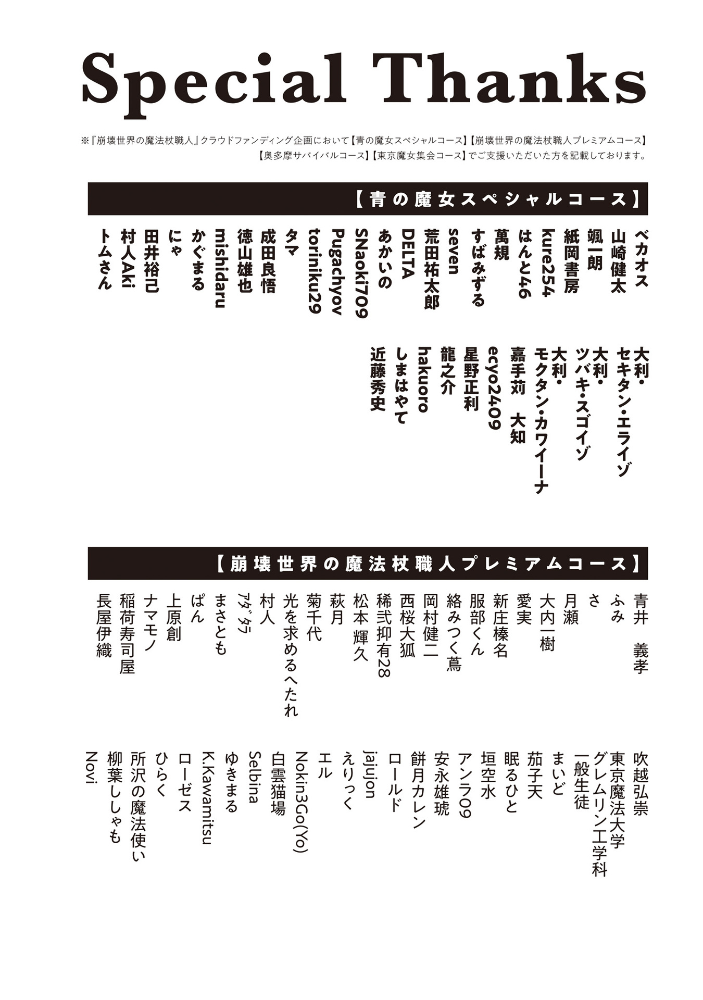
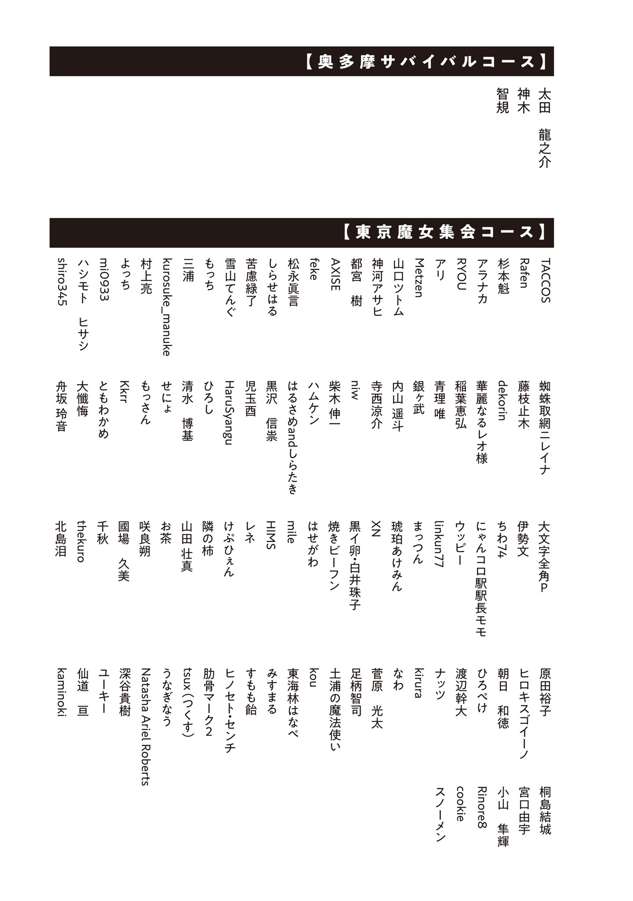

【番外編　ペットロス】

天高く馬肥ゆる秋。大[おお]日向[ひなた]慧[けい]は青梅[おうめ]市にある青の魔女の家を訪ねていた。

魔女の家とは言うけれど、メルヘンチックやホラーの雰囲気は無い。二階建ての一軒家の塀には有刺鉄線が張り巡らされ、大日向の身長では落ちたら最後二度と上がれない深さの空堀が掘られている。堀の縁に立ってそっと下を覗[のぞ]くと、半ば土を被[かぶ]った魔物の死骸と目が合ってしまい、慌てて顔を背けた。

クーデターを乗り越え、大怪獣を討伐し、食料危機対策を打ち出し、東京の人々はグレムリン災害から立ち直り始めている。それでも災害直後の残り香は色濃かった。魔物や暴徒への対策として大なり小なり要塞化された家屋は多い。

玄関先の紐[ひも]を引いて呼び鈴を鳴らすと、すぐに青の魔女が姿を現した。頭を下げ挨拶する大日向を見ると花咲く笑顔を浮かべ、中に入れてくれる。

「こんにちは、青さん」

「いらっしゃい、慧ちゃん！　上がって上がって」

「お邪魔します。これ、私が焼いたパンプキンパイです。良かったらどうぞ」

「えー!?　私に？　そんなに気を遣わなくていいのに、でもありがとね。本当に慧ちゃんは良い子だねぇ」

お土産を受け取るついでに軽く抱きしめられ、大日向も抱きしめ返した。

青の魔女はグレムリン災害を発端に数々の苦難を味わい、家族と友人を全員失っている。

青の魔女が自分に病死した妹を重ねて見ている事に、大日向は気付いていた。

自分と触れ合う事で少しでも心の傷が癒[い]えるのなら、大日向は嬉[うれ]しい。

青の魔女の事は年上の友達だと思っているが、一人っ子の大日向が優しくて美人な姉の存在を一度も妄想しなかったと言えば嘘[うそ]になる。

居間に通され、御機嫌の青の魔女に手ずから紅茶を淹[い]れてもらい、切り分けてもらったパンプキンパイを一緒に食べる。ひとしきり談笑してお腹[なか]も膨れたところで、大日向は二つの用件のうちの一つを切り出した。

「ところで青さん。相談があるんですけど」

「相談？　いいよ、なんでも言って」

親身になって優しく促してくれる青の魔女の善意につけこむようで気が引けたが、言わないわけにもいかない。未来視から頼まれた打診ではあるけれど、大日向も大事な事だと思っているから。

「あの、食料の話なんですけど」

「うん」

「保存食の賞味期限は五年程度です。今は保存食が高い資産価値を持っていますけど、豊穣[ほうじよう]魔法が広まるにつれて価値は下がります」

「そうだね。腐ったりカビたりするし」

「そうなんです。青さんはいっぱい保存食持ってますよね？　一人では百年かけても食べきれないぐらい。このままだと食べきれないままダメになっちゃう保存食がいっぱい出ると思うんです」

「ん。私もそう思うよ」

「青さんがウンと言ってくれるなら、食べきれない分の保存食を魔女集会で引き取れます。引き取った保存食の量に応じて、適切な広さの畑の所有権を保証するという条件があるんですけど。どうでしょう？」

つまり、死蔵され腐っていく食料を地主の立場と交換しないか？　という交渉だ。

豊穣魔法迂回[うかい]詠唱の普及を急ピッチで広めているとはいえ、まだまだ食料は配給制。都民に配給する保存食はどれだけあっても嬉しい。

大日向が提案すると、青の魔女は首を傾[かし]げた。

「未来視にそう言えって言われた？」

「……この打診案に同意したのは私です」

図星だったが、大日向は慎重に返した。

青の魔女は裏切られ続け失い続けた経歴から、疑い深くなった魔女だ。誰もが頼り一目置く未来視の魔法使いにも、警戒を隠そうとしない。

大日向にとっては初めて会った時からずっと優しくて親切なお姉さんだったが、青の魔女は懐に入れた身内以外にとても冷たいのだ。氷のように。

しかし青の魔女はアッサリ頷[うなず]いた。

「そう。いいよ。二日あれば引き渡し準備できる。文京[ぶんきよう]区まで持って行けばいい？」

「い、いいんですか？」

「慧ちゃんのお願いだからね」

あまりにも簡単に話が通ったので大日向は目を瞬[またた]いた。予想の三倍スムーズで、予想の三倍甘い。

青の魔女がドロドロに甘やかすのは自分に対してだけと知っていても、莫大[ばくだい]な食料資産を簡単に手放すのを目の当たりにすると心配になる。

「本当に良いんですか？　検討の時間をとったりとか」

「いい。なんなら勝手にもってってもいいよ」

青の魔女は気楽に言い、紅茶を飲みながら大日向に高級なビスケット缶を勧めてきた。

甘やかされている。すごく甘やかされている。

父も大概甘かったが、青の魔女も相当だった。

「では、ええっと、上にそう伝えておきますね。それから……もう一つ。こっちは大した話ではないんですけど、別件で相談があって」

「なんでも言って。私が全部解決してあげる」

頼もしく微笑[ほほえ]む青の魔女は凛々[りり]しくてカッコ良くて綺麗[きれい]で、キラキラした光が見えそうなぐらい眩[まぶ]しかった。継火の魔女や八王子[はちおうじ]の魔女が大ファンを公言してやまないのも良く分かる。

ニコニコしている青の魔女の視線が自分のお尻のあたりに向いているのに気付いた大日向は、顔を赤くして無意識にぶんぶん振っていた尻尾[しつぽ]を垂れ下げた。

「あぅ。ご、ごめんなさい。尻尾が言う事聞かなくて。こほん、それでもう一つの相談というのはですね、個人的な人間関係の悩みで」

「大利[おおり]か？　いい加減文通なんてやめて顔を出すように私から言おうか」

「あっそれは大丈夫です。そのあたりは大利さんのペースで大丈夫ですから。そうじゃなくて、実は最近身の回りに変な人がいて。物陰からじっと見られてる事に気付いた事も一度や二度じゃないんです。話しかけようとすると逃げられてしまって。警備の方が護[まも]って下さってはいるんですけど、ちょっと不安というか」

「ストーカーか」

「厳しい言い方をすれば、はい……」

「分かった。片付ける」

青の魔女はキュアノスを手にすぐさま立ち上がった。大日向に安心感のある温かい微笑みを向けてくれているのに、床に霜柱が立ちテーブルの上の紅茶は凍り付いた。

「わーっ!?　まままま待って下さい。あの、殺っ、死、違う、あの、力ずくで問題を解決して欲しいとかじゃなくてですね……！」

大日向は出撃しようとする青の魔女にすがりついて止め、事情を詳しく説明した。

しばらく前から周囲をうろつくようになったストーカーはいつも顔を隠していて身元が分からない。大日向についている護衛が捕まえようとしても、逃げ足が速くて捕まらない。

未来視の魔法使いに頼めば捕縛できるのは確実だが、いつも大量の仕事に忙殺され目の下の濃いクマが消えない東京の大黒柱に新しい頭痛の種を持ち込みたくなかった。

だから青の魔女に頼る事にした。魔女は人間を超越した感覚やパワー、スピード、魔法を持つ。ちょっと逃げ足が速い程度の人間が相手なら簡単に追い詰め捕まえられる。

「捕まえてどうする？」

「お話しします。嫌がらせとか声かけとかは何も無いんですよね。実害は受けていないんです。だからどうして私の周りをうろうろしてるのか理由を聞いて、私にできる事があればしたいです」

「ストーカー相手に……？」

「話してみて手に負えないタイプの変質者だったなら、ちゃんと法に則[のつと]った罰則を受けてもらいますよ？」

二人はストーカーの処遇についてしばらく問答したが、結局平和的解決を望む大日向に青の魔女が折れる形になった。

大日向は青の魔女を連れ、東京魔法大学へ戻った。日曜日で魔法言語学の講義は無いものの、研究室に用事がある。父の薫陶を受け幼い頃から呼吸するように言語学に触れてきた大日向にとって、魔法言語学の研究は仕事というより日常に近かった。

青の魔女は専門書とファイルが本棚の外にまで積み上げられ窓を半分塞いでいる雑然とした研究室に招かれ、古めかしい紙の黴臭[かびくさ]さにくしゃみをした。

「豊穣魔法迂回詠唱の研究は終わったって聞いてるけど。今は何を？」

「今は焔[ほのお]魔法基幹呪文の研究をしてます。発音不可音を含む詠唱では無いですけど、詠唱を改造して魔力の消費コストを落とせれば使いやすくなります。そもそも詠唱を改造してコストダウンする事が可能なのかどうか、という部分を含めての研究ですね」

「焔魔法ね。焔魔法の基幹呪文は弱すぎて魔物退治には使えない気がする」

話しながら青の魔女は窓際に寄り、油断なく外をぐるりと見回してからブラインドを絞った。

「魔物退治の武器にするためというより、生活のためですね。これから冬が来て暖房燃料の需要が増えますし、金属加工にも必要です。

ほら、雷雨の代わりに晶雨が降るようになって、屋根が傷みやすくなったじゃないですか？」

晶雨は気温が上がっても融[と]けない雹[ひよう]が降るようなものだ。ビニールハウスの類[たぐい]はあっという間に潰れたし、家々の屋根はボロボロになった。屋根が壊れれば雨漏りを起こし、すぐに家がダメになる。

「瓦を割ってしまうグレムリンの雨に負けない、金属製の強い屋根が必要なんです。でも生産が全然追いついてなくて。人手不足もありますが、燃料不足がボトルネックになってるので。焔魔法のコストダウンができれば暖房も金属加工も炊事もお風呂も、全部楽になります。だから優先的に研究しています」

「なるほど。ストーカーの正体が産業スパイ的な存在だったりする可能性は？」

「うーん……構内では見かけないんですよね。ほとんど。門のところに警備員さんがいますし、壁を乗り越えて侵入すれば目立ちますし。私の研究成果を狙ってナントカという話では無さそうです」

「なら慧ちゃん本人が目的なのか。ますますキモいな。死んだ方がいい」

直球で嫌悪感を口にする青の魔女に大日向は苦笑した。

グレムリン災害は平和に暮らしていた人々を追い詰め、余裕を奪った。平和な世の中なら普通でいられた人の、普通ではない部分を無理やりに引き出した。

あの日以来、口が悪くなった人は多い。変な思想に目覚めたり、偏った考え方をするようになった人も多い。

奥多摩[おくたま]の魔法杖[つえ]職人のように、潜んでいた変人が表に出てきただけという場合もあるけれど。

正十二面体フラクタル型魔法杖アレイスターで十数回の魔法実験をしてから、大日向はデータをまとめ分析し、新理論の構築に勤[いそ]しんだ。青の魔女は同じ部屋にいるのを忘れてしまうぐらい静かに見守っている。が、部屋の外の廊下で物音がするたびに部屋の壁越しに音の発生源を正確に目で追っていた。

やがて日も傾き、空が茜色[あかねいろ]に染まる。ずっと集中して研究をしていた大日向は首を回して大きく伸びをした。目もしょぼしょぼして、尻尾がしんなりする。

「お疲れ、慧ちゃん」

「あ。ありがとうございます」

そっと横から差し出された蒸しタオルを顔に押しつけ、ホカホカの温かさに癒[いや]される。目を覆っている間に尻尾と耳をそーっとくすぐられる感触がしたが、知らんぷりした。

大利と違い、青の魔女は触り過ぎるのは失礼だと考えているらしくいつも遠慮がちだ。

魅惑のフワフワは自分でも時々毛繕いしながら楽しんでいるぐらいだし、別に誰に触られても良いのだけれど……いやらしく触られなければ。

一休みしてから大学を出て帰宅する途中、大日向の横を歩く青の魔女は思慮深げに言った。

「慧ちゃんが研究している間、私も考えた。ストーカーが何日も続いているなら、犯人は近くに住んでいる可能性が高い。最近近所に引っ越してきた人だとか、身の回りで様子がおかしくなった人に心当たりは？」

「うーん……まさかとは思いますけど、大利さん……？」

「大利は除外でいい。あいつの様子がおかしいのは今に始まった事じゃない。他には？」

大日向は歩きながら腕組みして記憶を遡った。

視線を感じ始めた頃にあった事。身の回りの変化。もちろん、激動の時代だから毎日何かが起きるけれど、強いて言うなら？

頭の中で身の回りに起きた事を整理した大日向は、一つの事実に思い至った。

「そういえば。つけ回されるの、私がオコジョの姿の時だけです」

「ケモナー!?　本当に犯人大利説が出て来たな。いや大利なら面と向かって撫[な]でさせろとかなんとか言うか……変質者じゃなくて変態だったとは」

嫌悪を通り越しドン引きする青の魔女は、大日向と話し合いストーカーを罠[わな]にかける事を提案した。

オコジョ姿の時、大日向は無力で小さな獣だ。無力な時を狙ってつきまとってくるストーカーの存在はとても歓迎できない。

打ち合わせを済ませた大日向は魔法を唱えてオコジョに変身し、服と杖を青の魔女に預ける。

一人になって夕暮れ時の荒れた道路をテコテコ歩く大日向は、爆速で獲物が罠にかかった事を悟った。単独行動を始めて三分もたたないうちに、近くの傾いた電柱の陰に息を荒らげてじぃーっと自分を見つめる怪しい男の姿を見つけたのだ。

ゾッとして息を飲み、立ち止まる。

オコジョ視点で見上げる人間は、巨大だ。全てが大きく見えて圧倒されるのに、それが自分をつけ狙い監視している男だと思うと全身の毛が逆立つ。夕日に照らされ長く伸びた影と逆光でよく見えない表情のせいで、まるで人型の魔物に遭遇したような本能を揺さぶる恐怖があった。

「凍る投げ槍[ドウ・ヴアアラー]！」

しかし、その恐怖のストーカーは突如飛来した氷槍[ひようそう]が耳元を掠[かす]め悲鳴を上げた。氷槍は電柱を貫通し、その後ろの塀を破壊し、塀の向こうの民家に風穴を空けてようやく止まる。

人間に撃つシロモノではない強烈な魔女の一撃を見せつけられたストーカーは失禁して腰を抜かした。

大日向もちょっと腰が引けた。魔女の魔法は、人間の魔法と同じ呪文でも威力が段違いだった。魔法の威力を異常増幅するキュアノスを使っていればなおさら。

「ひ、ひぃいいいいい……！」

「カスが！　そのまま這[は]いつくばれ。不審な動きをしたら殺す」

屋根の上に伏せていた青の魔女はひらりと道路に下り、ストーカーの背を踏み後頭部にキュアノスを押しつけ警告した。

ガクガク震えながら頷くストーカーは、間近で見てみればなんの事はない普通の人間だった。

髪はボサボサで、げっそりやつれ、頬[ほお]も瞼[まぶた]も落ちくぼんでいる。しかし衣服は清潔で、目は観念したように伏せられていた。

少なくとも精神状態は普通だと見て取った大日向は、チョロチョロとストーカーの眼前まで駆け寄り、目の高さを合わせて問いかけた。

「あの。しばらく前から私の周りでうろうろしてる方ですよね？　怖いのでやめて欲しいです」

「ご、ごめんなさいぃ……」

「どうしてこんな事を？　ケモナー？　さんなんですか？」

動物好きに悪い人はいないと思ってはいるけれど。いざ自分が動物になってつけ回されるとしっかり怖い。

話し合って和解できるならお互いに納得できる着地点を探したいな、と考えながら尋ねると、ストーカーは幾度か口ごもり、苦しそうに答えた。

「ふ、ふーちゃんに似ていたからです……」

「ふーちゃん？」

大日向がコテンと首を傾げると、青の魔女とストーカーは同時にヴッと呻[うめ]いた。

「可愛[かわい]いの暴力！　や、やっぱりそっくりだ。

ふーちゃんは僕のペットのフェレットです。フェレットのふーちゃん。グレムリン災害で天国に行ってしまって。あなたを見た時、ふーちゃんが帰ってきたんだ！　って思って。

ご、ごめんなさい。間違ってる事なんて分かってるんです。違うのは分かってるんです。オコジョだし。ふーちゃんはもういない。

でも、でも、似てたから。ふーちゃんに似てたからぁっ……！」

ストーカーは何かを思い出し、身も世もなく大泣きを始めた。鼻水を垂らしアスファルトに濃い涙の染みを作るストーカーは、とても演技をしているようには見えない。本心に違いなかった。

「ペットロスか……」

青の魔女はストーカーを踏みつけ押さえ込んだままだったが、少し同情的に呟[つぶや]きキュアノスを引いた。

グレムリン災害は東京だけでも総人口の実に八割もの人々の命を奪い去った。

だが、失われた命は人間のものだけではない。家族同然に愛していたペットを失い、心に深い傷を負った者も多い。

大日向も昔ペットの文鳥を亡くし大泣きした経験があるため、ストーカーの気持ちが少し分かった。

「お悔み申し上げます。ふーちゃんさんの事は残念です。でも、私はふーちゃんさんではありません。これからは私の近くで怪しい事をしたりしないでくれませんか」

「ヴヴーッ……！」

涙と鼻水で顔をぐしゃぐしゃにしたストーカーは心底苦しそうに頷いた。酷[ひど]く悲しそうな顔を見ていると、心が痛くなる。

だが、まさか可哀[かわい]そうだからといってふーちゃんの身代わりになってあげるわけにもいかない。残酷なようだけれど、悲しみは自分で乗り越えてもらわなければ。

大日向が頷くと、青の魔女はストーカーの背から足をどけた。感傷的になっている大日向を拾い上げ、肩に乗せて立ち去ろうとする。

だが、その背にストーカーは縋[すが]りつくような声をかけた。

「待ってください！　その魔法を教えてくれませんか？」

「え？」

振り返ると、ストーカー男は渾身[こんしん]の土下座をしていた。

アスファルトで頭をすり下ろす勢いで深く頭を下げ、懇願してくる。

「お願いです。そのオコジョになる魔法を僕に教えて下さい！」

大日向が困惑して青の魔女の顔を見ると、青の魔女も同じ顔をしていた。

「……それは構いませんけど。フェレット変身じゃなくてオコジョ変身の魔法ですよ？　厳密に言えばオコジョですらありません。オコジョはこうやって人の言葉喋[しやべ]れませんしね。オコジョそっくりの別の生き物です。あと他人にかけられる魔法じゃないです。変身できるのは自分だけ。魔力消費も大きいです。常人の１００倍ぐらいの魔力を持っていないと発動しません。

もっと言えば魔法の効果が不安定で、変身できても尻尾の毛が全部抜けていたり、目が見えなかったり耳が聞こえなかったりといった事が多いです。正常なオコジョに変身できる確率は低い」

問題点を列挙したが、ストーカー男は悲しみの渦の中で希望の光を見たような目でまっすぐ大日向を見て力強く頷いた。

「大丈夫です。オコジョになればふーちゃんに近づけるんじゃないかと思うんです」

「そ、そうですか？　魔法の詠唱は発音難しいですし、覚えるの大変ですけど」

「僕、絶対音感あります。大丈夫です。どんな音でも一発で覚えられます！」

大日向は熱意に押され、ストーカー男にオコジョ変身魔法の詠唱文を教えた。

魔法語は地球の言葉と発音体系がかなり違う。それでいて正確に発音しないと効果がない。発音が合っていても魔力が足りなければどうしようもない。

99・９％無駄に終わると思いながら詠唱を教えた大日向だったが、即座に寸分の狂いも無く一度聞いた詠唱を繰り返したストーカーにまず驚愕[きようがく]した。

「裏を渡り[イエーヴ・ササ]、蔡を吐けば[ニムテツトツタナ]、窮鼠も白獣[ヤオグ・ヤヨグ・エンイエンシユオア]」

大日向は二度驚かされた。

呪文を唱えた途端、ストーカーは風船の破裂するような音を立て白い煙と共にオコジョに変身したのだ。

魔力は足りていた。

道路に落ちた服の中からモゾモゾ出てきたオコジョはつぶらな瞳をキラキラさせ、信じられない、という顔をして自分の両手を見つめる。

そしてオコジョ化したストーカーは興奮して叫び出した。

「ワァアアーッ！　ふーちゃんだ！　ふーちゃんだ！　ふーちゃんのおててだ！　ふーちゃんのモフモフ尻尾だ！　ウォオオオオオーッ！　すーはーすーはー、ふーちゃんの匂いだぁっ！　ぐぉおおおわあああっ！」

「ひえっ……」

「うわっ……」

元気溌剌[はつらつ]。大喜びで自分の尻尾を追いかけ回し始めたストーカーの姿に、二人はドン引きした。

自分が研究している魔法が誰かの傷を癒し、助けになるのは、大日向が望んでいた事だ。

ストーカーは正に大日向の魔法によって心救われた。喜ぶべき事である。

しかし、成人男性が変身したオコジョが自分の尻尾を追いかけぐるぐる回り興奮して放送禁止用語を含む偏愛を叫び感情を大爆発させているのを見ると、なんだか釈然としない。

「か、可愛くない。常人の１００倍の魔力を持つ変態だったか……」

普段人の悪口を言わないようにしている大日向も、青の魔女の的を射た言葉には流石[さすが]に頷いてしまった。

鬼に金棒。変態に魔法。

なんだかとんでもない事をしてしまった気がするけれど、本人が幸せそうで他人に迷惑をかけないなら良い事だ。きっと。たぶん。おそらく。

大日向はなんだかドッと疲れ、人間に戻る魔法の詠唱文を教えてから青の魔女の肩に乗り自宅に帰った。

大日向は弱冠十二歳にして多くの壮絶な体験をしてきた少女だ。

しかしこの日は色々な意味でとんでもない、記憶に残ってしまう日曜日になった。

あとがき

大人になると、子供の頃には分からなかった事が分かるようになる。

……と、大人は言うけど、大人になると子供の頃には分かった事が分からなくなる。

私は子供の頃、大人が「子供の気持ちが分からない」と言うのが理解できなかった。大人だって昔は子供だったのに、子供の気持ちが分からないの？　なんで？　昔の自分の気持ちだよ？　なんで分からないの？　忘れちゃったの？　記憶力ゴミなの？　と思っていた。

だから私は「今の（子供の）気持ちを絶ッッッ対に忘れないぞ！」と決意しながら育ち、大人になった。

私はスーパーマーケットでお菓子を買って欲しいのに買ってもらえなかった時の気持ちをまだ覚えている。自分の気持ちが母にちゃんと伝わっていないから買ってくれないんだ、気持ちが伝われば、これほど強く欲しいと思っているのが伝われば、絶対に買ってくれる、と確信して、店内の床に寝転がり全身でジタバタ暴れながらあらんかぎりの声を張り上げ「買って買って！」と泣き叫んだ。もうギャン泣きだった。

その気持ちをよく覚えているから、私はギャン泣きしてワガママを言っている子供を見るとニコッとしてしまう。その気持ち、分かるぞ。よーく分かる。子供に手を焼く親御さんには申し訳ないが、私はワガママを言って暴れ散らかす子供の味方だ。心情的には。

ところが、昔の気持ちを忘れまいと胸に刻みながら生きているのに、忘れてしまった事もある。

六年ほど前まで、私は小説を通して読者の時間を奪う事に喜びを感じていた。

ある小説の執筆に十時間をかけたとしよう。で、十一人の読者が、各々一時間かけてその小説を読む。すると私は十時間を消費し、読者たちから合計十一時間を奪った事になる。差し引きで一時間の儲[もう]けだ。これは嬉[うれ]しい！

私は残念ながらこの感情を忘れてしまった。

あの頃の気持ちが、今の私にはもう分からない。理屈は分かるが、心の底から湧き上がる感情は無くなってしまった。悲しい。

また一方で、新しく得た感情もある。

書籍を出版して読者の読了の呟[つぶや]きをＳＮＳで読む喜びとかね。へへへ。

失った気持ち、まだ持っている気持ち、新しく知った気持ち、色々ある。

新しい喜びを開拓しつつ、形骸化した感情の残骸を、昔の自分の想[おも]いの欠片[かけら]を無くさないよう、大切にしながら生きていきたい。

追記

実は本作には公式Ｘアカウントがあります。未解禁情報について口を滑らせたらマズイと思って黙りがちな作者に代わり、適切な形でドンドコ情報を出してくれているアカウントです。

新刊がいつ出るとか、新刊の書影はこういうのだとか、本作の関連イベントやってるよ～とか、色々な情報が最速で届きます。

興味がある方は是非フォローをお願いします。

興味が無い方でも、慈悲をかけると思ってフォローをお願いします。

大丈夫！　フォローなんて一瞬だよ、痛くないよ。ちょっとだけ、すぐ終わる！　みんなもフォローしてるから！　ね！　フォローするだけで痩せるし部活のレギュラーとれるしテストの点上がるし給料ＵＰするしモテるし寝付きが良くなるっていう噂[うわさ]は特にないけど。損はしないから。

では二巻のあとがきでまた会いましょう。

令和七年八月某日　黒留[くろどめ]ハガネ

