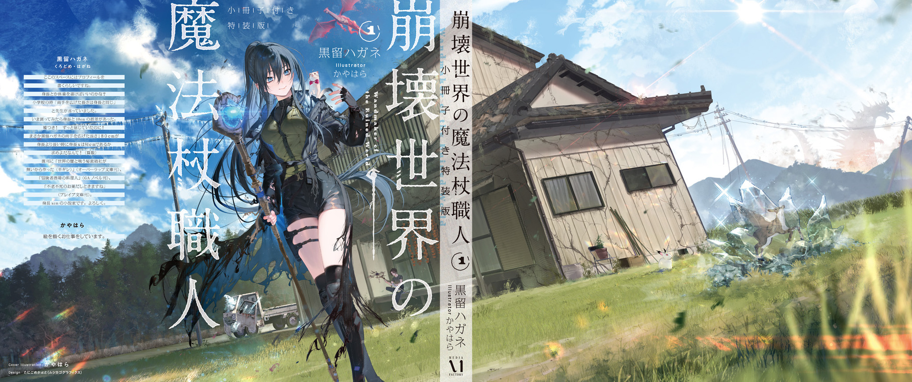

電子書籍特典　書き下ろし短編

『【晶雨】』

春から夏にかけては雨が多く、今日も大雨が降っている。

俺は家の窓枠にもたれかかり、厚く垂れこめる雨雲をぼんやり眺め、空から落ちてくるマジカルな結晶体が屋根を叩く硬い音に耳を澄ませた。

グレムリン災害が起きて世界は激変したが、天候の変化は特筆すべき物の一つだ。

つまり、晶雨の発生である。

雷雨が置き換わる形で登場したグレムリン結晶の雨……晶雨[しょうう]という新たな天候は、空からグレムリンが降ってくる迷惑天候だ。本来積乱雲の中に溜まり雷として地上に落ちるはずの電気がグレムリンに変わり、雨あられと大地に降り注ぐ。

激しく降れば傘を突き破るし、瓦をボロボロにして雨漏りの原因になる。物的被害は地味に大きい。

農業被害も大きい。作物の葉っぱをズタボロにしたり、収穫前の果実を傷付けたり。畑の土に小石（のような小粒グレムリン）が大量に混ざれば、根の伸長を妨げるし、芋類の作物の出来を悪くする。

晶雨は大雨を伴うから、土石流も引き起こす。大量の雨水が大量のグレムリンを巻き込んで破壊的な濁流を作り、河川を氾濫させたり、建物を壊したりする。排水溝の目詰まりの原因にもなる。

晶雨の被害は都市部ほど深刻で、魔女集会の数ある頭痛の種の一つなのだとか。

逆に言えば、田舎の奥多摩ではそんなにヤバい被害を受けていると感じた事はない。グレムリンを拾い集める魔物がいて、晶雨によって撒き散らされた大量の小粒グレムリンを勝手に掃除してくれるからだ。

俺が「鱗リス」と呼んでいるその魔物は、リスに鱗のヘルメットを被せたような見た目をしている。夜になると群れを成してウロチョロ走り回り、頬袋いっぱいにグレムリンを詰め込んで山へ帰っていく。お陰で奥多摩の道路や畑にはほとんどグレムリンが散らばっていない。

ただ鱗リスのグレムリン回収にも限度はある。

晶雨が長く降り続き大量に降り積もると、未回収のグレムリンが放置される事になる。そうなったら箒やザルを持ち出し、俺が手ずから畑のグレムリンの除去作業をしなければならない。

また、鱗リスは水中に潜れないため、川底に溜まったグレムリンも回収適用外だ。粒径が小さく軽いため放っておけば勝手に下流へ流されていくものの、多摩川の川底はまるで宝石が沈んでいるように煌めいている。下流の方ではグレムリンが砂に混ざって堆積しはじめているとか。生態系への影響は強そうだ。

鱗リスは中～大型生物を避ける習性があり、人間だらけの都市部では滅多に見かけないという。掃除屋がいない街中では人間が手作業でグレムリンを回収するグレムリン回収業に労力を費やさなければならない一方で、粒径こそ小さいが大量に手に入る均質な乳白色グレムリンは様々な実験に活用されていると聞く。

グレムリンは、魔法の産物だ。未だ発見されていない用途もきっと多い。

上手い活用法を見つければ、晶雨は文字通りの天からの恵みにもなり得る。

でもとりあえず今は畑仕事と屋根修理の手間を増やすカス天気に過ぎない。いや綺麗だけどね、こうやって空からキラキラとグレムリンが降ってくるのを見てると。

綺麗な薔薇には棘があり、綺麗な天気には害がある。俺は美しい魔法気象を眺めながらも、雨上がりの大仕事を思って憂鬱になった。

