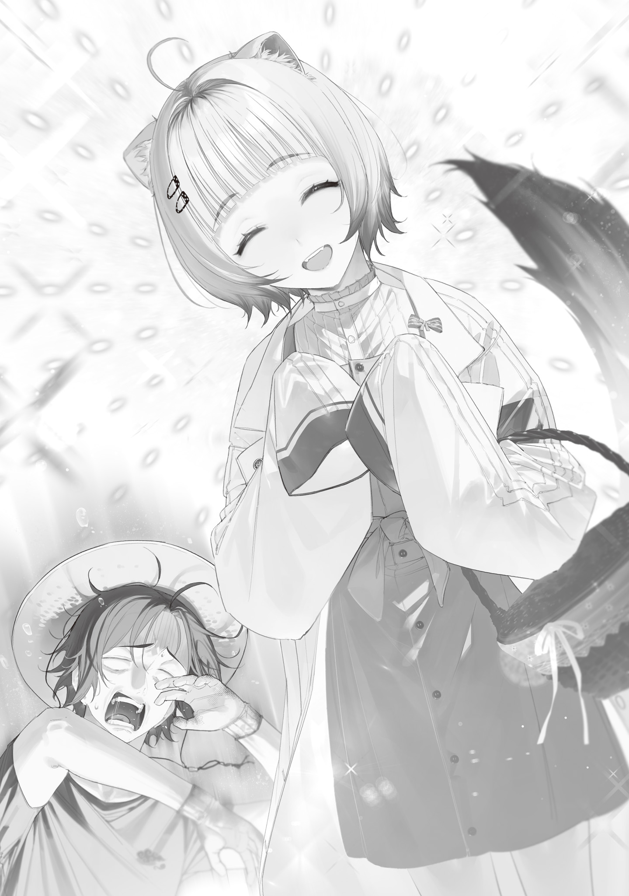

【便利魔法を覚えよう】

一年と半年前、地球に降り注いだシャンタク座流星群は人類から電気を奪い、代わりに魔法をもたらした。世に言うグレムリン災害だ。

電気によって栄えていた科学文明はたちまち崩壊。魔物やら魔女やらがポコジャカ生えてきて、世界は混沌[こんとん]の坩堝[るつぼ]と化した。

しかし、坩堝によって融[と]かされた混沌は時が経[た]ち冷え固まり形になりつつある。

人類は振り撒[ま]かれた混沌を乗りこなし、そこから新たなモノを手に入れる復興段階に入っていた。

特に大怪獣撃破と豊穣[ほうじよう]魔法迂回[うかい]詠唱開発による未曾有[みぞう]の大飢饉[だいききん]阻止は復興を象徴する出来事で、二つを成し遂げた魔女とオコジョに魔法杖[まほうづえ]を授けたのは俺の誇りだ。

俺は凄[すご]い魔法杖職人[ワンドメーカー]なのである。自惚[うぬぼ]れじゃない。

凄すぎてドラゴンに誘拐され、お宝の一つとして竜の巣にしまい込まれそうになったぐらいだ。これは人間国宝を自称しても良いのでは？

先程悪いドラゴンから俺を助け出してくれたマイフレンド・青の魔女は、竜の巣から取り返した荷物を俺と一緒に奥多摩[おくたま]まで送り届けてくれた。

家の前に荷車を停[と]め、荷物を降ろすのを手伝いながら、青の魔女はしつこく言い募る。

「なあ、やっぱり考え直さないか？　青梅[おうめ]にもっと安全で住み心地のいい家がある。こっちに引っ越せ」

「嫌だ。今の生活気に入ってんだよ。畑の世話もあるし。俺はずっと奥多摩に住む」

「また誘拐されたらどうする？　竜の魔女は躾[しつ]けたが、野良ドラゴンが来ないとも限らない。誘拐で済んだのは正直運が良かった。今度は護[まも]れないかも知れない……頼むから目が届くところにいてくれ」

「嫌だ」

「くっ。どうして慧[けい]ちゃんも大利[おおり]も私に護らせてくれないんだ……！」

青の魔女はもどかしそうに呻[うめ]いた。

そりゃ守りたいものが違うからじゃないっすかね。いや知らんけど。

「まあちょいちょい様子見に来て無事か確かめてくれるだけで俺としちゃ大助かりだ。そんな気にすんなよ。今回もお前が来てくれたおかげで助かったんだし。っていうかなんで俺が竜の巣に監禁されてるって分かったんだ？」

「リンゴのおすそ分けに行ったら家が壊れていたんだ。家の前に竜の足跡が残っていたし、田んぼは稲刈りの途中で放り出されている。何が起きたかすぐに分かったから、あのカスの巣に急いで走った」

「なるほどね」

言われてみれば確かに分かりやすい手がかり残ってたな。だいぶ露骨な誘拐現場だった。

犯人が犯行を隠す狡猾[こうかつ]さのない竜の魔女[バカ]でよかった～！

「私は心配だよ、大利。誘拐されたばかりなのにもうそんな気の抜けた顔してるし。お前には危機感が足りない。同じ奥多摩でももっと青梅寄りの家に引っ越すとか……」

「いや俺だって危機感はある。何も対策考えてないわけじゃないからな？　家の壁直すついでに鉄板かなんか仕込もうと思ってるし。あと隠し部屋作って逃げ込めるようにしたり。頭に血が上っても今度はドラゴンにつっかからんようにする」

「つっかかったのか!?　このバカッ！　隠れろって言っただろうが！」

青の魔女は心配を引っ込め怒り始めてしまった。

やべ口が滑った。

まあそれは俺が悪かったよ。迂闊[うかつ]だった。でも一番悪いのは竜の魔女なんだし、結果的には誰も傷つかなかった（竜の魔女は除く）って事も忘れないで欲しい。

ひとしきり俺に防衛意識について説教をしてきた青の魔女は、俺が聞いてるフリして真面目に聞いていない事に気付いたらしく、大きく溜息[ためいき]を吐[つ]いた。

「まったく。いくら警戒しても足りない危険な時代だという事が分かっていないな。もういい分かった。防犯体制については私の方でも何か考えておく。今日は帰るが、しっかり戸締りをして、夜は出歩くなよ。危ないと感じたら近づかず大人しくしていろ」

「了解カーチャン。あっ！！！　そうだ忘れてた。友達になったんならさあ、今度なんかカードゲームやらん？　デッキはウチにあるから。今までネット対戦しかした事ないんだけどさ、紙のカードも買うだけ買って持ってんだよ」

一人二役で一人回し疑似対戦するより、青の魔女と対戦した方がおもろそうだ。

友達を作りたいと思った事は生まれてこの方一度も無いが、友達がいればゲームの対戦相手に困らないし便利そうだなとは思ってたんだよな。

帰ろうとする青の魔女を呼び止めると、呆[あき]れかえった様子で言った。

「また呑気[のんき]な話を……トランプの話ではないよな？」

「ンなわけねーだろ。トレカだよ。トレーディングカードゲーム。知らんならルール教えてやるからさ」

「まあいいが。じゃあ、また明日」

青の魔女は心配そうに何度も振り返りながら青梅に帰っていった。

うーん、俺ってそんなに危機意識低いように見えるのかな？　解せぬ。

常にヘンデンショー持ち歩いて武装してるし、ポケットに痛み止めとか消毒液とか包帯のコンパクト救急セット入れてるし、山に入る時は崖に近づかないし、雨の次の日は山や川に近づかないようにしてるし。これでも気を付けてるんだけどな。

他地区と比べて格段に魔物が少なく弱く、人間関係のゴタゴタも起きない平和な奥多摩暮らしの俺と、なんかすげー悲劇の過去を乗り越えてきたらしい青の魔女では危機意識の水準が違うのかも知れない。

改めて令和って平和な時代だったんだな、と思うなどしつつ、俺は忠告通りしっかり戸締りをし、壊れた壁にブルーシートをかけて応急処置し、ちょこちょこ小物を作ってから飯食って夜更かしせず早めに寝た。

---

明けて翌朝、昼過ぎ。

田んぼの稲刈りの続きをしていた俺は二人の来客を迎えた。

いつものボロ黒衣に仮面姿の青の魔女と、秋物のオシャレな服を着たオコジョ教授だ。

俺はとりあえず青の魔女を手招きして呼び寄せ、小声で詰問した。

「てめー嫌がらせか？　なんで連れてきた？　用があるなら文通でいいだろ！」

「お前に今すぐ防衛に使える魔法を覚えてもらうためだ。大利は発音記号で魔法の詠唱書いて送られてもなかなか習得できないだろ？　慧ちゃんに直で習うのが一番早い」

「正論パンチやめろ」

大[おお]日向[ひなた]教授をチラッと見ると、爽やかな秋晴れの青空に負けないぐらい眩[まぶ]しい陽キャ全開の笑顔で、香ばしく美味[おい]しそうな匂いの漂うバスケットを掲げて見せてきた。

くっ！　ガキのクセに手土産を忘れない良い子！　だがそれが逆に俺の胃を痛めつける。人間形態の大日向教授と話してると自分の至らなさを思い知らされてるみたいでストレス溜[た]まるんだよな。

いや良い子だよ、良い子なんだけどさあ。これは嫌いとかではなく相性が悪いという話だ。

「ああそうだ、忘れないうちに。ちょっと待て」

これから始まるらしい臨時魔法講座に脳みそが絞られる前に、俺はいったん家に戻り写真立てを取って戻った。

「はいこれ、昨日助けてくれたお礼に作った写真立てだ。良かったら使ってくれ。妹さんピンクが好きで、文鳥飼ってたんだろ？　そのへんデザインに取り入れてみた」

青の魔女が妹の写真をミニアルバムに入れて持ち歩いているのは知っている（両親や幼馴染[おさななじみ]が映っていたと思[おぼ]しき部分は黒く塗りつぶされていた。闇深い）。

ミニアルバムはもうだいぶボロボロだったし、写真立てに移して飾っておくのはアリだと思うぞ。

青の魔女は俺が渡した写真立てを受け取ると、じーっと動かなくなる。そして石化魔法でもかけられたのかと思い始めた頃になって消え入りそうな震える声で言った。

「ありがとう」

「え。もしかして今泣きそうになってる？　なんで？」

「ちっ！　黙れ。人を気遣うなら五秒ぐらいはもたせろ」

「す、すまん。青の魔女と話してるとつい気が緩んで口が滑るんだよ。こういう感じで気安く喋[しやべ]れる相手を友達って言うんなら悪かねぇな」

「……お前は私の情緒をどうしたいんだ？」

青の魔女は大日向教授が俺達のやりとりを見てニッコニコしているのに気付いて咳払[せきばら]いした。

「とにかく、慧ちゃんに事情は話してある。身を守る魔法を教えてもらえ。私は奥多摩を回って近くの魔物を根絶やしにしてくる」

そう言って青の魔女はそそくさとキュアノス片手に山に入っていった。

残された大日向教授は、二人きりにされてかなり気まずい俺に隔意なく親しげに話しかけてくる。

「お久しぶりです、大利さん。文通はしていましたが、こうしてまたお会いできて嬉[うれ]しいです！　嬉しいですけど、やっぱり大利さんは私とお話するのしんどいですよね？　覚えやすくて使えそうな魔法をピックアップしてきたので、サーッと覚えちゃいましょう！　早く覚えれば早く終わります。頑張りましょうね！」

大日向教授はグッと拳を胸の前で握り、俺を励ましてくれた。

ウワーッ！　こわい！　そういう段取り良くて、こっちの気持ち考えてくれて、明るく寄り添ってくれるとこがダメなんだって！　もっと機械的かつ事務的に人間味無い感じで頼みたいけど教授の親切を無下にはできない。そういうとこだぞ（錯乱）。

「あ、じゃあ、また作業室で……いや作業室今壊れてるわ。居間で講義でいいか」

「はい。お邪魔しますね。それからこれ、新ジャガで作ったハッシュドポテトです。夕食にでもどうぞ！」

俺は稲刈りの最後のひと仕上げをしてから、大日向教授を連れて家に帰った。

温かいうちに食った方が旨[うま]いだろうという事で、白湯[さゆ]でハッシュドポテトをつまみながら教授のマンツーマン講義を受ける。

教授はルーズリーフに書き出したリストを片手にまず問診を始めた。

「では。

今回覚えていく魔法についてなんですけど、魔力量で制限がかかります。

強い魔物への対策には強い魔法が必要で、強い魔法は消費魔力量が多い。消費魔力量が多い魔法は高等で、発音不可音が含まれている場合が多いですが、中には例外もあります。

今日はそういった発音不可音を含まない便利な魔法の中で、大利さんの魔力量で使える魔法を一つか二つ覚えていきましょう。

そのために魔力量を把握したいです。大利さんは魔力が多いとお聞きしていますけど、射撃魔法基幹呪文連続使用可能回数換算でどれぐらいでしょう？」

「なにがなんて？」

理解が追いつかず聞き返すと、大日向教授は優しく言い直してくれる。

「えっと、一番簡単な魔法を連続で何回使えます？　ほら、ア゙ーって叫んで白いビームを出す、絶叫するビーバーみたいな呪文の」

「ああアレね。んー、そういやちゃんと計った事ねぇな。何回だろ……50か60ぐらい？　凍る投げ槍[ドウ・ヴアアラー]なら三発撃てる。四発は無理」

「ふむふむ。じゃあここから上は無理かな……フィーリングで答えてもらって大丈夫なんですけど『使い魔召喚』『迷子の霧を出す』『仮死状態になる』の三つのうちどれ覚えたいですか？」

「その中だと実質二択だろ。仮死状態になる魔法って役に立つのか？」

「魔物や魔女、魔法使いに五感と魔力で感知されにくくなります。詳しい原理までは分かっていませんけど」

「それは役に立つわ」

仮死状態って言うからには動けなくなるんだろうけど、敵をやり過ごす目的で使うなら超便利そう。戦わず切り抜けるための弱者の魔法って感じか。

「まあでも、使い魔召喚が一番興味あるかな」

「分かりました。じゃあ、使い魔召喚魔法を覚えていきましょう。えーっとですね、詠唱文はこんな感じです」

大日向教授は白紙のルーズリーフに大きく「息子の無事が分かるなら、この目を抉[えぐ]ってもいい」と物騒な和文を書いた。そこに「ヨモホロゲジュヤ・タケタテェエ、クンヌム・ワーア」とルビを振り、俺に見せてくる。

いや怖いんだけど。

「ちょっと待て。この魔法、自分の目を抉るのか？」

「いえ抉りません。大丈夫です。詠唱文がそうなってるだけで、魔法を唱えるとポンッて目玉の使い魔が出てきます。

この使い魔召喚魔法は、目玉の魔女さんの魔法です。基幹単語は『目玉[クンヌム]』。唱えると目玉の使い魔が一体出てきて、念じるだけで自在に動かせます。使い魔の視界を共有できる他に、音を聞いたり声を届けたりもできます。空を飛べるのも大きいですね。限界高度は地上10ｍ前後ですけど。

この魔法の特徴は一度唱えれば破壊されるか自壊させるまで出しっぱなしにできる事です。唱えた時に消費した魔力分、使用者の魔力最大量が減ってその分は回復しなくなりますが、例えば青さんに大利さんが出した使い魔を持っていてもらえば、緊急時にいつでも通信して助けを呼べます」

「実質ビデオ通話じゃん」

言ってる事やべーぞ。この電気＆通信網が破壊された世界で通信機を持てるって事？

えっぐ！　聞いた感じ偵察にも使えそう。情報アドバンテージ取り放題やんけ！

「その通りです。魔力消費量が多いので人間で使える人は珍しいですけど、大利さんなら一体召喚するだけならいけそうですね」

「この魔法って通話限界距離とかあんの？　これ以上は電波届かなくなりますよみたいな」

「良い質問です。通話距離は魔力コントロール技術に依存するみたいですね。目玉の魔女さんは半径１８０㎞ですけど、私が使ったら半径20㎞でした。大利さんが使ってもそれぐらいだと思います」

「20㎞か……」

ハッシュドポテトを食いながら地図を引っ張り出して確認すると、奥多摩から青梅までは届いていた。十分だ。

「あとですね、２、３㎏ぐらいまでの物なら運べますし、戦闘機能はありませんが囮[おとり]にはなります」

「ドローンとしても使えるのか。これ覚えるわ」

「え、他の魔法について聞かなくてもいいんですか？　私のオススメは迷子の霧の魔法ですけど」

「いや目玉にする。どう考えてもめちゃ便利だし」

数を揃[そろ]えればインターネットや通販を復活させるぐらいのポテンシャルがありそうなところも俺的には好印象。全世界に広まるべき魔法だ。魔力が少ないと使えないから難しいだろうが。

「確かにすごく便利ですもんね。分かりました！

では、早速練習していきましょう。はい、いっしょに大きな声で！

息子の無事が分かるなら[ヨモホロゲジユヤタケタテエエ]」

「ヨモホロゲジュヤタケタテタッ……噛[か]んだわ」

「大丈夫ですか？　そうですね、最初はゆっくり発音してみましょうか。タケタテェエは特に舌が絡まりやすいですから、そこを重点的に。

はいゆっくりと、りぴーとあふたみー！　分かるなら[タケタテエエ]」

「タケタテーエ。違うな、タケタテッ、タケタケ……キレそう」

「お、落ち着いて……！」

俺は休憩を挟みながら半日かけて目玉の使い魔の魔法を教わった。

休憩中に大日向教授が話してくれたが、竜の魔女から没収した赤魔石ブラッドムーンは吸血の魔法使いが弁護士に預けていた遺言状に従ってひとまず東京魔女集会預かりになっているらしい。

魔法語研究が進展し、魔力が多く戦闘能力のある一般人が育ったら、港[みなと]区の守護を条件に譲るという話だ。

どうやら吸血の魔法使いは魔女と魔法使いによる統治に限界を感じ、一般人の強化ひいては政治参加を推し進めようと計画していたらしい。

賢い。人類全体の技術や能力が底上げされれば、竜の魔女のような力はあるが性格カスな奴[やつ]をのさばらせずに済む。

元々強い魔女や魔法使いに魔石を持たせて更に強くするより、魔法を覚えた一般人に魔石を持たせ下駄[げた]を履かせる方が遥[はる]かに理に適[かな]っている。

俺が吸血の魔法使いを知ったのは彼が死んだ後になってからだが、彼について知るほど株が上がっていく。

そんな吸血の魔法使いの遺言に反して魔石をパクってポッケナイナイした竜の魔女の株はこの場にいないのに下がっていく。

やっぱ殺[や]っちまった方が良かったと思うぞ。躾[しつけ]の甲斐[かい]なく次なんかやらかしたら俺が言うまでもなく今度こそ青の魔女が仕留めに行くだろうけど。

ともあれ、吸血の魔法使いが発起人となり、未来視の魔法使いが引き継いだ大日向研究室の魔法語研究は着実に実を結んでいる。

俺は散々発音練習をした後にようやく召喚できたふよふよ浮かぶ目玉使い魔をつつきながら、連綿と受け継がれる人の意志、その成果に感謝した。

俺は人の絆[きずな]の輪からちょっと外れたところから手を伸ばして成果を使わせてもらうぜ！
